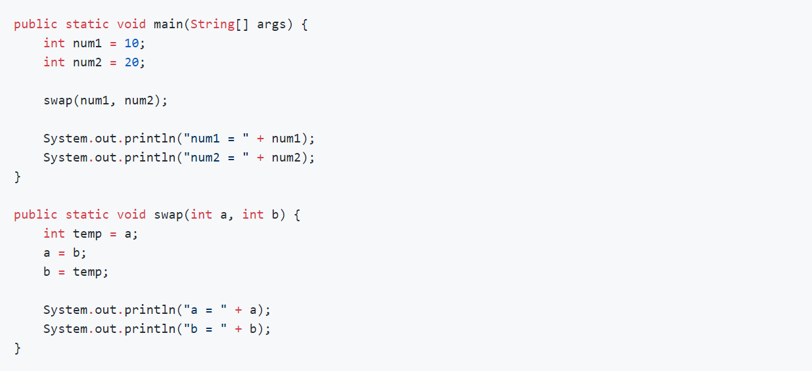
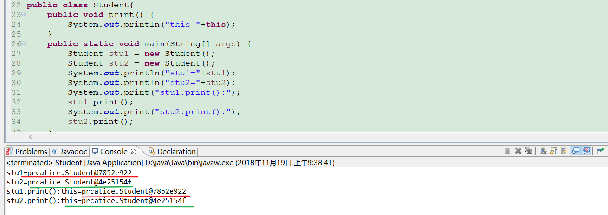
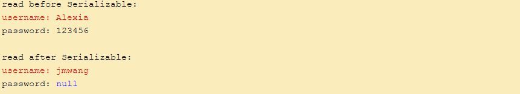
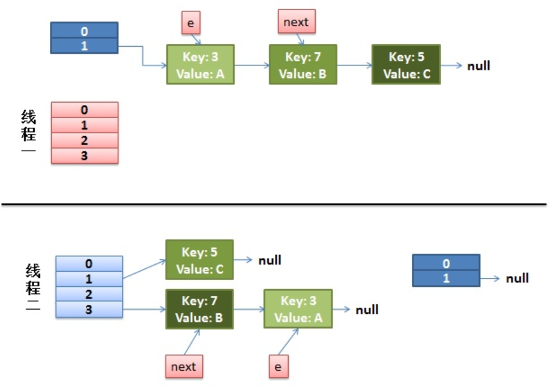
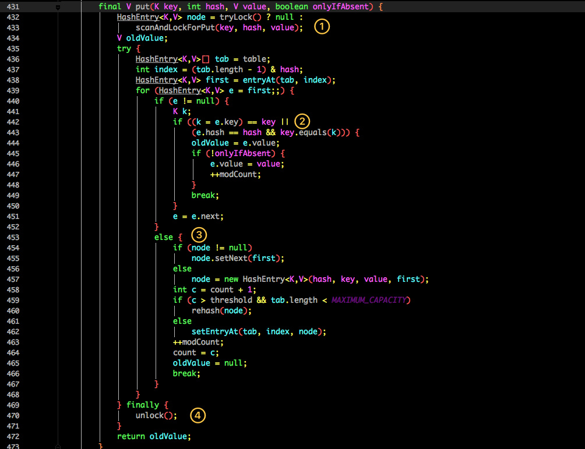
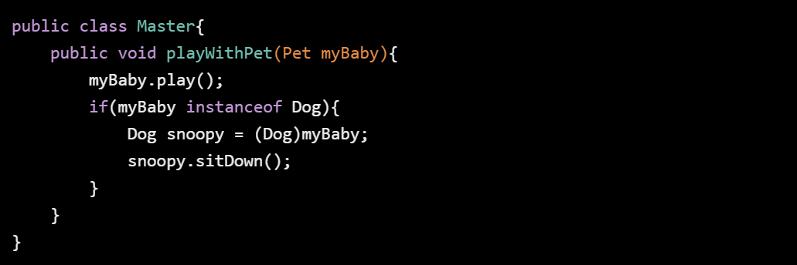
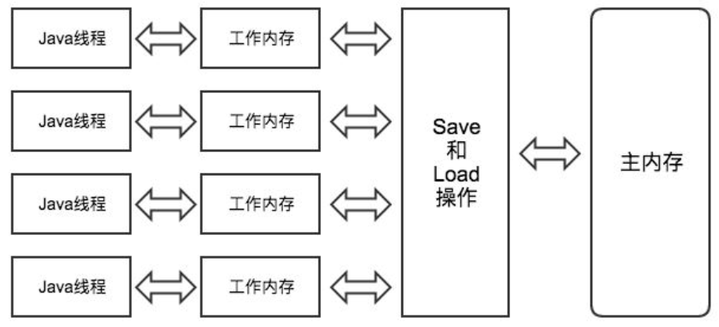

[TOC]

# 基本数据类型

Java语言提供了八种基本类型。六种数字类型（四个整数型，两个浮点型），一种字符类型，还有一种布尔型。一个字节表示8位。 

 

**byte：**

```
byte 数据类型是8位、有符号的，以二进制补码表示的整数；
最小值是 -128（-2^7）；
最大值是 127（2^7-1）；
默认值是 0；
byte 类型用在大型数组中节约空间，主要代替整数，因为 byte 变量占用的空间只有 int 类型的四分之一；
例子：byte a = 100，byte b = -50。
```

**short：**

```
short 数据类型是 16 位、有符号的，以二进制补码表示的整数
最小值是 -32768（-2^15）；
最大值是 32767（2^15 - 1）；
Short 数据类型也可以像 byte 那样节省空间。一个short变量是int型变量所占空间的二分之一；
默认值是 0；
例子：short s = 1000，short r = -20000。
```

**int：**

```
int 数据类型是32位、有符号的以二进制补码表示的整数；
最小值是 -2,147,483,648（-2^31）；
最大值是 2,147,483,647（2^31 - 1）；
一般地整型变量默认为 int 类型；
默认值是 0 ；
例子：int a = 100000, int b = -200000。
```

**long：**

```
long 数据类型是 64 位、有符号的以二进制补码表示的整数；
最小值是 -9,223,372,036,854,775,808（-2^63）；
最大值是 9,223,372,036,854,775,807（2^63 -1）；
这种类型主要使用在需要比较大整数的系统上；
默认值是 0L；
例子： long a = 100000L，Long b = -200000L。
"L"理论上不分大小写，但是若写成"l"容易与数字"1"混淆，不容易分辩。所以最好大写。
```

**float：**

```
float 数据类型是单精度、32位、符合IEEE 754标准的浮点数；
float 在储存大型浮点数组的时候可节省内存空间；
默认值是 0.0f；
浮点数不能用来表示精确的值，如货币；
例子：float f1 = 234.5f。
```

**double：**

```
double 数据类型是双精度、64 位、符合IEEE 754标准的浮点数；
浮点数的默认类型为double类型；
double类型同样不能表示精确的值，如货币；
默认值是 0.0d；
例子：double d1 = 123.4。
```

**boolean：**

```
boolean数据类型表示一位的信息；
只有两个取值：true 和 false；
这种类型只作为一种标志来记录 true/false 情况；
默认值是 false；
例子：boolean one = true。
```

**char：**

```
char类型是一个单一的 16 位 Unicode 字符；
最小值是 \u0000（即为0）；
最大值是 \uffff（即为65,535）；
char 数据类型可以储存任何字符；
例子：char letter = 'A';。
```

# 自动拆箱和自动装箱

自动装箱就是Java自动将原始数据类型值转换成对应封装类的对象，比如将int的变量转换成Integer对象，这个过程叫做装箱，反之将Integer封装类对象转换成int类型值，这个过程叫做拆箱。因为这里的装箱和拆箱是自动进行的非人为转换，所以就称作为自动装箱和拆箱。

```
原始数据类型byte,short,char,int,long,float,double,boolean
对应的封装类为Byte,Short,Character,Integer,Long,Float,Double,Boolean。
```

## 何时发生自动装箱和拆箱

自动装箱和拆箱在Java中很常见，比如我们有一个方法，接受一个对象类型的参数，如果我们传递一个原始类型值，那么Java会自动讲这个原始类型值转换成与之对应的对象。最经典的一个场景就是当我们向ArrayList这样的容器中增加原始类型数据时或者是创建一个参数化的类，比如下面的ThreadLocal。


## 举例说明

**赋值时**

这是最常见的一种情况，在Java 1.5以前我们需要手动地进行转换才行，而现在所有的转换都是由编译器来完成。


**方法调用时**

这是另一个常用的情况，当我们在方法调用时，我们可以传入原始数据值或者对象，同样编译器会帮我们进行转换。


show方法接受Integer对象作为参数，当调用show(3)时，会将int值转换成对应的Integer对象，这就是所谓的自动装箱，show方法返回Integer对象，而int result = show(3);中result为int类型，所以这时候发生自动拆箱操作，将show方法的返回的Integer对象转换成int值。

# 值传递和引用传递

首先回顾一下在程序设计语言中有关将参数传递给方法（或函数）的一些专业术语。**按值调用(call by value)表示方法接收的是调用者提供的值，而按引用调用（call by reference)表示方法接收的是调用者提供的变量地址。一个方法可以修改传递引用所对应的变量值，而不能修改传递值调用所对应的变量值。** 它用来描述各种程序设计语言（不只是Java)中方法参数传递方式。 

Java程序设计语言总是采用按值调用。也就是说，方法得到的是所有参数值的一个拷贝，也就是说，方法不能修改传递给它的任何参数变量的内容。

**下面通过 3 个例子来给大家说明**

**example 1**



运行结果：


解析：


在swap方法中，a、b的值进行交换，并不会影响到 num1、num2。因为a、b中的值，只是从 num1、num2 的复制过来的。也就是说，a、b相当于num1、num2 的副本，副本的内容无论怎么修改，都不会影响到原件本身。

**通过上面例子，我们已经知道了一个方法不能修改一个基本数据类型的参数，而对象引用作为参数就不一样，请看 example2。**

**example 2**


结果：


解析：


array 是 arr 的拷贝也就是一个对象的引用，也就是说 **array 和 arr 指向的时同一个数组对象。 因此，外部对引用对象的改变会反映到所对应的对象上。**

通过 example2 我们已经看到，实现一个改变对象参数状态的方法并不是一件难事。理由很简单，**方法得到的是对象引用的拷贝，对象引用及其他的拷贝同时引用同一个对象。**

很多程序设计语言（特别是，C++和Pascal)提供了两种参数传递的方式：值调用和引用调用。有些程序员（甚至本书的作者）认为Java程序设计语言对对象采用的是引用调用，实际上，这种理解是不对的。由于这种误解具有一定的普遍性，所以下面给出一个反例来详细地阐述一下这个问题。

**example 3**


运行结果：


解析：

交换之前：


交换之后：


通过上面两张图可以很清晰的看出： **方法并没有改变存储在变量 s1 和 s2 中的对象引用**。swap方法的参数x和y被初始化为两个对象引用的拷贝，这个方法交换的是这两个拷贝。

**总结**

**Java程序设计语言对对象采用的不是引用调用，实际上，对象引用是按值传递的。**

# 关键字


## try-catch-finally

**情况一：**finally语句在return语句执行之后return语句返回之前执行的。

```
package com.lx.fina;

public class FinallyTest1 {

    public static void main(String[] args) {

        System.out.println(test1());
    }

    public static int test1() {
        int b = 20;

        try {
            System.out.println("try block");

            return b += 80;
        }
        catch (Exception e) {

            System.out.println("catch block");
        }
        finally {

            System.out.println("finally block");

            if (b > 25) {
                System.out.println("b>25, b = " + b);
            }
        }

        return b;
    }
} 
```

执行结果：

 

说明return语句已经执行了再去执行finally语句，不过并没有直接返回，而是等finally语句执行完了再返回结果。

如果觉得这个例子还不足以说明这个情况的话，下面再加个例子加强证明结论：

```
package com.lx.fina;

public class FinallyTest11 {

    public static void main(String[] args) {

        System.out.println(test11());
    }

    public static String test11() {
        try {
            System.out.println("try block");

            return test12();
        } finally {
            System.out.println("finally block");
        }
    }

    public static String test12() {
        System.out.println("return statement");

        return "after return";
    }

}
```

执行结果：

 

说明try中的return语句先执行了但并没有立即返回，等到finally执行结束后再返回。

**情况二：**finally块中的return语句会覆盖try块中的return返回。

```
package com.lx.fina;

public class FinallyTest2 {

    public static void main(String[] args) {

        System.out.println(test2());
    }

    public static int test2() {
        int b = 20;

        try {
            System.out.println("try block");

            return b += 80;
        } catch (Exception e) {

            System.out.println("catch block");
        } finally {

            System.out.println("finally block");

            if (b > 25) {
                System.out.println("b>25, b = " + b);
            }

            return 200;
        }

//         return b;      会编译器报错
    }

}
```

执行结果：

 

这说明finally里的return直接返回了，就不管try中是否还有返回语句，这里还有个小细节需要注意，finally里加上return过后，finally外面的return b就变成不可到达语句了，也就是永远不能被执行到，所以需要注释掉否则编译器报错。

**情况三：**如果finally语句中没有return语句覆盖返回值，那么原来的返回值可能因为finally里的修改而改变也可能不变。

```
package com.lx.fina;

public class FinallyTest3 {

    public static void main(String[] args) {

        System.out.println(test3());
    }

    public static int test3() {
        int b = 20;

        try {
            System.out.println("try block");

            return b += 80;
        } catch (Exception e) {

            System.out.println("catch block");
        } finally {

            System.out.println("finally block");

            if (b > 25) {
                System.out.println("b>25, b = " + b);
            }

            b = 150;
        }

        return 2000;
    }

}
```

执行结果：

 

```
package com.lx.fina;

import java.util.*;

public class FinallyTest33
{
    public static void main(String[] args) {
//        System.out.println(getMap().get("KEY").toString());

        System.out.println(test().num);
    }


    public static Map<String, String> getMap() {
        Map<String, String> map = new HashMap<String, String>();
        map.put("KEY", "INIT");

        try {
            map.put("KEY", "TRY");
            return map;
        }
        catch (Exception e) {
            map.put("KEY", "CATCH");
        }
        finally {
            map.put("KEY", "FINALLY");
            map = null;
        }

        return map;
    }

    private static Num test(){
        Num number = new Num();

        number.num=30;

        try{
            System.out.println("try");
            return number;
        }catch(Exception e){
            System.out.println("error");
        }finally{
            if (number.num > 20){
                System.out.println("number.num>20 : " + number.num);
            }
            System.out.println("finally");
            number.num = 100;
        }
        return number;
    }


}

```

执行结果：

 

 

如果return的数据是基本数据类型或文本字符串，则在finally中对该基本数据的改变不起作用，try中的return语句依然会返回进入finally块之前保留的值。

如果return的数据是引用数据类型，而在finally中对该引用数据类型的属性值的改变起作用，try中的return语句返回的就是在finally中改变后的该属性的值。


**情况四：** try块里的return语句在异常的情况下不会被执行，这样具体返回哪个看情况。

```
package com.lx.fina;

public class FinallyTest4 {

    public static void main(String[] args) {

        System.out.println(test4());
    }

    public static int test4() {
        int b = 20;

        try {
            System.out.println("try block");

            b = b / 0;

            return b += 80;
        } catch (Exception e) {

            b += 15;
            System.out.println("catch block");
        } finally {

            System.out.println("finally block");

            if (b > 25) {
                System.out.println("b>25, b = " + b);
            }

            b += 50;
        }

        return b;
    }

}
```

执行结果：

 

这里因为在return之前发生了除0异常，所以try中的return不会被执行到，而是接着执行捕获异常的catch 语句和最终的finally语句，此时两者对b的修改都影响了最终的返回值，这时return b;就起到作用了。当然如果你这里将return b改为return 300什么的，最后返回的就是300，这毋庸置疑。

**情况五：**当发生异常后，catch中的return执行情况与未发生异常时try中return的执行情况完全一样。

```
package com.lx.fina;

public class FinallyTest5 {

    public static void main(String[] args) {

        System.out.println(test5());
    }

    public static int test5() {

        int b = 20;

        try {
            System.out.println("try block");

            b = b /0;

            return b += 80;
        } catch (Exception e) {

            System.out.println("catch block");
            return b += 15;
        } finally {

            System.out.println("finally block");

            if (b > 25) {
                System.out.println("b>25, b = " + b);
            }

            b += 50;
        }

        //return b;
    }

}
```

执行结果：

 

说明了发生异常后，catch中的return语句先执行，确定了返回值后再去执行finally块，执行完了catch再返回，finally里对b的改变对返回值无影响，原因同前面一样，也就是说情况与try中的return语句执行完全一样。

总结：finally块的语句在try或catch中的return语句执行之后返回之前执行且finally里的修改语句可能影响也可能不影响try或catch中 return已经确定的返回值，若finally里也有return语句则覆盖try或catch中的return语句直接返回。

## final，finalize和finally的不同之处

**final:**用于声明属性，方法和类，分别表示属性不可变（常量），方法不可覆盖，类不可被继承。

对于一个final变量，如果是基本数据类型的变量，则其值一旦被初始化之后便不能更改；如果是引用类型的变量，则在对其初始化之后便不能再让其指向另一个对象。当用final修饰一个类时，表明这个类不能被继承，final类中的所有成员方法都会被隐式地指定为final方法。

**finally:**异常处理语句结构的一部分，表示总是执行。

**finalize:**Object类的一个方法，在垃圾回收器执行的时候会调用被回收对象的此方法，供垃圾收集时的其他资源回收，例如关闭文件等。该方法更像是一个对象生命周期的临终方法，当该方法被系统调用则代表该对象即将“死亡”，但是需要注意的是，我们主动行为上去调用该方法并不会导致该对象“死亡”，这是一个被动的方法(其实就是回调方法)，不需要我们调用。

## throw与throws

异常处理是对可能出现的异常进行处理，以防止程序遇到异常时被卡死，处于一直等待，或死循环。异常有两个过程，一个是抛出异常；一个是捕捉异常。

抛出异常有三种形式，一是throw，一个throws，还有一种系统自动抛异常。下面它们之间的异同。

### 系统自动抛异常

当程序语句出现一些逻辑错误、主义错误或类型转换错误时，系统会自动抛出异常。如：

```
public static void main(String[] args) {
		int a = 5, b =0;
		System.out.println(5/b);
		//function();
}
```

系统会自动抛出ArithmeticException异常：

```
Exception in thread "main" java.lang.ArithmeticException: / by zero

at test.ExceptionTest.main(ExceptionTest.java:62)
```

再如

```
public static void main(String[] args) {
		String s = "abc";
		System.out.println(Double.parseDouble(s));
		//function();
} 
```

系统会自动抛出NumberFormatException异常：

```
Exception in thread "main" java.lang.NumberFormatException: For input string: "abc"

at sun.misc.FloatingDecimal.readJavaFormatString(FloatingDecimal.java:1224)

at java.lang.Double.parseDouble(Double.java:510)

at test.ExceptionTest.main(ExceptionTest.java:62)
```

### throw

throw是语句抛出一个异常。

```
语法：throw (异常对象); 

如：  throw e;
```

一般会用于程序出现某种逻辑时程序员主动抛出某种特定类型的异常。如：

```
public static void main(String[] args) {
		String s = "abc";
		if(s.equals("abc")) {
			throw new NumberFormatException();
		} else {
			System.out.println(s);
		}
		//function();
}

```

会抛出异常：

```
Exception in thread "main" java.lang.NumberFormatException

at test.ExceptionTest.main(ExceptionTest.java:67)
```

### throws

throws是方法可能抛出异常的声明。(用在声明方法时，表示该方法可能要抛出异常)

```
语法：[(修饰符)](返回值类型)(方法名)([参数列表])[throws(异常类)]{......}

如：   public void function() throws Exception{......}
```

当某个方法可能会抛出某种异常时用于throws 声明可能抛出的异常，然后交给上层调用它的方法程序处理。如：

	public static void function() throws NumberFormatException{
			String s = "abc";
			System.out.println(Double.parseDouble(s));
		}
		
		public static void main(String[] args) {
			try {
				function();
			} catch (NumberFormatException e) {
				System.err.println("非数据类型不能转换。");
				//e.printStackTrace();
			}
	}

处理结果如下：

```
非数据类型不能转换。（main函数中进行的处理）
```

**throw与throws的比较**

```
1.throws出现在方法函数头；而throw出现在函数体中。

2.throws表示出现异常的一种可能性，并不一定会发生这些异常；throw则是抛出了异常，执行throw则一定抛出了某种异常对象。

3.两者都是消极处理异常的方式（这里的消极并不是说这种方式不好），只是抛出或者可能抛出异常，但是不会由函数去处理异常，真正的处理异常由函数的上层调用处理。
```

## static关键字

static是静态修饰符，什么叫静态修饰符呢？大家都知道，在程序中任何变量或者代码都是在编译时由系统自动分配内存来存储的，而所谓静态就是指在编译后所分配的内存会一直存在，直到程序退出内存才会释放这个空间，也就是只要程序在运行，那么这块内存就会一直存在。

这样做有什么意义呢？在Java程序里面，所有的东西都是对象，而对象的抽象就是类，对于一个类而言，如果要使用它的成员，那么普通情况下必须先实例化对象后，通过对象的引用才能够访问这些成员，但是用**static修饰的成员可以通过类名加“.”进行直接访问。**

**在Java中static表示“全局”或者“静态”的意思，用来修饰成员变量和成员方法，当然也可以修饰代码块和内部类。**

**被static修饰的成员变量和成员方法独立于该类的任何对象。也就是说，它不依赖类特定的实例，被类的所有实例共享。**只要这个类被加载，Java虚拟机就能根据类名在运行时数据区的方法区内找到他们。因此，static对象可以在它的任何对象创建之前访问，无需引用任何对象。

用public修饰的static成员变量和成员方法本质是全局变量和全局方法，当声明它类的对象时，不生成static变量的副本，而是类的所有实例共享同一个static变量。

static变量前可以有private修饰，表示这个变量可以在类的静态代码块中，或者类的其他静态成员方法中使用（当然也可以在非静态成员方法中使用），但是不能在其他类中通过类名来直接引用，这一点很重要。实际上你需要搞明白，private是访问权限限定，static表示不要实例化就可以使用，这样就容易理解多了。static前面加上其它访问权限关键字的效果也以此类推。

static修饰的成员变量和成员方法习惯上称为静态变量和静态方法，可以直接通过类名来访问，访问语法为：

```
类名.静态方法名(参数列表...) 

类名.静态变量名
```

用static修饰的代码块表示静态代码块，当Java虚拟机（JVM）加载类时，就会执行该代码块。

### static变量

按照是否是静态的对类成员变量进行分类可分两种：**一种是被static修饰的变量，叫静态变量或类变量；另一种是没有被static修饰的变量，叫实例变量。**两者的区别是：

**对于静态变量在内存中只有一个拷贝（节省内存），JVM只为静态变量分配一次内存，在加载类的过程中完成静态变量的内存分配。可用类名直接访问（方便），当然也可以通过对象来访问（但是这是不推荐的）。**

对于实例变量，每创建一个实例，就会为实例变量分配一次内存，实例变量可以在内存中有多个拷贝，互不影响（灵活）。 

### static方法

**static 可用于修饰方法，被static修饰的方法称静态方法，也称类方法。**静态方法可以直接通过类名调用，任何的实例也都可以调用，因此**静态方法中不能用this和super关键字**，**不能直接访问所属类的实例变量和实例方法**(就是不带static的成员变量和成员成员方法)，只能访问所属类的静态成员变量和静态成员方法。由于它在类加载的时候就存在了，它不依赖于任何实例，所以static方法必须实现，也就是说它不能是抽象方法。 

### static代码块

**static代码块也叫静态代码块**，是在类中独立于类成员的static语句块，可以有多个，位置可以随便放，它不在任何的方法体内，JVM加载类时会执行这些静态的代码块，如果static代码块有多个，**JVM将按照它们在类中出现的先后顺序依次执行它们，每个代码块只会被执行一次**。例如： 

```
public class Test5 {
    private static int a;
    private int b;
    static {
        Test5.a = 3;
        System.out.println(a);
        Test5 t = new Test5();
        t.f();
        t.b = 1000;
        System.out.println(t.b);
    }
    static {
        Test5.a = 4;
        System.out.println(a);
    }
    public static void main(String[] args) {
        // TODO 自动生成方法存根
    }
    static {
        Test5.a = 5;
        System.out.println(a);
    }
    public void f() {
        System.out.println("hhahhahah");
    }
}
```

执行结果：

 

**static和final一块用表示什么？**

static final用来修饰成员变量和成员方法，可简单理解为“全局常量”！

```
对于变量，表示一旦给值就不可修改，并且通过类名可以访问。

对于方法，表示不可覆盖，并且可以通过类名直接访问。 
```

特别要注意一个问题：

对于被static和final修饰过的实例常量，实例本身不能再改变了，但对于一些容器类型（比如，ArrayList、HashMap）的实例变量，**不可以改变容器变量本身，但可以修改容器中存放的对象**，这一点在编程中用到很多。看个例子：

```
package com.lx.fina;

import java.util.ArrayList;

public class TestStaticFinal {
    private static final String strStaticFinalVar ="aaa";
    private static String strStaticVar =null;
    private final String strFinalVar = null;
    private static final int intStaticFinalVar = 0;
    private static final Integer integerStaticFinalVar =new Integer(8);
    private static final ArrayList<String>alStaticFinalVar = new ArrayList<String>();

    private void test() {
        System.out.println("-------------值处理前----------\r\n");
        System.out.println("strStaticFinalVar=" +strStaticFinalVar + "\r\n");
        System.out.println("strStaticVar=" +strStaticVar + "\r\n");
        System.out.println("strFinalVar=" +strFinalVar + "\r\n");
        System.out.println("intStaticFinalVar=" +intStaticFinalVar + "\r\n");
        System.out.println("integerStaticFinalVar=" +integerStaticFinalVar + "\r\n");
        System.out.println("alStaticFinalVar=" +alStaticFinalVar + "\r\n");
        //strStaticFinalVar="哈哈哈哈";        //错误，final表示终态,不可以改变变量本身.
        strStaticVar = "哈哈哈哈";               //正确，static表示类变量,值可以改变.
        //strFinalVar="呵呵呵呵";                    //错误, final表示终态，在定义的时候就要初值（哪怕给个null），一旦给定后就不可再更改。
        //intStaticFinalVar=2;                        //错误, final表示终态，在定义的时候就要初值（哪怕给个null），一旦给定后就不可再更改。
        //integerStaticFinalVar=new Integer(8);            //错误, final表示终态，在定义的时候就要初值（哪怕给个null），一旦给定后就不可再更改。
        alStaticFinalVar.add("aaa");       //正确，容器变量本身没有变化，但存放内容发生了变化。这个规则是非常常用的，有很多用途。
        alStaticFinalVar.add("bbb");       //正确，容器变量本身没有变化，但存放内容发生了变化。这个规则是非常常用的，有很多用途。
        System.out.println("-------------值处理后----------\r\n");
        System.out.println("strStaticFinalVar=" +strStaticFinalVar + "\r\n");
        System.out.println("strStaticVar=" +strStaticVar + "\r\n");
        System.out.println("strFinalVar=" +strFinalVar + "\r\n");
        System.out.println("intStaticFinalVar=" +intStaticFinalVar + "\r\n");
        System.out.println("integerStaticFinalVar=" +integerStaticFinalVar + "\r\n");
        System.out.println("alStaticFinalVar=" +alStaticFinalVar + "\r\n");
    }
    public static void main(String args[]) {
        new TestStaticFinal().test();
    }
}
```

执行结果：

 

### java static块和static方法的使用区别

如果有些代码必须在项目启动的时候就执行，就需要使用静态代码块，这种代码是自动执行的；

需要在项目启动的时候就初始化但是不执行，在不创建对象的情况下，可以供其他程序调用，而在调用的时候才执行，这需要使用静态方法，这种代码是被动执行的。 静态方法在类加载的时候就已经加载可以用类名直接调用。

静态代码块和静态方法的区别是：

```
静态代码块是自动执行的;静态方法是被调用的时候才执行的。

静态方法：如果我们在程序编写的时候需要一个不实例化对象就可以调用的方法，我们就可以使用静态方法，具体实现是在方法前面加上static，如下：

public static void method(){}
```

在使用静态方法的时候需要注意一下几个方面：

在静态方法里只能直接调用同类中其他的静态成员（包括变量和方法），而不能直接访问类中的非静态成员。**这是因为，对于非静态的方法和变量，需要先创建类的实例对象后才可使用，而静态方法在使用前不用创建任何对象。**

静态方法不能以任何方式引用this和super关键字，因为静态方法在使用前不用创建任何实例对象，当静态方法调用时，this所引用的对象根本没有产生。

静态程序块：当一个类需要在被载入时就执行一段程序，这样可以使用静态程序块。

### 静态内部类

外部类如何调用静态内部类中的属性和方法

```
1.外部类可以通过创建静态内部类实例的方法来调用静态内部类的非静态属性和方法

2.外部类可以直接通过“ 外部类.内部类.属性（方法）” 的方式直接调用静态内部类中的静态属性和方法
```

静态内部类如何调用外部类的属性和方法　

```
静态内部类如果要访问外部的成员变量或者成员方法，那么必须是静态的

1.静态内部类可以直接调用外部类的静态属性和方法

2.静态内部类可以通过创建外部类实例的方法调用外部类的非静态属性和方法
```

如何创建静态内部类实例

```
创建静态内部类的时候是不需要将静态内部类的实例对象绑定到外部类的实例对象上，静态内部类属于外部类，而不是属于外部类的对象

1.在非外部类中：外部类名.内部类名 name = new 外部类名.内部类名();

2.在外部类中：内部类名 name = new 内部类名();

```

静态内部类示例：

    public class Outer {
        // 定义一个实例变量和一个静态变量
        private int a;
        private static int b;
    
        // 定义一个静态方法和一个非静态方法
        public static void say() {
        }
    
        public void test() {
            // 在外部类中调用内部类的属性和方法
            Outer.Inner.c = 1; // 可以通过静态内部类的全类名来调用静态内部类的静态属性（外部类名.静态内部类名.属性）
            Outer.Inner.go(); // 可以通过静态内部类的全类名来调用静态内部类的静态方法（外部类名.静态内部类名.方法）
            // Outer.Inner.walk(); //不能通过类静态内部类的全类名来调用内部类的非静态属性和方法
            Inner inner = new Inner(); //可以通过创建内部类实例来调用静态内部类的非静态属性和方法
            inner.d = 1;
            inner.walk(); 
        }
    
        // 静态内部类
        public static class Inner {
            // 在静态内部类中定义一个静态变量和一个实例变量
            static int c;
            int d;
            // 定义一个匿名代码块和一个静态代码块
            {
            }
            static {
            }
    
            // 定义一个静态方法和一个普通方法
            public static void go() {
                
            }
    
            public void walk() {
                // 在静态内部类中调用外部类的属性和方法
                int f = b; // 可以直接调用外部类的静态属性
                say(); // 可以直接调用外部类的静态方法
                // int e = a; 直接调用外部类的非静态属性出错编译出错
                // test(); 直接调用外部类的非静态方法时编译出错
                Outer outer = new Outer();
                int e = outer.a; // 可以通过创建外部类实例来调用外部类的非静态属性
                outer.test(); // 可以通过创建外部类实例来调用外部类的非静态方法
            }
        }
    }
## Java中访问修饰符public、private、protected、default范围

 

### 公有访问修饰符-public

被声明为public的类、方法、构造方法和接口能够被任何其他类访问。如果几个相互访问的public类分布在不同的包中，则需要导入相应public类所在的包。由于类的继承性，类所有的公有方法和变量都能被其子类继承。

以下函数使用了公有访问控制：

```
public class Father {
   public String name;
   public String getName() {
      return this.name;
   }
   public void setName(String name) {
      this.name = name;
   }
}
public class Test{
public static void main(String args[]) {
        Father ft = new Father();
ft.setName("素文宅博客");
        System.out.println(ft.data);// 共有变量，可以从外部类中访问
        ft.getName();// 共有方法，可以从外部类中访问
   }
}
```

Java 程序的 main() 方法必须设置成公有的，否则，Java 解释器将不能运行该类。

### 受保护的访问修饰符-protected

被声明为protected的变量、方法和构造器能被同一个包中的任何其他类访问，也能够被不同包中的子类访问（其它类不能访问）。注意protected访问修饰符不能修饰类（只考虑外部类）和接口，方法和成员变量能够声明为 protected，但是接口的成员变量和成员方法不能声明为protected。子类能访问protected修饰符声明的方法和变量，保护其它不相关的类使用这些方法和变量。

实例：父类使用protected访问修饰符，子类继承父类重写父类的isReal()方法。

```
class Father {
   protected boolean isReal(int num) {
      //... 业务处理
   }
}
 
class Sun extends Father {
   boolean isReal(int num) {
      //... 业务处理
   }
}
```

 注意Java中继承规则：

```
父类中声明为public的方法在子类中也必须为public。

父类中声明为protected的方法在子类中要么声明为protected，要么声明为public，不能声明为private。

父类中声明为private的方法，不能够被继承。
```

### 默认访问修饰符-default（可以不使用任何关键字）

使用default访问修饰符声明的类、变量和方法，对同一个包内的类是可见的。接口里的变量都隐式声明为 public static final，而接口里的方法默认情况下访问权限为 public。

实例：变量和方法的声明可以不使用任何修饰符，其实默认就是default。

```
Class User{
    String name;
    void getName(){
        return name;
    }
}
```

### 私有访问修饰符-private

被声明为private的方法、变量和构造方法只能被所属类访问，并且类和接口不能声明为private。声明为私有访问类型的变量只能通过类中公共（public）的getter方法被外部类访问。其作用主要用来隐藏类的实现细节和保护类的数据。

实例：使用私有访问修饰符

```
public class Father {
   private String name;
   public String getName() {
      return this.name;
   }
   public void setName(String name) {
      this.name = name;
   }
}
public class Test{
public static void main(String args[]) {
        Father ft = new Father();
ft.setName("素文宅博客");
        System.out.println(ft.data);// 私有变量，不可以从外部类中直接访问，因此有编译错误
        ft.getName();// 共有方法，可以从外部类中访问
   }
}
```

## super和this关键字

Java关键字this只能用于方法方法体内。**当一个对象被创建后，Java虚拟机（JVM）就会为这个对象分配一个指向对象本身的指针，这个指针的名字就是 this。**因此，this只能在类中的非静态方法中使用，静态方法和静态的代码块中绝对不能出现this，并且this只和特定的对象关联，而不和类关联，同一个类的不同对象有不同的this。

**引用成员变量**

当我们写参构造函数时，会倾向于将形参名取与将要赋值的属性名相同，这样就更容易看见形参就知道它是给哪个属性赋值。


在构造函数中赋值的时候，会很容易写成下面这样：


若写成这样，当构造Student这个对象并输出该对象的姓名和年龄时会发现，name为null, age为0。因为在同一作用域内，作用范围小的变量会屏蔽同名的作用范围大的变量。

若是想要Student类中的属性可以被正确初始化，那么则需要使用this关键字。


**this调用方法**

this不仅可以调用类中的属性还可以调用类中的方法。

使用this()表示调用无参构造函数，this(参数，...)表示调用有参构造函数


构造函数之间相互调用有一些限制需要注意：

```
this()或者this(参数,...)需要被放在构造函数内部的首行
进行构造方法相互调用的时候，一定要保留调用的出口！至少保留相互调用之间的一个构造函数没有使用this调用其他构造函数，此构造函数作为出口。避免递归调用！
```

**this表示当前对象**

我们需要知道同一个类的对象它们的属性是属于不同空间的，但是这些对象是共享类中的方法。所以它们需要一种方式表明是它们自己在调用该方法而不是其他的对象。

所以，当对象调用方法时，该对象会作为一个隐含实参传入到非静态方法中，在非静态方法中使用this来指向它，表明是它在调用该方法。

查看下面例子，可以发现this就是指向的是当前正在调用类中方法的对象。



java中的super关键字是一个引用变量，用于引用父类对象。关键字“super”以继承的概念出现在类中。

**使用super调用变量**

当派生类和基类具有相同的数据成员时，会发生此情况。在这种情况下，JVM可能会模糊不清。我们可以使用以下代码片段更清楚地理解它：

    /* Base class vehicle */
    class Vehicle
    {
        int maxSpeed = 120;
    }
      
    /* sub class Car extending vehicle */
    class Car extends Vehicle
    {
        int maxSpeed = 180;
      
        void display()
        {
            /* print maxSpeed of base class (vehicle) */
            System.out.println("Maximum Speed: " + super.maxSpeed);
        }
    }
      
    /* Driver program to test */
    class Test
    {
        public static void main(String[] args)
        {
            Car small = new Car();
            small.display();
        }
    }
执行结果：

```
Maximum Speed: 120
```

在上面的例子中，基类和子类都有一个成员maxSpeed。我们可以使用super关键字访问sublcass中的基类的maxSpeed。

**使用super方法**

当我们要调用父类方法时使用。所以，无论何时，父类和子类都具有相同的命名方法，那么为了解决歧义，我们使用super关键字。这段代码有助于理解super关键字的使用情况。

    /* Base class Person */
    class Person
    {
        void message()
        {
            System.out.println("This is person class");
        }
    }
     
    /* Subclass Student */
    class Student extends Person
    {
        void message()
        {
            System.out.println("This is student class");
        }
     
        // Note that display() is only in Student class
        void display()
        {
            // will invoke or call current class message() method
            message();
     
            // will invoke or call parent class message() method
            super.message();
        }
    }
     
    /* Driver program to test */
    class Test
    {
        public static void main(String args[])
        {
            Student s = new Student();
     
            // calling display() of Student
            s.display();
        }
    }
执行结果：

```
This is student class
This is person class
```

在上面的例子中，我们已经看到，如果我们只调用方法message（），那么当前的类message（）被调用，但是使用super关键字时，超类的message（）也可以被调用。

**使用super构造函数**

super关键字也可以用来访问父类的构造函数。更重要的是，super可以根据情况调用参数和非参数构造函数。以下是解释上述概念的代码片段：

    /* superclass Person */
    class Person
    {
        Person()
        {
            System.out.println("Person class Constructor");
        }
    }
      
    /* subclass Student extending the Person class */
    class Student extends Person
    {
        Student()
        {
            // invoke or call parent class constructor
            super();  //调用super（）必须是类构造函数中的第一条语句。
      
            System.out.println("Student class Constructor");
        }
    }
      
    /* Driver program to test*/
    class Test
    {
        public static void main(String[] args)
        {
            Student s = new Student();
        }
    }
执行结果：

```
Person class Constructor
Student class Constructor
```


## final关键字

final关键字在java中使用非常广泛，可以申明成员变量、方法、类、本地变量。根据程序上下文环境，Java关键字final有“这是无法改变的”或者“终态的”含义，因此一旦将引用声明为final，将无法再改变这个引用。

**final变量**

凡是对成员变量或者本地变量(在方法中的或者代码块中的变量称为本地变量)声明为final的都叫作final变量。final变量经常和static关键字一起使用，作为常量。其中类常量必须在声明时初始化，成员常量可以在构造函数初始化。

```
package com.lx.fina;

public class Main {
    public static final int i; //报错，必须初始化。因为常量在常量池中就存在了，调用时不需要类的初始                                  //化，所以必须在声明时初始化
    public  final int j;  //不会报错，因为j不是类常量，如果是final变量在声明时没有初始化，但是只要在构                           //造函数初始化了也可以。
    Main() {
        i = 2;
        j = 3;
    } 
}
```

**final方法**

final也可以声明方法。在方法前面加上final关键字，代表这个方法不可以被子类的方法重写。如果你认为一个方法的功能已经足够完整了，子类中不需要改变的话，你可以声明此方法为final。final方法比非final方法要快，因为在编译的时候已经静态绑定了，不需要在运行时再动态绑定。

    class PersonalLoan{
        public final String getName(){
            return"personal loan”;
        }
    }
     
    class CheapPersonalLoan extends PersonalLoan{
        @Override
        public final String getName(){
            return"cheap personal loan";//编译错误，无法被重载
        }
        
        public String test() {
            return getName(); //可以调用，因为是public方法
        }
    }
**final类**

使用final来修饰的类叫作final类。final类通常功能是完整的，它们不能被继承。Java中有许多类是final的，譬如String, Interger以及其他包装类。

```
final class PersonalLoan{}
 
class CheapPersonalLoan extends PersonalLoan {  //编译错误，无法被继承 
}
```

**final关键字的好处**

下面总结了一些使用final关键字的好处

```
1.final关键字提高了性能。JVM和Java应用都会缓存final变量。

2.final变量可以安全的在多线程环境下进行共享，而不需要额外的同步开销。

3.使用final关键字，JVM会对方法、变量及类进行优化。
```

**关于final的重要知识点**

```
1.final关键字可以用于成员变量、本地变量、方法以及类。

2.final成员变量必须在声明的时候初始化或者在构造器中初始化，否则就会报编译错误。

3.你不能够对final变量再次赋值。

4.本地变量必须在声明时赋值。

5.在匿名类中所有变量都必须是final变量。

6.final方法不能被重写。

7.final类不能被继承。

8.final关键字不同于finally关键字，后者用于异常处理。

9.final关键字容易与finalize()方法搞混，后者是在Object类中定义的方法，是在垃圾回收之前被JVM调用的方法。

10.接口中声明的所有变量本身是final的。

11.final和abstract这两个关键字是反相关的，final类就不可能是abstract的。

12.final方法在编译阶段绑定，称为静态绑定(static binding)。

13.没有在声明时初始化final变量的称为空白final变量(blank final variable)，它们必须在构造器中初始化，或者调用this()初始化。不这么做的话，编译器会报错“final变量(变量名)需要进行初始化”。

14.将类、方法、变量声明为final能够提高性能，这样JVM就有机会进行估计，然后优化。

15.按照Java代码惯例，final变量就是常量，而且通常常量名要大写：

16.对于集合对象声明为final指的是引用不能被更改，但是你可以向其中增加，删除或者改变内容。譬如：
private final List Loans = new ArrayList();
list.add(“home loan”);  //valid
list.add("personal loan"); //valid
loans = new Vector();  //not valid 不合法，会报错
```

## synchronized关键字

在并发编程中存在线程安全问题，**主要原因有：存在共享数据和多个线程共同操作共享数据。**关键字synchronized可以保证在同一时刻，只有一个线程可以执行某个方法或某个代码块，同时synchronized可以保证一个线程的变化可见（可见性），即可以代替volatile。

synchronized是Java中的关键字，是一种同步锁。它修饰的对象有以下几种： 

```
1.同步代码块，指定加锁对象，对给定对象加锁，锁是括号里面的对象，进入同步代码前要获得给定对象的锁；

2.普通同步方法，锁是当前实例对象，进入同步代码前要获得当前实例的锁；

3.静态同步方法，锁是当前类的字节码文件对象，进入同步代码前要获得当前类字节码文件对象的锁。
```

### 同步代码块

在某些情况下，我们编写的方法体可能比较大，同时存在一些比较耗时的操作，而需要同步的代码又只有一小部分，如果直接对整个方法进行同步操作，可能会得不偿失，此时我们可以使用同步代码块的方式对需要同步的代码进行包裹，这样就无需对整个方法进行同步操作了。

	/*
	
	通过分析，发现，打印出0，-1，-2等错票。
	
	多线程的运行出现了安全问题。
	
	问题的原因：
		当多条语句在操作同一个线程共享数据时，一个线程对多条语句只执行了一部分，还没有执行完，
		另一个线程参与进来执行。导致共享数据的错误。
	
	解决办法：
		对多条操作共享数据的语句，只能让一个线程都执行完。在执行过程中，其他线程不可以参与执行。
	
	Java对于多线程的安全问题提供了专业的解决方式。
	
	就是同步代码块。
	
	synchronized(对象)
	{
		需要被同步的代码
	
	}
	
	对象如同锁。持有锁的线程可以在同步中执行。
	没有持有锁的线程即使获取cpu的执行权，也进不去，因为没有获取锁。
	
	火车上的卫生间---经典。
	
	同步的前提：
	1，必须要有两个或者两个以上的线程。
	2，必须是多个线程使用同一个锁。
	
	必须保证同步中只能有一个线程在运行。
	
	好处：解决了多线程的安全问题。
	
	弊端：多个线程需要判断锁，较为消耗资源，
	*/
	
	class Ticket implements Runnable
	{
		private  int tick = 1000;
		Object obj = new Object();
		public void run()
		{
			while(true)
			{
				synchronized(obj)
				{
					if(tick>0)
					{
						//try{Thread.sleep(10);}catch(Exception e){}
						System.out.println(Thread.currentThread().getName()+"....sale : "+ tick--);
					}
				}
			}
		}
	}
	
	class  TicketDemo2
	{
		public static void main(String[] args) 
		{
			Ticket t = new Ticket();
	
			Thread t1 = new Thread(t);
			Thread t2 = new Thread(t);
			Thread t3 = new Thread(t);
			Thread t4 = new Thread(t);
			t1.start();
			t2.start();
			t3.start();
			t4.start();
		}
	}


### 同步实例方法

所谓的实例对象锁就是用synchronized修饰实例对象中的实例方法，注意是实例方法不包括静态方法。

	/*
	同步函数用的是哪一个锁呢？
	函数需要被对象调用。那么函数都有一个所属对象引用。就是this。
	所以同步函数使用的锁是this。
	
	通过该程序进行验证。
	
	使用两个线程来买票。
	一个线程在同步代码块中。
	一个线程在同步函数中。
	都在执行买票动作。
	
	*/
	class Ticket implements Runnable
	{
		private  int tick = 100;
		Object obj = new Object();
		boolean flag = true;
		public  void run()
		{
			if(flag)
			{
				while(true)
				{
					synchronized(this)
					{
						if(tick>0)
						{
							try{Thread.sleep(10);}catch(Exception e){}
							System.out.println(Thread.currentThread().getName()+"....code : "+ tick--);
						}
					}
				}
			}
			else
				while(true)
					show();
		}
		
		public synchronized void show()//this
		{
			if(tick>0)
			{
				try{Thread.sleep(10);}catch(Exception e){}
				System.out.println(Thread.currentThread().getName()+"....show.... : "+ tick--);
			}
		}
		
	}
	
	class  ThisLockDemo
	{
		public static void main(String[] args) 
		{
			Ticket t = new Ticket();
	
			Thread t1 = new Thread(t);
			Thread t2 = new Thread(t);
			t1.start();
			try{Thread.sleep(10);}catch(Exception e){}
			t.flag = false;
			t2.start();
	
	//		Thread t3 = new Thread(t);
	//		Thread t4 = new Thread(t);
	//		t3.start();
	//		t4.start();
		}
	}


### 同步静态方法

当synchronized作用于静态方法时，其锁就是当前类的class对象锁。由于静态成员不专属于任何一个实例对象，是类成员，因此通过class对象锁可以控制静态成员的并发操作。需要注意的是如果一个线程A调用一个实例对象的非静态synchronized方法，而线程B需要调用这个实例对象所属类的静态synchronized方法，是允许的，不会发生互斥现象，因为访问静态 synchronized 方法占用的锁是当前类的class对象，而访问非静态 synchronized 方法占用的锁是当前实例对象锁。

	/*
	
	如果同步函数被静态修饰后，使用的锁是什么呢？
	
	通过验证，发现不在是this。因为静态方法中也不可以定义this。
	
	静态进内存时，内存中没有本类对象，但是一定有该类对应的字节码文件对象。
	类名.class  该对象的类型是Class
	
	静态的同步方法，使用的锁是该方法所在类的字节码文件对象。 类名.class
	*/
	class Ticket implements Runnable
	{
		private static  int tick = 100;
		//Object obj = new Object();
		boolean flag = true;
		public  void run()
		{
			if(flag)
			{
				while(true)
				{
					synchronized(Ticket.class)
					{
						if(tick>0)
						{
							try{Thread.sleep(10);}catch(Exception e){}
							System.out.println(Thread.currentThread().getName()+"....code : "+ tick--);
						}
					}
				}
			}
			else
				while(true)
					show();
		}
		
		public static synchronized void show()
		{
			if(tick>0)
			{
				try{Thread.sleep(10);}catch(Exception e){}
				System.out.println(Thread.currentThread().getName()+"....show.... : "+ tick--);
			}
		}
	}
	
		class  StaticMethodDemo
	
		{
	
			public static void main(String[] args) 
	
			{
	
				Ticket t = new Ticket();
				Thread t1 = new Thread(t);
			    Thread t2 = new Thread(t);
			    t1.start();
			   try{Thread.sleep(10);}catch(Exception e){}
			    t.flag = false;
			   t2.start();
		}
	}

### Java对象头

 


**HotSpot虚拟机的对象头包括两部分信息：**

```
第一部分markword，用于存储对象自身的运行时数据，如哈希码（HashCode）、GC分代年龄、锁状态标志、线程持有的锁、偏向线程ID、偏向时间戳等，这部分数据的长度在32位和64位的虚拟机（未开启压缩指针）中分别为32bit和64bit，官方称它为“MarkWord”。
```

 

```
对象头的另外一部分是类型指针，即对象指向它的类元数据（Klass）的指针，JVM通过这个指针确定该对象是哪个类的实例。

另外，如果对象是一个Java数组，那在对象头中还必须有一块用于记录数组长度的数据，因为虚拟机可以通过普通Java对象的元数据信息确定Java对象的大小，但是从数组的元数据中无法确定数组的大小。 
```

**实例数据**

```
实例数据部分是对象真正存储的有效信息，是在程序代码中所定义的各种类型的字段内容。无论是从父类继承下来的，还是在子类中定义的，都需要记录起来。
```

**对齐填充**

```
第三部分对齐填充并不是必然存在的，也没有特别的含义，它仅仅起着占位符的作用。由于HotSpot VM的自动内存管理系统要求对象起始地址必须是8字节的整数倍，换句话说，就是对象的大小必须是8字节的整数倍。而对象头部分正好是8字节的倍数（1倍或者2倍），因此，当对象实例数据部分没有对齐时，就需要通过对齐填充来补全。
```

重量级锁也就是通常说synchronized的对象锁，锁标识位为10，其中指针指向的是monitor对象（也称为管程或监视器锁）的起始地址。每个对象都存在着一个 monitor 与之（对象）关联，对象与其 monitor 之间的关系有存在多种实现方式，如monitor可以与对象一起创建销毁或当线程试图获取对象锁时自动生成，但当一个 monitor 被某个线程持有后，它便处于锁定状态。在Java虚拟机(HotSpot)中，monitor是由ObjectMonitor实现的，其主要数据结构如下（位于HotSpot虚拟机源码ObjectMonitor.hpp文件，C++实现的）

```
ObjectMonitor() {
    _header       = NULL;
    _count        = 0; //记录个数
    _waiters      = 0,
    _recursions   = 0;
    _object       = NULL;
    _owner        = NULL;
    _WaitSet      = NULL; //处于wait状态的线程，会被加入到_WaitSet
    _WaitSetLock  = 0 ;
    _Responsible  = NULL ;
    _succ         = NULL ;
    _cxq          = NULL ;
    FreeNext      = NULL ;
    _EntryList    = NULL ; //处于等待锁block状态的线程，会被加入到该列表
    _SpinFreq     = 0 ;
    _SpinClock    = 0 ;
    OwnerIsThread = 0 ;
  }

```

当多个线程同时请求某个对象监视器时，对象监视器会设置几种状态用来区分请求的线程：

```
Contention List（cxq）：所有请求锁的线程将被首先放置到该竞争队列

Entry List：Contention List中那些有资格成为候选人的线程被移到Entry List

Wait Set：那些调用wait方法被阻塞的线程被放置到Wait Set

OnDeck：任何时刻最多只能有一个线程正在竞争锁，该线程称为OnDeck

Owner：获得锁的线程称为Owner

!Owner：释放锁的线程
```

 

ObjectMonitor中有两个队列，WaitSet 和 EntryList，用来保存ObjectWaiter对象列表( 每个等待锁的线程都会被封装成ObjectWaiter对象)，_owner指向持有ObjectMonitor对象的线程。当多个线程同时访问一段同步代码时，首先会进入 _EntryList 集合，当线程获取到对象的monitor 后进入 _Owner 区域并把monitor中的owner变量设置为当前线程，同时monitor中的计数器count加1，若线程调用 wait() 方法，将释放当前持有的monitor，owner变量恢复为null，count自减1，同时该线程进入 WaitSet集合中等待被唤醒。若当前线程执行完毕也将释放monitor(锁)并复位变量的值，以便其他线程进入获取monitor(锁)。


由此看来，monitor对象存在于每个Java对象的对象头中(存储的指针的指向)，synchronized锁便是通过这种方式获取锁的，也是为什么Java中任意对象可以作为锁的原因，同时也是notify/notifyAll/wait等方法存在于顶级对象Object中的原因(关于这点稍后还会进行分析)，有了上述知识基础后，下面我们将进一步分析synchronized在字节码层面的具体语义实现。

### synchronized代码块底层原理

现在我们重新定义一个synchronized修饰的同步代码块，在代码块中操作共享变量i，如下：

```
public class SyncCodeBlock {

   public int i;

   public void syncTask(){
       //同步代码库
       synchronized (this){
           i++;
       }
   }
}
```

编译上述代码并使用javap反编译后得到字节码如下(这里我们省略一部分没有必要的信息)：

```
Classfile /Users/zejian/Downloads/Java8_Action/src/main/java/com/zejian/concurrencys/SyncCodeBlock.class
  Last modified 2017-6-2; size 426 bytes
  MD5 checksum c80bc322c87b312de760942820b4fed5
  Compiled from "SyncCodeBlock.java"
public class com.zejian.concurrencys.SyncCodeBlock
  minor version: 0
  major version: 52
  flags: ACC_PUBLIC, ACC_SUPER
Constant pool:
  //........省略常量池中数据
  //构造函数
  public com.zejian.concurrencys.SyncCodeBlock();
    descriptor: ()V
    flags: ACC_PUBLIC
    Code:
      stack=1, locals=1, args_size=1
         0: aload_0
         1: invokespecial #1                  // Method java/lang/Object."<init>":()V
         4: return
      LineNumberTable:
        line 7: 0
  //===========主要看看syncTask方法实现================
  public void syncTask();
    descriptor: ()V
    flags: ACC_PUBLIC
    Code:
      stack=3, locals=3, args_size=1
         0: aload_0
         1: dup
         2: astore_1
         3: monitorenter  //注意此处，进入同步方法
         4: aload_0
         5: dup
         6: getfield      #2             // Field i:I
         9: iconst_1
        10: iadd
        11: putfield      #2            // Field i:I
        14: aload_1
        15: monitorexit   //注意此处，退出同步方法
        16: goto          24
        19: astore_2
        20: aload_1
        21: monitorexit //注意此处，退出同步方法
        22: aload_2
        23: athrow
        24: return
      Exception table:
      //省略其他字节码.......
}
SourceFile: "SyncCodeBlock.java"
```

从字节码中可知，**同步代码块的实现使用的是monitorenter 和 monitorexit 指令，其中monitorenter指令指向同步代码块的开始位置，monitorexit指令则指向同步代码块的结束位置和异常位置。当执行monitorenter指令时，当前线程将试图获取对象锁所对应的 monitor，如果monitor 的计数器为 0，那么当前线程可以成功取得 monitor，并将计数器的值置为 1，则取锁成功。如果当前线程已经拥有对象锁的 monitor，那它可以重入这个 monitor，重入时计数器的值也会加 1。倘若其他线程已经拥有了对象锁的 monitor，那么当前线程将会被阻塞，直到正在执行的线程执行完毕，即monitorexit指令被执行，执行线程将释放 monitor(锁)并将计数器的值置为0后 ，当前线程才有机会持有 monitor 。**

值得注意的是编译器将会确保无论方法通过何种方式完成，方法中调用过的每条 monitorenter 指令都有执行其对应 monitorexit 指令，而无论这个方法是正常结束还是异常结束。**为了保证在方法异常完成时 monitorenter 和 monitorexit 指令依然可以正确配对执行，编译器会自动产生一个异常处理器，这个异常处理器声明可处理所有的异常，它的目的就是用来执行 monitorexit 指令。**从字节码中也可以看出多了一个monitorexit指令（放到finally代码中），它就是异常结束时必被执行的释放monitor 的指令。

### synchronized方法底层原理

方法同步是隐式，即无需通过字节码指令来控制的，它实现在方法调用和返回操作之中。JVM可以从方法常量池中的方法表结构(method_info Structure) 中的 ACC_SYNCHRONIZED 访问标志区分一个方法是否同步方法。**当方法调用时，调用指令将会检查方法的 ACC_SYNCHRONIZED 访问标志是否被设置为同步，如果设置了，执行线程将持有monitor， 然后再执行方法，最后在方法完成（无论是正常完成还是非正常完成）时释放monitor。在方法执行期间，执行线程持有了monitor，其他任何线程都无法再获得同一个monitor。**如果一个同步方法执行期间抛出了异常，并且在方法内部无法处理此异常，那这个同步方法所持有的monitor将在异常抛到同步方法之外时自动释放。下面我们看看字节码层面如何实现：

```
public class SyncMethod {

   public int i;

   public synchronized void syncTask(){
           i++;
   }
}
```

使用javap反编译后的字节码如下：

```
Classfile /Users/zejian/Downloads/Java8_Action/src/main/java/com/zejian/concurrencys/SyncMethod.class
  Last modified 2017-6-2; size 308 bytes
  MD5 checksum f34075a8c059ea65e4cc2fa610e0cd94
  Compiled from "SyncMethod.java"
public class com.zejian.concurrencys.SyncMethod
  minor version: 0
  major version: 52
  flags: ACC_PUBLIC, ACC_SUPER
Constant pool;

   //省略没必要的字节码
  //==================syncTask方法======================
  public synchronized void syncTask();
    descriptor: ()V
    //方法标识ACC_PUBLIC代表public修饰，ACC_SYNCHRONIZED指明该方法为同步方法
    flags: ACC_PUBLIC, ACC_SYNCHRONIZED
    Code:
      stack=3, locals=1, args_size=1
         0: aload_0
         1: dup
         2: getfield      #2                  // Field i:I
         5: iconst_1
         6: iadd
         7: putfield      #2                  // Field i:I
        10: return
      LineNumberTable:
        line 12: 0
        line 13: 10
}
SourceFile: "SyncMethod.java"
```

从字节码中可以看出，synchronized修饰的方法并没有monitorenter指令和monitorexit指令，取得代之的确实是ACC_SYNCHRONIZED标识，该标识指明了该方法是一个同步方法，JVM通过该ACC_SYNCHRONIZED访问标志来辨别一个方法是否声明为同步方法，从而执行相应的同步调用。这便是synchronized锁在同步代码块和同步方法上实现的基本原理。

### 自旋锁、偏向锁、轻量级锁、重量级锁


**自旋锁**

**线程的阻塞和唤醒需要CPU从用户态转为核心态，频繁的阻塞和唤醒对CPU来说是一件负担很重的工作。**同时我们可以发现，很多对象锁的锁定状态只会持续很短的一段时间，例如整数的自加操作，在很短的时间内阻塞并唤醒线程显然不值得，为此引入了自旋锁。

**所谓“自旋”，就是让线程去执行一个无意义的循环，循环结束后再去重新竞争锁，如果竞争不到继续循环，循环过程中线程会一直处于running状态，这个过程一般不会太久，可能是50个循环或100循环，在经过若干次循环后等持有锁的线程释放锁后便可立即获取锁，这样就避免用户线程和内核的切换的消耗。**

自旋锁省去了阻塞锁的时间空间（队列的维护等）开销，但是线程长时间自旋就变成了“忙式等待”，忙式等待显然还不如进入阻塞状态。所以自旋的次数一般控制在一个范围内，例如10，100等，在超出这个范围后，这个线程会停止自旋进入阻塞状态。

**偏向锁**

经过研究发现，大多数情况下，锁不仅不存在多线程竞争，而且总是由同一线程多次获得，为了让线程获得锁的代价更低而引入了偏向锁。

**当一个线程访问同步块并获取锁时，会在对象头和栈帧中的锁记录里存储锁偏向的线程ID，以后该线程在进入和退出同步块时不需要进行CAS操作来加锁和解锁，只需简单地测试一下对象头的Mark Word里是否存储着指向当前线程的偏向锁。**

如果测试成功，表示线程已经获得了锁。如果测试失败，则需要再测试一下Mark Word中偏向锁的标识是否设置成1（表示当前是偏向锁）：如果没有设置，则使用CAS竞争锁；如果设置了，则尝试使用CAS将对象头的偏向锁指向当前线程。

**线程1演示了偏向锁初始化的流程，线程2演示了偏向锁撤销的流程。**

 

**轻量级锁**

自旋锁的目标是降低线程切换的成本。如果锁竞争激烈，我们不得不依赖于重量级锁，让竞争失败的线程阻塞；如果完全没有实际的锁竞争，那么申请重量级锁都是浪费的。轻量级锁的目标是，减少无实际竞争情况下，使用重量级锁产生的性能消耗，包括系统调用引起的内核态与用户态切换、线程阻塞造成的线程切换等。

顾名思义，轻量级锁是相对于重量级锁而言的。**线程在执行同步块之前，JVM会先在当前线程的栈桢中创建用于存储锁记录的空间，并将对象头中的Mark Word复制到锁记录中，官方称为Displaced Mark Word。然后线程尝试使用CAS将对象头中的Mark Word替换为指向锁记录的指针。如果成功，当前线程获得锁，如果失败，则自旋获取锁，当自旋获取锁仍然失败时，表示存在其他线程竞争锁(两条或两条以上的线程竞争同一个锁)，则轻量级锁会膨胀成重量级锁。**

**轻量级解锁时，会使用原子的CAS操作来将Displaced Mark Word替换回到对象头中的Mark Word，如果成功，则表示同步过程已完成。如果失败，表示有其他线程尝试过获取该锁，则要在释放锁的同时唤醒被挂起的线程。**

  

**重量级锁**

重量级锁，是使用操作系统互斥量（mutex）来实现的传统锁。 当所有对锁的优化都失效时，将退回到重量级锁。**它与轻量级锁不同，竞争失败的线程不再通过自旋来竞争线程， 而是直接进入堵塞状态，此时不消耗CPU，然后等拥有锁的线程释放锁后，唤醒堵塞的线程， 然后线程再次竞争锁。**但是注意，当锁膨胀（inflate）为重量锁时，就不能再退回到轻量级锁。


### synchronized的可重入性

从互斥锁的设计上来说，当一个线程试图操作一个由其他线程持有的对象锁的临界资源时，将会处于阻塞状态，但当一个线程再次请求自己持有对象锁的临界资源时，这种情况属于重入锁，请求将会成功。

在java中，synchronized是基于原子性的内部锁机制，是可重入的，因此在一个线程调用synchronized方法的同时在其方法体内部调用该对象另一个synchronized方法，也就是说一个线程得到一个对象锁后，再次请求该对象锁是允许的，这就是synchronized的可重入性。

    public class AccountingSync implements Runnable{
        static AccountingSync instance=new AccountingSync();
        static int i=0;
        static int j=0;
        @Override
        public void run() {
            for(int j=0;j<1000000;j++){
    
                //this,当前实例对象锁
                synchronized(this){
                    i++;
                    increase();//synchronized的可重入性
                }
            }
        }
    
        public synchronized void increase(){
            j++;
        }
        
    public static void main(String[] args) throws InterruptedException {
    
                Thread t1=new Thread(instance);
    
                Thread t2=new Thread(instance);
    
                t1.start();t2.start();
    
                t1.join();t2.join();
    
                System.out.println(i);
    
            }
    
        }

正如代码所演示的，在获取当前实例对象锁后进入synchronized代码块执行同步代码，并在代码块中调用了当前实例对象的另外一个synchronized方法，再次请求当前实例锁时，将被允许，进而执行方法体代码，这就是重入锁最直接的体现。

需要特别注意另外一种情况，当子类继承父类时，子类也是可以通过可重入锁调用父类的同步方法。由于synchronized是基于monitor实现的，因此每次重入，monitor中的计数器仍会加1。

### synchronized和ReenTrantLock 的区别

**两者都是可重入锁**

```
两者都是可重入锁。“可重入锁”概念是：自己可以再次获取自己的内部锁。比如一个线程获得了某个对象的锁，此时这个对象锁还没有释放，当其再次想要获取这个对象的锁的时候还是可以获取的，如果不可锁重入的话，就会造成死锁。同一个线程每次获取锁，锁的计数器都自增1，所以要等到锁的计数器减为0时才能释放锁。
```

**synchronized 依赖于 JVM 而 ReenTrantLock 依赖于 API**

```
synchronized 是依赖于 JVM 实现的，前面我们也讲到了 虚拟机团队在 JDK1.6 为 synchronized 关键字进行了很多优化，但是这些优化都是在虚拟机层面实现的，并没有直接暴露给我们。ReenTrantLock 是 JDK 层面实现的（也就是 API 层面，需要 lock() 和 unlock 方法配合 try/finally 语句块来完成），所以我们可以通过查看它的源代码，来看它是如何实现的。

```

**ReenTrantLock 比 synchronized 增加了一些高级功能**

相比synchronized，ReenTrantLock增加了一些高级功能。主要来说主要有三点：①等待可中断；②可实现公平锁；③可实现选择性通知（锁可以绑定多个条件）

ReenTrantLock提供了一种能够中断等待锁的线程的机制，通过lock.lockInterruptibly()来实现这个机制。也就是说正在等待的线程可以选择放弃等待，改为处理其他事情。

ReenTrantLock可以指定是公平锁还是非公平锁。而synchronized只能是非公平锁。所谓的公平锁就是先等待的线程先获得锁。 ReenTrantLock默认情况是非公平的，可以通过 ReenTrantLock类的ReentrantLock(boolean fair)构造方法来制定是否是公平的。

## volatile关键字 

### 主内存和工作内存

Java 内存模型中规定了所有的变量都存储在主内存中，每条线程还有自己的工作内存，线程的工作内存中保存了该线程使用到的变量到主内存副本拷贝，线程对变量的所有操作（读取、赋值）都必须在工作内存中进行，而不能直接读写主内存中的变量。不同线程之间无法直接访问对方工作内存中的变量，线程间变量值的传递均需要在主内存来完成，线程、主内存和工作内存的交互关系如下图所示：


volatile 是 java 虚拟机提供的轻量级的同步机制。多线程并发读写某个共享变量时，有可能某个线程修改了变量的值，而其它线程不知道变量的改变，即变量的修改对其它线程不可见，而 volatile 关键字则能解决这个问题。

**volatile 的三大特性：保证可见性、不保证原子性、禁止指令重排序**

### 保证可见性

可见性是指当多个线程访问同一个变量时，一个线程修改了这个变量的值，其他线程能够立即看得到修改的值。

Java内存模型规定了所有的变量都存储在主内存中，每条线程还有自己的工作内存，线程的工作内存中保存了该线程中是用到的变量的主内存副本拷贝，线程对变量的所有操作都必须在工作内存中进行，而不能直接读写主内存。不同的线程之间也无法直接访问对方工作内存中的变量，线程间变量的传递均需要自己的工作内存和主存之间进行数据同步进行。所以，就可能出现线程1改了某个变量的值，但是线程2不可见的情况。

前面的关于volatile的原理中介绍过了，Java中的volatile关键字提供了一个功能，**那就是被其修饰的变量在被修改后可以立即同步到主内存，被其修饰的变量在每次是用之前都从主内存刷新。**因此，可以使用volatile来保证多线程操作时变量的可见性。

### 保证有序性

有序性即程序执行的顺序按照代码的先后顺序执行。

```
int i = 0;              

boolean flag = false;

i = 1;                //语句1  
flag = true;          //语句2
```

上面代码定义了一个int型变量，定义了一个boolean类型变量，然后分别对两个变量进行赋值操作。从代码顺序上看，语句1是在语句2前面的，那么JVM在真正执行这段代码的时候会保证语句1一定会在语句2前面执行吗？不一定，因为这里可能会发生指令重排序（Instruction Reorder）。

下面解释一下什么是指令重排序，一般来说，处理器为了提高程序运行效率，Java虚拟机可能会对输入代码进行优化，它不保证程序中各个语句的执行先后顺序同代码中的顺序一致，但是它会保证程序最终执行结果和代码顺序执行的结果是一致的。volatile可以禁止指令重排序，这就保证了代码的程序会严格按照代码的先后顺序执行，这就保证了有序性。

比如上面的代码中，语句1和语句2谁先执行对最终的程序结果并没有影响，那么就有可能在执行过程中，语句2先执行而语句1后执行。

但是要注意，虽然处理器会对指令进行重排序，但是它会保证程序最终结果会和代码顺序执行结果相同，那么它靠什么保证的呢？再看下面一个例子：

```
int a = 10;    //语句1
int r = 2;    //语句2
a = a + 3;    //语句3
r = a*a;     //语句4
```

这段代码有4个语句，那么可能的一个执行顺序是：

 

那么可不可能是：语句2 ->语句1 ->语句4 ->语句3 这个执行顺序呢？

不可能，**因为处理器在进行重排序时是会考虑指令之间的数据依赖性，如果一个指令Instruction 2必须用到Instruction 1的结果，那么处理器会保证Instruction 1会在Instruction 2之前执行。**

### 不保证原子性

线程是CPU调度的基本单位。CPU有时间片的概念，会根据不同的调度算法进行线程调度。当一个线程获得时间片之后开始执行，在时间片耗尽之后，就会失去CPU使用权。所以在多线程场景下，由于时间片在线程间轮换，就会发生原子性问题。

**所谓原子性是指在一次操作或者多次操作中，要么所有的操作全部都得到执行，要么所有的操作都不执行。Java内存模型只保证了基本的读取和赋值的原子性操作，其他操作均不保证。**

    public class Test {
        public volatile int count = 0;
         
        public void increase() {
            count ++;
        }
         
        public static void main(String[] args) {
            final Test test = new Test();
            for(int i = 0; i < 10; i ++){
                new Thread(){
                    public void run() {
                        for(int j = 0;  j< 1000; j ++)
                            test.increase();
                    };
                }.start();
            }
             
            while(Thread.activeCount()>1)  //保证前面的线程都执行完
                Thread.yield();
            System.out.println(test.count);
        }
上面这段程序的输出结果很多朋友会认为是 10000，因为每个线程自增 1000 次，10线程的话就是自增 10000 次，结果就是 10000。但是实际上它每次的运行结果都不一定一致，但都是一个小于 10000 的数值。

原因是 volatile 关键字保证了 count 变量的可见性，但是并没有保证increase()方法的原子性。自增操作是不具备原子性的，编译成 class 文件的话，它分成三个指令：cpu从主内存中读取count变量的值，并且复制到工作内存中。在工作内存中进行加 1 操作、将+1后的结果写入主内存中（因为是 volatile 变量，所以也会同步到共享主内存中）。大家可以想象一下这个场景：

某一时刻 count 的值为 10， 线程1对其进行自增操作，读取了值后就被阻塞了，切换到线程2对其进行自增操作，读取到的值为 10，然后进行加 1 操作并写入工作内存，同时同步到共享主内存中。然后切换回线程1，虽然共享内存中 count 的值为 11， 但是线程1下面的操作没有去读 count 的值，线程1的副本中 count的值还是 10，所以继续自增操作，也把 11 更新到主内存。这样执行两次自增操作，结果 count 只增加了 1。volatile 只能保证每次读取的是最新的值，但是线程没读取时是不知道其他线程修改了值的。

上面的问题的根源就是自增操作不是原子性操作，有下面几种方式把它变为原子性：（1）用 synchronized 修饰 increase() 方法（2）使用 ReentrantLock 把自增操作加锁（3）把 count 改为 AtomicInteger 类型，用 getAndIncrement() 原子操作自增。

### 保证可见性原理

加入 volatile 关键字和没有加入 volatile 关键字时所生成的汇编代码发现，加入 volatile 关键字时，会多出一个 lock 前缀指令。lock 前缀相当于一个内存屏障，内存屏障会提供3个功能：

```
1.确保指令重排序时不会把其后面的指令排到内存屏障之前的位置，也不会把前面的指令排到内存屏障的后面；即在执行到内存屏障这句指令时，在它前面的操作已经全部完成；（保证有序性）

2.强制将对缓存的修改操作立即写入主存；

3.如果是写操作，会导致其他CPU中对应的缓存行无效。

```

为了提高处理器的执行速度，在处理器和内存之间增加了多级缓存来提升。但是由于引入了多级缓存，就存在缓存数据不一致问题。

但是，对于volatile变量，当对volatile变量进行写操作的时候，JVM会向处理器发送一条lock前缀的指令，将这个缓存中的变量回写到系统主存中。

但是就算写回到内存，如果其他处理器缓存的值还是旧的，再执行计算操作就会有问题，所以在多处理器下，为了保证各个处理器的缓存是一致的，就会实现**缓存一致性协议**。

**缓存一致性协议：**每个处理器通过嗅探在总线上传播的数据来检查自己缓存的值是不是过期了，当处理器发现自己缓存行对应的内存地址被修改，就会将当前处理器的缓存行设置成无效状态，当处理器要对这个数据进行修改操作的时候，会强制重新从系统内存里把数据读到处理器缓存里。

所以，如果一个变量被volatile所修饰的话，在每次数据变化之后，其值都会被强制刷入主存。而其他处理器的缓存由于遵守了缓存一致性协议，也会把这个变量的值从主存加载到自己的缓存中。这就保证了一个volatile在并发编程中，其值在多个缓存中是可见的。

### 有序性原理

为了实现 volatile 的内存语义， 加入 volatile 关键字时， 编译器在生成字节码时， 会在指令序列中插入内存屏障， 会多出一个 lock 前缀指令，来禁止特定类型的处理器重排序。

**内存屏障**

JMM内存屏障分为四类见下图：


基于保守策略的JMM内存屏障插入策略：

```
1.在每个volatile写操作的前面插入一个StoreStore屏障

2.在每个volatile写操作的后面插入一个SotreLoad屏障

3.在每个volatile读操作的后面插入一个LoadLoad屏障

4.在每个volatile读操作的后面插入一个LoadStore屏障
```

内存屏障， 有 2 个作用：

```
1.先于这个内存屏障的指令必须先执行，后于这个内存屏障的指令必须后执行。（有序性)

2.使得内存可见性。
```


**总结：**

```
1.当第二个操作是volatile写时，不管第一个操作是什么，都不能重排序。这个规则确保volatile写之前的操作不会被编译器重排序到volatile写之后。

2.当第一个操作是volatile读时，不管第二个操作是什么，都不能重排序。这个规则确保volatile读之后的操作不会被编译器重排序到volatile读之前。

3.当地一个操作是volatile写，第二个操作是volatile读时，不能重排序。
```

## transient的作用及使用方法

我们都知道一个对象只要实现了Serilizable接口，这个对象就可以被序列化，java的这种序列化模式为开发者提供了很多便利，我们可以不必关心具体的序列化过程，只要这个类实现了Serilizable接口，这个类的所有属性和方法都会被自动序列化。

 然而在实际开发过程中，我们常常会遇到这样的问题，这个类的有些属性需要序列化，而其他属性不需要被序列化，打个比方，如果一个用户有一些敏感信息（如密码，银行卡号等），为了安全起见，不希望在网络操作（主要涉及到序列化操作，本地序列化缓存也适用）中被传输，这些信息对应的变量就可以加上transient关键字。换句话说，这个字段的生命周期仅存于调用者的内存中而不会写到磁盘里持久化。

**总之，java 的transient关键字为我们提供了便利，你只需要实现Serilizable接口，将不需要序列化的属性前添加关键字transient，序列化对象的时候，这个属性就不会序列化到指定的目的地中。**

```
package com.lx.test;

import java.io.FileInputStream;
import java.io.FileNotFoundException;
import java.io.FileOutputStream;
import java.io.IOException;
import java.io.ObjectInputStream;
import java.io.ObjectOutputStream;
import java.io.Serializable;

/**
 * @description 使用transient关键字不序列化某个变量
 *        注意读取的时候，读取数据的顺序一定要和存放数据的顺序保持一致
 *
 * @author Alexia
 * @date  2013-10-15
 */
public class TransientTest {

    public static void main(String[] args) {

        User user = new User();
        user.setUsername("Alexia");
        user.setPasswd("123456");

        System.out.println("read before Serializable: ");
        System.out.println("username: " + user.getUsername());
        System.err.println("password: " + user.getPasswd());

        try {
            ObjectOutputStream os = new ObjectOutputStream(
                    new FileOutputStream("C:/user.txt"));
            os.writeObject(user); // 将User对象写进文件
            os.flush();
            os.close();
        } catch (FileNotFoundException e) {
            e.printStackTrace();
        } catch (IOException e) {
            e.printStackTrace();
        }
        try {
            ObjectInputStream is = new ObjectInputStream(new FileInputStream(
                    "C:/user.txt"));
            user = (User) is.readObject(); // 从流中读取User的数据
            is.close();

            System.out.println("\nread after Serializable: ");
            System.out.println("username: " + user.getUsername());
            System.err.println("password: " + user.getPasswd());

        } catch (FileNotFoundException e) {
            e.printStackTrace();
        } catch (IOException e) {
            e.printStackTrace();
        } catch (ClassNotFoundException e) {
            e.printStackTrace();
        }
    }
}

class User implements Serializable {
    private static final long serialVersionUID = 8294180014912103005L;

    private String username;
    private transient String passwd;

    public String getUsername() {
        return username;
    }

    public void setUsername(String username) {
        this.username = username;
    }

    public String getPasswd() {
        return passwd;
    }

    public void setPasswd(String passwd) {
        this.passwd = passwd;
    }

}
```

运行结果：


密码字段为null，说明反序列化时根本没有从文件中获取到信息。

**transient使用小结**

```
1.一旦变量被transient修饰，变量将不再是对象持久化的一部分，该变量内容在序列化后无法获得访问。

2.transient关键字只能修饰变量，而不能修饰方法和类。注意，局部变量是不能被transient关键字修饰的。变量如果是用户自定义类变量，则该类需要实现Serializable接口。

3.一个静态变量不管是否被transient修饰，均不能被序列化。
```

第三点可能有些人很迷惑，因为发现在User类中的username字段前加上static关键字后，程序运行结果依然不变，即static类型的username也读出来为“Alexia”了，这不与第三点说的矛盾吗？

实际上是这样的：第三点确实没错（一个静态变量不管是否被transient修饰，均不能被序列化），反序列化后类中static变量username的值为当前JVM中对应static变量的值，这个值是JVM中的，不是反序列化得出的。下面我来证明：

```
import java.io.FileInputStream;
import java.io.FileNotFoundException;
import java.io.FileOutputStream;
import java.io.IOException;
import java.io.ObjectInputStream;
import java.io.ObjectOutputStream;
import java.io.Serializable;

/**
 * @description 使用transient关键字不序列化某个变量
 *        注意读取的时候，读取数据的顺序一定要和存放数据的顺序保持一致
 *        
 * @author Alexia
 * @date  2013-10-15
 */
public class TransientTest {
    
    public static void main(String[] args) {
        
        User user = new User();
        user.setUsername("Alexia");
        user.setPasswd("123456");
        
        System.out.println("read before Serializable: ");
        System.out.println("username: " + user.getUsername());
        System.err.println("password: " + user.getPasswd());
        
        try {
            ObjectOutputStream os = new ObjectOutputStream(
                    new FileOutputStream("C:/user.txt"));
            os.writeObject(user); // 将User对象写进文件
            os.flush();
            os.close();
        } catch (FileNotFoundException e) {
            e.printStackTrace();
        } catch (IOException e) {
            e.printStackTrace();
        }
        try {
            // 在反序列化之前改变username的值
            User.username = "jmwang";
            
            ObjectInputStream is = new ObjectInputStream(new FileInputStream(
                    "C:/user.txt"));
            user = (User) is.readObject(); // 从流中读取User的数据
            is.close();
            
            System.out.println("\nread after Serializable: ");
            System.out.println("username: " + user.getUsername());
            System.err.println("password: " + user.getPasswd());
            
        } catch (FileNotFoundException e) {
            e.printStackTrace();
        } catch (IOException e) {
            e.printStackTrace();
        } catch (ClassNotFoundException e) {
            e.printStackTrace();
        }
    }
}

class User implements Serializable {
    private static final long serialVersionUID = 8294180014912103005L;  
    
    public static String username;
    private transient String passwd;
    
    public String getUsername() {
        return username;
    }
    
    public void setUsername(String username) {
        this.username = username;
    }
    
    public String getPasswd() {
        return passwd;
    }
    
    public void setPasswd(String passwd) {
        this.passwd = passwd;
    }

}
```

运行结果：



**被transient关键字修饰的变量真的不能被序列化吗？**

```
import java.io.Externalizable;
import java.io.File;
import java.io.FileInputStream;
import java.io.FileOutputStream;
import java.io.IOException;
import java.io.ObjectInput;
import java.io.ObjectInputStream;
import java.io.ObjectOutput;
import java.io.ObjectOutputStream;

/**
 * @descripiton Externalizable接口的使用
 * 
 * @author Alexia
 * @date 2013-10-15
 *
 */
public class ExternalizableTest implements Externalizable {

    private transient String content = "是的，我将会被序列化，不管我是否被transient关键字修饰";

    @Override
    public void writeExternal(ObjectOutput out) throws IOException {
        out.writeObject(content);
    }

    @Override
    public void readExternal(ObjectInput in) throws IOException,
            ClassNotFoundException {
        content = (String) in.readObject();
    }

    public static void main(String[] args) throws Exception {
        
        ExternalizableTest et = new ExternalizableTest();
        ObjectOutput out = new ObjectOutputStream(new FileOutputStream(
                new File("test")));
        out.writeObject(et);

        ObjectInput in = new ObjectInputStream(new FileInputStream(new File(
                "test")));
        et = (ExternalizableTest) in.readObject();
        System.out.println(et.content);

        out.close();
        in.close();
    }
}
```

content变量会被序列化吗？答案是肯定的。


这是为什么呢，不是说类的变量被transient关键字修饰以后将不能序列化了吗？

我们知道在Java中，**对象的序列化可以通过实现两种接口来实现，若实现的是Serializable接口，则所有的序列化将会自动进行，若实现的是Externalizable接口，则没有任何东西可以自动序列化，需要在writeExternal方法中进行手工指定所要序列化的变量，这与是否被transient修饰无关。**因此第二个例子输出的是变量content初始化的内容，而不是null。

# 集合

## Java集合类架构层次关系


## Iterable接口和Iterator接口

Iterable接口 (java.lang.Iterable) 是Java集合的顶级接口之一。我们首先看下这这个接口在JDK中的定义：

```
package java.lang; 

public interface Iterable<AnyType>
{ 
     Iterator<AnyType> iterator(); 
} 
```

Iterable接口中包含一个iterator()方法，用来返回一个Iterator类型的对象，或者说返回一个实现了Iterator接口的对象。

增强的for循环是怎样实现的呢？

```
for (Integer i : list) {
   System.out.println(i);
}
```

将上面代码进行反编译后得到：

```
Integer i;
for(Iterator iterator = list.iterator(); iterator.hasNext(); System.out.println(i)){
   i = (Integer)iterator.next();        
}
```

由此可见，**增强的for循环底层是通过迭代器模式来实现的**。所以实现了Iterable接口的类就可以使用Iterator迭代器，可以拥有增强的for循环。

```
 public static <AnyType> void print(Collection<AnyType> coll)
{
    for(AnyType item: coll)
        System.out.println(item);
}
```

集合List、Set都是Iterable的实现类，所以他们及其他们的子类都可以使用foreach进行迭代。

我们接下来看下Iterator接口的定义：

```
package java.util; 
public interface Iterator<AnyType>
{ 
    boolean hasNext(); 
    AnyType next(); 
    void remove(); 
}
```

通过Iterator对象来遍历集合

```
public static <AnyType> void print(Collection<AnyType> coll)
{
    Iterator<AnyType> itr = coil.iterator();
    while(itr.hasNext())
    {
            AnyType item = itr.next();
            System.out.println(item);
    }       
}
```

Iterator接口中的核心方法next()、hasNext()、remove()都是依赖于迭代器的当前迭代位置的。如果这些集合直接实现Iterator接口，则势必导致集合对象中包含当前迭代位置的数据(指针)。当集合在不同方法间进行传递的时候，由于当前迭代位置不可知，所以next()的结果也不可知。除非再为Iterator接口添加一个reset()方法，用来重置当前迭代位置。但即时这样，Collection也只能同时存在一个当前迭代位置。 而当实现Iterable则不然，每次调用都返回一个从头开始的迭代器，各个迭代器之间互不影响。

## ArrayList

ArrayList是Java集合框架中的一个重要的类，它继承于AbstractList，实现了List接口，是一个长度可变的集合，提供了增删改查的功能。集合中允许null的存在。ArrayList类还是实现了RandomAccess接口，可以对元素进行快速访问，实现了Serializable接口，说明ArrayList可以被序列化，还有Cloneable接口，ArrayList可以被复制。和Vector不同的是，ArrayList不是线程安全的。


### ArrayList的遍历方式

ArrayList支持三种遍历方式。

**随机访问，它是通过索引值去遍历**

由于ArrayList实现了RandomAccess接口，它支持通过索引值去随机访问元素。

代码如下：

```
//仅做代码的格式说明，不涉及具体问题
for(int i = 0 ; i < list.size() ; i++){　
   system.out.println(list.get(i));　
}
```

**foreach语句（增强for循环）**

foreach语句是java5的新特征之一，在遍历数组、集合方面，foreach为开发人员提供了极大的方便。

代码如下：

```
for(String string:list){　
   system.out.println(string);　
}
```

**Iterator迭代器**

迭代器是一种模式，它可以使得对于序列类型的数据结构的遍历行为与被遍历的对象分离，即我们无需关心该序列的底层结构是什么样子的。只要拿到这个对象，使用迭代器就可以遍历这个对象的内部。

代码如下：

```
Iterator it = list.iterator();
　while(it.hasNext()) {
　System.out.println(it.next());
　}
```

### ArrayList的方法

 

## LinkedList

LinkedList 是 Java 集合中比较常用的数据结构，与 ArrayList 一样，实现了 List 接口，只不过 ArrayList 是基于数组实现的，而 LinkedList 是基于链表实现的。所以 LinkedList 插入和删除方面要优于 ArrayList，而随机访问上则 ArrayList 性能更好。

除了 List 接口之外，LinkedList 还实现了 Deque，Cloneable，Serializable 三个接口。这说明该数据结构支持队列，克隆和序列化操作的。与 ArrayList 一样，允许 null 元素的存在，且是线程不安全的。

```
public class LinkedList<E>
    extends AbstractSequentialList<E>
    implements List<E>, Deque<E>, Cloneable, java.io.Serializable
```

### LinkedList的遍历方式

**传统的for循环遍历**

```
for (int i = 0; i < list.size(); i++) {
    list.get(i);
}
```

**迭代器遍历**

```
Iterator iterator = list.iterator();
while (iterator.hasNext()) {
    iterator.next();
}
```

**foreach循环遍历**

```
for (ElementType element : list) {

}
```

### LinkedList的方法


## Vector

Vector也是基于数组实现的，是一个动态数组，其容量能自动增长。

Vector是JDK1.0引入了，它的很多实现方法都加入了同步语句，因此是线程安全的（其实也只是相对安全，有些时候还是要加入同步语句来保证线程的安全），可以用于多线程环境。

Vector实现了Serializable接口，因此它支持序列化，实现了Cloneable接口，能被克隆，实现了RandomAccess接口，支持快速随机访问。

### Vector的遍历方式

传统的for循环遍历

    for(int i=0;i<strVector.size();i++){
                strVector.get(i);
     }

迭代器遍历

    Iterator<String> iter = strVector.iterator();       
    while (iter.hasNext()){
         it.next();
    }

foreach循环遍历

```
for (String s:strVector){
    System.out.println(s);
}
```

### Vector的方法


## HashSet

HashSet继承AbstractSet类，实现Set、Cloneable、Serializable接口。其中AbstractSet提供 Set 接口的骨干实现，从而最大限度地减少了实现此接口所需的工作。Set接口是一种不包括重复元素的集合，且无序，所以随机访问没有任何意义。

### HashSet遍历方式

**增强for循环**

```
for(String s:strSet){
    System.out.println(s);
}
```

**迭代器**

```
Iterator<String> strIt = strSet.iterator();

while (strIt.hasNext()){
    System.out.println(strIt.next());
}
```

### HashSet的方法


### HashMap 和 HashSet区别

**什么是HashSet**

HashSet实现了Set接口，它不允许集合中有重复的值，当我们提到HashSet时，第一件事情就是在将对象存储在HashSet之前，要先确保对象重写equals()和hashCode()方法，这样才能比较对象的值是否相等，以确保set中没有储存相等的对象。如果我们没有重写这两个方法，将会使用这个方法的默认实现。

public boolean add(Object o)方法用来在Set中添加元素，当元素值重复时则会立即返回false，如果成功添加的话会返回true。

**什么是HashMap**

HashMap实现了Map接口，Map接口对键值对进行映射。Map中不允许出现重复的键（Key）。Map接口有两个基本的实现，HashMap和TreeMap。TreeMap保证了对象的排列次序，而HashMap则不能。HashMap允许键和值为null。HashMap是非synchronized的，但collection框架提供方法能保证HashMap synchronized，那么需要调用collections类的静态方法synchronizeMap（）实现，这样多个线程同时访问HashMap时，能保证只有一个线程更改Map。

public Object put(Object Key,Object value)方法用来将元素添加到map中。

**HashSet和HashMap的区别**

| HashMap                                     | HashSet                                                      |
| :------------------------------------------ | :----------------------------------------------------------- |
| HashMap实现了Map接口                        | HashSet实现了Set接口                                         |
| HashMap储存键值对                           | HashSet仅仅存储对象                                          |
| 使用put()方法将元素放入map中                | 使用add()方法将元素放入set中                                 |
| HashMap使用键（Key）计算Hashcode            | HashSet使用成员对象来计算hashcode值，对于两个对象来说hashcode可能相同，所以equals()方法用来判断对象的相等性，如果两个对象不同的话，那么返回false 。 |
| HashMap比较快，因为是使用唯一的键来获取对象 | HashSet较HashMap来说比较慢                                   |

### HashSet如何检查重复

HashSet不能添加重复的元素，当调用add（Object）方法时候，首先会调用Object的hashCode方法判hashCode是否已经存在，如不存在则直接插入元素；

如果已存在则调用Object对象的equals方法判断是否返回true，如果为true则说明元素已经存在，如为false则插入元素。

查看了JDK源码，发现HashSet竟然是借助HashMap来实现的，利用HashMap中Key的唯一性，来保证HashSet中不出现重复值。具体参见代码：

    public class HashSet<E>
        extends AbstractSet<E>
        implements Set<E>, Cloneable, java.io.Serializable
    {
        private transient HashMap<E,Object> map;
     
        // Dummy value to associate with an Object in the backing Map
        private static final Object PRESENT = new Object();
     
        public HashSet() {
        map = new HashMap<E,Object>();
        }
     
        public boolean contains(Object o) {
        return map.containsKey(o);
        }
     
        public boolean add(E e) {
        return map.put(e, PRESENT)==null;
        }
    }
由此可见，HashSet中的元素实际上是作为HashMap中的Key存放在HashMap中的。下面是HashMap类中的put方法：

```
public V put(K key, V value) {
    if (key == null)
        return putForNullKey(value);
    int hash = hash(key.hashCode());
    int i = indexFor(hash, table.length);
    for (Entry<K,V> e = table[i]; e != null; e = e.next) {
        Object k;
        if (e.hash == hash && ((k = e.key) == key || key.equals(k))) {
        V oldValue = e.value;
        e.value = value;
        e.recordAccess(this);
        return oldValue;
        }
    }
}

```

从这段代码中可以看出，HashMap中的Key是根据对象的hashCode() 和 euqals()方法来判断是否唯一的。

**结论：为了保证HashSet中的对象不会出现重复值，在被存放元素的类中必须要重写hashCode()和equals()这两个方法。**

**==与equals的区别**

基本数据类型用 ==进行比较，比较的是它们存放的值。引用数据类型用 == 进行比较的时候，比较的是它们在内存中的地址（确切的说，是堆内存地址）。

equals()方法的初始默认行为是比较对象的内存地址值，如果类没有覆盖 equals() 方法，则通过 equals() 比较该类的两个对象时，等价于通过“==”比较这两个对象。如果类覆盖了 equals() 方法，一般，我们都覆盖 equals() 方法来比较两个对象的内容是否相等；若它们的内容相等，则返回 true (即，认为这两个对象相等)。

### 重写equals和hashCode方法

这个问题相信很多初学java的朋友都碰到过。就是在**使用自定义对象作为HashMap的key**时，如果重写了equals，也一定要重写hashcode方法。首先来看个小例子，如果在类中重写了equals方法，但是不重写hashCode方法会出现什么样的问题。


我定义了一个汽车类，重写了equals方法，通过判断两辆车的车牌号相等来判断是否为同一辆车，预期结果应该输出 张三的车 ，可实际结果却不是这样的，实际输出如下：


通过HashMap的原理，我们大概能明白其中的道理，当我们向哈希表（如HashMap、HashSet、HashTable等）插入一个object时，首先调用hashcode()方法获得该对象的哈希码，通过该哈希码可以直接定位object在哈希表中的位置（一般是哈希码对哈希表大小取余），如果该位置没有对象，那么直接将object插入到该位置；如果该位置有对象（可能有多个，通过链表实现），则调用equals()方法将这些对象与object比较，如果相等，则不需要保存object，否则，将该对象插入到该表中。

所以出现上面的情况，是因为我们**没有重写hashCode方法，导致两个对象得到的哈希值不一样**，导致定位到了HashMap的不同哈希桶中，因此没有get到值。

但为什么hashCode会不相等呢？

首先我们来看hashCode是怎么计算而来的呢？有些朋友误以为默认情况下，hashCode返回的就是对象的存储地址，这种看法是不全面的，确实有些JVM在实现时是直接返回对象的存储地址，但是大多时候并不是这样，只能说与存储地址有一定关联。下面是HotSpot JVM中生成hash散列值的实现：


该实现位于hotspot/src/share/vm/runtime/synchronizer.cpp文件下。

到这里我们就能明白为什么只重写equals方法不行了，**既然hashCode和对象内存地址有关系，明显是两个不同的对象，因此肯定会得到不同的哈希值**。所以当我们重写了hashCode方法后，就能得到预期的结果了。


实际输出结果：


**总结：**

```
如果我们自定义对象作为HashMap等集合的key，如果不重写hashcode()方法，可能相同内容的对象因为哈希码的不同定位到HashMap的不同位置，从而导致了错误的存储。
```

## TreeSet

TreeSet也是Set接口的实现类，底层数据结构是红黑树，TreeSet不仅保证元素的唯一性，也保证元素的顺序。

TreeSet类的代码声明如下所示：

```
public class TreeSet<E> extends AbstractSet<E>
    implements NavigableSet<E>, Cloneable, java.io.Serializable
```

### TreeSet遍历方式

**增强for循环**

```
for(Integer s:inSet){
    System.out.println(s);
}
```

**迭代器**

```
Iterator<Integer> inIt = inSet.iterator();

while (inIt.hasNext()){
    System.out.println(inIt.next());
}
```

### TreeSet的方法


## HashMap

HashMap 是一个采用哈希表实现的键值对集合，继承自 AbstractMap，实现了 Map 接口 。

```
public class HashMap<K,V> extends AbstractMap<K,V>
    implements Map<K,V>, Cloneable, Serializable
```

它实际上是一种 “数组+链表” 的数据结构。在put操作中，通过哈希算法寻址找到数组下标，将数据直接放入此数组元素中，若通过算法得到的该数组元素已经有了元素（俗称hash冲突，链表结构出现的实际意义也就是为了解决hash冲突的问题），将会把这个数组元素上的链表进行遍历，将新的数据放到链表末尾。


从上图我们可以发现哈希表是由 “数组+链表” 组成的，一个长度为16的数组中，每个元素存储的是一个链表的头结点。那么这些元素是按照什么样的规则存储到数组中呢？

一般情况是通过hash(key)%len获得，也就是元素的key的哈希值对数组长度取模得到。

比如上述哈希表中，12%16=12，28%16=12，108%16=12，140%16=12。所以12、28、108以及140都存储在数组下标为12的位置。

### HashMap的遍历方式

**在for-each循环中使用entries来遍历**

    Map<Integer, Integer> map = new HashMap<Integer, Integer>();
     
    for (Map.Entry<Integer, Integer> entry : map.entrySet()) {
     
        System.out.println("Key = " + entry.getKey() + ", Value = " + entry.getValue());
     
    }


注意：for-each循环在java 5中被引入所以该方法只能应用于java 5或更高的版本中。如果你遍历的是一个空的map对象，for-each循环将抛出NullPointerException，因此在遍历前你总是应该检查空引用。

**在for-each循环中遍历keys或values**

如果只需要map中的键或者值，你可以通过keySet或values来实现遍历，而不是用entrySet。

    Map<Integer, Integer> map = new HashMap<Integer, Integer>();
     
    //遍历map中的键，找到值
     
    for (Integer key : map.keySet()) {
     
        Integer value = map.get(key);
     
        System.out.println("Key = " + key + ", Value = " + value);
     
    }
     
    //遍历map中的值
     
    for (Integer value : map.values()) {
     
        System.out.println("Value = " + value);
     
    }

**迭代器遍历**

    Map<Integer, Integer> map = new HashMap<Integer, Integer>();
     
    Iterator<Map.Entry<Integer, Integer>> entries = map.entrySet().iterator();
     
    while (entries.hasNext()) {
     
        Map.Entry<Integer, Integer> entry = entries.next();
     
        System.out.println("Key = " + entry.getKey() + ", Value = " + entry.getValue());
    }

注意：循环中不能两次使用next（）方法。否则报错：java.util.NoSuchElementException。

### HashMap的方法


### HashMap1.7工作原理

在官方文档中是这样描述HashMap的：


几个关键的信息：基于Map接口实现、允许null键/值、非同步、不保证有序(比如插入的顺序)、也不保证顺序不随时间变化。

#### HashMap1.7内部结构

HashMap的数据是存在table数组中的，它是一个Entry数组，Entry是HashMap的一个静态内部类，看看它的定义。

```
  static class Entry<K,V> implements Map.Entry<K,V> {
        final K key;
        V value;
        Entry<K,V> next;
        int hash;
     }
```

可见，Entry其实就是封装了key和value，也就是我们put方法参数的key和value会被封装成Entry，然后放到table这个Entry数组中。但值得注意的是，它有一个类型为Entry的next，它是用于指向下一个Entry的引用，所以table中存储的是Entry的单向链表。默认参数的HashMap结构如下图所示：


 

#### put操作

```
 public V put(K key, V value) {
        // 对key为null的处理
        if (key == null)
            return putForNullKey(value);
        // 根据key算出hash值
        int hash = hash(key);
        // 根据hash值和HashMap容量算出在table中应该存储的下标i
        int i = indexFor(hash, table.length);
        for (Entry<K,V> e = table[i]; e != null; e = e.next) {
            Object k;
            // 先判断hash值是否一样，如果一样，再判断key是否一样。一样，覆盖原来的值。
            if (e.hash == hash && ((k = e.key) == key || key.equals(k))) {
                V oldValue = e.value;
                e.value = value;
                e.recordAccess(this);
                return oldValue;
            }
        }

        modCount++;
        addEntry(hash, key, value, i);
        return null;
    }
```

首先，如果key为null调用putForNullKey来处理，否则接下来调用hash方法，根据key来算得hash值，得到hash值以后，调用indexFor方法，去算出当前值在table数组的下标，我们可以来看看indexFor方法：


这其实就是mod取余的一种替换方式，相当于h%(lenght-1)，其中h为hash值，length为HashMap的当前长度。而&是位运算，效率要高于%。

至于为什么是跟length-1进行&的位运算，是因为length为2的幂次方，即一定是偶数，偶数减1，即是奇数，这样保证了（length-1）在二进制中最低位是1，而&运算结果的最低位是1还是0完全取决于hash值二进制的最低位。

如果length为奇数，则length-1则为偶数，则length-1二进制的最低位恒为0，则&位运算的结果最低位恒为0，也就是为偶数。这样table数组就只可能在偶数下标的位置存储了数据，浪费了所有奇数下标的位置，这样也更容易产生hash冲突。

这也是HashMap的容量为什么总是2的平方数的原因。我们来用表格对比length=15和length=16的情况。


我们再回到put方法中，我们已经根据key得到hash值，然后根据hash值算出在table的存储下标了，接着就是这段for代码了：


首先取出table中下标为i的Entry，然后判断该Entry的hash值和key是否和要存储的hash值和key相同，如果相同，则表示要存储的key已经存在于HashMap，这时候只需要替换已存的Entry的value值即可。

如果不相同，则取e.next继续判断，其实就是遍历table中下标为i的Entry单向链表，找是否有相同的key已经在HashMap中，如果有，就替换value为最新的值，所以HashMap中只能存储唯一的key。

假设我们是第一次调用put方法，则整个for循环体都不会执行，我们继续往下看put方法。


这里主要看addEntry方法，它应该就是把key和value封装成Entry，然后加入到table中的实现。来看看它的方法体：


这里牵涉到了HashMap的扩容，我们先不讨论扩容，后面会讲到。然后调用了createEntry方法，它的实现如下：


这里其实就是根据hash、key、value以及table中下标为bucketIndex的Entry去构建一个新的Entry，其中table中下标为bucketIndex的Entry作为新Entry的next，这也说明了，当hash冲突时，采用的拉链法来解决hash冲突的，**并且是把新元素是插入到单边表的表头。**如下所示：


#### HashMap1.7扩容

如果当前HashMap中存储的元素个数达到扩容的阀值，且当前要存在的值在table中要存放的位置已经有存值时，怎么处理的？我们再来看看addEntry方法中的扩容相关代码：


接下来我们看看resize方法是如何将table增加长度的：


再来看看transfer方法是如何将把老table的数据，转到扩容后的table中的：


从上面易知，扩容就是先创建一个长度为原来2倍的新table，然后通过遍历的方式，将老table的数据，重新计算hash并存储到新table的适当位置，最后使用新的table，并重新计算HashMap的扩容阀值。

#### get操作


然后我们看看getEntry是如果通过key取到Entry的：


我们可以用key的hash值算出key对应的Entry所在链表在在table的下标，然后通过遍历单向链表就可以取值。

整个过程如下：

 

### HashMap1.8原理

#### HashMap1.8内部结构


举个例子：

当我们执行下面的操作时：


发生了什么呢？下面是一个大致的结构，希望我们对HashMap的结构有一个感性的认识：


#### 两个重要的参数

在HashMap中有两个很重要的参数，初始容量(Initial Capacity)和负载因子(Load factor)


initial capacity决定了存储hash(key)的返回值的bucket数量。因为HashMap是使用了数组加链表的形式进行元素的存储的（1.8之后增加了红黑树的支持，当链表长度大于8之后，会将链表进行树化）。

load factor是另一个重要的指标，它标示了这个HashMap什么时候需要扩容，默认值是0.75。举个例子，假如初始容量为100，则当hash(key)的返回值达到75个的时候，该HashMap需要扩容，并rehash，扩容后的大小是扩容前的两倍。load factor只和填充的bucket有关，而和该bucket对应的存储了多少个Node无关，即使该bucket只存了一个，也会将填充数+1。因此，如initial capacity * load facotr > Node数量，则HashMap不会进行rehash。因此，如果预先知道Node的数量，计算相应的capacity值，有利于提高存取效率。

#### Node

HashMap是一个用于存储Key-Value键值对的集合，每一个键值对也叫做一个Entry。这些Entry分散存储在一个数组当中，这个数组就是HashMap的主干。


因为table数组的长度是有限的，再好的hash函数也会出现index冲突的情况，所以我们用链表来解决这个问题，**table数组的每一个元素不只是一个Entry对象，也是一个链表的头节点，每一个Entry对象通过Next指针指向下一个Entry节点**。当新来的Entry映射到冲突数组位置时，只需要插入对应的链表即可。

#### 红黑树


#### 重要的属性


#### put操作


由此可见，put操作主要调用的是putVal方法。

```
final V putVal(int hash, K key, V value, boolean onlyIfAbsent,
                   boolean evict) {
        //p：链表节点  n:数组长度   i：链表所在数组中的索引坐标
        Node<K,V>[] tab; Node<K,V> p; int n, i;
        //判断tab[]数组是否为空或长度等于0，进行初始化扩容
        if ((tab = table) == null || (n = tab.length) == 0)
            n = (tab = resize()).length;
        //判断tab指定索引位置是否有元素，没有则直接newNode赋值给tab[i]
        if ((p = tab[i = (n - 1) & hash]) == null)
            tab[i] = newNode(hash, key, value, null);
        //如果该数组位置存在Node
        else {
            //首先先去查找与待插入键值对key相同的Node，存储在e中，k是那个节点的key
            Node<K,V> e; K k;
             // 如果hash、key都相等，直接覆盖
            if (p.hash == hash &&
                ((k = p.key) == key || (key != null && key.equals(k))))
                e = p;
            //如果Node是红黑二叉树，则执行树的插入操作
            else if (p instanceof TreeNode)
                e = ((TreeNode<K,V>)p).putTreeVal(this, tab, hash, key, value);
            //否则执行链表的插入操作（说明Hash值碰撞了，把Node加入到链表中）
            else {
                for (int binCount = 0; ; ++binCount) {
                    //此时查找到链表的尾部，还没找到相同的 key，就生成新结点插入尾部
                    if ((e = p.next) == null) {
                        p.next = newNode(hash, key, value, null);
                        //判断链表长度，如果链表长度大于8则调用treeifyBin方法，判断是扩容还是把链表转换成红黑二叉树
                        if (binCount >= TREEIFY_THRESHOLD - 1) // -1 for 1st
                            treeifyBin(tab, hash);
                        break;
                    }
                   //该链表中存在相同的 key，break
                    if (e.hash == hash &&
                        ((k = e.key) == key || (key != null && key.equals(k))))
                        break;
                    //把p执行p的子节点，开始下一次循环（p = e = p.next）
                    p = e;
                }
            }
            //判断e是否为null，如果为null则表示加了一个新节点，不是null则表示找到了hash、key都一致的Node。即存在key相同的旧结点
            if (e != null) { // existing mapping for key
                V oldValue = e.value;
                //判断是否更新value值。（map提供putIfAbsent方法，如果key存在，不更新value，但是如果value==null任何情况下都更改此值）
                if (!onlyIfAbsent || oldValue == null)
                    e.value = value;
                //此方法是空方法，什么都没实现，用户可以根据需要进行覆盖
                afterNodeAccess(e);
                return oldValue;链表中原本存在相同的key，则返回oldValue
            }
        }
        //只有插入了新节点才进行++modCount；
        ++modCount;
        //如果size>threshold则开始扩容（每次扩容原来的1倍）
        if (++size > threshold)
            resize();
        //此方法是空方法，什么都没实现，用户可以根据需要进行覆盖
        afterNodeInsertion(evict);
        return null; // 原HashMap中不存在相同的key，插入键值对后返回null
    }
```

**put操作大致的思路为：**

步骤一：数组为空先进行扩容；

步骤二：通过 key 的 hash 值计算出数组下标，数组中该位置为空，直接插入；

步骤三：否则，如果数组中该下标位置是红黑树，将结点插入到红黑树中；

步骤四：如果数组中该下标位置是链表，进行链表的插入，如果链表长度大于阈值，将链表变成红黑树；

步骤五：判断总结点数是否已经大于阈值，大于则扩容。

#### get操作

get操作大致思路如下：

步骤一：判断要查询的是不是哈希桶中的第一个节点，如果是的话直接返回；

步骤二：判断是不是红黑树，是的话就在红黑树中查找，并返回；

步骤三：否则，就在链表表查找，并返回；

步骤四：若以上步骤都没有找到，直接返回null。

具体代码的实现如下：


#### hash函数的实现

在get和put的过程中，计算下标时，先对hashCode进行hash操作，然后再通过hash值进一步计算下标，如下图所示：


在对hashCode()计算hash时具体实现是这样的：


可以看到这个函数大概的作用就是：高16位不变，低16位和高16位做了一个异或。 

在之前的hash函数中，因为table长度n为2的幂，而计算下标的时候，是这样实现的(使用&位操作，而非%求余)：


设计者认为这方法很容易发生碰撞。为什么这么说呢？不妨思考一下，在n - 1为15(0x1111)时，其实散列真正生效的只是低4bit的有效位，当然容易碰撞了。

#### HashMap1.8扩容

当put时，如果发现目前的bucket占用程度已经超过了Load Factor所希望的比例，那么就会发生resize。在resize的过程，简单的说就是把bucket扩充为2倍，之后重新计算index，把节点再放到新的bucket中。resize的注释是这样描述的：


大致意思就是说，当超过限制的时候会resize，然而又因为我们使用的是2次幂的扩展(指长度扩为原来2倍)，所以，元素的位置要么是在原位置，要么是在原位置再移动2次幂的位置。

怎么理解呢？例如我们从16扩展为32时，具体的变化如下所示：


因此元素在重新计算hash之后，因为n变为2倍，那么n-1的mask范围在高位多1bit(红色)，因此新的index就会发生这样的变化：


因此，我们在扩充HashMap的时候，不需要重新计算hash，只需要看看原来的hash值**新增的那个bit是1还是0**就好了，是0的话索引没变，是1的话索引变成“原索引+oldCap”。可以看看下图为16扩充为32的resize示意图：


这个设计确实非常的巧妙，既省去了重新计算hash值的时间，而且同时，由于新增的1bit是0还是1可以认为是随机的，因此resize的过程，均匀的把之前的冲突的节点分散到新的bucket了。

下面是代码的具体实现：

```
// JDK1.8扩容过程
final Node<K,V>[] resize() {
    Node<K,V>[] oldTab = table;
    int oldCap = (oldTab == null) ? 0 : oldTab.length; // 原容量
    int oldThr = threshold; // 原阈值
    int newCap, newThr = 0; // 新容量、新阈值
    if (oldCap > 0) {
        // 容量已超过最大值就不再扩充了，就只好随你碰撞去吧
        if (oldCap >= MAXIMUM_CAPACITY) {
            threshold = Integer.MAX_VALUE;
            return oldTab;
        }
        // 没超过最大值，就扩充为原来的2倍
        else if ((newCap = oldCap << 1) < MAXIMUM_CAPACITY &&
                 oldCap >= DEFAULT_INITIAL_CAPACITY)
            newThr = oldThr << 1; // double threshold
    }
  	// oldThr变量保存着初始容量
    else if (oldThr > 0) // initial capacity was placed in threshold
        newCap = oldThr;
    else {               // zero initial threshold signifies using defaults
      	// oldThr、oldCap都为null，表示使用默认值
        newCap = DEFAULT_INITIAL_CAPACITY;
        newThr = (int)(DEFAULT_LOAD_FACTOR * DEFAULT_INITIAL_CAPACITY);
    }
    // 计算新的阈值
    if (newThr == 0) {
        float ft = (float)newCap * loadFactor;
        newThr = (newCap < MAXIMUM_CAPACITY && ft < (float)MAXIMUM_CAPACITY ?
                  (int)ft : Integer.MAX_VALUE);
    }
    threshold = newThr;
    @SuppressWarnings({"rawtypes"，"unchecked"})
    Node<K,V>[] newTab = (Node<K,V>[])new Node[newCap]; // 创建新table
    table = newTab;
    if (oldTab != null) {
        // 把每个bucket中的节点都移动到新的table中
        for (int j = 0; j < oldCap; ++j) {
            Node<K,V> e;
            if ((e = oldTab[j]) != null) {
                oldTab[j] = null;
                if (e.next == null) // 当前bucket只有一个节点
                    newTab[e.hash & (newCap - 1)] = e;
                else if (e instanceof TreeNode) // 当前bucket已经是红黑树结构，直接操作红黑树
                    ((TreeNode<K,V>)e).split(this, newTab, j, oldCap);
                else { // 普通链表，则将该链表分为原索引，原索引+oldCap两个位置的两条链表
                    Node<K,V> loHead = null, loTail = null;
                    Node<K,V> hiHead = null, hiTail = null;
                    Node<K,V> next;
                    do {
                        next = e.next;
                        
                        // 注意这里是与oldCap进行与运算，而不是oldCap - 1
              	        // oldCap就是扩容后新增有效位的掩码
              	        // 比如oldCap=16，二进制10000，oldCap-1 = 1111，扩容后的oldCap-1 = 11111
              	        // 只要hash & oldCap == 0，就代表hash的新增有效位为0
              	        
                        // 原索引
                        if ((e.hash & oldCap) == 0) {
                            if (loTail == null)
                                loHead = e;
                            else
                                loTail.next = e;
                            loTail = e;
                        }
                        // 原索引+oldCap
                        else {
                            if (hiTail == null)
                                hiHead = e;
                            else
                                hiTail.next = e;
                            hiTail = e;
                        }
                    } while ((e = next) != null);
                    // 原索引放到bucket里，节点相对位置不变
                    if (loTail != null) {
                        loTail.next = null;
                        newTab[j] = loHead;
                    }
                    // 原索引+oldCap放到bucket里，节点相对位置不变
                    if (hiTail != null) {
                        hiTail.next = null;
                        newTab[j + oldCap] = hiHead;
                    }
                }
            }
        }
    }
    return newTab;
}
```

### HashMap1.7死锁

下面，我们来看一下Java的HashMap的源代码。Put一个Key，Value对到Hash表中：

```
public V put(K key, V value)
{
    ......
    //算Hash值
    int hash = hash(key.hashCode());
    int i = indexFor(hash, table.length);
    //如果该key已被插入，则替换掉旧的value （链接操作）
    for (Entry<K,V> e = table[i]; e != null; e = e.next) {
        Object k;
        if (e.hash == hash && ((k = e.key) == key || key.equals(k))) {
            V oldValue = e.value;
            e.value = value;
            e.recordAccess(this);
            return oldValue;
        }
    }
    modCount++;
    //该key不存在，需要增加一个结点
    addEntry(hash, key, value, i);
    return null;
}
```

检查容量是否超标：

```
void addEntry(int hash, K key, V value, int bucketIndex)
{
    Entry<K,V> e = table[bucketIndex];
    table[bucketIndex] = new Entry<K,V>(hash, key, value, e);
    //查看当前的size是否超过了我们设定的阈值threshold，如果超过，需要resize
    if (size++ >= threshold)
        resize(2 * table.length);
}
```

新建一个更大尺寸的hash表，然后把数据从老的Hash表中迁移到新的Hash表中。

```
void resize(int newCapacity)
{
    Entry[] oldTable = table;
    int oldCapacity = oldTable.length;
    ......
    //创建一个新的Hash Table
    Entry[] newTable = new Entry[newCapacity];
    //将Old Hash Table上的数据迁移到New Hash Table上
    transfer(newTable);
    table = newTable;
    threshold = (int)(newCapacity * loadFactor);
}
```

迁移的源代码如下：

```
void transfer(Entry[] newTable)
{
    Entry[] src = table;
    int newCapacity = newTable.length;
    //下面这段代码的意思是：
    //  从OldTable里摘一个元素出来，然后放到NewTable中
    for (int j = 0; j < src.length; j++) {
        Entry<K,V> e = src[j];
        if (e != null) {
            src[j] = null;
            do {
                Entry<K,V> next = e.next;
                int i = indexFor(e.hash, newCapacity);
                e.next = newTable[i];
                newTable[i] = e;
                e = next;
            } while (e != null);
        }
    }
}
```

#### 正常的ReHash的过程

我假设了我们的hash算法就是简单的用key mod 一下表的大小（也就是数组的长度）。

最上面的是old hash 表，其中的Hash表的size=2, 所以key = 3, 7, 5，在mod 2以后都冲突在table[1]这里了。

接下来的三个步骤是Hash表 resize成4，然后所有的<key,value> 重新rehash的过程


#### 并发下的Rehash

假设我们有两个线程。我用**红色和浅蓝色**标注了一下。

我们再回头看一下我们的 transfer代码中的这个细节：

```
do {
    Entry<K,V> next = e.next; // <--假设线程一执行到这里就被调度挂起了
    int i = indexFor(e.hash, newCapacity);
    e.next = newTable[i];
    newTable[i] = e;
    e = next;
} while (e != null);
```

**过程一：因为线程一被挂起，所以线程二执行后，如下：** 



注意，**因为Thread1的 e 指向了key(3)，而next指向了key(7)，其在线程二rehash后，指向了线程二重组后的链表，我们可以看到链表的顺序被反转后。**

**过程二：此时线程一被调度回来执行，如下：**

先是执行 newTalbe[i] = e;

然后是e = next，导致了e指向了key(7)；

而下一次循环的next = e.next导致了next指向了key(3)。


**过程三：线程一接着工作，把key(7)摘下来，放到newTable[i]的第一个，然后把e和next往下移。**


**过程四：环形链接出现**

e.next = newTable[i] 导致 **key(3).next 指向了 key(7)**，但是此时经过线程二的执行，key(7).next不再指向null，而是指向了key(3)， 所以环形链表就这样出现了。


于是，当我们的线程一调用到HashTable.get(11)时，悲剧就出现了——**Infinite Loop**。

### HashMap1.8数据覆盖

根据上面JDK1.7出现的问题，在JDK1.8中已经得到了很好的解决。如果你去阅读1.8的源码会发现找不到transfer函数，因为JDK1.8直接在resize函数中完成了数据迁移。另外说一句，JDK1.8在进行元素插入时使用的是尾插法。

为什么说JDK1.8会出现数据覆盖的情况呢，我们来看一下下面这段JDK1.8中的put操作代码：


其中第六行代码是判断是否出现hash碰撞，假设两个线程A、B都在进行put操作，并且hash函数计算出的插入下标是相同的，当线程A执行完第六行代码后由于时间片耗尽导致被挂起，而线程B得到时间片后在该下标处插入了元素，完成了正常的插入，然后线程A获得时间片，由于之前已经进行了hash碰撞的判断，所有此时不会再进行判断，而是直接进行插入，这就导致了线程B插入的数据被线程A覆盖了，从而线程不安全。

除此之外，还有就是代码的第38行处有个++size，我们这样想，还是线程A、B，这两个线程同时进行put操作时，假设当前HashMap的zise大小为10，当线程A执行到第38行代码时，从主内存中获得size的值为10后准备进行+1操作，但是由于时间片耗尽只好让出CPU，线程B拿到CPU的执行权    还是从主内存中拿到size的值10进行+1操作，完成了put操作并将size=11写回主内存，然后线程A再次拿到CPU并继续执行(此时size的值仍为10)，当执行完put操作后，还是将size=11写回内存，此时，线程A、B都执行了一次put操作，但是size的值只增加了1，所有说还是由于数据覆盖又导致了线程不安全。

## HashTable

HashTable跟HashMap的底层一样，也是由数组加上链表的数据结构，存储的内容是键值对(key-value)映射。只是HashTable类继承自Dictionary类，实现了Map、Cloneable和java.io.Serializable。

```
public class Hashtable<K,V>  
    extends Dictionary<K,V>  
    implements Map<K,V>, Cloneable, java.io.Serializable{}
```

### HashTable和HashMap的区别

**安全性**

```
Hashtable是线程安全的，HashMap是非线程安全的。

HashTable 内部的方法基本都经过synchronized 修饰，来保证线程安全，但是HashTable基本上过时了，如果你要保证线程安全的话就使用 ConcurrentHashMap 吧。
```

**效率**

```
因为线程安全的问题，HashTable中用到了锁，所以HashMap 要比 HashTable 效率高一点。另外，HashTable 基本被淘汰，不要在代码中使用它。
```

**是否可以使用null作为key**

```
HashMap中，null可以作为键，这样的键只有一个，可以有一个或多个键所对应的值为null，而Hashtable则不允许null作为key，只要HashTable中put进的键值只要有一个null，直接抛出NullPointerException。
```

**继承和实现不同**

```
HashMap继承了AbstractMap，HashTable继承Dictionary抽象类，两者均实现Map接口。
```

**默认容量及如何扩容**

```
1.创建时如果不指定容量初始值，Hashtable 默认的初始大小为11，之后每次扩充，容量变为原来的2n+1。HashMap 默认的初始化大小为16。之后每次扩充，容量变为原来的2倍。

2.创建时如果给定了容量初始值，那么 Hashtable 会直接使用你给定的大小，而 HashMap 会将其扩充为2的幂次方大小（HashMap 中的tableSizeFor()方法保证，下面给出了源代码）。也就是说 HashMap 总是使用2的幂作为哈希表的大小,后面会介绍到为什么是2的幂次方。
```

**底层实现**

```
JDK1.8以后的HashMap在解决哈希冲突时有了较大的变化，当链表长度大于阈值（默认为8）时，将链表转化为红黑树，以减少搜索时间，而Hashtable 没有这样的机制。
```

**计算hash的方法不同**

```
Hashtable计算hash是直接使用key的hashcode对table数组的长度直接进行取模

HashMap计算hash对key的hashcode进行了二次hash，以获得更好的散列值，然后对table数组长度取模
```

HashMap 中带有初始容量的构造函数：

```
    public HashMap(int initialCapacity, float loadFactor) {
        if (initialCapacity < 0)
            throw new IllegalArgumentException("Illegal initial capacity: " +
                                               initialCapacity);
        if (initialCapacity > MAXIMUM_CAPACITY)
            initialCapacity = MAXIMUM_CAPACITY;
        if (loadFactor <= 0 || Float.isNaN(loadFactor))
            throw new IllegalArgumentException("Illegal load factor: " +
                                               loadFactor);
        this.loadFactor = loadFactor;
        this.threshold = tableSizeFor(initialCapacity);
    }
     public HashMap(int initialCapacity) {
        this(initialCapacity, DEFAULT_LOAD_FACTOR);
    }
```

下面这个方法保证了 HashMap 总是使用2的幂作为哈希表的大小。 

```
    /**
     * Returns a power of two size for the given target capacity.
     */
    static final int tableSizeFor(int cap) {
        int n = cap - 1;
        n |= n >>> 1;
        n |= n >>> 2;
        n |= n >>> 4;
        n |= n >>> 8;
        n |= n >>> 16;
        return (n < 0) ? 1 : (n >= MAXIMUM_CAPACITY) ? MAXIMUM_CAPACITY : n + 1;
    }
```

## TreeMap

TreeMap 继承于AbstractMap，所以它是一个Map，即一个key-value集合。实现了NavigableMap接口，意味着它支持一系列的导航方法，比如返回有序的key集合。实现了Cloneable接口，意味着它能被克隆。实现了java.io.Serializable接口，意味着它支持序列化。

```
public class TreeMap<K,V>
    extends AbstractMap<K,V>
    implements NavigableMap<K,V>, Cloneable, java.io.Serializable
```

TreeMap 是一个有序的key-value集合，其中key不能为null，value能够为null，它是基于红黑树实现的。它保存的映射根据其键的自然顺序进行排序，或者根据创建映射时提供的 Comparator 进行排序，具体取决于使用的构造方法。

```
使用键的自然顺序构造一个新的、空的树映射。
TreeMap() 

构造一个新的、空的树映射，该映射根据给定比较器进行排序。         
TreeMap(Comparator<? super K> comparator) 

构造一个与给定映射具有相同映射关系的新的树映射，该映射根据其键的自然顺序进行排序。
TreeMap(Map<? extends K,? extends V> m) 

构造一个与指定有序映射具有相同映射关系和相同排序顺序的新的树映射。
TreeMap(SortedMap<K,? extends V> m)          
```

### TreeMap的遍历方式

**在for-each循环中使用entries来遍历**

```
TreeMap<String, Integer> strIntTreeMap = new TreeMap<String, Integer>();
Set<Map.Entry<String, Integer>> entries = strIntTreeMap.entrySet();

for(Map.Entry<String, Integer> en: entries){
    System.out.println("Key: "+ en.getKey()+" Value: "+en.getValue());
}
```

**在for-each循环中遍历keys或values**

如果只需要map中的键或者值，你可以通过keySet或values来实现遍历，而不是用entrySet。

```
TreeMap<String, Integer> strIntTreeMap = new TreeMap<String, Integer>();
 
//遍历map中的键，找到值
 
for(String key :strIntTreeMap.keySet()){

 Integer value = strIntTreeMap.get(key);
 
 System.out.println("Key: "+ key+" Value: "+value);
 
 }
 
//遍历map中的值
 
for (Integer value :strIntTreeMap.values()){
 
    System.out.println("Value = " + value);
 
}

```

**迭代器遍历**

```
TreeMap<String, Integer> strIntTreeMap = new TreeMap<String, Integer>();

Iterator<Map.Entry<String, Integer>> strIntIter = strIntTreeMap.entrySet().iterator();
 
while (strIntIter.hasNext()){
 
    Map.Entry<String, Integer> next = strIntIter.next();
 
    System.out.println("777Key: "+ next.getKey()+" Value: "+next.getValue());
}

```

注意：循环中不能两次使用next（）方法。否则报错：java.util.NoSuchElementException。

### TreeMap的方法


## LinkedHashMap

LinkedHashMap直接继承自HashMap，所以LinkedHashMap拥有HashMap的大部分特性，最多只允许一个key为null，可以有多个value为null。一些主要的方法和属性也直接继承自HashMap，并对其中某些方法进行了重写。 


LinkedHashMap与HashMap最大的不同在于LinkedHashMap 内部维护了一个双向链表，解决了 HashMap 不能随时保持遍历顺序和插入顺序一致的问题。


遍历顺序：


我们可以观察到，和HashMap的运行结果不同，LinkedHashMap的迭代输出的结果保持了插入顺序。是什么样的结构使得LinkedHashMap具有如此特性呢？我们还是一样的看看LinkedHashMap的内部结构，对它有一个感性的认识：

 


**总结：LinkedHashMap是Hash表和链表的实现，并且依靠着双向链表保证了迭代顺序是插入的顺序。**

### LinkedHashMap遍历的方式

**在for-each循环中使用entries来遍历**

```
LinkedHashMap<String, Integer> lmap = new LinkedHashMap<String, Integer>();
Set<Map.Entry<String, Integer>> entries = lmap.entrySet();

for(Map.Entry<String, Integer> en: entries){

    System.out.println("Key: "+ en.getKey()+" Value: "+en.getValue());
    
}

```

**在for-each循环中遍历keys或values**

如果只需要map中的键或者值，你可以通过keySet或values来实现遍历，而不是用entrySet。

```
LinkedHashMap<String, Integer> lmap = new LinkedHashMap<String, Integer>();
 
//遍历map中的键，找到值
 
for(String key: lmap.keySet()){

System.out.println(key + ": " + lmap.get(key));

}
 
//遍历map中的值
 
for(Integer value: lmap.values()){

   System.out.println(value);
   
}


```

**迭代器遍历**

```
LinkedHashMap<String, Integer> lmap = new LinkedHashMap<String, Integer>();
        
Iterator<Map.Entry<String, Integer>> iterator = lmap.entrySet().iterator();

while (iterator.hasNext()){

 Map.Entry<String, Integer> next = iterator.next();
 System.out.println(next.getKey() + ": " + next.getValue());

}
```

注意：循环中不能两次使用next（）方法。否则报错：java.util.NoSuchElementException。

### LinkedHashMap方法


## ConcurrentHashMap的原理

### ConcurrentHashMap1.7

#### ConcurrentHashMap 的结构分析

ConcurrentHashMap 1.7类中包含两个静态内部类 HashEntry 和 Segment。HashEntry 用来封装映射表的键 / 值对；Segment 用来充当锁的角色，每个 Segment 对象守护整个散列映射表的若干个桶。每个桶是由若干个 HashEntry 对象链接起来的链表。一个 ConcurrentHashMap 实例中包含由若干个 Segment 对象组成的数组。

**HashEntry 类**

HashEntry 用来封装散列映射表中的键值对。在 HashEntry 类中，key，hash 和 next 域都被声明为 final 型，value 域被声明为 volatile 型。

```
static final class HashEntry<K,V> { 
       final K key;                    // 声明 key 为 final 型
       final int hash;                 // 声明 hash 值为 final 型 
       volatile V value;               // 声明 value 为 volatile 型
       final HashEntry<K,V> next;      // 声明 next 为 final 型 
 
       HashEntry(K key, int hash, HashEntry<K,V> next, V value) { 
           this.key = key; 
           this.hash = hash; 
           this.next = next; 
           this.value = value; 
       } 
}
```

在 ConcurrentHashMap 中，在散列时如果产生“哈希碰撞”，将采用“分离链接法”来处理“碰撞”：把“碰撞”的 HashEntry 对象链接成一个链表。由于 HashEntry 的 next 域为 final 型，所以新节点只能在链表的表头处插入。 下图是在一个空桶中依次插入 A，B，C 三个 HashEntry 对象后的结构图：

插入三个节点后桶的结构示意图：


注意：由于只能在表头插入，所以链表中节点的顺序和插入的顺序相反。

**Segment 类**

Segment 类继承于 ReentrantLock 类，从而使得 Segment 对象能充当锁的角色。每个 Segment 对象用来守护其（成员对象 table 中）包含的若干个桶。

table 是一个由 HashEntry 对象组成的数组。table 数组的每一个数组成员就是散列映射表的一个桶。

count 变量是一个计数器，它表示每个 Segment 对象管理的 table 数组（若干个 HashEntry 组成的链表）包含的 HashEntry 对象的个数。每一个 Segment 对象都有一个 count 对象来表示本 Segment 中包含的 HashEntry 对象的总数。注意，之所以在每个 Segment 对象中包含一个计数器，而不是在 ConcurrentHashMap 中使用全局的计数器，是为了避免出现“热点域”而影响 ConcurrentHashMap 的并发性。

```
static final class Segment<K,V> extends ReentrantLock implements Serializable { 
       /** 
        * 在本 segment 范围内，包含的 HashEntry 元素的个数
        * 该变量被声明为 volatile 型
        */ 
       transient volatile int count; 
 
       /** 
        * table 被更新的次数
        */ 
       transient int modCount; 
 
       /** 
        * 当 table 中包含的 HashEntry 元素的个数超过本变量值时，触发 table 的再散列
        */ 
       transient int threshold; 
 
       /** 
        * table 是由 HashEntry 对象组成的数组
        * 如果散列时发生碰撞，碰撞的 HashEntry 对象就以链表的形式链接成一个链表
        * table 数组的数组成员代表散列映射表的一个桶
        * 每个 table 守护整个 ConcurrentHashMap 包含桶总数的一部分
        * 如果并发级别为 16，table 则守护 ConcurrentHashMap 包含的桶总数的 1/16 
        */ 
       transient volatile HashEntry<K,V>[] table; 
 
       /** 
        * 装载因子
        */ 
       final float loadFactor; 
 
       Segment(int initialCapacity, float lf) { 
           loadFactor = lf; 
           setTable(HashEntry.<K,V>newArray(initialCapacity)); 
       } 
 
       /** 
        * 设置 table 引用到这个新生成的 HashEntry 数组
        * 只能在持有锁或构造函数中调用本方法
        */ 
       void setTable(HashEntry<K,V>[] newTable) { 
           // 计算临界阀值为新数组的长度与装载因子的乘积
           threshold = (int)(newTable.length * loadFactor); 
           table = newTable; 
       } 
 
       /** 
        * 根据 key 的散列值，找到 table 中对应的那个桶（table 数组的某个数组成员）
        */ 
       HashEntry<K,V> getFirst(int hash) { 
           HashEntry<K,V>[] tab = table; 
           // 把散列值与 table 数组长度减 1 的值相“与”，
// 得到散列值对应的 table 数组的下标
           // 然后返回 table 数组中此下标对应的 HashEntry 元素
           return tab[hash & (tab.length - 1)]; 
       } 
}
```

下图是依次插入 ABC 三个 HashEntry 节点后，Segment 的结构示意图。


**ConcurrentHashMap 类**

**ConcurrentHashMap 在默认并发级别会创建包含 16 个 Segment 对象的数组。每个 Segment 的成员对象 table 包含若干个散列表的桶。每个桶是由 HashEntry 链接起来的一个链表。**如果键能均匀散列，每个 Segment 大约守护整个散列表中桶总数的 1/16。

```
public class ConcurrentHashMap<K, V> extends AbstractMap<K, V> 
       implements ConcurrentMap<K, V>, Serializable { 
 
   /** 
    * 散列映射表的默认初始容量为 16，即初始默认为 16 个桶
    * 在构造函数中没有指定这个参数时，使用本参数
    */ 
   static final     int DEFAULT_INITIAL_CAPACITY= 16; 
 
   /** 
    * 散列映射表的默认装载因子为 0.75，该值是 table 中包含的 HashEntry 元素的个数与
* table 数组长度的比值
    * 当 table 中包含的 HashEntry 元素的个数超过了 table 数组的长度与装载因子的乘积时，
* 将触发 再散列
    * 在构造函数中没有指定这个参数时，使用本参数
    */ 
   static final float DEFAULT_LOAD_FACTOR= 0.75f; 
 
   /** 
    * 散列表的默认并发级别为 16。该值表示当前更新线程的估计数
    * 在构造函数中没有指定这个参数时，使用本参数
    */ 
   static final int DEFAULT_CONCURRENCY_LEVEL= 16; 
 
   /** 
    * segments 的掩码值
    * key 的散列码的高位用来选择具体的 segment 
    */ 
   final int segmentMask; 
 
   /** 
    * 偏移量
    */ 
   final int segmentShift; 
 
   /** 
    * 由 Segment 对象组成的数组
    */ 
   final Segment<K,V>[] segments; 
 
   /** 
    * 创建一个带有指定初始容量、加载因子和并发级别的新的空映射。
    */ 
   public ConcurrentHashMap(int initialCapacity, 
                            float loadFactor, int concurrencyLevel) { 
       if(!(loadFactor > 0) || initialCapacity < 0 || 
concurrencyLevel <= 0) 
           throw new IllegalArgumentException(); 
 
       if(concurrencyLevel > MAX_SEGMENTS) 
           concurrencyLevel = MAX_SEGMENTS; 
 
       // 寻找最佳匹配参数（不小于给定参数的最接近的 2 次幂） 
       int sshift = 0; 
       int ssize = 1; 
       while(ssize < concurrencyLevel) { 
           ++sshift; 
           ssize <<= 1; 
       } 
       segmentShift = 32 - sshift;       // 偏移量值
       segmentMask = ssize - 1;           // 掩码值 
       this.segments = Segment.newArray(ssize);   // 创建数组
 
       if (initialCapacity > MAXIMUM_CAPACITY) 
           initialCapacity = MAXIMUM_CAPACITY; 
       int c = initialCapacity / ssize; 
       if(c * ssize < initialCapacity) 
           ++c; 
       int cap = 1; 
       while(cap < c) 
           cap <<= 1; 
 
       // 依次遍历每个数组元素
       for(int i = 0; i < this.segments.length; ++i) 
           // 初始化每个数组元素引用的 Segment 对象
this.segments[i] = new Segment<K,V>(cap, loadFactor); 
   } 
 
   /** 
    * 创建一个带有默认初始容量 (16)、默认加载因子 (0.75) 和 默认并发级别 (16) 
 * 的空散列映射表。
    */ 
   public ConcurrentHashMap() { 
       // 使用三个默认参数，调用上面重载的构造函数来创建空散列映射表
this(DEFAULT_INITIAL_CAPACITY, DEFAULT_LOAD_FACTOR, DEFAULT_CONCURRENCY_LEVEL); 
}
```


Segment数组的意义就是将一个大的table分割成多个小的table来进行加锁，也就是上面的提到的锁分离技术，而每一个Segment元素存储的是HashEntry数组+链表（HashEntry数组存放的就是该链表的头结点），这个和HashMap的数据存储结构一样。

**初始化**

ConcurrentHashMap的初始化是会通过位与运算来初始化Segment的大小，用ssize来表示，如下所示：

```
int sshift = 0;
int ssize = 1;
while (ssize < concurrencyLevel) {
    ++sshift;
    ssize <<= 1;
}
```

如上所示，因为ssize用位于运算来计算（ssize <<=1），所以Segment的大小取值都是以2的N次方，无关concurrencyLevel的取值，当然concurrencyLevel最大只能用16位的二进制来表示，即65536，换句话说，Segment的大小最多65536个，没有指定concurrencyLevel元素初始化，Segment的大小ssize默认为16

每一个Segment元素下的HashEntry的初始化也是按照位于运算来计算，用cap来表示，如下所示：

```
int cap = 1;
while (cap < c)
    cap <<= 1;
```

如上所示，HashEntry大小的计算也是2的N次方（cap <<=1）， cap的初始值为1，所以HashEntry最小的容量为2。

#### put操作

```
public V put(K key, V value) {
    Segment<K,V> s;
    if (value == null)
        throw new NullPointerException();
    int hash = hash(key);
    int j = (hash >>> segmentShift) & segmentMask;
    if ((s = (Segment<K,V>)UNSAFE.getObject          // nonvolatile; recheck
         (segments, (j << SSHIFT) + SBASE)) == null) //  in ensureSegment
        s = ensureSegment(j);
    return s.put(key, hash, value, false);
}
```

首先是通过 key 定位到 Segment，之后在对应的 Segment 中进行具体的 put。

```
final V put(K key, int hash, V value, boolean onlyIfAbsent) {
    HashEntry<K,V> node = tryLock() ? null :
        scanAndLockForPut(key, hash, value);
    V oldValue;
    try {
        HashEntry<K,V>[] tab = table;
        int index = (tab.length - 1) & hash;
        HashEntry<K,V> first = entryAt(tab, index);
        for (HashEntry<K,V> e = first;;) {
            if (e != null) {
                K k;
                if ((k = e.key) == key ||
                    (e.hash == hash && key.equals(k))) {
                    oldValue = e.value;
                    if (!onlyIfAbsent) {
                        e.value = value;
                        ++modCount;
                    }
                    break;
                }
                e = e.next;
            }
            else {
                if (node != null)
                    node.setNext(first);
                else
                    node = new HashEntry<K,V>(hash, key, value, first);
                int c = count + 1;
                if (c > threshold && tab.length < MAXIMUM_CAPACITY)
                    rehash(node);
                else
                    setEntryAt(tab, index, node);
                ++modCount;
                count = c;
                oldValue = null;
                break;
            }
        }
    } finally {
        unlock();
    }
    return oldValue;
}
```

虽然 HashEntry 中的 value 是用 volatile 关键词修饰的，但是并不能保证并发的原子性，所以 put 操作时仍然需要加锁处理。

首先第一步的时候会尝试获取锁，如果获取失败肯定就有其他线程存在竞争，则利用 scanAndLockForPut() 自旋获取锁。

 

步骤一：尝试自旋获取锁。
步骤二：如果重试的次数达到了 MAX_SCAN_RETRIES 则改为阻塞锁获取，保证能获取成功。

 

再结合图看看 put 的流程：

步骤一：使用tryLock()方法得到锁，没有得到锁的执行scanAndLockForPut方法，通过重复执行（自旋）tryLock()方法尝试获取锁。

步骤二：遍历该 HashEntry，如果不为空则判断传入的 key 和当前遍历的 key 是否相等，相等则覆盖旧的 value。

步骤三：为空则需要新建一个 HashEntry 并加入到 Segment 中，同时会先判断是否需要扩容。

步骤四：最后会解除在 1 中所获取当前 Segment 的锁。

#### get操作

```
public V get(Object key) {
    Segment<K,V> s;
    HashEntry<K,V>[] tab;

    //1.通过对key进行hash，然后得到所在segment索引
    int h = hash(key);
    long u = (((h >>> segmentShift) & segmentMask) << SSHIFT) + SBASE;
    //2.通过Unsafe得到segment
    if ((s = (Segment<K,V>)UNSAFE.getObjectVolatile(segments, u)) != null &&
        (tab = s.table) != null) {
        //3.然后得到HashEntry链表的索引，进行遍历得到
        for (HashEntry<K,V> e = (HashEntry<K,V>) UNSAFE.getObjectVolatile
                 (tab, ((long)(((tab.length - 1) & h)) << TSHIFT) + TBASE);
             e != null; e = e.next) {
            K k;
            if ((k = e.key) == key || (e.hash == h && key.equals(k)))
                return e.value;
        }
    }
    return null;
}
```

步骤一：根据key，计算出hashCode；

步骤二：根据步骤一计算出的hashCode定位segment，如果segment不为null && segment.table也不为null，跳转到步骤3，否则，返回null，该key所对应的value不存在；

步骤三：根据hashCode定位table中对应的hashEntry，遍历hashEntry，如果key存在，返回key对应的value；

步骤四：步骤三结束仍未找到key所对应的value，返回null，该key锁对应的value不存在。

#### size操作

因为ConcurrentHashMap是可以并发插入删除数据的，所以在准确计算元素个数时存在一定的难度，一般的思路是统计每个Segment对象中的元素个数，然后进行累加，但是这种方式计算出来的结果并不一定是准确的，因为在计算后面几个Segment的元素个数时，已经计算过的Segment同时可能有数据的插入或则删除，在1.7的实现中，采用了如下方式：

```
public int size() {
    final Segment<K,V>[] segments = this.segments;
    int size;
    boolean overflow; // true if size overflows 32 bits
    long sum;         // sum of modCounts
    long last = 0L;   // previous sum
    int retries = -1; // first iteration isn't retry
    try {
        for (;;) {
            if (retries++ == RETRIES_BEFORE_LOCK) {
                for (int j = 0; j < segments.length; ++j)
                    ensureSegment(j).lock(); // force creation
            }
            sum = 0L;
            size = 0;
            overflow = false;
            for (int j = 0; j < segments.length; ++j) {
                Segment<K,V> seg = segmentAt(segments, j);
                if (seg != null) {
                    sum += seg.modCount;
                    int c = seg.count;
                    if (c < 0 || (size += c) < 0)
                        overflow = true;
                }
            }
            if (sum == last)
                break;
            last = sum;
        }
    } finally {
        if (retries > RETRIES_BEFORE_LOCK) {
            for (int j = 0; j < segments.length; ++j)
                segmentAt(segments, j).unlock();
        }
    }
    return overflow ? Integer.MAX_VALUE : size;
}
```

第一种方案：它会使用不加锁的模式去尝试多次计算ConcurrentHashMap的size，最多三次，比较前后两次计算的结果，结果一致就认为当前没有元素加入，计算的结果是准确的。

第二种方案：如果第一种方案不符合，他就会给每个Segment加上锁，然后计算ConcurrentHashMap的size返回。

### ConcurrentHashMap1.8

JDK1.8的实现已经摒弃了Segment的概念，而是直接用Node数组+链表+红黑树的数据结构来实现，并发控制使用Synchronized和CAS来操作，整个看起来就像是优化过且线程安全的HashMap，虽然在JDK1.8中还能看到Segment的数据结构，但是已经简化了属性，只是为了兼容旧版本。


在深入JDK1.8的put和get实现之前要知道一些常量设计和数据结构，这些是构成ConcurrentHashMap实现结构的基础，下面看一下基本属性：

```
private static final int MAXIMUM_CAPACITY = 1 << 30; //数组最大大小 同HashMap

private static final int DEFAULT_CAPACITY = 16;//数组默认大小

static final int MAX_ARRAY_SIZE = Integer.MAX_VALUE - 8; //数组可能最大值，需要与toArray（）相关方法关联

private static final int DEFAULT_CONCURRENCY_LEVEL = 16; //兼容旧版保留的值，默认线程并发度，类似信号量

private static final float LOAD_FACTOR = 0.75f;//负载因子，默认map扩容比例，实际用(n << 1) - (n >>> 1)代替了更高效

static final int TREEIFY_THRESHOLD = 8; // 链表转树阀值，大于8时

static final int UNTREEIFY_THRESHOLD = 6; //树转链表阀值，小于等于6（tranfer时，lc、hc=0两个计数器分别++记录原bin、新binTreeNode数量，<=UNTREEIFY_THRESHOLD 则untreeify(lo)）。【仅在扩容tranfer时才可能树转链表】

static final int MIN_TREEIFY_CAPACITY = 64;

private static final int MIN_TRANSFER_STRIDE = 16;//扩容转移时的最小数组分组大小

private static int RESIZE_STAMP_BITS = 16;//本类中没提供修改的方法 用来根据n生成位置一个类似时间戳的功能

private static final int MAX_RESIZERS = (1 << (32 - RESIZE_STAMP_BITS)) - 1; // 2^15-1，help resize的最大线程数

private static final int RESIZE_STAMP_SHIFT = 32 - RESIZE_STAMP_BITS; // 32-16=16，sizeCtl中记录size大小的偏移量

static final int MOVED = -1; // hash for forwarding nodes（forwarding nodes的hash值）、标示位

static final int TREEBIN = -2; // hash for roots of trees（树根节点的hash值）

static final int RESERVED = -3; // ReservationNode的hash值

static final int HASH_BITS = 0x7fffffff; // 用在计算hash时进行安位与计算消除负hash

static final int NCPU = Runtime.getRuntime().availableProcessors(); // 可用处理器数量

/* ---------------- Fields -------------- */

transient volatile Node<K,V>[] table; //装载Node的数组，作为ConcurrentHashMap的数据容器，采用懒加载的方式，直到第一次插入数据的时候才会进行初始化操作，数组的大小总是为2的幂次方。

private transient volatile Node<K,V>[] nextTable; //扩容时使用，平时为null，只有在扩容的时候才为非null

/**
* 实际上保存的是hashmap中的元素个数  利用CAS锁进行更新但它并不用返回当前hashmap的元素个数 
*/
private transient volatile long baseCount;

/**
*该属性用来控制table数组的大小，根据是否初始化和是否正在扩容有几种情况：
*当值为负数时：如果为-1表示正在初始化，如果为-N则表示当前正有N-1个线程进行扩容操作；
*当值为正数时：如果当前数组为null的话表示table在初始化过程中，sizeCtl表示为需要新建数组的长度；若已经初始化了，表示当前数据容器（table数组）可用容量也可以理解成临界值（插入节点数超过了该临界值就需要扩容），具体指为数组的长度n 乘以 加载因子loadFactor；当值为0时，即数组长度为默认初始值。
*/
private transient volatile int sizeCtl;
```

基本属性定义了ConcurrentHashMap的一些边界以及操作时的一些控制，下面看一些内部的一些结构组成，这些是整个ConcurrentHashMap整个数据结构的核心。

#### Node

Node是ConcurrentHashMap存储结构的基本单元，继承于HashMap中的Entry，用于存储数据，源代码如下：

```
static class Node<K,V> implements Map.Entry<K,V> {
    //链表的数据结构
    final int hash;
    final K key;
    //val和next都会在扩容时发生变化，所以加上volatile来保持可见性和禁止重排序
    volatile V val;
    volatile Node<K,V> next;
    Node(int hash, K key, V val, Node<K,V> next) {
        this.hash = hash;
        this.key = key;
        this.val = val;
        this.next = next;
    }
    public final K getKey()       { return key; }
    public final V getValue()     { return val; }
    public final int hashCode()   { return key.hashCode() ^ val.hashCode(); }
    public final String toString(){ return key + "=" + val; }
    //不允许更新value 
    public final V setValue(V value) {
        throw new UnsupportedOperationException();
    }
    public final boolean equals(Object o) {
        Object k, v, u; Map.Entry<?,?> e;
        return ((o instanceof Map.Entry) &&
                (k = (e = (Map.Entry<?,?>)o).getKey()) != null &&
                (v = e.getValue()) != null &&
                (k == key || k.equals(key)) &&
                (v == (u = val) || v.equals(u)));
    }
    //用于map中的get（）方法，子类重写
    Node<K,V> find(int h, Object k) {
        Node<K,V> e = this;
        if (k != null) {
            do {
                K ek;
                if (e.hash == h &&
                    ((ek = e.key) == k || (ek != null && k.equals(ek))))
                    return e;
            } while ((e = e.next) != null);
        }
        return null;
    }
}
```

Node数据结构很简单，从上可知，就是一个链表，但是只允许对数据进行查找，不允许进行修改。

#### TreeNode

TreeNode继承与Node，但是数据结构换成了二叉树结构，它是红黑树的数据的存储结构，用于红黑树中存储数据，当链表的节点数大于8时会转换成红黑树的结构，它就是通过TreeNode作为存储结构代替Node来转换成黑红树源代码如下：

```
static final class TreeNode<K,V> extends Node<K,V> {
    //树形结构的属性定义
    TreeNode<K,V> parent;  // red-black tree links
    TreeNode<K,V> left;
    TreeNode<K,V> right;
    TreeNode<K,V> prev;    // needed to unlink next upon deletion
    boolean red; //标志红黑树的红节点
    TreeNode(int hash, K key, V val, Node<K,V> next,
             TreeNode<K,V> parent) {
        super(hash, key, val, next);
        this.parent = parent;
    }
    Node<K,V> find(int h, Object k) {
        return findTreeNode(h, k, null);
    }
    //根据key查找 从根节点开始找出相应的TreeNode，
    final TreeNode<K,V> findTreeNode(int h, Object k, Class<?> kc) {
        if (k != null) {
            TreeNode<K,V> p = this;
            do  {
                int ph, dir; K pk; TreeNode<K,V> q;
                TreeNode<K,V> pl = p.left, pr = p.right;
                if ((ph = p.hash) > h)
                    p = pl;
                else if (ph < h)
                    p = pr;
                else if ((pk = p.key) == k || (pk != null && k.equals(pk)))
                    return p;
                else if (pl == null)
                    p = pr;
                else if (pr == null)
                    p = pl;
                else if ((kc != null ||
                          (kc = comparableClassFor(k)) != null) &&
                         (dir = compareComparables(kc, k, pk)) != 0)
                    p = (dir < 0) ? pl : pr;
                else if ((q = pr.findTreeNode(h, k, kc)) != null)
                    return q;
                else
                    p = pl;
            } while (p != null);
        }
        return null;
    }
}
```

#### TreeBin

TreeBin从字面含义中可以理解为存储树形结构的容器，而树形结构就是指TreeNode，所以TreeBin就是封装TreeNode的容器。TreeBin这个类并不负责包装用户的key、value信息，而是包装的是TreeNode节点。它代替了**TreeNode的根节点**，也就是说在实际的ConcurrentHashMap“数组”中，存放的是TreeBin对象，而不是TreeNode对象，部分源码结构如下：

```
static final class TreeBin<K,V> extends Node<K,V> {
    //指向TreeNode列表和根节点
    TreeNode<K,V> root;
    volatile TreeNode<K,V> first;
    volatile Thread waiter;
    volatile int lockState;
    // 读写锁状态
    static final int WRITER = 1; // 获取写锁的状态
    static final int WAITER = 2; // 等待写锁的状态
    static final int READER = 4; // 增加数据时读锁的状态
    /**
     * 初始化红黑树
     */
    TreeBin(TreeNode<K,V> b) {
        super(TREEBIN, null, null, null);
        this.first = b;
        TreeNode<K,V> r = null;
        for (TreeNode<K,V> x = b, next; x != null; x = next) {
            next = (TreeNode<K,V>)x.next;
            x.left = x.right = null;
            if (r == null) {
                x.parent = null;
                x.red = false;
                r = x;
            }
            else {
                K k = x.key;
                int h = x.hash;
                Class<?> kc = null;
                for (TreeNode<K,V> p = r;;) {
                    int dir, ph;
                    K pk = p.key;
                    if ((ph = p.hash) > h)
                        dir = -1;
                    else if (ph < h)
                        dir = 1;
                    else if ((kc == null &&
                              (kc = comparableClassFor(k)) == null) ||
                             (dir = compareComparables(kc, k, pk)) == 0)
                        dir = tieBreakOrder(k, pk);
                        TreeNode<K,V> xp = p;
                    if ((p = (dir <= 0) ? p.left : p.right) == null) {
                        x.parent = xp;
                        if (dir <= 0)
                            xp.left = x;
                        else
                            xp.right = x;
                        r = balanceInsertion(r, x);
                        break;
                    }
                }
            }
        }
        this.root = r;
        assert checkInvariants(root);
    }
    ......
}
```

#### put操作

```
final V putVal(K key, V value, boolean onlyIfAbsent) {
    if (key == null || value == null) throw new NullPointerException();
    // 根据 key 计算出 hashcode
    int hash = spread(key.hashCode());
    int binCount = 0;
    for (Node<K,V>[] tab = table;;) {
        Node<K,V> f; int n, i, fh;
         // 判断是否需要进行初始化
        if (tab == null || (n = tab.length) == 0)
            tab = initTable();
        // f 即为当前 key 定位出的 Node，如果为空表示当前位置可以写入数据，利用 CAS 尝试写入，失败则自旋保证成功
        else if ((f = tabAt(tab, i = (n - 1) & hash)) == null) {
            if (casTabAt(tab, i, null,
                         new Node<K,V>(hash, key, value, null)))
                break;                   // no lock when adding to empty bin
        }
        // 如果当前位置的 hashcode == MOVED == -1,则需要进行扩容
        else if ((fh = f.hash) == MOVED)
            tab = helpTransfer(tab, f);
        // 如果都不满足，则利用 synchronized 锁写入数据
        else {
            V oldVal = null;
            synchronized (f) {
                if (tabAt(tab, i) == f) {
                    // 当前为链表，在链表中插入新的键值对
                    if (fh >= 0) {
                        binCount = 1;
                        for (Node<K,V> e = f;; ++binCount) {
                            K ek;
                            if (e.hash == hash &&
                                ((ek = e.key) == key ||
                                 (ek != null && key.equals(ek)))) {
                                oldVal = e.val;
                                if (!onlyIfAbsent)
                                    e.val = value;
                                break;
                            }
                            Node<K,V> pred = e;
                            if ((e = e.next) == null) {
                                pred.next = new Node<K,V>(hash, key,
                                                          value, null);
                                break;
                            }
                        }
                    }
                    // 当前为红黑树，将新的键值对插入到红黑树中
                    else if (f instanceof TreeBin) {
                        Node<K,V> p;
                        binCount = 2;
                        if ((p = ((TreeBin<K,V>)f).putTreeVal(hash, key,
                                                       value)) != null) {
                            oldVal = p.val;
                            if (!onlyIfAbsent)
                                p.val = value;
                        }
                    }
                }
            }
            // 插入完键值对后再根据实际大小看是否需要转换成红黑树
            if (binCount != 0) {
                if (binCount >= TREEIFY_THRESHOLD)
                    treeifyBin(tab, i);
                if (oldVal != null)
                    return oldVal;
                break;
            }
        }
    }
    // 对当前容量大小进行检查，如果超过了临界值（实际大小*加载因子）就需要扩容 
    addCount(1L, binCount);
    return null;
}
```

putVal操作和HashMap1.8操作过程总体上差不多的，说下过程：

步骤一：spread()方法获取hash，减小hash冲突；

步骤二：判断是否初始化table数组，需要的话调用initTable()方法进行初始化；

步骤三：判断是否能直接将新值插入到table数组中；

步骤四：判断当前是否在扩容，MOVED为-1说明当前ConcurrentHashMap正在进行扩容操作，正在扩容的话就进行协助扩容；

步骤五：当table[i]为链表的头结点，在链表中插入新值，通过synchronized (f)的方式进行加锁以实现线程安全性；

```
1.在链表中如果找到了与待插入的键值对的key相同的节点，就直接覆盖。

2.如果没有找到的话，就直接将待插入的键值对追加到链表的末尾。
```

步骤六：当table[i]为红黑树的根节点，在红黑树中插入新值/覆盖旧值；

步骤七：根据当前节点个数进行调整，否需要转换成红黑树(个数大于等于8，就会调用treeifyBin方法将tabel[i]第i个散列桶拉链转换成红黑树)；

步骤八：对当前容量大小进行检查，如果超过了临界值（实际大小*加载因子）就进行扩容；

我们可以发现JDK8中的实现也是锁分离的思想，只是锁住的是一个Node，而不是JDK7中的Segment，而锁住Node之前的操作是无锁的并且也是线程安全的，建立在之前提到的原子操作上。

**ps：ConcurrentHashMap不允许key或value为null值**

#### addCount()方法

在put方法结尾处调用了addCount方法，把当前ConcurrentHashMap的元素个数+1这个方法一共做了两件事，更新baseCount的值，检测是否进行扩容。

```
//  从 putVal 传入的参数是 1， binCount，binCount 默认是0，只有 hash 冲突了才会大于 1.且他的大小是链表的长度（如果不是红黑数结构的话）。
private final void addCount(long x, int check) {
        CounterCell[] as; long b, s;
        //利用CAS方法更新baseCount的值
        if ((as = counterCells) != null ||
            !U.compareAndSwapLong(this, BASECOUNT, b = baseCount, s = b + x)) {
            CounterCell a; long v; int m;
            boolean uncontended = true;
            if (as == null || (m = as.length - 1) < 0 ||
                (a = as[ThreadLocalRandom.getProbe() & m]) == null ||
                !(uncontended =
                  U.compareAndSwapLong(a, CELLVALUE, v = a.value, v + x))) {
                fullAddCount(x, uncontended);
                return;
            }
            if (check <= 1)
                return;
            s = sumCount();
        }
        //如果需要检查,检查是否需要扩容，在 putVal 方法调用时，默认就是要检查的。
        if (check >= 0) {
            Node<K,V>[] tab, nt; int n, sc;
            // 如果map.size() 大于 sizeCtl（达到扩容阈值需要扩容） 且
            // table 不是空；且 table 的长度小于 1 << 30。（可以扩容）
            while (s >= (long)(sc = sizeCtl) && (tab = table) != null &&
                   (n = tab.length) < MAXIMUM_CAPACITY) {
                // 根据 length 得到一个标识
                int rs = resizeStamp(n);
                // 如果正在扩容
                if (sc < 0) {
                    // 如果 sc 的低 16 位不等于 标识符（校验异常 sizeCtl 变化了）
                    // 如果 sc == 标识符 + 1 （扩容结束了，不再有线程进行扩容）（默认第一个线程设置 sc ==rs 左移 16 位 + 2，当第一个线程结束扩容了，就会将 sc 减一。这个时候，sc 就等于 rs + 1）
                    // 如果 sc == 标识符 + 65535（帮助线程数已经达到最大）
                    // 如果 nextTable == null（结束扩容了）
                    // 如果 transferIndex <= 0 (转移状态变化了)
                    // 结束循环
                    if ((sc >>> RESIZE_STAMP_SHIFT) != rs || sc == rs + 1 ||
                        sc == rs + MAX_RESIZERS || (nt = nextTable) == null ||
                        transferIndex <= 0)
                        break;
                    // 如果可以帮助扩容，那么将 sc 加 1. 表示多了一个线程在帮助扩容
                    if (U.compareAndSwapInt(this, SIZECTL, sc, sc + 1))
                        // 扩容
                        transfer(tab, nt);
                }
                // 如果不在扩容，将 sc 更新：标识符左移 16 位 然后 + 2. 也就是变成一个负数。高 16 位是标识符，低 16 位初始是 2.
                else if (U.compareAndSwapInt(this, SIZECTL, sc,
                                             (rs << RESIZE_STAMP_SHIFT) + 2))
                    // 更新 sizeCtl 为负数后，开始扩容。
                    transfer(tab, null);
                s = sumCount();
            }
        }
    }
```

CounterCell类是只有一个volatile的long类型变量

```
if ((as = counterCells) != null ||
            !U.compareAndSwapLong(this, BASECOUNT, b = baseCount, s = b + x))
```

**这个if主要干的事：**

1.counterCells初始是null，则运行后面的CAS对baseCount增加，但存在多线程可能会导致CAS增加失败，则运行fullAddCount把数量值存到counterCells数组中。

2.counterCells不null之前已经有过baseCount CAS失败，这种能失败大多代表并发不低，则在counterCells数组中使用随机数随便取一个索引位置之前记录的数据进行数量累加，如果在counterCells数组中CAS累加因多线程还是失败就继续fullAddCount，fullAddCount中会触发扩容等操作，因此直接return。

总结下来看，addCount 方法做了两件事情：

第一件事：对 table 的长度加一。无论是通过修改 baseCount，还是通过使用 CounterCell。当 CounterCell 被初始化了，就优先使用他，不再使用 baseCount。

第二件事：检查是否需要扩容，或者是否正在扩容。如果需要扩容，就调用扩容方法，如果正在扩容，就帮助其扩容。

#### size()方法

```
public int size() {
    long n = sumCount();
    return ((n < 0L) ? 0 :
            (n > (long)Integer.MAX_VALUE) ? Integer.MAX_VALUE :
            (int)n);
}

final long sumCount() {
    CounterCell[] as = counterCells; CounterCell a;
    long sum = baseCount;
    if (as != null) {
        for (int i = 0; i < as.length; ++i) {
            if ((a = as[i]) != null)
                sum += a.value;
        }
    }
    return sum;
}
```

因为元素个数保存baseCount中，部分元素的变化个数保存在CounterCell数组中，CounterCell数组中保存的就是并发导致 CAS 失败的数据，所以通过累加baseCount和CounterCell数组中的数量，即可得到元素的总个数。

```
public long mappingCount() {
    long n = sumCount();
    return (n < 0L) ? 0L : n; // ignore transient negative values
}
```

顺带说下JDK 8 推荐使用mappingCount 方法，因为这个方法的返回值是 long 类型，不会因为 size 方法是 int 类型限制最大值。

#### helpTransfer()方法

从字面上就可以知道，这是帮助扩容。在putVal()方法中，如果发现线程当前 hash 冲突了，也就是当前 hash 值对应的槽位有值了，且如果这个值是 -1 （MOVED），说明 Map 正在扩容。那么就帮助 Map 进行扩容。以加快速度。具体代码如下：

```
final Node<K,V>[] helpTransfer(Node<K,V>[] tab, Node<K,V> f) {
    Node<K,V>[] nextTab; int sc;
    // 如果 table 不是空 且 node 节点是转移类型，数据检验
    // 且 node 节点的 nextTable（新 table） 不是空，同样也是数据校验
    // 尝试帮助扩容
    if (tab != null && (f instanceof ForwardingNode) &&
        (nextTab = ((ForwardingNode<K,V>)f).nextTable) != null) {
        // 根据 length 得到一个标识符号
        int rs = resizeStamp(tab.length);
        // 如果 nextTab 没有被并发修改 且 tab 也没有被并发修改
        // 且 sizeCtl  < 0 （说明还在扩容）
        while (nextTab == nextTable && table == tab &&
               (sc = sizeCtl) < 0) {
            // 如果 sizeCtl 无符号右移  16 不等于 rs （ sc前 16 位如果不等于标识符，则标识符变化了）
            // 或者 sizeCtl == rs + 1  （扩容结束了，不再有线程进行扩容）（默认第一个线程设置 sc ==rs 左移 16 位 + 2，当第一个线程结束扩容了，就会将 sc 减一。这个时候，sc 就等于 rs + 1）
            // 或者 sizeCtl == rs + 65535  （如果达到最大帮助线程的数量，即 65535）
            // 或者转移下标正在调整 （扩容结束）
            // 结束循环，返回 table
            if ((sc >>> RESIZE_STAMP_SHIFT) != rs || sc == rs + 1 ||
                sc == rs + MAX_RESIZERS || transferIndex <= 0)
                break;
            // 如果以上都不是, 将 sizeCtl + 1, （表示增加了一个线程帮助其扩容）
            if (U.compareAndSwapInt(this, SIZECTL, sc, sc + 1)) {
                // 进行转移
                transfer(tab, nextTab);
                break;
            }
        }
        return nextTab;
    }
    return table;
}
```

**总结一下：**

当put元素的时候，如果发现这个节点的元素类型是 forward 的话，就帮助正在扩容的线程一起扩容，提高速度。其中， sizeCtl 是关键，该变量高 16 位保存 length 生成的标识符，低 16 位保存并发扩容的线程数，通过这连个数字，可以判断出，是否结束扩容了。这也是为什么ConcurrentHashMap扩容性能那么高的原因。

#### 扩容方法 transfer

ConcurrentHashMap的扩容操作总体来说分为两个部分：

第一部分：构建一个nextTable，它的容量是原来的两倍，这个操作是单线程完成的。这个单线程的保证是通过RESIZE_STAMP_SHIFT这个常量经过一次运算来保证的。

第二部分：将原来table中的元素复制到nextTable中，这里允许多线程进行操作。

```
 /**
    * 一个过渡的table表  只有在扩容的时候才会使用
    */
   private transient volatile Node<K,V>[] nextTable;

/**
    * Moves and/or copies the nodes in each bin to new table. See
    * above for explanation.
    */
   private final void transfer(Node<K,V>[] tab, Node<K,V>[] nextTab) {
       int n = tab.length, stride;
       if ((stride = (NCPU > 1) ? (n >>> 3) / NCPU : n) < MIN_TRANSFER_STRIDE)
           stride = MIN_TRANSFER_STRIDE; // subdivide range
       if (nextTab == null) {            // initiating
           try {
               @SuppressWarnings("unchecked")
               Node<K,V>[] nt = (Node<K,V>[])new Node<?,?>[n << 1];//构造一个nextTable对象 它的容量是原来的两倍
               nextTab = nt;
           } catch (Throwable ex) {      // try to cope with OOME
               sizeCtl = Integer.MAX_VALUE;
               return;
           }
           nextTable = nextTab;
           transferIndex = n;
       }
       int nextn = nextTab.length;
       ForwardingNode<K,V> fwd = new ForwardingNode<K,V>(nextTab);//构造一个连节点指针 用于标志位
       boolean advance = true;//并发扩容的关键属性 如果等于true 说明这个节点已经处理过
       boolean finishing = false; // to ensure sweep before committing nextTab
       for (int i = 0, bound = 0;;) {
           Node<K,V> f; int fh;
           //这个while循环体的作用就是在控制i--  通过i--可以依次遍历原hash表中的节点
           while (advance) {
               int nextIndex, nextBound;
               if (--i >= bound || finishing)
                   advance = false;
               else if ((nextIndex = transferIndex) <= 0) {
                   i = -1;
                   advance = false;
               }
               else if (U.compareAndSwapInt
                        (this, TRANSFERINDEX, nextIndex,
                         nextBound = (nextIndex > stride ?
                                      nextIndex - stride : 0))) {
                   bound = nextBound;
                   i = nextIndex - 1;
                   advance = false;
               }
           }
           if (i < 0 || i >= n || i + n >= nextn) {
               int sc;
               if (finishing) {
               	//如果所有的节点都已经完成复制工作  就把nextTable赋值给table 清空临时对象nextTable
                   nextTable = null;
                   table = nextTab;
                   sizeCtl = (n << 1) - (n >>> 1);//扩容阈值设置为原来容量的1.5倍  依然相当于现在容量的0.75倍
                   return;
               }
               //利用CAS方法更新这个扩容阈值，在这里面sizectl值减一，说明新加入一个线程参与到扩容操作
               if (U.compareAndSwapInt(this, SIZECTL, sc = sizeCtl, sc - 1)) {
                   if ((sc - 2) != resizeStamp(n) << RESIZE_STAMP_SHIFT)
                       return;
                   finishing = advance = true;
                   i = n; // recheck before commit
               }
           }
           //如果遍历到的节点为空 则放入ForwardingNode指针
           else if ((f = tabAt(tab, i)) == null)
               advance = casTabAt(tab, i, null, fwd);
           //如果遍历到ForwardingNode节点  说明这个点已经被处理过了 直接跳过  这里是控制并发扩容的核心
           else if ((fh = f.hash) == MOVED)
               advance = true; // already processed
           else {
           		//节点上锁
               synchronized (f) {
                   if (tabAt(tab, i) == f) {
                       Node<K,V> ln, hn;
                       //如果fh>=0 证明这是一个Node节点
                       if (fh >= 0) {
                           int runBit = fh & n;
                           //以下的部分在完成的工作是构造两个链表  一个是原链表  另一个是原链表的反序排列
                           Node<K,V> lastRun = f;
                           for (Node<K,V> p = f.next; p != null; p = p.next) {
                               int b = p.hash & n;
                               if (b != runBit) {
                                   runBit = b;
                                   lastRun = p;
                               }
                           }
                           if (runBit == 0) {
                               ln = lastRun;
                               hn = null;
                           }
                           else {
                               hn = lastRun;
                               ln = null;
                           }
                           for (Node<K,V> p = f; p != lastRun; p = p.next) {
                               int ph = p.hash; K pk = p.key; V pv = p.val;
                               if ((ph & n) == 0)
                                   ln = new Node<K,V>(ph, pk, pv, ln);
                               else
                                   hn = new Node<K,V>(ph, pk, pv, hn);
                           }
                           //在nextTable的i位置上插入一个链表
                           setTabAt(nextTab, i, ln);
                           //在nextTable的i+n的位置上插入另一个链表
                           setTabAt(nextTab, i + n, hn);
                           //在table的i位置上插入forwardNode节点  表示已经处理过该节点
                           setTabAt(tab, i, fwd);
                           //设置advance为true 返回到上面的while循环中 就可以执行i--操作
                           advance = true;
                       }
                       //对TreeBin对象进行处理  与上面的过程类似
                       else if (f instanceof TreeBin) {
                           TreeBin<K,V> t = (TreeBin<K,V>)f;
                           TreeNode<K,V> lo = null, loTail = null;
                           TreeNode<K,V> hi = null, hiTail = null;
                           int lc = 0, hc = 0;
                           //构造正序和反序两个链表
                           for (Node<K,V> e = t.first; e != null; e = e.next) {
                               int h = e.hash;
                               TreeNode<K,V> p = new TreeNode<K,V>
                                   (h, e.key, e.val, null, null);
                               if ((h & n) == 0) {
                                   if ((p.prev = loTail) == null)
                                       lo = p;
                                   else
                                       loTail.next = p;
                                   loTail = p;
                                   ++lc;
                               }
                               else {
                                   if ((p.prev = hiTail) == null)
                                       hi = p;
                                   else
                                       hiTail.next = p;
                                   hiTail = p;
                                   ++hc;
                               }
                           }
                           //如果扩容后已经不再需要tree的结构 反向转换为链表结构
                           ln = (lc <= UNTREEIFY_THRESHOLD) ? untreeify(lo) :
                               (hc != 0) ? new TreeBin<K,V>(lo) : t;
                           hn = (hc <= UNTREEIFY_THRESHOLD) ? untreeify(hi) :
                               (lc != 0) ? new TreeBin<K,V>(hi) : t;
                            //在nextTable的i位置上插入一个链表    
                           setTabAt(nextTab, i, ln);
                           //在nextTable的i+n的位置上插入另一个链表
                           setTabAt(nextTab, i + n, hn);
                            //在table的i位置上插入forwardNode节点  表示已经处理过该节点
                           setTabAt(tab, i, fwd);
                           //设置advance为true 返回到上面的while循环中 就可以执行i--操作
                           advance = true;
                       }
                   }
               }
           }
       }
   } 
```

**扩容过程：**


过程一：线程执行put操作，发现容量已经达到扩容阈值，需要进行扩容操作，此时transferindex=tab.length=32


过程二：扩容线程A 以cas的方式修改transferindex=32-16=16 ，然后按照降序迁移table[32]–table[16]这个区间的hash桶。


过程三：迁移hash桶时，会将桶内的链表或者红黑树，按照一定算法，拆分成2份，将其插入nextTable[i]和nextTable[i+n]（n是table数组的长度）。 迁移完毕的hash桶，会被设置成ForwardingNode节点，以此告知访问此桶的其他线程，此节点已经迁移完毕。


```
private final void transfer(Node<K,V>[] tab, Node<K,V>[] nextTab) {
            ...//省略无关代码
            synchronized (f) {
                    //将node链表，分成2个新的node链表
                    for (Node<K,V> p = f; p != lastRun; p = p.next) {
                        int ph = p.hash; K pk = p.key; V pv = p.val;
                        if ((ph & n) == 0)
                            ln = new Node<K,V>(ph, pk, pv, ln);
                        else
                            hn = new Node<K,V>(ph, pk, pv, hn);
                    }
                    //将新node链表赋给nextTab
                    setTabAt(nextTab, i, ln);
                    setTabAt(nextTab, i + n, hn);
                    setTabAt(tab, i, fwd);
            }
            ...//省略无关代码
}
```

过程四：此时线程2访问到了ForwardingNode节点，如果线程2执行的put或remove等写操作，那么就会先帮其扩容。如果线程2执行的是get等读方法，则会调用ForwardingNode的find方法，去nextTable里面查找相关元素。


过程五：线程2加入扩容操作


过程六：如果准备加入扩容的线程，发现以下情况，放弃扩容，直接返回。

```
1.发现transferIndex=0,即所有node均已分配
2.发现扩容线程已经达到最大扩容线程数
```


扩容过程有点复杂，这里主要涉及到多线程并发扩容，实在看不懂也没关系 ，只要记住结论就行。ForwardingNode的作用就是支持扩容操作，将已处理的节点和空节点置为ForwardingNode，并发处理时多个线程经过ForwardingNode就表示已经遍历了，就往后遍历。

#### get操作

```
public V get(Object key) {
    Node<K,V>[] tab; Node<K,V> e, p; int n, eh; K ek;
    int h = spread(key.hashCode()); //计算两次hash
    if ((tab = table) != null && (n = tab.length) > 0 &&
        (e = tabAt(tab, (n - 1) & h)) != null) {//读取首节点的Node元素
        if ((eh = e.hash) == h) { //如果该节点就是首节点就返回
            if ((ek = e.key) == key || (ek != null && key.equals(ek)))
                return e.val;
        }
        //hash值为负值表示正在扩容，这个时候查的是ForwardingNode的find方法来定位到nextTable来
        //查找，查找到就返回
        else if (eh < 0)
            return (p = e.find(h, key)) != null ? p.val : null;
        while ((e = e.next) != null) {//既不是首节点也不是ForwardingNode，那就往下遍历
            if (e.hash == h &&
                ((ek = e.key) == key || (ek != null && key.equals(ek))))
                return e.val;
        }
    }
    return null;
}
```

ConcurrentHashMap的get操作的流程很简单，也很清晰，可以分为三个步骤来描述

步骤一：计算hash值，定位到该table索引位置，如果是首节点符合就返回。

步骤二：如果遇到扩容的时候，会调用标志正在扩容节点ForwardingNode的find方法，查找该节点，匹配就返回。

步骤三 ：以上都不符合的话，就往下遍历节点，匹配就返回，否则最后就返回null。

## CAS机制

### CAS原理

比较并交换(compare and swap, CAS)，是原子操作的一种，可用于在多线程编程中实现不被打断的数据交换操作，从而避免多线程同时改写某一数据时由于执行顺序不确定性以及中断的不可预知性产生的数据不一致问题。 该操作通过将内存中的值与指定数据进行比较，当数值一样时将内存中的数据替换为新的值。


compareAndSet方法的实现很简单，只有一行代码。这里涉及到两个重要的对象，一个是unsafe，一个是valueOffset。

什么是unsafe呢？Java语言不像C，C++那样可以直接访问底层操作系统，但是JVM为我们提供了一个后门，这个后门就是unsafe，unsafe为我们提供了硬件级别的原子操作。

至于valueOffset对象，是通过unsafe.objectFieldOffset方法得到，所代表的是AtomicInteger对象value成员变量在内存中的偏移量。我们可以简单地把valueOffset理解为value变量的内存地址。

CAS机制当中使用了3个基本操作数：内存地址V，旧的预期值A，要修改的新值B。

而unsafe的compareAndSwapInt方法参数包括了这三个基本元素：valueOffset参数代表了V，expect参数代表了A，update参数代表了B。

正是unsafe的compareAndSwapInt方法保证了Compare和Swap操作之间的原子性操作。

**大家都知道悲观锁、乐观锁吧？**

synchronized操作就是一种悲观锁，这种线程一旦得到锁，其他需要锁的线程就挂起，等待持有锁的线程释放锁。当一个线程正在等待锁时，它不能做任何事，所以悲观锁有很大的缺点。

乐观锁的核心思路就是每次不加锁而是假设修改数据之前其他线程一定不会修改，如果因为修改过产生冲突就失败就重试，直到成功为止。CAS机制就是一种，可以理解成一个无阻塞多线程争抢资源的模型。

**CAS 操作包含三个操作数 —— 内存地址（V）、旧的预期值（A）和即将要更新的新值(B)。执行CAS操作的时候，将内存位置的值（V）与预期原值（A）比较，如果相匹配，那么处理器会自动将该位置值更新为新值（B）。否则，处理器不做任何操作。**

具体例子：

第一步：在内存地址V当中，存储着值为10的变量。


第二步：此时线程1想要把变量的值增加1。对线程1来说，旧的预期值A=10，要修改的新值B=11。


第三步：但是在线程1要提交更新之前，另一个线程2抢先一步，把内存地址V中的变量值率先更新成了11。


第四步：线程1开始提交更新，首先进行A和地址V的实际值比较（Compare），发现A不等于V的实际值，提交失败。


第五步：线程1重新获取内存地址V的当前值，并重新计算想要修改的新值。此时对线程1来说，A=11，B=12。这个重新尝试的过程被称为自旋。


第六步：这一次比较幸运，没有其他线程改变地址V的值。线程1进行Compare，发现A和地址V的实际值是相等的。


第七步：线程1进行SWAP，把地址V的值替换为B，也就是12。


理解CAS的核心就是：CAS是原子性的，虽然你可能看到比较后再修改(compare and swap)觉得会有两个操作，但终究是原子性的。

### CAS缺陷

**循环时间长开销大**

自旋CAS如果长时间不成功，会给CPU带来非常大的执行开销。

**只能保证一个共享变量的原子操作**

当对一个共享变量执行操作时，我们可以使用循环CAS的方式来保证原子操作，但是对多个共享变量操作时，循环CAS就无法保证操作的原子性，这个时候就可以用锁。

**ABA问题**

如果内存地址中的值V初次读取的值是A，并且在准备赋值的时候检查到它的值仍然为A，那我们就能说它的值没有被其他线程改变过了吗？

如果在这段期间它的值曾经被改成了B，后来又被改回为A，那CAS操作就会误认为它从来没有被改变过，这个漏洞称为CAS操作的“ABA”问题，ABA问题的解决思路就是使用版本号。

**具体例子：**

第一步：假设内存中有一个值为A的变量，存储在地址V当中。


第二步：此时有三个线程想使用CAS的方式更新这个变量值，每个线程的执行时间有略微的偏差。线程1和线程2已经获得当前值，线程3还未获得当前值。


第三步：接下来，线程1先一步执行成功，把当前值成功从A更新为B；同时线程2因为某种原因被阻塞住，没有做更新操作；线程3在线程1更新之后，获得了当前值B。


第四步：再之后，线程2仍然处于阻塞状态，线程3继续执行，成功把当前值从B更新成了A。


第五步：最后，线程2终于恢复了运行状态，由于阻塞之前已经获得了“当前值”A，并且经过compare检测，内存地址V中的实际值也是A，所以成功把变量值A更新成了B。


这个过程中，线程2获取到的变量值A是一个旧值，尽管和当前的实际值相同，但内存地址V中的变量已经经历了A->B->A的改变。


当我们举一个提款机的例子。假设有一个遵循CAS原理的提款机，小灰有100元存款，要用这个提款机来提款50元。


由于提款机硬件出了点小问题，小灰的提款操作被同时提交两次，开启了两个线程，两个线程都是获取当前值100元，要更新成50元。

理想情况下，应该一个线程更新成功，另一个线程更新失败，小灰的存款只被扣一次。


线程1首先执行成功，把余额从100改成50。线程2因为某种原因阻塞了。但这时候，小灰的妈妈刚好给小灰汇款50元。


线程2仍然是阻塞状态，线程3执行成功，把余额从50改成100。


线程2恢复运行，由于阻塞之前已经获得了“当前值”100，并且经过compare检测，此时存款实际值也是100，所以成功把变量值100更新成了50。


**真正要做到严谨的CAS机制，我们在Compare阶段不仅要比较期望值A和地址V中的实际值，还要比较变量的版本号是否一致。**

我们仍然以最初的例子来说明一下，假设地址V中存储着变量值A，当前版本号是01。线程1获得了当前值A和版本号01，想要更新为B，但是被阻塞了。


这时候，内存地址V中的变量发生了多次改变，版本号提升为03，但是变量值仍然是A。


随后线程1恢复运行，进行Compare操作。经过比较，线程1所获得的值和地址V的实际值都是A，但是版本号不相等，所以这一次更新失败。


在Java当中，AtomicStampedReference类就实现了用版本号做比较的CAS机制。

## 泛型

泛型的本质是 类型参数（type parameter），即把类型当一个参数来定义和传递使用。

我们平时最熟悉的参数是变量参数，即是在方法头声明里面定义变量形参，在使用的时候再传递实参。

类似于变量参数，类型参数化即把类型由具体的类型参数化（类型形参），在使用的时候再传入具体的类型（类型实参）。这样我们通过传入不同的类型参数就可以创建功能相同，仅仅类型不同的各种类或者方法。这种参数类型可以用在类、接口和方法中，分别被称为 泛型类、泛型接口、泛型方法。

举个例子：

```
List arrayList = new ArrayList();
arrayList.add("aaaa");
arrayList.add(100);

for(int i = 0; i< arrayList.size();i++){
    String item = (String)arrayList.get(i);
    System.out.println("泛型测试 "+ " item = " + item);
}
```

毫无疑问，程序的运行结果会以崩溃结束：

```
java.lang.ClassCastException: java.lang.Integer cannot be cast to java.lang.String
```

ArrayList可以存放任意类型，例子中添加了一个String类型，添加了一个Integer类型，在使用时都以String来进行强制类型转换，因此程序崩溃了。为了让类似这样的问题，在编译阶段就可以解决，泛型便应运而生。

我们将第一行声明初始化list的代码更改一下，编译器会在编译阶段就能够帮我们发现类似这样的问题。

```
List<String> arrayList = new ArrayList<String>();
...
//arrayList.add(100); 在编译阶段，编译器就会报错 
```

### 泛型类

泛型类（generic class）是具有一个或多个类型变量的类。类型变量用尖括号 <> 括起来，并放在类名后面。泛型类可以有多个类型变量，多个类型变量之间用逗号隔开。

泛型类中可以用定义的类型变量指定方法的返回类型或者类变量和局部变量的类型等。

类型变量命名常用 E 表示集合的元素类型，K 和 V 表示关键字和值类型，T（或者 U、S ）表示任意类型。

```
//此处T可以随便写为任意标识，常见的如T、E、K、V等形式的参数常用于表示泛型
//在实例化泛型类时，必须指定T的具体类型
public class Pair<T, U> {
    private T first;
    private U second;

    public Pair(T first, U second) {
        this.first = first;
        this.second = second;
    }

    public T getFirst() {
        return first;
    }

    public U getSecond() {
        return second;
    }

    public void setFirst(T newValue) {
        first = newValue;
    }

    public void setSecond(U newValue) {
        second = newValue;
    }
}
```

上面的代码中我们可以看到，泛型类 Pair 的类型参数为 T、U，放在类名后的尖括号中。类中可以使用 T 和 U 表示类变量类型或者方法返回类型等，如 private T first。

**使用**

在实例化泛型类时，我们需要把具体类型当作实参传递进来。注意泛型的参数类型只能是类类型，不能是简单类型。如：

```
Pair<String, Integer> pair = new Pair<String, Integer>();
```

在 Java 7 版本以后，编译器可以根据变量声明里面的具体类型自动推断出构造函数的具体类型，也就是说构造函数可以省略具体类型，我们可以这样写：

```
Pair<String, Integer> pair = new Pair<>();
```

**继承**

泛型类也可以被继承，但是使用效果不是很好。一般用泛型通配符代替使用，后面详细介绍。

```
class PairChild<T, U, S> extends Pair<T, U> { //可以继承父类的泛型类型并添加新的泛型类型，但是不经常用

}
```

### 泛型接口

泛型接口 (generic interface)和泛型类的使用基本类似，在接口名后加 <> 括起来的类型变量，例如：

```
public interface Generator<T> {
    public T next();
}
```

**当实现泛型接口的类，未传入泛型（类型）实参时：**

```
/**
 * 未传入泛型实参时，与泛型类的定义相同，在声明类的时候，需将泛型的声明也一起加到类中
 * 即：class FruitGenerator<T> implements Generator<T>{
 * 如果不声明泛型，如：class FruitGenerator implements Generator<T>，编译器会报错："Unknown class"
 */
 
class FruitGenerator<T> implements Generator<T>{
    @Override
    public T next() {
        return null;
    }
}
```

**当实现泛型接口的类，传入泛型（类型）实参时：**

```
/**
 * 传入泛型实参时：
 * 虽然我们只创建了一个泛型接口Generator<T>
 *但是我们可以为T传入无数个不同的实参，形成无数种类型的Generator接口。
 * 在实现类实现泛型接口时，如已将泛型类型传入实参类型，则所有使用泛型的地方都要替换成传入的实参类型
 * 即：Generator<T>，public T next();中的的T都要替换成传入的String类型。
 */
 
public class FruitGenerator implements Generator<String> {

    private String[] fruits = new String[]{"Apple", "Banana", "Pear"};

    @Override
    public String next() {
        Random rand = new Random();
        return fruits[rand.nextInt(3)];
    }
}
```

### 泛型方法

**泛型方法 是指 <> 括起来的类型变量放在修饰符（如 public static）后面，返回类型前面的方法。**泛型方法可以定义在普通类中，也可以定义在泛型类中。

```
public class ArrayAlg {
  public static <T> T getMiddle(T... a) { //传入个数未知的T类型变量（数组），T类型必须为前面 <> 内定义的类型
        return a[a.length / 2];
    }
}
```

上面 getMiddle 就是一个在普通类 ArrayAlg 里面声明的泛型方法。在方法内可以使用定义的类型变量 T 来作为返回类型或者变量类型。

**注意，方法头在返回值前面没有<> 括起来的类型变量都不是泛型方法。例如下面这个方法不是泛型方法：**

    //我想说的其实是这个，虽然在方法中使用了泛型，但是这并不是一个泛型方法。
    //这只是类中一个普通的成员方法，只不过他的返回类型是在声明泛型类已经声明过的泛型。
    //所以在这个方法中才可以继续使用 T 这个泛型。
    public static T getKey(){
      
     }
**使用**

我们可以在方法名前传入具体类型来调用，如：

```
ArrayAlg.<String>getMiddle("aa", "bb", "cc"); 
```

简化写法：

```
ArrayAlg.getMiddle("aa", "bb", "cc");
```

**示例代码：**

```
package com.lx.fx;

public class GenericFruit {

    static class Fruit{
        @Override
        public String toString() {
            return "fruit";
        }
    }

    static class Apple extends Fruit{
        @Override
        public String toString() {
            return "apple";
        }
    }

    static class Person {
        @Override
        public String toString() {
            return "Person";
        }
    }

    static class GenerateTest<T>{

        public void show_1(T t){
            System.out.println(t.toString());
        }

        //在泛型类中声明了一个泛型方法，使用泛型E，这种泛型E可以为任意类型。可以类型与T相同，也可以不同。
        //由于泛型方法在声明的时候会声明泛型<E>，因此即使在泛型类中并未声明泛型，编译器也能够正确识别泛型方法中识别的泛型。
        public static <E> void show_3(E t){
            System.out.println(t.toString());
        }

        //在泛型类中声明了一个泛型方法，使用泛型T，注意这个T是一种全新的类型，可以与泛型类中声明的T不是同一种类型。
        public static <T> void show_2(T t){
            System.out.println(t.toString());
        }
    }

    public static void main(String[] args) {

        Apple apple = new Apple();
        Person person = new Person();

        GenerateTest<Fruit> generateTest = new GenerateTest<Fruit>();
        //apple是Fruit的子类，所以这里可以
        generateTest.show_1(apple);

        //编译器会报错，因为泛型类型实参指定的是Fruit，而传入的实参类是Person
//        generateTest.show_1(person);

        //使用这两个方法都可以成功
        generateTest.show_2(apple);
        generateTest.show_2(person);

        //使用这两个方法也都可以成功
        generateTest.show_3(apple);
        generateTest.show_3(person);

    }
}
```

### 泛型通配符

假设有两个类 Manager 和 Employee，其中 Manager 是 Employee 的一个子类。那么 List< Manager > 是 List< Employee > 的一个子类吗？事实上List< Manager > 和 List< Employee > 之间没有任何关系。这样会导致可以使用 List< Employee > 的地方不能使用 List< Manager >，尽管逻辑上应该是两者都可以使用的。例如下面：

```
class Employee {...} //员工类

class Manager extends Employee{...} //管理层类，继承员工类

class Company {

    public void traverse(List<Employee> list) { //遍历员工，理论上应该也可以用该方法来遍历管理层
        for(Employee item : list) {}
    }

    public void test () {
        List<Employee> employeeList = new ArrayList<>(); //员工集合
        //添加员工

        List<Manager> managerList = new ArrayList<>(); //管理层集合
        //添加管理层

        traverse(employeeList); //编译通过
        traverse(managerList); //编译不通过
    }
}
```

上面这个例子中，可以用来遍历 List< Employee >的方法却不能用来遍历 List< Manager >。

难道我们要为 List< Manager >再写一个功能相同，只是类型不同的遍历方法吗？Java 的开发人员想出通过通配符 来解决这个问题。

通配符是指用 ? 来代替具体的类型。这里的 ？相当于一个类型实参，也就是说不需要事先在方法头的返回值前面通过 <> 来说明，可以直接使用。<? extends Class> 表示 Class 类本身和其所有子类型，例如：

```
List<? extends Employee>
```

表示类型参数是 Employee 本身及其子类的所有 List 类型，包括 List< Manager >。通过通配符 List< Employee > 和 List< Manager > 形成了类似于父子关系，这样可以使用 List< Employee > 的地方也可以使用 List< Manager > 了。在上面的例子中我们只需要把遍历方法改一下：

```
public void traverse(List<? extends Employee> list) { //可同时遍历员工和管理层
    for(Employee item : list) {...}
}
```

**这时候我们调用 traverse(employeeList) 和 traverse(managerList) 都会编译通过。**

< T extends Class > 和 < ? extends Class > 这两个有什么区别呢？

最主要的区别是 T 是类型形参，? 是类型实参。使用 T 的话需要在方法头的返回值前面通过 <T> 声明才能在后面使用，使用 ? 的话可以跟 Integer 等实参一样不需要声明随时使用，下面两个方法可以实现相同的效果。

```
public void traverse1(List<? extends Employee> list) { //使用通配符 ?
    for(Employee item : list) {...}
}

public <T extends Employee> void traverse2(List<T> list) {  使用泛型 T
    for(Employee item : list) {...}
}
```

**下界通配符<? super T>**

通配符比类型变量还多了一个功能：通过关键字 super 可以指定超类型限定(supertype bound)。这个功能跟 extends 恰好相反。<? super Class> 表示 Class 类本身和其所有父类型。注意没有 < T super Class > 这样的写法。例如：

```
<? super Manager>
```

表示所有 Manager 本身及其所有父类类型。 

### 无限定通配符

无界通配符类型使用通配符（?）指定，例如 List <?> 表示未知类型的列表，有两种情况使用无界通配符：

```
1.如果您正在编写一个可以使用 Object 类中提供的功能实现的方法。

2.当使用泛型类中的不依赖于类型参数的方法时，例如List.size和List.clear，Class<?>经常被使用，因为Class<T>类中的大部分方法和类型参数T无关。
```

考虑下面的 printList 方法：

```
public static void printList(List<Object> list) {
    for (Object elem : list)
        System.out.println(elem + " ");
    System.out.println();
}
```

如果上面的printList目的是打印任何类型的对象列表的话，是实现不了的。原因是List<Integer>， List<String>，List<Double>等都不是List<Object>的子类型。如果需要打印任何类型的对象，需要使用通配符：

```
public static void printList(List<?> list) {
    for (Object elem: list)
        System.out.print(elem + " ");
    System.out.println();
}
```

因为对于任意的具体类型T来说，List<T>是List<?>的子类型，你可以使用printList方法打印任意类型的对象列表。

```
List<Integer> li = Arrays.asList(1, 2, 3);
List<String>  ls = Arrays.asList("one", "two", "three");
printList(li);
printList(ls);
```

需要注意List<Object> 和 List<?>是不同的，你可以向List<Object>中插入任何Object的子类型的对象，但是你只能向List<?>中插入null。

### 类型擦除

大家都知道，Java的泛型是伪泛型，这是因为Java在编译期间，所有的泛型信息都会被擦掉，正确理解泛型概念的首要前提是理解类型擦除。Java的泛型基本上都是在编译器这个层次上实现的，在生成的字节码中是不包含泛型中的类型信息的，使用泛型的时候加上类型参数，在编译器编译的时候会去掉，这个过程称为类型擦除。

如在代码中定义List<Object>和List<String>等类型，在编译后都会变成List，JVM看到的只是List，而由泛型附加的类型信息对JVM是看不到的。Java编译器会在编译时尽可能的发现可能出错的地方，但是仍然无法在运行时刻出现的类型转换异常的情况，类型擦除也是Java的泛型与C++模板机制实现方式之间的重要区别。

#### 通过两个例子证明Java类型的类型擦除

**例1.原始类型相等**

```
public class Test {

    public static void main(String[] args) {

        ArrayList<String> list1 = new ArrayList<String>();
        list1.add("abc");

        ArrayList<Integer> list2 = new ArrayList<Integer>();
        list2.add(123);

        System.out.println(list1.getClass() == list2.getClass());
    }

}
```

在这个例子中，我们定义了两个ArrayList数组，不过一个是ArrayList<String>泛型类型的，只能存储字符串；一个是ArrayList<Integer>泛型类型的，只能存储整数，最后，我们通过list1对象和list2对象的getClass()方法获取他们的类的信息，最后发现结果为true。说明泛型类型String和Integer都被擦除掉了，只剩下原始类型。

**例2.通过反射添加其它类型元素**

```
public class Test {

    public static void main(String[] args) throws Exception {

        ArrayList<Integer> list = new ArrayList<Integer>();

        list.add(1);  //这样调用 add 方法只能存储整形，因为泛型类型的实例为 Integer

        list.getClass().getMethod("add", Object.class).invoke(list, "asd");

        for (int i = 0; i < list.size(); i++) {
            System.out.println(list.get(i));
        }
    }

}
```

在程序中定义了一个ArrayList泛型类型实例化为Integer对象，如果直接调用add()方法，那么只能存储整数数据，不过当我们利用反射调用add()方法的时候，却可以存储字符串，这说明了Integer泛型实例在编译之后被擦除掉了，只保留了原始类型。

#### 类型擦除后保留的原始类型

在上面，两次提到了原始类型，什么是原始类型？

原始类型就是擦除去了泛型信息，最后在字节码中的类型变量的真正类型，无论何时定义一个泛型，相应的原始类型都会被自动提供，类型变量擦除，并使用其限定类型（无限定的变量用Object）替换。

**例3.原始类型Object**

```
class Pair<T> {  
    private T value;  
    public T getValue() {  
        return value;  
    }  
    public void setValue(T  value) {  
        this.value = value;  
    }  
} 
```

**Pair的原始类型为:**

```
class Pair {  
    private Object value;  
    public Object getValue() {  
        return value;  
    }  
    public void setValue(Object  value) {  
        this.value = value;  
    }  
}
```

因为在Pair<T>中，T 是一个无限定的类型变量，所以用Object替换，其结果就是一个普通的类，如同泛型加入Java语言之前的已经实现的样子。在程序中可以包含不同类型的Pair，如Pair<String>或Pair<Integer>，但是擦除类型后他们的就成为原始的Pair类型了，原始类型都是Object。

从上面的例2中，我们也可以明白ArrayList<Integer>被擦除类型后，原始类型也变为Object，所以通过反射我们就可以存储字符串了。

**如果类型变量有限定，那么原始类型就用第一个边界的类型变量类替换。**

比如: Pair这样声明的话

```
public class Pair<T extends Comparable> {} 
```

那么原始类型就是Comparable。

在调用泛型方法时，可以指定泛型，也可以不指定泛型。

```
1.在不指定泛型的情况下，泛型变量的类型为该方法中的几种类型的同一父类的最小级，直到Object

2.在指定泛型的情况下，该方法的几种类型必须是该泛型的实例的类型或者其子类
```

```
public class Test {  
    public static void main(String[] args) {  

        /**不指定泛型的时候*/  
        int i = Test.add(1, 2); //这两个参数都是Integer，所以T为Integer类型  
        Number f = Test.add(1, 1.2); //这两个参数一个是Integer，一个是Float，所以取同一父类的最小级，为Number  
        Object o = Test.add(1, "asd"); //这两个参数一个是Integer，一个是String，所以取同一父类的最小级，为Object  

        /**指定泛型的时候*/  
        int a = Test.<Integer>add(1, 2); //指定了Integer，所以只能为Integer类型或者其子类  
        int b = Test.<Integer>add(1, 2.2); //编译错误，指定了Integer，不能为Float  
        Number c = Test.<Number>add(1, 2.2); //指定为Number，所以可以为Integer和Float  
    }  

    //这是一个简单的泛型方法  
    public static <T> T add(T x,T y){  
        return y;  
    }  
}
```

其实在泛型类中，不指定泛型的时候，也差不多，只不过这个时候的泛型为Object，就比如ArrayList中，如果不指定泛型，那么这个ArrayList可以存储任意的对象。

**例4.Object泛型**

```
public static void main(String[] args) {  
    ArrayList list = new ArrayList();  
    list.add(1);  
    list.add("121");  
    list.add(new Date());  
}  
```

### 类型擦除引起的问题及解决方法

因为种种原因，Java不能实现真正的泛型，只能使用类型擦除来实现伪泛型，这样虽然不会有类型膨胀问题，但是也引起来许多新问题，所以，SUN对这些问题做出了种种限制，避免我们发生各种错误。

#### 先检查，再编译以及编译的对象和引用传递问题

Q: 既然说类型变量会在编译的时候擦除掉，那为什么我们往 ArrayList 创建的对象中添加整数会报错呢？不是说泛型变量String会在编译的时候变为Object类型吗？为什么不能存别的类型呢？既然类型擦除了，如何保证我们只能使用泛型变量限定的类型呢？

A: Java编译器是通过先检查代码中泛型的类型，然后在进行类型擦除，再进行编译。

**例如：**

```
public static  void main(String[] args) {  

    ArrayList<String> list = new ArrayList<String>();  
    list.add("123");  
    list.add(123);//编译错误  
}
```

在上面的程序中，使用add方法添加一个整型，在IDE中，直接会报错，说明在编译之前进行了检查，因为如果是在编译之后检查，类型擦除后，原始类型为Object，是应该允许任意引用类型添加的。可实际上却不是这样的，这恰恰说明了**关于泛型变量的使用，是会在编译之前检查的**。

那么，这个类型检查是针对谁的呢？我们先看看参数化类型和原始类型的兼容。

以 ArrayList举例子，以前的写法:

```
ArrayList list = new ArrayList();  
```

现在的写法:

```
ArrayList<String> list = new ArrayList<String>();
```

如果是与以前的代码兼容，各种引用传值之间，必然会出现如下的情况：

```
ArrayList<String> list1 = new ArrayList(); //第一种 情况
ArrayList list2 = new ArrayList<String>(); //第二种 情况
```

这样是没有错误的，不过会有个编译时警告。

不过在第一种情况，可以实现与完全使用泛型参数一样的效果，第二种则没有效果。

因为类型检查就是编译时完成的，new ArrayList()只是在内存中开辟了一个存储空间，可以存储任何类型对象，而真正**进行类型检查的是它的引用。**因为我们是使用它的引用list1来调用它的方法，比如说调用add方法，所以list1引用能完成泛型类型的检查，而引用list2没有使用泛型，所以不行。

举例子：

```
public class Test {  

    public static void main(String[] args) {  

        ArrayList<String> list1 = new ArrayList();  
        list1.add("1"); //编译通过  
        list1.add(1); //编译错误  
        String str1 = list1.get(0); //返回类型就是String  

        ArrayList list2 = new ArrayList<String>();  
        list2.add("1"); //编译通过  
        list2.add(1); //编译通过  
        Object object = list2.get(0); //返回类型就是Object  

        new ArrayList<String>().add("11"); //编译通过  
        new ArrayList<String>().add(22); //编译错误  

        String str2 = new ArrayList<String>().get(0); //返回类型就是String  
    }  

}  
```

通过上面的例子，我们可以明白，类型检查就是针对引用的，用这个引用调用泛型方法，就会对这个引用调用的方法进行类型检测，而无关它真正引用的对象。

泛型中参数话类型为什么不考虑继承关系？

在Java中，像下面形式的引用传递是不允许的:

```
ArrayList<String> list1 = new ArrayList<Object>(); //编译错误  
ArrayList<Object> list2 = new ArrayList<String>(); //编译错误
```

我们先看第一种情况，将第一种情况拓展成下面的形式：

```
ArrayList<Object> list1 = new ArrayList<Object>();  
list1.add(new Object());  
list1.add(new Object());  
ArrayList<String> list2 = list1; //编译错误
```

实际上，在第4行代码的时候，就会有编译错误。那么，我们先假设它编译没错。那么当我们使用list2引用用get()方法取值的时候，返回的都是String类型的对象（类型检测是根据引用来决定的），可是它里面实际上已经被我们存放了Object类型的对象，这样就会有ClassCastException了。所以为了避免这种极易出现的错误，Java不允许进行这样的引用传递。（这也是泛型出现的原因，就是为了解决类型转换的问题，我们不能违背它的初衷）。

再看第二种情况，将第二种情况拓展成下面的形式：

```
ArrayList<String> list1 = new ArrayList<String>();  
list1.add(new String());  
list1.add(new String());

ArrayList<Object> list2 = list1; //编译错误
```

没错，这样的情况比第一种情况好的多，最起码，在我们用list2取值的时候不会出现ClassCastException，因为是从String转换为Object。可是，这样做有什么意义呢，泛型出现的原因，就是为了解决类型转换的问题。我们使用了泛型，到头来，还是要自己强转，违背了泛型设计的初衷。所以java不允许这么干。再说，你如果又用list2往里面add()新的对象，那么到时候取得时候，我怎么知道我取出来的到底是String类型的，还是Object类型的呢？

所以，要格外注意，泛型中的引用传递的问题。

#### 自动类型转换

因为类型擦除的问题，所以所有的泛型类型变量最后都会被替换为原始类型。

既然都被替换为原始类型，那么为什么我们在获取的时候，不需要进行强制类型转换呢？

看下ArrayList.get()方法：

```
public E get(int index) {  

    RangeCheck(index);  

    return (E) elementData[index];  

}
```

可以看到，在return之前，会根据泛型变量进行强转。假设泛型类型变量为Date，虽然泛型信息会被擦除掉，但是会将(E) elementData[index]，编译为(Date)elementData[index]，所以我们不用自己进行强转。 

#### 类型擦除与多态的冲突和解决方法

现在有这样一个泛型类：

    class Pair<T> {  
    
        private T value;  
    
        public T getValue() {  
            return value;  
        }  
    
        public void setValue(T value) {  
            this.value = value;  
        }  
    }
 然后我们想要一个子类继承它。

```
class DateInter extends Pair<Date> {  

    @Override  
    public void setValue(Date value) {  
        super.setValue(value);  
    }  

    @Override  
    public Date getValue() {  
        return super.getValue();  
    }  
}
```

在这个子类中，我们设定父类的泛型类型为Pair<Date>，在子类中，我们覆盖了父类的两个方法，我们的原意是这样的：将父类的泛型类型限定为Date，那么父类里面的两个方法的参数都为Date类型。

```
public Date getValue() {  
    return value;  
}  

public void setValue(Date value) {  
    this.value = value;  
}
```

所以，我们在子类中重写这两个方法一点问题也没有，实际上，从他们的@Override标签中也可以看到，一点问题也没有，实际上是这样的吗？

分析：**实际上类型擦除后，父类的的泛型类型全部变为了原始类型Object，所以父类编译之后会变成下面的样子**：

    class Pair {  
        private Object value;  
    
        public Object getValue() {  
            return value;  
        }  
    
        public void setValue(Object  value) {  
            this.value = value;  
        }  
    } 
再看子类的两个重写的方法的类型：

```
@Override  
public void setValue(Date value) {  
    super.setValue(value);  
}  
@Override  
public Date getValue() {  
    return super.getValue();  
}
```

先来分析setValue方法，**父类的类型是Object，而子类的类型是Date，参数类型不一样，这如果是在普通的继承关系中，根本就不会是重写，而是重载。**
　　
我们在一个main方法测试一下：

```
public static void main(String[] args) throws ClassNotFoundException {  
        DateInter dateInter = new DateInter();  
        dateInter.setValue(new Date());                  
        dateInter.setValue(new Object()); //编译错误  
}
```

**如果是重载，那么子类中两个setValue方法，一个是参数Object类型，一个是Date类型，可是我们发现，根本就没有这样的一个子类继承自父类的Object类型参数的方法。**所以说，是是重写了，而不是重载。

为什么会这样呢？

原因是这样的，我们传入父类的泛型类型是Date，Pair<Date>，我们的本意是将泛型类变为如下：

```
class Pair {  
    private Date value;  
    public Date getValue() {  
        return value;  
    }  
    public void setValue(Date value) {  
        this.value = value;  
    }  
}
```

然后在子类中重写参数类型为Date的那两个方法，实现继承中的多态。

可是由于种种原因，虚拟机并不能将泛型类型变为Date，只能将类型擦除掉，变为原始类型Object。这样，我们的**本意是进行重写，实现多态。可是类型擦除后，只能变为了重载**。这样，类型擦除就和多态有了冲突。于是JVM采用了一个特殊的方法，来完成这项功能，那就是桥方法。

首先，我们用javap -c className的方式反编译下DateInter子类的字节码，结果如下：

```
class com.tao.test.DateInter extends com.tao.test.Pair<java.util.Date> {  
  com.tao.test.DateInter();  
    Code:  
       0: aload_0  
       1: invokespecial #8                  // Method com/tao/test/Pair."<init>":()V  
       4: return  

  public void setValue(java.util.Date);  //我们重写的setValue方法  
    Code:  
       0: aload_0  
       1: aload_1  
       2: invokespecial #16                 // Method com/tao/test/Pair.setValue:(Ljava/lang/Object;)V  
       5: return  

  public java.util.Date getValue();    //我们重写的getValue方法  
    Code:  
       0: aload_0  
       1: invokespecial #23                 // Method com/tao/test/Pair.getValue:()Ljava/lang/Object;  
       4: checkcast     #26                 // class java/util/Date  
       7: areturn  

  public java.lang.Object getValue();     //编译时由编译器生成的桥方法  
    Code:  
       0: aload_0  
       1: invokevirtual #28                 // Method getValue:()Ljava/util/Date 去调用我们重写的getValue方法;  
       4: areturn  

  public void setValue(java.lang.Object);   //编译时由编译器生成的桥方法  
    Code:  
       0: aload_0  
       1: aload_1  
       2: checkcast     #26                 // class java/util/Date  
       5: invokevirtual #30                 // Method setValue:(Ljava/util/Date; 去调用我们重写的setValue方法)V  
       8: return  
}
```

从编译的结果来看，我们本意重写setValue和getValue方法的子类，竟然有4个方法，其实不用惊奇，最后的两个方法，就是编译器自己生成的桥方法。可以看到桥方法的参数类型都是Object，也就是说，子类中真正覆盖父类两个方法的就是这两个我们看不到的桥方法。而打在我们自己定义的setvalue和getValue方法上面的@Oveerride只不过是假象。而桥方法的内部实现，就只是去调用我们自己重写的那两个方法。

所以，虚拟机巧妙的使用了桥方法，来解决了类型擦除和多态的冲突。

不过，要提到一点，这里面的setValue和getValue这两个桥方法的意义又有不同。

setValue方法是为了解决类型擦除与多态之间的冲突。

而getValue却有普遍的意义，怎么说呢，如果这是一个普通的继承关系：

那么父类的getValue方法如下：

```
public Object getValue() {  
    return super.getValue();  
}
```

而子类重写的方法是：

```
public Date getValue() {  
    return super.getValue();  
}
```

其实这在普通的类继承中也是普遍存在的重写，这就是协变。

#### 泛型类型变量不能是基本数据类型

不能用类型参数替换为基本类型。就比如，没有ArrayList<double>，只有ArrayList<Double>。因为当类型擦除后，ArrayList的原始类型变为Object，但是Object类型不能存储double值，只能引用Double的值。

#### 运行时类型查询

```
ArrayList<String> arrayList = new ArrayList<String>();
```

因为类型擦除之后，ArrayList<String>只剩下原始类型，泛型信息String不存在了。

那么，运行时进行类型查询的时候使用下面的方法是错误的

```
if( arrayList instanceof ArrayList<String>)
```

#### 泛型在静态方法和静态类中的问题

泛型类中的静态方法和静态变量不可以使用泛型类所声明的泛型类型参数

举例说明：

```
public class Test2<T> {    
    public static T one;   //编译错误    
    public static  T show(T one){ //编译错误    
        return null;    
    }    
}
```

因为泛型类中的泛型参数的实例化是在定义对象的时候指定的，而静态变量和静态方法不需要使用对象来调用。对象都没有创建，如何确定这个泛型参数是何种类型，所以当然是错误的。

但是要注意区分下面的一种情况：

    public class Test2<T> {    
    
        public static <T > T show(T one){ //这是正确的    
            return null;    
        }    
    }
因为这是一个泛型方法，在泛型方法中使用的T是自己在方法中定义的 T，而不是泛型类中的T。

## Collections工具类

Java提供了一个操作Set、List和Map等集合的工具类：Collections，该工具类里提供了大量方法对集合元素进行排序、查询和修改等操作，还提供了将集合对象设置为不可变、对集合对象实现同步控制等方法。

### 排序操作

Collections提供了如下几个方法对List集合元素进行排序：　　

```
static void reverse(List list);   //反转指定List集合元素的顺序。

static void shuffle(List list);        //对list集合元素进行随机排序(shuffle方法模拟了"洗牌动作")。

static void sort(List list);           //根据元素的自然顺序对指定List集合的元素按升序进行排序。

static void sort(List list, Comparator c); //根据指定Comparator产生的顺序对List集合的元素进行排序。

static void swap(List list, int i, int j);        //将指定list集合中i处元素和j处元素进行交换。
```

示例代码：

```
package com.lx.coll;

import java.util.ArrayList;
import java.util.Collections;
import java.util.Comparator;
import java.util.List;

public class Test {
    public static void main(String[] args){
        List<Integer> list = new ArrayList<Integer>();
        list.add(2);
        list.add(1);
        list.add(4);
        list.add(9);
        list.add(13);
        list.add(11);
        list.add(12);
        //打印结果[2, 1, 4, 9, 13, 11, 12]
        System.out.println(list);
        //1.1反转指定List集合元素的顺序。
        Collections.reverse(list);
        //打印结果[12, 11, 13, 9, 4, 1, 2]
        System.out.println(list);
        //1.2对list集合进行随机排序
        Collections.shuffle(list);
        //打印结果随机
        System.out.println(list);
        //1.3对list集合进行自然排序（从小到大）
        Collections.sort(list);
        //打印结果为[1, 2, 4, 9, 11, 12, 13]
        System.out.println(list);
        //1.4对list集合进行自定义排序(这里做的倒序)
        Collections.sort(list, new Comparator<Integer>(){

            public int compare(Integer o1, Integer o2) {
                if(o1 > o2){
                    return -1;
                }
                if(o1 < 02){
                    return 1;
                }
                return 0;
            }
        });
        //打印结果为[13, 12, 11, 9, 4, 2, 1]
        System.out.println(list);
        //1.5将下标为0和下标为3的元素位置交换
        Collections.swap(list, 0, 3);
        //打印结果为[9, 12, 11, 13, 4, 2, 1]
        System.out.println(list);
    }
}
```

### 查找、替换操作

Collections还提供了如下用于查找、替换集合元素的常用方法： 

```
static int binarySe	arch(List list, Object key);     //使用二分搜索法搜索指定List集合，以获得指定对象在List集合中的索引。如果要该方法可以正常工作，必须保证List中的元素已经处于有序状态。

static Object max(Collection coll);      //根据元素的自然排序，返回给定集合中的最大元素。

static Object max(Collection coll, Comparator comp);    //根据指定Comparator产生的顺序，返回给定集合的最大元素。

static Object min(Collection coll);      //根据元素的自然排序，返回给定集合中的最小元素。 

static Object min(Collection coll, Comparator comp);    //根据指定Comparator产生的顺序，返回给定集合的最小元素。

static void fill(List list, Object obj);     //使用指定元素的obj替换指定List集合中所有元素。

static int frequency(Collection c, Object o);    //返回指定元素中等于指定对象的元素数量。

static int indexOfSubList(List source, List target);     //返回List对象在母List对象中第一次出现的位置索引；如果母List中没有出现这样的子list则返回-1。

static int lastIndexOfSubList(List source, List  target);     //返回List对象在母List对象中最后一次出现的位置索引；如果母List中没有出现这样的子list则返回-1。

static boolean replaceAll(List list, Object oldVal, Object newVal);    //使用一个新值newVal替换List对象所有旧值oldVal。
```

示例代码：

```
package com.lx.coll;

import java.util.ArrayList;
import java.util.Collections;
import java.util.Comparator;
import java.util.List;

public class Test1 {
    public static void main(String[] args){
        List<Integer> list = new ArrayList<Integer>();
        list.add(2);
        list.add(1);
        list.add(4);
        list.add(9);
        list.add(13);
        list.add(11);
        list.add(12);

        //1.1根据元素的自然排序返回集合中的最大元素
        Integer max = Collections.max(list);
        //打印结果13
        System.out.println(max);
        //将集合进行自然排序
        Collections.sort(list);
        //打印结果[1, 2, 4, 9, 11, 12, 13]
        System.out.println(list);
        //1.2使用二分搜索法搜索指定List集合，以获得指定对象在List集合中的索引。如果要该方法可以正常工作，必须保证List中的元素已经处于有序状态。
        int binarySearch = Collections.binarySearch(list, 13);
        //打印结果6
        System.out.println(binarySearch);
        //1.3根据指定Comparator产生的顺序，返回给定集合的最大元素。
        Integer max2 = Collections.max(list, new Comparator<Integer>(){

            public int compare(Integer o1, Integer o2) {
                if(o1 > o2) return -1;
                if(o1 < o2) return  1;
                return 0;
            }
        });
        //打印结果1
        System.out.println(max2);
        //1.4使用指定元素的111替换指定List集合中所有元素。
        Collections.fill(list, 111);
        //打印结果[111, 111, 111, 111, 111, 111, 111]
        System.out.println(list);
        //1.5返回指定元素中等于指定对象的元素数量
        int count = Collections.frequency(list, 111);
        //打印结果7
        System.out.println(count);

        //2.1重声明2个集合做试验
        List<Integer> list2 = new ArrayList<Integer>();
        list2.add(1);
        list2.add(2);
        list2.add(3);
        list2.add(4);
        list2.add(5);
        list2.add(6);
        List<Integer> list3 = new ArrayList<Integer>();
        list3.add(4);
        list3.add(5);
        //2.2返回List对象在母List对象中第一次出现的位置索引；如果母List中没有出现这样的子list则返回-1。
        int indexOfSubList = Collections.indexOfSubList(list2, list);
        //打印结果-1
        System.out.println(indexOfSubList);
        int indexOfSubList2 = Collections.indexOfSubList(list2, list3);
        //打印结果3
        System.out.println(indexOfSubList2);
        //2.4将list3集合中的4都替换成9
        Collections.replaceAll(list3, 4 , 9);
        //打印结果[9, 5]
        System.out.println(list3);
    }
}
```

### 同步控制

Collections类中提供了多个synchronizedXxx方法，该方法返回指定集合对象对应的同步对象，从而可以解决多线程并发访问集合时的线程安全问题。

```
public class Test {
    public static void main(String[] args){
        Set<Integer> set = Collections.synchronizedSet(new HashSet<Integer>());
        List<Integer> list = Collections.synchronizedList(new ArrayList<Integer>());
        Map<Integer, String> map = Collections.synchronizedMap(new HashMap<Integer, String>());
    }
}
```

### 设置不可变集合

Collections提供了如下三个方法来返回一个不可变的集合：

```
emptyXxx();   //返回一个空的、不可变的集合对象，此处的集合既可以是List，也可以是Set，还可以是Map。
singletonXxx();     //返回一个包含指定对象(只有一个或一项元素)的、不可变的集合对象，此处的集合既可以是List，也可以是Set，还可以是Map。
unmodifiableXxx();     //返回指定对象的不可变视图。此处的集合既可以是List，也可以是Set，还可以是Map。
```

上面三类方法的参数是原来集合对象，返回值是该集合的"只读"版本。通过上面Collections提供三类方法，可以生成"只读"的Collection或Map。 

```
package com.lx.coll;
import java.util.*;

public class Test2 {
    public static void main(String[] args){

        List<Integer> list = Collections.emptyList();
        Set<Integer> set = Collections.singleton(121);

        System.out.println(set);

        Map<Integer, String> tempMap = new HashMap<Integer, String>();
        tempMap.put(1, "one");
        tempMap.put(2, "two");
        tempMap.put(3, "three");
        Map<Integer, String> unMap = Collections.unmodifiableMap(tempMap);
        
        //下面任意一行代码都将引发UnsupportedOperationException异常
        list.add(33);
        set.add(33);
        unMap.put(33,"four");
    }
}
```

## Arrays工具类

Arrays类是数组的操作类，定义在java.util包中，主要功能是实现数组元素的查找/数组内容的充填/排序等功能。

### 排序数组的sort方法

#### 数字排序

排序规则:由小到大排序 

```
package com.lx.arr;

import java.util.Arrays;

public class ArraysTest01 {
    public static void main(String[] args) {
        int[] a = {9, 8, 7, 2, 3, 4, 1, 0, 6, 5};
        Arrays.sort(a);
        for(int i = 0; i < a.length; i ++) {
            System.out.print(a[i] + "\t");
        }
    }
}
```

#### 字符串排序

排序规则:先大写后小写 

```
package com.lx.arr;

import java.util.Arrays;

public class ArraysTest02 {
    public static void main(String[] args) {
        String[] a = {"a","A","b","B"};
        Arrays.sort(a);
        for(int i = 0; i < a.length; i ++) {
            System.out.print(a[i] + "\t");
        }
    }
}
```

#### **字符串严格排序** 

排序规则:严格按字母表顺序排序，也就是忽略大小写排序 Case-insensitive sort 

```
package com.lx.arr;

import java.util.Arrays;

public class ArraysTest03 {
    public static void main(String[] args) {
        String[] a = {"a","C","b","D"};
        Arrays.sort(a,String.CASE_INSENSITIVE_ORDER);
  
        for(int i = 0; i < a.length; i ++) {
            System.out.print(a[i] + "\t");
        }
    }
}
```

#### 字符串反向排序

排序规则:先小写后大写

```
package com.lx.arr;

import java.util.Arrays;
import java.util.Collections;

public class ArraysTest04 {
    public static void main(String[] args) {
        String[] a = {"a","A","b","B"};
        Arrays.sort(a, Collections.reverseOrder());//Collections 集合类中的工具类
        for(int i = 0; i < a.length; i ++) {
            System.out.print(a[i] + "\t");
        }
    }
}
```

#### 数字方向排序，要是使用包装类

```
package com.lx.arr;

import java.util.Arrays;
import java.util.Collections;

public class ArraysTest05 {
    public static void main(String[] args) {
        //不能使用基本数据类型
        Integer[] a = {9, 8, 7, 2, 3, 4, 1, 0, 6, 5};
        Arrays.sort(a, Collections.reverseOrder());
        for(int i = 0; i < a.length; i ++) {
            System.out.print(a[i] + "\t");
        }
    }
}
```

这个里面我们使用了Collections工具类，如果想自己完成规则的定义，那么就需要使用比较器接口Comparable。

```
package com.lx.arr;

import java.util.Arrays;
import java.util.Comparator;

public class ArraysTest05_1 {
    public static void main(String[] args) {
        //不能使用基本数据类型
        Integer[] a = {9, 8, 7, 2, 3, 4, 1, 0, 6, 5};
        Arrays.sort(a, new IntegerComparator());
        for(int i = 0; i < a.length; i ++) {
            System.out.print(a[i] + "\t");
        }
    }
}

/**
 * Comparator是一个接口
 * 所以这里我们自己定义的类IntegerComparator要implents该接口
 * 而不是extends Comparator
 *
 */
class IntegerComparator implements Comparator<Integer> {
 
    public int compare(Integer o1, Integer o2) {
        //如果o1小于o2，我们就返回正值，如果n1大于n2我们就返回负值，
        //这样颠倒一下，就可以实现反向排序了
        if(o1 < o2) {
            return 1;
        }else if(o1 > o2) {
            return -1;
        }else {
            return 0;
        }
    }
}
```

#### 忽略大小写反向排序

```
package com.lx.arr;

import java.util.Arrays;
import java.util.Collections;

public class ArraysTest06 {
    public static void main(String[] args) {
        String[] a = {"a","C","b","D"};
        Arrays.sort(a, Collections.reverseOrder());
        Collections.reverse(Arrays.asList(a));//先忽略吧
        for(int i = 0; i < a.length; i ++) {
            System.out.print(a[i] + "\t");
        }
    }
}
```

#### 区间排序-了解

```
Arrays.sort(int[] a, int fromIndex, int toIndex) 
```

种形式是对数组部分排序，也就是对数组a的下标从fromIndex到toIndex-1的元素排序，注意：下标为toIndex的元素不参与排序！ 

```
package com.lx.arr;

import java.util.Arrays;

public class ArraysTest07 {
    public static void main(String[] args) {
        int[] a = {9, 8, 7, 2, 3, 4, 1, 0, 6, 5};
        Arrays.sort(a, 0, 3);
        for(int i = 0; i < a.length; i ++) {
            System.out.print(a[i] + " ");
        }
    }
}
```

### 查找数组的binarySearch方法

```
public static int binarySearch(T[] a, T key) 
```

使用二分搜索法来搜索指定类型数组，以获得指定的值。注意：必须在进行此调用之前对数组进行排序（通过 sort() 方法）。

如果没有对数组进行排序，则结果是不确定的。如果数组包含多个带有指定值的元素，则无法保证找到的是哪一个。

**返回值说明:**

```
1.如果找到关键字，则返回值为关键字在数组中的位置索引，且索引从0开始。

2.如果没有找到关键字，返回值为负的插入点值，所谓插入点值就是第一个比关键字大的元素在数组中的位置索引，而且这个位置索引从1开始 (-(插入点))，如果数组中的所有元素都小于指定的键，则为(-a.length-1)。
```

```
package com.lx.arr;

import java.util.Arrays;

public class ArraysTest08 {
    public static void main(String[] args) {

        int[] b = new int[]{4, 25, 10, 95, 06, 21};
        System.out.println("原数组为：");
        for (int dim1 : b) {
            System.out.print("" + dim1 + " ");
        }
        //一定要先排序
        Arrays.sort(b);
        System.out.println("排序后为：");
        for (int x : b) {
            System.out.print(x + " ");
        }
        System.out.println();
        int index = Arrays.binarySearch(b, 2);
        System.out.println("关键字2的返回值为：" + index);

        index = Arrays.binarySearch(b, 20);
        System.out.println("关键字20的返回值为：" + index);

        index = Arrays.binarySearch(b, 30);
        System.out.println("关键字30的返回值为：" + index);

        index = Arrays.binarySearch(b, 100);
        System.out.println("关键字100的返回值为：" + index);

        index = Arrays.binarySearch(b, 10);
        System.out.println("关键字10的返回值为：" + index);


    }
}


################################################################################################

原数组为：
4 25 10 95 6 21 排序后为：
4 6 10 21 25 95 
关键字2的返回值为：-1
关键字20的返回值为：-4
关键字30的返回值为：-6
关键字100的返回值为：-7
关键字10的返回值为：2
```

### 充填数组的fill()方法

用指定的值来填充数组，可以指定需要填充的索引范围。

```
package com.lx.arr;

import java.util.Arrays;

public class ArraysTest09 {
    public static void main(String[] args) {

        Integer[] a = new Integer[5];
        Arrays.fill(a, 2);
        System.out.println("当前数组容器："+Arrays.toString(a));
        Arrays.fill(a, 5);
        // 数字3覆盖并填满了整个Array容器
        System.out.println("当前数组容器："+Arrays.toString(a));
        // 填充的开始位
        Integer startIndex = 1;
        // 填充的结束位
        Integer endIndex = 3;
        Arrays.fill(a, startIndex, endIndex, 8);
        System.out.println("当前数组容器："+Arrays.toString(a));

    }
}

/*
当前数组容器：[2, 2, 2, 2, 2]
当前数组容器：[5, 5, 5, 5, 5]
当前数组容器：[5, 8, 8, 5, 5]
*/
```

### 比较两个数组的equals方法

如果两个指定类型数组彼此相等，则返回 true。

如果两个数组包含相同数量的元素，并且两个数组中的所有相应元素对都是相等的，则认为这两个数组是相等的。换句话说，如果两个数组以相同顺序包含相同的元素，则两个数组是相等的。此外，如果两个数组引用都为 null，则认为它们是相等的。

equals方法适用于一维数组，多维数组则使用deepEquals()，用法同equals。

```
package com.lx.arr;

import java.util.Arrays;

public class ArraysTest10 {
    public static void main(String[] args) {
        int[] array1={5,6,9,3,2,4};
        int[] array2={5,6,9,3,2,4};
        int[] array3={6,5,9,3,2,4};
        boolean flag1=Arrays.equals(array1,array2); // true
        boolean flag2=Arrays.equals(array1,array3); // false

        //直接使用equals方法会是什么结果呢?
        boolean flag3 = array1.equals(array2); //堆内存地址不一样 false  array1==array2


        System.out.println(flag1+" "+flag2+" "+flag3);

    }
}
```

### 数组转字符串toString()方法

返回指定数组内容的字符串表示形式。

字符串表示形式由数组的元素列表组成，括在方括号（"[]"）中。

相邻元素用字符 ", "（逗号加空格）分隔。这些元素通过 String.valueOf(short) 转换为字符串。如果 a 为 null，则返回 "null"。

```
package com.lx.arr;

import java.util.Arrays;

public class ArraysTest11 {
    public static void main(String[] args) {
        String[] array01 = new String[3];
        System.out.println(array01);
        System.out.println(Arrays.toString(array01));

        String[] array02 = {"悟空","八戒","唐僧"};
        System.out.println(array02);
        System.out.println(array02.toString());
        System.out.println(Arrays.toString(array02));
    }
}

/**
 * 
  [Ljava.lang.String;@12a3a380
  [null, null, null]
  [Ljava.lang.String;@29453f44
  [悟空, 八戒, 唐僧]
  [Ljava.lang.String;@29453f44
 */
```

### 克隆数组的copyOf方法

如果你想扩大数组容量又不想改变它的内容的时候可以使用这个方法。

```
package com.lx.arr;

import java.util.Arrays;

public class ArraysTest13 {
    public static void main(String[] args) {
        int[] array1={5,6,9,3,2,4};
        System.out.println("array1的数组长度:"+array1.length);

        int[] array2 = Arrays.copyOf(array1,array1.length+1);//根据实际情况扩容

        System.out.println("array2的数组长度:"+array2.length);

        array2[0]=100;

        System.out.println("array1:"+Arrays.toString(array1));
        System.out.println("array2:"+Arrays.toString(array2));

    }
}

/**
 array1的数组长度:6
 array2的数组长度:7
 array1:[5, 6, 9, 3, 2, 4]
 array2:[100, 6, 9, 3, 2, 4, 0]
 */
```

### 克隆数组的copyOfRange方法

```
copyOfRange(int []original,int from,int to) 
```

original为原始的int型数组，from为开始角标值，to为终止角标值。（其中包括from角标，不包括to角标。即处于[from,to)状态）

```
package com.lx.arr;

import java.util.Arrays;

public class ArraysTest14 {
    public static void main(String[] args) {
        int[] array1={5,6,9,3,2,4};
        int[] array2 = Arrays.copyOfRange(array1,1,5);
        System.out.println("array2的数组长度:"+array2.length);

        System.out.println("array2:"+Arrays.toString(array2));

    }
}


/**
 *
 array2的数组长度:4
 array2:[6, 9, 3, 2]
 */
```

### 数组转列表asList方法

返回一个受指定数组支持的固定大小的列表。（对返回列表的更改会“直接写”到数组。）此方法同Collection.toArray()一起，充当了基于数组的 API 与基于 collection 的 API 之间的桥梁。返回的列表是可序列化的，并且实现了 RandomAccess。

```
package com.lx.arr;

import java.util.Arrays;
import java.util.List;

public class ArraysTest15 {
    public static void main(String[] args) {
        Integer[] array1={5,6,9,3,2,4};
        List list = Arrays.asList(array1);
        System.out.println("list的长度:"+list.size());
    }
}
```

### 避免使用基本数据类型数组转换为列表

对上述的代码改造一下，改为基本数据类型的数组

```
package com.lx.arr;

import java.util.Arrays;
import java.util.List;

public class ArraysTest16 {
    public static void main(String[] args) {
        int[] array1={5,6,9,3,2,4};
        List list = Arrays.asList(array1);
        System.out.println("list的长度:"+list.size());
        System.out.println(list);
    }
}

/**
 *
 list的长度:1
 [[I@12a3a380]
 
 */
```

程序的运行结果并没有像我们预期的那样是 6 而是逆天的 1，这是什么情况？

从这个运行结果我们可以充分证明 list 里面的元素就是 int 数组。

### 转换为列表后不能添加元素

```
package com.lx.arr;

import java.util.Arrays;
import java.util.List;

public class ArraysTest17 {
    public static void main(String[] args) {
        Integer[] array1={5,6,9,3,2,4};
        List list = Arrays.asList(array1);
        list.add(99);//添加元素
    }
}
 
/**

Exception in thread "main" java.lang.UnsupportedOperationException
	at java.util.AbstractList.add(AbstractList.java:148)
	at java.util.AbstractList.add(AbstractList.java:108)
	at com.lx.arr.ArraysTest17.main(ArraysTest17.java:10)
	
*/
```

### 如果想给列表添加数据，需要重新构造列表

```
package com.lx.arr;

import java.util.ArrayList;
import java.util.Arrays;
import java.util.List;

public class ArraysTest18 {
    public static void main(String[] args) {
        Integer[] array1={5,6,9,3,2,4};
        List list = Arrays.asList(array1);
        //再次转换
        List tempList = new ArrayList(list);
        tempList.add(666);
        //可以添加
        System.out.println(tempList);
    }
}

/**
 [5, 6, 9, 3, 2, 4, 666]
 */
```

### 数组的哈希码hashCode

基于指定数组的内容返回哈希码。对于任何两个满足 Arrays.equals(a, b) 的同类型数组 a 和 b，也可以说 Arrays.hashCode(a) ==Arrays.hashCode(b)。

```
package com.lx.arr;

import java.util.Arrays;

public class ArraysTest19 {
    public static void main(String[] args) {
        int[] array1={5,6,9,3,2,4};
        int[] array2={5,6,9,3,2,4};
        int[] array3={6,5,9,3,2,4};

        System.out.println(Arrays.hashCode(array1));
        System.out.println(Arrays.hashCode(array2));
        System.out.println(Arrays.hashCode(array3));

        System.out.println("---------------------");
        //所有的都不一样
        System.out.println(array1.hashCode());
        System.out.println(array2.hashCode());
        System.out.println(array3.hashCode());

    }
}

/*
1036461630
1036461630
1064167260
---------------------
1163157884
1956725890
356573597
*/
```

## 什么是线程安全

当多个线程访问同一个对象时，如果不用考虑这些线程在运行时环境下的调度和交替运行，也不需要进行额外的同步，或者在调用方进行任何其他的协调操作，调用这个对象的行为都可以获取正确的结果，那这个对象是线程安全的。

## 线程安全的集合类

 JDK1.5之前，可以使用**Venctor、Stack、Hashtable**，也可以由java.util.Collections来创建线程安全的集合，如：

```
Connections.synchronizedSet(Set<T>);

 Connections.synchronizedList(List<T>);

Connections.synchronizedMap(Map<K, V>);
```

其简单的原理是每个方法都增加了synchronized来保证线程安全。

JDK1.5之后，提供了**java.util.concurrent并发包**，它提供的新集合类允许通过在语义中的少量更改来获得更高的并发。

```
CopyOnWriteArrayList其中的set、add、remove等方法，都使用了ReentrantLock的lock()来加锁，unlock()来解锁。当增加元素的时候使用Arrays.copyOf()来拷贝副本，在副本上增加元素，然后改变原引用指向副本。

CopyOnWriteArraySet使用了CopyOnWriteArrayList来存储数据，remove方法调用CopyOnWriteArrayList的remove方法。add方法调用了CopyOnWriteArrayList的addIfAbsent方法，addIfAbsent同样使用了ReentrantLock的lock()来加锁，unlock()来解锁。 

ConcurrentHashMap允许多个修改操作并发进行，其关键在于使用了锁分离技术。它使用了多个锁来控制对hash表的不同部分进行的修改。ConcurrentHashMap内部使用段(Segment)来表示这些不同的部分，每个段其实就是一个小的hash table，它们有自己的锁（由ReentrantLock来实现的）。只要多个修改操作发生在不同的段上，它们就可以并发进行。
```

## Set、List、Map的区别和联系

### 区别

**List：对付顺序的好帮手**

元素有放入顺序，元素可以重复 ，可以通过下标和迭代器来进行遍历。 

**Set:注重独一无二的性质**

元素无放入顺序，元素不可重复，重复元素会被覆盖掉 。因为无序，只能通过迭代器的方式来遍历。

**Map:用Key来搜索的专家**

Map适合储存键值对的数据，两个Key可以引用相同的对象，但Key不能重复。典型的Key是String类型，但也可以是任何对象。

### 联系

# 面向对象

## 抽象类和接口

```
abstract关键字用于创建抽象类，它也可以与方法一起使用，而interface关键字用于创建接口，不能与方法一起使用。

子类使用extends关键字来扩展抽象类，它们需要提供抽象类中所有声明的方法的实现，除非子类也是一个抽象类而不需要实现。而子类使用implements关键字来实现接口，并且为所有声明的方法提供实现。

抽象类可以具有非抽象的方法，而接口全部是抽象的，不能具有任何方法实现。请注意，从Java 8开始，可以在包含方法实现的接口中创建默认和静态方法。

抽象类可以有构造函数，但接口不能有构造函数。

抽象类具有普通java类的所有功能，除了无法实例化它。可以使用abstract关键字来创建类抽象，但接口是完全不同的类型，并且只能有公共静态最终常量和方法声明。

抽象类的方法可以具有public，default，protected这些修饰符，但是接口中的方法的访问修饰符只能是public。

子类只能继承一个抽象类，但可以实现多个接口。

抽象类可以继承其他类并实现接口，但接口只能继承其他接口。

如果抽象类有main()方法，它可以运行。接口不能运行，因为接口不能有main方法实现。 
```

## 匿名内部类

## 面向对象的三大特征

### 封装

定义：**隐藏对象的属性和实现细节，仅对外公开接口**，控制在程序中属性的读和修改的访问级别。

目的：**增强安全性和简化编程**，使用者不必了解具体的实现细节，而只是要通过外部接口和特定的访问权限来使用类的成员。

基本要求：把所有的属性私有化，为每个属性提供getter和setter方法，如果有一个带参的构造函数的话，那一定要写一个不带参的构造函数。在开发的时候经常要对已经编写的类进行测试，所以在有的时候还有重写toString方法，但这不是必须的。

### 继承

定义：子类继承父类，会自动拥有了父类的属性和方法。

目的：**实现代码的复用**。

基本要求：当两个类具有相同的特征（属性）和行为（方法）时，可以将相同的部分抽取出来放到一个类中作为父类，其它两个类继承这个父类。继承后子类自动拥有了父类的属性和方法，但特别注意的是，父类的私有属性和构造方法并不能被继承。另外子类可以写自己特有的属性和方法，目的是实现功能的扩展，子类也可以复写父类的方法即方法的重写。子类不能继承父类中访问权限为private的成员变量和方法。子类可以重写父类的方法，及命名与父类同名的成员变量。有时候我们需要这样的需求：我们需要将某些事物尽可能地对这个世界隐藏，但是仍然允许子类的成员来访问它们。这个时候就需要使用到protected。

### 多态

定义：调用相同的方法，参数也相同时，但表现的行为却不同。多态的原理是指向子类的父类引用由于向上转型，它只能访问父类中拥有的方法和属性，而对于子类中存在而父类中不存在的方法，该引用是不能使用的，包括重载该方法。**若子类重写了父类中的某些方法，在调用该些方法的时候，必定是使用子类中定义的这些方法（动态连接、动态调用）。**

多态的实现条件：

Java实现多态有三个必要条件：继承、重写、向上转型。

继承：在多态中必须存在有继承关系的子类和父类。

重写：子类对父类中某些方法进行重新定义，在调用这些方法时就会调用子类的方法。

向上转型：在多态中需要将子类的引用赋给父类对象，只有这样该引用才能够具备技能调用父类的方法和子类覆盖的方法。

**只有满足了上述三个条件，我们才能够在同一个继承结构中使用统一的逻辑实现代码处理不同的对象，从而达到执行不同的行为。**

## 向上转型和向下转型

在普通情况下，我们会书写这样的代码：


我们看到在这个语法当中，赋值符号左右两边的数据类型是相同。赋值符号左边是Dog类的引用变量snoopy，指向了右边new出来的Dog类对象。

这个语法在对应的日常场景中是非常形象的。我们用snoopy称呼一个狗对象，并且确定以及肯定snoopy就是一个狗东西。然后我们就可以大喊：snoopy来玩游戏啦，snoopy坐下，snoopy握手，你看，多自然！

但是，如果我们写出下面的代码：


赋值符号左右两边的数据类型是不同。赋值符号左边是Dog类的引用变量snoopy，指向了右边new出来的Cat类对象。编译后，你就发现这句代码根本通不过。为什么？

因为这个语法是荒谬的。**snoopy是Dog类的引用变量，明明是狗的代名词，结果你却让它指向了一只猫？还想让它执行狗才有的指令？** 

这个时候有同学想到了，那就强转。


这就更令人发指了吧，**你要怎么做才能强行让一只猫咪对象变成一只汪对象？**所以，这句代码的下场也只有一个，那就是编译不通过。

因此，我们得到了第一个结论：**在Java中不是任意引用数据类型之间都能进行转换**！那么，哪些引用类型之间可以呢？

**向上转型—自动转换**

我们分别定义两个类：一个叫做Pet（宠物），一个叫做Dog，并且让Dog继承于Pet。


那么，我们写下下面这个代码会发生什么呢？


你会发现虽然在赋值符号两边的数据类型不一致，但是这句代码无论是编译还是运行都完全没有问题，也就是说**Java中父类的引用指向子类对象是自动成功的（父类引用可以接受子类对象）**。 

其实无论是从语法上还是从场景分析上，我们会发现这是非常自然的，本身就应该自动成功。因为Dog对象本身就是一个Pet类型的，即是狗也是一种宠物，这完全没有问题。

但是，


为什么编译失败呢？

**因为myBaby是一个Pet类型的引用，所以是站在宠物的角度去看待汪对象。**虽然对象还是狗狗，但是只能看到来自于父类宠物定义的play方法。所以**父类引用指向子类对象，只能调用到来自父类的属性／行为。**

那如何调用到sitDown方法呢？答案很简单：换成狗的角度去看待这个汪对象。

**向下转型—强制转换**


这段代码无论编译还是运行都不会有任何问题。

我们先使用Pet类型的myBaby指向了狗对象，然后再换成Dog类型的snoopy去指向同一个狗对象。前者由于是父类型引用，所以只能看到定义在父类的方法。后者是子类型引用，当然就可以看到狗对象身上的特有行为了。 

那为什么在把myBaby赋给snoopy的时候要使用强转语法呢？我们假设下面这种情况：

如果Pet类还有一个子类叫做Cat类。


编写如下代码：


那么，你告诉我传进来的myBaby到底是Dog对象呢？还是Cat对象？或者是Pet对象？由于父类引用可以指向子类对象，所以上面几种情况皆有可能。

如果想转型Dog类，就必须强制告诉Java，myBaby确实是一个Dog类型的对象。因此我们需要在注释部分书写：


不过，就算你这么编写也只能保证编译通过，这个代码运行起来还是有可能失败，这就是所谓的强转风险性。

如果你赋给myBaby的是狗对象，当然没有问题，但假如赋的是猫对象呢？**这就相当于我们又从狗的角度去看待一个猫对象了。**所以，如果向下转型想要编译和运行都成功，必须使用强制转型语法，还必须要求运行起来父类引用确实指向该子类的对象。

所以，为了降低这种风险性，我们可以使用Java中的instance运算符，在强转前进行一次判断。所以最终代码是：



**总结：**

```
1.在引用数据类型中，只有有继承关系的类型才能进行类型转换；

2.类型转换只是转换看待对象的引用的类型，对象本身没有也不可能参与转换；

3.父类引用可以自动指向子类对象，但只能访问和调用到来自于父类的属性和方法；如果子类覆盖了父类的方法，调用的是子类的覆盖后的方法；

4.子类的引用不能指向父类或其它子类对象，就算强转也会导致运行失败并抛出ClassCastException；

5.把父类引用赋给子类引用，语法上必须使用强制类型转换，要想运行成功还必须保证父类引用指向的对象一定是该子类对象（最好使用instance判断后，再强转）。
```

## 类加载机制

我们的源代码经过编译器编译成字节码之后，最终都需要加载到虚拟机之后才能运行。虚拟机把描述类的数据从 Class 文件加载到内存，并对数据进行校验、转换解析和初始化，最终形成可以被虚拟机直接使用的 Java 类型，这就是虚拟机的类加载机制。

与编译时需要进行连接工作的语言不同，**Java 语言中类的加载、连接和初始化都是在程序运行期间完成的**，这种策略虽然会让类加载时增加一些性能开销，但是会为 Java 应用程序提供高度的灵活性，Java 里天生可动态扩展的语言特性就是依赖**运行期间动态加载和动态连接的特点实现的**。

例如，一个面向接口的应用程序，可以等到运行时再指定实际的实现类；用户可以通过 Java 预定义的和自定义的类加载器，让一个本地的应用程序运行从网络上或其它地方加载一个二进制流作为程序代码的一部分。

### 类加载时机

类从被加载到虚拟机内存中开始，再到卸载出内存为止，整个生命周期包含：加载（Loading）、验证（Verification）、准备（Preparation）、解析（Resolution）、初始化（Initialization）、使用（Using）、卸载（Unloading）7 个阶段。其中验证、准备、解析 3 个部分统称为连接（Linking）。这 7 个阶段的发生顺序如下图：


上图中加载、验证、准备、初始化和卸载这 5 个阶段的顺序是确定的，类的加载过程必须按照这种顺序按部就班的开始（注意，这里说的是按部就班的开始，并不要求前一阶段执行完才能进入下一阶段，而是互相交叉地混合式进行，通常会在一个阶段执行的过程中调用和激活另外一个阶段），而解析阶段则不一定：它在某些情况下可以在初始化阶段之后再开始，这是为了支持 Java 的运行时绑定（动态绑定或晚期绑定）。

Java虚拟机规范中对于什么时候开始类加载过程的第一阶段（加载）并没有强制约束。但是对于初始化阶段，虚拟机则是严格规定了有且只有以下 5 种情况，如果类没有进行初始化，则必须立即对类进行初始化（加载、验证、准备自然需要在此之前开始）：

```
1.遇到 new、getstatic、putstatic 或 invokestatic 这 4 条字节码指令时，如果类没有进行过初始化，则需要先触发其初始化。生成这4条指令最常见的Java代码场景是：使用new关键字实例化对象的时候、读取或设置一个类的静态字段（被final修饰、已在编译期把结果放到常量池的静态字段除外）的时候，以及调用一个类的静态方法的时候。

2.使用 java.lang.reflect 包的方法对类进行反射调用的时候，如果类没有进行过初始化，则需要先触发其初始化；

3.当初始化一个类的时候，发现其父类还没有进行初始化的时候，则需要先触发其父类的初始化；

4.当虚拟机启动时，用户需要指定一个要执行的主类（包含main()方法的那个类），虚拟机会先初始化这个主类；

5.当使用 JDK 1.7 的动态语言支持时，如果一个 java.lang.invoke.MethodHandle 实例最后的解析结果 REF_getStatic、REF_putStatic、REF_invokeStatic 的方法句柄，并且这个方法句柄所对应的类没有初始化，则需要先触发其初始化。
```

以上 5 种场景会触发类的初始化，这 5 种场景中的行为称为对一个类的主动引用。除此之外，所有引用类的方式都不会触发初始化，称为被动引用。

**比如如下几种场景就是被动引用：**

```
class SuperClass {

    public static int value = 123;

    static {
        System.out.println("super class init");
    }
}

class SubClass extends SuperClass {

    public static final int VALUE = 1234;

    static{
        System.out.println("sub class init");
    }
}

class Example {
    public static void main(String[] args) {
        System.out.println(SubClass.value);
        System.out.println(SubClass.VALUE);
        SubClass[] subClasses = new SubClass[10];
    }
}
```

运行结果：

```
super class init
123
1234
```

并没有输出“sub class init”也就意味着上面所有的情况都不会初始化SubClass类。分析如下：

```
1.通过子类引用父类的静态字段，只会触发父类初始化，子类不会初始化。

2.数组类型引用了一个类，不会导致该类初始化，只有在真正使用的时候才会初始化。

3.引用一个类中的静态常量不会触发该类初始化。这是因为在编译阶段通过常量传播优化，已经将常量的值存储到Example类的常量池中，以后Example类对SubClass类的常量引用实际都被转化为Example类对自身常量池的引用了。换句话说，这两个类在被编译成Class之后就不存在任何联系了。
```

### 类加载过程

#### 加载

这里的加载是指类加载过程的一个阶段。在加载阶段，虚拟机需要完成以下 3 件事：

```
1.通过一个类的全限定名来获取定义此类的二进制字节流；

2.将这个字节流所代表的静态存储结构转化为方法区的运行时数据结构；

3.在内存中生成一个代表这个类的 java.lang.Class 对象，作为方法区这个类的各种数据的访问入口。
```

#### 验证

验证是连接阶段的第一步，这一阶段的目的是**为了确保 Class 文件的字节流中包含的信息符合当前虚拟机的要求，并且不会危害虚拟机自身的安全。**验证阶段大致上会完成下面 4 个阶段的检验动作：

```
文件格式验证：第一阶段要验证字节流是否符合 Class 文件格式的规范，并且能够被当前版本的虚拟机处理。验证点主要包括：是否以魔数 0xCAFEBABE 开头；主、次版本号是否在当前虚拟机处理范围之内；常量池的常量中是否有不被支持的常量类型；Class 文件中各个部分及文件本身是否有被删除的或者附加的其它信息等等。

元数据验证：第二阶段是对字节码描述的信息进行语义分析，以保证其描述的信息符合 Java 语言规范的要求，这个阶段的验证点包括：这个类是否有父类；这个类的父类是否继承了不允许被继承的类；如果这个类不是抽象类，是否实现了其父类或者接口之中要求实现的所有方法；类中的字段、方法是否与父类产生矛盾等等。这个阶段的主要目的是对类的元数据信息进行语义校验，保证不存在不符合Java语言规范的元数据信息。

字节码验证：第三阶段是整个验证过程中最复杂的一个阶段，主要目的是通过数据流和控制流分析，确定程序语义是合法的、符合逻辑的。这个阶段是对类的方法体进行校验分析，保证被校验类的方法在运行时不会做出危害虚拟机安全的事件。验证点主要包括：保证任意时刻操作数栈的数据类型与指令代码序列都能配合工作，例如不会出现类似这样的情况：在操作栈放置了一个int类型的数据，使用时却按long类型来加载入本地变量中。保证跳转指令不会跳转到方法体以外的字节码指令上。保证方法体中的类型转换是有效的，例如可以把一个子类对象赋值给父类数据类型，但是把父类对象赋值给子类数据类型，甚至把对象赋值给与它毫无继承关系、完全不相干的一个数据类型，则是危险和不合法的。

符号引用验证：最后一个阶段的校验发生在虚拟机将符号引用转化为直接引用的时候，这个转化动作将在连接的第三阶段–解析阶段中发生。符号引用验证可以看做是对类自身以外（常量池中的各种符号引用）的形象进行匹配性校验。验证点主要包括：符号引用中通过字符串描述的全限定名是否能找到对应的类。在指定类中是否存在符合方法的字段描述符以及简单名称所描述的方法和字段。符号引用中的类、字段、方法的访问性（private、protected、public、default）是否可被当前类访问。
```

验证阶段是非常重要的，但不是必须的，它对程序运行期没有影响。如果所引用的类已经被反复使用和验证过，那么可以考虑采用-Xverifynone参数来关闭大部分的类验证措施，以缩短虚拟机类加载的时间。

#### 准备

**准备阶段是正式为类变量分配内存并设置类变量初始值的阶段，这些变量所使用的内存都将在方法区中进行分配。**这个阶段中有两个容易产生混淆的概念需要强调下：

首先，这时候进行内存分配的仅包括类变量（被 static 修饰的变量），而不包括实例变量，实例变量将会在对象实例化时随着对象一起分配在 Java 堆中；

其次这里所说的初始值，通常情况下是数据类型的零值。假设一个类变量的定义为：

```
public static int value = 123; 
```

那么变量 value 在准备阶段过后的初始值为 0 而不是 123，因为这个时候尚未执行任何 Java 方法，而把 value 赋值为 123 的 putstatic 指令是程序被编译之后，存放于类构造器 () 方法之中，所以把 value 赋值为 123 的动作将在**初始化阶段**才会执行。

这里提到，在通常情况下初始值是零值，那相对的会有一些特殊情况：如果类字段的字段属性表中存在 ConstantsValue 属性，那在准备阶段变量 value 就会被初始化为 ConstantValue 属性所指的值。假设上面的类变量 value 的定义变为：

```
public static final int value = 123;
```

编译时 JavaC 将会为 value 生成 ConstantValue 属性，在准备阶段虚拟机就会根据 ConstantValue 的设置将 value 赋值为 123。

#### 解析

**解析阶段是虚拟机将常量池内的符号引用替换为直接引用的过程。** 

```
符号引用（Symbolic Reference）：符号引用以一组符号来描述所引用的目标，符号可以上任何形式的字面量，只要使用时能无歧义地定位到目标即可。

直接引用（Direct Reference）：直接引用可以是直接指向目标的指针、相对偏移量或是一个能间接定位到目标的句柄。
```

#### 初始化

类初始化阶段是类加载过程中的最后一步，前面的类加载过程中，除了在加载阶段用户应用程序可以通过自定义类加载器参与之外，其余动作完全是由虚拟机主导和控制的。到了初始化阶段，才真正开始执行类中定义的 Java 程序代码（或者说字节码）。初始阶段是执行类构造器 () 方法的过程。

在准备阶段，变量已经赋过一次系统要求的初始值(零值)，而在初始化阶段，则根据程序员通过程序制定的主观计划去初始化类变量和其他资源，或者更直接地说：初始化阶段是执行类构造器<clinit>()方法的过程。

**<clinit>()方法是由编译器自动收集类中的所有类变量的赋值动作和静态语句块static{}中的语句合并产生的，编译器收集的顺序是由语句在源文件中出现的顺序所决定的，静态语句块只能访问到定义在静态语句块之前的变量，定义在它之后的变量，在前面的静态语句块可以赋值，但是不能访问。**如下：

```
public class Test{
    static{
        i=0;
        System.out.println(i);//Error：Cannot reference a field before it is defined（非法向前应用）
    }
    static int i=1;
}
```

 那么注释报错的那行代码，改成下面情形，程序就可以编译通过并可以正常运行了。

    public class Test{
        static{
            i=0;
            //System.out.println(i);
        }
    
        static int i=1;
    
        public static void main(String args[]){
            System.out.println(i);
        }
    }/* Output: 
            1
     *///:~
 **类构造器<clinit>()与实例构造器<init>()不同，它不需要程序员进行显式调用，虚拟机会保证在子类类构造器<clinit>()执行之前，父类的类构造<clinit>()已经执行完毕。**

由于父类的构造器<clinit>()先执行，也就意味着父类中定义的静态语句块/静态变量的初始化要优先于子类的静态语句块/静态变量的初始化执行。特别地，类构造器<clinit>()对于类或者接口来说并不是必需的，如果一个类中没有静态语句块，也没有对类变量的赋值操作，那么编译器可以不为这个类生成类构造器<clinit>()。

虚拟机会保证一个类的类构造器<clinit>()在多线程环境中被正确的加锁、同步，如果多个线程同时去初始化一个类，那么只会有一个线程去执行这个类的类构造器<clinit>()，其他线程都需要阻塞等待，直到活动线程执行<clinit>()方法完毕。特别需要注意的是，在这种情形下，其他线程虽然会被阻塞，但如果执行<clinit>()方法的那条线程退出后，其他线程在唤醒之后不会再次进入/执行<clinit>()方法，因为在**同一个类加载器**下，一个类型只会被初始化一次。如果在一个类的<clinit>()方法中有耗时很长的操作，就可能造成多个线程阻塞，在实际应用中这种阻塞往往是隐藏的，如下所示：

    public class DealLoopTest {
        static{
            System.out.println("DealLoopTest...");
        }
        static class DeadLoopClass {
            static {
                if (true) {
                    System.out.println(Thread.currentThread()
                            + "init DeadLoopClass");
                    while (true) {      // 模拟耗时很长的操作
                    }
                }
            }
        }
    
        public static void main(String[] args) {
            Runnable script = new Runnable() {   // 匿名内部类
                public void run() {
                    System.out.println(Thread.currentThread() + " start");
                    DeadLoopClass dlc = new DeadLoopClass();
                    System.out.println(Thread.currentThread() + " run over");
                }
            };
    
            Thread thread1 = new Thread(script);
            Thread thread2 = new Thread(script);
            thread1.start();
            thread2.start();
        }
    }/* Output: 
            DealLoopTest...
            Thread[Thread-1,5,main] start
            Thread[Thread-0,5,main] start
            Thread[Thread-1,5,main]init DeadLoopClass
     *///:~
如上述代码所示，在初始化DeadLoopClass类时，线程Thread-1得到执行并在执行这个类的类构造器<clinit>() 时，由于该方法包含一个死循环，因此久久不能退出。

### 经典案例分析

在Java中， 创建一个对象常常需要经历如下几个过程：父类的类构造器<clinit>() -> 子类的类构造器<clinit>() -> 父类的成员变量和实例代码块 -> 父类的构造函数 -> 子类的成员变量和实例代码块 -> 子类的构造函数。

那么，我们看看下面的程序的输出结果：

    public class StaticTest {
        public static void main(String[] args) {
            staticFunction();
        }
    
        static StaticTest st = new StaticTest();
    
        static {   //静态代码块
            System.out.println("1");
        }
    
        {       // 实例代码块
            System.out.println("2");
        }
    
        StaticTest() {    // 实例构造器
            System.out.println("3");
            System.out.println("a=" + a + ",b=" + b);
        }
    
        public static void staticFunction() {   // 静态方法
            System.out.println("4");
        }
    
        int a = 110;    // 实例变量
        static int b = 112;     // 静态变量
    }
    
    /* Output: 
            2
            3
            a=110,b=0
            1
            4
     *///:~
因为在初始化阶段，当JVM对类StaticTest进行初始化时，首先会执行下面的语句：

```
static StaticTest st = new StaticTest();
```

也就是实例化StaticTest对象，但这个时候类都没有初始化完毕，能直接进行实例化吗？事实上，这涉及到一个根本问题就是：**实例初始化不一定要在类初始化结束之后才开始初始化**。下面我们结合类的加载过程说明这个问题。

我们知道，类的生命周期是：加载->验证->准备->解析->初始化->使用->卸载，并且只有在准备阶段和初始化阶段才会涉及类变量的初始化和赋值，因此我们只针对这两个阶段进行分析：

首先，在类的准备阶段需要做的是为类变量（static变量）分配内存并设置默认值(零值)，因此在该阶段结束后，类变量st将变为null、b变为0。

特别需要注意的是，如果类变量是final的，那在准备阶段变量 value 就会被初始化为 ConstantValue 属性所指的值。也就是说，如果上述程度对变量b采用如下定义方式时：

```
 static final int b=112;
```

那么，在准备阶段b的值就是112，而不再是0。

此外，在类的初始化阶段需要做的是执行类构造器<clinit>()，需要指出的是，**类构造器本质上是编译器收集所有静态语句块和类变量的赋值语句按语句在源码中的顺序合并生成类构造器<clinit>()**。因此，对上述程序而言，JVM将先执行第一条静态变量的赋值语句：

```
 static StaticTest st = new StaticTest();
```

事实上，从Java角度看，我们知道一个类初始化的基本常识，那就是：在同一个类加载器下，一个类型只会被初始化一次。所以，一旦开始初始化一个类型，无论是否完成，后续都不会再重新触发该类型的初始化阶段了(只考虑在同一个类加载器下的情形)。

因此，在实例化上述程序中的st变量时，实际上是把实例初始化嵌入到了静态初始化流程中，并且在上面的程序中，嵌入到了静态初始化的起始位置。这就导致了实例初始化完全发生在静态初始化之前，当然，这也是导致a为110，b为0的原因。

因此，上述程序的StaticTest类构造器<clinit>()的实现等价于：

```
public class StaticTest {
    <clinit>(){
        a = 110;    // 实例变量
        System.out.println("2");        // 实例代码块
        System.out.println("3");     // 实例构造器中代码的执行
        System.out.println("a=" + a + ",b=" + b);  // 实例构造器中代码的执行
        类变量st被初始化
        System.out.println("1");        //静态代码块
        类变量b被初始化为112
    }
}
```

因此，上述程序会有上面的输出结果。下面，我们对上述程序稍作改动，如下所示：

    public class StaticTest {
        public static void main(String[] args) {
            staticFunction();
        }
    
        static StaticTest st = new StaticTest();
    
        static {
            System.out.println("1");
        }
    
        {
            System.out.println("2");
        }
    
        StaticTest() {
            System.out.println("3");
            System.out.println("a=" + a + ",b=" + b);
        }
    
        public static void staticFunction() {
            System.out.println("4");
        }
    
        int a = 110;
        static int b = 112;
        static StaticTest st1 = new StaticTest();
    }
在程序最后的一行，增加以下代码行：

```
static StaticTest st1 = new StaticTest();
```

输出结果就为：

```
2
3
a=110,b=0
1
2
3
a=110,b=112
4
```

## 双亲委派机制

从 Java 虚拟机的角度来讲，只存在两种不同的类加载器：一种是启动类加载器（Bootstrap ClassLoader），这个类加载器使用 C++ 来实现，是虚拟机自身的一部分；另一种就是所有其他的类加载器，这些类加载器都由 Java 来实现，独立于虚拟机外部，并且全都继承自抽象类 java.lang.ClassLoader。

从 Java 开发者的角度来看，类加载器可以划分为：

**启动类加载器（Bootstrap ClassLoader）：**这个类加载器负责将存放在＜JAVA_HOME＞\lib目录中的，或者被-Xbootclasspath参数所指定的路径中的，并且是虚拟机识别的（仅按照文件名识别，如rt.jar，名字不符合的类库即使放在lib目录中也不会被加载）类库加载到虚拟机内存中。启动类加载器无法被 Java 程序直接引用，用户在编写自定义类加载器时，如果需要把加载请求委派给启动类加载器，那直接使用 null 代替即可；

**扩展类加载器（Extension ClassLoader）：**这个加载器由sun.misc.Launcher.ExtClassLoader实现，它负责加载＜JAVA_HOME＞\lib\ext目录中的，或者被java.ext.dirs系统变量所指定的路径中的所有类库，开发者可以直接使用扩展类加载器。

**应用程序类加载器（Application ClassLoader）：**这个类加载器由sun.misc.Launcher.AppClassLoader实现。由于这个类加载器是ClassLoader中的getSystemClassLoader()方法的返回值，所以一般也称它为系统类加载器。它负责加载用户类路径（ClassPath）上所指定的类库，开发者可以直接使用这个类加载器，如果应用程序中没有自定义过自己的类加载器，一般情况下这个就是程序中默认的类加载器。

我们的应用程序都是由这3种类加载器互相配合进行加载的，如果有必要，还可以加入自己定义的类加载器。这些类加载器之间的关系一般如下图所示。

 

**图中展示的类加载器之间的这种层次关系，称为类加载器的双亲委派模型（Parents Delegation Model）。**

**双亲委派模型要求除了顶层的启动类加载器外，其余的类加载器都应当有自己的父类加载器。这里类加载器之间的父子关系一般不会以继承（Inheritance）的关系来实现，而是都使用组合（Composition）关系来复用父加载器的代码。**

类加载器的双亲委派模型在JDK 1.2期间被引入并被广泛应用于之后几乎所有的Java程序中，但它并不是一个强制性的约束模型，而是Java设计者推荐给开发者的一种类加载器实现方式。

双亲委派模型的工作过程是：**如果一个类加载器收到了类加载的请求，它首先不会自己去尝试加载这个类，而是把这个请求委派给父类加载器去完成，每一个层次的类加载器都是如此，因此所有的加载请求最终都应该传送到顶层的启动类加载器中，只有当父加载器反馈自己无法完成这个加载请求（它的搜索范围中没有找到所需的类）时，子加载器才会尝试自己去加载。**

 使用双亲委派模型来组织类加载器之间的关系，有一个显而易见的好处就是Java类随着它的类加载器一起具备了一种带有优先级的层次关系。例如类java.lang.Object，它存放在rt.jar之中，无论哪一个类加载器要加载这个类，最终都是委派给处于模型最顶端的启动类加载器进行加载，因此Object类在程序的各种类加载器环境中都是同一个类。相反，如果没有使用双亲委派模型，由各个类加载器自行去加载的话，如果用户自己编写了一个称为java.lang.Object的类，并放在程序的Class Path中，那系统中将会出现多个不同的Object类，Java类型体系中最基础的行为也就无法保证，应用程序也将会变得一片混乱。如果读者有兴趣的话，可以尝试去编写一个与rt.jar类库中已有类重名的Java类，将会发现可以正常编译，但永远无法被加载运行。

双亲委派模型对于保证Java程序的稳定运作很重要，但它的实现却非常简单，实现双亲委派的代码都集中在java.lang.ClassLoader的loadClass（）方法之中，如以下代码所示，逻辑清晰易懂：

```
protected synchronized Class<?> loadClass(String name, boolean resolve)
throws ClassNotFoundException
{
	//首先， 检查请求的类是否已经被加载过了
	Class c=findLoadedClass(name);
	if( c== null ){
		try{
			if( parent != null ){
				c = parent.loadClass(name,false);
			} else {
				c = findBootstrapClassOrNull(name);
			}
		} catch (ClassNotFoundException e) {
		//如果父类加载器抛出ClassNotFoundException
		//说明父类加载器无法完成加载请求
		}
		if( c == null ) {
			//在父类加载器无法加载的时候
			//再调用本身的findClass方法来进行类加载
			c = findClass(name);
		}
	} 
	if(resolve){
		resolveClass(c);
	}
	return c;
}
```

先检查是否已经被加载过，若没有加载则调用父加载器的loadClass()方法，若父加载器为空则默认使用启动类加载器作为父加载器。如果父类加载失败，抛出ClassNotFoundException异常后，再调用自己的findClass()方法进行加载。

## 静态代码块、构造代码块、构造方法的执行顺序

### 构造函数

```
public HelloA(){//构造函数
    }

```

关于构造函数，以下几点要注意：

```
1.对象一建立，就会调用与之相应的构造函数，也就是说，不建立对象，构造函数时不会运行的。
2.构造函数的作用是用于给对象进行初始化。
3.一个对象建立，构造函数只运行一次，而一般方法可以被该对象调用多次。

```

### 构造代码块

```
{//构造代码块    
}

```

关于构造代码块，以下几点要注意：

```
构造代码块的作用是给对象进行初始化。

对象一建立就运行构造代码块了，而且优先于构造函数执行。这里要强调一下，有对象建立，才会运行构造代码块，类不能调用构造代码块的，而且构造代码块与构造函数的执行顺序是前者先于后者执行。

构造代码块与构造函数的区别是：构造代码块是给所有对象进行统一初始化，而构造函数是给对应的对象初始化，因为构造函数是可以多个的，运行哪个构造函数就会建立什么样的对象，但无论建立哪个对象，都会先执行相同的构造代码块。也就是说，构造代码块中定义的是不同对象共性的初始化内容。

```

### 静态代码块

```
static {//静态代码块    
}

```

关于静态代码块，要注意的是：

```
它是随着类的加载而执行，只执行一次，并优先于主函数。具体说，静态代码块是由类调用的。类调用时，先执行静态代码块，然后才执行主函数的。

静态代码块其实就是给类初始化的，而构造代码块是给对象初始化的。

静态代码块中的变量是局部变量，与普通函数中的局部变量性质没有区别。

一个类中可以有多个静态代码块

```

代码示例：

```
package com.lx.fina;

class Test1{

    static int cnt=6;

    static{
        cnt+=9;
    }

    public static void main(String[] args) {
        System.out.println(cnt);
    }
    
    static{
        cnt/=3;
    }
}

```

运行结果：

```
D:\jdk1.8.0_191\bin\java.exe  
5

Process finished with exit code 0

```

可以看出静态代码块是顺序执行的，而且比主函数先执行。

### Java类初始化顺序

测试一：

```
package com.lx.fina;

public class Test2 {

    static {//静态代码块
        System.out.println("静态代码块");
    }
    
    public Test2(){//构造函数
        System.out.println("构造函数");
    }
    {//构造代码块
        System.out.println("构造代码块");
    }

    public static void main(String[] args) {
    }

    static {//静态代码块
        System.out.println("哈哈哈~~~静态代码块");
    }
}
```

运行结果：

```
D:\jdk1.8.0_191\bin\java.exe  
静态代码块
哈哈哈~~~静态代码块

Process finished with exit code 0

```

测试二：

```
package com.lx.fina;

public class Test3 {

    static {//静态代码块
        System.out.println("静态代码块");
    }

    public Test3(){//构造函数
        System.out.println("构造函数");
    }

    {//构造代码块
        System.out.println("构造代码块");
    }

    public static void main(String[] args) {

        new Test3();
    }

    static {//静态代码块
        System.out.println("哈哈哈~~~静态代码块");
    }
}

```

运行结果：

```
静态代码块
哈哈哈~~~静态代码块
构造代码块
构造函数

Process finished with exit code 0

```

测试三：

```
package com.lx.fina;

public class Test4 {

    static {//静态代码块
        System.out.println("静态代码块");
    }

    public Test4(){//构造函数
        System.out.println("构造函数");
    }

    {//构造代码块
        System.out.println("构造代码块");
    }

    public static void main(String[] args) {

        new Test4();
        new Test4();
    }

    static {//静态代码块
        System.out.println("哈哈哈~~~静态代码块");
    }
}

```

运行结果：

```
静态代码块
哈哈哈~~~静态代码块
构造代码块
构造函数
构造代码块
构造函数

Process finished with exit code 0

```

**总结：**

```
对于一个类而言，按照如下顺序执行：

执行静态代码块 > 执行构造代码块 > 执行构造函数

对于静态变量、静态代码块、变量、构造代码块、构造函数，它们的初始化顺序依次是：静态变量 > 静态代码块 > 变量 > 构造代码块 > 构造函数。

```

测试四：

```
package com.lx.fina;

public class InitialOrderTest {
    /* 静态变量 */
    public static String staticField = "静态变量";
    /* 变量 */
    public String field = "变量";
    /* 静态初始化块 */
    static {
        System.out.println( staticField );
        System.out.println( "静态代码块1" );
    }
    /* 初始化块 */
    {
        System.out.println( field );
        System.out.println( "构造代码块" );
    }
    /* 构造器 */
    public InitialOrderTest()
    {
        System.out.println( "构造函数" );
    }


    public static void main( String[] args )
    {
        new InitialOrderTest();
    }

    /* 静态初始化块 */
    static {
        System.out.println( staticField );
        System.out.println( "静态代码块2" );
    }
}

```

运行结果：

```
静态变量
静态代码块1
静态变量
静态代码块2
变量
构造代码块
构造函数

Process finished with exit code 0

```

测试五:

对于继承情况，代码如下：

```
package com.lx.fina;

public class HelloA {
    public HelloA(){//构造函数
        System.out.println("A的构造函数");
    }
    {//构造代码块
        System.out.println("A的构造代码块");
    }
    static {//静态代码块
        System.out.println("A的静态代码块");
    }
}

class HelloB extends HelloA{
    public HelloB(){//构造函数
        System.out.println("B的构造函数");
    }
    {//构造代码块
        System.out.println("B的构造代码块");
    }
    static {//静态代码块
        System.out.println("B的静态代码块");
    }
    public static void main(String[] args) {
        HelloB b=new HelloB();
    }
}

```

运行结果：

```
A的静态代码块
B的静态代码块
A的构造代码块
A的构造函数
B的构造代码块
B的构造函数

Process finished with exit code 0

```

当涉及到继承时，按照如下顺序执行：

```
初始化父类静态成员变量，执行父类的静态代码块 ->
初始化子类静态成员变量，执行子类的静态代码块 ->
初始化父类普通成员变量，执行父类的构造代码块，执行父类的构造函数 ->
初始化子类普通成员变量，执行子类的构造代码块， 执行子类的构造函数

```

测试六：

```
package com.lx.fina;

class Parent {
    /* 静态变量 */
    public static String p_StaticField = "父类--静态变量";

    /* 变量 */
    public String    p_Field = "父类--变量";
    protected int    i    = 9;
    protected int    j    = 0;

    /* 静态初始化块 */
    static {
        System.out.println( p_StaticField );
        System.out.println( "父类--静态初始化块" );
    }

    /* 初始化块 */
    {
        System.out.println( p_Field );
        System.out.println( "父类--初始化块" );
    }

    /* 构造器 */
    public Parent()
    {
        System.out.println( "父类--构造器" );
        System.out.println( "i=" + i + ", j=" + j );
        j = 20;
    }

}

public class SubClass extends Parent {

    /* 静态变量 */
    public static String s_StaticField = "子类--静态变量";

    /* 变量 */
    public String s_Field = "子类--变量";

    /* 静态初始化块 */
    static {
        System.out.println( s_StaticField );
        System.out.println( "子类--静态初始化块" );
    }

    /* 初始化块 */
    {
        System.out.println( s_Field );
        System.out.println( "子类--初始化块" );
    }

    /* 构造器 */
    public SubClass()
    {
        System.out.println( "子类--构造器" );
        System.out.println( "i=" + i + ",j=" + j );
    }

    /* 程序入口 */
    public static void main( String[] args )
    {
        System.out.println( "子类main方法" );
        new SubClass();
    }
}

```

运行结果：

```
父类--静态变量
父类--静态初始化块
子类--静态变量
子类--静态初始化块
子类main方法
父类--变量
父类--初始化块
父类--构造器
i=9, j=0
子类--变量
子类--初始化块
子类--构造器
i=9,j=20

Process finished with exit code 0
```
# 异常

**运行时异常**都是RuntimeException类及其子类异常，如NullPointerException、IndexOutOfBoundsException等，这些异常是不检查异常，程序中可以选择捕获处理，也可以不处理。这些异常一般是由程序逻辑错误引起的，程序应该从逻辑角度尽可能避免这类异常的发生。


**非运行时异常**是RuntimeException以外的异常，类型上都属于Exception类及其子类。如IOException、SQLException以及用户自定义的Exception异常等。对于这种异常，JAVA编译器强制要求我们必需对出现的这些异常进行catch并处理，否则程序就不能编译通过。所以，面对这种异常不管我们是否愿意，只能自己去写一大堆catch块去处理可能的异常。


# JVM

## Java内存模型

Java虚拟机规范中试图定义一种Java内存模型（Java Memory Model，JMM）来屏蔽掉各种硬件和操作系统的内存访问差异，以实现让Java程序在各种平台下都能达到一致的内存访问效果。

### 定义模型的目标

**Java内存模型的主要目标是定义程序中各个变量的访问规则，即在虚拟机中将变量存储到内存和从内存中取出变量这样的底层细节。**这里说的变量包括实例字段、静态字段和构成数组对象的元素，不包括局部变量与方法参数，因为后者是线程私有的，不会共享，也就不存在竞争的问题。

### 主内存与工作内存

Java内存模型规定了所有的变量都存储在主内存（Main Memory）中，每条线程都有自己的工作内存（Working Memory），工作内存中保存了被该线程使用到的变量的主内存副本拷贝，线程对变量的所有操作（读取、赋值等）都必须在工作内存中进行，不能直接读写主内存中的变量。并且，不同的线程之间也无法直接访问对方工作内存中的变量，线程间变量值的传递均需要通过主内存来完成，线程、主内存、工作内存关系如下图：



也可以把这里的主内存与工作内存概念与JVM运行时数据区进行对应，主内存主要对应Java堆中的对象实例数据部分，工作内存对应于虚拟机栈中的部分区域。

### 内存间的交互操作

JMM规定了主内存和工作内存间具体的交互协议，即一个变量如何从主内存拷贝到工作内存、如何从工作内存同步到主内存之间的实现细节，这主要包含了下面8个步骤：


```
lock（锁定）：作用于主内存的变量，它把一个变量标识为一条线程独占的状态；

unlock（解锁）：作用于主内存的变量，它把一个处于锁定状态的变量释放出来，释放后的变量才可以被其他线程锁定；

read（读取）：作用于主内存的变量，它把一个变量的值从主内存传输到线程的工作内存中，以便随后的load动作使用；

load（载入）：作用于工作内存的变量，它把read操作从主内存中得到的变量值放入工作内存的变量副本中；

use（使用）：作用于工作内存的变量，它把工作内存中一个变量的值传递给执行引擎，每当虚拟机遇到一个需要使用到变量的值的字节码指令时将会执行这个操作；

assign（赋值）：作用于工作内存的变量，它把一个从执行引擎接收到的值赋给工作内存的变量，每当虚拟机遇到一个给变量赋值的字节码指令时执行这个操作；

store（存储）：作用于工作内存的变量，它把工作内存中一个变量的值传送到主内存中，以便随后的write操作使用；

write（写入）：作用于主内存的变量，它把store操作从工作内存中得到的变量的值放入主内存的变量中。
```

这8个步骤必须符合下述规则：

- 不允许read和load，store和write操作之一单独出现，即不允许一个变量从主内存读取了但工作内存不接受，或者从工作内存发起回写了但主内存不接受的情况；

- 不允许一个线程丢弃它最近的assign操作，即变量在工作内存中改变了之后必须把该变化同步回主内存中；


- 一个新的变量只能在主内存中诞生，不允许工作内存直接使用未初始化的变量，也就是说，对一个变量实施use、store操作之前，必须先执行assign和load操作；

- 一个变量在同一时刻只允许一条线程进行lock操作，但同一条线程可以对其重复lock多次，lock多次之后必须执行同样次数的unlock操作，变量才会被解锁；

- 如果对一个变量进行lock操作，那么将会清空工作内存中此变量的值。在执行引擎使用这个变量前，需要重新执行load或assign操作初始化变量的值；

- 不允许对未lock的变量进行unlock操作，也不允许unlock一个被其它线程lock的变量；

- 如果一个变量执行unlock操作，必须先把此变量同步回主内存中。

### 指令重排

在执行程序时，为了提高性能，编译器和处理器常常会对指令做重排序。从Java源代码到最终实际执行的指令序列，会分别经历下面3种重排序：

- 编译器优化的重排序。编译器在不改变单线程程序语义的前提下，可以重新安排语句的执行顺序。

- 指令级并行的重排序。现代处理器采用了指令级并行技术（Instruction-LevelParallelism，ILP）来将多条指令重叠执行。如果不存在数据依赖性，处理器可以改变语句对应机器指令的执行顺序。

- 内存系统的重排序。由于处理器使用缓存和读/写缓冲区，这使得加载和存储操作看上去可能是在乱序执行。


如果两个操作访问同一个变量，其中一个为写操作，此时这两个操作之间存在数据依赖性。 编译器和处理器不会改变存在数据依赖性关系的两个操作的执行顺序，即不会重排序。不管怎么重排序，单线程下的执行结果不能被改变，编译器、runtime和处理器都必须遵守as-if-serial语义。

### 内存屏障

通过插入内存屏障（Memory Barrier）可以阻止特定类型的指令重排。JMM将内存屏障划分为四种：


**Java中volatile关键字的实现就是通过内存屏障来完成的。**

## 自动内存管理机制

对于 Java 程序员来说，在虚拟机自动内存管理机制的帮助下，不再需要像C/C++程序员这样为每一个 new 操作去写配对的 delete/free 操作，不容易出现内存泄漏和内存溢出问题。正是因为 Java 程序员把内存控制权利交给 Java 虚拟机，一旦出现内存泄漏和溢出方面的问题，如果不了解虚拟机是怎样使用内存的，那么排查错误将会是一个非常艰巨的任务。

### 运行时数据区

Java 虚拟机在执行 Java 程序的过程中会把它所管理的内存区域划分为若干个不同的数据区域。这些区域都有各自的用途，以及创建和销毁的时间，有些区域随着虚拟机进程的启动而存在，有些区域则是依赖线程的启动和结束而建立和销毁。Java 虚拟机所管理的内存被划分为如下几个区域：


### 程序计数器

程序计数器是一块较小的内存空间，可以看作是**当前线程**所执行的**字节码的行号指示器**。字节码解释器工作时通过改变这个计数器的值来选取下一条需要执行的字节码指令，分支、循环、跳转、异常处理、线程恢复等功能都需要依赖这个计数器来完成。

另外，为了线程切换后能恢复到正确的执行位置，每条线程都需要有一个独立的程序计数器，各线程之间计数器互不影响，独立存储，我们称这类内存区域为“线程私有”的内存。

**从上面的介绍中我们知道程序计数器主要有两个作用：**

```
1.字节码解释器通过改变程序计数器来依次读取指令，从而实现代码的流程控制，如：顺序执行、选择、循环、异常处理。

2.在多线程的情况下，程序计数器用于记录当前线程执行的位置，从而当线程被切换回来的时候能够知道该线程上次运行到哪儿了。
```

注意：程序计数器是唯一一个不会出现OutOfMemoryError的内存区域，它的生命周期随着线程的创建而创建，随着线程的结束而死亡。

###  Java 虚拟机栈

与程序计数器一样，Java虚拟机栈也是线程私有的，它的生命周期和线程相同，描述的是 **Java 方法执行的内存模型**。

每个方法被执行时，都会创建一个栈帧（Stack Frame）用于存储局部变量表、操作栈、动态链接、方法出口等信息。每个方法从被调用到执行完成的过程，就对应着一个栈帧在虚拟机栈中从出栈到入栈的过程。

局部变量表是 Java 虚拟机栈的一部分，存放了编译器可知的基本数据类型（boolean、byte、char、short、int、float、long、double）、对象引用（reference 类型，不等同于对象本身，根据不同的虚拟机实现，它可能是一个指向对象起始地址的引用指针，也可能是指向一个代表对象的句柄或者其他与此对象相关的位置）和 returnAddress 类型（指向了一条字节码指令的地址）。

### 本地方法栈

和虚拟机栈类似，只不过虚拟机栈为虚拟机执行的 Java 方法服务，本地方法栈为虚拟机使用到的 **Native 方法服务**。（属于线程私有的内存区域）

### Java 堆

对大多数应用而言，Java 堆是虚拟机所管理的内存中最大的一块，是被所有线程共享的一块内存区域，在虚拟机启动时创建。**此内存区域的唯一作用就是存放对象实例**，几乎所有的对象实例都是在这里分配的（不绝对，在虚拟机的优化策略下，也会存在栈上分配、标量替换的情况）。Java 堆是垃圾回收器管理的的主要区域，因此很多时候也被称为 GC 堆。从内存回收的角度看，Java 堆还可以被细分为新生代和老年代；再细一点新生代还可以被划分为 Eden 空间、From Survivor 空间、To Survivor 空间。从内存回收的角度看，线程共享的 Java 堆可能划分出多个线程私有的分配缓冲区（Thread Local Allocation Buffer，TLAB）。（属于线程共享的内存区域）

### 方法区

方法区是各个线程共享的内存区域，用于存储已被虚拟机加载的**类信息、常量、静态变量、即时编译器编译后的代码**等数据。 

**运行时常量池:**  运行时常量池是方法区的一部分，Class 文件中除了有类的版本、字段、方法、接口等描述信息外，还有一项信息就是常量池（Constant Pool Table），用于存放在编译期生成的各种字面量和符号引用。

**直接内存：**直接内存（Direct Memory）并不是虚拟机运行时数据区的一部分，也不是 Java 虚拟机规范中定义的内存区域。Java 中的 NIO 可以使用 Native 函数直接分配堆外内存，然后通过一个存储在 Java 堆中的 DiectByteBuffer 对象作为这块内存的引用进行操作。这样能在一些场景显著提高性能，因为避免了在 Java 堆和 Native 堆中来回复制数据。直接内存不受 Java 堆大小的限制，会受到本机总内存大小以及处理器寻址空间的限制。

## JVM运行时栈帧结构

栈帧（Stack Frame）是用于支持虚拟机进行方法调用和方法执行的数据结构，它是虚拟机运行时数据区中的虚拟机栈（Virtual Machine Stack）的栈元素。栈帧存储了方法的局部变量表、操作数栈、动态连接和方法返回地址等信息。每一个方法从调用开始至执行完成的过程，都对应着一个栈帧在虚拟机栈里面从入栈到出栈的过程。


## 虚拟机对象探秘

前面介绍了 Java 虚拟机的运行时数据区，了解了虚拟机内存的情况。接下来我们看看对象是如何创建的、对象的内存布局是怎样的以及对象在内存中是如何定位的。

### 对象创建

要创建一个对象首先得在 Java 堆中（不绝对，后面介绍虚拟机优化策略的时候会做详细介绍）**为这个要创建的对象分配内存**，分配内存的过程要保证并发安全，最后再对内存进行相应的初始化，这一系列的过程完成后，一个真正的对象就被创建了。

**内存分配**

先说说内存分配，当虚拟机遇到一条 new 指令时，首先将去检查这个指令的参数是否能够在常量池中定位到一个类的符号引用，并且检查这个符号引用代表的类是否已被加载、解析和初始化。如果没有，那必须先执行相应的类加载过程。在类加载检查通过后，虚拟机将为新生对象分配内存。对象所需的内存大小在类加载完成后便可完全确定，**为对象分配内存空间的任务等同于把一块确定大小的内存从 Java 堆中划分出来**。


在 Java 堆中划分内存涉及到两个概念：指针碰撞（Bump the Pointer）、空闲列表（Free List）。

**指针碰撞：**如果 Java 堆中的内存绝对规整，所有用过的内存都放在一边，空闲的内存放在另一边，中间放着一个指针作为分界点的指示器，那所分配的内存就仅仅是**把指针往空闲空间那边挪动一段与对象大小相等的距离**，这种分配方式称为指针碰撞。

**空闲列表：**如果 Java 堆中的内存并不是规整的，已使用的内存和空闲的内存相互交错，那就没办法简单的进行指针碰撞了。虚拟机必须维护一个列表来记录哪些内存是可用的，在分配的时候从列表中找到一块足够大的空间划分给对象实例，并更新列表上的记录，这种分配方式称为空闲列表。

选择哪种分配方式是由 **Java堆是否规整**来决定的，而 Java 堆是否规整又由所采用的**垃圾收集器是否带有压缩整理功能**决定。


**保证并发安全**

对象的创建在虚拟机中是一个非常频繁的行为，哪怕只是修改一个指针所指向的位置，在并发情况下也是不安全的，可能出现正在给对象 A 分配内存，指针还没来得及修改，对象 B 又同时使用了原来的指针来分配内存的情况。解决这个问题有两种方案：

第一种：对分配内存空间的动作进行同步处理（采用 CAS + 失败重试来保障更新操作的原子性）；

第二种：把内存分配的动作按照线程划分在不同的空间之中进行，即每个线程在 Java 堆中预先分配一小块内存，称为本地线程分配缓冲（Thread Local Allocation Buffer, TLAB）。哪个线程要分配内存，就在哪个线程的 TLAB 上分配，只有 TLAB 用完并分配新的 TLAB 时，才需要同步锁。


**初始化**

内存分配完后，虚拟机要将分配到的内存空间初始化为零值（不包括对象头），如果使用了 TLAB，这一步会提前到 TLAB 分配时进行。这一步保证了对象的实例字段在 Java 代码中可以不赋初始值就直接使用，程序能访问到这些字段的数据类型所对应的零值。

接下来**设置对象头（Object Header）信息**，包括对象是哪个类的实例、如何找到类的元数据、对象的 Hash、对象的 GC 分代年龄等。

这一系列动作完成之后，紧接着会执行<init>方法，把对象按照程序员的意愿进行初始化，这样一个真正意义上的对象就产生了。

JVM 中对象的创建过程大致如下图：


### 对象的内存布局

在 HotSpot 虚拟机中，对象在内存中的布局可以分为 3 块：对象头（Header）、实例数据（Instance Data）和对齐填充（Padding）。


**对象头**

对象头包含两部分信息，第一部分用于存储对象自身的运行时数据，比如哈希码（HashCode）、GC 分代年龄、锁状态标志、线程持有的锁、偏向线程 ID、偏向时间戳等，这部分数据称之为 Mark Word。对象头的另一部分是类型指针，即对象指向它的类元数据指针，虚拟机通过它来确定这个对象是哪个类的实例，并不是所有所有虚拟机的实现都必须在对象数据上保留类型指针，换句话说，查找对象的元数据信息并不一定要经过对象本身；如果是数组，对象头中还必须有一块用于记录数组长度的数据。 


**实例数据**

对象真正存储的有效数据，也是在程序代码中所定义的各种字段内容。

**对齐填充**

无特殊含义，不是必须存在的，仅作为占位符。

### 对象的访问定位

Java 程序需要通过栈上的 reference 信息来操作堆上的具体对象。根据不同的虚拟机实现，主流的访问对象的方式主要有句柄访问和直接指针两种。

**句柄访问**

Java 堆中划分出一块内存来作为句柄池，reference 中存储的就是对象的句柄地址，而句柄中包含了对象实例数据与类型数据各自的具体地址信息。


使用句柄访问的好处就是 reference 中存储的是**稳定的句柄地址**，在对象被移动时只需要改变句柄中实例数据的指针，而 reference 本身不需要修改。

**直接指针**

在对象头中存储类型数据相关信息，reference 中存储的对象地址。


使用直接指针访问的好处是**速度更快，它节省了一次指针定位的时间开销**。由于对象访问在 Java 中非常频繁，因此这类开销积少成多也是一项非常可观的执行成本。HotSpot 中采用的就是这种方式。  

## 垃圾回收机制

### 判断对象死亡

在JVM堆里面存放着Java世界中几乎所有的对象实例，垃圾收集器在对堆进行回收前，第一件事情就是要确定这些对象中哪些还“活着”，哪些已经“死去”（即不可能再被任何途径使用的对象）。

#### 引用计数算法

引用计数算法是这样工作的：给对象添加一个引用计数器，每当有一个地方引用它时，计数器值就加1；当引用失效时，计数器值就减1；任何时刻计数器为0的对象就是不可能再被使用的。

客观的说，引用计数算法（Reference Counting）的实现简单，判定效率也高，在大部分情况下它都是一个不错的算法。但是，至少主流的Java虚拟机里面没有选用引用计数算法来管理内存，其中最主要的原因是它很难解决对象之间**相互循环引用**的问题。

#### 可达性分析算法

在主流的商用程序语言（Java、C#等）的主流实现中，都是通过可达性分析（Reachability Analysis）来判定对象是否存活的。这个算法的基本思路就是通过一系列的称为“GC Roots”的对象作为起始点，从这些节点开始向下搜索，搜索所走过的路径称为引用链（Reference Chain），当一个对象到GC Roots没有任何引用链相连（也就是从GC Roots到这个对象不可达）时，则证明此对象是不可用的。

下面图中，对象object 5、object 6、object 7虽然互相有关联，但是它们到GC Roots是不可达的，所以会被判定为是可回收的对象。


在Java中，可作为GC Roots的对象包括下面几种：

```
1.虚拟机栈（栈帧中的本地变量表）中引用的对象；

2.方法区中类静态属性引用的对象；

3.方法区中常量引用的对象；

5.本地方法栈中JNI（即一般说的Native方法）引用的对象。
```

### 垃圾回收算法

#### 标记 - 清除算法

“标记 - 清除”（Mark-Sweep）算法是最基础的收集算法，算法分为“标记”和“清除”两个阶段：**首先标记出所有需要回收的对象，在标记完成后统一回收所有被标记的对象**。之所以说它是最基础的收集算法，是因为后续的收集算法都是基于这种思路并对其不足进行改进而得到的。

它的主要不足有两个：一个是效率问题，标记和清除两个过程的效率都不高；另一个是空间问题，标记清除之后会产生大量不连续的内存碎片，空间碎片太多可能会导致以后在程序运行过程中需要分配较大的对象时，无法找到足够的连续内存而不得不提前触发另一次垃圾收集动作。标记 - 清除算法的执行过程如下图所示。


#### 复制算法

为了解决效率问题，一种称为“复制”（Copying）的收集算法出现了，**它将可用内存按容量划分为大小相等的两块，每次只使用其中一块。当这一块的内存用完了，就将还存活着的对象复制到另外一块上面，然后再把已使用过的内存空间一次清理掉。**

这样使得每次都是对整个半区进行内存回收，内存分配时也就不用考虑内存碎片等复杂情况，只要移动堆顶指针，按顺序分配内存即可，实现简单，运行高效。只是这种算法的代价是将内存缩小为了原来的一半，未免太高了一点。复制算法的执行过程如下图所示。


现在的商业虚拟机都采用这种收集算法来回收新生代，IBM公司的专门研究表明，**新生代中的对象98%是“朝生夕死”的，所以并不需要按照1:1的比例来划分内存空间，而是将内存分为一块较大的Eden空间和两块较小的Survivor空间，每次使用Eden和其中一块Survivor。当回收时，将Eden和Survivor中还存活着的对象一次性的复制到另外一块Survivor空间上，最后清理掉Eden和刚才用过的Survivor空间。**HotSpot虚拟机默认Eden和Survivor的大小比例是8:1，也就是每次新生代中可用内存为整个新生代容量的90%（80%+10%），只有10%的内存会被“浪费”。当然，98%的对象可回收只是一般场景下的数据，我们没有办法保证每次回收都只有不多于10%的对象存活，当Survivor空间不够用时，需要依赖其他内存（这里指老年代）进行分配担保（Handle Promotion）。

#### 标记 - 整理算法

复制收集算法在对象存活率较高时就要进行较多的复制操作，效率将会变低。更关键的是，如果不想浪费50%的空间，就需要有额外的空间进行分配担保，以应对被使用的内存中所有对象都100%存活的极端情况，所以在老年代一般不能直接选用这种算法。

**根据老年代的特点，有人提出了另外一种“标记-整理”（Mark-Compact）算法，标记过程仍然与“标记-清除”算法一样，但后续步骤不是直接对可回收对象进行清理，而是让所有存活的对象都向一端移动，然后直接清理掉端边界以外的内存**，“标记-整理”算法的示意图如下图所示。


#### 分代收集算法

当前商业虚拟机的垃圾收集都采用“分代收集”（Generational Collection）算法，这种算法并没有什么新的思想，**只是根据对象存活周期的不同将内存划分为几块。一般是把Java堆分为新生代和老年代，这样就可以根据各个年代的特点采用最适当的收集算法。**

在新生代中，每次垃圾收集时都发现有大批对象死去，只有少量存活，那就选用复制算法，只需要付出少量存活对象的复制成本就可以完成收集；

而老年代因为对象存活率高，没有额外空间对它进行分配担保，就必须使用“标记 - 清除”或者“标记 - 整理”算法来进行回收。

### 四种引用

无论是通过引用计数法判断对象引用数量，还是通过可达性分析法判断对象的引用链是否可达，判定对象的存活都与“引用”有关。

JDK1.2 之前，Java 中引用的定义很传统：如果 reference 类型的数据存储的数值代表的是另一块内存的起始地址，就称这块内存代表着一个引用。

JDK1.2 以后，Java 对引用的概念进行了扩充，将引用分为强引用、软引用、弱引用、虚引用四种（引用强度逐渐减弱）

**强引用**

以前我们使用的大部分引用实际上都是强引用，这是使用最普遍的引用。**如果一个对象具有强引用，那就类似于必不可少的生活用品，垃圾回收器绝不会回收它。当内存空间不足，Java 虚拟机宁愿抛出 OutOfMemoryError 错误，使程序异常终止，也不会靠随意回收具有强引用的对象来解决内存不足问题。**

```
Object obj = new Object();
```

**软引用（SoftReference）**

如果一个对象只具有软引用，那就类似于可有可无的生活用品。**如果内存空间足够，垃圾回收器不会回收它，如果内存空间不足了，就会回收这些对象的内存。如果回收了这些对象的内存后，内存空间还不足，就会抛出内存溢出的异常。**

```
Object obj = new Object();
SoftReference<Object> sf = new SoftReference<Object>(obj);
obj = null;  // 使对象只被软引用关联
```

**弱引用（WeakReference）**

如果一个对象只具有弱引用，那就类似于可有可无的生活用品。弱引用与软引用的区别在于：只具有弱引用的对象拥有更短暂的生命周期，**被弱引用关联的对象只能生存到下一次垃圾收集发生之前**。**在垃圾回收器线程扫描它所管辖的内存区域的过程中，一旦发现了只具有弱引用的对象，不管当前内存空间足够与否，都会回收它的内存。**

```
Object obj = new Object();
WeakReference<Object> wf = new WeakReference<Object>(obj);
obj = null;
```

**虚引用（PhantomReference）**

又称为幽灵引用或者幻影引用，一个对象是否有虚引用的存在，不会对其生存时间造成影响，也无法通过虚引用得到一个对象实例。如果一个对象仅持有虚引用，那么它就和没有任何引用一样，在任何时候都可能被垃圾回收。

**为一个对象设置虚引用的唯一目的是能在这个对象被回收时收到一个系统通知。**

```
Object obj = new Object();
PhantomReference<Object> pf = new PhantomReference<Object>(obj, null);
obj = null;
```

### 垃圾收集器

如果说收集算法是内存回收的方法论，那么垃圾收集器就是内存回收的具体实现。Java虚拟机规范中对垃圾收集器应该如何实现并没有任何规定，因此不同的厂商、不同版本的虚拟机所提供的垃圾收集器都可能会有很大差别，并且一般都会提供参数供用户根据自己的应用特点和要求组合出各个年代所使用的收集器。这里讨论的收集器基于JDK1.7 Update 14之后的HotSpot虚拟机（在这个版本中正式提供了商用的G1收集器，之前G1仍处于实验状态），这个虚拟机包含的所有收集器如下图所示。


上图展示了7种作用于不同分代的收集器，如果两个收集器之间存在连线，就说明它们可以搭配使用。虚拟机所处的区域，则表示它是属于新生代收集器还是老年代收集器。下面介绍这些收集器的特性、基本原理和使用场景，并重点分析CMS和G1这两款相对复杂的收集器，了解它们的部分运行细节。

在介绍这些收集器各自的特性之前，我们先来明确一个观点：虽然我们是在对各个收集器进行比较，但并非为了挑选出一个最好的收集器。因为直到现在为止还没有最好的收集器出现，更加没有万能的收集器，所以我们选择的只是对具体应用最适合的收集器。这点不需要多加解释就能证明：如果有一种放之四海皆准、任何场景下都适用的完美收集器存在，那HotSpot虚拟机就没必要实现那么多不同的收集器了。

#### Serial收集器

Serial收集器是最基本、发展历史最悠久的收集器，曾经（在JDK 1.3.1之前）是虚拟机新生代收集的唯一选择。大家看名字就会知道，这个收集器是一个单线程的收集器，但**它的“单线程”的意义并不仅仅说明它只会使用一个CPU或一条收集线程去完成垃圾收集工作，更重要的是在它进行垃圾收集时，必须暂停其他所有的工作线程，直到它收集结束。**“Stop The World”这个名字也许听起来很酷，但这项工作实际上是由虚拟机在后台自动发起和自动完成的，在用户不可见的情况下把用户正常的线程全部停掉，这对很多应用来说都是难以接受的。不妨试想一下，要是你的计算机每运行一个小时就会暂停响应5分钟，你会有什么样的心情？下图示意了Serial/Serial Old收集器的运行过程。


从Serial收集器到Parallel收集器，再到Concurrent Mark Sweep（CMS）乃至GC收集器的最前沿成果Garbage First（G1）收集器，我们看到了一个个越来越优秀（也越来越复杂）的收集器的出现，用户线程的停顿时间在不断缩短，但是仍然没有办法完全消除。

写到这里，似乎已经把Serial收集器描述成一个“老而无用、食之无味弃之可惜”的鸡肋了，但实际上到现在为止，**它依然是虚拟机运行在Client模式下的默认新生代收集器**。它也有着优于其他收集器的地方：**简单而高效**（与其他收集器的单线程比），对于限定单个CPU的环境来说，Serial收集器由于没有线程交互的开销，专心做垃圾收集自然可以获得最高的单线程收集效率。在用户的桌面应用场景中，分配给虚拟机管理的内存一般来说不会很大，收集几十兆甚至一两百兆的新生代（仅仅是新生代使用的内存，桌面应用基本上不会再大了），停顿时间完全可以控制在几十毫秒最多一百多毫秒以内，只要不是频繁发生，这点停顿是可以接受的。所以，Serial收集器对于运行在Client模式下的虚拟机来说是一个很好的选择。

#### ParNew收集器

ParNew收集器其实就是Serial收集器的多线程版本，除了使用多条线程进行垃圾收集之外，其余行为包括Serial收集器可用的所有控制参数（例如：-XX : SurvivorRatio、 -XX : PretenureSizeThreshold、 -XX : HandlePromotionFailure等）、收集算法、Stop The World、对象分配规则、回收策略等都与Serial收集器完全一样，在实现上，这两种收集器也共用了相当多的代码。ParNew收集器的工作过程如下图所示。


**ParNew收集器除了多线程收集之外，其他与Serial收集器相比并没有太多创新之处**，但**它却是许多运行在Server模式下的虚拟机中首选的新生代收集器**，其中有一个与性能无关但很重要的原因是，除了Serial收集器外，目前只有它能与CMS收集器配合工作。在JDK 1.5时期，HotSpot推出了一款在强交互应用中几乎可认为有划时代意义的垃圾收集器——CMS收集器（Concurrent Mark Sweep），这款收集器是HotSpot虚拟机中第一款真正意义上的并发（Concurrent）收集器，它第一次实现了让垃圾收集线程与用户线程（基本上）同时工作。

不幸的是，CMS作为老年代的收集器，却无法与JDK 1.4.0中已经存在的新生代收集器Parallel Scavenge配合工作，所以在JDK1.5中使用CMS来收集老年代的时候，新生代只能选择ParNew或者Serial收集器中的一个。ParNew收集器也是使用-XX:+UseConcMarkSweepGC选项后的默认新生代收集器，也可以使用-XX : UserParNewGC选项来强制指定它。

注意，从ParNew收集器开始，后面还会接触到几款并发和并行的收集器。在大家可能产生疑惑之前，有必要先解释两个名词：并发和并行。这两个名词都是并发编程中的概念，在谈论垃圾收集器的上下语境中，它们可以解释如下。

并行（Parallel）：指多条垃圾收集线程并行工作，但此时用户线程仍然处于等待状态。

并发（Concurrent）：指用户线程与垃圾收集线程同时执行（但不一定是并行的，可能会交替执行），用户程序在继续运行，而垃圾收集程序运行于另一个CPU上。

#### Parallel Scavenge收集器

Parallel Scavenge收集器的特点是它的关注点与其他收集器不同，**CMS等收集器的关注点是尽可能的缩短垃圾收集时用户线程的停顿时间，而Parallel Scavenge收集器的目标则是达到一个可控制的吞吐量（Throughput）。**所谓吞吐量就是CPU用于运行用户代码的时间与CPU总消耗时间的比值，即吞吐量=运行用户代码时间/(运行用户代码时间+垃圾收集时间)，虚拟机总共运行了100分钟，其中垃圾收集花掉1分钟，那吞吐量就是99%。

停顿时间越短就越适合需要与用户交互的程序，良好的响应速度能提升用户体验，而高吞吐量则可以高效率的利用CPU时间，尽快完成程序的运行任务，主要适合在后台运算而不需要太多交互的任务。

#### Serial Old收集器

Serial Old收集器是Serial收集器的老年代版本，它同样是一个单线程收集器，使用“标记 - 整理”算法。这个收集器的主要意义也是在于给Client模式下的虚拟机使用。如果在Server模式下，那么它主要还有两大用途：一种用途是在JDK 1.5以及之前的版本中与Parallel Scavenge收集器搭配使用。另一种用途就是作为CMS收集器的后备预案，在并发收集发生Concurrent Mode Failure时使用。Serial Old收集器的工作工程如下图所示。


#### Parallel Old收集器

Parallel Old是Parallel Scavenge收集器的老年代版本，使用多线程和“标记-整理”算法。这个收集器是在JDK 1.6中才开始提供的，在此之前，新生代的Parallel Scavenge收集器一直处于比较尴尬的状态。原因是，如果新生代选择了Parallel Scavenge收集器，老年代除了Serial Old（PS MarkSweep）收集器外别无选择（还记得上面说过Parallel Scavenge收集器无法与CMS收集器配合工作吗？）。由于老年代Serial Old收集器在服务器端应用性能上的“拖累”，使用了Parallel Scavenge收集器也未必能在整体应用上获得吞吐量最大化的效果，由于单线程的老年代收集中无法充分利用服务器多CPU的处理能力，在老年代很大而且硬件比较高级的环境中，这种组合的吞吐量甚至还不一定有ParNew加CMS的组合“给力”。

直到Parallel Old收集器收集器出现后，“吞吐量优先”收集器终于有了比较名副其实的应用组合，在注重吞吐量以及CPU资源敏感的场合，都可以优先考虑Parallel Scavenge加Parallel Old收集器。Parallel Old收集器的工作过程如下图所示。


#### CMS收集器

**CMS（Concurrent Mark Sweep）收集器是一种以获取最短回收停顿时间为目标的收集器。**目前很大一部分的Java应用集中在互联网或者B/S系统的服务端上，这类应用尤其重视服务的响应速度，希望系统停顿时间最短，以给用户带来较好的体验。CMS收集器就非常符合这类应用的需求。

从名字（包含“Mark Sweep”）上就可以看出，CMS收集器是基于“**标记-清除**”算法实现的，它的运作过程相对于前面几种收集器来说更复杂一些，整个过程分为4个步骤，包括：

**初始标记（CMS initial mark）**

**并发标记（CMS concurrent mark）**

**重新标记（CMS remark）**

**并发清除（CMS concurrent sweep）**

其中，初始标记、重新标记这两个步骤仍然需要“Stop The World”。**初始标记仅仅只是标记一下GC Roots能直接关联到的对象，速度很快**，**并发标记阶段就是进行GC Roots Tracing的过程**，而**重新标记阶段则是为了修正并发标记期间因用户程序继续运作而导致标记产生变动的那一部分对象的标记记录**，这个阶段的停顿时间一般会比初始标记阶段稍长一些，但远比并发标记的时间短。

**由于整个过程中耗时最长的并发标记和并发清除过程收集器线程都可以与用户线程一起工作。**所以，从总体上来说，CMS收集器的内存回收过程是与用户线程一起并发执行的。通过下图可以比较清楚地看到CMS收集器的运作步骤中并发和需要停顿的时间。


CMS是一款优秀的收集器，它的主要优点在名字上已经体现出来了：并发收集、低停顿，Sun公司的一些官方文档中也称之为并发低停顿收集器（Concurrent Low Pause Collector）。但是CMS还远达不到完美的程度，它有以下3个明显的缺点：

**吞吐量低：**低停顿时间是以牺牲吞吐量为代价的，导致 CPU 利用率不够高。

**CMS收集器无法处理浮动垃圾（Floating Garbage），可能出现“Concurrent Mode Failure”失败而导致另一次FUll GC的产生。**由于CMS并发清理阶段用户线程还在运行着，伴随程序运行自然就还会有新的垃圾不断产生。这一部分垃圾出现在标记过程之后，CMS无法再当次收集中处理掉它们，只好留待下一次GC时再清理掉。这一部分垃圾就被称为“浮动垃圾”。也是由于在垃圾收集阶段用户线程还需要运行，那也就还需要预留有足够的内存空间给用户线程使用，因此CMS收集器不能像其他收集器那样等到老年代几乎完全被填满了再进行收集，需要预留一部分空间提供并发收集时的程序运作使用。

**大量空间碎片产生，**CMS是一款基于“标记-清除”算法实现的收集器，这意味着收集结束时会有大量空间碎片产生。空间碎片过多时，将会给大对象分配带来很大麻烦，往往会出现老年代还有很大空间剩余 ，但无法找到足够大连续空间来分配当前对象，不得不提前触发一次Full GC。

#### G1收集器

G1（Garbage-First），它是一款面向服务端应用的垃圾收集器，在多 CPU 和大内存的场景下有很好的性能。HotSpot 开发团队赋予它的使命是未来可以替换掉 CMS 收集器。

**堆被分为新生代和老年代，其它收集器进行收集的范围都是整个新生代或者老年代，而 G1 可以直接对新生代和老年代一起回收。**


G1 把堆划分成多个大小相等的独立区域（Region），新生代和老年代不再物理隔离。


通过引入 Region 的概念，从而将原来的一整块内存空间划分成多个的小空间，使得每个小空间可以单独进行垃圾回收。这种划分方法带来了很大的灵活性，使得可预测的停顿时间模型成为可能。通过记录每个 Region 垃圾回收时间以及回收所获得的空间（这两个值是通过过去回收的经验获得），并维护一个优先列表，每次根据允许的收集时间，优先回收价值最大的 Region。

每个 Region 都有一个 Remembered Set，用来记录该 Region 的引用类型数据所引用的对象所在的 Region。通过使用 Remembered Set，在做可达性分析的时候就可以避免全堆扫描。

**如果不计算维护Remembered Set的操作，G1收集器的运作大致可划分为以下几个步骤：**

**初始标记（Initial Marking）**

**并发标记（Concurrent Marking）**

**最终标记（Final Marking）**

**筛选回收（Live Data Counting and Evacuation）**

对CMS收集器运作过程熟悉的话，一定已经发现G1的前几个步骤的运作过程和CMS有很多相似之处。**初始标记阶段仅仅只是标记一下GC Roots能直接关联到的对象，并且修改TAMS（Next Top at Mark Start）的值**，让下一阶段用户程序并发运行时，能在正确可用的Region中创建新对象，这阶段需要停顿线程，但耗时很短。**并发标记阶段是从GC Root开始对堆中对象进行可达性分析，找出存活的对象，这阶段耗时较长，但可与用户程序并发执行。**而**最终标记阶段则是为了修正在并发标记期间因用户程序继续运作而导致标记产生变动的那一部分标记记录**，**虚拟机将这段时间对象变化记录在线程Remembered Set Logs里面，最终标记阶段需要把Remembered Set Logs的数据合并到Remembered Set中，这阶段需要停顿线程，但是可并行执行**。最后在**筛选回收阶段首先对各个Region的回收价值和成本进行排序，根据用户所期望的GC停顿时间来制定回收计划**，从Sun公司透露出来的信息来看，**这个阶段其实也可以做到与用户程序一起并发执行，但是因为只回收一部分Region，时间是用户可控制的，而且停顿用户线程将大幅提高收集效率。**通过下图可以比较清楚的看到G1收集器的运作步骤中并发和需要停顿的阶段。


**具备如下特点：**

空间整合：整体来看是基于“标记 - 整理”算法实现的收集器，从局部（两个 Region 之间）上来看是基于“复制”算法实现的，这意味着运行期间不会产生内存空间碎片。

可预测的停顿：能让使用者明确指定在一个长度为 M 毫秒的时间片段内，消耗在 GC 上的时间不得超过 N 毫秒。

## 内存分配策略

对象的内存分配，往大方向讲，就是在堆上分配，对象主要分配在新生代的Eden区上，少数情况下也可能会直接分配在老年代中，分配的规则并不是百分之百固定的，细节取决于当前使用的是哪一种垃圾收集器组合，还有虚拟机中与内存相关的参数的设置。

### 对象优先在Eden分配

大多数情况下，对象在新生代Eden区中分配。当Eden区没有足够空间进行分配时，虚拟机将发起一次Minor GC。

**多次提到的Minor GC和Full GC有什么不一样吗？**

```
新生代GC（Minor GC）：Minor GC 是指发生在新生代的 GC，因为 Java 对象大多都是朝生夕死，所有 Minor GC 非常频繁，一般回收速度也非常快；

老年代GC（Major GC/Full GC）：Major GC/Full GC 是指发生在老年代的 GC，出现了 Major GC 通常会伴随至少一次 Minor GC。Major GC 的速度通常会比 Minor GC 慢 10 倍以上。
```

### 大对象直接进入老年代

所谓的大对象是指，需要大量连续内存空间的Java对象，最典型的**大对象就是那种很长的字符串以及数组（byte[]数组就是典型的大对象）**。大对象对虚拟机的内存分配来说就是一个坏消息（替Java虚拟机抱怨一句，比遇到一个大对象更加坏的消息就是遇到一群“朝生夕灭”的“短命大对象”，写程序的时候应当避免），经常出现大对象容易导致内存还有不少空间时就提前触发垃圾收集以获取足够的连续空间来“安置”它们。

### 长期存活对象进入老年代

虚拟机给每个对象定义了一个对象年龄（Age）计数器。**如果对象在Eden出生并经过第一次Minor GC后仍然存活，并且能被Survivor容纳的话，将被移动到Survivor空间中，并且对象年龄设为1。对象在Survivor区中每“熬过”一次Minor GC，年龄就增加1岁，当它的年龄增加到一定程度（默认为15岁），就将会被晋升到老年代中。**对象晋升老年代的年龄阈值，可以通过参数-XX : MaxTenuringThreshold设置。

### 动态对象年龄判定

为了能更好的适应不同程序的内存状况，虚拟机并不是永远的要求对象的年龄达到了MaxTenuringThreshold才能晋升老年代，**如果在Survivor空间中相同年龄所有对象大小的总和大于Survivor空间的一半，年龄大于或等于该年龄的对象就可以直接进入老年代，无须等到MaxTenuringThreshold中要求的年龄。**

### 空间分配担保

在新生代触发 Minor GC 后，如果 Survivor 中有大量的对象存活就需要老年代来进行分配担保，让 Survivor 区中无法容纳的对象直接进入到老年代。

## GC触发时机

**Full GC触发条件：**

对于 Minor GC，其触发条件非常简单，**当 Eden 空间满时，就将触发一次 Minor GC**。而 Full GC 则相对复杂，有以下条件：

**调用 System.gc()**

只是建议虚拟机执行 Full GC，但是虚拟机不一定真正去执行。不建议使用这种方式，而应该让虚拟机自己管理内存。

**老年代空间不足**

老年代空间不足的常见场景为前文所讲的大对象直接进入老年代、长期存活的对象进入老年代等。

为了避免以上原因引起的 Full GC，应当尽量不要创建过大的对象以及数组。除此之外，可以通过 -Xmn 虚拟机参数调大新生代的大小，让对象尽量在新生代被回收掉，不进入老年代。还可以通过 -XX:MaxTenuringThreshold 调大对象进入老年代的年龄，让对象在新生代多存活一段时间。

**空间分配担保失败**

使用复制算法的 Minor GC 需要老年代的内存空间作担保，如果担保失败会执行一次 Full GC。

**JDK 1.7 及以前的永久代空间不足**

在 JDK 1.7 及以前，HotSpot 虚拟机中的方法区是用永久代实现的，永久代中存放的为一些 Class 的信息、常量、静态变量等数据。

当系统中要加载的类、反射的类和调用的方法较多时，永久代可能会被占满，在未配置为采用 CMS GC 的情况下也会执行 Full GC。如果经过 Full GC 仍然回收不了，那么虚拟机会抛出 java.lang.OutOfMemoryError。

为避免以上原因引起的 Full GC，可采用的方法为增大永久代空间或转为使用 CMS GC。

**Concurrent Mode Failure**

执行 CMS GC 的过程中同时有对象要放入老年代，而此时老年代空间不足（可能是 GC 过程中浮动垃圾过多导致暂时性的空间不足），便会报 Concurrent Mode Failure 错误，并触发 Full GC。

## JVM参数

### 堆大小设置

典型设置：

- java -Xmx3550m -Xms3550m -Xmn2g -Xss128k 

**-Xmx3550m ：**设置JVM最大可用内存为3550M。

**-Xms3550m ：**设置JVM初始内存为3550m。此值可以设置与-Xmx相同，以避免每次垃圾回收完成后JVM重新分配内存。

**-Xmn2g ：**设置年轻代大小为2G。整个堆大小=年轻代大小 + 年老代大小 + 持久代大小 。持久代一般固定大小为64m，所以增大年轻代后，将会减小年老代大小。 

**-Xss128k ：** 设置每个线程的堆栈大小， 就是创建线程后，分配给每一个线程的内存大小。

- java -Xmx3550m -Xms3550m -Xss128k -XX:NewRatio=4 -XX:SurvivorRatio=4 -XX:MaxPermSize=16m -XX:MaxTenuringThreshold=0 

**-XX:NewRatio=4 :**设置年轻代（包括Eden和两个Survivor区）与年老代的比值（除去持久代）。设置为4，则年轻代与年老代所占比值为1：4，年轻代占整个堆栈的1/5。

**-XX:SurvivorRatio=4 ：**设置年轻代中Eden区与Survivor区的大小比值。设置为4，则两个Survivor区与一个Eden区的比值为2:4，一个Survivor区占整个年轻代的1/6

**-XX:MaxPermSize=16m：** 设置持久代大小为16m。

**-XX:MaxTenuringThreshold=0 ：**设置垃圾最大年龄。如果设置为0的话，则年轻代对象不经过Survivor区，直接进入年老代 。对于年老代比较多的应用，可以提高效率。如果将此值设置为一个较大值，则年轻代对象会在Survivor区进行多次复制，这样可以增加对象在年轻代的存活时间 ，增加在年轻代即被回收的概率。

# 多线程

## 创建线程的三种方式

### 继承Thread类创建线程类

步骤一：定义Thread类的子类，并重写该类的run方法，该run方法的方法体就代表了线程要完成的任务。因此把run()方法称为执行体。步骤二：创建Thread子类的实例，即创建了线程对象。步骤三：调用线程对象的start()方法来启动该线程。

```
package com.lx.th;


public class FirstThreadTest extends Thread{
    int i = 0;
    //重写run方法，run方法的方法体就是现场执行体
    public void run()
    {
        for(;i<100;i++){
            System.out.println(getName()+"  "+i);

        }
    }
    public static void main(String[] args)
    {
        for(int i = 0;i< 100;i++)
        {
            System.out.println(Thread.currentThread().getName()+"  : "+i);
            if(i==20)
            {
                new FirstThreadTest().start();
                new FirstThreadTest().start();
            }
        }
    }

}
```

上述代码中Thread.currentThread()方法返回当前正在执行的线程对象，GetName()方法返回调用该方法的线程的名字。

### 通过Runnable接口创建线程类

步骤一：定义runnable接口的实现类，并重写该接口的run()方法，该run()方法的方法体同样是该线程的线程执行体。步骤二：创建 Runnable实现类的实例，并将此实例作为Thread对象的target来创建Thread对象。步骤三：调用线程对象的start()方法来启动该线程。

```
package com.lx.th;

public class RunnableThreadTest implements Runnable
{

    private int i;
    public void run()
    {
        for(i = 0;i <100;i++)
        {
            System.out.println(Thread.currentThread().getName()+" "+i);
        }
    }


    public static void main(String[] args)
    {
        for(int i = 0;i < 100;i++)
        {
            System.out.println(Thread.currentThread().getName()+" "+i);
            if(i==20)
            {
                RunnableThreadTest rtt = new RunnableThreadTest();
                new Thread(rtt,"新线程1").start();
                new Thread(rtt,"新线程2").start();
            }
        }

    }

}
```

### 通过Callable和Future创建线程

步骤一：创建Callable接口的实现类，并实现call()方法，该call()方法将作为线程执行体，并且有返回值。步骤二：创建Callable实现类的实例，使用FutureTask类来包装Callable对象，该FutureTask对象封装了该Callable对象的call()方法的返回值。步骤三：使用FutureTask对象作为Thread对象的target创建并启动新线程。步骤三：调用FutureTask对象的get()方法来获得子线程执行结束后的返回值。

```
package com.lx.th;


import java.util.concurrent.Callable;
import java.util.concurrent.ExecutionException;
import java.util.concurrent.FutureTask;

public class CallableThreadTest implements Callable<Integer>
{

    public static void main(String[] args)
    {
        CallableThreadTest ctt = new CallableThreadTest();
        FutureTask<Integer> ft = new FutureTask<Integer>(ctt);
        for(int i = 0;i < 100;i++)
        {
            System.out.println(Thread.currentThread().getName()+" 的循环变量i的值"+i);
            if(i==20)
            {
                new Thread(ft,"有返回值的线程").start();
            }
        }
        try
        {
            System.out.println("子线程的返回值："+ft.get());
        } catch (InterruptedException e)
        {
            e.printStackTrace();
        } catch (ExecutionException e)
        {
            e.printStackTrace();
        }

    }

    @Override
    public Integer call() throws Exception
    {
        int i = 0;
        for(;i<100;i++)
        {
            System.out.println(Thread.currentThread().getName()+" "+i);
        }
        return i;
    }

}
```

### 创建线程的三种方式的对比

**采用实现Runnable、Callable接口的方式创建多线程时，优势是：**

线程类只是实现了Runnable接口或Callable接口，还可以继承其他类。

**劣势是：**

编程稍微复杂，如果要访问当前线程，则必须使用Thread.currentThread()方法。

**使用继承Thread类的方式创建多线程时，优势是：**

编写简单，如果需要访问当前线程，则无需使用Thread.currentThread()方法，直接使用this即可获得当前线程。

**劣势是：**

线程类已经继承了Thread类，所以不能再继承其他父类。 

## 线程的状态转换图

**初始(NEW)：**新创建了一个线程对象，但还没有调用start()方法。

**运行(RUNNABLE)：**Java线程中将就绪（ready）和运行中（running）两种状态笼统的称为“运行”。线程对象创建后，其他线程(比如main线程）调用了该对象的start()方法。该状态的线程位于可运行线程池中，等待被线程调度选中，获取CPU的使用权，此时处于就绪状态。就绪状态的线程在获得CPU时间片后变为运行中状态 。

**阻塞(BLOCKED)：**表示线程阻塞于锁。

**等待(WAITING)：**进入该状态的线程需要等待其他线程做出一些特定动作（通知或中断）。

**超时等待(TIMED_WAITING)：**该状态不同于WAITING，它可以在指定的时间后自行返回。

**终止(TERMINATED)：**表示该线程已经执行完毕。


**初始状态**

实现Runnable接口或继承Thread可以得到一个线程类，new一个实例出来，线程就进入了初始状态。

**就绪状态**

就绪状态只是说你资格运行，调度程序没有挑选到你，你就永远是就绪状态。调用线程的start()方法，此线程从初始状态进入到就绪状态。当前线程sleep()方法结束，其他线程join()结束，等待用户输入完毕，某个线程拿到对象锁，这些线程也将进入就绪状态。当前线程时间片用完了，调用当前线程的yield()方法，当前线程进入就绪状态。锁池里的线程拿到对象锁后，进入就绪状态。

**运行中状态**

线程调度程序从可运行池中选择一个线程作为当前线程时线程所处的状态。这也是线程进入运行状态的唯一的一种方式。

**阻塞状态**

阻塞状态是线程阻塞在进入synchronized关键字修饰的方法或代码块(获取锁)时的状态。

**等待**

处于这种状态的线程不会被分配CPU执行时间，它们要等待被显式地唤醒，否则会处于无限期等待的状态。

**超时等待**

处于这种状态的线程不会被分配CPU执行时间，不过无须无限期等待被其他线程显示地唤醒，在达到一定时间后它们会自动唤醒。

**终止状态**

当线程的run()方法完成时，或者主线程的main()方法完成时，我们就认为它终止了。这个线程对象也许是活的，但是，它已经不是一个可以执行的线程。线程一旦终止了，就不能复生。在一个终止的线程上调用start()方法，会抛出java.lang.IllegalThreadStateException异常。

## 线程相关的方法

- join()

在当前线程中调用另一个线程的 join() 方法，会将当前线程挂起，直到另一个线程执行结束后才能继续执行。

- wait()/notify()/notify()（只能在同步方法或者同步代码块中使用）

wait()：使调用该方法的线程释放共享资源锁，然后从运行状态退出，进入等待队列，直到被再次唤醒。

wait(long)：超时等待一段时间，这里的参数时间是毫秒，也就是等待长达n毫秒，如果没有通知就超时返回。

wait(long，int)：对于超时时间更细力度的控制，单位为纳秒。

notify()：随机唤醒等待队列中等待同一共享资源的一个线程，并使该线程退出等待队列，进入可运行状态，也就是notify()方法仅通知一个线程。

notifyAll()：使所有正在等待队列中等待同一共享资源的全部线程退出等待队列，进入可运行状态。此时，优先级最高的那个线程最先执行，但也有可能是随机执行，这取决于JVM虚拟机的实现。

## wait() 和 sleep() 的区别

wait() 是 Object 的方法，而 sleep() 是 Thread 的静态方法；

它们都是让当前线程停止执行，但sleep() 不会释放锁，时间一到当前线程继续往下执行，在任何地方都能使用；wait() 会释放锁，进入等待队列，只有等调用notify()/notifyAll()唤醒后，才会进入锁池，当再次获得对象锁才会进入运行状态。

## 并行和并发的区别

并行(parallel)：指在同一时刻，有多条指令在多个处理器上同时执行。


并发(concurrency)：指在同一时刻只能有一条指令执行，但多个进程指令被快速的轮换执行，使得在宏观上具有多个进程同时执行的效果，但在微观上并不是同时执行的，只是把时间分成若干段，使多个进程快速交替的执行。


# 线程池

由于线程的创建和销毁都需要消耗一定的CPU资源，所以在高并发下这种创建线程的方式将严重影响代码执行效率。而线程池的作用就是让一个线程执行结束后不马上销毁，继续执行新的任务，这样就节省了不断创建线程和销毁线程的开销。

## 四种线程池

Java通过Executors提供四种线程池，分别为：

**newCachedThreadPool**

创建一个可缓存的线程池。如果线程池的大小超过了处理任务所需要的线程， 那么就会回收部分空闲（60秒不执行任务）的线程，当任务数增加时，此线程池又可以添加新线程来处理任务。此线程池不会对线程池大小做限制，线程池大小完全依赖于操作系统（或者说JVM）能够创建的最大线程大小。

```
package com.lx.th;

import java.util.concurrent.ExecutorService;
import java.util.concurrent.Executors;
public class ThreadPoolExecutorTest {
    public static void main(String[] args) {
        ExecutorService cachedThreadPool = Executors.newCachedThreadPool();
        for (int i = 0; i < 10; i++) {
            final int index = i;
            try {
                Thread.sleep(index * 1000);
            } catch (InterruptedException e) {
                e.printStackTrace();
            }
            cachedThreadPool.execute(new Runnable() {
                public void run() {
                    System.out.println(index);
                }
            });
        }
    }
}
```

**newFixedThreadPool**

创建一个定长线程池，可控制线程最大并发数，超出的线程会在队列中等待。

```
package com.lx.th;

import java.util.concurrent.ExecutorService;
import java.util.concurrent.Executors;
public class ThreadPoolExecutorTest {
    public static void main(String[] args) {
        ExecutorService fixedThreadPool = Executors.newFixedThreadPool(3);
        for (int i = 0; i < 10; i++) {
            final int index = i;
            fixedThreadPool.execute(new Runnable() {
                public void run() {
                    try {
                        System.out.println(index);
                        Thread.sleep(2000);
                    } catch (InterruptedException e) {
                        e.printStackTrace();
                    }
                }
            });
        }
    }
}
```

**newScheduledThreadPool**

 创建一个定长线程池，**支持定时及周期性任务执行**。

```
package com.lx.th;

import java.util.concurrent.Executors;
import java.util.concurrent.ScheduledExecutorService;
import java.util.concurrent.TimeUnit;
public class ThreadPoolExecutorTest {
    public static void main(String[] args) {
        ScheduledExecutorService scheduledThreadPool = Executors.newScheduledThreadPool(5);
        scheduledThreadPool.schedule(new Runnable() {
            public void run() {
                System.out.println("delay 3 seconds");
            }
        }, 3, TimeUnit.SECONDS);
    }
}
```

表示延迟3秒执行。

```
package com.lx.th;

import java.util.concurrent.Executors;
import java.util.concurrent.ScheduledExecutorService;
import java.util.concurrent.TimeUnit;
public class ThreadPoolExecutorTest {
    public static void main(String[] args) {
        ScheduledExecutorService scheduledThreadPool = Executors.newScheduledThreadPool(5);
        scheduledThreadPool.scheduleAtFixedRate(new Runnable() {
            public void run() {
                System.out.println("delay 1 seconds, and excute every 3 seconds");
            }
        }, 1, 3, TimeUnit.SECONDS);
    }
}
```

表示延迟1秒后每3秒执行一次。

**newSingleThreadExecutor**

创建一个**单线程化的线程池**，它只会用唯一的工作线程来执行任务，保证所有任务按照指定顺序(FIFO，LIFO，优先级)执行。

```
package com.lx.th;

import java.util.concurrent.ExecutorService;
import java.util.concurrent.Executors;
public class ThreadPoolExecutorTest {
    public static void main(String[] args) {
        ExecutorService singleThreadExecutor = Executors.newSingleThreadExecutor();
        for (int i = 0; i < 10; i++) {
            final int index = i;
            singleThreadExecutor.execute(new Runnable() {
                public void run() {
                    try {
                        System.out.println(index);
                        Thread.sleep(2000);
                    } catch (InterruptedException e) {
                        e.printStackTrace();
                    }
                }
            });
        }
    }
}
```

## 核心参数

```
//五个参数的构造函数
public ThreadPoolExecutor(int corePoolSize,
                          int maximumPoolSize,
                          long keepAliveTime,
                          TimeUnit unit,
                          BlockingQueue<Runnable> workQueue)

//六个参数的构造函数-1
public ThreadPoolExecutor(int corePoolSize,
                          int maximumPoolSize,
                          long keepAliveTime,
                          TimeUnit unit,
                          BlockingQueue<Runnable> workQueue,
                          ThreadFactory threadFactory)

//六个参数的构造函数-2
public ThreadPoolExecutor(int corePoolSize,
                          int maximumPoolSize,
                          long keepAliveTime,
                          TimeUnit unit,
                          BlockingQueue<Runnable> workQueue,
                          RejectedExecutionHandler handler)

//七个参数的构造函数
public ThreadPoolExecutor(int corePoolSize,
                          int maximumPoolSize,
                          long keepAliveTime,
                          TimeUnit unit,
                          BlockingQueue<Runnable> workQueue,
                          ThreadFactory threadFactory,
                          RejectedExecutionHandler handler)
```

- corePoolSize（核心线程数）

核心线程会一直存活，即使没有任务需要执行。当线程数小于核心线程数时，即使有线程空闲，线程池也会优先创建新线程处理。设置allowCoreThreadTimeout=true（默认false）时，核心线程会超时关闭。

- maxPoolSize（最大线程数）

当线程数大于或等于核心线程，且任务队列已满时，线程池会创建新的线程，直到线程数量达到maxPoolSize。如果线程数已等于maxPoolSize，且任务队列已满，则已超出线程池的处理能力，线程池会拒绝处理任务而抛出异常。

- keepAliveTime（线程空闲时间）

当线程空闲时间达到keepAliveTime，该线程会退出，直到线程数量等于corePoolSize。如果allowCoreThreadTimeout设置为true，则所有线程均会退出直到线程数量为0。

- allowCoreThreadTimeout（允许核心线程超时）

是否允许核心线程空闲退出，默认值为false。 

- rejectedExecutionHandler（任务拒绝处理器）

## 拒绝策略

- CallerRunsPolicy：只要当前线程池没有关闭，就使用提交任务的线程进行处理。

```
public static class CallerRunsPolicy implements RejectedExecutionHandler {
    /**
     * Creates a {@code CallerRunsPolicy}.
     */
    public CallerRunsPolicy() { }

    /**
     * Executes task r in the caller's thread, unless the executor
     * has been shut down, in which case the task is discarded.
     *
     * @param r the runnable task requested to be executed
     * @param e the executor attempting to execute this task
     */
    public void rejectedExecution(Runnable r, ThreadPoolExecutor e) {
        if (!e.isShutdown()) {
            r.run();
        }
    }
}
```

- AbortPolicy：直接丢掉这个任务，并抛出运行时异常 RejectedExecutionException。

```
public static class AbortPolicy implements RejectedExecutionHandler {
    /**
     * Creates an {@code AbortPolicy}.
     */
    public AbortPolicy() { }

    /**
     * Always throws RejectedExecutionException.
     *
     * @param r the runnable task requested to be executed
     * @param e the executor attempting to execute this task
     * @throws RejectedExecutionException always
     */
    public void rejectedExecution(Runnable r, ThreadPoolExecutor e) {
        throw new RejectedExecutionException("Task " + r.toString() +
                                             " rejected from " +
                                             e.toString());
    }
}
```

- DiscardPolicy：直接丢掉这个任务，不报错。

```
public static class DiscardPolicy implements RejectedExecutionHandler {
    /**
     * Creates a {@code DiscardPolicy}.
     */
    public DiscardPolicy() { }

    /**
     * Does nothing, which has the effect of discarding task r.
     *
     * @param r the runnable task requested to be executed
     * @param e the executor attempting to execute this task
     */
    public void rejectedExecution(Runnable r, ThreadPoolExecutor e) {
    }
}
```

- DiscardOldestPolicy：将工作队列头部的任务删除，然后重试加入此任务。

```
public static class DiscardOldestPolicy implements RejectedExecutionHandler {
    /**
     * Creates a {@code DiscardOldestPolicy} for the given executor.
     */
    public DiscardOldestPolicy() { }

    /**
     * Obtains and ignores the next task that the executor
     * would otherwise execute, if one is immediately available,
     * and then retries execution of task r, unless the executor
     * is shut down, in which case task r is instead discarded.
     *
     * @param r the runnable task requested to be executed
     * @param e the executor attempting to execute this task
     */
    public void rejectedExecution(Runnable r, ThreadPoolExecutor e) {
        if (!e.isShutdown()) {
            e.getQueue().poll();
            e.execute(r);
        }
    }
}
```

# 反射机制

Java反射机制是指在运行状态中，对于任意一个类，都能够知道这个类的所有属性和方法；对于任意一个对象，都能够调用它的任意一个方法和属性；这种动态获取的信息以及动态调用对象的方法的功能称为java语言的反射机制。

## 理解Class类和类类型

想要了解反射首先理解一下Class类，它是反射实现的基础。我们查看Class的源码时，是这样写的：


可以看到构造器是私有的，只有JVM可以创建Class的对象，因此不可以像普通类一样new一个Class对象，虽然我们不能new一个Class对象，但是却可以通过已有的类得到一个Class对象，共有三种方式，如下：


这里c1、c2、c3都是Class的对象，他们是完全一样的，而且有个学名，叫做Code的类类型（class type）。顾名思义，类类型就是类的类型，也就是描述一个类是什么，都有哪些东西，所以我们可以通过类类型知道一个类的属性和方法，并且可以调用一个类的属性和方法，这就是反射的基础。

举例说明：

```
package com.lx.fanshe;


public class ReflectDemo {

    public static void main(String[] args) throws ClassNotFoundException {


        //第一种：Class c1 = Code.class;
        Class class1=ReflectDemo.class;
        System.out.println(class1.getName());

        //第二种：Class c2 = code1.getClass();
        ReflectDemo demo2= new ReflectDemo();
        Class c2 = demo2.getClass();
        System.out.println(c2.getName());

        //第三种：Class c3 = Class.forName("com.trigl.reflect.Code");
        Class class3 = Class.forName("com.lx.fanshe.ReflectDemo");


        System.out.println(class3.getName());
    }
}
```

运行结果：


## Java反射相关操作

### 使用反射获取类的信息

```
package com.lx.fanshe;

import java.lang.reflect.Field;
import java.lang.reflect.Modifier;

class FatherClass {
    public String mFatherName;
    public int mFatherAge;

    public void printFatherMsg(){}
}

public class SonClass extends FatherClass{

    private String mSonName;
    protected int mSonAge;
    public String mSonBirthday;

    public void printSonMsg(){
        System.out.println("Son Msg - name : "
                + mSonName + "; age : " + mSonAge);
    }

    private void setSonName(String name){
        mSonName = name;
    }

    private void setSonAge(int age){
        mSonAge = age;
    }

    private int getSonAge(){
        return mSonAge;
    }

    private String getSonName(){
        return mSonName;
    }
    /**
     * 通过反射获取类的所有变量
     */
    private static void printFields(){
        //1.获取并输出类的名称
        Class mClass = SonClass.class;
        System.out.println("类的名称：" + mClass.getName());

        //2.1 获取所有 public 访问权限的变量
        // 包括本类声明的和从父类继承的
        Field[] fields = mClass.getFields();

        //2.2 获取所有本类声明的变量（不问访问权限）
        //Field[] fields = mClass.getDeclaredFields();

        //3. 遍历变量并输出变量信息
        for (Field field :
                fields) {
            //获取访问权限并输出
            int modifiers = field.getModifiers();
            System.out.print(Modifier.toString(modifiers) + " ");
            //输出变量的类型及变量名
            System.out.println(field.getType().getName()
                    + " " + field.getName());
        }
    }

    public static void main(String[] args) {


        printFields();
    }
}
```

需要注意的是注释中 2.1 的 getFields() 与 2.2的 getDeclaredFields() 之间的区别，下面分别看一下两种情况下的输出。

调用 getFields() 方法，输出 SonClass 类以及其所继承的父类( 包括 FatherClass 和 Object ) 的 public 方法。

 

调用 getDeclaredFields() ， 输出 SonClass 类的所有成员变量，不管访问权限。

 

**补充：如果单独获取某个成员变量，通过Class类的以下方法实现：**

```
public Field getDeclaredField(String name) // 获得该类自身声明的所有变量，不包括其父类的变量
public Field getField(String name) // 获得该类自所有的public成员变量，包括其父类变量
```

### 获取类的所有方法信息

```
package com.lx.fanshe;

import java.lang.reflect.Field;
import java.lang.reflect.Method;
import java.lang.reflect.Modifier;
import java.lang.reflect.Parameter;

class FatherClass {
    public String mFatherName;
    public int mFatherAge;

    public void printFatherMsg(){}
}

public class SonClass extends FatherClass{

    private String mSonName;
    protected int mSonAge;
    public String mSonBirthday;

    public void printSonMsg(){
        System.out.println("Son Msg - name : "
                + mSonName + "; age : " + mSonAge);
    }

    private void setSonName(String name){
        mSonName = name;
    }

    private void setSonAge(int age){
        mSonAge = age;
    }

    private int getSonAge(){
        return mSonAge;
    }

    private String getSonName(){
        return mSonName;
    }

    /**
     * 通过反射获取类的所有方法
     */
    private static void printMethods(){
        //1.获取并输出类的名称
        Class mClass = SonClass.class;
        System.out.println("类的名称：" + mClass.getName());

        //2.1 获取所有 public 访问权限的方法
        //包括自己声明和从父类继承的
        Method[] mMethods = mClass.getMethods();

        //2.2 获取所有本类的的方法（不问访问权限）
        //Method[] mMethods = mClass.getDeclaredMethods();

        //3.遍历所有方法
        for (Method method :
                mMethods) {
            //获取并输出方法的访问权限（Modifiers：修饰符）
            int modifiers = method.getModifiers();
            System.out.print(Modifier.toString(modifiers) + " ");
            //获取并输出方法的返回值类型
            Class returnType = method.getReturnType();
            System.out.print(returnType.getName() + " "
                    + method.getName() + "( ");
            //获取并输出方法的所有参数
            Parameter[] parameters = method.getParameters();
            for (Parameter parameter:
                    parameters) {
                System.out.print(parameter.getType().getName()
                        + " " + parameter.getName() + ",");
            }
            //获取并输出方法抛出的异常
            Class[] exceptionTypes = method.getExceptionTypes();
            if (exceptionTypes.length == 0){
                System.out.println(" )");
            }
            else {
                for (Class c : exceptionTypes) {
                    System.out.println(" ) throws "
                            + c.getName());
                }
            }
        }
    }

    public static void main(String[] args) {

        printMethods();
    }
}
```

同获取变量信息一样，需要注意注释中 2.1 与 2.2 的区别，下面看一下打印输出：

调用 getMethods() 方法，获取 SonClass 类所有 public 访问权限的方法，包括从父类继承的。打印信息中，printSonMsg() 方法来自 SonClass 类， printFatherMsg() 来自 FatherClass 类，其余方法来自 Object 类。


调用 getDeclaredMethods() 方法，打印信息中，输出的都是 SonClass 类的方法，不问访问权限。

 

**补充：单独获取某个构造函数,通过Class类的以下方法实现：**

```
public Method getDeclaredMethod(String name, Class<?>... parameterTypes) // 得到该类所有的方法，不包括父类的
public Method getMethod(String name, Class<?>... parameterTypes) // 得到该类所有的public方法，包括父类的
```

### 访问或操作类的私有变量和方法

**访问私有方法**

```
package com.lx.fanshe;

import java.lang.reflect.Method;

class TestClass {

    private String MSG = "Original";

    private void privateMethod(String head , int tail){
        System.out.print(head + tail);
    }

    public String getMsg(){
        return MSG;
    }

    /**
     * 访问对象的私有方法
     * 为简洁代码，在方法上抛出总的异常，实际开发别这样
     */
    private static void getPrivateMethod() throws Exception{
        //1. 获取 Class 类实例
        TestClass testClass = new TestClass();
        Class mClass = testClass.getClass();

        //2. 获取私有方法
        //第一个参数为要获取的私有方法的名称
        //第二个为要获取方法的参数的类型，参数为 Class...，没有参数就是null
        //方法参数也可这么写 ：new Class[]{String.class , int.class}
        Method privateMethod =
                mClass.getDeclaredMethod("privateMethod", String.class, int.class);

        //3. 开始操作方法
        if (privateMethod != null) {
            //获取私有方法的访问权
            //只是获取访问权，并不是修改实际权限
            privateMethod.setAccessible(true);

            //使用 invoke 反射调用私有方法
            //privateMethod 是获取到的私有方法
            //testClass 要操作的对象
            //后面两个参数传实参
            privateMethod.invoke(testClass, "Java Reflect ", 666);
        }
    }

    public static void main(String[] args) {

        try {
            getPrivateMethod();

        } catch (Exception e) {
            e.printStackTrace();
        }
    }

}
```

第3步中的 setAccessible(true) 方法，是获取私有方法的访问权限，如果不加会报异常 IllegalAccessException，因为当前方法访问权限是“private”的，如下：

```
java.lang.IllegalAccessException: Class MainClass can not access a member of class obj.TestClass with modifiers "private" 
```

正常运行后，打印如下，调用私有方法成功：

 

**修改私有变量**

以修改 TestClass 类中的私有变量 MSG 为例，其初始值为 "Original" ，我们要修改为 "Modified"。老规矩，先上代码看注释。

```
package com.lx.fanshe;

import java.lang.reflect.Field;
import java.lang.reflect.Method;

class TestClass {

    private String MSG = "Original";

    private void privateMethod(String head , int tail){
        System.out.print(head + tail);
    }

    public String getMsg(){
        return MSG;
    }
    /**
     * 修改对象私有变量的值
     * 为简洁代码，在方法上抛出总的异常
     */
    private static void modifyPrivateFiled() throws Exception {
        //1. 获取 Class 类实例
        TestClass testClass = new TestClass();
        Class mClass = testClass.getClass();

        //2. 获取私有变量
        Field privateField = mClass.getDeclaredField("MSG");

        //3. 操作私有变量
        if (privateField != null) {
            //获取私有变量的访问权
            privateField.setAccessible(true);

            //修改私有变量，并输出以测试
            System.out.println("Before Modify：MSG = " + testClass.getMsg());

            //调用 set(object , value) 修改变量的值
            //privateField 是获取到的私有变量
            //testClass 要操作的对象
            //"Modified" 为要修改成的值
            privateField.set(testClass, "Modified");
            System.out.println("After Modify：MSG = " + testClass.getMsg());
        }
    }


    public static void main(String[] args) {


        try {
            modifyPrivateFiled();
        } catch (Exception e) {
            e.printStackTrace();
        }
    }

}
```

从输出信息看出修改私有变量 成功：

 

# 其它

## 深拷贝与浅拷贝

### 引用拷贝

创建一个指向对象的引用变量的拷贝。


输出结果：


结果分析：由输出结果可以看出，它们的地址值是相同的，那么它们肯定是同一个对象。teacher和otherteacher的只是引用而已，他们都指向了一个相同的对象Teacher(“Taylor”,26)， 这就叫做引用拷贝。


### 浅拷贝

浅拷贝只是拷贝数据的地址，被复制来的对象中的所有变量都含有与原来的对象相同的值，所以引用类型的变量仍然指向原来的对象。即对象的浅拷贝会对主对象进行拷贝，但不会复制主对象里面的对象。里面的对象会在原来的对象和它的副本之间共享。简而言之，浅拷贝仅仅复制所考虑的对象，而不复制它所引用的对象。

浅拷贝实例：

```
public class ShallowCopy {
    public static void main(String[] args) throws CloneNotSupportedException {
        Teacher teacher = new Teacher();
        teacher.setName("Delacey");
        teacher.setAge(29);

        Student2 student1 = new Student2();
        student1.setName("Dream");
        student1.setAge(18);
        student1.setTeacher(teacher);

        Student2 student2 = (Student2) student1.clone();
        System.out.println("拷贝后");
        System.out.println(student2.getName());
        System.out.println(student2.getAge());
        System.out.println(student2.getTeacher().getName());
        System.out.println(student2.getTeacher().getAge());
        System.out.println("修改老师的信息后-------------");

        // 修改老师的信息
        teacher.setName("Jam");
        System.out.println(student1.getTeacher().getName());
        System.out.println(student2.getTeacher().getName());
    }

}

class Teacher implements Cloneable {
    private String name;
    private int age;

    public String getName() {
        return name;
    }

    public void setName(String name) {
        this.name = name;
    }

    public int getAge() {
        return age;
    }

    public void setAge(int age) {
        this.age = age;
    }
}

class Student2 implements Cloneable{
    private String name;
    private int age;
    private Teacher teacher;

    public String getName() {
        return name;
    }

    public void setName(String name) {
        this.name = name;
    }

    public int getAge() {
        return age;
    }

    public void setAge(int age) {
        this.age = age;
    }

    public Teacher getTeacher() {
        return teacher;
    }

    public void setTeacher(Teacher teacher) {
        this.teacher = teacher;
    }

    @Override
    public Object clone() throws CloneNotSupportedException {
        Object object = super.clone();
        return object;
    }

}

```

输出结果：


结果分析：

两个引用student1和student2指向不同的两个对象，但是两个引用student1和student2中的两个teacher引用指向的是同一个对象，所以说明是浅拷贝。


### 深拷贝

深拷贝会拷贝整个数据，被拷贝的数据和新生成的数据相互独立。当对象和它所引用的对象一起拷贝时即发生深拷贝，深拷贝相比于浅拷贝速度较慢并且花销较大。

简而言之，深拷贝把要复制的对象和所引用的对象都复制了一遍。

深拷贝实例：

```
public class DeepCopy {
    public static void main(String[] args) throws Exception {
        Teacher2 teacher = new Teacher2();
        teacher.setName("Delacey");
        teacher.setAge(29);

        Student3 student1 = new Student3();
        student1.setName("Dream");
        student1.setAge(18);
        student1.setTeacher(teacher);

        Student3 student2 = (Student3) student1.clone();
        System.out.println("拷贝后");
        System.out.println(student2.getName());
        System.out.println(student2.getAge());
        System.out.println(student2.getTeacher().getName());
        System.out.println(student2.getTeacher().getAge());
        System.out.println("修改老师的信息后-------------");

        // 修改老师的信息
        teacher.setName("Jam");
        System.out.println(student1.getTeacher().getName());
        System.out.println(student2.getTeacher().getName());
    }
}

class Teacher2 implements Cloneable {
    private String name;
    private int age;

    public String getName() {
        return name;
    }

    public void setName(String name) {
        this.name = name;
    }

    public int getAge() {
        return age;
    }

    public void setAge(int age) {
        this.age = age;
    }

    @Override
    public Object clone() throws CloneNotSupportedException {
        return super.clone();
    }

}

class Student3 implements Cloneable {
    private String name;
    private int age;
    private Teacher2 teacher;

    public String getName() {
        return name;
    }

    public void setName(String name) {
        this.name = name;
    }

    public int getAge() {
        return age;
    }

    public void setAge(int age) {
        this.age = age;
    }

    public Teacher2 getTeacher() {
        return teacher;
    }

    public void setTeacher(Teacher2 teacher) {
        this.teacher = teacher;
    }

    @Override
    public Object clone() throws CloneNotSupportedException {
        // 浅复制时：
        // Object object = super.clone();
        // return object;

        // 改为深复制：
        Student3 student = (Student3) super.clone();
        // 本来是浅复制，现在将Teacher对象复制一份并重新set进来
        student.setTeacher((Teacher2) student.getTeacher().clone());
        return student;
    }

}
```

输出结果：


结果分析：

两个引用student1和student2指向不同的两个对象，student1和student2中的两个teacher引用指向的是两个对象，所以对teacher对象的修改只能影响student1对象，所以说是深拷贝。


## java中String、StringBuffer、StringBuilder的区别

**可变性**

String 为字符串常量，不可变的，每次对 String 类型进行改变等同于生成了一个新的 String 对象，经常改变内容的字符串不建议使用 String；StringBuffer与StringBuilder字符串变量，可变的，对StringBuffer、StringBuilder类型进行改变，会对它们对象本身进行操作，而不是生成新的对象，经常改变内容的字符串建议使用 StringBuffer和StringBuilder 。

**线程安全**

String 不可变，因此是线程安全的；StringBuilder 不是线程安全的；StringBuffer 是线程安全的，内部使用 synchronized 进行同步。

## JDK和JRE

JRE是java运行时环境，包含了java虚拟机，java基础类库。是使用java语言编写的程序运行所需要的软件环境，是提供给想运行java程序的用户使用的。

JDK是java开发工具包，是程序员使用java语言编写java程序所需的开发工具包，是提供给程序员使用的。JDK包含了JRE，同时还包含了编译java源码的编译器javac，还包含了很多java程序调试和分析的工具：jconsole，jvisualvm等工具软件，还包含了java程序编写所需的文档和demo例子程序。

如果你需要运行java程序，只需安装JRE就可以了。如果你需要编写java程序，需要安装JDK。


