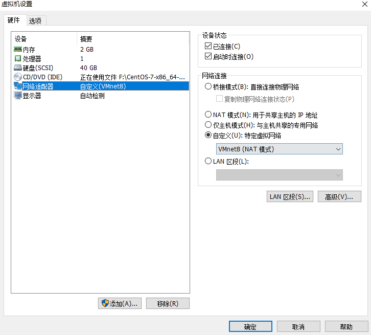
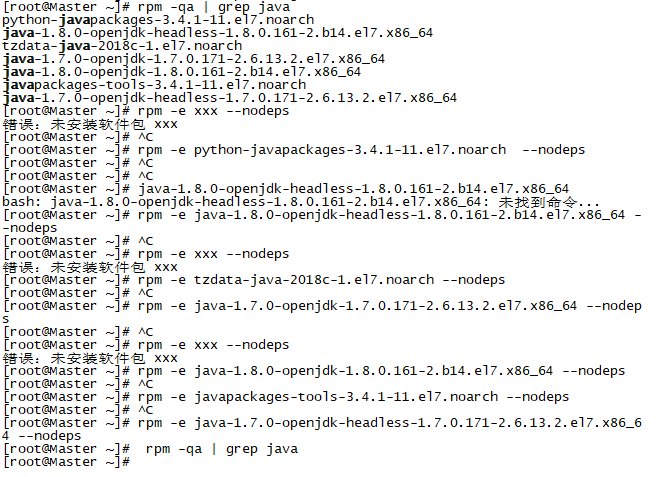
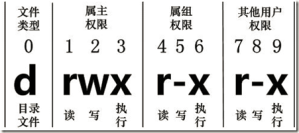
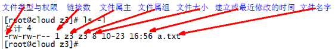
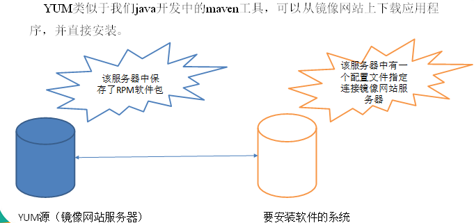

[TOC]

# Linux安装配置

## 配置centos7

1.打开VMware，点击编辑，选择虚拟网络编辑器。虚拟机选用NAT模式，并设置虚拟机的子网IP为192.168.8.100，子网掩码255.255.255.0，以及网关192.168.8.2。 

2.回到windows -> 打开网络和共享中心 -> 更改适配器设置 -> 右键VMnet8 -> 属性 -> 双击IPv4 -> 设置windows的IP：192.168.8.100  子网掩码：255.255.255.0  默认网关为192.168.8.2-> 点击确定

3.修改主机名

```
[root@localhost lx]# vim /etc/sysconfig/network

NETWORKING=yes
HOSTNAME=Master
~                
```

4.修改IP

```
[root@localhost lx]# vim /etc/sysconfig/network-scripts/ifcfg-ens32

TYPE="Ethernet"
PROXY_METHOD="none"
BROWSER_ONLY="no"
BOOTPROTO="static"   ###
DEFROUTE="yes"
IPV4_FAILURE_FATAL="no"
IPV6INIT="yes"
IPV6_AUTOCONF="yes"
IPV6_DEFROUTE="yes"
IPV6_FAILURE_FATAL="no"
IPV6_ADDR_GEN_MODE="stable-privacy"
NAME="ens32"
UUID="937ab86d-2356-425c-ad2b-89b0527fccb1"
DEVICE="ens32"
ONBOOT="yes"

IPADDR="192.168.8.11"    ###虚拟机的IP地址
NETMASK="255.255.255.0" ###子网掩码
GATEWAY="192.168.8.2"   ###网关
DNS1="8.8.8.8"  ###谷歌服务器
DNS2="192.168.8.2" ###基本和网关一样
```

5.修改主机名和IP的映射关系		

	[root@localhost lx]# vim /etc/hosts
	
	192.168.8.11   Master

6.关闭防火墙

	#查看防火墙状态
	systemctl status firewalld 
	#关闭防火墙
	systemctl stop firewalld
	#关闭防火墙开机启动
	systemctl disable firewalld
	
	常用命令：
	启动： systemctl start firewalld
	关闭： systemctl stop firewalld
	查看状态： systemctl status firewalld 
	开机禁用  ： systemctl disable firewalld
	开机启用  ： systemctl enable firewalld
	启动一个服务：systemctl start firewalld.service
	关闭一个服务：systemctl stop firewalld.service
	重启一个服务：systemctl restart firewalld.service
	显示一个服务的状态：systemctl status firewalld.service
	在开机时启用一个服务：systemctl enable firewalld.service
	在开机时禁用一个服务：systemctl disable firewalld.service
	查看服务是否开机启动：systemctl is-enabled firewalld.service
	查看已启动的服务列表：systemctl list-unit-files|grep enabled
	查看启动失败的服务列表：systemctl --failed
7.修改虚拟机的网络适配器，设置自定义特定虚拟网络为VMnet8(net模式)

 

8.重启网络

```
systemctl restart network  #如果需要reboot，此命令可以省略
```

9.重启Linux	

```
reboot
```

## 安装JDK

1.卸载现有的JDK

通过 rpm -qa | grep java 命令查看是否安装过 jdk，如果安装了，通过 rpm -e xxx --nodeps 命令进行装卸，xxx表示你通过 rpm -qa | grep java 命令 查到的安装包的名字。

 

2.通过SFTP上传JDK

3.通过mkdir创建存放软件包的目录

```
/opt/module/software

[root@Master /]# cd opt/
[root@Master opt]# mkdir module
[root@Master module]# mkdir software
[root@Master software]# mv jdk-8u144-linux-x64.tar.gz   /opt/module/software/
```

4.解压到将JDK解压到/root目录下

```
[root@Master software]# tar -zxvf jdk-8u144-linux-x64.tar.gz  -C /root/
```

5.配置环境变量

```
vim /etc/profile
```

 

让修改后的文件生效

```
source /etc/profile
```

测试是否安装成功

```
[root@Master jdk1.8.0_144]# java -version

java version "1.8.0_144"
Java(TM) SE Runtime Environment (build 1.8.0_144-b01)
Java HotSpot(TM) 64-Bit Server VM (build 25.144-b01, mixed mode)
```

## 远程ssh执行命令时提示找不到命令

最开始的时候碰到这种问题，是在hadoop003上配置了jdk1.8，在hadoop002上执行ssh hadoop003 java -version提示没有命令，然后先ssh hadoop003登录后，再执行java -version则没有问题。后来执行分发脚本时也碰到过这种问题，如果分步执行，先ssh到主机，然后执行命令就没有问题，然而直接ssh + 主机 + 命令就会报错。百度之后发现是ssh远程执行命令时加载的环境文件是~/.bashrc，所以解决的思路就是在~/.bashrc中添加需要的环境变量即可。

```
#java
export JAVA_HOME=/opt/module/jdk1.8.0_181
export CLASSPATH=.:$JAVA_HOME/jre/lib/rt.jar:$JAVA_HOME/lib/dt.jar:$JAVA_HOME/lib/tools.jar
export PATH=$JAVA_HOME/bin:$PATH
        

#hadoop
export HADOOP_HOME=/opt/module/hadoop-3.1.1
export PATH=$PATH:$HADOOP_HOME/bin:$HADOOP_HOME/sbin
export HADOOP_COMMON_LIB_NATIVE_DIR=$HADOOP_HOME/lib/native
export HADOOP_OPTS="-Djava.library.path=$HADOOP_HOME/lib:$HADOOP_COMMON_LIB_NATIVE_DIR"
    
#myqsl
export PATH=$PATH:/usr/local/mysql/bin
```

# shell编程

## shell解析器

### 1.查看有哪些解析器

```
[root@Master ~]# cat /etc/shells
/bin/sh    **
/bin/bash  **
/sbin/nologin
/usr/bin/sh
/usr/bin/bash
/usr/sbin/nologin
/bin/tcsh
/bin/csh
```

### 2.bash和sh的关系

/bin/sh 虽然是/bin/bash的软连接。

```
[root@Master bin]# ll | grep bash
-rwxr-xr-x. 1 root root     964544 4月  11 2018 bash
lrwxrwxrwx. 1 root root         10 8月  15 09:12 bashbug -> bashbug-64
-rwxr-xr-x. 1 root root       6964 4月  11 2018 bashbug-64
lrwxrwxrwx. 1 root root          4 8月  15 09:12 sh -> bash
```

## shell脚本入门

#### 1.编写一个脚本

(#!/bin/bash)指定解析器

```
#!/bin/bash

echo "hello world"
```

#### 2.第一种执行方式

采用bash或sh+脚本的相对路径或绝对路径（不用赋予脚本+x权限）

```
[root@Master shelldemo]# sh /root/code/shelldemo/helloword.sh 
hello world
[root@Master shelldemo]# sh helloword.sh 
hello world
[root@Master shelldemo]# bash /root/code/shelldemo/helloword.sh 
hello world
[root@Master shelldemo]# bash helloword.sh 
hello world
```

#### 2.第二种执行方式

采用输入脚本的绝对路径或相对路径执行脚本（必须具有可执行权限+x）

```
[root@Master shelldemo]# chmod 777 helloword.sh 
[root@Master shelldemo]# ./helloword.sh 
hello world
```

总结：

```
第一种执行方法，本质是bash解析器帮你执行脚本，所以脚本本身不需要执行权限。第二种执行方法，本质是脚本需要自己执行，所以需要执行权限。
```

#### 3.多命令脚本

需求是切换到/home/lx/目录下，创建一个名为aaa.txt的文件，并向其中追加信息。

```
[root@Master shelldemo]# vim batch.sh 
#!/bin/bash

cd /home/lx/
touch  aaa.txt
echo "wo ai ni !!!!!"  >> ./aaa.txt

################################################################################################

[root@Master shelldemo]# chmod 777 batch.sh 
[root@Master shelldemo]# ./batch.sh 
[root@Master shelldemo]# cat /home/lx/aaa.txt 
wo ai ni !!!!!
```

## 变量

shell中的变量分为系统变量和自定义变量。

```
常用系统变量：$HOME、$PWD、$SHELL、$USER等。

查看系统变量中的值
[root@Master shelldemo]# echo $USER
root
[root@Master shelldemo]# echo $HOME
/root
[root@Master shelldemo]# echo $SHELL
/bin/bash
```

### 自定义变量

1.基本语法

```
定义变量：变量=值 
撤销变量：unset 变量
声明静态变量：readonly变量，注意：不能unset
```

2.变量定义规则

```
1.变量名称可以由字母、数字和下划线组成，但是不能以数字开头，环境变量名建议大写。
2.等号两侧不能有空格
3.在bash中，变量默认类型都是字符串类型，无法直接进行数值运算。
4.变量的值如果有空格，需要使用双引号或单引号括起来。
```

3.练习

```
[root@Master shelldemo]# A=1  #定义一个普通变量
[root@Master shelldemo]# echo $A
1

[root@Master shelldemo]# echo A
A
[root@Master shelldemo]# unset A  
[root@Master shelldemo]# echo $A
（打印什么都没有）
[root@Master shelldemo]# readonly A=3  #定义一个只读变量
[root@Master shelldemo]# echo A
A
[root@Master shelldemo]# echo $A
3

#################只读变量#######################################################################
[root@Master shelldemo]# readonly C=3
[root@Master shelldemo]# echo $C
3
[root@Master shelldemo]# unset C
-bash: unset: C: 无法反设定: 只读 variable
[root@Master shelldemo]# C=5
-bash: C: 只读变量
[root@Master shelldemo]# echo $C
3
[root@Master shelldemo]# 
################################################################################################

在bash中，变量默认类型都是字符串类型，无法直接进行数值运算
[root@Master shelldemo]# D=1+3
[root@Master shelldemo]# echo $D
1+3
[root@Master shelldemo]#

################################################################################################

变量的值如果有空格，需要使用双引号或单引号括起来

[root@Master shelldemo]# ch="中国 我爱您！！"
[root@Master shelldemo]# echo $ch
中国 我爱您！！
[root@Master shelldemo]# 

################################################################################################

可把变量提升为全局环境变量，可供其他Shell程序使用。通常用来设置某个软件包的系统变量。
[root@Master shelldemo]# export AAA="hahaha"
[root@Master shelldemo]# touch AAA.sh
[root@Master shelldemo]# vim AAA.sh 

#!/bin/bash
echo "全局变量AAA的值为：$AAA"

[root@Master shelldemo]# chmod 777 AAA.sh 
[root@Master shelldemo]# ./AAA.sh 
全局变量AAA的值为：hahaha
[root@Master shelldemo]# 
```

### 特殊变量

```
1.$n（功能描述：n为数字，$0代表该脚本名称，$1-$9代表第一到第九个参数，十以上的参数，十以上的参数需要用大括号包含，如${10}）。

[root@Master shelldemo]# touch sss.sh
[root@Master shelldemo]# vim sss.sh 
#!/bin/bash

echo "$0"
echo "$1"
echo "$3"

[root@Master shelldemo]# chmod 777 sss.sh 
[root@Master shelldemo]# ./sss.sh  ni you mei   直接跳过了you，因为没有“$2”
./sss.sh
ni
mei
[root@Master shelldemo]# 

```

```
2.$#（功能描述：获取所有输入参数个数，常用于循环）。

[root@Master shelldemo]# touch bbb.sh
[root@Master shelldemo]# vim bbb.sh
#!/bin/bash

echo "一共有多少个参数：$#"

[root@Master shelldemo]# chmod 777 bbb.sh  
[root@Master shelldemo]# ./bbb.sh  ks sl dd ls 
一共有多少个参数：4
[root@Master shelldemo]#                       
```

```
3.$*（功能描述：这个变量代表命令行中所有的参数，$*把所有的参数看成一个整体）
4.$@（功能描述：这个变量也代表命令行中所有的参数，不过$@把每个参数区分对待）

区别：
1.$*和$@都表示传递给函数或脚本的所有参数，不被双引号“”包含时，都以$1 $2 …$n的形式输出所有参数。
2.当它们被双引号“”包含时，“$*”会将所有的参数作为一个整体，以“$1 $2 …$n”的形式输出所有参数；“$@”会将各个参数分开，以“$1” “$2”…”$n”的形式输出所有参数。

[root@Master shelldemo]# vim ii.sh           

#!/bin/bash

for x in $*
 do
  echo "整体：$x"
 done

for y in $@
 do
  echo "分割：$y"
 done

echo "#################################"

for x in "$*"
 do
  echo "整体：$x"
 done

for y in "$@"
 do
  echo "分割：$y"
 done
 
[root@Master shelldemo]# ./ii.sh  sl li lbs eb 
整体：sl
整体：li
整体：lbs
整体：eb
分割：sl
分割：li
分割：lbs
分割：eb
#################################
整体：sl li lbs eb
分割：sl
分割：li
分割：lbs
分割：eb
```

```
5.$？（功能描述：最后一次执行的命令的返回状态。如果这个变量的值为0，证明上一个命令正确执行；如果这个变量的值为非0（具体是哪个数，由命令自己来决定），则证明上一个命令执行不正确了。）

[root@Master shelldemo]# echo $?
130
[root@Master shelldemo]# echo $?
0
[root@Master shelldemo]# ^C
[root@Master shelldemo]# 
```

## 运算符

基本语法

```
1.“$((运算式))”或“$[运算式]”
2.expr  + , - , \*,  /,  %    加，减，乘，除，取余
注意：expr运算符间要有空格，运算符之间也要有空格，若要一个表达式先运算，需要这样：`表达式`。

[root@Master shelldemo]# r=$((1 + 2))  ##必须要两个括号
[root@Master shelldemo]# echo $r
3
[root@Master shelldemo]# r=$[1 + 2]
[root@Master shelldemo]# echo $r
3
[root@Master shelldemo]# expr 1 + 2
3
[root@Master shelldemo]# expr `expr 1 + 2` \* 5 
15
[root@Master shelldemo]# 
```

## 条件判断

```
1．基本语法
[ condition ]（注意condition前后要有空格）
注意：条件非空即为true，[ lx ]返回true，[] 返回false。

2.常用判断条件
2.1两个整数之间比较
= 字符串比较
lt 小于（less than）			-le 小于等于（less equal）
eq 等于（equal）				-gt 大于（greater than）
ge 大于等于（greater equal）	-ne 不等于（Not equal）

2.2按照文件权限进行判断
r 有读的权限（read）			-w 有写的权限（write）
-x 有执行的权限（execute）

2.3按照文件类型进行判断
-f 文件存在并且是一个常规的文件（file）
e 文件存在（existence）		-d 文件存在并是一个目录（directory）
```

练习：

1.23是否大于等于22

```
[root@Master shelldemo]# [ 22 -ge 23 ]
[root@Master shelldemo]# echo $?
1
[root@Master shelldemo]# [ 24 -ge 23 ] 
[root@Master shelldemo]# echo $?      
0
[root@Master shelldemo]# 
```

2.判断文件是否具有可读权限和判断一个文件是否具有可执行文件

```
[root@Master shelldemo]# [ -w sss.sh ]
[root@Master shelldemo]# echo $?
0
[root@Master shelldemo]# vim slsh.sh
[root@Master shelldemo]# ll
总用量 24
-rwxrwxrwx. 1 root root  57 8月  18 19:35 AAA.sh
-rwxrwxrwx. 1 root root  79 8月  18 19:18 batch.sh
-rwxrwxrwx. 1 root root  50 8月  18 19:46 bbb.sh
-rwxrwxrwx. 1 root root  32 8月  18 19:10 helloword.sh
-rwxrwxrwx. 1 root root 250 8月  18 20:14 ii.sh
-rw-r--r--. 1 root root   0 8月  18 20:58 slsh.sh
-rwxrwxrwx. 1 root root  44 8月  18 19:44 sss.sh
[root@Master shelldemo]# [ -x slsh.sh ]
[root@Master shelldemo]# echo $?
1
[root@Master shelldemo]# 
```

3.判断一个文件是否存在

```
[root@Master shelldemo]# ll
总用量 24
-rwxrwxrwx. 1 root root  57 8月  18 19:35 AAA.sh
-rwxrwxrwx. 1 root root  79 8月  18 19:18 batch.sh
-rwxrwxrwx. 1 root root  50 8月  18 19:46 bbb.sh
-rwxrwxrwx. 1 root root  32 8月  18 19:10 helloword.sh
-rwxrwxrwx. 1 root root 250 8月  18 20:14 ii.sh
-rw-r--r--. 1 root root   0 8月  18 20:58 slsh.sh
-rwxrwxrwx. 1 root root  44 8月  18 19:44 sss.sh
[root@Master shelldemo]# [ -e ./slsh.sh ]
[root@Master shelldemo]# echo $?
0
[root@Master shelldemo]# 
```

## 流程控制语句

1.基本语法格式

```
if [ 条件判断式 ];then 
  程序 
fi 
或者 
if [ 条件判断式 ] 
  then 
    程序 
fi
或者
if [ 条件判断式 ] 
  then 
    程序 
elif [ 条件判断式 ]
  then
    程序
fi
```

注意事项：

```
1.[ 条件判断式 ]，中括号和条件判断式之间必须有空格。

2.if后要有空格
```

练习：

1.输入一个数字，如果是1，则输出banzhang zhen shuai，如果是2，则输出cls zhen mei，如果是其它，什么也不输出。

```
[root@Master shelldemo]# touch pr.sh
[root@Master shelldemo]# vim pr.sh 

#!/bin/bash

if [ $1 -eq "1" ];then

   echo "banzhang zhen shuai"

elif [ $1 -eq "2" ]

then

   echo "cls zhen mei"

fi

[root@Master shelldemo]# chmod 777 pr.sh 
[root@Master shelldemo]# ./pr.sh 1
banzhang zhen shuai
[root@Master shelldemo]# ./pr.sh  2
cls zhen mei
[root@Master shelldemo]# 
```

## case 语句

基本语法

```
 case $变量名 in 
  "值1"） 
    如果变量的值等于值1，则执行程序1 
    ;; 
  "值2"） 
    如果变量的值等于值2，则执行程序2 
    ;; 
  …省略其他分支… 
  *） 
    如果变量的值都不是以上的值，则执行此程序 
    ;; 
esac
```

注意事项：

```
1.case行尾必须为单词“in”，每一个模式匹配必须以右括号“）”结束。

2.双分号“;;”表示命令序列结束，相当于java中的break。

3.最后的“*）”表示默认模式，相当于java中的default。
```

## for循环

1.第一种语法格式

```
for (( 初始值;循环控制条件;变量变化 )) 
  do 
    程序 
  done
```

示例

```
[root@Master shelldemo]# vim for1.sh

#!/bin/bash

s=0
for((i=0;i<=100;i++))
do
        s=$[$s+$i]
done
echo $s

[root@Master shelldemo]# chmod 777 for1.sh 
[root@Master shelldemo]# ./for1.sh 
“5050”
```

2.第二种语法格式

```
for 变量 in 值1 值2 值3… 
  do 
    程序 
  done
```

示例

```
[root@Master shelldemo]# touch for2.sh
[root@Master shelldemo]# vim for2.sh

#!/bin/bash
#打印数字

for i in $*
    do
      echo "ban zhang love $i " 
   done

[root@Master shelldemo]# chmod 777 for2.sh 
[root@Master shelldemo]# bash for2.sh cls xz bd
ban zhang love cls
ban zhang love xz
ban zhang love bd 
```

## while 循环

```
while [ 条件判断式 ] 
  do 
    程序
  done
```

示例：从1加到100

```
[root@Master shelldemo]# touch while.sh
[root@Master shelldemo]# vim while.sh

# !/bin/bash

s=0
i=1
while [ $i -le 100 ]
do
        s=$[$s+$i]
        i=$[$i+1]
done

echo $s

[root@Master shelldemo]# chmod 777 while.sh 
[root@Master shelldemo]# ./while.sh 
5050
```

## read读取控制台输入

基本语法

```
read(选项)(参数)
选项：
-p：指定读取值时的提示符；
-t：指定读取值时等待的时间（秒）。
参数
	变量：指定读取值的变量名
```

示例：

提示7秒内，读取控制台输入的名称

```
[root@Master shelldemo]# touch read.sh
[root@Master shelldemo]# vim read.sh

# !/bin/bash

read -t 7 -p "Enter your name in 7 seconds " NAME
echo $NAME

[root@Master shelldemo]# ./read.sh 
Enter your name in 7 seconds xiaoze
xiaoze
```

## 函数

### 1.系统函数

```
1．basename基本语法
basename [string / pathname][suffix] （功能描述：basename命令会删掉所有的前缀包括最后一个（‘/’）字符，然后将字符串显示出来。
选项：
suffix为后缀，如果suffix被指定了，basename会将pathname或string中的suffix去掉。
```

示例：

截取该/root/code/shelldemo/pr.sh路径的文件名称

```
[root@Master shelldemo]# basename /root/code/shelldemo/pr.sh  
pr.sh
[root@Master shelldemo]# basename /root/code/shelldemo/pr.sh  ./sh
pr.sh
[root@Master shelldemo]# 
```

```
2.dirname基本语法
dirname 文件绝对路径（功能描述：从给定的包含绝对路径的文件名中去除文件名（非目录的部分），然后返回剩下的路径（目录的部分））
```

示例：

获取pr.sh文件的路径

```
[root@Master shelldemo]# dirname /root/code/shelldemo/pr.sh 
/root/code/shelldemo
[root@Master shelldemo]# 
```

### 2.自定义函数

1．基本语法

```
[ function ] funname[()]             ####[] 内的内容表示可选的意思，表示里面选项可加上可不加上。
{
	Action;
	[return int;]
}
funname

################################################################################################
注意事项：

1.必须在调用函数地方之前，先声明函数，shell脚本是逐行运行，不会像其它语言一样先编译。
2.函数返回值，只能通过$?系统变量获得，可以显示加：return返回，如果不加，将以最后一条命令运行结果，作为返回值。return后跟数值n(0-255)
```

示例：

计算两个输入参数的和

```
[root@Master shelldemo]# touch sum.sh
[root@Master shelldemo]# vim sum.sh 
#!/bin/bash

function sum()
{
s=0
s=$(($1 + $2))
echo $s
}

read -t 7 -p "在7内给出n值：" n
read -t 7 -p "在7内给出m值：" m

sum $n $m

[root@Master shelldemo]# chmod 777 sum.sh 
[root@Master shelldemo]# ./sum.sh 
在7内给出n值：1
在7内给出m值：2
3
[root@Master shelldemo]# ./sum.sh 
在7内给出n值：5
在7内给出m值：8
13
[root@Master shelldemo]# 
```

# linux常用命令

## 帮助命令

### 1.man 获得帮助信息

基本语法

```
man [命令或配置文件]		（功能描述：获得帮助信息）
```

### 2.help 获得shell内置命令的帮助信息

基本语法

```
help 命令                   （功能描述：获得shell内置命令的帮助信息）
```

### 3.常用快捷键

| 常用快捷键  | 功能                         |
| ----------- | ---------------------------- |
| ctrl + c    | 停止进程                     |
| ctrl+l      | 清屏；彻底清屏是：reset      |
| ctrl + q    | 退出                         |
| 善于用tab键 | 提示(更重要的是可以防止敲错) |
| 上下键      | 查找执行过的命令             |
| ctrl +alt   | linux和Windows之间切换       |

## 文件目录命令

### 1.pwd 显示当前工作目录的绝对路径

pwd:print working directory 打印工作目录

基本语法

```
pwd	（功能描述：显示当前工作目录的绝对路径）
```

### 2.ls 列出目录的内容

ls:list 列出目录内容u

基本语法

```
ls [选项][目录或是文件]
```

选项说明

| 选项 | 功能                                                      |
| ---- | --------------------------------------------------------- |
| -a   | 全部的文件，连同隐藏档( 开头为 . 的文件) 一起列出来(常用) |
| -l   | 长数据串列出，包含文件的属性与权限等等数据；(常用)        |

显示说明

```
每行列出的信息依次是： 文件类型与权限 链接数 文件属主 文件属组 文件大小用byte来表示 建立或最近修改的时间 名字 
```

示例

```
[root@Master bin]# 
[root@Master bin]# ls -la
总用量 56
drwxr-xr-x. 4 root root   156 8月  16 09:29 .
drwxr-xr-x. 9 root root   171 8月  16 11:21 ..
-rwxr-xr-x. 1 root root  1031 4月  30 2015 beeline
-rw-r--r--. 1 root root 21086 8月  16 09:29 derby.log
drwxr-xr-x. 3 root root  4096 8月  16 09:24 ext
-rwxr-xr-x. 1 root root  7844 5月   8 2015 hive
-rwxr-xr-x. 1 root root  1900 4月  30 2015 hive-config.sh
-rwxr-xr-x. 1 root root   885 4月  30 2015 hiveserver2
drwxr-xr-x. 5 root root   133 8月  16 09:29 metastore_db
-rwxr-xr-x. 1 root root   832 4月  30 2015 metatool
-rwxr-xr-x. 1 root root   884 4月  30 2015 schematool
[root@Master bin]# 
```

### 3.cd 切换目录

cd:Change Directory切换路径

基本语法

```
cd  [参数]     
```

参数说明

| 参数        | 功能                                 |
| ----------- | ------------------------------------ |
| cd 绝对路径 | 切换路径                             |
| cd相对路径  | 切换路径                             |
| cd ~或者cd  | 回到自己的家目录                     |
| cd -        | 回到上一次所在目录                   |
| cd ..       | 回到当前目录的上一级目录             |
| cd -P       | 跳转到实际物理路径，而非快捷方式路径 |

### 4.mkdir 创建一个新的目录

mkdir:Make directory 建立目录

基本语法

```
mkdir [选项] 要创建的目录
```

选项说明

| 选项 | 功能         |
| ---- | ------------ |
| -p   | 创建多层目录 |

示例

```
创建一个目录
[root@Master logs]# mkdir xiyou
[root@Master logs]# mkdir xiyou/mingjie
创建一个多级目录
[root@Master logs]# mkdir -p xiyou/dssz/meihouwang
```

### 5.rmdir 删除一个空的目录

rmdir:Remove directory  删除目录

基本语法：

```
rmdir  要删除的空目录
```

示例

删除一个空的文件夹

```
[root@Master logs]# rmdir  xiyou/dssz/meihouwang/    ##删除了meihouwang/文件夹
[root@Master logs]# ls
he.txt  hh  xiyou
[root@Master logs]# cd xiyou/dssz/
[root@Master dssz]# ls
[root@Master dssz]# 
```

### 6.touch 创建空文件

基本语法

```
touch 文件名称
```

示例

```
[root@Master logs]# touch xiyou/dssz/sunwukong.txt
[root@Master logs]# cd xiyou/dssz/
[root@Master dssz]# ls
sunwukong.txt
[root@Master dssz]# pwe
bash: pwe: 未找到命令...
[root@Master dssz]# pwd
/tmp/logs/xiyou/dssz
[root@Master dssz]# ls
sunwukong.txt
[root@Master dssz]# ^C
[root@Master dssz]# 
```

###  7.cp 复制文件或目录

基本语法

```
cp [选项] source（源文件） dest（目标文件） 				（功能描述：复制source文件到dest）
```

选项说明

| 选项 | 功能               |
| ---- | ------------------ |
| -r   | 递归复制整个文件夹 |

参数说明

| 参数   | 功能     |
| ------ | -------- |
| source | 源文件   |
| dest   | 目标文件 |

### 8.rm 移除文件或目录

基本语法

```
rm [选项] deleteFile			（功能描述：递归删除目录中所有内容）
```

选项说明

| 选项 | 功能                                     |
| ---- | ---------------------------------------- |
| -r   | 递归删除目录中所有内容                   |
| -f   | 强制执行删除操作，而不提示用于进行确认。 |
| -v   | 显示指令的详细执行过程                   |

### 9.mv 移动文件与目录或重命名

基本语法

```
1.mv oldNameFile newNameFile	  （功能描述：重命名）

2.mv /temp/movefile /targetFolder （功能描述：移动文件）
 
```

### 10.cat 查看文件内容

查看文件内容，从第一行开始显示。
基本语法

```
cat  [选项] 要查看的文件
```

选项说明

| 选项 | 功能描述                     |
| ---- | ---------------------------- |
| -n   | 显示所有行的行号，包括空行。 |

### 11.more 文件内容分屏查看器

more指令是一个基于VI编辑器的文本过滤器，它以全屏幕的方式按页显示文本文件的内容。more指令中内置了若干快捷键，详见操作说明。

基本语法

```
	more 要查看的文件
```

 功能说明

| 操作           | 功能说明                                 |
| -------------- | ---------------------------------------- |
| 空白键 (space) | 代表向下翻一页                           |
| Enter          | 代表向下翻『一行』                       |
| q              | 代表立刻离开 more ，不再显示该文件内容。 |
| Ctrl+F         | 向下滚动一屏                             |
| Ctrl+B         | 返回上一屏                               |
| =              | 输出当前行的行号                         |
| :f             | 输出文件名和当前行的行号                 |

### 12.less 分屏显示文件内容

less指令用来分屏查看文件内容，它的功能与more指令类似，但是比more指令更加强大，支持各种显示终端。less指令在显示文件内容时，并不是一次将整个文件加载之后才显示，而是根据显示需要加载内容，对于显示大型文件具有较高的效率。

基本语法

```
less 要查看的文件
```

操作说明

| 操作       | 功能说明                                           |
| ---------- | -------------------------------------------------- |
| 空白键     | 向下翻动一页                                       |
| [pagedown] | 向下翻动一页                                       |
| [pageup]   | 向上翻动一页                                       |
| /字串      | 向下搜寻『字串』的功能；n：向下查找；N：向上查找； |
| ?字串      | 向上搜寻『字串』的功能；n：向上查找；N：向下查找； |
| q          | 离开 less 这个程序                                 |

### 13.echo

echo输出内容到控制台
基本语法

```
	echo [选项][输出内容]
```

选项

```
  -e：  支持反斜线控制的字符转换
```

| 控制字符 | 作用                |
| -------- | ------------------- |
| \\       | 输出\本身           |
| \n       | 换行符              |
| \t       | 制表符，也就是Tab键 |

示例

```
[root@Master shelldemo]# echo "hello world"
hello world
[root@Master shelldemo]# echo "helloworld"
helloworld
[root@Master shelldemo]# echo "hello\world"
hello\world
[root@Master shelldemo]# echo -e "hello\world"
hello\world
[root@Master shelldemo]# echo -e "hello\tworld"
hello   world
[root@Master shelldemo]# echo -e "hello\nworld"
hello
world
[root@Master shelldemo]# 
```

### 14.head 显示文件头部内容

head用于显示文件的开头部分内容，默认情况下head指令显示文件的前10行内容。

基本语法

```
head 文件	      （功能描述：查看文件头10行内容）
head -n 5 文件      （功能描述：查看文件头5行内容，5可以是任意行数）
```

选项说明

| 选项      | 功能                   |
| --------- | ---------------------- |
| -n <行数> | 指定显示头部内容的行数 |

示例

```
[root@Master hadoop]# head -2 hadoop-policy.xml  
<?xml version="1.0"?>
<?xml-stylesheet type="text/xsl" href="configuration.xsl"?>
[root@Master hadoop]# head -3 hadoop-policy.xml  
<?xml version="1.0"?>
<?xml-stylesheet type="text/xsl" href="configuration.xsl"?>
<!--
[root@Master hadoop]# head -4 hadoop-policy.xml  
<?xml version="1.0"?>
<?xml-stylesheet type="text/xsl" href="configuration.xsl"?>
<!--

[root@Master hadoop]# 
```

### 15.tail 输出文件尾部内容

tail用于输出文件中尾部的内容，默认情况下tail指令显示文件的后10行内容。

基本语法

```
1.tail  文件 			（功能描述：查看文件后10行内容）
2.tail  -n 5 文件 		（功能描述：查看文件后5行内容，5可以是任意行数）
3.tail  -f  文件		（功能描述：实时追踪该文档的所有更新）
```

选项说明

| 选项     | 功能                                 |
| -------- | ------------------------------------ |
| -n<行数> | 输出文件尾部n行内容                  |
| -f       | 显示文件最新追加的内容，监视文件变化 |

### 16.> 覆盖 和 >> 追加

基本语法

```
1.ll >文件		（功能描述：列表的内容写入文件a.txt中（覆盖写））
2.ll >>文件		（功能描述：列表的内容追加到文件aa.txt的末尾）
3.cat 文件1 > 文件2	（功能描述：将文件1的内容覆盖到文件2）
4.echo “内容” >> 文件

注意：cat，echo都是能追加的。
```

示例

```
[root@Master logs]# ll
总用量 0
-rw-r--r--. 1 root root  0 8月  19 00:15 he.txt
drwxr-xr-x. 2 root root  6 8月  18 23:13 hh
drwxr-xr-x. 3 root root 18 8月  18 23:17 xiyou
[root@Master logs]# ll ./ > he.txt     
[root@Master logs]# cat he.txt 
总用量 0
-rw-r--r--. 1 root root  0 8月  19 00:15 he.txt
drwxr-xr-x. 2 root root  6 8月  18 23:13 hh
drwxr-xr-x. 3 root root 18 8月  18 23:17 xiyou
[root@Master logs]# ll ./ > he.txt 
[root@Master logs]# cat he.txt     
总用量 0
-rw-r--r--. 1 root root  0 8月  19 00:16 he.txt
drwxr-xr-x. 2 root root  6 8月  18 23:13 hh
drwxr-xr-x. 3 root root 18 8月  18 23:17 xiyou
[root@Master logs]# ll ./ >> he.txt 
[root@Master logs]# cat he.txt      
总用量 0
-rw-r--r--. 1 root root  0 8月  19 00:16 he.txt
drwxr-xr-x. 2 root root  6 8月  18 23:13 hh
drwxr-xr-x. 3 root root 18 8月  18 23:17 xiyou
总用量 4
-rw-r--r--. 1 root root 154 8月  19 00:16 he.txt
drwxr-xr-x. 2 root root   6 8月  18 23:13 hh
drwxr-xr-x. 3 root root  18 8月  18 23:17 xiyou
[root@Master logs]# 
```

### 17.ln 软链接

软链接也成为符号链接，类似于windows里的快捷方式，有自己的数据块，主要存放了链接其他文件的路径。

基本语法

```
ln -s [原文件或目录][软链接名]		（功能描述：给原文件创建一个软链接）
```

经验技巧

```
删除软链接： rm -rf 软链接名，而不是rm -rf 软链接名/
查询：通过ll就可以查看，列表属性第1位是l，尾部会有位置指向（A->B）。
```

示例

```
创建软连接
[root@Master logs]# ln -s xiyou/dssz/he.txt  ./he 
[root@Master logs]# ll
总用量 4
-rw-r--r--. 1 root root 23 8月  19 00:17 eh.txt
lrwxrwxrwx. 1 root root 17 8月  19 00:26 he -> xiyou/dssz/he.txt
drwxr-xr-x. 2 root root  6 8月  18 23:13 hh
drwxr-xr-x. 3 root root 18 8月  18 23:17 xiyou
 
删除软连接
[root@Master logs]# rm -rf he

进入软连接实际物理路径
[root@Master logs]# ln -s xiyou/dssz/  ./dssz
[root@Master logs]# ll
总用量 4
lrwxrwxrwx. 1 root root 11 8月  19 00:30 dssz -> xiyou/dssz/
[root@Master logs]# cd -P ./dssz/ ####进入软连接实际物理路径
[root@Master dssz]# pwd
/tmp/logs/xiyou/dssz
[root@Master dssz]# 
```

### 18.history 查看已经执行过历史命令

基本语法

```
history		（功能描述：查看已经执行过历史命令）
```

## 时间日期命令

基本语法

```
date [OPTION]... [+FORMAT]
```

选项说明

| 选项           | 功能                                           |
| -------------- | ---------------------------------------------- |
| -d<时间字符串> | 显示指定的“时间字符串”表示的时间，而非当前时间 |
| -s<日期时间>   | 设置系统日期时间                               |

参数说明

| 参数            | 功能                         |
| --------------- | ---------------------------- |
| <+日期时间格式> | 指定显示时使用的日期时间格式 |

### 1.date 显示当前时间

基本语法

```
date						（功能描述：显示当前时间）
date +%Y					（功能描述：显示当前年份）
date +%m					（功能描述：显示当前月份）
date +%d					（功能描述：显示当前是哪一天）
date +"%Y-%m-%d %H:%M:%S"	  （功能描述：显示年月日时分秒）
```

示例

```
[root@Master ~]# date
2019年 08月 19日 星期一 08:57:14 CST
[root@Master ~]# date +%Y
2019
[root@Master ~]# date +%m
08
[root@Master ~]# date +%d
19
[root@Master ~]# date +%Y-%m-%d
2019-08-19
[root@Master ~]# date "+%Y-%m-%d %H:%M:%S"    #####必须加上引号。单引号双引号都可以
2019-08-19 08:58:40
[root@Master ~]# 
```

### 2.date 显示非当前时间

基本语法

```
date -d '1 days ago'			（功能描述：显示前一天时间）
date -d '-1 days ago'			（功能描述：显示明天时间）
```

示例

```
显示前一天
[root@Master ~]# date -d '1 days ago'           ###单引号双引号都可以
2019年 08月 18日 星期日 09:05:03 CST
[root@Master ~]# date -d "1 days ago" 
2019年 08月 18日 星期日 09:05:16 CST

显示明天时间
[root@Master ~]# date -d '-1 days ago'
2019年 08月 20日 星期二 09:05:33 CST
[root@Master ~]# date -d "-1 days ago"
2019年 08月 20日 星期二 09:05:54 CST
[root@Master ~]# 
```

基本语法

```
date -s 字符串时间
```

示例

```
[root@Master ~]# date -s "2019-08-16"    ###把时间设置显示到2019-08-16
2019年 08月 16日 星期五 00:00:00 CST
[root@Master ~]# date
2019年 08月 16日 星期五 00:00:03 CST
```

### 3.cal 查看日历

基本语法

```
cal [选项]	（功能描述：不加选项，显示本月日历）
```

选项说明

| 选项       | 功能             |
| ---------- | ---------------- |
| 具体某一年 | 显示这一年的日历 |

示例

```
[root@Master ~]# cal
      八月 2019     
日 一 二 三 四 五 六
             1  2  3
 4  5  6  7  8  9 10
11 12 13 14 15 16 17
18 19 20 21 22 23 24
25 26 27 28 29 30 31

[root@Master ~]# cal 2007
                               2007                               

        一月                   二月                   三月        
日 一 二 三 四 五 六   日 一 二 三 四 五 六   日 一 二 三 四 五 六
    1  2  3  4  5  6                1  2  3                1  2  3
 7  8  9 10 11 12 13    4  5  6  7  8  9 10    4  5  6  7  8  9 10
14 15 16 17 18 19 20   11 12 13 14 15 16 17   11 12 13 14 15 16 17
21 22 23 24 25 26 27   18 19 20 21 22 23 24   18 19 20 21 22 23 24
28 29 30 31            25 26 27 28            25 26 27 28 29 30 31

        四月                   五月                   六月        
日 一 二 三 四 五 六   日 一 二 三 四 五 六   日 一 二 三 四 五 六
 1  2  3  4  5  6  7          1  2  3  4  5                   1  2
 8  9 10 11 12 13 14    6  7  8  9 10 11 12    3  4  5  6  7  8  9
15 16 17 18 19 20 21   13 14 15 16 17 18 19   10 11 12 13 14 15 16
22 23 24 25 26 27 28   20 21 22 23 24 25 26   17 18 19 20 21 22 23
29 30                  27 28 29 30 31         24 25 26 27 28 29 30

        七月                   八月                   九月        
日 一 二 三 四 五 六   日 一 二 三 四 五 六   日 一 二 三 四 五 六
 1  2  3  4  5  6  7             1  2  3  4                      1
 8  9 10 11 12 13 14    5  6  7  8  9 10 11    2  3  4  5  6  7  8
15 16 17 18 19 20 21   12 13 14 15 16 17 18    9 10 11 12 13 14 15
22 23 24 25 26 27 28   19 20 21 22 23 24 25   16 17 18 19 20 21 22
29 30 31               26 27 28 29 30 31      23 24 25 26 27 28 29
                                              30
        十月                  十一月                 十二月       
日 一 二 三 四 五 六   日 一 二 三 四 五 六   日 一 二 三 四 五 六
    1  2  3  4  5  6                1  2  3                      1
 7  8  9 10 11 12 13    4  5  6  7  8  9 10    2  3  4  5  6  7  8
14 15 16 17 18 19 20   11 12 13 14 15 16 17    9 10 11 12 13 14 15
21 22 23 24 25 26 27   18 19 20 21 22 23 24   16 17 18 19 20 21 22
28 29 30 31            25 26 27 28 29 30      23 24 25 26 27 28 29
                                              30 31

[root@Master ~]# 
```

## 用户管理命令

### 1.useradd 添加新用户

基本语法

```
useradd 用户名		（功能描述：添加新用户）
useradd -g 组名 用户名  （功能描述：添加新用户到某个组）
```

示例

```
添加一个用户
[root@Master ~]#  useradd tangseng
[root@Master ~]# ll /home/
总用量 4
drwx------. 15 lx       lx       4096 8月  19 2019 lx
drwx------.  3 tangseng tangseng   78 8月  19 00:08 tangseng
[root@Master ~]# 
```

### 2.passwd 设置用户密码

基本语法

```
passwd 用户名	（功能描述：设置用户密码）
```

 示例

```
设置用户的密码
[root@Master ~]# passwd tangseng  
更改用户 tangseng 的密码 。
新的 密码：
重新输入新的 密码：
passwd：所有的身份验证令牌已经成功更新。
[root@Master ~]# 
```

### 3.id 查看用户是否存在

基本语法

```
id 用户名
```

示例

```
查看用户是否存在
[root@Master ~]# id tangseng
uid=1001(tangseng) gid=1001(tangseng) 组=1001(tangseng)
[root@Master ~]# id lx
uid=1000(lx) gid=1000(lx) 组=1000(lx),10(wheel)
[root@Master ~]# 
```

### 4.cat  /etc/passwd 查看创建了哪些用户

示例

```
[root@Master ~]# cat /etc/passwd
root:x:0:0:root:/root:/bin/bash
bin:x:1:1:bin:/bin:/sbin/nologin
daemon:x:2:2:daemon:/sbin:/sbin/nologin
adm:x:3:4:adm:/var/adm:/sbin/nologin
lp:x:4:7:lp:/var/spool/lpd:/sbin/nologin
sync:x:5:0:sync:/sbin:/bin/sync
shutdown:x:6:0:shutdown:/sbin:/sbin/shutdown
halt:x:7:0:halt:/sbin:/sbin/halt
mail:x:8:12:mail:/var/spool/mail:/sbin/nologin
operator:x:11:0:operator:/root:/sbin/nologin
games:x:12:100:games:/usr/games:/sbin/nologin
ftp:x:14:50:FTP User:/var/ftp:/sbin/nologin
nobody:x:99:99:Nobody:/:/sbin/nologin
systemd-network:x:192:192:systemd Network Management:/:/sbin/nologin
dbus:x:81:81:System message bus:/:/sbin/nologin
polkitd:x:999:998:User for polkitd:/:/sbin/nologin
sssd:x:998:996:User for sssd:/:/sbin/nologin
libstoragemgmt:x:997:994:daemon account for libstoragemgmt:/var/run/lsm:/sbin/nologin
rpc:x:32:32:Rpcbind Daemon:/var/lib/rpcbind:/sbin/nologin
colord:x:996:993:User for colord:/var/lib/colord:/sbin/nologin
gluster:x:995:992:GlusterFS daemons:/var/run/gluster:/sbin/nologin
saslauth:x:994:76:Saslauthd user:/run/saslauthd:/sbin/nologin
abrt:x:173:173::/etc/abrt:/sbin/nologin
setroubleshoot:x:993:990::/var/lib/setroubleshoot:/sbin/nologin
rtkit:x:172:172:RealtimeKit:/proc:/sbin/nologin
pulse:x:171:171:PulseAudio System Daemon:/var/run/pulse:/sbin/nologin
chrony:x:992:987::/var/lib/chrony:/sbin/nologin
rpcuser:x:29:29:RPC Service User:/var/lib/nfs:/sbin/nologin
nfsnobody:x:65534:65534:Anonymous NFS User:/var/lib/nfs:/sbin/nologin
unbound:x:991:986:Unbound DNS resolver:/etc/unbound:/sbin/nologin
tss:x:59:59:Account used by the trousers package to sandbox the tcsd daemon:/dev/null:/sbin/nologin
usbmuxd:x:113:113:usbmuxd user:/:/sbin/nologin
geoclue:x:990:984:User for geoclue:/var/lib/geoclue:/sbin/nologin
radvd:x:75:75:radvd user:/:/sbin/nologin
qemu:x:107:107:qemu user:/:/sbin/nologin
ntp:x:38:38::/etc/ntp:/sbin/nologin
gdm:x:42:42::/var/lib/gdm:/sbin/nologin
gnome-initial-setup:x:989:983::/run/gnome-initial-setup/:/sbin/nologin
sshd:x:74:74:Privilege-separated SSH:/var/empty/sshd:/sbin/nologin
avahi:x:70:70:Avahi mDNS/DNS-SD Stack:/var/run/avahi-daemon:/sbin/nologin
postfix:x:89:89::/var/spool/postfix:/sbin/nologin
tcpdump:x:72:72::/:/sbin/nologin
lx:x:1000:1000:lx:/home/lx:/bin/bash
mysql:x:988:982:MySQL server:/var/lib/mysql:/bin/bash
tangseng:x:1001:1001::/home/tangseng:/bin/bash
[root@Master ~]# 
```

### 5.su 切换用户

su: swith user 切换用户

基本语法

```
su 用户名称   （功能描述：切换用户，只能获得用户的执行权限，不能获得环境变量）
su - 用户名称	（功能描述：切换到用户并获得该用户的环境变量及执行权限）
```

示例

```
[root@Master ~]# su tangseng
[tangseng@Master root]$ pwd  ####还是在原来那个用户的工作目录下
/root
[tangseng@Master root]$ exit
exit
[root@Master ~]# su - tangseng
上一次登录：一 8月 19 00:23:47 CST 2019pts/0 上
[tangseng@Master ~]$ pwd    ####切换到新用户的工作目录
/home/tangseng
[tangseng@Master ~]$ 
```

### 6.userdel 删除用户

基本语法

```
userdel  用户名		（功能描述：删除用户但保存用户主目录）
userdel -r 用户名		（功能描述：用户和用户主目录，都删除）
```

选项说明

| 选项 | 功能                                       |
| ---- | ------------------------------------------ |
| -r   | 删除用户的同时，删除与用户相关的所有文件。 |

示例

```
[root@Master ~]# userdel tangseng
[root@Master ~]# ll /home/
总用量 4
drwx------. 15 lx   lx   4096 8月  19 2019 lx
drwx------.  5 1001 1001  128 8月  19 00:20 tangseng
[root@Master ~]# useradd zhubajie
[root@Master ~]# ll /home/
总用量 4
drwx------. 15 lx       lx       4096 8月  19 2019 lx
drwx------.  5 zhubajie zhubajie  128 8月  19 00:20 tangseng
drwx------.  3 zhubajie zhubajie   78 8月  19 00:28 zhubajie
[root@Master ~]# userdel -r zhubajie
[root@Master ~]# ll /home/
总用量 4
drwx------. 15 lx   lx   4096 8月  19 2019 lx
drwx------.  5 1001 1001  128 8月  19 00:20 tangseng
[root@Master ~]#
```

### 7.who 查看登录用户信息

基本语法

```
whoami			（功能描述：显示自身用户名称）
who am i		（功能描述：显示登录用户的用户名）
```

示例

```
[lx@Master ~]$ su - root
密码：
上一次登录：一 8月 19 08:32:38 CST 2019从 192.168.8.100pts/0 上
[root@Master ~]# whoami   显示自身用户名称
root
[root@Master ~]# who am i    显示登录用户的用户名
lx       pts/1        2019-08-19 00:33 (:0)
[root@Master ~]# 
```

### 8.sudo 设置普通用户具有root权限

添加lxx用户，并对其设置密码。

```
[root@Master ~]# useradd lxx
[root@Master ~]# passwd lxx
```

修改配置文件

```
[root@Master ~]# vi /etc/sudoers
```

修改 /etc/sudoers 文件，在root下面添加一行，如下所示：

```
Allow root to run any commands anywhere

root    ALL=(ALL)       ALL
    
lxx    ALL=(ALL)       ALL    ############
```

或者配置成采用sudo命令时，不需要输入密码

```
Allow root to run any commands anywhere

root      ALL=(ALL)     ALL
lxx  ALL=(ALL)     NOPASSWD:ALL
```

修改完毕，现在可以用lxx帐号登录，然后用命令 sudo ，即可获得root权限进行操作。

### 9.usermod 修改用户

基本语法

```
usermod -g 用户组 用户名
```

选项说明

| 选项 | 功能                                     |
| ---- | ---------------------------------------- |
| -g   | 修改用户的初始登录组，给定的组必须存在。 |

示例

```
将用户加入到用户组
[root@Master ~]# ll /home/
总用量 4
drwx------. 15 lx  lx  4096 8月  19 2019 lx
drwx------.  3 lxx lxx   78 8月  19 00:37 lxx
drwx------.  5 lxx lxx  128 8月  19 00:20 tangseng
[root@Master ~]# usermod -g root lxx
[root@Master ~]# ll /home/
总用量 4
drwx------. 15 lx  lx   4096 8月  19 2019 lx
drwx------.  3 lxx root   78 8月  19 00:37 lxx
drwx------.  5 lxx lxx   128 8月  19 00:20 tangseng
[root@Master ~]# 
```

## 用户组管理命令

每个用户都有一个用户组，系统可以对一个用户组中的所有用户进行集中管理。不同Linux 系统对用户组的规定有所不同，如Linux下的用户属于与它同名的用户组，这个用户组在创建用户时同时创建。
用户组的管理涉及用户组的添加、删除和修改。组的增加、删除和修改实际上就是对/etc/group文件的更新。

### 1.groupadd 新增组

基本语法

```
groupadd 组名
```

示例

```
添加一个xitianqujing组
[root@Master ~]# groupadd xitianqujing
[root@Master ~]# 
```

### 2.groupdel 删除组

基本语法

```
groupdel 组名
```

示例

```
删除xitianqujing组
[root@Master ~]# groupdel xitianqujing
[root@Master ~]# 
```

### 3.groupmod 修改组

基本语法

```
groupmod -n 新组名 老组名
```

选项说明

| 选项       | 功能描述           |
| ---------- | ------------------ |
| -n<新组名> | 指定工作组的新组名 |

示例

```
修改xitianqujing组名称为xitian
[root@Master ~]# groupadd xitianqujing
[root@Master ~]# groupmod -n xitian xitianqujing
[root@Master ~]# 
```

### 4.cat  /etc/group 查看创建了哪些组

示例

```
[root@Master ~]# cat  /etc/group
```

## 文件权限命令

### 1.文件属性

Linux系统是一种典型的多用户系统，不同的用户处于不同的地位，拥有不同的权限。为了保护系统的安全性，Linux系统对不同的用户访问同一文件（包括目录文件）的权限做了不同的规定。在Linux中我们可以使用ll或者ls -l命令来显示一个文件的属性以及文件所属的用户和组。

从左到右的10个字符表示，如图所示：

 

如果没有权限，就会出现减号[ - ]而已。从左至右用0-9这些数字来表示:

```
1.0首位表示类型
在Linux中第一个字符代表这个文件是目录、文件或链接文件等等。代表文件有d 代表目录，l 链接文档(link file)。

2.第1-3位确定属主（该文件的所有者）拥有该文件的权限。---User

3.第4-6位确定属组（所有者的同组用户）拥有该文件的权限，---Group

4.第7-9位确定其他用户拥有该文件的权限 ---Other
```

### 2.rxw作用文件和目录的不同解释

作用到文件：

```
[ r ]代表可读(read): 可以读取，查看。
[ w ]代表可写(write): 可以修改，但是不代表可以删除该文件，删除一个文件的前提条件是对该文件所在的目录有写权限，才能删除该文件。
[ x ]代表可执行(execute):可以被系统执行
```

作用到目录：

```
[ r ]代表可读(read): 可以读取，ls查看目录内容。
[ w ]代表可写(write): 可以修改，目录内创建+删除+重命名目录。
[ x ]代表可执行(execute):可以进入该目录
```

 

### 3.chmod 改变权限

基本语法

 


 第一种方式变更权限

```
	chmod  [{ugoa}{+-=}{rwx}] 文件或目录
```

第二种方式变更权限

```
	chmod  [mode=421 ][文件或目录]
```

u:所有者  g:所有组  o:其他人  a:所有人(u、g、o的总和)
r=4 w=2 x=1        rwx=4+2+1=7

示例

```
u:所有者  g:所有组  o:其他人  a:所有人(u、g、o的总和)

r=4 w=2 x=1        rwx=4+2+1=7

################################################################################################
第一种方式

[root@Master lx]# ll
-rw-r--r--. 1 root root 15 8月  18 19:12 aaa.txt
[root@Master lx]# chmod u-w aaa.txt
[root@Master lx]# ll
-r--r--r--. 1 root root 15 8月  18 19:12 aaa.txt
[root@Master lx]# chmod u-r aaa.txt
[root@Master lx]# ll
----r--r--. 1 root root 15 8月  18 19:12 aaa.txt
[root@Master lx]# chmod g+w aaa.txt
[root@Master lx]# ll
----rw-r--. 1 root root 15 8月  18 19:12 aaa.txt
[root@Master lx]# chmod g+x aaa.txt
[root@Master lx]# ll
----rwxr--. 1 root root 15 8月  18 19:12 aaa.txt
[root@Master lx]# chmod o+x aaa.txt 
[root@Master lx]# ll
----rwxr-x. 1 root root 15 8月  18 19:12 aaa.txt
[root@Master lx]# chmod u+r,u+x,o-x aaa.txt 
[root@Master lx]# ll
-r-xrwxr--. 1 root root 15 8月  18 19:12 aaa.txt
[root@Master lx]# 

################################################################################################
第二种方式

采用数字的方式，设置文件所有者、所属组、其他用户都具有可读可写可执行权限。
[root@hadoop101 ~]# chmod 777 houge.txt
（5）修改整个文件夹里面的所有文件的所有者、所属组、其他用户都具有可读可写可执行权限。
[root@hadoop101 ~]# chmod -R 777 xiyou/

采用数字的方式，设置文件所有者、所属组、其他用户都具有可读可写可执行权限。
[root@Master lx]# chmod 000 aaa.txt      
[root@Master lx]# ll
----------. 1 root root 15 8月  18 19:12 aaa.txt
[root@Master lx]# chmod 777 aaa.txt 
[root@Master lx]# ll
-rwxrwxrwx. 1 root root 15 8月  18 19:12 aaa.txt
[root@Master lx]# chmod 421 aaa.txt 
[root@Master lx]# ll
-r---w---x. 1 root root 15 8月  18 19:12 aaa.txt
[root@Master lx]# chmod 420 aaa.txt  
[root@Master lx]# ll
-r---w----. 1 root root 15 8月  18 19:12 aaa.txt
[root@Master lx]# 

修改整个文件夹里面的所有文件的所有者、所属组、其他用户都具有可读可写可执行权限。
[root@Master home]# ll
drwx------.  3 lxx root   93 8月  19 01:40 lxx
[root@Master home]# chmod 777 lxx
[root@Master home]# ll
drwxrwxrwx.  3 lxx root   93 8月  19 01:40 lxx
[root@Master home]# cd lxx/
[root@Master lxx]# ll
-rw-r--r--. 1 root root 0 8月  19 01:40 bbb.txt
[root@Master lxx]# cd ..
[root@Master home]# chmod  -R 777  ./lxx    ####大写的R
[root@Master home]# ll
drwxrwxrwx.  3 lxx root   93 8月  19 01:40 lxx
[root@Master home]# cd lxx
[root@Master lxx]# ll
-rwxrwxrwx. 1 root root 0 8月  19 01:40 bbb.txt
[root@Master lxx]# 
```

### 4.chown 改变所有者

基本语法

```
chown [选项][最终用户] [文件或目录]		（功能描述：改变文件或者目录的所有者）
```

选项说明

| 选项 | 功能     |
| ---- | -------- |
| -R   | 递归操作 |

示例

```
修改文件所有者
[root@Master lxx]# ll
-rwxrwxrwx. 1 root root 0 8月  19 01:40 bbb.txt
[root@Master lxx]# chown lxx bbb.txt 
[root@Master lxx]# ll
-rwxrwxrwx. 1 lxx root 0 8月  19 01:40 bbb.txt

递归改变文件所有者和所有组
[root@Master home]# ll
drwxrwxrwx.  3 lxx root   93 8月  19 01:40 lxx
[root@Master home]# chown root lxx
[root@Master home]# ll
drwxrwxrwx.  3 root root   93 8月  19 01:40 lxx
[root@Master home]# cd lxx/
[root@Master lxx]# ll
-rwxrwxrwx. 1 lxx root 0 8月  19 01:40 bbb.txt
[root@Master lxx]# cd  ..
[root@Master home]# ll
drwxrwxrwx.  3 root root   93 8月  19 01:40 lxx
[root@Master home]# chown  -R root lxx
[root@Master home]# ll
drwxrwxrwx.  3 root root   93 8月  19 01:40 lxx
[root@Master home]# cd lxx
[root@Master lxx]# ll
-rwxrwxrwx. 1 root root 0 8月  19 01:40 bbb.txt
```

### 5.chgrp 改变所属组

基本语法

```
chgrp [最终用户组][文件或目录]	（功能描述：改变文件或者目录的所属组）
```

示例	

```
修改文件的所属组
[root@Master home]# ll
drwxrwxrwx.  3 root root   93 8月  19 01:40 lxx
[root@Master home]# chgrp lx  lxx
[root@Master home]# ll
drwxrwxrwx.  3 root lx    93 8月  19 01:40 lxx
[root@Master home]# cd lxx/
[root@Master lxx]# ll
-rwxrwxrwx. 1 root root 0 8月  19 01:40 bbb.txt
[root@Master lxx]# cd  ..
[root@Master home]# chgrp -R lx lxx
[root@Master home]# ll
drwxrwxrwx.  3 root lx    93 8月  19 01:40 lxx
[root@Master home]# cd lxx/
[root@Master lxx]# ll
-rwxrwxrwx. 1 root lx 0 8月  19 01:40 bbb.txt
```

## 搜索查找命令

### 1.find 查找文件或者目录

find指令将从指定目录向下递归地遍历其各个子目录，将满足条件的文件显示在终端。

基本语法

```
find [搜索范围][选项]
```

选项说明

| 选项            | 功能                             |
| --------------- | -------------------------------- |
| -name<查询方式> | 按照指定的文件名查找模式查找文件 |
| -user<用户名>   | 查找属于指定用户名所有文件       |
| -size<文件大小> | 按照指定的文件大小查找文件       |

示例

```
按文件名：根据名称查找/home/目录下的文件。
[root@Master home]# find /home/  -name "bbb.txt"
/home/lxx/bbb.txt
[root@Master home]# find /home/  -name "*.txt"  
/home/lx/.cache/tracker/db-version.txt
/home/lx/.cache/tracker/db-locale.txt
/home/lx/.cache/tracker/parser-sha1.txt
/home/lx/.cache/tracker/locale-for-miner-user-guides.txt
/home/lx/.cache/tracker/locale-for-miner-apps.txt
/home/lx/.cache/tracker/last-crawl.txt
/home/lx/.cache/tracker/first-index.txt
/home/lx/aaa.txt
/home/lxx/bbb.txt
```

```
按拥有者：查找/opt目录下，用户名称为-user的文件
[root@Master home]# find /home/  -user  root
/home/
/home/lx/aaa.txt
/home/lxx
/home/lxx/.mozilla
/home/lxx/.mozilla/extensions
/home/lxx/.mozilla/plugins
/home/lxx/.bash_logout
/home/lxx/.bash_profile
/home/lxx/.bashrc
/home/lxx/bbb.txt
[root@Master home]# 
```

按文件大小：在/home目录下查找大于200m的文件（+n 大于  -n小于   n等于）

```
按文件大小：在/home目录下查找小于200m的文件（+n 大于  -n小于   n等于）
[root@Master home]# find /home -size +800
/home/lx/.cache/tracker/meta.db
/home/lx/.cache/tracker/meta.db-wal
/home/lx/.cache/gnome-software/3.22/ratings/odrs.json
/home/lx/.cache/gnome-software/3.22/extensions/gnome.json
/home/lx/.cache/gstreamer-1.0/registry.x86_64.bin
/home/lx/.local/share/app-info/xmls/extensions-web.xml
```

### 2.grep 过滤查找及“|”管道符

管道符，“|”，表示将前一个命令的处理结果输出传递给后面的命令处理

基本语法

```
grep 选项 查找内容 源文件
```

选项说明

| 选项 | 功能             |
| ---- | ---------------- |
| -n   | 显示匹配行及行号 |

示例

```
查找某文件在第几行
[root@Master home]# ll
总用量 4
d-wx-wx-wx. 15 lx   lx  4096 8月  19 2019 lx
drwxrwxrwx.  3 root lx    93 8月  19 01:40 lxx
drwx------.  5 lxx  lxx  128 8月  19 00:20 tangseng
[root@Master home]# ll | grep  -n lx
2:d-wx-wx-wx. 15 lx   lx  4096 8月  19 2019 lx
3:drwxrwxrwx.  3 root lx    93 8月  19 01:40 lxx
4:drwx------.  5 lxx  lxx  128 8月  19 00:20 tangseng
[root@Master home]# ll | grep -n lxx
3:drwxrwxrwx.  3 root lx    93 8月  19 01:40 lxx
4:drwx------.  5 lxx  lxx  128 8月  19 00:20 tangseng
[root@Master home]# ll | grep -n tangseng
4:drwx------.  5 lxx  lxx  128 8月  19 00:20 tangseng
[root@Master home]# 
```

### 3.which 查找命令

查找命令在那个目录下

基本语法

```
which 命令
```

示例

```
[root@Master home]# which cd 
/usr/bin/cd
[root@Master home]# which ls
alias ls='ls --color=auto'
        /usr/bin/ls
[root@Master home]# which ll
alias ll='ls -l --color=auto'
        /usr/bin/ls
[root@Master home]# 
```

## 压缩和解压命令

### 1.gzip/gunzip 压缩

基本语法

```
gzip 文件		   （功能描述：压缩文件，只能将文件压缩为*.gz文件）
gunzip 文件.gz	（功能描述：解压缩文件命令）
```

经验技巧

```
只能压缩文件不能压缩目录
不保留原来的文件
```

示例

```
压缩
[root@Master lxx]# gzip ./bbb.txt  
[root@Master lxx]# ll
-rwxrwxrwx. 1 root lx 28 8月  19 01:40 bbb.txt.gz
解压缩
[root@Master lxx]# gunzip ./bbb.txt.gz 
[root@Master lxx]# ll
-rwxrwxrwx. 1 root lx 0 8月  19 01:40 bbb.txt
[root@Master lxx]# 
```

### 2.zip/unzip 压缩

基本语法

```
zip   [选项] XXX.zip  将要压缩的内容 		（功能描述：压缩文件和目录的命令）
unzip [选项] XXX.zip					     （功能描述：解压缩文件）
```

选项说明

| zip选项 | 功能     |
| ------- | -------- |
| -r      | 压缩目录 |

| unzip选项 | 功能                     |
| --------- | ------------------------ |
| -d<目录>  | 指定解压后文件的存放目录 |

经验技巧

```
zip 压缩命令在window/linux都通用，可以压缩目录且保留源文件。
```

示例

```
压缩一个文件
[root@Master lxx]# ls
bbb.txt
[root@Master lxx]# zip bbb.zip bbb.txt 
  adding: bbb.txt (stored 0%)
[root@Master lxx]# ls
bbb.txt  bbb.zip
[root@Master lxx]# unzip bbb.zip 
Archive:  bbb.zip
replace bbb.txt? [y]es, [n]o, [A]ll, [N]one, [r]ename: y
 extracting: bbb.txt                 
[root@Master lxx]# ls
bbb.txt  bbb.zip
```

### 3.tar 打包

基本语法

```
tar  [选项]  XXX.tar.gz  将要打包进去的内容		（功能描述：打包目录，压缩后的文件格式.tar.gz）
```

选项说明

| 选项 | 功能               |
| ---- | ------------------ |
| -z   | 打包同时压缩       |
| -c   | 产生.tar打包文件   |
| -v   | 显示详细信息       |
| -f   | 指定压缩后的文件名 |
| -x   | 解包.tar文件       |

```
#压缩.tar
[root@Master lxx]# tar -zcvf bbb.tar  ./bbb.txt  ./bbb.zip 
./bbb.txt
./bbb.zip
[root@Master lxx]# ls
bbb.tar  bbb.txt  bbb.zip

#压缩.tar.gz
[root@Master lxx]# tar -zcvf bbb.tar.gz  ./bbb.txt  ./bbb.zip  
./bbb.txt
./bbb.zip
[root@Master lxx]# ls
bbb.tar  bbb.tar.gz  bbb.txt  bbb.zip
 
#压缩目录
[root@Master home]# tar -zcvf lxx.tar  ./lxx           
./lxx/
./lxx/.mozilla/
./lxx/.mozilla/extensions/
./lxx/.mozilla/plugins/
./lxx/.bash_logout
./lxx/.bash_profile
./lxx/.bashrc
./lxx/bbb.zip
./lxx/bbb.txt
./lxx/bbb.tar
./lxx/bbb.tar.gz
[root@Master home]# ls
lx  lxx  lxx.tar  tangseng

#解压
[root@Master home]# tar -zxvf  lxx.tar 
./lxx/
./lxx/.mozilla/
./lxx/.mozilla/extensions/
./lxx/.mozilla/plugins/
./lxx/.bash_logout
./lxx/.bash_profile
./lxx/.bashrc
./lxx/bbb.zip
./lxx/bbb.txt
./lxx/bbb.tar
./lxx/bbb.tar.gz
[root@Master home]# ls
lx  lxx  lxx.tar  tangseng
```

## 磁盘分区命令

### 1.df 查看磁盘空间使用情况 

df: disk free 空余硬盘

基本语法

```
df  选项	（功能描述：列出文件系统的整体磁盘使用量，检查文件系统的磁盘空间占用情况）
```

选项说明

| 选项 | 功能                                                   |
| ---- | ------------------------------------------------------ |
| -h   | 以人们较易阅读的 GBytes, MBytes, KBytes 等格式自行显示 |

查看磁盘使用情况

```
[root@Master home]# df -h
文件系统        容量  已用  可用 已用% 挂载点
/dev/sda3        30G  7.1G   23G   24% /
devtmpfs        896M     0  896M    0% /dev
tmpfs           911M     0  911M    0% /dev/shm
tmpfs           911M   11M  901M    2% /run
tmpfs           911M     0  911M    0% /sys/fs/cgroup
/dev/sda1       5.0G  165M  4.9G    4% /boot
tmpfs           183M  4.0K  183M    1% /run/user/42
tmpfs           183M   32K  183M    1% /run/user/1000
/dev/sr0        4.2G  4.2G     0  100% /run/media/lx/CentOS 7 x86_64
tmpfs           183M     0  183M    0% /run/user/0
[root@Master home]# 
```

### 2.fdisk 查看分区 

基本语法

```
fdisk -l			（功能描述：查看磁盘分区详情）
```

选项说明

| 选项 | 功能                   |
| ---- | ---------------------- |
| -l   | 显示所有硬盘的分区列表 |

注意事项：

该命令必须在root用户下才能使用

4．功能说明

```
Linux分区：
Device：分区序列
Boot：引导
Start：从X磁柱开始
End：到Y磁柱结束
Blocks：容量
Id：分区类型ID
System：分区类型
```

查看系统分区情况

```
[root@Master home]# fdisk -l

磁盘 /dev/sda：42.9 GB, 42949672960 字节，83886080 个扇区
Units = 扇区 of 1 * 512 = 512 bytes
扇区大小(逻辑/物理)：512 字节 / 512 字节
I/O 大小(最小/最佳)：512 字节 / 512 字节
磁盘标签类型：dos
磁盘标识符：0x000aed8f

   设备 Boot      Start         End      Blocks   Id  System
/dev/sda1   *        2048    10487807     5242880   83  Linux
/dev/sda2        10487808    20973567     5242880   82  Linux swap / Solaris
/dev/sda3        20973568    83886079    31456256   83  Linux
[root@Master home]# 
```

## 进程线程命令

进程是正在执行的一个程序或命令，每一个进程都是一个运行的实体，都有自己的地址空间，并占用一定的系统资源。

### 1.ps 查看当前系统进程状态

ps:process status 进程状态

基本语法

```
ps aux | grep xxx		（功能描述：查看系统中所有进程）
ps -ef | grep xxx		（功能描述：可以查看子父进程之间的关系）
```

选项说明

| 选项 | 功能                   |
| ---- | ---------------------- |
| -a   | 选择所有进程           |
| -u   | 显示所有用户的所有进程 |
| -x   | 显示没有终端的进程     |

功能说明

```
1.ps aux显示信息说明

USER：该进程是由哪个用户产生的
PID：进程的ID号
%CPU：该进程占用CPU资源的百分比，占用越高，进程越耗费资源；
%MEM：该进程占用物理内存的百分比，占用越高，进程越耗费资源；
VSZ：该进程占用虚拟内存的大小，单位KB；
RSS：该进程占用实际物理内存的大小，单位KB；
TTY：该进程是在哪个终端中运行的。其中tty1-tty7代表本地控制台终端，tty1-tty6是本地的字符界面终端，tty7是图形终端。pts/0-255代表虚拟终端。
STAT：进程状态。常见的状态有：R：运行、S：睡眠、T：停止状态、s：包含子进程、+：位于后台
START：该进程的启动时间
TIME：该进程占用CPU的运算时间，注意不是系统时间
COMMAND：产生此进程的命令名
```

```
2.ps -ef显示信息说明

UID：用户ID 
PID：进程ID 
PPID：父进程ID 
C：CPU用于计算执行优先级的因子。数值越大，表明进程是CPU密集型运算，执行优先级会降低；数值越小，表明进程是I/O密集型运算，执行优先级会提高 。
STIME：进程启动的时间 
TTY：完整的终端名称 
TIME：CPU时间 
CMD：启动进程所用的命令和参数
```

经验技巧

```
1.如果想查看进程的CPU占用率和内存占用率，可以使用aux。

2.如果想查看进程的父进程ID可以使用ef。
```

示例

```
查看进程的CPU占用率和内存占用率
[root@Master ~]# ps aux
USER        PID %CPU %MEM    VSZ   RSS TTY      STAT START   TIME COMMAND
root          1  0.0  0.2 128192  4860 ?        Ss   08:20   0:02 /usr/lib/systemd/systemd --switched-root --system --deserialize 22
root          2  0.0  0.0      0     0 ?        S    08:20   0:00 [kthreadd]
root          3  0.0  0.0      0     0 ?        S    08:20   0:00 [ksoftirqd/0]
root          5  0.0  0.0      0     0 ?        S<   08:20   0:00 [kworker/0:0H]
root          7  0.0  0.0      0     0 ?        S    08:20   0:00 [migration/0]
root          8  0.0  0.0      0     0 ?        S    08:20   0:00 [rcu_bh]
root          9  0.0  0.0      0     0 ?        R    08:20   0:00 [rcu_sched]
root         10  0.0  0.0      0     0 ?        S<   08:20   0:00 [lru-add-drain]
root         11  0.0  0.0      0     0 ?        S    08:20   0:00 [watchdog/0]
root         13  0.0  0.0      0     0 ?        S    08:20   0:00 [kdevtmpfs]
root         14  0.0  0.0      0     0 ?        S<   08:20   0:00 [netns]
root         15  0.0  0.0      0     0 ?        S    08:20   0:00 [khungtaskd]
root         16  0.0  0.0      0     0 ?        S<   08:20   0:00 [writeback]

查看进程的父进程ID
[root@Master ~]# ps -ef
UID         PID   PPID  C STIME TTY          TIME CMD
root          1      0  0 08:20 ?        00:00:02 /usr/lib/systemd/systemd --switched-root --system --deserialize 22
root          2      0  0 08:20 ?        00:00:00 [kthreadd]
root          3      2  0 08:20 ?        00:00:00 [ksoftirqd/0]
root          5      2  0 08:20 ?        00:00:00 [kworker/0:0H]
root          7      2  0 08:20 ?        00:00:00 [migration/0]
root          8      2  0 08:20 ?        00:00:00 [rcu_bh]
root          9      2  0 08:20 ?        00:00:00 [rcu_sched]
root         10      2  0 08:20 ?        00:00:00 [lru-add-drain]
root         11      2  0 08:20 ?        00:00:00 [watchdog/0]
root         13      2  0 08:20 ?        00:00:00 [kdevtmpfs]
root         14      2  0 08:20 ?        00:00:00 [netns]
root         15      2  0 08:20 ?        00:00:00 [khungtaskd]
root         16      2  0 08:20 ?        00:00:00 [writeback]
root         17      2  0 08:20 ?        00:00:00 [kintegrityd]
root         18      2  0 08:20 ?        00:00:00 [bioset]
root         19      2  0 08:20 ?        00:00:00 [kblockd]
root         20      2  0 08:20 ?        00:00:00 [md]
```

### 2.kill 终止进程

基本语法

```
kill  [选项] 进程号		（功能描述：通过进程号杀死进程）
killall 进程名称		（功能描述：通过进程名称杀死进程，也支持通配符，这在系统因负载过大而变得很慢时很有用）	
```

选项说明

| 选项 | 功能                 |
| ---- | -------------------- |
| -9   | 表示强迫进程立即停止 |

### 3.pstree 查看进程树


基本语法

```
pstree [选项]
```

选项说明

| 选项 | 功能               |
| ---- | ------------------ |
| -p   | 显示进程的PID      |
| -u   | 显示进程的所属用户 |

示例

```
[root@Master ~]# pstree -p
systemd(1)─┬─ModemManager(543)─┬─{ModemManager}(561)
           │                   └─{ModemManager}(601)
           ├─NetworkManager(605)─┬─{NetworkManager}(638)
           │                     └─{NetworkManager}(640)
           ├─VGAuthService(540)
           ├─abrt-watch-log(551)
           ├─abrt-watch-log(606)
           ├─abrtd(539)
           ├─accounts-daemon(544)─┬─{accounts-daemon}(558)
           │                      └─{accounts-daemon}(600)
           ├─alsactl(554)
           ├─at-spi-bus-laun(2123)─┬─dbus-daemon(2128)───{dbus-daemon}(2129)
           │                       ├─{at-spi-bus-laun}(2124)
           │                       ├─{at-spi-bus-laun}(2125)
           │                       └─{at-spi-bus-laun}(2127)
           ├─at-spi2-registr(2133)─┬─{at-spi2-registr}(2136)
           │                       └─{at-spi2-registr}(2137)
           ├─atd(900)
           ├─auditd(509)─┬─audispd(511)─┬─sedispatch(513)
           │             │              └─{audispd}(514)
           │             └─{auditd}(510)
           ├─avahi-daemon(535)───avahi-daemon(560)
           ├─chronyd(565)
           ├─colord(1777)─┬─{colord}(1780)
           │              └─{colord}(1782)
           ├─crond(915)
           ├─cupsd(883)
           ├─dbus-daemon(557)───{dbus-daemon}(599)
           ├─dbus-daemon(1945)───{dbus-daemon}(1946)
           ├─dbus-launch(1944)
           ├─dconf-service(2573)─┬─{dconf-service}(2578)
           │                     └─{dconf-service}(2579)
           
################################################################################################
[root@Master ~]# pstree -u
systemd─┬─ModemManager───2*[{ModemManager}]
        ├─NetworkManager───2*[{NetworkManager}]
        ├─VGAuthService
        ├─2*[abrt-watch-log]
        ├─abrtd
        ├─accounts-daemon───2*[{accounts-daemon}]
        ├─alsactl
        ├─at-spi-bus-laun(lx)─┬─dbus-daemon───{dbus-daemon}
        │                     └─3*[{at-spi-bus-laun}]
        ├─at-spi2-registr(lx)───2*[{at-spi2-registr}]
        ├─atd
        ├─auditd─┬─audispd─┬─sedispatch
        │        │         └─{audispd}
        │        └─{auditd}
        ├─avahi-daemon(avahi)───avahi-daemon
        ├─chronyd(chrony)
        ├─colord(colord)───2*[{colord}]
        ├─crond
        ├─cupsd
        ├─dbus-daemon(dbus)───{dbus-daemon}
        ├─dbus-daemon(lx)───{dbus-daemon}
        ├─dbus-launch(lx)
        ├─dconf-service(lx)───2*[{dconf-service}]
        ├─dnsmasq(nobody)───dnsmasq(root)
        ├─evolution-addre(lx)─┬─evolution-addre───5*[{evolution-addre}]
        │                     └─5*[{evolution-addre}]
        ├─evolution-calen(lx)─┬─evolution-calen───5*[{evolution-calen}]
        │                     ├─evolution-calen───7*[{evolution-calen}]
        │                     └─5*[{evolution-calen}]
        ├─evolution-sourc(lx)───4*[{evolution-sourc}]
        ├─gdm─┬─X───{X}
        │     ├─gdm-session-wor─┬─gnome-session-b(lx)─┬─abrt-applet───2*[{abrt-applet}]
        │     │                 │                     ├─gnome-shell───9*[{gnome-shell}]
        │     │                 │                     ├─gnome-software───3*[{gnome-software}]
        │     │                 │                     ├─gsd-a11y-keyboa───3*[{gsd-a11y-keyboa}]
        │     │                 │                     ├─gsd-a11y-settin───3*[{gsd-a11y-settin}]
        │     │                 │                     ├─gsd-account───3*[{gsd-account}]
        │     │                 │                     ├─gsd-clipboard───2*[{gsd-clipboard}]
        │     │                 │                     ├─gsd-color───3*[{gsd-color}]
        │     │                 │                     ├─gsd-datetime───3*[{gsd-datetime}]
        │     │                 │                     ├─gsd-housekeepin───3*[{gsd-housekeepin}]
        │     │                 │                     ├─gsd-keyboard───3*[{gsd-keyboard}]
        │     │                 │                     ├─gsd-media-keys───3*[{gsd-media-keys}]
```

### 4.top 查看系统健康状态

基本命令

```
top [选项]	
```

选项说明

| 选项    | 功能                                                         |
| ------- | ------------------------------------------------------------ |
| -d 秒数 | 指定top命令每隔几秒更新。默认是3秒在top命令的交互模式当中可以执行的命令 |
| -i      | 使top不显示任何闲置或者僵死进程。                            |
| -p      | 通过指定监控进程ID来仅仅监控某个进程的状态                   |

操作说明

| 操作 | 功能                          |
| ---- | ----------------------------- |
| P    | 以CPU使用率排序，默认就是此项 |
| M    | 以内存的使用率排序            |
| N    | 以PID排序                     |
| q    | 退出top                       |

查询结果字段解释

第一行信息为任务队列信息

| 内容                             | 说明                                                         |
| -------------------------------- | ------------------------------------------------------------ |
| 12:26:46                         | 系统当前时间                                                 |
| up 1 day, 13:32                  | 系统的运行时间，本机已经运行1天13小时32分钟                  |
| 2 users                          | 当前登录了两个用户                                           |
| load  average:  0.00, 0.00, 0.00 | 系统在之前1分钟，5分钟，15分钟的平均负载。一般认为小于1时，负载较小。如果大于1，系统已经超出负荷。 |

第二行为进程信息

| 内容             | 说明                                      |
| ---------------- | ----------------------------------------- |
| Tasks:  95 total | 系统中的进程总数                          |
| 1 running        | 正在运行的进程数                          |
| 94 sleeping      | 睡眠的进程                                |
| 0 stopped        | 正在停止的进程                            |
| 0 zombie         | 僵尸进程。如果不是0，需要手工检查僵尸进程 |

第三行为CPU信息

| 内容            | 说明                                                         |
| --------------- | ------------------------------------------------------------ |
| Cpu(s):  0.1%us | 用户模式占用的CPU百分比                                      |
| 0.1%sy          | 系统模式占用的CPU百分比                                      |
| 0.0%ni          | 改变过优先级的用户进程占用的CPU百分比                        |
| 99.7%id         | 空闲CPU的CPU百分比                                           |
| 0.1%wa          | 等待输入/输出的进程的占用CPU百分比                           |
| 0.0%hi          | 硬中断请求服务占用的CPU百分比                                |
| 0.1%si          | 软中断请求服务占用的CPU百分比                                |
| 0.0%st          | st（Steal  time）虚拟时间百分比。就是当有虚拟机时，虚拟CPU等待实际CPU的时间百分比。 |

第四行为物理内存信息

| 内容               | 说明                                                         |
| ------------------ | ------------------------------------------------------------ |
| Mem：625344k total | 物理内存的总量，单位KB                                       |
| 571504k used       | 已经使用的物理内存数量                                       |
| 53840k free        | 空闲的物理内存数量，我们使用的是虚拟机，总共只分配了628MB内存，所以只有53MB的空闲内存了 |
| 65800k buffers     | 作为缓冲的内存数量                                           |

第五行为交换分区（swap）信息

| 内容                  | 说明                           |
| --------------------- | ------------------------------ |
| Swap:   524280k total | 交换分区（虚拟内存）的总大小   |
| 0k used               | 已经使用的交互分区的大小       |
| 524280k free          | 空闲交换分区的大小             |
| 409280k cached        | 作为缓存的交互分区的大小/html> |

示例

```
[root@Master ~]# top -d 1
top - 13:26:01 up  5:05,  4 users,  load average: 0.00, 0.01, 0.05
Tasks: 199 total,   1 running, 198 sleeping,   0 stopped,   0 zombie
%Cpu(s):  0.0 us,  0.0 sy,  0.0 ni,100.0 id,  0.0 wa,  0.0 hi,  0.0 si,  0.0 st
KiB Mem :  1865284 total,    91908 free,  1256556 used,   516820 buff/cache
KiB Swap:  5242876 total,  5230580 free,    12296 used.   370376 avail Mem 

   PID USER      PR  NI    VIRT    RES    SHR S %CPU %MEM     TIME+ COMMAND                                                                                                                          1 root      20   0  128192   4860   3040 S  0.0  0.3   0:02.19 systemd                                                                                                                          2 root      20   0       0      0      0 S  0.0  0.0   0:00.01 kthreadd                                                                                                                          3 root      20   0       0      0      0 S  0.0  0.0   0:00.79 ksoftirqd/0                                                                                                                      5 root       0 -20       0      0      0 S  0.0  0.0   0:00.00 kworker/0:0H                                                                                                                      7 root      rt   0       0      0      0 S  0.0  0.0   0:00.00 migration/0                                                                                                                      8 root      20   0       0      0      0 S  0.0  0.0   0:00.00 rcu_bh  
```

### 5.netstat 显示网络统计信息和端口占用情况

基本语法

```
netstat -anp |grep 进程号	（功能描述：查看该进程网络信息）
netstat -nlp | grep 端口号	（功能描述：查看网络端口号占用情况）
```

选项说明

| 选项 | 功能                                     |
| ---- | ---------------------------------------- |
| -n   | 拒绝显示别名，能显示数字的全部转化成数字 |
| -l   | 仅列出有在listen（监听）的服务状态       |
| -p   | 表示显示哪个进程在调用                   |

```
查看某个端口被占用的信息
[root@Master ~]# netstat -nlp | grep 3306
tcp6       0      0 :::3306                 :::*                    LISTEN      1174/mysqld         
[root@Master ~]# 
```

### 6.crond 系统定时任务

1.crond 服务管理

1.1重新启动crond服务

```
[root@Master ~]#  service crond restart
Redirecting to /bin/systemctl restart crond.service
[root@Master ~]# 

```

1.2crontab 定时任务设置

基本语法

```
crontab [选项]
```

选项说明

| 选项 | 功能                          |
| ---- | ----------------------------- |
| -e   | 编辑crontab定时任务           |
| -l   | 查询crontab任务               |
| -r   | 删除当前用户所有的crontab任务 |

参数说明

```
[root@Master ~]# crontab -e
```

进入crontab编辑界面。会打开vim编辑你的工作。

执行的任务

```
1.进入crontab编辑界面。会打开vim编辑你的工作。* * * * * 执行的任务

项目  	 含义  	           范围
第一个“*”	一小时当中的第几分钟	0-59
第二个“*”	一天当中的第几小时	 0-23
第三个“*”	一个月当中的第几天	 1-31
第四个“*”	一年当中的第几月	  1-12
第五个“*”	一周当中的星期几	  0-7（0和7都代表星期日）
```


```
2.特殊符号

特殊符号	                    含义

*	                   代表任何时间。比如第一个“*”就代表一小时中每分钟都执行一次的意思。

，（逗号）	           代表不连续的时间。比如“0 8,12,16 * * * 命令”，就代表在每天的8点0分，12点0分，                        16点0分都执行一次命令

-	                   代表连续的时间范围。比如“0 5  *  *  1-6命令”，代表在周一到周六的凌晨5点0分执行                         命令

*/n	                   代表每隔多久执行一次。比如“*/10  *  *  *  *  命令”，代表每隔10分钟就执行一遍命                         令
```

示例：

```
每隔1分钟，向/root/bailongma.txt文件中添加一个11的数字

*/1 * * * * /bin/echo ”11” >> /root/bailongma.txt
```

## 软件包管理

### 1.RPM

#### 1.1概述

RPM（RedHat Package Manager），RedHat软件包管理工具，类似windows里面的setup.exe
 是Linux这系列操作系统里面的打包安装工具，它虽然是RedHat的标志，但理念是通用的。

RPM包的名称格式：

```
Apache-1.3.23-11.i386.rpm
-“apache” 软件名称
-“1.3.23-11”软件的版本号，主版本和此版本
-“i386”是软件所运行的硬件平台，Intel 32位微处理器的统称
-“rpm”文件扩展名，代表RPM包
```

#### 1.2RPM查询命令（rpm -qa）

基本语法

```
rpm -qa		（功能描述：查询所安装的所有rpm软件包）
```

经验技巧

```
由于软件包比较多，一般都会采取过滤。rpm -qa | grep rpm软件包

[root@Master ~]# rpm -qa | grep rpm
rpm-libs-4.11.3-32.el7.x86_64
deltarpm-3.6-3.el7.x86_64
rpm-python-4.11.3-32.el7.x86_64
rpm-4.11.3-32.el7.x86_64
python-deltarpm-3.6-3.el7.x86_64
rpm-build-libs-4.11.3-32.el7.x86_64
```

#### 1.3RPM卸载命令（rpm -e）

基本语法

```
rpm -e RPM软件包   
rpm -e --nodeps RPM软件包  
```

选项说明

| 选项     | 功能                                                         |
| -------- | ------------------------------------------------------------ |
| -e       | 卸载软件包                                                   |
| --nodeps | 卸载软件时，不检查依赖。那些使用该软件包的软件在此之后可能就不能正常工作。 |

#### 1.4RPM安装命令（rpm -ivh）

基本语法

```
rpm -ivh RPM包全名
```

选项说明

| 选项     | 功能                     |
| -------- | ------------------------ |
| -i       | -i=install，安装         |
| -v       | -v=verbose，显示详细信息 |
| -h       | -h=hash，进度条          |
| --nodeps | --nodeps，不检测依赖进度 |

示例

```
安装firefox软件
[root@Master ~]#  rpm -ivh firefox-45.0.1-1.el6.centos.x86_64.rpm 
warning: firefox-45.0.1-1.el6.centos.x86_64.rpm: Header V3 RSA/SHA1 Signature, key ID c105b9de: NOKEY
Preparing...                ########################################### [100%]
   1:firefox                ########################################### [100%]
```

### 2.YUM仓库配置

#### 2.1YUM概述

YUM（全称为 Yellow dog Updater, Modified）是一个在Fedora和RedHat以及CentOS中的Shell前端软件包管理器。基于RPM包管理，能够从指定的服务器自动下载RPM包并且安装，可以自动处理依赖性关系，并且一次安装所有依赖的软件包，无须繁琐地一次次下载、安装，如图所示：

 


#### 2.2YUM的常用命令

基本语法

```
yum [选项][参数]
```

选项说明

| 选项 | 功能                  |
| ---- | --------------------- |
| -y   | 对所有提问都回答“yes” |

参数说明

| 参数         | 功能                          |
| ------------ | ----------------------------- |
| install      | 安装rpm软件包                 |
| update       | 更新rpm软件包                 |
| check-update | 检查是否有可用的更新rpm软件包 |
| remove       | 删除指定的rpm软件包           |
| list         | 显示软件包信息                |
| clean        | 清理yum过期的缓存             |
| deplist      | 显示yum软件包的所有依赖关系   |

#### 2.3修改网络YUM源

默认的系统YUM源，需要连接国外apache网站，网速比较慢，可以修改关联的网络YUM源为国内镜像的网站，比如网易163。