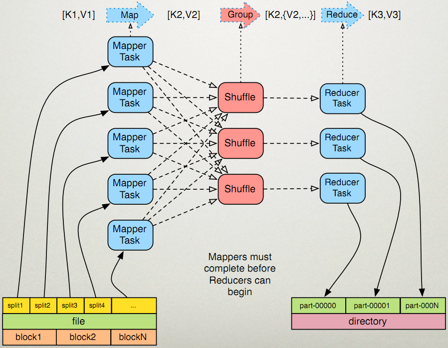
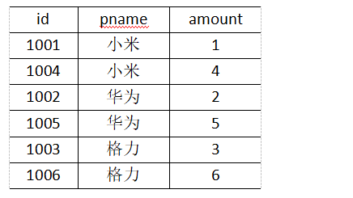
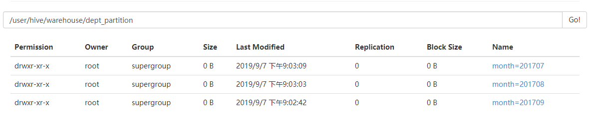
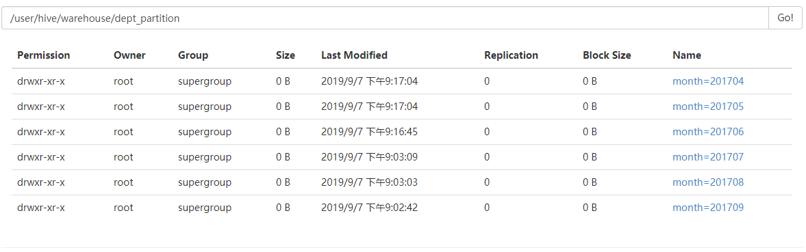
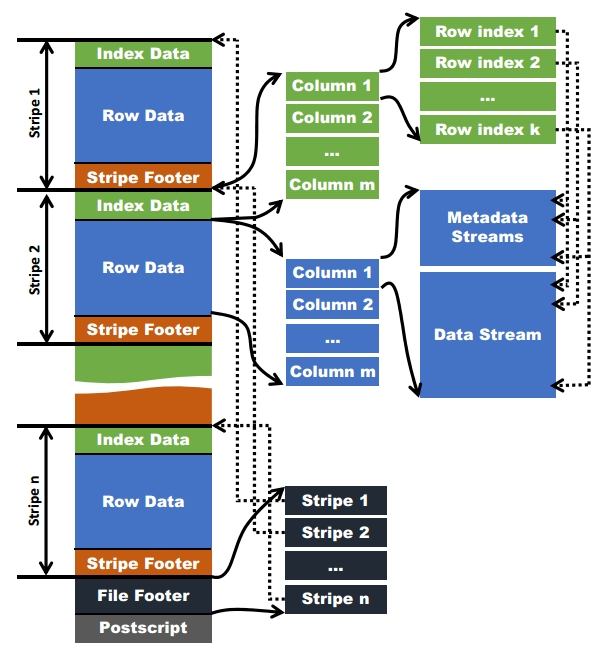
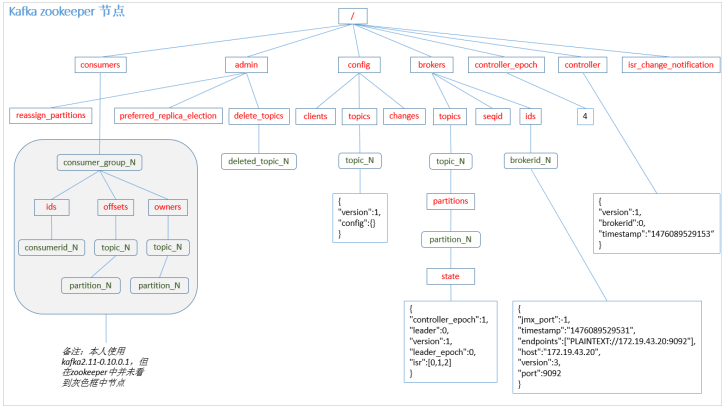
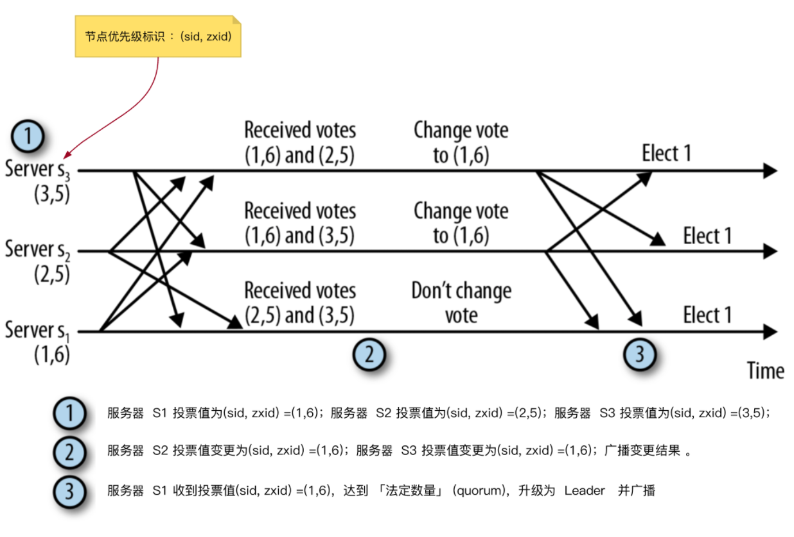

#  Hadoop伪分布式

## 1.解压

```
[root@localhost ~]# tar -zxvf hadoop-2.7.2.tar.gz  -C ./
```

## 2.配置文件

```
[root@localhost hadoop]# pwd
/root/hadoop-2.7.2/etc/hadoop
[root@localhost hadoop]# vim hadoop-env.sh
export JAVA_HOME=/root/jdk1.8.0_144

##############################################################################
[root@localhost hadoop]# vim core-site.xml
<configuration>
     <property>
          <name>fs.defaultFS</name>
          <value>hdfs://192.168.8.99:9000</value>
      </property>
     <!-- 指定hadoop运行时产生文件的存储目录 -->
      <property>
             <name>hadoop.tmp.dir</name>
             <value>/root/hadoop-2.7.2/temp/hdfs</value>
       </property>
</configuration>

##############################################################################
[root@localhost hadoop]# vim hdfs-site.xml
<configuration>
    <!-- 指定HDFS副本的数量 -->
    <property>
          <name>dfs.replication</name>
          <value>1</value>
    </property>
</configuration>

##############################################################################
[root@localhost hadoop]# mv mapred-site.xml.template mapred-site.xml
[root@localhost hadoop]# vim mapred-site.xml 
<!-- 指定mr运行在yarn上 -->
 <property>
	<name>mapreduce.framework.name</name>
	<value>yarn</value>
 </property>
 
 ##############################################################################
[root@localhost hadoop]# vim yarn-site.xml
[root@localhost hadoop]# 
 
<!-- 指定YARN的老大（ResourceManager）的地址 -->
	<property>
	  <name>yarn.resourcemanager.hostname</name>
	  <value>Master</value>
     </property>
<!-- reducer获取数据的方式 -->
     <property>
	   <name>yarn.nodemanager.aux-services</name>
	   <value>mapreduce_shuffle</value>
     </property>
```

## 3.将hadoop添加到环境变量

```
[root@localhost hdfs]# vim /etc/profile
export HADOOP_HOME=/root/hadoop-2.7.2
export PATH=$PATH:$HADOOP_HOME/bin
[root@localhost hdfs]# source /etc/profile
```

## 4.配置ssh

```
[root@localhost ~]# cd .ssh/
[root@localhost .ssh]# ssh-keygen -t rsa
[root@localhost .ssh]# ssh-copy-id localhost
```

## 5.初始化namenode

```
hdfs namenode -format (hadoop namenode -format)
```

## 6.验证是否安装成功

```
[root@localhost rbin]# jps
56657 ResourceManager
57058 Jps
56339 DataNode
56933 NodeManager
56504 SecondaryNameNode
56205 NameNode

http://192.168.8.99:50070 （HDFS管理界面）
http://192.168.8.99:8088 （MR管理界面）
```

# HDFS

## HDFS概述

当数据集的大小超过一台独立物理计算机的存储能力时，就有必要对它进行分区 (partition)并存储到若干台单独的计算机上。管理网络中跨多台计算机存储的文件系统称为分布式文件系统 (Distributed filesystem)。该系统架构于网络之上，势必会引入网络编程的复杂性，因此分布式文件系统比普通磁盘文件系统更为复杂。

HDFS是基于流数据模式访问和处理超大文件的需求而开发的，它可以运行于廉价的商用服务器上。总的来说，可以将 HDFS的主要特点概括为以下几点：

**处理超大文件**

```
这里的超大文件通常是指数百 MB、甚至数百TB 大小的文件。目前在实际应用中， HDFS已经能用来存储管理PB(PeteBytes)级的数据了。在 Yahoo！，Hadoop 集群也已经扩展到了 4000个节点。
```

**流式地访问数据**

```
HDFS的设计建立在更多地响应“一次写入，多次读取”任务的基础之上。这意味着一个数据集一旦由数据源生成，就会被复制分发到不同的存储节点中，然后响应各种各样的数据分析任务请求。在多数情况下，分析任务都会涉及数据集中的大部分数据甚至全部，也就是说，对HDFS 来说，请求读取整个数据集要比读取一条记录更加高效。
```

**运行于廉价的商用机器集群上**

```
Hadoop设计对硬件需求比较低，只须运行在廉价的商用硬件集群上，而无须昂贵的高可用性机器上。廉价的商用机也就意味着大型集群中出现节点故障情况的概率非常高。这就要求在设计 HDFS时要充分考虑数据的可靠性、安全性及高可用性。
```

正是由于以上的种种考虑，我们会发现现在的 HDFS在处理一些特定问题时不但没有优势，而且有一定的局限性，主要表现在以下几个方面。

```
1.不适合低延迟数据访问
如果要处理一些用户要求时间比较短的低延迟应用请求，则 HDFS不适合。HDFS 是为了处理大型数据集分析任务的，主要是为达到高的数据吞吐量而设计的，这就可能要求以高延迟作为代价。 

2.无法高效存储大量小文件
在Hadoop 中需要用 NameNode来管理文件系统的元数据，以响应客户端请求返回文件位置等，因此文件数量大小的限制要由 NameNode来决定。例如，每个文件、索引目录及块大约占 100字节，如果有100 万个文件，每个文件占一个块，那么至少要消耗200MB内存，这似乎还可以接受。但如果有更多文件，那么 NameNode的工作压力更大，检索处理元数据的时间就不可接受了。

3.不支持多用户写入及任意修改文件
在HDFS的一个文件中只有一个写入者，而且写操作只能在文件末尾完成，即只能执行追加操作。目前 HDFS还不支持多个用户对同一文件的写操作，以及在文件任意位置进行修改。
```

## HDFS的相关概念

### 数据块（ block）

我们知道，在操作系统中都有一个文件块的概念，文件以块的形式存储在磁盘中，此处块的大小代表系统读 /写可操作的最小文件大小。也就是说，文件系统每次只能操作磁盘块大小的整数倍数据。通常来说，一个文件系统块为几千字节，而磁盘块大小为 512字节，这些信息对需要读写文件的文件系统用户来说都是透明的。 

这里，我们所要介绍的HDFS中的块是一个抽象的概念，它比上面操作系统中所说的块要大得多。在配置Hadoop系统时会看到，它的默认块为 128MB。和单机上的文件系统相同， HDFS分布式文件系统中的文件也被分成块进行存储，它是文件存储处理的逻辑单元。

为何HDFS 中的块如此之大？ 

**HDFS的块比磁盘块大，其目的是为了最小化寻址开销。**如果块设置得足够大，从磁盘传输数据的时间可以明显大于定位这个块开始位置所需的时间。这样，传输一个由多个块组成的文件的时间取决于磁盘传输速率。

我们来做一个速算，如果寻址时间为 10ms左右，而传输速率为100MB/s，为了使寻址时间仅占传输时间的 1%，我们需要设置块大小为 100MB左右。默认的块大小实际为 128MB，但是很多情况下HDFS使用更大的块。以后随着新一代磁盘驱动器传输速率的提升，块的大小将被设置得更大。但是该参数也不会设置得过大。 MapReduce中的map 任务通常一次处理一个块中的数据，因此如果任务数太少 (少于集群中的节点数量)，作业的运行速度就会比较慢。

HDFS作为一个分布式文件系统，是设计用来处理大文件的，使用抽象的块会带来很多好处。

一个好处是可以存储任意大的文件，而又不会受到网络中任一单个节点磁盘大小的限制。可以想象一下，单个节点磁盘 100TB的数据是不可能的，但是由于逻辑块的设计， HDFS可以将这个超大的文件分成众多块，分别存储在集群的各台机器上。

另外一个好处是使用抽象块而非整个文件作为存储单元，可简化存储子系统的设计。对故障出现频繁和种类繁多的分布式系统来说，简化就显得尤为重要。在 HDFS中块的大小固定，这样它就简化了存储系统的管理，同时也消除对元数据的顾虑，因为这样可以将元数据信息可以和文件块内容分开存储。不仅如此，块还非常适合用于数据备份进而提供数据容错能力和提高可用性。在 HDFS中为了处理节点故障，默认将文件块副本数设定为 3份，分别存储在集群的不同节点上。当一个块损坏时，通过NameNode获取元数据信息，在另外的机器上读取一个副本并进行存储，以保证副本数量回到正常水平。当然，这里的文件块副本冗余量可以通过文件进行配置，比如在有些应用中，可能会为操作频率较高的文件块设置较高的副本数量以提高集群的吞吐量。

**在HDFS集群中，主要有三类角色：NameNode、DataNode和客户端，其结构如下所示：**

 

### NameNode

namenode负责管理分布式文件系统的命名空间。它维护者文件系统树及整颗树内所有的文件和目录。这些信息以两个文件形式永久保存在本地磁盘上：FsImage命名空间镜像文件和EditsLog编辑日志文件。FsImage用于维护文件系统树以及文件树中所有文件和文件夹的元数据，EditsLog中记录了所有针对文件的创建、删除、重命名等操作。namenode也记录着每个文件中各个块所在的数据节点信息，但它并不永久保存块的位置信息，因为这些信息会在系统启动时根据数据节点信息重建。

### DataNode

datanode是分布式文件系统的工作节点。它们负责数据的存储和读取，会根据客户端或者namenode的调度来进行数据的存储和检索，并且定期向namenode发送它们所存储的块的列表。

### SecondaryNameNode

secondarynamenode又称为辅助namenode。secondarynamenode不能被用作namenode，它的重要作用是定期合并namenode编辑日志与命名空间镜像，以防编辑日志过大。但是，secondarynamenode保存的状态总是滞后于主节点namenode。

## NameNode工作机制

SecondaryNameNode 并不是 Hadoop 第二个 NameNode，它不提供 NameNode 服务，而仅仅是 NameNode 的一个工具，帮助 NameNode 管理 Metadata 数据。

一般情况下，当 NameNode 重启的时候，会合并硬盘上的 fsimage 文件和 edits 文件，得到完整的 Metadata 信息。但是在产品集群中NameNode是很少重启的，这也意味着当NameNode运行了很长时间后，edit logs文件会变得很大。那么在重启的时候，这个合并过程就会非常慢，导致 HDFS 长时间无法启动。如果定时将 edits 文件合并到 fsimage，那么重启 NameNode 就可以非常快，而 Secondary NameNode 就做这个合并的工作。

Secondary NameNode 定期地从 NameNode 上获取元数据。当它准备获取元数据的时候，就通知 NameNode 暂停写入 edits 文件。NameNode收到请求后停止写入 edits 文件，之后的 log 记录写入一个名为 edits.new 的文件。Secondary NameNode 获取到元数据以后，把 edits 文件和 fsimage 文件在本机进行合并，创建出一个新的 fsimage 文件，然后把新的 fsimage 文件发送回 NameNode。NameNode 收到 Secondary NameNode 发回的 fsimage 后，就拿它覆盖掉原来的 fsimage 文件，并删除 edits 文件，把 edits.new 重命名为 edits。

 

过程如下： 

```
第一阶段：namenode工作
1.第一次启动namenode格式化后，创建fsimage和edits文件。如果不是第一次启动，直接加载编辑日志和镜像文件到内存。

2.客户端对元数据进行增删改查的请求

3.namenode记录操作日志，更新滚动日志。

4.namenode在内存中对数据进行增删改查

################################################################################################

第二阶段：Secondary NameNode工作
1.SecondaryNamenode会定期的和NameNode通信，询问namenode是否需要checkpoint。如果需要的话，会请求NameNode停止使用edits文件，暂时将新的写操作写到一个新的文件edit.new上来，这个操作是瞬间完成，上层写日志的函数完全感觉不到差别；

2.SecondaryNamenode通过HTTP GET方式从NameNode上获取到fsimage和edits文件，并下载到本地的相应目录下。

3.SecondaryNamenode将下载下来的fsimage载入到内存，然后一条一条地执行edits文件中的各项更新操作，使得内存中的fsimage保存最新。这个过程就是edits和fsimage文件合并。

4.SecondaryNamenode执行完（3）操作之后，会通过post方式将新的fsimage文件发送到NameNode节点上。

5.NameNode将从SecondaryNamenode接收到的新的fsimage替换旧的fsimage文件，同时将edit.new替换edits文件。通过这个过程edits就变小了。
```

## DataNode的工作机制

 

```
1.一个数据块在datanode上以文件形式存储在磁盘上，包括两个文件，一个是数据本身，一个是元数据包括数据块的长度，块数据的校验和，以及时间戳。

2.DataNode启动后向namenode注册，注册成功后，会周期性（1小时）的向namenode上报所有的块信息。

3.心跳是每3秒一次，心跳返回结果带有namenode给该datanode的命令如复制块数据到另一台机器，或删除某个数据块。如果超过10分钟没有收到某个datanode的心跳，则认为该节点不可用。

4.集群运行中可以安全加入和退出一些机器
```

## HDFS数据流

HDFS 的文件访问机制为流式访问机制，即通过 API 打开文件的某个数据块之后，可以顺序读取或者写入某个文件。由于 HDFS 中存在多个角色，且对应的应用场景主要为一次写入、多次读取的场景，因此其读和写的方式有较大不同。读/写操作都由客户端发起，并且由客户端进行整个流程的控制，NameNode 和 DataNode 都是被动式响应

### HDFS写数据流程

  

```
1.客户端调用 DistribuedFileSystem 的 Create() 方法来创建文件。

2.DistributedFileSystem 通过 RPC 连接 NameNode，请求在文件系统的命名空间中创建一个新的文件。NameNode 首先确定文件原来不存在，并且客户端有创建该文件的权限，然后NameNode就会为创建一条新文件记录一条记录。DistributedFileSystem 返回 FSDataOutputStream 对象给客户端用于写数据。

3.客户端调用 FSDataOutputStream 的 Write()方法，向对应的文件写入数据。

4.当客户端开始写入文件时，FSDataOutputStream 会将文件切分成多个分包（Packet），并写入其內部的数据队列。FSDataOutputStream 向 NameNode 申请用来保存文件和副本数据块的若干个 DataNode，这些 DataNode 形成一个数据流管道。

队列中的分包被打包成数据包，发往数据流管道中的第一个 DataNode。第一个 DataNode 将数据包发送给第二个 DataNode，第二个 DataNode 将数据包发送到第三个 DataNode。这样，数据包会流经管道上的各个 DataNode。

5.为了保证所有 DataNode 的数据都是准确的，接收到数据的 DataNode 要向发送者发送确认包（ACK Packet）。确认包沿着数据流管道反向而上，从数据流管道依次经过各个 DataNode，并最终发往客户端。当客户端收到应答时，它将对应的分包从内部队列中移除。

6.不断执行第 (3)~(5)步，直到数据全部写完。

7.客户端调用 FSDataOutputStream 的 Close() 方法，该方法将剩余所有的数据块写入数据流管道中的数据结点，并等待确认返回成功。最后通过告诉 NameNode 完成写入。
```

### HDFS读取数据流程

客户端发起读取请求时，首先与 NameNode 进行连接。

连接建立完成后，客户端会请求读取某个文件的某一个数据块。NameNode 在内存中进行检索，查看是否有对应的文件及文件块，若没有则通知客户端对应文件或数据块不存在，若有则通知客户端对应的数据块存在哪些服务器之上。

客户端接收到信息之后，与对应的 DataNode 连接，并开始进行数据传输。客户端会选择离它最近的一个副本数据进行读操作。

 

```
1.客户端调用 DistributedFileSystem 的 Open() 方法打开文件。

2.DistributedFileSystem 通过 RPC 连接到 NameNode，请求获取文件的数据块的信息。NameNode 返回文件的部分或者全部数据块列表。对于每个数据块，NameNode 都会返回该数据块副本的 DataNode 地址。DistributedFileSystem 返回 FSDataInputStream 给客户端，用来读取数据。

3.客户端调用 FSDataInputStream 的 Read() 方法开始读取数据。

4.FSDataInputStream 连接保存此文件第一个数据块的最近的 DataNode，并以数据流的形式读取数据。客户端多次调用 Read()方法，直到到达数据块结束位置，然后关闭和该DataNode的连接。

5.FSDataInputStream 连接保存此文件下一个数据块的最近的 DataNode，并读取数据。

6.当客户端读取完所有数据块的数据后，调用 FSDataInputStream 的 Close() 方法。
```

## 网络拓扑-节点距离计算

把网络看成一棵树，两个节点间的距离是它们到最近共同祖先的距离总和。

```
distance(/d1/r1/n1,/d1/r1/n1)=0 (同一个节点上的进程)
distance(/d1/r1/n1,/d1/r1/n2)=2 (同一个机架上的不同节点)
distance(/d1/r1/n1,/d1/r2/n3)=4 (同一数据中心中不同机架上的节点)
distance(/d1/r1/n1,/d2/r3/n4)=6 (不同数据中心中的节点)
```

 

这里基于一个网络拓扑案例，介绍在复杂的网络拓扑中hadoop集群每台机器之间的距离。


有了机架感知，NameNode就可以画出上图所示的datanode网络拓扑图。D1，R1都是交换机，最底层是datanode。则H1的rackid=/D1/R1/H1，H1的parent是R1，R1的parent是D1。有了这些rackid信息就可以计算出任意两台datanode之间的距离

```
distance(/D1/R1/H1,/D1/R1/H1)=0 相同的datanode

distance(/D1/R1/H1,/D1/R1/H2)=2 同一rack下的不同datanode

distance(/D1/R1/H1,/D1/R2/H4)=4 同一IDC下的不同datanode

distance(/D1/R1/H1,/D2/R3/H7)=6 不同IDC下的datanode  
```

## 机架感知(副本存放策略)

### 低版本Hadoop副本节点选择

```
第一个副本在client所处的节点上。如果客户端在集群外，随机选一个节点。
第二个副本和第一个副本位于不相同机架的随机节点上。
第三个副本和第二个副本位于相同机架，且随机选择另一个节点。
```

 

### Hadoop2.7.2副本节点选择

```
第一个副本在client所处的节点上。如果客户端在集群外，随机选一个节点。
第二个副本和第一个副本位于相同机架，且随机选择另一个节点。
第三个副本位于不同机架，随机节点。
```

 

我们可以看到，2.7版本在旧版本的基础上，再一次缩短了第一个副本和第二个副本节点之间的距离。而第三个副本存储在其他的机架上则是为了保证高可用，避免同个机架坏了导致文件不可用。

## NameNode故障处理

NameNode故障后，可以通过下列两种方式进行恢复数据：

```
方法一（手动）：将SecondaryNameNode文件下的数据复制到NameNode中
方法二（程序）：使用-importCheckpoint选项启动NameNode的守护线程，从而将SecondaryNameNode文件目录下的数据拷贝到NamenNode中
```

**方法一**

```
模拟NameNode故障，并采用方法一，恢复NameNode的数据。
1.kill -9 NameNode进程

2.删除NameNode存储的数据（$HADOOP_PATH/data/tmp/dfs/name）
$ rm -rf /opt/module/hadoop-2.7.2/data/tmp/dfs/name/*

3.拷贝SecondaryNameNode中的数据到原NameNode存储数据目录中
$ scp -r upuptop@hadoop104:/opt/module/hadoop-2.7.2/data/tmp/dfs/namesecondary/* ./name/

4.重启NameNode
$ sbin/hadoop-daemon.sh start namenode
```

**方法二**

修改hdfs-site.xml文件

```
<property>
  <name>dfs.namenode.checkpoint.period</name>
  <value>120</value>
</property>

<property>
  <name>dfs.namenode.name.dir</name>
  <value>/opt/module/hadoop-2.7.2/data/tmp/dfs/name</value>
</property>
```

模拟NameNode挂掉 

```
kill -9 namenode进程
```

删除namenode存储的数据（/opt/module/hadoop-2.7.2/data/tmp/dfs/name）

```
$ rm -rf /opt/module/hadoop-2.7.2/data/tmp/dfs/name/*
```

如果SecondaryNameNode不和Namenode在一个主机节点上，需要将SecondaryNameNode存储数据的目录拷贝到Namenode存储数据的平级目录，并删除in_use.lock文件。

```
$ scp -r upuptop@hadoop104:/opt/module/hadoop-2.7.2/data/tmp/dfs/namesecondary ./

$ rm -rf in_use.lock

$ pwd
/opt/module/hadoop-2.7.2/data/tmp/dfs

$ ls
data  name  namesecondary
```

导入检查点数据（等待一会ctrl+c结束掉） 

```
$ bin/hdfs namenode -importCheckpoint 
```

启动NameNode 

```
$ sbin/hadoop-daemon.sh start namenode 
```

## HDFS HA高可用

在 Hadoop 1.0 时代，Hadoop 的两大核心组件 HDFS NameNode 和 JobTracker 都存在着单点问题，这其中以 NameNode 的单点问题尤为严重。因为 NameNode 保存了整个 HDFS 的元数据信息，一旦 NameNode 挂掉，整个 HDFS 就无法访问，同时 Hadoop 生态系统中依赖于 HDFS 的各个组件，包括 MapReduce、Hive、Pig 以及 HBase 等也都无法正常工作，并且重新启动 NameNode 和进行数据恢复的过程也会比较耗时。这些问题在给 Hadoop 的使用者带来困扰的同时，也极大地限制了 Hadoop 的使用场景，使得 Hadoop 在很长的时间内仅能用作离线存储和离线计算，无法应用到对可用性和数据一致性要求很高的在线应用场景中。

所幸的是，在 Hadoop2.0 中，HDFS NameNode 和 YARN ResourceManger(JobTracker 在 2.0 中已经被整合到 YARN ResourceManger 之中) 的单点问题都得到了解决，经过多个版本的迭代和发展，目前已经能用于生产环境。HDFS NameNode 和 YARN ResourceManger 的高可用 (High Availability，HA) 方案基本类似，两者也复用了部分代码，但是由于 HDFS NameNode 对于数据存储和数据一致性的要求比 YARN ResourceManger 高得多，所以 HDFS NameNode 的高可用实现更为复杂一些，本文从内部实现的角度对 HDFS NameNode 的高可用机制进行详细的分析。

HDFS NameNode 的高可用整体架构如图 1 所示：


从上图中，我们可以看出 NameNode 的高可用架构主要分为下面几个部分：

Active NameNode 和 Standby NameNode：两台 NameNode 形成互备，一台处于 Active 状态，为主 NameNode，另外一台处于 Standby 状态，为备 NameNode，只有主 NameNode 才能对外提供读写服务。

主备切换控制器 ZKFailoverController：ZKFailoverController 作为独立的进程运行，对 NameNode 的主备切换进行总体控制。ZKFailoverController 能及时检测到 NameNode 的健康状况，在主 NameNode 故障时借助 Zookeeper 实现自动的主备选举和切换，当然 NameNode 目前也支持不依赖于 Zookeeper 的手动主备切换。

Zookeeper 集群：为主备切换控制器提供主备选举支持。

共享存储系统：共享存储系统是实现 NameNode 的高可用最为关键的部分，共享存储系统保存了 NameNode 在运行过程中所产生的 HDFS 的元数据。主 NameNode 和备NameNode 通过共享存储系统实现元数据同步。在进行主备切换的时候，新的主 NameNode 在确认元数据完全同步之后才能继续对外提供服务。

DataNode 节点：除了通过共享存储系统共享 HDFS 的元数据信息之外，主 NameNode 和备 NameNode 还需要共享 HDFS 的数据块和 DataNode 之间的映射关系。DataNode 会同时向主 NameNode 和备 NameNode 上报数据块的位置信息。

### NameNode 的主备切换实现

NameNode 主备切换主要由 ZKFailoverController、HealthMonitor 和 ActiveStandbyElector 这 3 个组件来协同实现：

ZKFailoverController 作为 NameNode 机器上一个独立的进程启动 (在 hdfs 启动脚本之中的进程名为 zkfc)，启动的时候会创建 HealthMonitor 和 ActiveStandbyElector 这两个主要的内部组件，ZKFailoverController 在创建 HealthMonitor 和 ActiveStandbyElector 的同时，也会向 HealthMonitor 和 ActiveStandbyElector 注册相应的回调方法。

HealthMonitor 主要负责检测 NameNode 的健康状态，如果检测到 NameNode 的状态发生变化，会回调 ZKFailoverController 的相应方法进行自动的主备选举。

ActiveStandbyElector 主要负责完成自动的主备选举，内部封装了 Zookeeper 的处理逻辑，一旦 Zookeeper 主备选举完成，会回调 ZKFailoverController 的相应方法来进行 NameNode 的主备状态切换。

NameNode 实现主备切换的流程如图所示，有以下几步：

```
1.HealthMonitor 初始化完成之后会启动内部的线程来定时调用对应 NameNode 的 HAServiceProtocol RPC 接口的方法，对 NameNode 的健康状态进行检测。

2.HealthMonitor 如果检测到 NameNode 的健康状态发生变化，会回调 ZKFailoverController 注册的相应方法进行处理。

3.如果 ZKFailoverController 判断需要进行主备切换，会首先使用 ActiveStandbyElector 来进行自动的主备选举。

4.ActiveStandbyElector 与 Zookeeper 进行交互完成自动的主备选举。

5.ActiveStandbyElector 在主备选举完成后，会回调 ZKFailoverController 的相应方法来通知当前的 NameNode 成为主 NameNode 或备 NameNode。

6.ZKFailoverController 调用对应 NameNode 的 HAServiceProtocol RPC 接口的方法将 NameNode 转换为 Active 状态或 Standby 状态。
```

  

### 脑裂

Zookeeper 在工程实践的过程中经常会发生的一个现象就是 Zookeeper 客户端“假死”，所谓的“假死”是指如果 Zookeeper 客户端机器负载过高或者正在进行 JVM Full GC，那么可能会导致 Zookeeper 客户端到 Zookeeper 服务端的心跳不能正常发出，一旦这个时间持续较长，超过了配置的 Zookeeper Session Timeout 参数的话，Zookeeper 服务端就会认为客户端的 session 已经过期从而将客户端的 Session 关闭。“假死”有可能引起分布式系统常说的双主或脑裂 (brain-split) 现象。

假设 NameNode1 当前为 Active 状态，NameNode2 当前为 Standby 状态。如果某一时刻 NameNode1 对应的 ZKFailoverController 进程发生了“假死”现象，那么 Zookeeper 服务端会认为 NameNode1 挂掉了，那么NameNode2 会替代 NameNode1 进入 Active 状态。但是此时 NameNode1 可能仍然处于 Active 状态正常运行，即使随后 NameNode1 对应的 ZKFailoverController 因为负载下降或者 Full GC 结束而恢复了正常，感知到自己和 Zookeeper 的 Session 已经关闭，但是由于网络的延迟以及 CPU 线程调度的不确定性，仍然有可能会在接下来的一段时间窗口内 NameNode1 认为自己还是处于 Active 状态。

这样 NameNode1 和 NameNode2 都处于 Active 状态，都可以对外提供服务。这种情况对于 NameNode 这类对数据一致性要求非常高的系统来说是灾难性的，数据会发生错乱且无法恢复。Zookeeper 社区对这种问题的解决方法叫做 fencing，中文翻译为隔离，也就是想办法把旧的 Active NameNode 隔离起来，使它不能正常对外提供服务。用隔离防止脑裂，就是保证在任何时候只有一个主NN，包括三个方面：

```
1.第三方共享存储：任一时刻，只有一个 NN 可以写入。
2.DataNode：需要保证只有一个 NN 发出与管理数据副本有关的删除命令。
3.Client：需要保证同一时刻只有一个 NN 能够对 Client 的请求发出正确的响应。
```

## HDFS小文件存储方案

这里“小文件”的一个标准定义不应该说是绝对大小非常小的文件，这样说不够准确，而是应该值不满足一个块大小并且文件本身非常小的文件（比如大量不大1MB的文件）。小文件产生过多的原因很大一部分归结于用户的应用程度在执行的时候没有很好的预估写出数据量的规模，导致写出过多的小文件。

如果小文件产生过多了，它会有什么严重的影响呢？主要为下面2点：

```
1.加重HDFS的namespace命名空间，因为过多的小文件意味着更多文件元数据信息需要NameNode来保存了。

2.读取小文件数据的任务执行时，消耗过多的集群资源。因为map task在执行的时候一般只处理1个文件，如果这个时候要读取的文件过多，就会造成大量的map task启动。
```

### HAR存储方案

HAR又称Hadoop归档文件，文件以*.har结尾。归档的意思就是将多个小文件归档为一个文件，归档文件中包含元数据信息和小文件内容，即从一定程度上减轻了Namenode管理的元数据信息负担。

 


左边是原始小文件，右边是har组成。

```
_masterindex、_index、part-0...part-n。其中_masterindex和_index就是相应的元数据信息，part-0...part-n就是相应的小文件内容。
```

实际在集群中的存储结构如下：

 

通过hadoop archive命令创建归档文件，-archiveName指定文件名， -p指定原文件路径，-r指定要归档的小文件,最后指定hdfs中归档文件存放路径，如下所示：

 

创建后，会在/usr/archive目录下生成test.har目录，这里大家可能会有疑惑，上面不是说Har是一个文件吗，这里怎么又是目录了呢，其实我们所说的归档文件是逻辑上的概念，而实际的har是一个目录，是一个物理存储概念，所以大家只要记住在实际存储时生成的Har实际上是一个目录就行了。这个目录中会存放元数据，实际文件内容。如下图所示，_index文件的每一行表示的是小文件在part开头的映射关系，包括起始和结束位置，是在哪个part文件等，这样在读取har中的小文件时，根据offset位置可直接得到小文件内容，如图part-0文件内容所示：

 

要从HAR读取一个小文件的话，需要用distcp方式，原理也是mapreduce, 指定har路径和输出路径，命令如下：  

```
hadoop distcp har:///user/archive/test.har/file-1 /tmp/archive/output 
```

### SequenceFile存储方案

这种方法的思路是，使用文件名（filename）作为key，并且文件内容（file contents）作为value。对于10000个100KB小文件问题上，你可以编写一个程序将它们放入一个单一的SequenceFile，然后你可以流式处理它们（直接处理或使用MapReduce）操作SequenceFile。这样同时会带来两个优势：

```
1.SequenceFiles是可拆分的，因此MapReduce可以将它们分成块并独立地对每个块进行操作。

2.它们同时支持压缩，不像HAR。 在大多数情况下，块压缩是最好的选择，因为它将压缩几个记录为一个块，而不是一个记录压缩一个块。
```

SequenceFile本质上是一种二进制文件格式，类似key-value存储，通过map/reducer的input/output format方式生成。文件内容由Header、Record/Block、SYNC（同步标识）标记组成，根据压缩的方式不同，组织结构也不同，主要分为Record组织模式和Block组织模式。

#### Record组织模式

Record组织模式又包含两种：未压缩状态CompressionType.NONE, 和压缩状态CompressionType.RECORD，未压缩是指不对数据记录进行压缩，压缩态是指对每条记录的value进行压缩，其逻辑结构如下所示：

 

Record结构中包含Record长度、key长度、key值和value值。Sync充斥在Record之间，其作用主要是在读取文件时能够从任意位置开始识别记录边界。具体定位方式是：如果提供的文件读取位置不是记录的边界可能在一个Record中间，在实际定位时会定位到所提供位置处之后的第一个Sync边界位置，并从该Sync点往后读相应长度的数据，如果提供的读取位置往后没有Sync边界点，则直接跳转文件末尾；如果提供的文件读取位置是Record边界，则直接从该位置开始读取指定长度的数据。另一种文件定位方式是seek，这种方式则要求所提供的读取位置是record的边界位置，不然在读取迭代读取下一个位置时会出错。

#### Block组织模式

Block组织模式，其压缩态为CompressionType.BLOCK。与Record模式不同的时，Block是以块为单位进行压缩，即将多条Record写到一个块中，当达到一定大小时，对该块进行压缩，很显然，块的压缩效率会比Record要高很多，避免大量消费IO和CPU等资源。其逻辑结构如下：

  

从上图中可看出，组织方式变成了块，一个块中又包含了块的记录数，紧接着是四个压缩字段（键长度，键值，值长度，值）。每个块之间也有Sync标记，作用同Record方式。

两中模式中，都有header标记，包含了些如版本信息、KEY类名、VALUE类名、是否压缩标记、是否块压缩标记、编码类、元数据信息和Sync标记，其结构如下：

 

这里以存储5个小的图片文件为例，演示下如何创建SequenceFile。首先将图片文件上传至hdfs的一个目录。

 

其次，编写一个MR程序来对上述图片进行转换，将生成的文件存放到/tmp/sequencefile/seq下，MR程序源码在附件SmallFiles.zip中，可自行查看，如下所示：

 

转换后，会在/tmp/sequencefile/seq目录生成一个part-r-00000文件，这个文件里面就包含了上述5个图片文件的内容，如下所示：

 

如果要从该SequenceFile中获取所有图片文件，再通过MR程序从文件中将图片文件取出，如下所示：


## HDFS安全模式

安全模式是HDFS所处的一种特殊状态，在这种状态下，文件系统只接受读数据请求，而不接受删除、修改等变更请求。当 Hadoop的NameNode节点启动时，就会进入安全模式阶段。在此阶段，DataNode会向NameNode上传它们数据块的列表，让 NameNode得到块的位置信息，并对每个文件对应的数据块副本进行统计。当最小副本条件满足时，即一定比例的数据块都达到最小副本数，系统就会退出安全模式，而这需要一定的延迟时间。当最小副本条件未达到要求时，就会对副本数不足的数据块安排DataNode进行复制，直至达到最小副本数。 

下面是namenode的一个日志片段：

 

### 安全模式结束的条件

NameNode完成一部分比例(可配置)的数据检查再过30s(可配置)，NameNode会自动退出Safemode状态。在 hdfs-site.xml 文件中配置。

| 配置项                     | 注释                                                      |
| -------------------------- | --------------------------------------------------------- |
| dfs.safemode.threshold.pct | 指定退出条件，需要达到最小副本数的数据块比例，默认是0.999 |
| dfs.safemode.extension     | 指定系统退出安全模式时需要的延迟时间，默认为30s           |

如果datanode丢失的block达到一定的比例（dfs.safemode.threshold.pct），则系统会一直处于安全模式状态即只读状态。dfs.safemode.threshold.pct（缺省值0.999f）表示HDFS启动的时候，如果DataNode上报的block个数达到了元数据记录的block个数的0.999倍才可以离开安全模式，否则一直是这种只读模式。如果设为1则HDFS永远是处于安全模式。

### 相关的操作命令

Hadoop提供脚本用于对安全模式进行操作，主要命令为：

```
hadoop dfsadmin -safemode <command>
```

command的可用取值如下：

| command |           功能           |
| :-----: | :----------------------: |
|   get   |       查看当前状态       |
|  enter  |       进入安全模式       |
|  leave  |     强制离开安全模式     |
|  wait   | 一直等待直到安全模式结束 |

## HDFS的shell操作

```
[root@Master bin]# hadoop fs 
Usage: hadoop fs [generic options]
        [-appendToFile <localsrc> ... <dst>]       //追加一个文件到已经存在的文件末尾
        [-cat [-ignoreCrc] <src> ...]           //显示文件内容
        [-checksum <src> ...]
        [-chgrp [-R] GROUP PATH...]           //-chgrp 、-chmod、-chown：Linux文件系统中的用法一                                                 //样，修改文件所属权限
        [-chmod [-R] <MODE[,MODE]... | OCTALMODE> PATH...]
        [-chown [-R] [OWNER][:[GROUP]] PATH...]
        [-copyFromLocal [-f] [-p] <localsrc> ... <dst>]      //从本地文件复制粘贴到HDFS 
        [-copyToLocal [-p] [-ignoreCrc] [-crc] <src> ... <localdst>]  //从HDFS复制粘贴到本地
        [-count [-q] <path> ...]
        [-cp [-f] [-p | -p[topax]] <src> ... <dst>]
        [-createSnapshot <snapshotDir> [<snapshotName>]]
        [-deleteSnapshot <snapshotDir> <snapshotName>]
        [-df [-h] [<path> ...]]
        [-du [-s] [-h] <path> ...]   //统计文件夹的大小信息
        [-expunge]
        [-get [-p] [-ignoreCrc] [-crc] <src> ... <localdst>] //等同于copyToLocal，就是从HDFS下载                                                              //文件到本地
        [-getfacl [-R] <path>]
        [-getfattr [-R] {-n name | -d} [-e en] <path>]
        
        [-getmerge [-nl] <src> <localdst>]  //合并下载多个文件，比如HDFS的目录 /user/atguigu/test                                             //下有多个文件:log.1, log.2,log.3,...
        [-help [cmd ...]]
        [-ls [-d] [-h] [-R] [<path> ...]] 
        [-mkdir [-p] <path> ...]          //创建文件夹
        [-moveFromLocal <localsrc> ... <dst>]    //从本地剪切粘贴到HDFS     
        [-moveToLocal <src> <localdst>]          //从HDFS剪切粘贴到本地  
        [-mv <src> ... <dst>]
        [-put [-f] [-p] <localsrc> ... <dst>]           //上传文件
        [-renameSnapshot <snapshotDir> <oldName> <newName>]
        [-rm [-f] [-r|-R] [-skipTrash] <src> ...]      //删除文件
        [-rmdir [--ignore-fail-on-non-empty] <dir> ...]  //删除空目录
        [-setfacl [-R] [{-b|-k} {-m|-x <acl_spec>} <path>]|[--set <acl_spec> <path>]]
        [-setfattr {-n name [-v value] | -x name} <path>]
        [-setrep [-R] [-w] <rep> <path> ...]  //设置HDFS中文件的副本数量
        [-stat [format] <path> ...]
        [-tail [-f] <file>]   //显示一个文件的末尾
        [-test -[defsz] <path>]
        [-text [-ignoreCrc] <src> ...]
        [-touchz <path> ...]
        [-usage [cmd ...]]

[root@Master bin]# 
```

**常用命令实操**

启动Hadoop集群

```
[root@Slave1 sbin]# ./start-dfs.sh
[root@Master sbin]# ./start-yarn.sh
```

-help：输出这个命令参数

```
[root@Slave1 sbin]# hadoop fs -help rm
-rm [-f] [-r|-R] [-skipTrash] <src> ... :
  Delete all files that match the specified file pattern. Equivalent to the Unix
  command "rm <src>"
                                                                                 
  -skipTrash  option bypasses trash, if enabled, and immediately deletes <src>   
  -f          If the file does not exist, do not display a diagnostic message or 
              modify the exit status to reflect an error.                        
  -[rR]       Recursively deletes directories                                    
[root@Slave1 sbin]# 
```

-ls: 显示目录信息

```
[root@Slave1 sbin]# hadoop fs -ls  /
Found 6 items
drwxr-xr-x   - root supergroup          0 2019-08-19 19:19 /exam
drwxr-xr-x   - root supergroup          0 2019-08-19 19:24 /origin_data
drwxr-xr-x   - root supergroup          0 2019-08-19 19:20 /result
drwxr-xr-x   - root supergroup          0 2019-08-28 00:15 /tez
drwx------   - root supergroup          0 2019-08-28 00:13 /tmp
drwxr-xr-x   - root supergroup          0 2019-08-28 00:20 /user
[root@Slave1 sbin]# 
```

-mkdir：在HDFS上创建目录 

```
[root@Slave1 sbin]# hadoop fs -mkdir /12sss
[root@Slave1 sbin]# hadoop fs -ls /
Found 8 items
drwxr-xr-x   - root supergroup          0 2019-08-27 15:48 /12
drwxr-xr-x   - root supergroup          0 2019-08-27 15:48 /12sss
drwxr-xr-x   - root supergroup          0 2019-08-19 19:19 /exam
drwxr-xr-x   - root supergroup          0 2019-08-19 19:24 /origin_data
drwxr-xr-x   - root supergroup          0 2019-08-19 19:20 /result
drwxr-xr-x   - root supergroup          0 2019-08-28 00:15 /tez
drwx------   - root supergroup          0 2019-08-28 00:13 /tmp
drwxr-xr-x   - root supergroup          0 2019-08-28 00:20 /user
[root@Slave1 sbin]# 
```

-moveFromLocal：从本地剪切粘贴到HDFS

```
[root@Slave1 ~]# hadoop fs  -moveFromLocal initial-setup-ks.cfg   /12sss/
[root@Slave1 ~]# ls
anaconda-ks.cfg  apache-flume-1.7.0  code  data  hadoop-2.7.2  hadoop-lzo-0.4.20.jar  jdk1.8.0_144  kafka_2.11  profile  scala-2.11.8  spark-2.1.1  zookeeper-3.4.10  zookeeper.out
[root@Slave1 ~]# hadoop fs  -ls    /12sss/                                 
Found 1 items
-rw-r--r--   3 root supergroup       1781 2019-08-27 15:50 /12sss/initial-setup-ks.cfg
[root@Slave1 ~]# 
```

-appendToFile：追加一个文件到已经存在的文件末尾

```
[root@Slave1 ~]# hadoop fs -appendToFile girl.txt  /exam/xx.txt
```

-cat：显示文件内容

```
[root@Slave1 ~]# hadoop fs -cat  /exam/xx.txt/
hello tom 
killt he
hel   lh
```

-chgrp 、-chmod、-chown：Linux文件系统中的用法一样，修改文件所属权限

```
[root@Slave1 ~]# hadoop fs -chown root:root /12sss
[root@Slave1 ~]# hadoop fs -ls /
Found 8 items
drwxr-xr-x   - root supergroup          0 2019-08-27 15:48 /12
drwxr-xr-x   - root root                0 2019-08-27 15:50 /12sss
drwxr-xr-x   - root supergroup          0 2019-08-28 00:20 /user
[root@Slave1 ~]# 
```

-copyFromLocal：从本地文件系统中拷贝文件到HDFS路径去

```
[root@Slave1 ~]# hadoop fs -copyFromLocal README.txt  /exam/  
[root@Slave1 ~]# hadoop fs -ls /exam/
Found 3 items
-rw-r--r--   3 root supergroup         25 2019-08-27 16:22 /exam/README.txt
-rw-r--r--   3 root supergroup         11 2019-08-27 16:15 /exam/girl.txt
-rw-r--r--   5 root supergroup         30 2019-08-19 19:19 /exam/xx.txt
[root@Slave1 ~]# 
```

-copyToLocal：从HDFS拷贝到本地

```
[root@Slave1 ~]# hadoop fs -copyToLocal  /exam/README.txt  ./SBR.txt  //拷贝到本地并且重命名为                                                                           //SBR.txt 
```

-get：等同于copyToLocal，就是从HDFS下载文件到本地

```
[root@Slave1 ~]# ls

[root@Slave1 ~]# hadoop fs -get /exam/xx.txt
[root@Slave1 ~]# ls
xx.txt   
[root@Slave1 ~]# hadoop fs -get /exam/xx.txt  ./kskdkf.txt
[root@Slave1 ~]# ls
kskdkf.txt    xx.txt   
```

-getmerge：合并下载多个文件，比如HDFS的目录 /user/atguigu/test下有多个文件:log.1, log.2,log.3,...

```
[root@Slave1 ~]# hadoop fs -copyFromLocal girl.txt  /exam/  
[root@Slave1 ~]# hadoop fs -ls  /exam/                      
Found 2 items
-rw-r--r--   3 root supergroup         11 2019-08-27 16:15 /exam/girl.txt
-rw-r--r--   5 root supergroup         30 2019-08-19 19:19 /exam/xx.txt
[root@Slave1 ~]# hadoop fs -getmerge /exam/*  ./ha.txt          
[root@Slave1 ~]# cat ha.txt 
i love you
hello tom 
killt he
hel   lh

[root@Slave1 ~]# 
```

-tail：显示一个文件的末尾

```
[root@Slave1 ~]# hadoop fs -tail /exam/xx.txt
hello tom 
killt he
hel   lh
```

-rmdir：删除空目录

```
[root@Slave1 ~]# hadoop fs -rmdir /12sss
rmdir: `/12sss': Directory is not empty
[root@Slave1 ~]# hadoop fs -rm /12sss/* 
19/08/27 16:02:53 INFO fs.TrashPolicyDefault: Namenode trash configuration: Deletion interval = 0 minutes, Emptier interval = 0 minutes.
Deleted /12sss/initial-setup-ks.cfg
[root@Slave1 ~]# hadoop fs -rmdir  /12sss/
[root@Slave1 ~]# 
```

-du统计文件夹的大小信息

```
[root@Slave1 ~]# hadoop fs -du -s -h /user/  //总的
48.9 M  /user
[root@Slave1 ~]# hadoop fs -du -h /user/    //分开的
29.2 M  /user/hive
19.6 M  /user/root
[root@Slave1 ~]#
```

-setrep：设置HDFS中文件的副本数量

```
[root@Slave1 ~]# hadoop fs -setrep 5 /exam
Replication 5 set: /exam/xx.txt
```


这里设置的副本数只是记录在NameNode的元数据中，是否真的会有这么多副本，还得看DataNode的数量。因为目前只有3台设备，最多也就3个副本，只有节点数的增加到10台时，副本数才能达到10。

## HDFS客户端操作

### 环境准备

1.创建一个maven项目，并添加以下依赖：

    <?xml version="1.0" encoding="UTF-8"?>
    <project xmlns="http://maven.apache.org/POM/4.0.0"
             xmlns:xsi="http://www.w3.org/2001/XMLSchema-instance"
             xsi:schemaLocation="http://maven.apache.org/POM/4.0.0 http://maven.apache.org/xsd/maven-4.0.0.xsd">
        <modelVersion>4.0.0</modelVersion>
    
        <groupId>com.lx</groupId>
        <artifactId>hdfs_demo</artifactId>
        <version>1.0-SNAPSHOT</version>
    
        <dependencies>
            <dependency>
                <groupId>junit</groupId>
                <artifactId>junit</artifactId>
                <version>RELEASE</version>
            </dependency>
            <dependency>
                <groupId>org.apache.logging.log4j</groupId>
                <artifactId>log4j-core</artifactId>
                <version>2.8.2</version>
            </dependency>
            <dependency>
                <groupId>org.apache.hadoop</groupId>
                <artifactId>hadoop-common</artifactId>
                <version>2.7.2</version>
            </dependency>
            <dependency>
                <groupId>org.apache.hadoop</groupId>
                <artifactId>hadoop-client</artifactId>
                <version>2.7.2</version>
            </dependency>
            <dependency>
                <groupId>org.apache.hadoop</groupId>
                <artifactId>hadoop-hdfs</artifactId>
                <version>2.7.2</version>
            </dependency>
            <dependency>
                <groupId>jdk.tools</groupId>
                <artifactId>jdk.tools</artifactId>
                <version>1.8</version>
                <scope>system</scope>
                <systemPath>D:/jdk1.8.0_191/lib/tools.jar</systemPath>
            </dependency>
        </dependencies>
    
    </project>

2.将hdfs-site.xml拷贝到项目的根目录下

### 上传文件

        @Test
        public void testCopyFromLocalFile() throws IOException, InterruptedException, URISyntaxException {
    
            // 1 获取文件系统
            Configuration configuration = new Configuration();
            configuration.set("dfs.replication", "1");
            FileSystem fs = FileSystem.get(new URI("hdfs://192.168.8.99:9000"), configuration, "root");
    
            // 2 上传文件
            fs.copyFromLocalFile(new Path("G://hdfs-site.xml"), new Path("/"));
    
            // 3 关闭资源
            fs.close();
    
            System.out.println("over");
        }
### 下载文件

```
    @Test
    public void testCopyToLocalFile() throws IOException, InterruptedException, URISyntaxException{

        // 1 获取文件系统
        Configuration configuration = new Configuration();
        FileSystem fs = FileSystem.get(new URI("hdfs://192.168.8.99:9000"), configuration, "root");

        // 2 执行下载操作
        // boolean delSrc 指是否将原文件删除
        // Path src 指要下载的文件路径
        // Path dst 指将文件下载到的路径
        // boolean useRawLocalFileSystem 是否开启文件校验
        fs.copyToLocalFile(true, new Path("/hdfs-site.xml"), new Path("G:/haha.xml"), true);

        // 3 关闭资源
        fs.close();
    }
```

### 文件和文件夹判断

        @Test
        public void testListStatus() throws IOException, InterruptedException, URISyntaxException{
    
            // 1 获取文件配置信息
            Configuration configuration = new Configuration();
            FileSystem fs = FileSystem.get(new URI("hdfs://192.168.8.99:9000"), configuration, "root");
    
            // 2 判断是文件还是文件夹
            FileStatus[] listStatus = fs.listStatus(new Path("/"));
    
            for (FileStatus fileStatus : listStatus) {
    
                // 如果是文件
                if (fileStatus.isFile()) {
                    System.out.println("f:"+fileStatus.getPath().getName());
                }else {
                    System.out.println("d:"+fileStatus.getPath().getName());
                }
            }
    
            // 3 关闭资源
            fs.close();
        }
##HDFS的I/O流操作

上面我们学的API操作HDFS系统都是框架封装好的。那么如果我们想自己实现上述API的操作该怎么实现呢？
我们可以采用IO流的方式实现数据的上传和下载。

### 文件上传

	    @Test
	    public void putFileToHDFS() throws IOException, InterruptedException, URISyntaxException {
	
	        // 1 获取文件系统
	        Configuration configuration = new Configuration();
	        FileSystem fs = FileSystem.get(new URI("hdfs://192.168.8.99:9000"), configuration, "root");
	
	        // 2 创建输入流
	        FileInputStream fis = new FileInputStream(new File("G:/haha.xml"));
	
	        // 3 获取输出流
	        FSDataOutputStream fos = fs.create(new Path("/hahaAA.xml"));
	
	        // 4 流对拷
	        IOUtils.copyBytes(fis, fos, configuration);
	
	        // 5 关闭资源
	        IOUtils.closeStream(fos);
	        IOUtils.closeStream(fis);
	        fs.close();
	    }
### 文件下载

    // 文件下载
    @Test
    public void getFileFromHDFS() throws IOException, InterruptedException, URISyntaxException{
    
        // 1 获取文件系统
        Configuration configuration = new Configuration();
        FileSystem fs = FileSystem.get(new URI("hdfs://192.168.8.99:9000"), configuration, "root");
    
        // 2 获取输入流
        FSDataInputStream fis = fs.open(new Path("/hahaAA.xml"));
    
        // 3 获取输出流
        FileOutputStream fos = new FileOutputStream(new File("G:/hbhbBB.xml"));
    
        // 4 流的对拷
        IOUtils.copyBytes(fis, fos, configuration);
    
        // 5 关闭资源
        IOUtils.closeStream(fos);
        IOUtils.closeStream(fis);
        fs.close();
    }

# MapReduce

## IDEA编写MapReduce

1.创建一个Maven工程

 

2.修改Maven路径


3.在pom.xml添加以下依赖

```
<dependencies>
		<dependency>
			<groupId>junit</groupId>
			<artifactId>junit</artifactId>
			<version>RELEASE</version>
		</dependency>
		<dependency>
			<groupId>org.apache.logging.log4j</groupId>
			<artifactId>log4j-core</artifactId>
			<version>2.8.2</version>
		</dependency>
		<dependency>
			<groupId>org.apache.hadoop</groupId>
			<artifactId>hadoop-common</artifactId>
			<version>2.7.2</version>
		</dependency>
		<dependency>
			<groupId>org.apache.hadoop</groupId>
			<artifactId>hadoop-client</artifactId>
			<version>2.7.2</version>
		</dependency>
		<dependency>
			<groupId>org.apache.hadoop</groupId>
			<artifactId>hadoop-hdfs</artifactId>
			<version>2.7.2</version>
		</dependency>
</dependencies>
```

4.设置日志输出


```
log4j.rootLogger=INFO, stdout
log4j.appender.stdout=org.apache.log4j.ConsoleAppender
log4j.appender.stdout.layout=org.apache.log4j.PatternLayout
log4j.appender.stdout.layout.ConversionPattern=%d %p [%c] - %m%n
log4j.appender.logfile=org.apache.log4j.FileAppender
log4j.appender.logfile.File=target/spring.log
log4j.appender.logfile.layout=org.apache.log4j.PatternLayout
log4j.appender.logfile.layout.ConversionPattern=%d %p [%c] - %m%n
```

5.编写Mapper

    package com.lx.mr;
    
    import java.io.IOException;
    import org.apache.hadoop.io.IntWritable;
    import org.apache.hadoop.io.LongWritable;
    import org.apache.hadoop.io.Text;
    import org.apache.hadoop.mapreduce.Mapper;
    
    public class WordcountMapper extends Mapper<LongWritable, Text, Text, IntWritable>{
    
        Text k = new Text();
        IntWritable v = new IntWritable(1);
    
        @Override
        protected void map(LongWritable key, Text value, Context context)	throws IOException, InterruptedException {
    
            // 1 获取一行
            String line = value.toString();
    
            // 2 切割
            String[] words = line.split(" ");
    
            // 3 输出
            for (String word : words) {
    
                k.set(word);
                context.write(k, v);
            }
        }
    }
6.编写Reducer

    package com.lx.mr;
    
    import java.io.IOException;
    import org.apache.hadoop.io.IntWritable;
    import org.apache.hadoop.io.Text;
    import org.apache.hadoop.mapreduce.Reducer;
    
    public class WordcountReducer extends Reducer<Text, IntWritable, Text, IntWritable>{
    
        int sum;
        IntWritable v = new IntWritable();
    
        @Override
        protected void reduce(Text key, Iterable<IntWritable> values,Context context) throws IOException, InterruptedException {
    
            // 1 累加求和
            sum = 0;
            for (IntWritable count : values) {
                sum += count.get();
            }
    
            // 2 输出
            v.set(sum);
            context.write(key,v);
        }
    }

7.编写Driver驱动类

    package com.lx.mr;
    
    import java.io.IOException;
    import org.apache.hadoop.conf.Configuration;
    import org.apache.hadoop.fs.Path;
    import org.apache.hadoop.io.IntWritable;
    import org.apache.hadoop.io.Text;
    import org.apache.hadoop.mapreduce.Job;
    import org.apache.hadoop.mapreduce.lib.input.FileInputFormat;
    import org.apache.hadoop.mapreduce.lib.output.FileOutputFormat;
    
    public class WordcountDriver {
    
        public static void main(String[] args) throws IOException, ClassNotFoundException, InterruptedException {
    
            // 1 获取配置信息以及封装任务
            Configuration configuration = new Configuration();
            Job job = Job.getInstance(configuration);
    
            // 2 设置jar加载路径
            job.setJarByClass(WordcountDriver.class);
    
            // 3 设置map和reduce类
            job.setMapperClass(WordcountMapper.class);
            job.setReducerClass(WordcountReducer.class);
    
            // 4 设置map输出
            job.setMapOutputKeyClass(Text.class);
            job.setMapOutputValueClass(IntWritable.class);
    
            // 5 设置最终输出kv类型
            job.setOutputKeyClass(Text.class);
            job.setOutputValueClass(IntWritable.class);
    
            // 6 设置输入和输出路径
            FileInputFormat.setInputPaths(job, new Path("E:/Iproject/mr/src/test/data/wc.txt"));
            FileOutputFormat.setOutputPath(job, new Path("E:/Iproject/mr/src/test/data/out.txt"));
    
            // 7 提交
            boolean result = job.waitForCompletion(true);
    
            System.exit(result ? 0 : 1);
        }
    }
8.输出结果

 

## hadoop序列化

### 序列化和反序列

序列化是指将结构化对象转化为字节流以便在网络上传输或写到磁盘进行永久存储的过程。反序列化是指将字节流转化转回结构化对象的逆过程。 

### Java序列化

Java的序列化是一个重量级序列化框架（Serializable），一个对象被序列化后，会附带很多额外的信息（比如各种校验信息，header，继承体系等），不便于在网络中高效传输。所以，hadoop自己开发了一套序列化机制（Writable），特点如下：

```
1.紧凑：紧凑的格式能让我们充分利用网络带宽，而带宽是数据中心最稀缺的资源。

2.快速：进程间通信形成了分布式系统的骨架，所以需要尽量减少序列化和反序列化的性能开销，这是基本的。

3.可扩展：为了满足新的需求，协议不断变化。所以控制客户端和服务器过程中，需要直接引进相应的协议。这些新协议，可以透明地读取老格式的数据。

4.支持互操作：能支持不同语言写的客户端与服务端进行交互。也就是可以使用不同的语言读/写永久存储的数据。
```

### Writable类

Hadoop自带的org.apache.hadoop.io包中有广泛的Writable类可供选择。

   

#### Java基本类型的Writable类

  

对整数进行编码，可选择长格式(IntWritable、LongWritable)和变长格式(VIntWritable、VLongWritable)。

定长格式适合对整个值域空间中分布非常均匀的数值进行编码。然而大多数数值变量分布都不均匀，而且变长格式一般更节省空间。变长格式可以在VIntWritable和VLongWritable中转换。

#### Text类型

Text是针对UTF-8序列的Writable类，一般可以认为它是java.lang.String的Writable等价。

### 自定义bean对象实现序列化接口（Writable）

统计每一个手机号耗费的总上行流量、下行流量、总流量。

编写流量统计的Bean对象

    package com.lx.bean;
    
    import java.io.DataInput;
    import java.io.DataOutput;
    import java.io.IOException;
    import org.apache.hadoop.io.Writable;
    
    // 1 实现writable接口
    public class FlowBean implements Writable{
    
        private long upFlow;
        private long downFlow;
        private long sumFlow;
    
        //2  反序列化时，需要反射调用空参构造函数，所以必须有
        public FlowBean() {
            super();
        }
    
        public FlowBean(long upFlow, long downFlow) {
            super();
            this.upFlow = upFlow;
            this.downFlow = downFlow;
            this.sumFlow = upFlow + downFlow;
        }
    
        //3  写序列化方法
    
        @Override
        public void write(DataOutput out) throws IOException {
            out.writeLong(upFlow);
            out.writeLong(downFlow);
            out.writeLong(sumFlow);
        }
        
        //4 反序列化方法
        //5 反序列化方法读顺序必须和写序列化方法的写顺序必须一致
        @Override
        public void readFields(DataInput in) throws IOException {
            this.upFlow  = in.readLong();
            this.downFlow = in.readLong();
            this.sumFlow = in.readLong();
        }
    
        // 6 编写toString方法，方便后续打印到文本
        @Override
        public String toString() {
            return upFlow + "AA\t" + downFlow + "BB\t" + sumFlow+"CC\t";
        }
    
        public long getUpFlow() {
            return upFlow;
        }
    
        public void setUpFlow(long upFlow) {
            this.upFlow = upFlow;
        }
    
        public long getDownFlow() {
            return downFlow;
        }
    
        public void setDownFlow(long downFlow) {
            this.downFlow = downFlow;
        }
    
        public long getSumFlow() {
            return sumFlow;
        }
    
        public void setSumFlow(long sumFlow) {
            this.sumFlow = sumFlow;
        }
    
        public  void  set(Long downFlow,Long upFlow){
            this.setDownFlow(downFlow);
            this.setUpFlow(upFlow);
        }
    }
编写Mapper类


    package com.lx.bean;
    
    import java.io.IOException;
    import org.apache.hadoop.io.LongWritable;
    import org.apache.hadoop.io.Text;
    import org.apache.hadoop.mapreduce.Mapper;
    import com.lx.bean.FlowBean;
    
    public class FlowCountMapper extends Mapper<LongWritable, Text, Text, FlowBean>{
    
        FlowBean v = new FlowBean();
        Text k = new Text();
    
        @Override
        protected void map(LongWritable key, Text value, Context context)	throws IOException, InterruptedException {
    
            // 1 获取一行
            String line = value.toString();
    
            // 2 切割字段
            String[] fields = line.split("\t");
    
            // 3 封装对象
            // 取出手机号码
            String phoneNum = fields[1];
    
            // 取出上行流量和下行流量
            long upFlow = Long.parseLong(fields[fields.length - 3]);
            long downFlow = Long.parseLong(fields[fields.length - 2]);
    
            k.set(phoneNum);
            v.set(downFlow, upFlow);
            // 4 写出
            context.write(k, v);
        }
    }   


编写Reducer类

    package com.lx.bean;
    
    import java.io.IOException;
    import org.apache.hadoop.io.Text;
    import org.apache.hadoop.mapreduce.Reducer;
    
    public class FlowCountReducer extends Reducer<Text, FlowBean, Text, FlowBean> {
    
        @Override
        protected void reduce(Text key, Iterable<FlowBean> values, Context context)throws IOException, InterruptedException {
    
            long sum_upFlow = 0;
            long sum_downFlow = 0;
    
            // 1 遍历所用bean，将其中的上行流量，下行流量分别累加
            for (FlowBean flowBean : values) {
                sum_upFlow += flowBean.getUpFlow();
                sum_downFlow += flowBean.getDownFlow();
            }
    
            // 2 封装对象
            FlowBean resultBean = new FlowBean(sum_upFlow, sum_downFlow);
    
            // 3 写出
            context.write(key, resultBean);
        }
    }

编写Driver驱动类

    package com.lx.bean;
    import java.io.IOException;
    import org.apache.hadoop.conf.Configuration;
    import org.apache.hadoop.fs.Path;
    import org.apache.hadoop.io.Text;
    import org.apache.hadoop.mapreduce.Job;
    import org.apache.hadoop.mapreduce.lib.input.FileInputFormat;
    import org.apache.hadoop.mapreduce.lib.output.FileOutputFormat;
    
    public class FlowsumDriver {
    
        public static void main(String[] args) throws IllegalArgumentException, IOException, ClassNotFoundException, InterruptedException {
    
    // 输入输出路径需要根据自己电脑上实际的输入输出路径设置
    //        args = new String[] { "e:/input/inputflow", "e:/output1" };
    
            // 1 获取配置信息，或者job对象实例
            Configuration configuration = new Configuration();
            Job job = Job.getInstance(configuration);
    
            // 6 指定本程序的jar包所在的本地路径
            job.setJarByClass(FlowsumDriver.class);
    
            // 2 指定本业务job要使用的mapper/Reducer业务类
            job.setMapperClass(FlowCountMapper.class);
            job.setReducerClass(FlowCountReducer.class);
    
            // 3 指定mapper输出数据的kv类型
            job.setMapOutputKeyClass(Text.class);
            job.setMapOutputValueClass(FlowBean.class);
    
            // 4 指定最终输出的数据的kv类型
            job.setOutputKeyClass(Text.class);
            job.setOutputValueClass(FlowBean.class);
    
            // 5 指定job的输入原始文件所在目录
            FileInputFormat.setInputPaths(job, new Path("E:/Iproject/mr/src/test/data/phone_data.txt"));
            FileOutputFormat.setOutputPath(job, new Path("E:/Iproject/mr/src/test/data/out_phone_data.txt"));
    
            // 7 将job中配置的相关参数，以及job所用的java类所在的jar包， 提交给yarn去运行
            boolean result = job.waitForCompletion(true);
            System.exit(result ? 0 : 1);
        }
    }
输出结果

 

## 切片与MapTask并行度决定机制

数据块：Block是HDFS物理上把数据分成一块一块。

数据切片：数据切片只是在逻辑上对输入进行分片，并不会在磁盘上将其切分成片进行存储。

输入分片（InputSplit）：在进行map计算之前，mapreduce会根据输入文件计算输入分片（InputSplit），每个输入分片（input split）针对一个map任务，输入分片（InputSplit）存储的并非数据本身，而是一个分片长度和一个记录数据的位置的数组。

 

```
1.一个Job的Map阶段并行度由客户端在提交Job时的切片数量决定。

2.每个Split切片分配一个MapperTask并行处理。

3.默认情况下，切片大小=BlockSize

4.切片时不考虑数据集整体，而是逐个针对每个文件单独切片。
```

## MapReduce输入格式

FileInputFormat是所有使用文件作为其输入源的InputFormat实现的基类。它提供两个功能：一个用于指出作业的输入文件的位置；一个是为输入文件实现分片代码的实现。把分片分割成记录的作业由其子类来完成。

  

### 输入路径设置

#### FileInputFormat

FileInputFormat是所有使用文件作为其数据源的 InputFormat 实现的基类，它的主要作用是指出作业的输入文件位置。因为作业的输入被设定为一组路径， 这对指定作业输入提供了很强的灵活性。FileInputFormat 提供了四种静态方法来设定 Job 的输入路径：

```
public static void addInputPath(Job job,Path path);

public static void addInputPaths(Job job,String commaSeparatedPaths);

public static void setInputPaths(Job job,Path... inputPaths);

public static void setInputPaths(Job job,String commaSeparatedPaths);
```

addInputPath()、addInputPaths()方法可以将一个或多个路径加入路径列表，可以分别调用这两种方法来建立路径列表；setInputPaths()方法一次设定完整的路径列表，替换前面调用中在 Job 上所设置的所有路径。它们具体的使用方法，看如下示例：

    // 设置一个源路径
    FileInputFormat.addInputPath(job, new Path("hdfs://ljc:9000/buaa/inputPath1"));
    
    //addInputPath()只能指定一个路径，如果要想添加多个路径需要多次调用该方法
    FileInputFormat.addInputPath(job, new Path(args[0]));
    FileInputFormat.addInputPath(job, new Path(args[1]));
    FileInputFormat.addInputPath(job, new Path(args[2]));
    
    ###############################################################################################
    
    // 设置多个源路径，多个源路径之间用逗号分开
    FileInputFormat.addInputPaths(job, " hdfs://ljc:9000/buaa/inputPath1, hdfs://ljc:9000/buaa/inputPath2,...");
    
    ###############################################################################################
    
    //Path[] inputPaths = {new Path(""),new Path(" )}; inputPaths是一个Path类型的数组，可以包含多个源路径。
    FileInputFormat.setInputPaths(job, inputPaths);
     
    ################################################################################################
    
    // 设置多个源路径，多个源路径之间用逗号分开
    FileInputFormat.setInputPaths(job, " hdfs://ljc:9000/buaa/inputPath1, hdfs://ljc:9000/buaa/inputPath2,...");
#### MultipleInputs

MultipleInputs的addInputPath有两种定义方式：

```
static void addInputPath(Job job, Path path, Class<? extends InputFormat> inputFormatClass)

static void addInputPath(Job job, Path path, Class<? extends InputFormat> inputFormatClass, Class<? extends Mapper> mapperClass)
```

前者不需要指定Mapper，所以所有文件都通过一个Mapper进行处理。

```
MultipleInputs.addInputPath(job, new Path(args[0]), TextInputFormat.class);
MultipleInputs.addInputPath(job, new Path(args[1]), TextInputFormat.class);
```

后者可以对不同的路径指定不同的Mapper，故可以指定不同Mapper处理不同类型的文件。

```
MultipleInputs.addInputPath(job, new Path(args[0]), TextInputFormat.class,
                MultiPathMR.MultiMap1.class);
MultipleInputs.addInputPath(job, new Path(args[1]), TextInputFormat.class,
                MultiPathMR.MultiMap2.class);
```

### TextInputFormat（逐行读取）

TextInputFormat是默认的FileInputFormat实现类，按行读取每条记录。key是存储当前行在整个文件中的起始字节偏移量，LongWritable类型；Value是当前行的内容，不包括任何终止符（换行符和回车符），Text类型。

```
初始切片文件：
Rich learning form  （18个字节，16个字节+2个空格字节）
Intelligent learning engine
Learning more
From the real demand

键值对：
（0，Rich learning form）
（19，Intelligent learning engine）
（47，Learning more）
（72，From the real demand）
```

###  CombineTextInputFormat（小文件合并）

框架默认的TextInputFormat切片机制是对任务按照文件规划InputSplit切片，不管文件多小，都是一个单独的切片，交给一个MapTask。

这样如果有大量小文件，就会产生大量的MapTask，处理效率及其低下。

CombineTextInputFormat就是用于这种小文件过多的场景，它可以将多个小文件从逻辑上规划到一个切片中，这样多个小文件交给一个MapTask处理。

虚拟存储切片最大值设置

```
CombineTextInputFormat.setMaxInputSplitSize(job, 4194304); // 4M
```

生成切片过程包括两部分：虚拟存储过程和切片过程。

**虚拟存储过程**

```
将输入目录下所有文件大小，依次和设置的setMaxInputSplitSize值比较，

如果不大于设置的最大值，逻辑上划分一个块；如果输入文件大于设置的最大值且大于两倍，那么以最大值切割一块；如果输入文件大于设置的最大值且不大于最大值两倍，此时将文件均分成2个虚拟存储块（防止出现太小切片）。

例如setMaxInputSplitSize值为4M，输入文件大小为8.02M，则先逻辑上分成一个4M。剩余的大小为4.02M，如果按照4M逻辑划分，就会出现0.02M的小的虚拟存储文件，所以将剩余的4.02M文件切分成（2.01M和2.01M）两个文件。
```

**切片过程**

```
 对于上一过程中切分出来的各个小文件，进行合并

判断虚拟存储的文件大小是否大于setMaxInputSplitSize值，大于等于则单独形成一个切片。如果不大于则跟下一个虚拟存储文件进行合并，共同形成一个切片。

例如有4个大小分别为1.7M、5.1M、3.4M、6.8M的小文件，则虚拟存储之后形成6个文件块，大小分别为：
1.7M，（2.55M、2.55M），3.4M、（3.4M、3.4M）
最终会形成3个切片，大小分别为：
（1.7+2.55）M，（2.55+3.4）M，（3.4+3.4）M
```

### KeyValueTextInputFormat（分隔符）

每一行都是一条记录，被分隔符分隔成key-value。

可以通过驱动类中设置conf.set(KeyValueLineRecordReader.KEY_VALUE_SEPERATOR，"\t")来设置每行的分隔符。默认分隔符是\t，若文件中每行没有制表符，则全部为key，value为空。

键值对中key就是每行分隔符前的Text序列。

```
初始切片文件：
line1——>Rich learning form
line2——>Intelligent learning engine
line three——>Learning more
line four——>From the real demand

键值对：
（line1，Rich learning form）
（line2，Intelligent learning engine）
（line three，Learning more）
（line four，From the real demand）
```

### NLineInputFormat（按行数N划分InputSplit和MapTask个数）

如果使用NLineInputFormat，代表每个map进程处理的InputSplit不再按Block块去划分，而是按照NLineInputFormat指定的行数N来划分。

即输入文件的总行数/N=切片数，如果不能整除，则切片数=输入文件的总行数/N + 1。

```
一共5行，N为2，则开启3个MapTask：

初始切片文件：
Rich learning form
Intelligent learning engine
Learning more
From the real demand
The Last

键值对：
第一个MapTask收到两行：
（0，Rich learning form）
（19，Intelligent learning engine）

第二个MapTask收到两行：
（47，Learning more）
（72，From the real demand）

第三个MapTask收到最后一行
（104，The Last）
```

### KeyValueTextInputFormat使用案例

统计输入文件中每一行的第一个单词相同的行数。

输入数据

```
banzhang ni hao
xihuan hadoop banzhang
banzhang ni hao
xihuan hadoop banzhang
```

期望结果数据

```
banzhang	2
xihuan	    2
```


编写Mapper类

    package com.lx.kv;
    
    import java.io.IOException;
    import org.apache.hadoop.io.LongWritable;
    import org.apache.hadoop.io.Text;
    import org.apache.hadoop.mapreduce.Mapper;
    
    public class KVTextMapper extends Mapper<Text, Text, Text, LongWritable>{
    
        // 1 设置value
        LongWritable v = new LongWritable(1);
    
        @Override
        protected void map(Text key, Text value, Context context)
                throws IOException, InterruptedException {
    
    // banzhang ni hao
    
            // 2 写出
            context.write(key, v);
        }
    }

编写Reducer类

    package com.lx.kv;
    
    import java.io.IOException;
    import org.apache.hadoop.io.LongWritable;
    import org.apache.hadoop.io.Text;
    import org.apache.hadoop.mapreduce.Reducer;
    
    public class KVTextReducer extends Reducer<Text, LongWritable, Text, LongWritable>{
    
        LongWritable v = new LongWritable();
    
        @Override
        protected void reduce(Text key, Iterable<LongWritable> values,	Context context) throws IOException, InterruptedException {
    
            long sum = 0L;
    
            // 1 汇总统计
            for (LongWritable value : values) {
                sum += value.get();
            }
    
            v.set(sum);
    
            // 2 输出
            context.write(key, v);
        }
    }
编写Driver类

    package com.lx.kv;
    import java.io.IOException;
    import org.apache.hadoop.conf.Configuration;
    import org.apache.hadoop.fs.Path;
    import org.apache.hadoop.io.LongWritable;
    import org.apache.hadoop.io.Text;
    import org.apache.hadoop.mapreduce.Job;
    import org.apache.hadoop.mapreduce.lib.input.FileInputFormat;
    import org.apache.hadoop.mapreduce.lib.input.KeyValueLineRecordReader;
    import org.apache.hadoop.mapreduce.lib.input.KeyValueTextInputFormat;
    import org.apache.hadoop.mapreduce.lib.output.FileOutputFormat;
    
    public class KVTextDriver {
    
        public static void main(String[] args) throws IOException, ClassNotFoundException, InterruptedException {
    
            Configuration conf = new Configuration();
            // 设置切割符
            conf.set(KeyValueLineRecordReader.KEY_VALUE_SEPERATOR, " ");
            // 1 获取job对象
            Job job = Job.getInstance(conf);
    
            // 2 设置jar包位置，关联mapper和reducer
            job.setJarByClass(KVTextDriver.class);
            job.setMapperClass(KVTextMapper.class);
            job.setReducerClass(KVTextReducer.class);
    
            // 3 设置map输出kv类型
            job.setMapOutputKeyClass(Text.class);
            job.setMapOutputValueClass(LongWritable.class);
    
            // 4 设置最终输出kv类型
            job.setOutputKeyClass(Text.class);
            job.setOutputValueClass(LongWritable.class);
    
            // 5 设置输入输出数据路径
            FileInputFormat.setInputPaths(job,new Path("E:/Iproject/mr/src/test/data/kv.txt"));
    
            // 设置输入格式
            job.setInputFormatClass(KeyValueTextInputFormat.class);
    
            // 6 设置输出数据路径
            FileOutputFormat.setOutputPath(job, new Path("E:/Iproject/mr/src/test/data/out_kv1.txt"));
    
            // 7 提交job
            job.waitForCompletion(true);
        }
    }
输出结果

 

### NLineInputFormat使用案例

对每个单词进行个数统计，要求根据每个输入文件的行数来规定输出多少个切片。

此案例要求每三行放入一个切片中。

输入数据

```
banzhang ni hao
xihuan hadoop banzhang
banzhang ni hao
xihuan hadoop banzhang
banzhang ni hao
xihuan hadoop banzhang
banzhang ni hao
xihuan hadoop banzhang
banzhang ni hao
xihuan hadoop banzhang banzhang ni hao
xihuan hadoop banzhang
```

期望输出数据

```
Number of splits:4
```


编写Mapper类

```
package com.lx.nli;

import java.io.IOException;
import org.apache.hadoop.io.LongWritable;
import org.apache.hadoop.io.Text;
import org.apache.hadoop.mapreduce.Mapper;

public class NLineMapper extends Mapper<LongWritable, Text, Text, LongWritable>{

    private Text k = new Text();
    private LongWritable v = new LongWritable(1);

    @Override
    protected void map(LongWritable key, Text value, Context context)  throws IOException, InterruptedException {

        // 1 获取一行
        String line = value.toString();

        // 2 切割
        String[] splited = line.split(" ");

        // 3 循环写出
        for (int i = 0; i < splited.length; i++) {

            k.set(splited[i]);
            
            context.write(k, v);
        }
    }
}
```

编写Reducer类

    package com.lx.nli;
    
    import java.io.IOException;
    import org.apache.hadoop.io.LongWritable;
    import org.apache.hadoop.io.Text;
    import org.apache.hadoop.mapreduce.Reducer;
    
    public class NLineReducer extends Reducer<Text, LongWritable, Text, LongWritable>{
    
        LongWritable v = new LongWritable();
    
        @Override
        protected void reduce(Text key, Iterable<LongWritable> values,	Context context) throws IOException, InterruptedException {
    
            long sum = 0l;
    
            // 1 汇总
            for (LongWritable value : values) {
                sum += value.get();
            }
    
            v.set(sum);
    
            // 2 输出
            context.write(key, v);
        }
    }
编写Driver类

    package com.lx.nli;
    
    import java.io.IOException;
    import java.net.URISyntaxException;
    import org.apache.hadoop.conf.Configuration;
    import org.apache.hadoop.fs.Path;
    import org.apache.hadoop.io.LongWritable;
    import org.apache.hadoop.io.Text;
    import org.apache.hadoop.mapreduce.Job;
    import org.apache.hadoop.mapreduce.lib.input.FileInputFormat;
    import org.apache.hadoop.mapreduce.lib.input.NLineInputFormat;
    import org.apache.hadoop.mapreduce.lib.output.FileOutputFormat;
    
    public class NLineDriver {
    
        public static void main(String[] args) throws IOException, URISyntaxException, ClassNotFoundException, InterruptedException {
    
    // 输入输出路径需要根据自己电脑上实际的输入输出路径设置
            args = new String[] { "e:/input/inputword", "e:/output1" };
    
            // 1 获取job对象
            Configuration configuration = new Configuration();
            Job job = Job.getInstance(configuration);
    
            // 7设置每个切片InputSplit中划分三条记录
            NLineInputFormat.setNumLinesPerSplit(job, 3);
    
            // 8使用NLineInputFormat处理记录数
            job.setInputFormatClass(NLineInputFormat.class);
    
            // 2设置jar包位置，关联mapper和reducer
            job.setJarByClass(NLineDriver.class);
            job.setMapperClass(NLineMapper.class);
            job.setReducerClass(NLineReducer.class);
    
            // 3设置map输出kv类型
            job.setMapOutputKeyClass(Text.class);
            job.setMapOutputValueClass(LongWritable.class);
    
            // 4设置最终输出kv类型
            job.setOutputKeyClass(Text.class);
            job.setOutputValueClass(LongWritable.class);
    
            // 5设置输入输出数据路径
            FileInputFormat.setInputPaths(job, new Path("E:/Iproject/mr/src/test/data/nil.txt"));
            FileOutputFormat.setOutputPath(job, new Path("E:/Iproject/mr/src/test/data/out_nil.txt"));
    
            // 6提交job
            job.waitForCompletion(true);
        }
    }
输出结果

 

### 自定义InputFormat

无论HDFS还是MapReduce，在处理小文件时效率都非常低，但又难免面临处理大量小文件的场景，此时就需要有相应解决方案。可以自定义InputFormat实现小文件的合并。

将多个小文件合并成一个SequenceFile文件（SequenceFile文件是Hadoop用来存储二进制形式的key-value对的文件格式），SequenceFile里面存储着多个文件，存储的形式为文件路径+名称为key，文件内容为value。

自定义 ImputFormat 步骤：

```
1.自定义一个类继承 FilelnputFormat
1.1重写 isSplitable() 方法，返回 false 不可切割。
1.2重写createRecordReader()，创建自定义的 RecordReader 对象，并初始化。

2.改写RecordReader，实现一次读取一个完整文件封装为K-V。
2.1 采用IO流一次读取一个文件输出到value中，因为设置了不可切片，最终把所有文件都封装到了value中。
2.2 获取文件路径信息 + 名称，并设置 key。

3.输入时使用自定义的 InputFormat，在输出时使用 SequenceFileOutPutFormat 输出合并文件。
// 设置输入的inputFormat
job.setInputFormatClass(WholeFileInputFormat.class);
// 设置输出的outputFormat
job.setOutputFormatClass(SequenceFileOutputFormat.class);
```

输入数据

```
one.txt

yongpeng weidong weinan
sanfeng luozong xiaoming

################################################################################################

two.txt

longlong fanfan
mazong kailun yuhang yixin
longlong fanfan
mazong kailun yuhang yixin

################################################################################################

three.txt

shuaige changmo zhenqiang 
dongli lingu xuanxuan
```

期望输出文件格式

 

自定义InputFromat

    package com.lx.inputformat;
    
    import java.io.IOException;
    import org.apache.hadoop.fs.Path;
    import org.apache.hadoop.io.BytesWritable;
    import org.apache.hadoop.io.NullWritable;
    import org.apache.hadoop.io.Text;
    import org.apache.hadoop.mapreduce.InputSplit;
    import org.apache.hadoop.mapreduce.JobContext;
    import org.apache.hadoop.mapreduce.RecordReader;
    import org.apache.hadoop.mapreduce.TaskAttemptContext;
    import org.apache.hadoop.mapreduce.lib.input.FileInputFormat;
    
    // 定义类继承FileInputFormat
    public class WholeFileInputformat extends FileInputFormat<Text, BytesWritable>{
    
        @Override
        protected boolean isSplitable(JobContext context, Path filename) {
            //返回假，表示不可分割
            return false;
        }
    
        @Override
        public RecordReader<Text, BytesWritable> createRecordReader(InputSplit split, TaskAttemptContext context)	throws IOException, InterruptedException {
    
            WholeRecordReader recordReader = new WholeRecordReader();
            recordReader.initialize(split, context);
    
            return recordReader;
        }
    }
自定义RecordReader类

    package com.lx.inputformat;
    
    import java.io.IOException;
    import org.apache.hadoop.conf.Configuration;
    import org.apache.hadoop.fs.FSDataInputStream;
    import org.apache.hadoop.fs.FileSystem;
    import org.apache.hadoop.fs.Path;
    import org.apache.hadoop.io.BytesWritable;
    import org.apache.hadoop.io.IOUtils;
    import org.apache.hadoop.io.NullWritable;
    import org.apache.hadoop.io.Text;
    import org.apache.hadoop.mapreduce.InputSplit;
    import org.apache.hadoop.mapreduce.RecordReader;
    import org.apache.hadoop.mapreduce.TaskAttemptContext;
    import org.apache.hadoop.mapreduce.lib.input.FileSplit;
    
    public class WholeRecordReader extends RecordReader<Text, BytesWritable>{
    
        private Configuration configuration;
        private FileSplit split;
    
        private boolean isProgress= true;
        private BytesWritable value = new BytesWritable();
        private Text k = new Text();
    
        @Override
        public void initialize(InputSplit split, TaskAttemptContext context) throws IOException, InterruptedException {
    
            this.split = (FileSplit)split;
            configuration = context.getConfiguration();
        }
    
        @Override
        public boolean nextKeyValue() throws IOException, InterruptedException {
    
            if (isProgress) {
    
                // 1 定义缓存区
                byte[] contents = new byte[(int)split.getLength()];
    
                FileSystem fs = null;
                FSDataInputStream fis = null;
    
                try {
                    // 2 获取文件系统
                    Path path = split.getPath();
                    fs = path.getFileSystem(configuration);
    
                    // 3 读取数据
                    fis = fs.open(path);
    
                    // 4 读取文件内容
                    IOUtils.readFully(fis, contents, 0, contents.length);
    
                    // 5 输出文件内容
                    value.set(contents, 0, contents.length);
    
                    // 6 获取文件路径及名称
                    String name = split.getPath().toString();
    
                    // 7 设置输出的key值
                    k.set(name);
    
                } catch (Exception e) {
    
                }finally {
                    IOUtils.closeStream(fis);
                }
    
                isProgress = false;
    
                return true;
            }
    
            return false;
        }
    
        @Override
        public Text getCurrentKey() throws IOException, InterruptedException {
            return k;
        }
    
        @Override
        public BytesWritable getCurrentValue() throws IOException, InterruptedException {
            return value;
        }
    
        @Override
        public float getProgress() throws IOException, InterruptedException {
            return 0;
        }
    
        @Override
        public void close() throws IOException {
        }
    }
编写Mapper类

    package com.lx.inputformat;
    
    import java.io.IOException;
    import org.apache.hadoop.io.BytesWritable;
    import org.apache.hadoop.io.NullWritable;
    import org.apache.hadoop.io.Text;
    import org.apache.hadoop.mapreduce.Mapper;
    import org.apache.hadoop.mapreduce.lib.input.FileSplit;
    
    public class SequenceFileMapper extends Mapper<Text, BytesWritable, Text, BytesWritable>{
    
        @Override
        protected void map(Text key, BytesWritable value, Context context) throws IOException, InterruptedException {
    
            context.write(key, value);
        }
    }

编写Reducer类

    package com.lx.inputformat;
    
    import java.io.IOException;
    import org.apache.hadoop.io.BytesWritable;
    import org.apache.hadoop.io.Text;
    import org.apache.hadoop.mapreduce.Reducer;
    
    public class SequenceFileReducer extends Reducer<Text, BytesWritable, Text, BytesWritable> {
    
        @Override
        protected void reduce(Text key, Iterable<BytesWritable> values, Context context) throws IOException, InterruptedException {
    
            context.write(key, values.iterator().next());
        }
    }
编写Driver类

    package com.lx.inputformat;
    
    import java.io.IOException;
    import org.apache.hadoop.conf.Configuration;
    import org.apache.hadoop.fs.Path;
    import org.apache.hadoop.io.BytesWritable;
    import org.apache.hadoop.io.Text;
    import org.apache.hadoop.mapreduce.Job;
    import org.apache.hadoop.mapreduce.lib.input.FileInputFormat;
    import org.apache.hadoop.mapreduce.lib.output.FileOutputFormat;
    import org.apache.hadoop.mapreduce.lib.output.SequenceFileOutputFormat;
    
    public class SequenceFileDriver {
    
        public static void main(String[] args) throws IOException, ClassNotFoundException, InterruptedException {
    
            // 输入输出路径需要根据自己电脑上实际的输入输出路径设置
            args = new String[] { "E:/Iproject/mr/src/test/data/inputformat", "E:/Iproject/mr/src/test/data/out_inputformat" };
    
            // 1 获取job对象
            Configuration conf = new Configuration();
            Job job = Job.getInstance(conf);
    
            // 2 设置jar包存储位置、关联自定义的mapper和reducer
            job.setJarByClass(SequenceFileDriver.class);
            job.setMapperClass(SequenceFileMapper.class);
            job.setReducerClass(SequenceFileReducer.class);
    
            // 7设置输入的inputFormat
            job.setInputFormatClass(WholeFileInputformat.class);
    
            // 8设置输出的outputFormat
            job.setOutputFormatClass(SequenceFileOutputFormat.class);
    
    // 3 设置map输出端的kv类型
            job.setMapOutputKeyClass(Text.class);
            job.setMapOutputValueClass(BytesWritable.class);
    
            // 4 设置最终输出端的kv类型
            job.setOutputKeyClass(Text.class);
            job.setOutputValueClass(BytesWritable.class);
    
            // 5 设置输入输出路径
            FileInputFormat.setInputPaths(job, new Path(args[0]));
            FileOutputFormat.setOutputPath(job, new Path(args[1]));
    
            // 6 提交job
            boolean result = job.waitForCompletion(true);
            System.exit(result ? 0 : 1);
        }
    }
输出结果


## MapReduce工作机制 

Map 框架原理流程图：

 

Reduce 框架原理流程图：

 

```
1.由程序内的InputFormat(默认实现类TextInputFormat)来读取外部数据，它会调用RecordReader(它的成员变量)的read()方法来读取，返回k,v键值对。

2.读取的k,v键值对传送给map()方法，作为其参数来执行用户定义的map逻辑。

3.context.write方法被调用时，outputCollector组件会将map()方法的输出结果写入到环形缓冲区内。

4.环形缓冲区其实就是一个数组，后端不断接受数据的同时，前端数据不断被溢出，长度用完后读取的新数据再从前端开始覆盖。这个缓冲区默认大小100M，可以通过MR.SORT.MB(应该是它)配置。

5.spiller组件会从环形缓冲区溢出文件，这过程会按照定义的partitioner分区(默认是hashpartition)，并且按照key.compareTo进行排序(底层主要用快排和外部排序)，若有combiner也会执行combiner。spiller的不断工作，会不断溢出许多小文件。这些文件仍在maptask所处机器上。

6.小文件执行merge(合并)，行成分区且区内有序的大文件(归并排序，会再一次调用combiner)。

7.Reduce会根据自己的分区，去所有maptask中，从文件读取对应的数据。

8.通过GroupingComparator()分辨同一组的数据，把他们发送给reduce(k,iterator)方法(这里多个数据合成一组时，只取其中一个key，取得是第一个)。

9.调用context.write()方法，会让OutPurFormat调用RecodeWriter的write()方法将处理结果写入到hdfs等文件系统中。写出的只有一个分区的文件数据。
```

 Shuffle 机制：

 

```
1.MapReduce确保每个Reducer的输入都是按键排序的，系统执行排序的过程(即将map输出作为输入传给reducer)称为shuffle。
2.通俗易懂的讲，Map方法之后，Reduce方法之前的数据处理过程称之为Shuffle。
```

## Shuffle过程详解

MapReduce确保每个reducer的输人都是按键排序的。系统执行排序、将map输出作为输入传给reducer的过程称为shuffle。 

 

### map端

map函数开始产生输出时，并不是简单地将它写到磁盘。这个过程更复杂，它利用缓冲的方式写到内存并出于效率的考虑进行预排序。

每个map任务都有一个环形内存缓冲区用于存储任务输出。在默认情况下，缓冲区的大小为100MB，这个值可以通过改变mapreduce.task.io.sort.mb性来调整。一旦缓冲内容达到阈值(mapreduce.map.sort.spill.percent，默认为0.80，或80％），一个后台线程便开始把内容溢出（spill)到磁盘。

在溢出写到磁盘过程中，map输出继续写到缓冲区，但如果在此期间缓冲区被填满，map会被阻塞直到写磁盘过程完成。溢出写过程按轮询方式将缓冲区中的内容写到mapreduce.cluster.local.dir属性在作业特定子目录下指定的目录中。

在写磁盘之前，线程首先根据数据最终要传的reducer把数据划分成相应的分区(partition)。在每个分区中，后台线程按键进行内存中排序，如果有一个combiner函数，它就在排序后的输出上运行。运行combiner函数使得map输出结果更紧凑，因此减少写到磁盘的数据和传递给reducer的数据。

每次内存缓冲区达到溢出阈值，就会新建一个溢出文件（spill file)，因此在map任务写完其最后一个输出记录之后，会有几个溢出文件。在任务完成之前，溢出文件被合并成一个已分区且已排序的输出文件。配置属性mapreduce.task.io.sort.factor控制着一次最多能合并多少流，默认值是10。

如果至少存在3个溢出文件（通过mapreduce.map.combine.minspills属性设置）时，则combiner就会在输出文件写到磁盘之前再次运行。前面曾讲过，combiner可以在输人上反复运行，但并不影响最终结果。如果只有1或2个溢出文件，那么由于map输出规模减少，因而不值得调用combiner带来的开销，因此不会为该map输出再次运行combiner。

在将压缩map输出写到磁盘的过程中对它进行压缩往往是个很好的主意，因为这样会写磁盘的速度更快，节约磁盘空间，并且减少传给reducer的数据量。在默认情况下，输出是不压缩的，但只要将mapreduce.map.output.compress设置为true，就可以轻松启用此功能。使用的压缩库由mapreduce.map.output.compress.codec指定。

reducer通过HTTP得到输出文件的分区。用于文件分区的工作线程的数量由任务的mapreduce.shuffle.max.threads属性控制，此设置针对的是每一个节点管理器，而不是针对每个map任务。默认值0将最大线程数设置为机器中处理器数量的两倍。

### reduce端

现在转到处理过程的reduce部分。map输出文件位于运行map任务的tasktracker的本地磁盘（注意，尽管map输出经常写到map tasktracker的本地磁盘，但reduce输出并不这样），现在，tasktracker需要为分区文件运行reduce任务。并且，reduce任务需要集群上若干个map任务的map输出作为其特殊的分区文件。每个map任务的完成时间可能不同，因此在每个任务完成时，reduce任务就开始复制其输出。这就是reduce任务的复制阶段。reduce任务有少量复制线程，因此能够并行取得map输出。默认值是5个线程，但这个默认值可以修改设置mapreduce.reduce.shuffle.parallelcopies属性即可。

**reducer如何知道要从哪台机器取得map输出呢？**

map任务成功完成后，它们会使用心跳机制通知它们的application master。因此，对于指定作业，application master知道map输出和主机位置之间的映射关系。reducer中的一个线程定期询问master以便获取map输出主机的位置，直到获得所有输出位置。由于第一个reducer可能失败，因此主机并没有在第一个reducer检索到输出时就立即从磁盘上删除它们。相反，主机会等待，直到application master告知它删除map输出，这是作业完成后执行的。

如果map输出相当小，会被复制到reduce任务JVM的内存（缓冲区大小由mapreduce.reduce.shuffle.input.buffer.percent属性控制，指定用于此用途的堆空间的百分比），否则，map输出被复制到磁盘。一旦内存缓冲区达到阈值大小（由mapreduce.reduce.shuffle.merge.percent决定）或达到map输出阈值（由mapreduce.reduce.merge.inmem.threshold控制），则合并后溢出写到磁盘中。如果指定combiner，则在合并期间运行它以降低写人硬盘的数据量。

随着磁盘上副本增多，后台线程会将它们合并为更大的、排好序的文件。这会为后面的合并节省一些时间。注意，为了合并，压缩的map输出（通过map任务）都必须在内存中被解压缩。

复制完所有map输出后，reduce任务进入排序阶段（更恰当的说法是合并阶段，因为排序是在map端进行的），这个阶段将合并map输出，维持其顺序排序。这是循坏进行的。比如，如果有50个map输出，而合并因子是10（10为默认设置，由mapreduce.task.io.sort，factor属性设置，与map的合并类似），合并将进行5趟。每趟将10个文件合并成一个文件，因此最后有5个中间文件。

在最后阶段，即reduce阶段，直接把数据输人reduce函数，从而省略了一次磁盘往返行程，并没有将这5个文件合并成一个已排序的文件作为最后一趟。最后的合并可以来自内存和磁盘片段。

每趟合并的文件数实际上比示例中展示有所不同。目标是合并最小数量的文件以便满足最后一趟的合并系数。因此如果有40个文件，我们不会在四趟中每趟合并10个文件从而得到4个文件。相反，第一趟只合并4个文件，随后的三趟合并完整的10个文件。在最后一趟中，4个已合并的文件和余下的6个（未合并的）文件合计10个文件。该过程如图所述。

 

注意，这并没有改变合并次数，它只是一个优化措施，目的是尽量减少写到磁盘的数据量，因为最后一次总是直接合并到reduce。

在reduce阶段，对已排序输出中的每个键调用reduce函数。此阶段的输出直接写到输出文件系统，一般为HDFS。如果采用HDFS，由于节点管理器也运行数据节点，所以第一个块复本将被写到本地磁盘

## Partition分区

在进行MapReduce计算时，有时候需要把最终的输出数据分到不同的文件中，按照手机号码段划分的话，需要把同一手机号码段的数据放到一个文件中；按照省份划分的话，需要把同一省份的数据放到一个文件中；按照性别划分的话，需要把同一性别的数据放到一个文件中。我们知道最终的输出数据是来自于Reducer任务。那么，如果要得到多个文件，意味着有同样数量的Reducer任务在运行。Reducer任务的数据来自于Mapper任务，也就说Mapper任务要划分数据，对于不同的数据分配给不同的Reducer任务运行。Mapper任务划分数据的过程就称作Partition。负责实现划分数据的类称作Partitioner。


### Partition分区使用案例

将统计结果按照手机归属地不同省份输出到不同文件中（分区）

输入数据

```
1	13736230513	192.196.100.1	www.atguigu.com	2481	24681	200
2	13846544121	192.196.100.2			264	0	200
3 	13956435636	192.196.100.3			132	1512	200
4 	13966251146	192.168.100.1			240	0	404
5 	18271575951	192.168.100.2	www.atguigu.com	1527	2106	200
6 	84188413	192.168.100.3	www.atguigu.com	4116	1432	200
7 	13590439668	192.168.100.4			1116	954	200
8 	15910133277	192.168.100.5	www.hao123.com	3156	2936	200
9 	13729199489	192.168.100.6			240	0	200
10 	13630577991	192.168.100.7	www.shouhu.com	6960	690	200
11 	15043685818	192.168.100.8	www.baidu.com	3659	3538	200
12 	15959002129	192.168.100.9	www.atguigu.com	1938	180	500
13 	13560439638	192.168.100.10			918	4938	200
14 	13470253144	192.168.100.11			180	180	200
15 	13682846555	192.168.100.12	www.qq.com	1938	2910	200
16 	13992314666	192.168.100.13	www.gaga.com	3008	3720	200
17 	13509468723	192.168.100.14	www.qinghua.com	7335	110349	404
18 	18390173782	192.168.100.15	www.sogou.com	9531	2412	200
19 	13975057813	192.168.100.16	www.baidu.com	11058	48243	200
20 	13768778790	192.168.100.17			120	120	200
21 	13568436656	192.168.100.18	www.alibaba.com	2481	24681	200
22 	13568436656	192.168.100.19			1116	954	200
```

期望输出数据

手机号136、137、138、139开头都分别放到一个独立的4个文件中，其他开头的放到一个文件中。


编写分区类

    package com.lx.bean;
    
    import org.apache.hadoop.io.Text;
    import org.apache.hadoop.mapreduce.Partitioner;
    
    public class ProvincePartitioner extends Partitioner<Text, FlowBean> {
        
        @Override
        public int getPartition(Text key, FlowBean value, int numPartitions) {
    
            // 1 获取电话号码的前三位
            String preNum = key.toString().substring(0, 3);
    
            int partition = 4;
    
            // 2 判断是哪个省
            if ("136".equals(preNum)) {
                partition = 0;
            }else if ("137".equals(preNum)) {
                partition = 1;
            }else if ("138".equals(preNum)) {
                partition = 2;
            }else if ("139".equals(preNum)) {
                partition = 3;
            }
    
            return partition;
        }
        
     }

编写driver类

    package com.lx.bean;
    import java.io.IOException;
    import org.apache.hadoop.conf.Configuration;
    import org.apache.hadoop.fs.Path;
    import org.apache.hadoop.io.Text;
    import org.apache.hadoop.mapred.lib.MultipleInputs;
    import org.apache.hadoop.mapreduce.Job;
    import org.apache.hadoop.mapreduce.lib.input.FileInputFormat;
    import org.apache.hadoop.mapreduce.lib.output.FileOutputFormat;
    
    public class FlowsumDriver {
    
        public static void main(String[] args) throws IllegalArgumentException, IOException, ClassNotFoundException, InterruptedException {
    
    // 输入输出路径需要根据自己电脑上实际的输入输出路径设置
    //        args = new String[] { "e:/input/inputflow", "e:/output1" };
    
            // 1 获取配置信息，或者job对象实例
            Configuration configuration = new Configuration();
            Job job = Job.getInstance(configuration);
    
            // 6 指定本程序的jar包所在的本地路径
            job.setJarByClass(FlowsumDriver.class);
    
            // 2 指定本业务job要使用的mapper/Reducer业务类
            job.setMapperClass(FlowCountMapper.class);
            job.setReducerClass(FlowCountReducer.class);
    
            // 3 指定mapper输出数据的kv类型
            job.setMapOutputKeyClass(Text.class);
            job.setMapOutputValueClass(FlowBean.class);
    
            // 4 指定最终输出的数据的kv类型
            job.setOutputKeyClass(Text.class);
            job.setOutputValueClass(FlowBean.class);
    
            // 8 指定自定义数据分区
            job.setPartitionerClass(ProvincePartitioner.class);
    
            // 9 同时指定相应数量的reduce task
            job.setNumReduceTasks(5);
    
            // 5 指定job的输入原始文件所在目录
            FileInputFormat.setInputPaths(job, new Path("E:/Iproject/mr/src/test/data/phone_data.txt"));
    
            FileOutputFormat.setOutputPath(job, new Path("E:/Iproject/mr/src/test/data/out1_phone_data.txt"));
    
            // 7 将job中配置的相关参数，以及job所用的java类所在的jar包， 提交给yarn去运行
            boolean result = job.waitForCompletion(true);
            System.exit(result ? 0 : 1);
        }
    }

## WritableComparable排序

排序是MapReduce框架中最重要的操作之一。Map Task和Reduce Task均会对数据（按照key）进行排序。该操作属于Hadoop的默认行为。任何应用程序中的数据均会被排序，而不管逻辑上是否需要。

对于Map Task，它会将处理的结果暂时放到一个缓冲区中，当缓冲区使用率达到一定阈值后，再对缓冲区中的数据进行一次排序，并将这些有序数据写到磁盘上，而当数据处理完毕后，它会对磁盘上所有文件进行一次合并，以将这些文件合并成一个大的有序文件。

对于Reduce Task，它从每个Map Task上远程拷贝相应的数据文件，如果文件大小超过一定阈值，则放到磁盘上，否则放到内存中。如果磁盘上文件数目达到一定阈值，则进行一次合并以生成一个更大文件；如果内存中文件大小或者数目超过一定阈值，则进行一次合并后将数据写到磁盘上。当所有数据拷贝完毕后，Reduce Task统一对内存和磁盘上的所有数据进行一次合并。

### 排序的分类

```
区内排序
MapReduce根据输入记录的键对数据集排序。保证输出的每个文件内部排序。

全排序
如何用Hadoop产生一个全局排序的文件？最简单的方法是使用一个分区。但该方法在处理大型文件时效率极低，因为一台机器必须处理所有输出文件，从而完全丧失了MapReduce所提供的并行架构。

替代方案：首先创建一系列排好序的文件；其次，串联这些文件；最后，生成一个全局排序的文件。主要思路是使用一个分区来描述输出的全局排序。例如：可以为上述文件创建3个分区，在第一分区中，记录的单词首字母a-g，第二分区记录单词首字母h-n, 第三分区记录单词首字母o-z。

辅助排序：（GroupingComparator分组）
Mapreduce框架在记录到达reducer之前按键对记录排序，但键所对应的值并没有被排序。甚至在不同的执行轮次中，这些值的排序也不固定，因为它们来自不同的map任务且这些map任务在不同轮次中完成时间各不相同。一般来说，大多数MapReduce程序会避免让reduce函数依赖于值的排序。但是，有时也需要通过特定的方法对键进行排序和分组等以实现对值的排序。

二次排序
在自定义排序过程中，如果compareTo中的判断条件为两个即为二次排序。
```

### 自定义排序WritableComparable

bean对象做为key传输，需要实现WritableComparable接口重写compareTo方法，就可以实现排序。

	@Override
	public int compareTo(FlowBean bean) {
	
		int result;
			
		// 按照总流量大小，倒序排列
		if (sumFlow > bean.getSumFlow()) {
			result = -1;
		}else if (sumFlow < bean.getSumFlow()) {
			result = 1;
		}else {
			result = 0;
		}
	
		return result;
	}
### 全排序

输入数据

```
1	13736230513	192.196.100.1	www.atguigu.com	2481	24681	200
2	13846544121	192.196.100.2			264	0	200
3 	13956435636	192.196.100.3			132	1512	200
4 	13966251146	192.168.100.1			240	0	404
5 	18271575951	192.168.100.2	www.atguigu.com	1527	2106	200
6 	84188413	192.168.100.3	www.atguigu.com	4116	1432	200
7 	13590439668	192.168.100.4			1116	954	200
8 	15910133277	192.168.100.5	www.hao123.com	3156	2936	200
9 	13729199489	192.168.100.6			240	0	200
10 	13630577991	192.168.100.7	www.shouhu.com	6960	690	200
11 	15043685818	192.168.100.8	www.baidu.com	3659	3538	200
12 	15959002129	192.168.100.9	www.atguigu.com	1938	180	500
13 	13560439638	192.168.100.10			918	4938	200
14 	13470253144	192.168.100.11			180	180	200
15 	13682846555	192.168.100.12	www.qq.com	1938	2910	200
16 	13992314666	192.168.100.13	www.gaga.com	3008	3720	200
17 	13509468723	192.168.100.14	www.qinghua.com	7335	110349	404
18 	18390173782	192.168.100.15	www.sogou.com	9531	2412	200
19 	13975057813	192.168.100.16	www.baidu.com	11058	48243	200
20 	13768778790	192.168.100.17			120	120	200
21 	13568436656	192.168.100.18	www.alibaba.com	2481	24681	200
22 	13568436656	192.168.100.19			1116	954	200
```

期望输出数据

```
13509468723	7335	110349	117684
13736230513	2481	24681	27162
13956435636	132		1512	1644
13846544121	264		0		264
```

需求分析


编写JavaBean类

    package com.lx.bean;
    
    import java.io.DataInput;
    import java.io.DataOutput;
    import java.io.IOException;
    import org.apache.hadoop.io.Writable;
    import org.apache.hadoop.io.WritableComparable;
    
    // 1 实现writable接口
    public class FlowBean implements WritableComparable<FlowBean> {
    
        private long upFlow;
        private long downFlow;
        private long sumFlow;
    
        //2  反序列化时，需要反射调用空参构造函数，所以必须有
        public FlowBean() {
            super();
        }
    
        public FlowBean(long upFlow, long downFlow) {
            super();
            this.upFlow = upFlow;
            this.downFlow = downFlow;
            this.sumFlow = upFlow + downFlow;
        }
    
        //3  写序列化方法
    
        @Override
        public void write(DataOutput out) throws IOException {
            out.writeLong(upFlow);
            out.writeLong(downFlow);
            out.writeLong(sumFlow);
        }
    
        //4 反序列化方法
        //5 反序列化方法读顺序必须和写序列化方法的写顺序必须一致
        @Override
        public void readFields(DataInput in) throws IOException {
            this.upFlow  = in.readLong();
            this.downFlow = in.readLong();
            this.sumFlow = in.readLong();
        }
    
        // 6 编写toString方法，方便后续打印到文本
        @Override
        public String toString() {
            return upFlow + "\t" + downFlow + "\t" + sumFlow+"\t";
        }
    
        public long getUpFlow() {
            return upFlow;
        }
    
        public void setUpFlow(long upFlow) {
            this.upFlow = upFlow;
        }
    
        public long getDownFlow() {
            return downFlow;
        }
    
        public void setDownFlow(long downFlow) {
            this.downFlow = downFlow;
        }
    
        public long getSumFlow() {
            return sumFlow;
        }
    
        public void setSumFlow(long sumFlow) {
            this.sumFlow = sumFlow;
        }
    
        public  void  set(Long downFlow,Long upFlow){
            this.setDownFlow(downFlow);
            this.setUpFlow(upFlow);
            this.setSumFlow(downFlow+upFlow);
        }
    
        @Override
        public int compareTo(FlowBean o) {
    
            int result;
    
            // 按照总流量大小，倒序排列
            if (this.sumFlow > o.getSumFlow()) {
                result = -1;
            }else if (this.sumFlow < o.getSumFlow()) {
                result = 1;
            }else {
                result = 0;
            }
    
            return result;
        }
    }
编写Mapper类

    package com.lx.bean;
    
    import java.io.IOException;
    import org.apache.hadoop.io.LongWritable;
    import org.apache.hadoop.io.Text;
    import org.apache.hadoop.mapreduce.Mapper;
    
    public class FlowCountSortMapper extends Mapper<LongWritable, Text, FlowBean, Text>{
    
        FlowBean bean = new FlowBean();
        Text v = new Text();
    
        @Override
        protected void map(LongWritable key, Text value, Context context)	throws IOException, InterruptedException {
    
            // 1 获取一行
            String line = value.toString();
    
            // 2 截取
            String[] fields = line.split("\t");
    
            // 3 封装对象
            String phoneNbr =  fields[1];
    
            long upFlow = Long.parseLong(fields[fields.length - 3]);
            long downFlow = Long.parseLong(fields[fields.length - 2]);
    
            bean.set(upFlow, downFlow);
            v.set(phoneNbr);
    
            // 4 输出
            context.write(bean, v);
        }
    }
编写Reducer类

```
package com.lx.bean;

import java.io.IOException;
import org.apache.hadoop.io.Text;
import org.apache.hadoop.mapreduce.Reducer;

public class FlowCountSortReducer extends Reducer<FlowBean, Text, Text, FlowBean>{

    @Override
    protected void reduce(FlowBean key, Iterable<Text> values, Context context)    throws IOException, InterruptedException {

        // 循环输出，避免总流量相同情况
        for (Text text : values) {
            context.write(text, key);
        }
    }
}
```

编写Driver类

```
package com.lx.bean;

import java.io.IOException;
import org.apache.hadoop.conf.Configuration;
import org.apache.hadoop.fs.Path;
import org.apache.hadoop.io.Text;
import org.apache.hadoop.mapreduce.Job;
import org.apache.hadoop.mapreduce.lib.input.FileInputFormat;
import org.apache.hadoop.mapreduce.lib.output.FileOutputFormat;

public class FlowCountSortDriver {

    public static void main(String[] args) throws ClassNotFoundException, IOException, InterruptedException {

        // 输入输出路径需要根据自己电脑上实际的输入输出路径设置
//        args = new String[]{"e:/output1","e:/output2"};

        // 1 获取配置信息，或者job对象实例
        Configuration configuration = new Configuration();
        Job job = Job.getInstance(configuration);

        // 2 指定本程序的jar包所在的本地路径
        job.setJarByClass(FlowCountSortDriver.class);

        // 3 指定本业务job要使用的mapper/Reducer业务类
        job.setMapperClass(FlowCountSortMapper.class);
        job.setReducerClass(FlowCountSortReducer.class);

        // 4 指定mapper输出数据的kv类型
        job.setMapOutputKeyClass(FlowBean.class);
        job.setMapOutputValueClass(Text.class);

        // 5 指定最终输出的数据的kv类型
        job.setOutputKeyClass(Text.class);
        job.setOutputValueClass(FlowBean.class);

        // 6 指定job的输入原始文件所在目录
        FileInputFormat.setInputPaths(job, new Path("E:/Iproject/mr/src/test/data/phone_data.txt"));

        FileOutputFormat.setOutputPath(job, new Path("E:/Iproject/mr/src/test/data/out2_phone_data.txt"));

        // 7 将job中配置的相关参数，以及job所用的java类所在的jar包， 提交给yarn去运行
        boolean result = job.waitForCompletion(true);
        System.exit(result ? 0 : 1);
    }
}
```

输出结果

 

### 区内排序

要求每个省份手机号输出的文件中按照总流量内部排序。

需求分析


编写JavaBean类

```
package com.lx.bean;

import java.io.DataInput;
import java.io.DataOutput;
import java.io.IOException;
import org.apache.hadoop.io.Writable;
import org.apache.hadoop.io.WritableComparable;

// 1 实现writable接口
public class FlowBean implements WritableComparable<FlowBean> {

    private long upFlow;
    private long downFlow;
    private long sumFlow;

    //2  反序列化时，需要反射调用空参构造函数，所以必须有
    public FlowBean() {
        super();
    }

    public FlowBean(long upFlow, long downFlow) {
        super();
        this.upFlow = upFlow;
        this.downFlow = downFlow;
        this.sumFlow = upFlow + downFlow;
    }

    //3  写序列化方法

    @Override
    public void write(DataOutput out) throws IOException {
        out.writeLong(upFlow);
        out.writeLong(downFlow);
        out.writeLong(sumFlow);
    }

    //4 反序列化方法
    //5 反序列化方法读顺序必须和写序列化方法的写顺序必须一致
    @Override
    public void readFields(DataInput in) throws IOException {
        this.upFlow  = in.readLong();
        this.downFlow = in.readLong();
        this.sumFlow = in.readLong();
    }

    // 6 编写toString方法，方便后续打印到文本
    @Override
    public String toString() {
        return upFlow + "\t" + downFlow + "\t" + sumFlow+"\t";
    }

    public long getUpFlow() {
        return upFlow;
    }

    public void setUpFlow(long upFlow) {
        this.upFlow = upFlow;
    }

    public long getDownFlow() {
        return downFlow;
    }

    public void setDownFlow(long downFlow) {
        this.downFlow = downFlow;
    }

    public long getSumFlow() {
        return sumFlow;
    }

    public void setSumFlow(long sumFlow) {
        this.sumFlow = sumFlow;
    }

    public  void  set(Long downFlow,Long upFlow){
        this.setDownFlow(downFlow);
        this.setUpFlow(upFlow);
        this.setSumFlow(downFlow+upFlow);
    }

    @Override
    public int compareTo(FlowBean o) {

        int result;

        // 按照总流量大小，倒序排列
        if (this.sumFlow > o.getSumFlow()) {
            result = -1;
        }else if (this.sumFlow < o.getSumFlow()) {
            result = 1;
        }else {
            result = 0;
        }

        return result;
    }
}
```

编写Mapper类

```
package com.lx.bean;

import java.io.IOException;
import org.apache.hadoop.io.LongWritable;
import org.apache.hadoop.io.Text;
import org.apache.hadoop.mapreduce.Mapper;

public class FlowCountSortMapper extends Mapper<LongWritable, Text, FlowBean, Text>{

    FlowBean bean = new FlowBean();
    Text v = new Text();

    @Override
    protected void map(LongWritable key, Text value, Context context)  throws IOException, InterruptedException {

        // 1 获取一行
        String line = value.toString();

        // 2 截取
        String[] fields = line.split("\t");

        // 3 封装对象
        String phoneNbr =  fields[1];

        long upFlow = Long.parseLong(fields[fields.length - 3]);
        long downFlow = Long.parseLong(fields[fields.length - 2]);

        bean.set(upFlow, downFlow);
        v.set(phoneNbr);

        // 4 输出
        context.write(bean, v);
    }
}
```

编写Reducer类

```
package com.lx.bean;

import java.io.IOException;
import org.apache.hadoop.io.Text;
import org.apache.hadoop.mapreduce.Reducer;

public class FlowCountSortReducer extends Reducer<FlowBean, Text, Text, FlowBean>{

    @Override
    protected void reduce(FlowBean key, Iterable<Text> values, Context context)    throws IOException, InterruptedException {

        // 循环输出，避免总流量相同情况
        for (Text text : values) {
            context.write(text, key);
        }
    }
}
```

编写分区类

```
package com.lx.bean;

import org.apache.hadoop.io.Text;
import org.apache.hadoop.mapreduce.Partitioner;

public class ProvincePartitioner extends Partitioner<FlowBean,Text> {

    @Override
    public int getPartition(FlowBean key, Text value, int numPartitions) {

        // 1 获取电话号码的前三位
        String preNum = value.toString().substring(0, 3);

        int partition = 4;

        // 2 判断是哪个省
        if ("136".equals(preNum)) {
            partition = 0;
        }else if ("137".equals(preNum)) {
            partition = 1;
        }else if ("138".equals(preNum)) {
            partition = 2;
        }else if ("139".equals(preNum)) {
            partition = 3;
        }

        return partition;
    }
}
```

编写Driver类

```
package com.lx.bean;

import java.io.IOException;
import org.apache.hadoop.conf.Configuration;
import org.apache.hadoop.fs.Path;
import org.apache.hadoop.io.Text;
import org.apache.hadoop.mapreduce.Job;
import org.apache.hadoop.mapreduce.lib.input.FileInputFormat;
import org.apache.hadoop.mapreduce.lib.output.FileOutputFormat;

public class FlowCountSortDriver {

    public static void main(String[] args) throws ClassNotFoundException, IOException, InterruptedException {

        // 输入输出路径需要根据自己电脑上实际的输入输出路径设置
//        args = new String[]{"e:/output1","e:/output2"};

        // 1 获取配置信息，或者job对象实例
        Configuration configuration = new Configuration();
        Job job = Job.getInstance(configuration);

        // 2 指定本程序的jar包所在的本地路径
        job.setJarByClass(FlowCountSortDriver.class);

        // 3 指定本业务job要使用的mapper/Reducer业务类
        job.setMapperClass(FlowCountSortMapper.class);
        job.setReducerClass(FlowCountSortReducer.class);

        // 4 指定mapper输出数据的kv类型
        job.setMapOutputKeyClass(FlowBean.class);
        job.setMapOutputValueClass(Text.class);

        // 5 指定最终输出的数据的kv类型
        job.setOutputKeyClass(Text.class);
        job.setOutputValueClass(FlowBean.class);

        // 加载自定义分区类
        job.setPartitionerClass(ProvincePartitioner.class);

         // 设置Reducetask个数
        job.setNumReduceTasks(5);

        // 6 指定job的输入原始文件所在目录
        FileInputFormat.setInputPaths(job, new Path("E:/Iproject/mr/src/test/data/phone_data.txt"));

        FileOutputFormat.setOutputPath(job, new Path("E:/Iproject/mr/src/test/data/out3_phone_data.txt"));

        // 7 将job中配置的相关参数，以及job所用的java类所在的jar包， 提交给yarn去运行
        boolean result = job.waitForCompletion(true);
        System.exit(result ? 0 : 1);
    }
}
```

## Combiner合并


### 自定义Combiner实现步骤

自定义一个Combiner继承Reducer，重写Reduce方法

```
package com.lx.mr;

import org.apache.hadoop.io.IntWritable;
import org.apache.hadoop.io.Text;
import org.apache.hadoop.mapreduce.Reducer;

import java.io.IOException;

public class WordcountCombiner extends Reducer<Text, IntWritable, Text,IntWritable> {

    @Override
    protected void reduce(Text key, Iterable<IntWritable> values,Context context) throws IOException, InterruptedException {

        // 1 汇总操作
        int count = 0;
        for(IntWritable v :values){
            count += v.get();
        }

        // 2 写出
        context.write(key, new IntWritable(count));
    }
}
```

在Job驱动类中设置

```
job.setCombinerClass(WordcountCombiner.class);
```

### Combiner合并使用案例

输入数据

```
banzhang ni hao
xihuan hadoop banzhang
banzhang ni hao
xihuan hadoop banzhang
```

期望输出数据

Combine输入数据多，输出时经过合并，输出数据降低。


方案一：
增加一个WordcountCombiner类继承Reducer

```
package com.lx.mr;

import org.apache.hadoop.io.IntWritable;
import org.apache.hadoop.io.Text;
import org.apache.hadoop.mapreduce.Reducer;

import java.io.IOException;

public class WordcountCombiner extends Reducer<Text, IntWritable, Text, IntWritable>{

    IntWritable v = new IntWritable();

    @Override
    protected void reduce(Text key, Iterable<IntWritable> values, Context context) throws IOException, InterruptedException {

        // 1 汇总
        int sum = 0;

        for(IntWritable value :values){
            sum += value.get();
        }

        v.set(sum);

        // 2 写出
        context.write(key, v);
    }
}
```

在WordcountDriver驱动类中指定Combiner

```
// 指定需要使用combiner，以及用哪个类作为combiner的逻辑

job.setCombinerClass(WordcountCombiner.class);
```

方案二：

将WordcountReducer作为Combiner在WordcountDriver驱动类中指定

```
// 指定需要使用Combiner，以及用哪个类作为Combiner的逻辑
job.setCombinerClass(WordcountReducer.class);
```

## GroupingComparator分组（辅助排序）

对Reduce阶段的数据根据某一个或几个字段进行分组。

### 分组排序步骤

```
自定义类继承WritableComparator

重写compare()方法

@Override
public int compare(WritableComparable a, WritableComparable b) {
		// 比较的业务逻辑
		return result;
}

创建一个构造将比较对象的类传给父类

protected OrderGroupingComparator() {
		super(OrderBean.class, true);
}
```

### GroupingComparator分组使用案例

输入数据

```
0000001	Pdt_01	222.8
0000002	Pdt_05	722.4
0000001	Pdt_02	33.8
0000003	Pdt_06	232.8
0000003	Pdt_02	33.8
0000002	Pdt_03	522.8
0000002	Pdt_04	122.4
```

期望输出数据

```
1	222.8
2	722.4
3	232.8
```

需求分析

```
1.利用“订单id和成交金额”作为key，可以将Map阶段读取到的所有订单数据按照id升序排序，如果id相同再按照金额降序排序，发送到Reduce。

2.在Reduce端利用groupingComparator将订单id相同的kv聚合成组，然后取第一个即是该订单中最贵商品，如图所示。
```


定义订单信息OrderBean类

```
package com.lx.gc;
import java.io.DataInput;
import java.io.DataOutput;
import java.io.IOException;
import org.apache.hadoop.io.WritableComparable;

public class OrderBean implements WritableComparable<OrderBean> {

    private int order_id; // 订单id号
    private double price; // 价格

    public OrderBean() {
        super();
    }

    public OrderBean(int order_id, double price) {
        super();
        this.order_id = order_id;
        this.price = price;
    }

    @Override
    public void write(DataOutput out) throws IOException {
        out.writeInt(order_id);
        out.writeDouble(price);
    }

    @Override
    public void readFields(DataInput in) throws IOException {
        order_id = in.readInt();
        price = in.readDouble();
    }

    @Override
    public String toString() {
        return order_id + "\t" + price;
    }

    public int getOrder_id() {
        return order_id;
    }

    public void setOrder_id(int order_id) {
        this.order_id = order_id;
    }

    public double getPrice() {
        return price;
    }

    public void setPrice(double price) {
        this.price = price;
    }

    // 二次排序
    @Override
    public int compareTo(OrderBean o) {

        int result;

        if (order_id > o.getOrder_id()) {
            result = 1;
        } else if (order_id < o.getOrder_id()) {
            result = -1;
        } else {
            // 价格倒序排序
            result = price > o.getPrice() ? -1 : 1;
        }

        return  result;
    }
}
```

编写OrderMapper类

```
package com.lx.gc;

import java.io.IOException;
import org.apache.hadoop.io.LongWritable;
import org.apache.hadoop.io.NullWritable;
import org.apache.hadoop.io.Text;
import org.apache.hadoop.mapreduce.Mapper;

public class OrderMapper extends Mapper<LongWritable, Text, OrderBean, NullWritable> {

    OrderBean k = new OrderBean();

    @Override
    protected void map(LongWritable key, Text value, Context context) throws IOException, InterruptedException {

        // 1 获取一行
        String line = value.toString();

        // 2 截取
        String[] fields = line.split("\t");

        // 3 封装对象
        k.setOrder_id(Integer.parseInt(fields[0]));
        k.setPrice(Double.parseDouble(fields[2]));

        // 4 写出
        context.write(k, NullWritable.get());
    }
}
```

编写OrderGroupingComparator类

```
package com.lx.gc;

import org.apache.hadoop.io.WritableComparable;
import org.apache.hadoop.io.WritableComparator;

public class OrderGroupingComparator extends WritableComparator {

    protected OrderGroupingComparator() {
        super(OrderBean.class, true);
    }

    @Override
    public int compare(WritableComparable a, WritableComparable b) {

        OrderBean aBean = (OrderBean) a;
        OrderBean bBean = (OrderBean) b;

        int result;
        if (aBean.getOrder_id() > bBean.getOrder_id()) {
            result = 1;
        } else if (aBean.getOrder_id() < bBean.getOrder_id()) {
            result = -1;
        } else {
            result = 0;
        }

        return result;
    }
}
```

编写OrderReducer类

```
package com.lx.gc;

import java.io.IOException;
import org.apache.hadoop.io.NullWritable;
import org.apache.hadoop.mapreduce.Reducer;

public class OrderReducer extends Reducer<OrderBean, NullWritable, OrderBean, NullWritable> {

    @Override
    protected void reduce(OrderBean key, Iterable<NullWritable> values, Context context) throws IOException, InterruptedException {

        context.write(key, NullWritable.get());
    }
}
```

编写OrderDriver类

```
package com.lx.gc;

import java.io.IOException;
import org.apache.hadoop.conf.Configuration;
import org.apache.hadoop.fs.Path;
import org.apache.hadoop.io.NullWritable;
import org.apache.hadoop.mapreduce.Job;
import org.apache.hadoop.mapreduce.lib.input.FileInputFormat;
import org.apache.hadoop.mapreduce.lib.output.FileOutputFormat;

public class OrderDriver {

    public static void main(String[] args) throws Exception, IOException {

// 输入输出路径需要根据自己电脑上实际的输入输出路径设置
//        args  = new String[]{"e:/input/inputorder" , "e:/output1"};

        // 1 获取配置信息
        Configuration conf = new Configuration();
        Job job = Job.getInstance(conf);

        // 2 设置jar包加载路径
        job.setJarByClass(OrderDriver.class);

        // 3 加载map/reduce类
        job.setMapperClass(OrderMapper.class);
        job.setReducerClass(OrderReducer.class);

        // 4 设置map输出数据key和value类型
        job.setMapOutputKeyClass(OrderBean.class);
        job.setMapOutputValueClass(NullWritable.class);

        // 5 设置最终输出数据的key和value类型
        job.setOutputKeyClass(OrderBean.class);
        job.setOutputValueClass(NullWritable.class);

        // 6 设置输入数据和输出数据路径
        FileInputFormat.setInputPaths(job, new Path("E:/Iproject/mr/src/test/data/GroupingComparator.txt"));
        FileOutputFormat.setOutputPath(job, new Path("E:/Iproject/mr/src/test/data/out_GroupingComparator.txt"));

        // 8 设置reduce端的分组
        job.setGroupingComparatorClass(OrderGroupingComparator.class);


        // 7 提交
        boolean result = job.waitForCompletion(true);
        System.exit(result ? 0 : 1);
    }
}
```

输出结果

 

## OutputFormat数据输出

### OutputFormat接口实现类


### 自定义OutputFormat


### 自定义OutputFormat使用案例

过滤输入的log日志，包含atguigu的网站输出到atguigu.log，不包含atguigu的网站输出到other.log。

输入数据

```
http://www.baidu.com
http://www.google.com
http://cn.bing.com
http://www.atguigu.com
http://www.sohu.com
http://www.sina.com
http://www.sin2a.com
http://www.sin2desa.com
http://www.sindsafa.com
```

期望输出数据

```
atguigu.log：

http://www.atguigu.com

################################################################################################
other.log：

http://cn.bing.com
http://www.baidu.com
http://www.google.com
http://www.sin2a.com
http://www.sin2desa.com
http://www.sina.com
http://www.sindsafa.com
http://www.sohu.com
```

需求分析


编写Mapper类

```
package com.lx.of;

import java.io.IOException;
import org.apache.hadoop.io.LongWritable;
import org.apache.hadoop.io.NullWritable;
import org.apache.hadoop.io.Text;
import org.apache.hadoop.mapreduce.Mapper;

public class FilterMapper extends Mapper<LongWritable, Text, Text, NullWritable>{

    @Override
    protected void map(LongWritable key, Text value, Context context)  throws IOException, InterruptedException {

        // 写出
        context.write(value, NullWritable.get());
    }
}
```

编写Reducer类

```
package com.lx.of;

import java.io.IOException;
import org.apache.hadoop.io.NullWritable;
import org.apache.hadoop.io.Text;
import org.apache.hadoop.mapreduce.Reducer;

public class FilterReducer extends Reducer<Text, NullWritable, Text, NullWritable> {

    Text k = new Text();

    @Override
    protected void reduce(Text key, Iterable<NullWritable> values, Context context)       throws IOException, InterruptedException {

        // 1 获取一行
        String line = key.toString();

        // 2 拼接
        line = line + "\r\n";

        // 3 设置key
        k.set(line);

        // 4 输出
        context.write(k, NullWritable.get());
    }
}
```

自定义一个OutputFormat类

```
package com.lx.of;

import java.io.IOException;
import org.apache.hadoop.io.NullWritable;
import org.apache.hadoop.io.Text;
import org.apache.hadoop.mapreduce.RecordWriter;
import org.apache.hadoop.mapreduce.TaskAttemptContext;
import org.apache.hadoop.mapreduce.lib.output.FileOutputFormat;

public class FilterOutputFormat extends FileOutputFormat<Text, NullWritable>{

    @Override
    public RecordWriter<Text, NullWritable> getRecordWriter(TaskAttemptContext job)          throws IOException, InterruptedException {

        // 创建一个RecordWriter
        return new FilterRecordWriter(job);
    }
}
```

编写RecordWriter类

```
package com.lx.of;

import java.io.IOException;
import org.apache.hadoop.fs.FSDataOutputStream;
import org.apache.hadoop.fs.FileSystem;
import org.apache.hadoop.fs.Path;
import org.apache.hadoop.io.IOUtils;
import org.apache.hadoop.io.NullWritable;
import org.apache.hadoop.io.Text;
import org.apache.hadoop.mapreduce.RecordWriter;
import org.apache.hadoop.mapreduce.TaskAttemptContext;

public class FilterRecordWriter extends RecordWriter<Text, NullWritable> {

    FSDataOutputStream atguiguOut = null;
    FSDataOutputStream otherOut = null;

    public FilterRecordWriter(TaskAttemptContext job) {

        // 1 获取文件系统
        FileSystem fs;

        try {
            fs = FileSystem.get(job.getConfiguration());

            // 2 创建输出文件路径
            Path atguiguPath = new Path("E:/Iproject/mr/src/test/data/of/atguigu.log");
            Path otherPath = new Path("E:/Iproject/mr/src/test/data/of/other.log");

            // 3 创建输出流
            atguiguOut = fs.create(atguiguPath);
            otherOut = fs.create(otherPath);
        } catch (IOException e) {
            e.printStackTrace();
        }
    }

    @Override
    public void write(Text key, NullWritable value) throws IOException, InterruptedException {

        // 判断是否包含“atguigu”输出到不同文件
        if (key.toString().contains("atguigu")) {
            atguiguOut.write(key.toString().getBytes());
        } else {
            otherOut.write(key.toString().getBytes());
        }
    }

    @Override
    public void close(TaskAttemptContext context) throws IOException, InterruptedException {

        // 关闭资源
        IOUtils.closeStream(atguiguOut);
        IOUtils.closeStream(otherOut);
    }
}
```

编写Driver类

```
package com.lx.of;

import org.apache.hadoop.conf.Configuration;
import org.apache.hadoop.fs.Path;
import org.apache.hadoop.io.NullWritable;
import org.apache.hadoop.io.Text;
import org.apache.hadoop.mapreduce.Job;
import org.apache.hadoop.mapreduce.lib.input.FileInputFormat;
import org.apache.hadoop.mapreduce.lib.output.FileOutputFormat;

public class FilterDriver {

    public static void main(String[] args) throws Exception {

// 输入输出路径需要根据自己电脑上实际的输入输出路径设置
//        args = new String[] { "e:/input/inputoutputformat", "e:/output2" };

        Configuration conf = new Configuration();
        Job job = Job.getInstance(conf);

        job.setJarByClass(FilterDriver.class);
        job.setMapperClass(FilterMapper.class);
        job.setReducerClass(FilterReducer.class);

        job.setMapOutputKeyClass(Text.class);
        job.setMapOutputValueClass(NullWritable.class);

        job.setOutputKeyClass(Text.class);
        job.setOutputValueClass(NullWritable.class);

        // 要将自定义的输出格式组件设置到job中
        job.setOutputFormatClass(FilterOutputFormat.class);

        FileInputFormat.setInputPaths(job, new Path("E:/Iproject/mr/src/test/data/log.txt"));

        // 虽然我们自定义了outputformat，但是因为我们的outputformat继承自fileoutputformat
        // 而fileoutputformat要输出一个_SUCCESS文件，所以，在这还得指定一个输出目录
        FileOutputFormat.setOutputPath(job, new Path("E:/Iproject/mr/src/test/data/of"));

        boolean result = job.waitForCompletion(true);
        System.exit(result ? 0 : 1);
    }
}
```

输出结果

 

 

## Join多种应用

### Reduce Join使用案例

输入数据

```
other.txt

1001	01	1
1002	02	2
1003	03	3
1004	01	4
1005	02	5
1006	03	6

################################################################################################

pd.txt

01	小米
02	华为
03	格力
```

 

 

 

需求分析

通过将关联条件作为Map输出的key，将两表满足Join条件的数据并携带数据所来源的文件信息，发往同一个ReduceTask，在Reduce中进行数据的串联。


编写JavaBean类

```
package com.lx.rj;

import java.io.DataInput;
import java.io.DataOutput;
import java.io.IOException;
import org.apache.hadoop.io.Writable;

public class TableBean implements Writable {

    private String order_id; // 订单id
    private String p_id;      // 产品id
    private int amount;       // 产品数量
    private String pname;     // 产品名称
    private String flag;      // 表的标记

    public TableBean() {
        super();
    }

    public TableBean(String order_id, String p_id, int amount, String pname, String flag) {

        super();

        this.order_id = order_id;
        this.p_id = p_id;
        this.amount = amount;
        this.pname = pname;
        this.flag = flag;
    }

    public String getFlag() {
        return flag;
    }

    public void setFlag(String flag) {
        this.flag = flag;
    }

    public String getOrder_id() {
        return order_id;
    }

    public void setOrder_id(String order_id) {
        this.order_id = order_id;
    }

    public String getP_id() {
        return p_id;
    }

    public void setP_id(String p_id) {
        this.p_id = p_id;
    }

    public int getAmount() {
        return amount;
    }

    public void setAmount(int amount) {
        this.amount = amount;
    }

    public String getPname() {
        return pname;
    }

    public void setPname(String pname) {
        this.pname = pname;
    }

    @Override
    public void write(DataOutput out) throws IOException {
        out.writeUTF(order_id);
        out.writeUTF(p_id);
        out.writeInt(amount);
        out.writeUTF(pname);
        out.writeUTF(flag);
    }

    @Override
    public void readFields(DataInput in) throws IOException {
        this.order_id = in.readUTF();
        this.p_id = in.readUTF();
        this.amount = in.readInt();
        this.pname = in.readUTF();
        this.flag = in.readUTF();
    }

    @Override
    public String toString() {
        return order_id + "\t" + pname + "\t" + amount + "\t" ;
    }
}
```

编写Mapper类

```
package com.lx.rj;

import java.io.IOException;
import org.apache.hadoop.io.LongWritable;
import org.apache.hadoop.io.Text;
import org.apache.hadoop.mapreduce.Mapper;
import org.apache.hadoop.mapreduce.lib.input.FileSplit;

public class TableMapper extends Mapper<LongWritable, Text, Text, TableBean>{

    String name;
    TableBean bean = new TableBean();
    Text k = new Text();

    @Override
    protected void setup(Context context) throws IOException, InterruptedException {

        // 1 获取输入文件切片
        FileSplit split = (FileSplit) context.getInputSplit();

        // 2 获取输入文件名称
        name = split.getPath().getName();
    }

    @Override
    protected void map(LongWritable key, Text value, Context context) throws IOException, InterruptedException {

        // 1 获取输入数据
        String line = value.toString();

        // 2 不同文件分别处理
        if (name.startsWith("other")) {// 订单表处理

            // 2.1 切割
            String[] fields = line.split("\t");

            // 2.2 封装bean对象
            bean.setOrder_id(fields[0]);
            bean.setP_id(fields[1]);
            bean.setAmount(Integer.parseInt(fields[2]));
            bean.setPname("");
            bean.setFlag("order");

            k.set(fields[1]);
        }else {// 产品表处理

            // 2.3 切割
            String[] fields = line.split("\t");

            // 2.4 封装bean对象
            bean.setP_id(fields[0]);
            bean.setPname(fields[1]);
            bean.setFlag("pd");
            bean.setAmount(0);
            bean.setOrder_id("");

            k.set(fields[0]);
        }

        // 3 写出
        context.write(k, bean);
    }
}
```

编写Reducer类

```
package com.lx.rj;

import java.io.IOException;
import java.util.ArrayList;
import org.apache.commons.beanutils.BeanUtils;
import org.apache.hadoop.io.NullWritable;
import org.apache.hadoop.io.Text;
import org.apache.hadoop.mapreduce.Reducer;

public class TableReducer extends Reducer<Text, TableBean, TableBean, NullWritable> {

    @Override
    protected void reduce(Text key, Iterable<TableBean> values, Context context)   throws IOException, InterruptedException {

        // 1准备存储订单的集合
        ArrayList<TableBean> orderBeans = new ArrayList<TableBean>();

// 2 准备bean对象
        TableBean pdBean = new TableBean();

        for (TableBean bean : values) {

            if ("order".equals(bean.getFlag())) {// 订单表

                // 拷贝传递过来的每条订单数据到集合中
                TableBean orderBean = new TableBean();

                try {
                    BeanUtils.copyProperties(orderBean, bean);
                } catch (Exception e) {
                    e.printStackTrace();
                }

                orderBeans.add(orderBean);
            } else {// 产品表

                try {
                    // 拷贝传递过来的产品表到内存中
                    BeanUtils.copyProperties(pdBean, bean);
                } catch (Exception e) {
                    e.printStackTrace();
                }
            }
        }

        // 3 表的拼接
        for(TableBean bean:orderBeans){

            bean.setPname (pdBean.getPname());

            // 4 数据写出去
            context.write(bean, NullWritable.get());
        }
    }
}
```

编写Driver类

```
package com.lx.rj;

import org.apache.hadoop.conf.Configuration;
import org.apache.hadoop.fs.Path;
import org.apache.hadoop.io.NullWritable;
import org.apache.hadoop.io.Text;
import org.apache.hadoop.mapreduce.Job;
import org.apache.hadoop.mapreduce.lib.input.FileInputFormat;
import org.apache.hadoop.mapreduce.lib.output.FileOutputFormat;

public class TableDriver {

    public static void main(String[] args) throws Exception {

// 0 根据自己电脑路径重新配置
        args = new String[]{"E:/Iproject/mr/src/test/data/inputtable","E:/Iproject/mr/src/test/data/inputtable/output1"};

// 1 获取配置信息，或者job对象实例
        Configuration configuration = new Configuration();
        Job job = Job.getInstance(configuration);

        // 2 指定本程序的jar包所在的本地路径
        job.setJarByClass(TableDriver.class);

        // 3 指定本业务job要使用的Mapper/Reducer业务类
        job.setMapperClass(TableMapper.class);
        job.setReducerClass(TableReducer.class);

        // 4 指定Mapper输出数据的kv类型
        job.setMapOutputKeyClass(Text.class);
        job.setMapOutputValueClass(TableBean.class);

        // 5 指定最终输出的数据的kv类型
        job.setOutputKeyClass(TableBean.class);
        job.setOutputValueClass(NullWritable.class);

        // 6 指定job的输入原始文件所在目录
        FileInputFormat.setInputPaths(job, new Path(args[0]));
        FileOutputFormat.setOutputPath(job, new Path(args[1]));

        // 7 将job中配置的相关参数，以及job所用的java类所在的jar包， 提交给yarn去运行
        boolean result = job.waitForCompletion(true);
        System.exit(result ? 0 : 1);
    }
}
```

输出结果

 

### Map Join使用案例

输入数据

```
other.txt

1001	01	1
1002	02	2
1003	03	3
1004	01	4
1005	02	5
1006	03	6

################################################################################################

pd.txt

01	小米
02	华为
03	格力
```

期望输出结果

 

需求分析

MapJoin适用于关联表中有小表的情形。


编写Mapper类

```
package com.lx.join;

import java.io.BufferedReader;
import java.io.FileInputStream;
import java.io.IOException;
import java.io.InputStreamReader;
import java.net.URI;
import java.util.HashMap;
import java.util.Map;
import org.apache.commons.lang.StringUtils;
import org.apache.hadoop.io.LongWritable;
import org.apache.hadoop.io.NullWritable;
import org.apache.hadoop.io.Text;
import org.apache.hadoop.mapreduce.Mapper;

public class DistributedCacheMapper extends Mapper<LongWritable, Text, Text, NullWritable>{

    Map<String, String> pdMap = new HashMap<String, String>();

    @Override
    protected void setup(Mapper<LongWritable, Text, Text, NullWritable>.Context context) throws IOException, InterruptedException {

        // 1 获取缓存的文件
        URI[] cacheFiles = context.getCacheFiles();
        String path = cacheFiles[0].getPath().toString();

        BufferedReader reader = new BufferedReader(new InputStreamReader(new FileInputStream(path), "UTF-8"));

        String line;
        while(StringUtils.isNotEmpty(line = reader.readLine())){

            // 2 切割
            String[] fields = line.split("\t");

            // 3 缓存数据到集合
            pdMap.put(fields[0], fields[1]);
        }

        // 4 关流
        reader.close();
    }

    Text k = new Text();

    @Override
    protected void map(LongWritable key, Text value, Context context) throws IOException, InterruptedException {

        // 1 获取一行
        String line = value.toString();

        // 2 截取
        String[] fields = line.split("\t");

        // 3 获取产品id
        String pId = fields[1];

        // 4 获取商品名称
        String pdName = pdMap.get(pId);

        // 5 拼接
        k.set(line + "\t"+ pdName);

        // 6 写出
        context.write(k, NullWritable.get());
    }
}
```

编写Driver类

```
package com.lx.join;

import org.apache.hadoop.conf.Configuration;
import org.apache.hadoop.fs.Path;
import org.apache.hadoop.io.NullWritable;
import org.apache.hadoop.io.Text;
import org.apache.hadoop.mapreduce.Job;
import org.apache.hadoop.mapreduce.lib.input.FileInputFormat;
import org.apache.hadoop.mapreduce.lib.output.FileOutputFormat;

import java.net.URI;

public class DistributedCacheDriver {

    public static void main(String[] args) throws Exception {

// 0 根据自己电脑路径重新配置
        args = new String[]{"E:/Iproject/mr/src/test/data/inputtable","E:/Iproject/mr/src/test/data/inputtable/output2"};

// 1 获取job信息
        Configuration configuration = new Configuration();
        Job job = Job.getInstance(configuration);

        // 2 设置加载jar包路径
        job.setJarByClass(DistributedCacheDriver.class);

        // 3 关联map
        job.setMapperClass(DistributedCacheMapper.class);

// 4 设置最终输出数据类型
        job.setOutputKeyClass(Text.class);
        job.setOutputValueClass(NullWritable.class);

        // 5 设置输入输出路径
        FileInputFormat.setInputPaths(job, new Path(args[0]));
        FileOutputFormat.setOutputPath(job, new Path(args[1]));

        // 6 加载缓存数据
        job.addCacheFile(new URI("file:///E:/Iproject/mr/src/test/data/inputcache/pd.txt"));


        // 7 Map端Join的逻辑不需要Reduce阶段，设置reduceTask数量为0
        job.setNumReduceTasks(0);

        // 8 提交
        boolean result = job.waitForCompletion(true);
        System.exit(result ? 0 : 1);
    }
}
```

# Yarn资源调度器

Yarn是一个资源调度平台，负责为运算程序提供服务器运算资源，相当于一个分布式的操作系统平台，而MapReduce等运算程序则相当于运行于操作系统之上的应用程序。

## Yarn基本架构

YARN主要由ResourceManager、NodeManager、ApplicationMaster和Container等组件构成，如图所示。

 

## Yarn工作机制


```
1.MR程序提交到客户端所在的节点。
2.YarnRunner向ResourceManager申请一个Application。
3.RM将该应用程序的资源路径返回给YarnRunner。
4.该程序将运行所需资源提交到HDFS上。
5.程序资源提交完毕后，申请运行mrAppMaster。
6.RM将用户的请求初始化成一个Task。
7.其中一个NodeManager领取到Task任务。
8.该NodeManager创建容器Container，并产生MRAppmaster。
9.Container从HDFS上拷贝资源到本地。
10.MRAppmaster向RM 申请运行MapTask资源。
11.RM将运行MapTask任务分配给另外两个NodeManager，另两个NodeManager分别领取任务并创建容器。
12.MR向两个接收到任务的NodeManager发送程序启动脚本，这两个NodeManager分别启动MapTask，MapTask对数据分区排序。
13.MrAppMaster等待所有MapTask运行完毕后，向RM申请容器，运行ReduceTask。
14.ReduceTask向MapTask获取相应分区的数据。
15.程序运行完毕后，MR会向RM申请注销自己。
```

## 作业提交全过程


 作业提交全过程详解

```
作业提交
第1步：Client调用job.waitForCompletion方法，向整个集群提交MapReduce作业。
第2步：Client向RM申请一个作业id。
第3步：RM给Client返回该job资源的提交路径和作业id。
第4步：Client提交jar包、切片信息和配置文件到指定的资源提交路径。
第5步：Client提交完资源后，向RM申请运行MrAppMaster。

作业初始化
第6步：当RM收到Client的请求后，将该job添加到容量调度器中。
第7步：某一个空闲的NM领取到该Job。
第8步：该NM创建Container，并产生MRAppmaster。
第9步：下载Client提交的资源到本地。

任务分配
第10步：MrAppMaster向RM申请运行多个MapTask任务资源。
第11步：RM将运行MapTask任务分配给另外两个NodeManager，另两个NodeManager分别领取任务并创建容器。

任务运行
第12步：MR向两个接收到任务的NodeManager发送程序启动脚本，这两个NodeManager分别启动MapTask，MapTask对数据分区排序。
第13步：MrAppMaster等待所有MapTask运行完毕后，向RM申请容器，运行ReduceTask。
第14步：ReduceTask向MapTask获取相应分区的数据。
第15步：程序运行完毕后，MR会向RM申请注销自己。

进度和状态更新
YARN中的任务将其进度和状态(包括counter)返回给应用管理器, 客户端每秒(通过mapreduce.client.progressmonitor.pollinterval设置)向应用管理器请求进度更新, 展示给用户。

作业完成
除了向应用管理器请求作业进度外, 客户端每5秒都会通过调用waitForCompletion()来检查作业是否完成。时间间隔可以通过mapreduce.client.completion.pollinterval来设置。作业完成之后, 应用管理器和Container会清理工作状态。作业的信息会被作业历史服务器存储以备之后用户核查。 
```

 

# Hadoop性能优化

## MapReduce跑的慢的原因

Mapreduce 程序效率的瓶颈在于两点： 

```
1）计算机性能
CPU、内存、磁盘、网络

2）I/O 操作优化 
1.数据倾斜 
2.map 和 reduce 数设置不合理 
3.map 运行时间太长，导致 reduce 等待时间过久 
4.小文件过多 
5.大量的不可分块的超大文件 
6.spill 次数过多 
7.merge 次数过多
```

## MapReduce优化方法

MapReduce 优化方法主要从六个方面考虑： 数据输入、 Map 阶段、 Reduce 阶段、 IO 传输、 数据倾斜问题和常用的调优参数。

### 数据输入 

```
1.合并小文件：在执行 mr 任务前将小文件进行合并，大量的小文件会产生大量的 map 任务，增大 map 任务装载次数，而任务的装载比较耗时，从而导致mr运行较慢。

2.采用CombineTextInputFormat来作为输入，解决输入端大量小文件场景。
```

### Map 阶段 

```
1.减少spill次数：通过调整io.sort.mb及sort.spill.percent参数值，增大触发spill的内存上限，减少spill次数，从而减少磁盘IO。

2.减少merge次数：通过调整io.sort.factor参数，增大merge的文件数目，减少merge的次数，从而缩短mr处理时间。

3.在map之后先进行combine处理，减少 I/O。
```

### Reduce 阶段 

```
1.合理设置map和reduce数：两个都不能设置太少，也不能设置太多。太少，会导致task等待，延长处理时间；太多，会导致map、reduce任务间竞争资源，造成处理超时等错误。

2.设置map、reduce共存：调整slowstart.completedmaps参数，使map运行到一定程度后，reduce也开始运行，减少reduce的等待时间。

3.规避使用reduce，因为Reduce在用于连接数据集的时候将会产生大量的网络消耗。

4.合理设置reduc端的buffer，默认情况下，数据达到一个阈值的时候，buffer中的数据就会写入磁盘，然后reduce会从磁盘中获得所有的数据。也就是说，buffer和reduce是没有直接关联的，中间多个一个写磁盘->读磁盘的过程，既然有这个弊端，那么就可以通过参数来配置，使得buffer中的一部分数据可以直接输送到reduce，从而减少IO开销：mapred.job.reduce.input.buffer.percent，默认为0.0。当值大于0的时候，会保留指定比例的内存读buffer中的数据直接拿给reduce使用。这样一来，设置buffer需要内存，读取数据需要内存，reduce计算也要内存，所以要根据作业的运行情况进行调整。
```

### IO 传输 

```
1.采用数据压缩的方式，减少网络IO的的时间。安装Snappy和LZOP压缩编码器。

2.使用SequenceFile二进制文件。
```

### 数据倾斜问题 

#### 数据倾斜现象 

数据频率倾斜：某一个区域的数据量要远远大于其他区域。 
数据大小倾斜：部分记录的大小远远大于平均值。

#### 减少数据倾斜的方法 

```
方法1：抽样和范围分区

可以通过对原始数据进行抽样得到的结果集来预设分区边界值。

方法2：自定义分区

另一个抽样和范围分区的替代方案是基于输出键的背景知识进行自定义分区。例如，如果map输出键的单词来源于一本书。其中大部分必然是省略词（stopword）。那么就可以将自定义分区将这部分省略词发送给固定的一部分reduce实例。而将其他的都发送给剩余的reduce实例。

方法3：Combine

使用Combine可以大量地减小数据频率倾斜和数据大小倾斜。在可能的情况下，combine的目的就是聚合并精简数据。

方法4：采用Map Join，尽量避免Reduce Join。
```

### 常用的调优参数 

#### 资源相关参数

1.以下参数是在用户自己的mr应用程序中配置就可以生效（mapred-default.xml）

 

2.应该在yarn启动之前就配置在服务器的配置文件中才能生效（yarn-default.xml）

 

3.shuffle性能优化的关键参数，应在yarn启动之前就配置好（mapred-default.xml）

 

#### 容错相关参数

 

### HDFS小文件优化方法

#### HDFS小文件弊端

HDFS上每个文件都要在namenode上建立一个索引，一个索引的大小约为150byte，这样当小文件比较多的时候，就会产生很多的索引文件，一方面会大量占用namenode的内存空间，另一方面就是索引文件过大使得索引速度变慢。

#### 解决方案

三种方式：

（1）在数据采集的时候，就将小文件或小批数据合成大文件再上传HDFS。

（2）在业务处理之前，在HDFS上使用MapReduce程序对小文件进行合并。

（3）在MapReduce处理时，可采用CombineTextInputFormat提高效率。

```
1.Hadoop Archive

是一个高效地将小文件放入HDFS块中的文件存档工具，它能够将多个小文件打包成一个HAR文件，这样在减少namenode内存的使用。

2.Sequence file

sequence file由一系列的二进制key/value组成，如果key为文件名，value为文件内容，则可以将大批小文件合并成一个大文件。

3.CombineFileInputFormat

CombineFileInputFormat是一种新的inputformat，用于将多个文件合并成一个单独的split，另外，它会考虑数据的存储位置。

开启JVM重用

对于大量小文件Job，可以开启JVM重用会减少45%运行时间。
JVM重用理解：一个map运行一个jvm，重用的话，在一个map在jvm上运行完毕后，jvm继续运行其他map。
具体设置：mapreduce.job.jvm.numtasks值在10-20之间。
```

# Hive

## Hive数据类型

### 基本数据类型

  

注意：对于Hive的String类型相当于数据库的varchar类型，该类型是一个可变的字符串，不过它不能声明其中最多能存储多少个字符，理论上它可以存储2GB的字符数。

### 集合数据类型


Hive有三种复杂数据类型ARRAY、MAP 和 STRUCT。ARRAY和MAP与Java中的Array和Map类似，而STRUCT与C语言中的Struct类似，它封装了一个命名字段集合，复杂数据类型允许任意层次的嵌套。

### 使用案例

假设某表有如下一行，我们用JSON格式来表示其数据结构。在Hive下访问的格式为：

```
{
    "name": "songsong",
    "friends": ["bingbing" , "lili"] ,       //列表Array, 
    "children": {                      //键值Map,
        "xiao song": 18 ,
        "xiaoxiao song": 19
    }
    "address": {                      //结构Struct,
        "street": "hui long guan" ,
        "city": "beijing" 
    }
}
```

基于上述数据结构，我们在Hive里创建对应的表，并导入数据。 

```
songsong,bingbing_lili,xiao song:18_xiaoxiao song:19,hui long guan_beijing

yangyang,caicai_susu,xiao yang:18_xiaoxiao yang:19,chao yang_beijing
```

**注意：**MAP，STRUCT和ARRAY里的元素间关系都可以用同一个字符表示，这里用“_”。

Hive上创建测试表test

```
create table if not exists test(
name string,
friends array<string>,
children map<string, int>,
address struct<street:string, city:string>
)
row format delimited fields terminated by ','
collection items terminated by '_'
map keys terminated by ':'
lines terminated by '\n';

################################################################################################

字段解释：
row format delimited fields terminated by ','  -- 列分隔符
collection items terminated by '_'  	--MAP STRUCT 和 ARRAY 的分隔符(数据分割符号)
map keys terminated by ':'				-- MAP中的key与value的分隔符
lines terminated by '\n';					-- 行分隔符
```

加载数据

```
hive (test)> load  data local inpath '/root/test.txt' into table test;

hive (test)> select * from test limit 5;

test.name       test.friends    test.children   test.address
songsong        ["bingbing","lili"]     {"xiao song":18,"xiaoxiao song":19}     {"street":"hui long guan","city":"beijing"}
yangyang        ["caicai","susu"]       {"xiao yang":18,"xiaoxiao yang":19}     {"street":"chao yang","city":"beijing"}
```

## DDL数据定义

### 创建数据库

创建一个数据库，数据库在HDFS上的默认存储路径是/user/hive/warehouse/*.db。

```
hive (default)> create database db_hive;
```

避免要创建的数据库已经存在错误，增加 if not exists 判断。

```
hive (default)> create database db_hive;
OK
Time taken: 1.443 seconds
hive (default)> create database db_hive;
FAILED: Execution Error, return code 1 from org.apache.hadoop.hive.ql.exec.DDLTask. Database db_hive already exists
hive (default)> create database if not exists db_hive;
OK
Time taken: 0.015 seconds
```

创建一个数据库，指定数据库在HDFS上存放的位置。

```
create database  if not exists db_hive location '/db_hive.db';
```


### 查询数据库

#### 显示数据库

显示数据库

```
hive (default)> show databases;
OK
database_name
db_hive
db_hive2
default
gmall
test
Time taken: 0.264 seconds, Fetched: 5 row(s)
```

过滤显示查询的数据库

```
hive (default)> show databases like 'gma*';
OK
database_name
gmall
Time taken: 0.012 seconds, Fetched: 1 row(s)
```

#### 查看数据库详情

显示数据库信息

```
hive (default)> desc database gmall;
OK
db_name comment location        owner_name      owner_type      parameters
gmall           hdfs://ns1/user/hive/warehouse/gmall.db root    USER
Time taken: 0.053 seconds, Fetched: 1 row(s)
```

显示数据库详细信息，extended

```
hive (default)> desc database extended gmall;
OK
db_name comment location        owner_name      owner_type      parameters
gmall           hdfs://ns1/user/hive/warehouse/gmall.db root    USER
Time taken: 0.026 seconds, Fetched: 1 row(s)
```

### 切换当前数据库

```
hive (default)> use db_hive;
OK
Time taken: 0.023 seconds
hive (db_hive)> quit;
[root@Master bin]# 
```

### 修改数据库

用户可以使用ALTER DATABASE命令为某个数据库的DBPROPERTIES设置键-值对属性值，来描述这个数据库的属性信息。数据库的其他元数据信息都是不可更改的，包括数据库名和数据库所在的目录位置。

```
hive (default)> alter database  db_hive2 set dbproperties('createtime'='20190907');
OK
Time taken: 0.093 seconds
hive (default)> desc  database db_hive2 ;
OK
db_name comment location        owner_name      owner_type      parameters
db_hive2                hdfs://ns1/db_hive2.db  root    USER
Time taken: 0.027 seconds, Fetched: 1 row(s)
hive (default)> desc  database extended db_hive2 ;
OK
db_name comment location        owner_name      owner_type      parameters
db_hive2                hdfs://ns1/db_hive2.db  root    USER    {createtime=20190907}
Time taken: 0.032 seconds, Fetched: 1 row(s)
hive (default)> quit;
```

### 删除数据库

删除空数据库

```
hive>drop database db_hive2;
```

如果删除的数据库不存在，最好采用 if exists判断数据库是否存在。

```
hive> drop database db_hive;
FAILED: SemanticException [Error 10072]: Database does not exist: db_hive
hive> drop database if exists db_hive2;
```

如果数据库不为空，可以采用cascade命令，强制删除。

```
hive> drop database db_hive;
FAILED: Execution Error, return code 1 from org.apache.hadoop.hive.ql.exec.DDLTask. InvalidOperationException(message:Database db_hive is not empty. One or more tables exist.)
hive> drop database db_hive cascade;
```

### 创建表

#### 建表语法

```
CREATE [EXTERNAL] TABLE [IF NOT EXISTS] table_name 
[(col_name data_type [COMMENT col_comment], ...)] 
[COMMENT table_comment] 
[PARTITIONED BY (col_name data_type [COMMENT col_comment], ...)] 
[CLUSTERED BY (col_name, col_name, ...) 
[SORTED BY (col_name [ASC|DESC], ...)] INTO num_buckets BUCKETS] 
[ROW FORMAT row_format] 
[STORED AS file_format] 
[LOCATION hdfs_path]
```

#### 字段解释说明 

```
1.CREATE TABLE 创建一个指定名字的表。如果相同名字的表已经存在，则抛出异常；用户可以用 IF NOT EXISTS 选项来忽略这个异常。
2.EXTERNAL关键字可以让用户创建一个外部表，在建表的同时指定一个指向实际数据的路径（LOCATION），Hive创建内部表时，会将数据移动到数据仓库指向的路径；若创建外部表，仅记录数据所在的路径，不对数据的位置做任何改变。在删除表的时候，内部表的元数据和数据会被一起删除，而外部表只删除元数据，不删除数据。
3.COMMENT：为表和列添加注释。
4.PARTITIONED BY创建分区表
5.CLUSTERED BY创建分桶表
6.SORTED BY不常用
7.ROW FORMAT 
DELIMITED [FIELDS TERMINATED BY char][COLLECTION ITEMS TERMINATED BY char]
          [MAP KEYS TERMINATED BY char][LINES TERMINATED BY char] 
          | SERDE serde_name [WITH SERDEPROPERTIES (property_name=property_value, property_name=property_value, ...)]
用户在建表的时候可以自定义SerDe或者使用自带的SerDe。如果没有指定ROW FORMAT 或者ROW FORMAT DELIMITED，将会使用自带的SerDe。在建表的时候，用户还需要为表指定列，用户在指定表的列的同时也会指定自定义的SerDe，Hive通过SerDe确定表的具体的列的数据。
SerDe是Serialize/Deserilize的简称，目的是用于序列化和反序列化。
8.STORED AS指定存储文件类型
常用的存储文件类型：SEQUENCEFILE（二进制序列文件）、TEXTFILE（文本）、RCFILE（列式存储格式文件）
如果文件数据是纯文本，可以使用STORED AS TEXTFILE。如果数据需要压缩，使用 STORED AS SEQUENCEFILE。
9.LOCATION ：指定表在HDFS上的存储位置。
10.LIKE允许用户复制现有的表结构，但是不复制数据。
```

#### 管理表

默认创建的表都是所谓的管理表，有时也被称为内部表。因为这种表，Hive会控制着数据的生命周期。Hive默认情况下会将这些表的数据存储在由配置项hive.metastore.warehouse.dir(例如，/user/hive/warehouse)所定义的目录的子目录下。	当我们删除一个管理表时，Hive也会删除这个表中数据。管理表不适合和其他工具共享数据。

普通创建表

```
hive (default)> create table if not exists student2(
               id int, name string
               )
               row format delimited fields terminated by '\t'
               stored as textfile
               location '/user/hive/warehouse/student2';
OK
Time taken: 0.992 seconds
```

根据查询结果创建表（查询的结果会添加到新创建的表中）

```
hive (default)> create table if not exists student3 as select id, name from student;
```

根据已经存在的表结构创建表

```
hive (default)> create table if not exists student4 like student2;
```

查询表的类型

```
hive (default)> desc formatted student2;
OK
col_name        data_type       comment
# col_name              data_type               comment             
                 
id                      int                                         
name                    string                                      
                 
# Detailed Table Information             
Database:               default                  
Owner:                  root                     
CreateTime:             Sat Sep 07 20:05:53 CST 2019     
LastAccessTime:         UNKNOWN                  
Protect Mode:           None                     
Retention:              0                        
Location:               hdfs://ns1/user/hive/warehouse/student2  
Table Type:             MANAGED_TABLE    （表类型，管理表或者内部表）        
Table Parameters:                
        transient_lastDdlTime   1567857953          
                 
# Storage Information            
SerDe Library:          org.apache.hadoop.hive.serde2.lazy.LazySimpleSerDe       
InputFormat:            org.apache.hadoop.mapred.TextInputFormat         
OutputFormat:           org.apache.hadoop.hive.ql.io.HiveIgnoreKeyTextOutputFormat       
Compressed:             No                       
Num Buckets:            -1                       
Bucket Columns:         []                       
Sort Columns:           []                       
Storage Desc Params:             
        field.delim             \t                  
        serialization.format    \t                  
Time taken: 0.169 seconds, Fetched: 28 row(s)
```

#### 外部表

因为表是外部表，所以Hive并非认为其完全拥有这份数据。删除该表并不会删除掉这份数据，不过描述表的元数据信息会被删除掉。

##### 管理表和外部表的使用场景

每天将收集到的网站日志定期流入HDFS文本文件。在外部表（原始日志表）的基础上做大量的统计分析，用到的中间表、结果表使用内部表存储，数据通过SELECT+INSERT进入内部表。

原始数据

```
dept.txt

10	ACCOUNTING	1700
20	RESEARCH	1800
30	SALES	1900
40	OPERATIONS	1700

################################################################################################

emp.txt

7369	SMITH	CLERK	7902	1980-12-17	800.00		20
7499	ALLEN	SALESMAN	7698	1981-2-20	1600.00	300.00	30
7521	WARD	SALESMAN	7698	1981-2-22	1250.00	500.00	30
7566	JONES	MANAGER	7839	1981-4-2	2975.00		20
7654	MARTIN	SALESMAN	7698	1981-9-28	1250.00	1400.00	30
7698	BLAKE	MANAGER	7839	1981-5-1	2850.00		30
7782	CLARK	MANAGER	7839	1981-6-9	2450.00		10
7788	SCOTT	ANALYST	7566	1987-4-19	3000.00		20
7839	KING	PRESIDENT		1981-11-17	5000.00		10
7844	TURNER	SALESMAN	7698	1981-9-8	1500.00	0.00	30
7876	ADAMS	CLERK	7788	1987-5-23	1100.00		20
7900	JAMES	CLERK	7698	1981-12-3	950.00		30
7902	FORD	ANALYST	7566	1981-12-3	3000.00		20
7934	MILLER	CLERK	7782	1982-1-23	1300.00		10
```

创建部门表

```
create external table if not exists default.dept(
deptno int,
dname string,
loc int
)
row format delimited fields terminated by '\t';
```

创建员工表

```
create external table if not exists default.emp(
empno int,
ename string,
job string,
mgr int,
hiredate string, 
sal double, 
comm double,
deptno int)
row format delimited fields terminated by '\t';
```

导入数据

```
hive (default)> load data local inpath '/root/dept.txt' into table default.dept;
hive (default)> load data local inpath '/root/emp.txt' into table default.emp;
```

查看数据

```
hive (default)> select * from dept limit 5;
OK
dept.deptno     dept.dname      dept.loc
10      ACCOUNTING      1700
20      RESEARCH        1800
30      SALES   1900
40      OPERATIONS      1700
Time taken: 0.303 seconds, Fetched: 4 row(s)
hive (default)> select * from emp limit 5;
OK
emp.empno       emp.ename       emp.job emp.mgr emp.hiredate    emp.sal emp.comm        emp.deptno
NULL    NULL    NULL    NULL    NULL    NULL    NULL    NULL
7369    SMITH   CLERK   7902    1980-12-17      800.0   NULL    20
7499    ALLEN   SALESMAN        7698    1981-2-20       1600.0  300.0   30
7521    WARD    SALESMAN        7698    1981-2-22       1250.0  500.0   30
7566    JONES   MANAGER 7839    1981-4-2        2975.0  NULL    20
Time taken: 0.065 seconds, Fetched: 5 row(s)
```

查看表类型

```
hive (default)> desc formatted emp;
OK
col_name        data_type       comment
# col_name              data_type               comment             
                 
empno                   int                                         
ename                   string                                      
job                     string                                      
mgr                     int                                         
hiredate                string                                      
sal                     double                                      
comm                    double                                      
deptno                  int                                         
                 
# Detailed Table Information             
Database:               default                  
Owner:                  root                     
CreateTime:             Sat Sep 07 20:33:18 CST 2019     
LastAccessTime:         UNKNOWN                  
Protect Mode:           None                     
Retention:              0                        
Location:               hdfs://ns1/user/hive/warehouse/emp       
Table Type:             EXTERNAL_TABLE        （外部表）   
Table Parameters:                
        COLUMN_STATS_ACCURATE   true                
        EXTERNAL                TRUE                
        numFiles                1                   
        totalSize               658                 
        transient_lastDdlTime   1567859702          
                 
# Storage Information            
SerDe Library:          org.apache.hadoop.hive.serde2.lazy.LazySimpleSerDe       
InputFormat:            org.apache.hadoop.mapred.TextInputFormat         
OutputFormat:           org.apache.hadoop.hive.ql.io.HiveIgnoreKeyTextOutputFormat       
Compressed:             No                       
Num Buckets:            -1                       
Bucket Columns:         []                       
Sort Columns:           []                       
Storage Desc Params:             
        field.delim             \t                  
        serialization.format    \t                  
Time taken: 0.101 seconds, Fetched: 38 row(s)
```

##### 管理表与外部表的互相转换

查询表的类型

```
hive (default)> desc formatted student2;
Table Type:             MANAGED_TABLE
```

修改内部表student2为外部表

```
hive (default)> alter table student2 set tblproperties('EXTERNAL'='TRUE');
```

查询表的类型

```
hive (default)> desc formatted student2;
Table Type:             EXTERNAL_TABLE
```

修改外部表student2为内部表

```
hive (default)> alter table student2 set tblproperties('EXTERNAL'='FALSE');
```

查询表的类型

```
hive (default)> desc formatted student2;
Table Type:             MANAGED_TABLE
```

注意：('EXTERNAL'='TRUE')和('EXTERNAL'='FALSE')为固定写法，区分大小写！

### 分区表

分区表实际上就是对应一个HDFS文件系统上的独立的文件夹，该文件夹下是该分区所有的数据文件。Hive中的分区就是分目录，把一个大的数据集根据业务需要分割成小的数据集。在查询时通过WHERE子句中的表达式选择查询所需要的指定的分区，这样的查询效率会提高很多。

#### 分区表基本操作

引入分区表（需要根据日期对日志进行管理）

```
/user/hive/warehouse/log_partition/20170702/20170702.log
/user/hive/warehouse/log_partition/20170703/20170703.log
/user/hive/warehouse/log_partition/20170704/20170704.log
```

创建分区表语法

```
hive (default)> create table dept_partition(
deptno int, dname string, loc string
)
partitioned by (month string)
row format delimited fields terminated by '\t';
```

加载数据到分区表中

```
hive (default)> load data local inpath '/root/dept.txt' into table default.dept_partition partition(month='201709');
hive (default)> load data local inpath '/root/dept.txt' into table default.dept_partition partition(month='201708');
hive (default)> load data local inpath '/root/dept.txt' into table default.dept_partition partition(month='201707’);
```




查询分区表中数据

```
hive (default)> select *  from dept_partition;
OK
dept_partition.deptno   dept_partition.dname    dept_partition.loc      dept_partition.month
10      ACCOUNTING      1700    201707
20      RESEARCH        1800    201707
30      SALES   1900    201707
40      OPERATIONS      1700    201707
10      ACCOUNTING      1700    201708
20      RESEARCH        1800    201708
30      SALES   1900    201708
40      OPERATIONS      1700    201708
10      ACCOUNTING      1700    201709
20      RESEARCH        1800    201709
30      SALES   1900    201709
40      OPERATIONS      1700    201709
Time taken: 0.139 seconds, Fetched: 12 row(s)
hive (default)> select *  from dept_partition  where  month='201709' limit 10;
OK
dept_partition.deptno   dept_partition.dname    dept_partition.loc      dept_partition.month
10      ACCOUNTING      1700    201709
20      RESEARCH        1800    201709
30      SALES   1900    201709
40      OPERATIONS      1700    201709
Time taken: 0.383 seconds, Fetched: 4 row(s)
hive (default)> quit;
```

增加分区

```
创建单个分区
hive (default)> alter table dept_partition add partition(month='201706') ;

同时创建多个分区
hive (default)> alter table dept_partition add partition(month='201705') partition(month='201704');
```



删除分区

```
删除单个分区
hive (default)> alter table dept_partition drop partition (month='201704');

同时删除多个分区
hive (default)> alter table dept_partition drop partition (month='201705'), partition (month='201706');
```

查看分区表有多少分区

```
hive> show partitions dept_partition;
```

查看分区表结构

```
hive> desc formatted dept_partition;

OK
col_name        data_type       comment
# col_name              data_type               comment             
                 
deptno                  int                                         
dname                   string                                      
loc                     string                                      
                 
# Partition Information          
# col_name              data_type               comment             
                 
month                   string                                      
                 
# Detailed Table Information             
Database:               default                  
Owner:                  root                     
CreateTime:             Sat Sep 07 21:02:32 CST 2019     
LastAccessTime:         UNKNOWN                  
Protect Mode:           None                     
Retention:              0                        
Location:               hdfs://ns1/user/hive/warehouse/dept_partition    
Table Type:             MANAGED_TABLE            
Table Parameters:                
        transient_lastDdlTime   1567861352          
                 
# Storage Information            
SerDe Library:          org.apache.hadoop.hive.serde2.lazy.LazySimpleSerDe       
InputFormat:            org.apache.hadoop.mapred.TextInputFormat         
OutputFormat:           org.apache.hadoop.hive.ql.io.HiveIgnoreKeyTextOutputFormat       
Compressed:             No                       
Num Buckets:            -1                       
Bucket Columns:         []                       
Sort Columns:           []                       
Storage Desc Params:             
        field.delim             \t                  
        serialization.format    \t                  
Time taken: 0.09 seconds, Fetched: 34 row(s) 
```

### 二级分区表

创建二级分区表

```
hive (default)> create table dept_partition2(
               deptno int, dname string, loc string
               )
               partitioned by (month string, day string)
               row format delimited fields terminated by '\t';
```

加载数据

```
加载数据到二级分区表中
hive (default)> load data local inpath '/root/dept.txt' into table
 default.dept_partition2 partition(month='201709', day='13');
 
查询分区数据
hive (default)> select * from dept_partition2 where month='201709' and day='13';
```

把数据直接上传到分区目录上，让分区表和数据产生关联的三种方式

```
方式一：上传数据后修复
上传数据
hive (default)> dfs -mkdir -p
 /user/hive/warehouse/dept_partition2/month=201709/day=12;
hive (default)> dfs -put /root/dept.txt  /user/hive/warehouse/dept_partition2/month=201709/day=12;
查询数据（查询不到刚上传的数据）
hive (default)> select * from dept_partition2 where month='201709' and day='12';
执行修复命令
hive> msck repair table dept_partition2;
再次查询数据
hive (default)> select * from dept_partition2 where month='201709' and day='12';

方式二：上传数据后添加分区
上传数据
hive (default)> dfs -mkdir -p
 /user/hive/warehouse/dept_partition2/month=201709/day=11;
hive (default)> dfs -put /root/dept.txt  /user/hive/warehouse/dept_partition2/month=201709/day=11;
执行添加分区
hive (default)> alter table dept_partition2 add partition(month='201709',
 day='11');
查询数据
hive (default)> select * from dept_partition2 where month='201709' and day='11';

方式三：创建文件夹后load数据到分区

创建目录
hive (default)> dfs -mkdir -p
 /user/hive/warehouse/dept_partition2/month=201709/day=10;
上传数据
hive (default)> load data local inpath '/root/dept.txt' into table
 dept_partition2 partition(month='201709',day='10');
查询数据
hive (default)> select * from dept_partition2 where month='201709' and day='10';
```

### 修改表

重命名表

```
语法
ALTER TABLE table_name RENAME TO new_table_name

```

实操案例

```
hive (default)> alter table dept_partition2 rename to dept_partition3;
```

增加/修改/替换列信息

```
更新列
ALTER TABLE table_name CHANGE [COLUMN] col_old_name col_new_name column_type [COMMENT col_comment][FIRST|AFTER column_name]

增加和替换列
ALTER TABLE table_name ADD|REPLACE COLUMNS (col_name data_type [COMMENT col_comment], ...) 
注：ADD是代表新增一字段，字段位置在所有列后面(partition列前)，REPLACE则是表示替换表中所有字段。
```

实操案例

```
查询表结构
hive> desc dept_partition;

添加列
hive (default)> alter table dept_partition add columns(deptdesc string);

查询表结构
hive> desc dept_partition;

更新列
hive (default)> alter table dept_partition change column deptdesc desc int;

查询表结构
hive> desc dept_partition;

替换列
hive (default)> alter table dept_partition replace columns(deptno string, dname
 string, loc int);

查询表结构
hive> desc dept_partition;
```

### 删除表

```
hive (default)> drop table dept_partition;
```

## DML数据操作

### 数据导入

#### 向表中装载数据（Load）

```
hive> load data [local] inpath '/root/student.txt' [overwrite] into table student [partition (partcol1=val1,…)];

load data:表示加载数据

local:表示从本地加载数据到hive表；否则从HDFS加载数据到hive表

inpath:表示加载数据的路径

overwrite:表示覆盖表中已有数据，否则表示追加

into table:表示加载到哪张表

student:表示具体的表

partition:表示上传到指定分区
```

#### 通过查询语句向表中插入数据（Insert）

创建一张分区表

```
hive (default)> create table student(id int, name string) partitioned by (month string) row format delimited fields terminated by '\t';
```

基本插入数据

```
hive (default)> insert into table  student partition(month='201709')  values(1,'wangwu');
```

基本模式插入（根据单张表查询结果）

```
hive (default)> insert overwrite table student partition(month='201708')
             select id, name from student where month='201709';
```

多插入模式（根据多张表查询结果）

```
hive (default)> from student
              insert overwrite table student partition(month='201707')
              select id, name where month='201709'
              insert overwrite table student partition(month='201706')
              select id, name where month='201709';
```

#### 查询语句中创建表并加载数据（As Select）

根据查询结果创建表（查询的结果会添加到新创建的表中）

```
create table if not exists student3
as select id, name from student;
```

#### 创建表时通过Location指定加载数据路径

创建表，并指定在hdfs上的位置

```
hive (default)> create table if not exists student5(
              id int, name string
              )
              row format delimited fields terminated by '\t'
              location '/user/hive/warehouse/student5';
```

上传数据到hdfs上

```
hive (default)> dfs -put /root/student5.txt
/user/hive/warehouse/student5;
```

查询数据

```
hive (default)> select * from student5;
```

#### Import数据到指定Hive表中(从hdfs导入)

```
hive (default)> import table student2 partition(month='201709') from
 '/user/hive/warehouse/export/student';
```

### 数据导出

#### insert overwrite导出

```
1．将查询的结果导出到本地
hive (default)> insert overwrite local directory '/root/export/student1'
            select * from student;
            
2．将查询的结果格式化导出到本地
hive(default)>insert overwrite local directory '/root/export/student2'
           ROW FORMAT DELIMITED FIELDS TERMINATED BY '\t' select * from student;
           
3．将查询的结果导出到HDFS上(没有local)
hive (default)> insert overwrite directory '/user/hive/warehouse/student998'
             ROW FORMAT DELIMITED FIELDS TERMINATED BY '\t' 
             select * from student;
```

#### Hadoop命令导出到本地

```
hive (default)> dfs -get /user/hive/warehouse/student/month=201709/000000_0
/root/export/student3.txt;
```

#### Hive Shell 命令导出

```
基本语法：（hive -f/-e 执行语句或者脚本 > file）
[root@Master bin]#  bin/hive -e 'select * from default.student;' >
/root/export/student4.txt
```

#### Export导出到HDFS上

```
hive (default) > export table default.student to
 '/user/hive/warehouse/export/student';
```

### 清除表中数据（Truncate）

Truncate只能删除管理表的数据，不能删除外部表中数据。

```
hive (default)> truncate table student;
```

## 查询

查询语句语法

```
[WITH CommonTableExpression (, CommonTableExpression)*]    (Note: Only available
 starting with Hive 0.13.0)
SELECT [ALL | DISTINCT] select_expr, select_expr, ...
  FROM table_reference
  [WHERE where_condition]
  [GROUP BY col_list]
  [ORDER BY col_list]
  [CLUSTER BY col_list | [DISTRIBUTE BY col_list] [SORT BY col_list]]
  [LIMIT number]
```

### 基本查询（Select…From）

#### 全表查询

```
hive (default)> select * from emp;
```

#### 选择特定列查询

```
hive (default)> select empno, ename from emp;
```

**注意：**

```
1.SQL 语言大小写不敏感。 
2.SQL 可以写在一行或者多行
3.关键字不能被缩写也不能分行
4.各子句一般要分行写。
5.使用缩进提高语句的可读性。
```

### 列别名

```
1.重命名一个列
2.便于计算
3.紧跟列名，也可以在列名和别名之间加入关键字‘AS’ 
```

使用案例

```
查询名称和部门
hive (default)> select ename AS name, deptno dn from emp; （ename重命名为name,deptno重命名为dn）
```

### 算术运算符


使用案例

```
查询出所有员工的薪水后加1显示。
hive (default)> select sal +1 from emp;
```

### 常用函数

求总行数（count）

```
hive (default)> select count(*) cnt from emp;
```

求工资的最大值（max）

```
hive (default)> select max(sal) max_sal from emp;
```

求工资的最小值（min）

```
hive (default)> select min(sal) min_sal from emp;
```

求工资的总和（sum）

```
hive (default)> select sum(sal) sum_sal from emp; 
```

求工资的平均值（avg）

```
hive (default)> select avg(sal) avg_sal from emp;
```

### Limit语句

典型的查询会返回多行数据。LIMIT子句用于限制返回的行数。

```
hive (default)> select * from emp limit 5;
```

### Where语句

查询出薪水等于5000的所有员工

```
hive (default)> select * from emp where sal =5000;
```

查询工资在500到1000的员工信息

```
hive (default)> select * from emp where sal between 500 and 1000;
```

查询comm为空的所有员工信息

```
hive (default)> select * from emp where comm is null;
```

查询工资是1500或5000的员工信息

```
hive (default)> select * from emp where sal IN (1500, 5000);
```

查找以2开头薪水的员工信息

```
hive (default)> select * from emp where sal LIKE '2%';  // % 代表零个或多个字符(任意个字符)。
                                                        // _ 代表一个字符。 
```

查找第二个数值为2的薪水的员工信息

```
hive (default)> select * from emp where sal LIKE '_2%';
```

查找薪水中含有2的员工信息

```
hive (default)> select * from emp where sal RLIKE '[2]';  //RLIKE子句是Hive中这个功能的一个扩展，                                                           //其可以通过Java的正则表达式这个更强大的                                                           //语言来指定匹配条件。
```

查询薪水大于1000，且部门是30

```
hive (default)> select * from emp where sal>1000 and deptno=30;
```

查询薪水大于1000，或者部门是30

```
hive (default)> select * from emp where sal>1000 or deptno=30;
```

查询除了20部门和30部门以外的员工信息

```
hive (default)> select * from emp where deptno not IN(30, 20);
```

## 分组

### Group By语句

GROUP BY语句通常会和聚合函数一起使用，按照一个或者多个列对结果进行分组，然后对每个组执行聚合操作。

计算emp表每个部门的平均工资

```
hive (default)> select t.deptno, avg(t.sal) avg_sal from emp t group by t.deptno;
```

计算emp每个部门中每个岗位的最高薪水

```
hive (default)> select t.deptno, t.job, max(t.sal) max_sal from emp t group by
 t.deptno, t.job;
```

### Having语句

having与where不同点

```
1.where针对表中的列发挥作用，查询数据；having针对查询结果中的列发挥作用，筛选数据。
2.where后面不能写分组函数，而having后面可以使用分组函数。
3.having只用于group by分组统计语句。
```

求每个部门的平均薪水大于2000的部门

```
求每个部门的平均工资
hive (default)> select deptno, avg(sal) from emp group by deptno;

求每个部门的平均薪水大于2000的部门
hive (default)> select deptno, avg(sal) avg_sal from emp group by deptno having
 avg_sal > 2000;
```

## 连接

### 等值Join

Hive支持通常的SQL JOIN语句，但是只支持等值连接，不支持非等值连接。

```
根据员工表和部门表中的部门编号相等，查询员工编号、员工名称和部门名称；
hive (default)> select e.empno, e.ename, d.deptno, d.dname from emp e join dept d
 on e.deptno = d.deptno;
```

### 表的别名

使用别名可以简化查询。使用表名前缀可以提高执行效率。

```
合并员工表和部门表
hive (default)> select e.empno, e.ename, d.deptno from emp e join dept d on e.deptno
 = d.deptno;
```

### 内连接

内连接：只有进行连接的两个表中都存在与连接条件相匹配的数据才会被保留下来。

```
hive (default)> select e.empno, e.ename, d.deptno from emp e join dept d on e.deptno
 = d.deptno;
```

### 左外连接

左外连接：JOIN操作符左边表中符合WHERE子句的所有记录将会被返回。

```
hive (default)> select e.empno, e.ename, d.deptno from emp e left join dept d on e.deptno
 = d.deptno;
```

### 右外连接

右外连接：JOIN操作符右边表中符合WHERE子句的所有记录将会被返回。

```
hive (default)> select e.empno, e.ename, d.deptno from emp e right join dept d on e.deptno
 = d.deptno;
```

### 全连接

全连接：将会返回所有表中符合WHERE语句条件的所有记录。如果任一表的指定字段没有符合条件的值的话，那么就使用NULL值替代。

```
hive (default)> select e.empno, e.ename, d.deptno from emp e full join dept d on e.deptno
 = d.deptno;
```

### 多表连接

连接 n个表，至少需要n-1个连接条件。例如：连接三个表，至少需要两个连接条件。

创建位置表

```
create table if not exists default.location(
loc int,
loc_name string
)
row format delimited fields terminated by '\t';
```

导入数据

```
hive (default)> load data local inpath '/opt/module/datas/location.txt' into table default.location;
```

多表连接查询

```
hive (default)>SELECT e.ename, d.deptno, l.loc_name
FROM   emp e 
JOIN   dept d
ON     d.deptno = e.deptno 
JOIN   location l
ON     d.loc = l.loc;
```

大多数情况下，Hive会对每对JOIN连接对象启动一个MapReduce任务。

本例中会首先启动一个MapReduce job对表e和表d进行连接操作，然后会再启动一个MapReduce job将第一个MapReduce job的输出和表l进行连接作。

注意：为什么不是表d和表l先进行连接操作呢？这是因为Hive总是按照从左到右的顺序执行的。

### 笛卡尔积

笛卡尔集会在下面条件下产生

```
1.省略连接条件
2.连接条件无效
3.所有表中的所有行互相连接
```

使用案例

```
hive (default)> select empno, dname from emp, dept;
6.4.9 连接谓词中不支持or
hive (default)> select e.empno, e.ename, d.deptno from emp e join dept d on e.deptno
= d.deptno or e.ename=d.ename;   错误的
```

## 排序

### 全局排序（Order By）

Order By：全局排序，一个Reducer。使用 ORDER BY 子句排序

```
ASC（ascend）: 升序（默认）
DESC（descend）: 降序
```

ORDER BY 子句在SELECT语句的结尾，查询员工信息按工资升序排列

```
hive (default)> select * from emp order by sal;
```

查询员工信息按工资降序排列

```
hive (default)> select * from emp order by sal desc;
```

按照别名排序，按照员工薪水的2倍排序

```
hive (default)> select ename, sal*2 twosal from emp order by twosal;
```

多个列排序，按照部门和工资升序排序

```
hive (default)> select ename, deptno, sal from emp order by deptno, sal ;
```

### 每个MapReduce内部排序（Sort By）

Sort By：每个Reducer内部进行排序，对全局结果集来说不是排序。设置reduce个数

```
hive (default)> set mapreduce.job.reduces=3;
```

查看设置reduce个数

```
hive (default)> set mapreduce.job.reduces;
```

根据部门编号降序查看员工信息

```
hive (default)> select * from emp sort by empno desc;
```

将查询结果导入到文件中（按照部门编号降序排序）

```
hive (default)> insert overwrite local directory '/root/export/sortby-result'
 select * from emp sort by deptno desc;
```

### 分区排序（Distribute By）

Distribute By：类似MR中partition，进行分区，结合sort by使用。

注意，Hive要求DISTRIBUTE BY语句要写在SORT BY语句之前。对于distribute by进行测试，一定要分配多reduce进行处理，否则无法看到distribute by的效果。

先按照部门编号分区，再按照员工编号降序排序。

```
hive (default)> set mapreduce.job.reduces=3;
hive (default)> insert overwrite local directory '/root/export/distribute-result' select * from emp distribute by deptno sort by empno desc;
```

### Cluster By

当distribute by和sorts by字段相同时，可以使用cluster by方式。

cluster by除了具有distribute by的功能外还兼具sort by的功能。但是排序只能是升序排序，不能指定排序规则为ASC或者DESC。

以下两种写法等价

```
hive (default)> select * from emp cluster by deptno;
hive (default)> select * from emp distribute by deptno sort by deptno;

```

注意：按照部门编号分区，不一定就是固定死的数值，可以是20号和30号部门分到一个分区里面去。

## 分桶及抽样查询

### 分桶表数据存储

分区针对的是数据的存储路径，分桶针对的是数据文件。

分区提供一个隔离数据和优化查询的便利方式。不过，并非所有的数据集都可形成合理的分区，特别是之前所提到过的要确定合适的划分大小这个疑虑。分桶是将数据集分解成更容易管理的若干部分的另一个技术。

数据准备

```
1001	ss1
1002	ss2
1003	ss3
1004	ss4
1005	ss5
1006	ss6
1007	ss7
1008	ss8
1009	ss9
1010	ss10
1011	ss11
1012	ss12
1013	ss13
1014	ss14
1015	ss15
1016	ss16
```

先创建分桶表，通过直接导入数据文件的方式

```
create table stu_buck(id int, name string)
clustered by(id) 
into 4 buckets
row format delimited fields terminated by '\t';
```

查看表结构

```
hive (default)> desc formatted stu_buck;
Num Buckets:            4     
```

导入数据到分桶表中

```
hive (default)> load data local inpath '/root/student.txt' into table
 stu_buck;
```

查看创建的分桶表中是否分成4个桶


创建分桶表时，数据通过子查询的方式导入
先建一个普通的stu表

```
create table stu(id int, name string)
row format delimited fields terminated by '\t';
```

向普通的stu表中导入数据

```
load data local inpath '/root/student.txt' into table stu;
```

清空stu_buck表中数据

```
truncate table stu_buck;
select * from stu_buck;
```

导入数据到分桶表，通过子查询的方式

```
insert into table stu_buck
select id, name from stu;
```

发现还是只有一个分桶


需要设置一个属性

```
hive (default)> set hive.enforce.bucketing=true;

hive (default)> set mapreduce.job.reduces=-1;

hive (default)> insert into table stu_buck
                select id, name from stu;
```


查询分桶的数据

```
hive (default)> select * from stu_buck;
OK
stu_buck.id     stu_buck.name
1001    ss1
1002    ss2
1003    ss3
1004    ss4
1005    ss5
1006    ss6
1007    ss7
1008    ss8
1009    ss9
1010    ss10
1011    ss11
1012    ss12
1013    ss13
1014    ss14
1015    ss15
1016    ss16
1012    ss12
1008    ss8
1016    ss16
1004    ss4
1001    ss1
1005    ss5
1013    ss13
1009    ss9
1010    ss10
1002    ss2
1014    ss14
1006    ss6
1003    ss3
1011    ss11
1015    ss15
1007    ss7
Time taken: 0.095 seconds, Fetched: 32 row(s)
hive (default)> quit;
```

### 分桶抽样查询

对于非常大的数据集，有时用户需要使用的是一个具有代表性的查询结果而不是全部结果。Hive可以通过对表进行抽样来满足这个需求。

tablesample是抽样语句，语法为：

```
TABLESAMPLE(BUCKET x OUT OF y) 
```

y必须是table总bucket数的倍数或者因子。hive根据y的大小，决定抽样的比例。例如，table总共分了4份，当y=2时，抽取(4/2=)2个bucket的数据，当y=8时，抽取(4/8=)1/2个bucket的数据。

x表示从哪个bucket开始抽取，如果需要取多个分区，以后的分区号为当前分区号加上y。例如，table总bucket数为4，tablesample(bucket 1 out of 2)，表示总共抽取（4/2=）2个bucket的数据，抽取第1(x)个和第3(x+y)个bucket的数据。

注意：x的值必须小于等于y的值，否则：

```
FAILED: SemanticException [Error 10061]: Numerator should not be bigger than denominator in sample clause for table stu_buck
```

查询表stu_buck中的数据

```
hive (default)> select * from stu_buck tablesample(bucket 1 out of 4 on id);
```

## 其他常用查询函数

### 空字段赋值

NVL：给值为NULL的数据赋值，它的格式是NVL( string1, replace_with)。它的功能是如果string1为NULL，则NVL函数返回replace_with的值，否则返回string1的值，如果两个参数都为NULL ，则返回NULL。

```
hive (default)> select *  from emp;
OK
emp.empno       emp.ename       emp.job emp.mgr emp.hiredate    emp.sal emp.comm        emp.deptno
NULL    NULL    NULL    NULL    NULL    NULL    NULL    NULL
7369    SMITH   CLERK   7902    1980-12-17      800.0   NULL    20
7499    ALLEN   SALESMAN        7698    1981-2-20       1600.0  300.0   30
7521    WARD    SALESMAN        7698    1981-2-22       1250.0  500.0   30
7566    JONES   MANAGER 7839    1981-4-2        2975.0  NULL    20
7654    MARTIN  SALESMAN        7698    1981-9-28       1250.0  1400.0  30
7698    BLAKE   MANAGER 7839    1981-5-1        2850.0  NULL    30
7782    CLARK   MANAGER 7839    1981-6-9        2450.0  NULL    10
7788    SCOTT   ANALYST 7566    1987-4-19       3000.0  NULL    20
7839    KING    PRESIDENT       NULL    1981-11-17      5000.0  NULL    10
7844    TURNER  SALESMAN        7698    1981-9-8        1500.0  0.0     30
7876    ADAMS   CLERK   7788    1987-5-23       1100.0  NULL    20
7900    JAMES   CLERK   7698    1981-12-3       950.0   NULL    30
7902    FORD    ANALYST 7566    1981-12-3       3000.0  NULL    20
7934    MILLER  CLERK   7782    1982-1-23       1300.0  NULL    10
Time taken: 0.077 seconds, Fetched: 15 row(s)
hive (default)> select comm,mgr from emp;
OK
comm    mgr
NULL    NULL
NULL    7902
300.0   7698
500.0   7698
NULL    7839
1400.0  7698
NULL    7839
NULL    7839
NULL    7566
NULL    NULL
0.0     7698
NULL    7788
NULL    7698
NULL    7566
NULL    7782
Time taken: 1.704 seconds, Fetched: 15 row(s)

//如果员工的comm为NULL，则用-1代替
hive (default)> select nvl(comm,-1) from emp;
OK
_c0
-1.0
-1.0
300.0
500.0
-1.0
1400.0
-1.0
-1.0
-1.0
-1.0
0.0
-1.0
-1.0
-1.0
-1.0
Time taken: 0.095 seconds, Fetched: 15 row(s)

//如果员工的comm为NULL，则用领导id代替
hive (default)> select nvl(comm,mgr) from emp;
OK
_c0
NULL
7902.0
300.0
500.0
7839.0
1400.0
7839.0
7839.0
7566.0
NULL
0.0
7788.0
7698.0
7566.0
7782.0
Time taken: 0.08 seconds, Fetched: 15 row(s)
hive (default)> quit;
```

### CASE WHEN

创建本地emp_sex.txt，导入数据。

```
[root@Master ~]# vim emp_sex.txt
悟空	A	男
大海	A	男
宋宋	B	男
凤姐	A	女
婷姐	B	女
婷婷	B	女
```

创建hive表并导入数据

```
create table emp_sex(
name string, 
dept_id string, 
sex string) 
row format delimited fields terminated by "\t";

load data local inpath '/root/emp_sex.txt' into table emp_sex;
```

按需求查询数据

```
select 
  dept_id,
  sum(case sex when '男' then 1 else 0 end) male_count,
  sum(case sex when '女' then 1 else 0 end) female_count
from 
  emp_sex
group by
  dept_id;
```

查询结果

```
dept_id male_count      female_count
A         2                 1
B         1                 2
Time taken: 11.712 seconds, Fetched: 2 row(s)
hive (default)> quit;
```

### 行转列

```
CONCAT(string A/col, string B/col…)：返回输入字符串连接后的结果，支持任意个输入字符串;

CONCAT_WS(separator, str1, str2,...)：它是一个特殊形式的 CONCAT()。第一个参数剩余参数间的分隔符。分隔符可以是与剩余参数一样的字符串。如果分隔符是 NULL，返回值也将为 NULL。这个函数会跳过分隔符参数后的任何 NULL 和空字符串。分隔符将被加到被连接的字符串之间;

COLLECT_SET(col)：函数只接受基本数据类型，它的主要作用是将某字段的值进行去重汇总，产生array类型字段。
```

创建本地constellation.txt，导入数据。

```
[root@Master ~]# vi constellation.txt
孙悟空	白羊座	A
大海	     射手座	A
宋宋	     白羊座	B
猪八戒    白羊座	A
凤姐	     射手座	A
```

创建hive表并导入数据

```
create table person_info(
name string, 
constellation string, 
blood_type string) 
row format delimited fields terminated by "\t";
load data local inpath '/root/person_info.txt' into table person_info;
```

按需求查询数据

```
select
    t1.base,
    concat_ws('|', collect_set(t1.name)) name
from
    (select
        name,
        concat(constellation, ",", blood_type) base
    from
        person_info) t1
group by
    t1.base;
```

查询结果

```
射手座,A        大海|凤姐
白羊座,A        孙悟空|猪八戒
白羊座,B        宋宋
Time taken: 15.991 seconds, Fetched: 3 row(s)
hive (default)> quit;
```

按需求查询数据

```
select
    t1.base,
    collect_set(t1.name) name
from
    (select
        name,
        concat(constellation, ",", blood_type) base
    from
        person_info) t1
group by
    t1.base;
```

查询结果

```
射手座,A        ["大海","凤姐"]
白羊座,A        ["孙悟空","猪八戒"]
白羊座,B        ["宋宋"]
Time taken: 22.253 seconds, Fetched: 3 row(s)
```

### UDTF

EXPLODE(col)：将hive一列中复杂的array或者map结构拆分成多行。

LATERAL VIEW用法

```
LATERAL VIEW udtf(expression) tableAlias AS columnAlias
```

解释：用于和split，explode等UDTF一起使用，它能够将一列数据拆成多行数据，在此基础上可以对拆分后的数据进行聚合。

创建本地movie.txt，导入数据

```
[root@Master ~]# vi movie.txt
《疑犯追踪》	悬疑,动作,科幻,剧情
《Lie to me》	悬疑,警匪,动作,心理,剧情
《战狼2》	战争,动作,灾难
```

创建hive表并导入数据

```
create table movie_info(
    movie string, 
    category array<string>) 
row format delimited fields terminated by "\t"
collection items terminated by ",";

load data local inpath "/root/movie.txt" into table movie_info;
```

按需求查询数据

```
hive (default)> select * from movie_info;
OK
movie_info.movie        movie_info.category
《疑犯追踪》    ["悬疑","动作","科幻","剧情"]
《Lie to me》   ["悬疑","警匪","动作","心理","剧情"]
《战狼2》       ["战争","动作","灾难"]
Time taken: 0.432 seconds, Fetched: 3 row(s)
hive (default)> select
              >     movie,
              >     category_name
              > from 
              >     movie_info lateral view explode(category) table_tmp as category_name;
OK
movie   category_name
《疑犯追踪》    悬疑
《疑犯追踪》    动作
《疑犯追踪》    科幻
《疑犯追踪》    剧情
《Lie to me》   悬疑
《Lie to me》   警匪
《Lie to me》   动作
《Lie to me》   心理
《Lie to me》   剧情
《战狼2》       战争
《战狼2》       动作
《战狼2》       灾难
Time taken: 0.204 seconds, Fetched: 12 row(s)
```

### 窗口函数

```
OVER()：指定分析函数工作的数据窗口大小，这个数据窗口大小可能会随着行的变而变化
CURRENT ROW：当前行
n PRECEDING：往前n行数据
n FOLLOWING：往后n行数据
UNBOUNDED：起点，UNBOUNDED PRECEDING 表示从前面的起点， UNBOUNDED FOLLOWING表示到后面的终点
LAG(col,n)：往前第n行数据
LEAD(col,n)：往后第n行数据
NTILE(n)：把有序分区中的行分发到指定数据的组中，各个组有编号，编号从1开始，对于每一行，NTILE返回此行所属的组的编号。注意：n必须为int类型。
```

需求分析

```
1.查询在2017年4月份购买过的顾客及总人数
2.查询顾客的购买明细及月购买总额
3.上述的场景,要将cost按照日期进行累加
4.查询顾客上次的购买时间
5.查询前20%时间的订单信息
```

创建本地business.txt，导入数据

```
[root@Master ~]# vi business.txt
name,orderdate,cost
jack,2017-01-01,10   
tony,2017-04-02,15
jack,2017-02-03,23
tony,2017-01-04,29
jack,2017-01-05,46
jack,2017-04-06,42
tony,2017-01-07,50
jack,2017-01-08,55
mart,2017-04-08,62
mart,2017-04-09,68
neil,2017-05-10,12
mart,2017-04-11,75
neil,2017-06-12,80
mart,2017-04-13,94
```

创建hive表并导入数据

```
create table business(
name string, 
orderdate string,
cost int
) ROW FORMAT DELIMITED FIELDS TERMINATED BY ',';

load data local inpath "/root/business.txt" into table business;
```

查询在2017年4月份购买过的顾客及总人数

```
select name,count(*) over () 
from business 
where substring(orderdate,1,7) = '2017-04' 
group by name;

################################################################################################
name    count_window_0
jack    3
mart    3
tony    3
```

查询顾客的购买明细及月购买总额

```
select name,orderdate,cost,sum(cost) over(partition by month(orderdate)) from business;

################################################################################################
name    orderdate       cost    sum_window_0
jack    2017-01-01      10      190
tony    2017-01-04      29      190
jack    2017-01-05      46      190
tony    2017-01-07      50      190
jack    2017-01-08      55      190
jack    2017-02-03      23      23
jack    2017-04-06      42      356
mart    2017-04-13      94      356
mart    2017-04-08      62      356
mart    2017-04-09      68      356
tony    2017-04-02      15      356
mart    2017-04-11      75      356
neil    2017-05-10      12      12
neil    2017-06-12      80      80
Time taken: 8.584 seconds, Fetched: 14 row(s)
```

上述的场景,要将cost按照日期进行累加

```
select name,orderdate,cost, 
sum(cost) over() as sample1,--所有行相加 
sum(cost) over(partition by name) as sample2,--按name分组，组内数据相加 
sum(cost) over(partition by name order by orderdate) as sample3,--按name分组，组内数据累加 
sum(cost) over(partition by name order by orderdate rows between UNBOUNDED PRECEDING and current row ) as sample4 ,--和sample3一样,由起点到当前行的聚合 
sum(cost) over(partition by name order by orderdate rows between  1 PRECEDING and current row) as sample5, --当前行和前面一行做聚合 
sum(cost) over(partition by name order by orderdate rows between 1 PRECEDING AND 1 FOLLOWING ) as sample6,--当前行和前边一行及后面一行 
sum(cost) over(partition by name order by orderdate rows between current row and UNBOUNDED FOLLOWING ) as sample7 --当前行及后面所有行 
from business;

################################################################################################
name    orderdate       cost    sample1 sample2 sample3 sample4 sample5 sample6 sample7
jack    2017-01-01      10      661     176     10      10      10      56      176
jack    2017-01-05      46      661     176     56      56      56      111     166
jack    2017-01-08      55      661     176     111     111     101     124     120
jack    2017-02-03      23      661     176     134     134     78      120     65
jack    2017-04-06      42      661     176     176     176     65      65      42
mart    2017-04-08      62      661     299     62      62      62      130     299
mart    2017-04-09      68      661     299     130     130     130     205     237
mart    2017-04-11      75      661     299     205     205     143     237     169
mart    2017-04-13      94      661     299     299     299     169     169     94
neil    2017-05-10      12      661     92      12      12      12      92      92
neil    2017-06-12      80      661     92      92      92      92      92      80
tony    2017-01-04      29      661     94      29      29      29      79      94
tony    2017-01-07      50      661     94      79      79      79      94      65
tony    2017-04-02      15      661     94      94      94      65      65      15
Time taken: 31.177 seconds, Fetched: 14 row(s)
```

查看顾客上次的购买时间

```
select name,orderdate,cost, 
lag(orderdate,1,'1900-01-01') over(partition by name order by orderdate ) as time1, lag(orderdate,2) over (partition by name order by orderdate) as time2 
from business;

################################################################################################
name    orderdate       cost    time1   time2
jack    2017-01-01      10      1900-01-01      NULL
jack    2017-01-05      46      2017-01-01      NULL
jack    2017-01-08      55      2017-01-05      2017-01-01
jack    2017-02-03      23      2017-01-08      2017-01-05
jack    2017-04-06      42      2017-02-03      2017-01-08
mart    2017-04-08      62      1900-01-01      NULL
mart    2017-04-09      68      2017-04-08      NULL
mart    2017-04-11      75      2017-04-09      2017-04-08
mart    2017-04-13      94      2017-04-11      2017-04-09
neil    2017-05-10      12      1900-01-01      NULL
neil    2017-06-12      80      2017-05-10      NULL
tony    2017-01-04      29      1900-01-01      NULL
tony    2017-01-07      50      2017-01-04      NULL
tony    2017-04-02      15      2017-01-07      2017-01-04
Time taken: 14.174 seconds, Fetched: 14 row(s)
```

查询前20%时间的订单信息

```
select * from (
    select name,orderdate,cost, ntile(5) over(order by orderdate) sorted
    from business
) t
where sorted = 1;

################################################################################################
t.name  t.orderdate     t.cost  t.sorted
jack    2017-01-01      10      1
tony    2017-01-04      29      1
jack    2017-01-05      46      1
Time taken: 7.101 seconds, Fetched: 3 row(s)
```

### Rank

函数说明

```
RANK() 排序相同时会重复，总数不会变
DENSE_RANK() 排序相同时会重复，总数会减少
ROW_NUMBER() 会根据顺序计算
```

创建本地movie.txt，导入数据

```
[root@Master ~]# vi score.txt

孙悟空	语文	87
孙悟空	数学	95
孙悟空	英语	68
大海	语文	94
大海	数学	56
大海	英语	84
宋宋	语文	64
宋宋	数学	86
宋宋	英语	84
婷婷	语文	65
婷婷	数学	85
婷婷	英语	78
```

创建hive表并导入数据

```
create table score(
name string,
subject string, 
score int) 
row format delimited fields terminated by "\t";
load data local inpath '/root/score.txt' into table score;
```

按需求查询数据

```
select name,
subject,
score,
rank() over(partition by subject order by score desc) rp,
dense_rank() over(partition by subject order by score desc) drp,
row_number() over(partition by subject order by score desc) rmp
from score;

################################################################################################
name    subject score   rp      drp     rmp
孙悟空  数学    95      1       1       1
宋宋    数学    86      2       2       2
婷婷    数学    85      3       3       3
大海    数学    56      4       4       4
大海    英语    84      1       1       1
宋宋    英语    84      1       1       2
婷婷    英语    78      3       2       3
孙悟空  英语    68      4       3       4
大海    语文    94      1       1       1
孙悟空  语文    87      2       2       2
婷婷    语文    65      3       3       3
宋宋    语文    64      4       4       4
Time taken: 14.46 seconds, Fetched: 12 row(s)
```

## 函数

### 系统内置函数

查看系统自带的函数

```
hive> show functions;
```

显示自带的函数的用法

```
hive> desc function upper;
```

详细显示自带的函数的用法

```
hive> desc function extended upper;
```

### 自定义函数

Hive 自带了一些函数，比如：max/min等，但是数量有限，自己可以通过自定义UDF来方便的扩展。当Hive提供的内置函数无法满足你的业务处理需要时，此时就可以考虑使用用户自定义函数。

根据用户自定义函数类别分为以下三种：

```
UDF（User-Defined-Function）：一进一出
UDAF（User-Defined Aggregation Function）：聚集函数，多进一出。类似于：count/max/min
UDTF（User-Defined Table-Generating Functions）：一进多出，如lateral view explore()。
```

### 编程步骤

1.继承org.apache.hadoop.hive.ql.UDF

2.需要实现evaluate函数，evaluate函数支持重载。 

3.在hive的命令行窗口创建函数

```
添加jar
add jar linux_jar_path

创建function
create [temporary] function [dbname.]function_name AS class_name;
```

4.在hive的命令行窗口删除函数

```
Drop [temporary] function [if exists][dbname.]function_name;
```

注意：UDF必须要有返回类型，可以返回null，但是返回类型不能为void。

### 自定义UDF函数

创建一个Maven工程Hive

导入依赖

```
<dependencies>
		<!-- https://mvnrepository.com/artifact/org.apache.hive/hive-exec -->
		<dependency>
			<groupId>org.apache.hive</groupId>
			<artifactId>hive-exec</artifactId>
			<version>1.2.1</version>
		</dependency>
</dependencies>
```

创建一个类

	package com.lx.hive;
	import org.apache.hadoop.hive.ql.exec.UDF;
	
	public class Lower extends UDF {
	
		public String evaluate (final String s) {
			
			if (s == null) {
				return null;
			}
			
			return s.toLowerCase();
		}
	}
打成jar包上传到服务器/root/udf.jar
将jar包添加到hive的classpath

```
hive (default)> add jar /root/udf.jar;
```

创建临时函数与开发好的java class关联

```
hive (default)> create temporary function mylower as 'com.atguigu.hive.Lower';
```

在hql中使用自定义的函数mylower

```
hive (default)> select ename, mylower(ename) lowername from emp;
```

## 文件存储格式

Hive支持的存储数的格式主要有：TEXTFILE 、SEQUENCEFILE、ORC、PARQUET。

### 列式存储和行式存储


左边为逻辑表，右边第一个为行式存储，第二个为列式存储。

#### 行存储的特点

查询满足条件的一整行数据的时候，列存储则需要去每个聚集的字段找到对应的每个列的值，行存储只需要找到其中一个值，其余的值都在相邻地方，所以此时行存储查询的速度更快。

#### 列存储的特点

因为每个字段的数据聚集存储，在查询只需要少数几个字段的时候，能大大减少读取的数据量；每个字段的数据类型一定是相同的，列式存储可以针对性的设计更好的设计压缩算法。

```
TEXTFILE和SEQUENCEFILE的存储格式都是基于行存储的

ORC和PARQUET是基于列式存储的。
```

### TextFile格式

默认格式，数据不做压缩，磁盘开销大，数据解析开销大。可结合Gzip、Bzip2使用，但使用Gzip这种方式，hive不会对数据进行切分，从而无法对数据进行并行操作。

### Orc格式

Orc (Optimized Row Columnar)是Hive 0.11版里引入的新的存储格式。可以看到每个Orc文件由1个或多个stripe组成，每个stripe250MB大小，这个Stripe实际相当于RowGroup概念。每个Stripe里有三部分组成，分别是Index Data，Row Data，Stripe Footer。

Index Data：一个轻量级的index，默认是每隔1W行做一个索引。这里做的索引应该只是记录某行的各字段在Row Data中的offset。

Row Data：存的是具体的数据，先取部分行，然后对这些行按列进行存储。对每个列进行了编码，分成多个Stream来存储。

Stripe Footer：存的是各个Stream的类型，长度等信息。每个文件有一个File Footer，这里面存的是每个Stripe的行数，每个Column的数据类型信息等；每个文件的尾部是一个PostScript，这里面记录了整个文件的压缩类型以及FileFooter的长度信息等。在读取文件时，会seek到文件尾部读PostScript，从里面解析到File Footer长度，再读FileFooter，从里面解析到各个Stripe信息，再读各个Stripe，即从后往前读。

 

 

### Parquet格式

Parquet文件是以二进制方式存储的，所以是不可以直接读取的，文件中包括该文件的数据和元数据，因此Parquet格式文件是自解析的。

通常情况下，在存储Parquet数据的时候会按照Block大小设置行组的大小，由于一般情况下每一个Mapper任务处理数据的最小单位是一个Block，这样可以把每一个行组由一个Mapper任务处理，增大任务执行并行度。 

 

上图展示了一个Parquet文件的内容，一个文件中可以存储多个行组。文件的首位都是该文件的Magic Code，用于校验它是否是一个Parquet文件，Footer length记录了文件元数据的大小，通过该值和文件长度可以计算出元数据的偏移量，文件的元数据中包括每一个行组的元数据信息和该文件存储数据的Schema信息，除了文件中每一个行组的元数据，每一页的开始都会存储该页的元数据。

在Parquet中，有三种类型的页：数据页、字典页和索引页。数据页用于存储当前行组中该列的值，字典页存储该列值的编码字典，每一个列块中最多包含一个字典页，索引页用来存储当前行组下该列的索引，目前Parquet中还不支持索引页。

## hive架构原理

  

用户接口：Client

```
CLI（command-line interface）、JDBC/ODBC(jdbc访问hive)、WEBUI（浏览器访问hive）
```

元数据：Metastore

```
元数据包括：表名、表所属的数据库（默认是default）、表的拥有者、列/分区字段、表的类型（是否是外部表）、表的数据所在目录等；

默认存储在自带的derby数据库中，推荐使用MySQL存储Metastore。
```

Hadoop

```
使用HDFS进行存储，使用MapReduce进行计算。
```

驱动器：Driver

```
解析器（SQL Parser）：将SQL字符串转换成抽象语法树AST，这一步一般都用第三方工具库完成，比如antlr；对AST进行语法分析，比如表是否存在、字段是否存在、SQL语义是否有误。

编译器（Physical Plan）：将AST编译生成逻辑执行计划。

优化器（Query Optimizer）：对逻辑执行计划进行优化。

执行器（Execution）：把逻辑执行计划转换成可以运行的物理计划。对于Hive来说，就是MR/Spark。 
```

 

用户接口主要有三个：Client（命令行），JDBC/ODBC 和 WEB GUI。

Client是Hive的客户端，用户连接至Hive Server。在启动 Client模式的时候，需要指出Hive Server所在节点，并且在该节点启动Hive Server。 WEB GUI是通过浏览器访问Hive。

Hive将元数据存储在数据库中，如mysql、derby。Hive中的元数据包括表的名字，表的列和分区及其属性，表的属性（是否为外部表等），表的数据所在目录等。

解释器、编译器、优化器完成HQL查询语句从词法分析、语法分析、编译、优化以及查询计划的生成。生成的查询计划存储在HDFS中，并在随后有MapReduce调用时执行。编译器将一个Hive QL转换操作符，操作符是Hive的最小的处理单元，每个操作符代表HDFS的一个操作或者一道MapReduce作业。

## hive内部表与外部表区别

### 内部表

首先我们用下面语句在Hive中创建一个表

```
create table emp(
empno int,ename string,job string,mgr int,hiredate string,sal double,deptno int
)row format delimited fields terminated by '\t';

OK
Time taken: 0.359 seconds
```

接着我们就在Hive里面创建了一张普通的表，现在我们给这个表导入数据

```
load data local inpath '/root/emp.txt' overwrite into table emp;
Loading data to table default.emp
Table default.emp stats: [numFiles=1, numRows=0, totalSize=700, rawDataSize=0]
OK
Time taken: 0.82 seconds


hive> select * from emp;
OK
7369	SMITH	CLERK	7902	1980-12-17	800.0	NULL
7499	ALLEN	SALESMAN	7698	1981-2-20	1600.0	300
7521	WARD	SALESMAN	7698	1981-2-22	1250.0	500
7566	JONES	MANAGER	7839	1981-4-2	2975.0	NULL
7654	MARTIN	SALESMAN	7698	1981-9-28	1250.0	1400
7698	BLAKE	MANAGER	7839	1981-5-1	2850.0	NULL
7782	CLARK	MANAGER	7839	1981-6-9	2450.0	NULL
7788	SCOTT	ANALYST	7566	1987-4-19	3000.0	NULL
7839	KING	PRESIDENT	NULL	1981-11-17	5000.0	NULL
7844	TURNER	SALESMAN	7698	1981-9-8	1500.0	0
7876	ADAMS	CLERK	7788	1987-5-23	1100.0	NULL
7900	JAMES	CLERK	7698	1981-12-3	950.0	NULL
7902	FORD	ANALYST	7566	1981-12-3	3000.0	NULL
7934	MILLER	CLERK	7782	1982-1-23	1300.0	NULL
8888	HIVE	PROGRAM	7839	1988-1-23	10300.0	NULL
Time taken: 1.027 seconds, Fetched: 15 row(s)
```

查看emp表存储的HDFS文件

```
hive> dfs -ls /user/hive/warehouse/emp;
Found 1 items
-rwxr-xr-x   1 root supergroup        700 2017-09-20 17:13 /user/hive/warehouse/emp/emp.txt
```

接着我们来删除emp

```
##############删除表
hive> drop table emp;
OK
Time taken: 0.239 seconds

################查emo表的文件提示没有这个目录
hive> dfs -ls /user/hive/warehouse/emp;
ls: `/user/hive/warehouse/emp': No such file or directory
Command failed with exit code = 1
Query returned non-zero code: 1, cause: null
```

看到没，当我们把emp表删除后，再去查HDFS文件提示目录不存在。表数据已经被删除了。如果你的Hadoop启动垃圾箱机制，那么drop table 命令将会把表的所有移动到垃圾箱。

### 外部表

现在我们来创建一个外部表

```
hive> create external table emp_external(
    > empno int,ename string,job string,mgr int,hiredate string,sal double,deptno int);
OK
Time taken: 0.213 seconds
```

通过上面的创建表命令我们发现，创建表和外部表的区别，创建外部表多了external关键字。

当然我们在创建外部表时还可以加一个location 'hdfs PATH'参数来指定目录，否则的话默认情况下，Hive将在HDFS上的/user/hive/warehouse/文件夹下以外部表的表名创建一个文件夹，并将属于这个表的数据存放在这里。

接着使用hive 中的dfs命令查下

```
hive> dfs -ls /user/hive/warehouse;
Found 2 items
drwxr-xr-x   - root supergroup          0 2017-09-20 17:45 /user/hive/warehouse/emp_external
drwxr-xr-x   - root supergroup          0 2017-09-13 21:46 /user/hive/warehouse/hive.db
```

和创建表的导入数据到表一样，将本地的数据导入到外部表

```
hive> load data local inpath '/root/emp.txt' overwrite into table emp_external;
Loading data to table default.emp_external
Table default.emp_external stats: [numFiles=1, numRows=0, totalSize=700, rawDataSize=0]
OK
Time taken: 1.087 seconds

############再emp_external目录下多了一个数据文件
hive> dfs -ls /user/hive/warehouse/emp_external;
Found 1 items
-rwxr-xr-x   1 root supergroup        700 2017-09-20 17:56 /user/hive/warehouse/emp_external/emp.txt
hive>
```

删除外部表

```
##############删除表
hive> drop table emp_external;
OK
Time taken: 0.326 seconds

hive> dfs -ls /user/hive/warehouse/emp_external;
Found 1 items
-rwxr-xr-x   1 root supergroup        700 2017-09-20 17:56 /user/hive/warehouse/emp_external/emp.txt
```

通过上面删除表后查看HDFS文件发现表被删除了，但是表对应的数据文件并没有被删除。

总结：

```
1.在删除内部表的时候，Hive将会把属于表的元数据和数据全部删掉；而删除外部表的时候，Hive仅仅删除外部表的元数据，数据是不会删除的！
2.在与第三方共用数据时，可以使用外部表。
```

## 数据倾斜

由于大数据使用的是分布式计算处理，数据分散的不均匀的话，会将大量的数据放到一台或者几台机器中进行处理。这些数据的计算速度远远低于平均计算速度，导致整个计算过程过慢 

 

以下是一些常见的数据倾斜情形：

 

### 针对goupby出现数据倾斜

使用Hive对数据做一些类型统计的时候遇到过某种类型的数据量特别多，而其他类型数据的数据量特别少。当按照类型进行group by的时候，会将相同的group by字段的reduce任务需要的数据拉取到同一个节点进行聚合，而当其中一组的数据量过大时，会出现其他组的计算已经完成而这里还没计算完成，其他节点的一直等待这个节点的任务执行完成，所以会看到一直map 100% reduce 99%的情况。

先看看下面这条SQL，由于用户的性别只有男和女两个值。如果没有map端的部分聚合优化，map直接把groupby_key 当作reduce_key发送给reduce做聚合，就会导致计算不均衡的现象。虽然map有1万个，但是reduce只有2个在做聚合，每个reduce处理1亿条记录。      

```
select gender, count(1)
  from customer
 group by gender;
```

 

可以通过设置参数hive.map.aggr=true来解决这个问题，此参数控制在group by的时候是否在Map端做局部聚合，这个参数默认是打开的。参数打开后的数据处理流程如下：

 

可以看到，由于Map端已经做了局部聚合，虽然最后还是只有两个Reduce做最后的聚合，但是每个Reduce只用处理1万行记录，而优化前要处理1亿行记录，效率是优化前的万分之一。

Map端聚合默认是打开的，但不是所有的聚合都需要这个优化。考虑前面的SQL，如果groupby_key是客户ID，而客户ID没有重复，此时Map端聚合就没有太大意义，反而会增加资源消耗。

```
select cust_id, count(1) 
  from customer
 group by cust_id;
```

可以通过下面两个参数控制关闭Map端聚合的策略：

```
hive.groupby.mapaggr.checkinterval = 100000
Hive.map.aggr.hash.min.reduction=0.5
```

Map开始的时候，先尝试给前100000 条记录做hash聚合，如果聚合后的记录数/100000>0.5，说明这个groupby_key没有什么重复的，再继续做局部聚合没有意义，100000条记录后就自动关闭Map端聚合开关。

### 针对count(distinct)出现的数据倾斜

count(distinct)在数据量大的情况下，容易数据倾斜，因为 count(distinct)是按 group by 字段分组，按 distinct 字段排序。

```
select gender,count(distinct cust_id)  
  from customer
 group by gender;
```

由于Map需要保存所有的cust_id ，Map端聚合开关会自动关闭，导致只有2个Redcue做聚合，每个Reduce处理1亿条记录。 数据处理流程如下：

   

可以通过设置下面参数来解决这个问题：

```
hive.groupby.skewindata =true
```

这个参数决定group by操作是否支持倾斜数据，控制生成两个MR Job：

在第一个MapReduce中，Map的输出结果随机分布到 Reduce 中，每个 Reduce 做部分聚合操作，并输出结果，这样处理的结果是相同的 Group By Key 有可能被分发到不同的 Reduce 中，从而达到负载均衡的目的。数据处理流程如下：

  

在第二个MapReduce中，会根据预处理的数据结果按照Group By Key分布到Reduce 中（这个过程可以保证相同的Group By Key分布到同一个Reduce中），完成最终的聚合操作。虽然最后也只有两个Redcue计算也没有关系，因为绝大部分计算量已经在第一个MR完成。数据处理流程如下：

  

hive.groupby.skewindata默认是关闭的，因此如果确定有不均衡的情况，需要手动打开这个开关。当然，并不是所有的有distinct的group by都需要打开这个开关，比如下面的SQL：

```
select cust_id,count (distinct gender) 
  from customer 
 group by cust_id;
```

因为cust_id是一个散列的值，因此已经是计算均衡的了，所有的reduce都会均匀计算。只有在groupby_key不散列，而distinct_key散列的情况下才需要打开这个开关，其他的情况Map端聚合优化就足矣。

### 针对join出现的数据倾斜

#### 大表和小表关联

在Hive中两表关联，如果其中一个表较小，但是key集中的话，那么根据join key，数据很可能分发到某一个或几个Reduce上。join操作一般都是在Reduce阶段完成的，写SQL的时候要注意把小表放在join的左边，原因是在Join操作的Reduce阶段，位于Join操作符左边的表的内容会被加载进内存，将条目少的表放在左边，可以有效减少发生out of memory错误的几率。

比如配置表gender_config(gender_id int, gender string,)。把“男“ “女”字符串映射成一个id。配置表和上面的customer表join的SQL如下：

```
select t2.cust_id, 
       t1.gender_id 
  from gender_config t1
  join customer t2
    on t1.gender=t2.gender;
```

 

这种大表和配置表join的不均衡现象，通常采用mapjoin的方式来解决。

目前hive是采用/*+ MAPJOIN(gender_config) */提示的方式告诉翻译器把SQL翻译成mapjoin，提示里必须指明配置表是哪个。

```
select /*+ MAPJOIN(gender_config) */ t2.cust_id, 
       t1.gender_id 
  from gender_config t1
  join customer t2
    on t1.gender=t2.gender;
```

一个大表和一个小配置表的map join里面，每个Map会把小表读到hash table，然后和大表做hash join。数据处理流程如下：

 

map join的关键是小表能放入map进程的内存，如果内存放不下会序列化到硬盘，效率会直线下降。成千上万个Map从HDFS读这个小表进自己的内存，使得小表的读操作变成这个join的瓶颈，甚至有些时候有些Map读这个小表会失败，最后导致join失败。临时解决办法是增加小表的副本个数。

#### 大表与大表关联

大表与大表关联，如果其中一张表的多是空值或者0比较多，把这些空值或者0都shuffle给一个reduce处理，造成运行非常慢。解决办法就是把空值或者0的key变成一个字符串加上随机数，把倾斜的数据分到不同的reduce上，由于null值关联不上，处理后并不影响最终结果。

## 数据仓库分层


### ODS 层

原始数据层，存放原始数据，直接加载原始日志、数据，数据保持原貌不做处理。

### DWD层

明细数据层，结构和粒度与ods层保持一致，对ods层数据进行清洗(去除空值，脏数据，超过极限范围的数据)。

### DWS层

服务数据层，以dwd为基础，进行轻度汇总。一般聚集到以用户当日，设备当日，商家当日，商品当日等等的粒度。在这层通常会有以某一个维度为线索，组成跨主题的宽表，比如 一个用户的当日的签到数、收藏数、评论数、抽奖数、订阅数、点赞数、浏览商品数、添加购物车数、下单数、支付数、退款数、点击广告数组成的多列表。

### ADS层

数据应用层， 也有公司或书把这层成为app层、dal层、dm层。面向实际的数据需求，以DWD或者DWS层的数据为基础，组成的各种统计报表。统计结果最终将同步到应用系统查询使用。

## 数仓表分类

### 实体表

实体表，一般是指一个现实存在的业务对象，比如用户，商品，商家，销售员等等。

用户表：


### 维度表

维度表，一般是指对应一些业务状态，编号的解释表，也可以称之为码表。比如地区表，订单状态，支付方式，审批状态，商品分类等等。

订单状态表：


商品分类表：


### 事务型事实表

事务型事实表，一般指随着业务发生不断产生的数据。特点是一旦发生不会再变化。一般比如交易流水，操作日志，出库入库记录等等。

交易流水表：


### 周期型事实表

周期型事实表，一般指随着业务发生不断产生的数据。与事务型不同的是，数据会随着业务周期性的推进而变化。比如订单，其中订单状态会周期性变化。再比如请假、贷款申请，随着批复状态在周期性变化。

订单表：


## 范式


## 建模模型


# Sqoop

Sqoop是一款开源的工具，主要用于在Hadoop与传统的数据库间进行数据的迁移，可以将一个关系型数据库中的数据导进到Hadoop的HDFS中，也可以将HDFS的数据导进到关系型数据库中。

## 安装Sqoop

安装Sqoop的前提是已经具备Java和Hadoop的环境

1.解压

```
[root@Master software]# tar -zxvf sqoop-1.4.6.bin__hadoop-2.0.4-alpha.tar.gz  -C /root/
```

2.修改配置文件

```
[root@Master conf]# pwd
/root/sqoop-1.4.6.bin__hadoop-2.0.4-alpha/conf
[root@Master conf]# vim sqoop-env.sh 

export HADOOP_COMMON_HOME=/root/hadoop-2.7.2
export HADOOP_MAPRED_HOME=/root/hadoop-2.7.2
export HIVE_HOME=/root/apache-hive-1.2.1-bin
export ZOOCFGDIR=/root/zookeeper-3.4.10
```

3.拷贝JDBC驱动

```
[root@Master mysql-connector-java-5.1.27]# cp mysql-connector-java-5.1.27-bin.jar  /root/sqoop-1.4.6.bin__hadoop-2.0.4-alpha/lib/
```

4.配置环境变量

```
[root@Master bin]# source  /etc/profile
```

5.linux下关于mysql的命令

```
Linux CentOS一般做为服务器使用，因此，MySQL服务应该随开机自动启动的。正常情况下，查看开机自动启动的服务使用chkconfig命令，如下：

chkconfig --list

一、 启动
1、使用 service 启动：service mysql start
2、使用 mysqld 脚本启动：/etc/inint.d/mysql start
3、使用 safe_mysqld 启动：safe_mysql&

二、停止
1、使用 service 启动：service mysql stop
2、使用 mysqld 脚本启动：/etc/inint.d/mysql stop
3、mysqladmin shutdown

三、重启
1、使用 service 启动：service mysql restart
2、使用 mysqld 脚本启动：/etc/inint.d/mysql restart

四、查看mysql状态
使用 service 启动：service mysql status
```

5.测试

```
[root@Master bin]# ./sqoop list-databases --connect jdbc:mysql://192.168.8.11:3306/ --username root --password lx@6688

错误：
java.sql.SQLException: Access denied for user 'root'@'Master' (using password: YES)
可能由于root的权限不够，可以进行如下操作:
//本地操作的权限
GRANT ALL PRIVILEGES ON *.* TO 'root'@'Master' IDENTIFIED BY 'lx@6688' WITH GRANT OPTION; 
//远程操作的权限
GRANT ALL PRIVILEGES ON *.* TO ' root '@'%' IDENTIFIED BY 'lx@6688' WITH GRANT OPTION;
//刷新
FLUSH PRIVILEGES;    

显示如下信息测试成功：
information_schema
gmall
hive
mysql
performa

```

6.sqoop导入命令

```
./sqoop import \
--connect \
--username \
--password \
--target-dir \
--delete-target-dir \
--num-mappers \
--fields-terminated-by \
--query "$2" ' and $CONDITIONS;'
```

## Sqoop的简单使用

### 导入数据

在Sqoop中，“导入”概念指：从非大数据集群（RDBMS）向大数据集群（HDFS，HIVE，HBASE）中传输数据，叫做：导入，即使用import关键字。

#### RDBMS到HDFS

在Mysql中新建一张表并插入一些数据

```
[root@Master code]# mysql -u root -p
mysql> create database company;
mysql> create table company.staff(id int(4) primary key not null auto_increment, name varchar(255), sex varchar(255));
mysql> insert into company.staff(name, sex) values('Thomas', 'Male');
mysql> insert into company.staff(name, sex) values('Catalina', 'FeMale');
mysql> select  * from staff;
+----+----------+--------+
| id | name     | sex    |
+----+----------+--------+
|  1 | Thomas   | Male   |
|  2 | Catalina | FeMale |
+----+----------+--------+
2 rows in set (0.00 sec)
```

全部导入

```
sqoop import \
--connect jdbc:mysql://192.168.8.11:3306/company \
--username root \
--password lx@6688 \
--table staff \
--target-dir /user/company/1 \
--delete-target-dir \
--num-mappers 1 \
--fields-terminated-by "\t"
```

查询导入

```
sqoop import \
--connect jdbc:mysql://192.168.8.11:3306/company \
--username root \
--password lx@6688 \
--target-dir /user/company/2 \
--delete-target-dir \
--num-mappers 1 \
--fields-terminated-by "\t" \
--query 'select name,sex from staff where id <=1 and $CONDITIONS;'
```

导入指定列

```
sqoop import \
--connect jdbc:mysql://192.168.8.11:3306/company \
--username root \
--password lx@6688 \
--target-dir /user/company/3 \
--delete-target-dir \
--num-mappers 1 \
--fields-terminated-by "\t" \
--columns id,sex \
--table staff
```

使用sqoop关键字筛选查询导入数据

```
sqoop import \
--connect jdbc:mysql://192.168.8.11:3306/company \
--username root \
--password lx@6688 \
--target-dir /user/company/4 \
--delete-target-dir \
--num-mappers 1 \
--fields-terminated-by "\t" \
--table staff \
--where "id=1"
```

#### RDBMS到Hive

```
sqoop import \
--connect jdbc:mysql://192.168.8.11:3306/company \
--username root \
--password lx@6688 \
--table staff \
--num-mappers 1 \
--hive-import \
--fields-terminated-by "\t" \
--hive-overwrite \
--hive-table staff_hive
```

### 导出数据

在Sqoop中，“导出”概念指：从大数据集群（HDFS，HIVE，HBASE）向非大数据集群（RDBMS）中传输数据，叫做：导出，即使用export关键字。

#### HIVE/HDFS到RDBMS

```
sqoop export \
--connect jdbc:mysql://192.168.8.11:3306/company \
--username root \
--password lx@6688 \
--table staff_hive \
--num-mappers 1 \
--export-dir /user/hive/warehouse/staff_hive \
--input-fields-terminated-by "\t"
```

## Sqoop常用命令及参数

### 常用命令


### 参数详解

#### 公用参数：数据库连接


#### 公共参数：import


#### 公共参数：export


#### 公共参数：hive


#### 命令&参数：import

将关系型数据库中的数据导入到HDFS中，如果导入的是Hive，那么当Hive中没有对应表时，则自动创建。

```
sqoop import \
--connect jdbc:mysql://192.168.8.11:3306/company \
--username root \
--password lx@6688 \
--table staff_hive \
--hive-import
```

增量导入数据到 hive 中， mode=append

```
sqoop import \
--connect jdbc:mysql://192.168.8.11:3306/company \
--username root \
--password lx@6688 \
--table staff_hive \
--num-mappers 1 \
--fields-terminated-by "\t" \
--target-dir  /user/hive/warehouse/staff_hive \
--check-column id \
--incremental append \
--last-value 3 
```

append不能与--hive-等参数同时使用（Append mode for hive imports is not yet supported. Please remove the parameter --append-mode）

增量导入数据到hdfs中，mode=lastmodified

```
先在 mysql 中建表并插入几条数据：
mysql> create table company.staff_timestamp(id int(4), name varchar(255), sex varchar(255),
last_modified timestamp DEFAULT CURRENT_TIMESTAMP ON UPDATE
CURRENT_TIMESTAMP);

mysql> insert into company.staff_timestamp (id, name, sex) values(1, 'AAA', 'female');
mysql> insert into company.staff_timestamp (id, name, sex) values(2, 'BBB', 'female');

先导入一部分数据：
sqoop import \
--connect jdbc:mysql://192.168.8.11:3306/company \
--username root \
--password lx@6688 \
--table staff_timestamp \
--delete-target-dir \
--m 1

再增量导入一部分数据：
mysql> insert into company.staff_timestamp (id, name, sex) values(3, 'CCC', 'female');

sqoop import \
--connect jdbc:mysql://192.168.8.11:3306/company \
--username root \
--password lx@6688 \
--table staff_timestamp \
--check-column last_modified \
--incremental lastmodified \
--last-value "2018-06-28 22:20:38" \
--m 1 \
--append
```

使用 lastmodified 方式导入数据要指定增量数据是要--append（追加）还是要--merge-key（合并），last-value 指定的值是会包含于增量导入的数据中。


#### 命令&参数：export 

从HDFS中将数据导出到关系型数据库中

```
sqoop export \
--connect jdbc:mysql://192.168.8.11:3306/company \
--username root \
--password lx@6688 \
--table staff_hive_9898 \
--num-mappers 1  \
--export-dir /user/root/staff_hive  \
--input-fields-terminated-by ","   
```


# Flume

## Flume定义

Flume(水槽) 是 Cloudera 提供的一个高可用的，高可靠的，分布式的海量日志采集、聚合和传输的系统。Flume基于流式架构，灵活简单。 

在2009年Flume被捐赠了apache软件基金会，为hadoop相关组件之一。尤其近几年随着flume的不断被完善以及升级版本的逐一推出，特别是flume-ng;，同时flume内部的各种组件不断丰富，用户在开发的过程中使用的便利性得到很大的改善，现已成为apache顶级项目之一。 

 

## Flume组成架构

 

Flume组成架构 


下面我们来详细介绍一下Flume架构中的组件。

Agent

```
Agent是一个JVM进程，它以事件的形式将数据从源头送至目的地，是Flume数据传输的基本单元。 Agent主要有3个部分组成，Source、Channel、Sink。
```

Source

```
Source是负责接收数据到Flume Agent的组件。Source组件可以处理各种类型、各种格式的日志数据，包括avro、thrift、exec(Linux命令)、jms、spooling directory、netcat、sequence generator、syslog、http、legacy。
```

Channel

```
Channel是位于Source和Sink之间的缓冲区。因此，Channel允许Source和Sink运作在不同的速率上。Channel是线程安全的，可以同时处理几个Source的写入操作和几个Sink的读取操作。 

Flume自带两种Channel：Memory Channel 和 File Channel。 

Memory Channel是内存中的队列。Memory Channel 在不需要关心数据丢失的情景下适用。如果需要关心数据丢失，那么Memory Channel就不适用，因为程序死亡、机器宕机或者重启都会导致数据丢失。 
File Channel将所有事件写到磁盘。因此在程序关闭或机器宕机的情况下不会丢失数据。
```

Sink

```
Sink不断地轮询Channel中的事件且批量地移除它们，并将这些事件批量写入到存储或索引系统、或者被发送到另一个Flume Agent。 

Sink是完全事务性的。在从Channel批量删除数据之前，每个Sink用Channel启动一个事务。批量事件一旦成功写出到存储系统或下一个Flume Agent，Sink就利用Channel提交事务。事务一旦被提交，该Channel从自己的内部缓冲区删除事件。 

Sink组件目的地包括hdfs、kafka、logger、avro、thrift、ipc、file、null、HBase、solr、自定义。
```

Event

```
传输单元，Flume数据传输的基本单元，以事件的形式将数据从源头送至目的地。
```

## Flume拓扑结构

Flume Agent连接 

 

单source，多channel、sink 

 

Flume负载均衡 

 

Flume Agent聚合


## Flume Agent内部原理


## 安装Flume

 **1.解压**

```
tar -zxvf apache-flume-1.7.0-bin.tar.gz  -C /root/
```

**2.配置文件**

```
[root@Master conf]# mv flume-env.sh.template flume-env.sh

[root@Master conf]# vim flume-env.sh 

 export JAVA_HOME=/root/jdk1.8.0_144
```

**3.分发**

```
[root@Master ~]# scp -r  apache-flume-1.7.0/   Slave1:/root/

[root@Master ~]# scp -r  apache-flume-1.7.0/   Slave2:/root/
```

**4.停止启动脚本**

```
#! /bin/bash

case $1 in
"start"){
        for i in Slave1 Slave2
        do
                echo " --------启动 $i 采集flume-------"
                ssh $i "nohup /root/apache-flume-1.7.0/bin/flume-ng agent --conf-file /root/apache-flume-1.7.0/conf/file-flume-kafka.conf --name a1 -Dflume.root.logger=INFO,LOGFILE >/dev/null 2>&1 &"
        done
};;
"stop"){
        for i in Slave1 Slave2
        do
                echo " --------停止 $i 采集flume-------"
                ssh $i "ps -ef | grep file-flume-kafka | grep -v grep |awk '{print \$2}' | xargs kill"
        done

};;
esac
```

**5.日志生成脚本**

```
#! /bin/bash

	for i in Slave1 Slave2 
	do
		ssh $i "java -classpath /root/code/log-collector-1.0-SNAPSHOT-jar-with-dependencies.jar com.lx.appclient.AppMain $1 $2 >/opt/module/test.log &"
	done
```

**6.日志消费**

```
#! /bin/bash

case $1 in
"start"){
        for i in Master
        do
                echo " --------启动 $i 消费flume-------"
                ssh $i "nohup /root/apache-flume-1.7.0/bin/flume-ng agent --conf-file /root/apache-flume-1.7.0/conf/kafka-flume-hdfs.conf --name a1 -Dflume.root.logger=INFO,LOGFILE >/opt/module/flume/log.txt   2>&1 &"
        done
};;
"stop"){
        for i in Master
        do
                echo " --------停止 $i 消费flume-------"
                ssh $i "ps -ef | grep kafka-flume-hdfs | grep -v grep |awk '{print \$2}' | xargs kill"
        done

};;
esac
```

## 监控端口数据


### 安装telnet工具

将rpm软件包(xinetd-2.3.14-40.el6.x86_64.rpm、telnet-0.17-48.el6.x86_64.rpm和telnet-server-0.17-48.el6.x86_64.rpm)拷入/opt/module/software文件夹下面。执行RPM软件包安装命令：

```
[root@Master software]# sudo rpm -ivh xinetd-2.3.14-40.el6.x86_64.rpm
[root@Master software]# sudo rpm -ivh telnet-0.17-48.el6.x86_64.rpm
[root@Master software]# sudo rpm -ivh telnet-server-0.17-48.el6.x86_64.rpm
```

### 判断44444端口是否被占用

```
[root@Master software]# sudo netstat -tunlp | grep 44444

netstat命令是一个监控TCP/IP网络的非常有用的工具，它可以显示路由表、实际的网络连接以及每一个网络接口设备的状态信息。 
基本语法：netstat [选项]
选项参数：
-t或--tcp：显示TCP传输协议的连线状况； 
-u或--udp：显示UDP传输协议的连线状况；
-n或--numeric：直接使用ip地址，而不通过域名服务器； 
-l或--listening：显示监控中的服务器的Socket； 
-p或--programs：显示正在使用Socket的程序识别码和程序名称；
```

### 创建Flume Agent配置文件flume-telnet-logger.conf

```
# Name the components on this agent
a1.sources = r1
a1.sinks = k1
a1.channels = c1

# Describe/configure the source
a1.sources.r1.type = netcat
a1.sources.r1.bind = localhost
a1.sources.r1.port = 44444

# Describe the sink
a1.sinks.k1.type = logger

# Use a channel which buffers events in memory
a1.channels.c1.type = memory
a1.channels.c1.capacity = 1000
a1.channels.c1.transactionCapacity = 100

# Bind the source and sink to the channel
a1.sources.r1.channels = c1
a1.sinks.k1.channel = c1
```

 

### 先开启flume监听端口

```
/root/apache-flume-1.7.0/bin/flume-ng agent --conf  /root/apache-flume-1.7.0/conf  --name a1 --conf-file /root/apache-flume-1.7.0/myconf/flume-telnet-logger.conf -Dflume.root.logger=INFO,console

参数说明：
--conf :表示配置文件存储在conf/目录
--name ：表示给agent起名为a1
--conf-file ：flume本次启动读取的配置文件是flume-telnet.conf文件。
-Dflume.root.logger==INFO,console ：-D表示flume运行时动态修改flume.root.logger参数属性值，并将控制台日志打印级别设置为INFO级别。日志级别包括:log、info、warn、error。
```

### 使用telnet工具向本机的44444端口发送内容

```
[root@Master ~]# telnet localhost 44444

Event: { headers:{} body: 68 65 6C 6C 6F 20 0D                            hello . }
Event: { headers:{} body: 77 6F 20 61 69 20 6E 69 0D                      wo ai ni. }
Event: { headers:{} body: 69 20 6C 6F 76 65 20 79 6F 75 20 0D             i love you . }
```

## 实时读取本地文件到HDFS

 

### 拷贝Hadoop相关jar包

将commons-configuration-1.6.jar、hadoop-auth-2.7.2.jar、hadoop-common-2.7.2.jar、hadoop-hdfs-2.7.2.jar、commons-io-2.4.jar、htrace-core-3.1.0-incubating.jar拷贝到/root/apache-flume-1.7.0/lib文件夹下。

### 创建flume-file-hdfs.conf文件

```
# Name the components on this agent
a2.sources = r2
a2.sinks = k2
a2.channels = c2
# Describe/configure the source
a2.sources.r2.type = exec
a2.sources.r2.command = tail -F /root/apache-hive-1.2.1-bin/logs/hive.log
a2.sources.r2.shell = /bin/bash -c
# Describe the sink
a2.sinks.k2.type = hdfs
a2.sinks.k2.hdfs.path = hdfs://ns1:9000/flume/%Y%m%d/%H
#上传文件的前缀
a2.sinks.k2.hdfs.filePrefix = logs-
#是否按照时间滚动文件夹
a2.sinks.k2.hdfs.round = true
#多少时间单位创建一个新的文件夹
a2.sinks.k2.hdfs.roundValue = 1
#重新定义时间单位
a2.sinks.k2.hdfs.roundUnit = hour
#是否使用本地时间戳
a2.sinks.k2.hdfs.useLocalTimeStamp = true
#积攒多少个Event才flush到HDFS一次
a2.sinks.k2.hdfs.batchSize = 1000
#设置文件类型，可支持压缩
a2.sinks.k2.hdfs.fileType = DataStream
#多久生成一个新的文件
a2.sinks.k2.hdfs.rollInterval = 600
#设置每个文件的滚动大小
a2.sinks.k2.hdfs.rollSize = 134217700
#文件的滚动与Event数量无关
a2.sinks.k2.hdfs.rollCount = 0
#最小冗余数
a2.sinks.k2.hdfs.minBlockReplicas = 1
# Use a channel which buffers events in memory
a2.channels.c2.type = memory
a2.channels.c2.capacity = 1000
a2.channels.c2.transactionCapacity = 100
# Bind the source and sink to the channel
a2.sources.r2.channels = c2
a2.sinks.k2.channel = c2
```


### 执行监控配置

```
/root/apache-flume-1.7.0/bin/flume-ng agent --conf  /root/apache-flume-1.7.0/conf  --name a2 --conf-file /root/apache-flume-1.7.0/myconf/flume-file-hdfs.conf -Dflume.root.logger=INFO,console
```

### 产生日志

```
[root@Slave1 sbin]# ./start-dfs.sh
[root@Master sbin]# ./start-yarn.sh

[root@Master bin]# ./hive
hive (default)>
```


## 实时读取目录文件到HDFS


### 配置文件flume-dir-hdfs.conf

```
a3.sources = r3
a3.sinks = k3
a3.channels = c3

# Describe/configure the source
a3.sources.r3.type = spooldir
a3.sources.r3.spoolDir = /opt/module/flume/upload
a3.sources.r3.fileSuffix = .COMPLETED
a3.sources.r3.fileHeader = true
#忽略所有以.tmp结尾的文件，不上传
a3.sources.r3.ignorePattern = ([^ ]*\.tmp)

# Describe the sink
a3.sinks.k3.type = hdfs
a3.sinks.k3.hdfs.path = hdfs://192.168.8.22:9000/flume/upload/%Y%m%d/%H
#上传文件的前缀
a3.sinks.k3.hdfs.filePrefix = upload-
#是否按照时间滚动文件夹
a3.sinks.k3.hdfs.round = true
#多少时间单位创建一个新的文件夹
a3.sinks.k3.hdfs.roundValue = 1
#重新定义时间单位
a3.sinks.k3.hdfs.roundUnit = hour
#是否使用本地时间戳
a3.sinks.k3.hdfs.useLocalTimeStamp = true
#积攒多少个Event才flush到HDFS一次
a3.sinks.k3.hdfs.batchSize = 100
#设置文件类型，可支持压缩
a3.sinks.k3.hdfs.fileType = DataStream
#多久生成一个新的文件
a3.sinks.k3.hdfs.rollInterval = 600
#设置每个文件的滚动大小大概是128M
a3.sinks.k3.hdfs.rollSize = 134217700
#文件的滚动与Event数量无关
a3.sinks.k3.hdfs.rollCount = 0
#最小冗余数
a3.sinks.k3.hdfs.minBlockReplicas = 1

# Use a channel which buffers events in memory
a3.channels.c3.type = memory
a3.channels.c3.capacity = 1000
a3.channels.c3.transactionCapacity = 100

# Bind the source and sink to the channel
a3.sources.r3.channels = c3
a3.sinks.k3.channel = c3
```

 

### 创建监控目录

```
[root@Master flume]# mkdir upload
[root@Master flume]# pwd
/opt/module/flume/upload
```

### 启动监控文件夹命令

```
/root/apache-flume-1.7.0/bin/flume-ng agent --conf  /root/apache-flume-1.7.0/conf  --name a3 --conf-file /root/apache-flume-1.7.0/myconf/flume-dir-hdfs.conf -Dflume.root.logger=INFO,console
```

### 向目录加入文件

```
[root@Master flume]# touch log.tmp
[root@Master flume]# touch log.log
[root@Master flume]# touch log.txt
[root@Master flume]# cp  log.txt  upload/log.txt
```


## 单数据源多出口(选择器)

 


使用Flume-1监控文件变动，Flume-1将变动内容传递给Flume-2，Flume-2负责存储到HDFS。同时Flume-1将变动内容传递给Flume-3，Flume-3负责输出到Local FileSystem。


### 创建监控目录

```
[root@Master flume]# mkdir group1
[root@Master group1]# pwd
/opt/module/flume/group1
```

### 创建flume-file-flume.conf

```
# Name the components on this agent
a1.sources = r1
a1.sinks = k1 k2
a1.channels = c1 c2
# 将数据流复制给所有channel
a1.sources.r1.selector.type = replicating

# Describe/configure the source
a1.sources.r1.type = exec
a1.sources.r1.command = tail -F /root/apache-hive-1.2.1-bin/logs/hive.log
a1.sources.r1.shell = /bin/bash -c

# Describe the sink
a1.sinks.k1.type = avro
a1.sinks.k1.hostname = 192.168.8.11
a1.sinks.k1.port = 4141

a1.sinks.k2.type = avro
a1.sinks.k2.hostname = 192.168.8.11
a1.sinks.k2.port = 4142

# Describe the channel
a1.channels.c1.type = memory
a1.channels.c1.capacity = 1000
a1.channels.c1.transactionCapacity = 100

a1.channels.c2.type = memory
a1.channels.c2.capacity = 1000
a1.channels.c2.transactionCapacity = 100

# Bind the source and sink to the channel
a1.sources.r1.channels = c1 c2
a1.sinks.k1.channel = c1  
a1.sinks.k2.channel = c2
```

### 创建flume-flume-hdfs.conf

```
# Name the components on this agent
a2.sources = r1
a2.sinks = k1
a2.channels = c1

# Describe/configure the source
a2.sources.r1.type = avro
a2.sources.r1.bind = 192.168.8.11
a2.sources.r1.port = 4141

# Describe the sink
a2.sinks.k1.type = hdfs
a2.sinks.k1.hdfs.path = hdfs://192.168.8.22:9000/flume2/%Y%m%d/%H
#上传文件的前缀
a2.sinks.k1.hdfs.filePrefix = flume2-
#是否按照时间滚动文件夹
a2.sinks.k1.hdfs.round = true
#多少时间单位创建一个新的文件夹
a2.sinks.k1.hdfs.roundValue = 1
#重新定义时间单位
a2.sinks.k1.hdfs.roundUnit = hour
#是否使用本地时间戳
a2.sinks.k1.hdfs.useLocalTimeStamp = true
#积攒多少个Event才flush到HDFS一次
a2.sinks.k1.hdfs.batchSize = 100
#设置文件类型，可支持压缩
a2.sinks.k1.hdfs.fileType = DataStream
#多久生成一个新的文件
a2.sinks.k1.hdfs.rollInterval = 600
#设置每个文件的滚动大小大概是128M
a2.sinks.k1.hdfs.rollSize = 134217700
#文件的滚动与Event数量无关
a2.sinks.k1.hdfs.rollCount = 0
#最小冗余数
a2.sinks.k1.hdfs.minBlockReplicas = 1

# Describe the channel
a2.channels.c1.type = memory
a2.channels.c1.capacity = 1000
a2.channels.c1.transactionCapacity = 100

# Bind the source and sink to the channel
a2.sources.r1.channels = c1
a2.sinks.k1.channel = c1
```

### 创建flume-flume-dir.conf

```
# Name the components on this agent
a3.sources = r1
a3.sinks = k1
a3.channels = c2

# Describe/configure the source
a3.sources.r1.type = avro
a3.sources.r1.bind = 192.168.8.11
a3.sources.r1.port = 4142

# Describe the sink
a3.sinks.k1.type = file_roll
a3.sinks.k1.sink.directory = /opt/module/flume/group1

# Describe the channel
a3.channels.c2.type = memory
a3.channels.c2.capacity = 1000
a3.channels.c2.transactionCapacity = 100

# Bind the source and sink to the channel
a3.sources.r1.channels = c2
a3.sinks.k1.channel = c2
```

执行配置文件

```
/root/apache-flume-1.7.0/bin/flume-ng agent --conf  /root/apache-flume-1.7.0/conf  --name a3 --conf-file /root/apache-flume-1.7.0/myconf/flume-flume-dir.conf -Dflume.root.logger=INFO,console

/root/apache-flume-1.7.0/bin/flume-ng agent --conf  /root/apache-flume-1.7.0/conf  --name a2 --conf-file /root/apache-flume-1.7.0/myconf/flume-flume-hdfs.conf -Dflume.root.logger=INFO,console

/root/apache-flume-1.7.0/bin/flume-ng agent --conf  /root/apache-flume-1.7.0/conf  --name a1 --conf-file /root/apache-flume-1.7.0/myconf/flume-file-flume.conf -Dflume.root.logger=INFO,console
```


## 单数据源多出口(Sink组)

单Source、Channel多Sink(负载均衡)

 

使用Flume-1监控文件变动，Flume-1将变动内容传递给Flume-2，Flume-2负责存储到HDFS。同时Flume-1将变动内容传递给Flume-3，Flume-3也负责存储到HDFS。

 

### 创建目录文件

```
[root@Master group2]# mkdir group2
[root@Master group2]# pwd
/opt/module/flume/group2
```

### 创建flume-netcat-flume.conf 

配置1个接收日志文件的source和1个channel、两个sink，分别输送给flume-flume-console1和flume-flume-console2。

```
# Name the components on this agent
a1.sources = r1
a1.channels = c1
a1.sinkgroups = g1
a1.sinks = k1 k2

# Describe/configure the source
a1.sources.r1.type = netcat
a1.sources.r1.bind = localhost
a1.sources.r1.port = 44444

a1.sinkgroups.g1.processor.type = load_balance
a1.sinkgroups.g1.processor.backoff = true
a1.sinkgroups.g1.processor.selector = round_robin
a1.sinkgroups.g1.processor.selector.maxTimeOut=10000

# Describe the sink
a1.sinks.k1.type = avro
a1.sinks.k1.hostname = 192.168.8.11
a1.sinks.k1.port = 4141

a1.sinks.k2.type = avro
a1.sinks.k2.hostname = 192.168.8.11
a1.sinks.k2.port = 4142

# Describe the channel
a1.channels.c1.type = memory
a1.channels.c1.capacity = 1000
a1.channels.c1.transactionCapacity = 100

# Bind the source and sink to the channel
a1.sources.r1.channels = c1
a1.sinkgroups.g1.sinks = k1 k2
a1.sinks.k1.channel = c1
a1.sinks.k2.channel = c1
```

### 创建flume-flume-console1.conf

```
# Name the components on this agent
a2.sources = r1
a2.sinks = k1
a2.channels = c1

# Describe/configure the source
a2.sources.r1.type = avro
a2.sources.r1.bind = 192.168.8.11
a2.sources.r1.port = 4141

# Describe the sink
a2.sinks.k1.type = logger

# Describe the channel
a2.channels.c1.type = memory
a2.channels.c1.capacity = 1000
a2.channels.c1.transactionCapacity = 100

# Bind the source and sink to the channel
a2.sources.r1.channels = c1
a2.sinks.k1.channel = c1
```

### 创建flume-flume-console2.conf

```
# Name the components on this agent
a3.sources = r1
a3.sinks = k1
a3.channels = c2

# Describe/configure the source
a3.sources.r1.type = avro
a3.sources.r1.bind = 192.168.8.11
a3.sources.r1.port = 4142

# Describe the sink
a3.sinks.k1.type = logger

# Describe the channel
a3.channels.c2.type = memory
a3.channels.c2.capacity = 1000
a3.channels.c2.transactionCapacity = 100

# Bind the source and sink to the channel
a3.sources.r1.channels = c2
a3.sinks.k1.channel = c2
```

### 执行配置文件

```
/root/apache-flume-1.7.0/bin/flume-ng agent --conf  /root/apache-flume-1.7.0/conf  --name a3 --conf-file /root/apache-flume-1.7.0/myconf/flume-flume-console2.conf -Dflume.root.logger=INFO,console

/root/apache-flume-1.7.0/bin/flume-ng agent --conf  /root/apache-flume-1.7.0/conf  --name a2 --conf-file /root/apache-flume-1.7.0/myconf/flume-flume-console1.conf -Dflume.root.logger=INFO,console

/root/apache-flume-1.7.0/bin/flume-ng agent --conf  /root/apache-flume-1.7.0/conf  --name a1 --conf-file /root/apache-flume-1.7.0/myconf/flume-netcat-flume.conf  -Dflume.root.logger=INFO,console
```

## 多数据源汇总


hadoop103上的Flume-1监控文件/opt/module/group.log， hadoop102上的Flume-2监控某一个端口的数据流， Flume-1与Flume-2将数据发送给hadoop104上的Flume-3，Flume-3将最终数据打印到控制台。 


### 创建flume1-logger-flume.conf

配置Source用于监控hive.log文件，配置Sink输出数据到下一级Flume。

```
# Name the components on this agent
a1.sources = r1
a1.sinks = k1
a1.channels = c1

# Describe/configure the source
a1.sources.r1.type = exec
a1.sources.r1.command = tail -F /opt/module/group.log
a1.sources.r1.shell = /bin/bash -c

# Describe the sink
a1.sinks.k1.type = avro
a1.sinks.k1.hostname = 192.168.8.11
a1.sinks.k1.port = 4141

# Describe the channel
a1.channels.c1.type = memory
a1.channels.c1.capacity = 1000
a1.channels.c1.transactionCapacity = 100

# Bind the source and sink to the channel
a1.sources.r1.channels = c1
a1.sinks.k1.channel = c1
```

### 创建flume2-netcat-flume.conf

配置Source监控端口44444数据流，配置Sink数据到下一级Flume。

```
# Name the components on this agent
a2.sources = r1
a2.sinks = k1
a2.channels = c1

# Describe/configure the source
a2.sources.r1.type = netcat
a2.sources.r1.bind = 192.168.8.11
a2.sources.r1.port = 44444

# Describe the sink
a2.sinks.k1.type = avro
a2.sinks.k1.hostname = 192.168.8.11
a2.sinks.k1.port = 4141

# Use a channel which buffers events in memory
a2.channels.c1.type = memory
a2.channels.c1.capacity = 1000
a2.channels.c1.transactionCapacity = 100

# Bind the source and sink to the channel
a2.sources.r1.channels = c1
a2.sinks.k1.channel = c1
```

### 创建flume3-flume-logger.conf

配置source用于接收flume1与flume2发送过来的数据流，最终合并后sink到控制台。

```
# Name the components on this agent
a3.sources = r1
a3.sinks = k1
a3.channels = c1

# Describe/configure the source
a3.sources.r1.type = avro
a3.sources.r1.bind = 192.168.8.11
a3.sources.r1.port = 4141

# Describe the sink
# Describe the sink
a3.sinks.k1.type = logger

# Describe the channel
a3.channels.c1.type = memory
a3.channels.c1.capacity = 1000
a3.channels.c1.transactionCapacity = 100

# Bind the source and sink to the channel
a3.sources.r1.channels = c1
a3.sinks.k1.channel = c1
```

### 执行配置文件

```
/root/apache-flume-1.7.0/bin/flume-ng agent --conf  /root/apache-flume-1.7.0/conf  --name a3 --conf-file /root/apache-flume-1.7.0/myconf/flume3-flume-logger.conf -Dflume.root.logger=INFO,console

/root/apache-flume-1.7.0/bin/flume-ng agent --conf  /root/apache-flume-1.7.0/conf  --name a2 --conf-file /root/apache-flume-1.7.0/myconf/flume2-netcat-flume.conf -Dflume.root.logger=INFO,console

/root/apache-flume-1.7.0/bin/flume-ng agent --conf  /root/apache-flume-1.7.0/conf  --name a1 --conf-file /root/apache-flume-1.7.0/myconf/flume1-logger-flume.conf  -Dflume.root.logger=INFO,console
```

###  向/opt/module目录下的group.log追加内容

```
[root@Master module]# echo 'hello' > group.log
```

### 向44444端口发送数据

```
[root@Master ~]# telnet 192.168.8.11 44444
```

# Kafka

## kafka概述

Apache Kafka是由Apache开发的一种发布订阅消息系统，它是一个分布式的、分区的和重复的日志服务。 

## kafka架构

Kafka是一个分布式消息队列。Kafka对消息保存时根据Topic进行归类，消息发送者称为Producer，消息接受者称为Consumer，此外kafka集群有多个kafka实例组成，每个实例(server)称为broker。

 

```
Producer ：消息生产者，就是向kafka broker发消息的客户端；

Consumer ：消息消费者，向kafka broker取消息的客户端；

Topic ：消息话题，根据topic对消息进行归类，发布到Kafka集群的每条消息都需要指定一个topic；

Consumer Group ：每个Consumer属于一个特定的Consumer Group，一条消息可以发送到多个不同的Consumer Group，但是一个Consumer Group中只能有一个Consumer能够消费该消息。这是kafka用来实现一个topic消息的广播和单播的手段。 

Broker ：一台kafka服务器就是一个broker。一个集群由多个broker组成。一个broker可以容纳多个topic；

Partition：为了实现扩展性，一个非常大的topic可以分布到多个broker上，一个topic可以分为多个partition，每个partition内部是一个有序的队列。partition中的每条消息都会被分配一个有序的id（offset），kafka只保证按一个partition中的顺序将消息发给consumer，不保证一个topic的整体（多个partition间）的顺序；

Offset：kafka的存储文件都是按照offset.kafka来命名，用offset做名字的好处是方便查找。例如你想找位于2049的位置，只要找到2048.kafka的文件即可。当然the first offset就是00000000000.kafka；

Zookeeper：保存着集群broker、topic、partition等meta数据，实现集群的负载均衡，另外当broker出现故障时，负责partition leader的选举。
```

## Kafka的优势

- 高吞吐量和低延迟：kafka每秒可以处理几十万条消息，它的延迟最低只有几毫秒；

- 解耦

- 扩展性：kafka集群支持热扩展 ；

- 持久性和可靠性：消息被持久化到本地磁盘，并且支持数据备份防止数据丢失； 

- 顺序保证
- 高并发：支持数千个客户端同时读写。

## kafka应用场景

- 日志收集：一个公司可以用Kafka可以收集各种服务的日志，通过kafka以统一接口服务的方式开放给各种消费者；

- 消息系统：解耦生产者和消费者、缓存消息等；

- 流式处理：比如spark streaming和storm。

## 安装kafka

**1.解压**

```
[root@Master software]# tar -zxvf kafka_2.11-0.11.0.2.tgz -C /root/
```

**2.配置文件**

```
[root@Master config]# cd /root/kafka_2.11/config
[root@Master config]# vi server.properties

broker的全局唯一编号，不能重复 #######

broker.id=0

删除topic功能使能 #######

delete.topic.enable=true

处理网络请求的线程数量

num.network.threads=3

用来处理磁盘IO的现成数量

num.io.threads=8

发送套接字的缓冲区大小

socket.send.buffer.bytes=102400

接收套接字的缓冲区大小

socket.receive.buffer.bytes=102400

请求套接字的缓冲区大小

socket.request.max.bytes=104857600

kafka运行日志存放的路径 ######

log.dirs=/root/kafka_2.11/logs

topic在当前broker上的分区个数

num.partitions=1

用来恢复和清理data下数据的线程数量

num.recovery.threads.per.data.dir=1

segment文件保留的最长时间，超时将被删除

log.retention.hours=168

配置连接Zookeeper集群地址  ######

zookeeper.connect=Master:2181,Slave1:2181,Slave2:2181
```

**3.设置环境变量**

```
[root@Master config]# vi /etc/profile
#KAFKA_HOME
export KAFKA_HOME=/root/kafka_2.11
export PATH=$PATH:$KAFKA_HOME/bin
```

**4.分发**

```
[root@Master ~]# scp -r kafka_2.11/ Slave2:/root/
[root@Master ~]# scp -r kafka_2.11/ Slave1:/root/

[root@Master ~]# scp -r /etc/profile Slave1:/etc/
[root@Master ~]# scp -r /etc/profile Slave2:/etc/
```

将其他机器上的kafka的broker_id设置成全局唯一编号，不能重复。

**5.简单测试**

5.1启动kafka

```
[root@Master kafka_2.11]#  bin/kafka-server-start.sh config/server.properties &
```

 5.2创建topic

```
[root@Master kafka_2.11]# bin/kafka-topics.sh --zookeeper Slave1:2181,Slave2:2181,Master:2181  --create --replication-factor 1 --partitions 1 --topic topic_start

[root@Master kafka_2.11]# bin/kafka-topics.sh --zookeeper Slave1:2181,Slave2:2181,Master:2181  --create --replication-factor 1 --partitions 1 --topic topic_event

--topic 定义topic名
--replication-factor  定义副本数
--partitions  定义分区数
```

5.3查看有哪些topic

```
[root@Master kafka_2.11]# bin/kafka-topics.sh --zookeeper Master:2181 --list          
topic_event
topic_start
```

5.4删除topic

```
[root@Master kafka_2.11]# bin/kafka-topics.sh --zookeeper Master:2181 --list
topic_event
topic_start

[root@Master kafka_2.11]# bin/kafka-topics.sh --zookeeper Slave1:2181,Slave2:2181,Master:2181  --create --replication-factor 1 --partitions 1 --topic fist
Created topic "fist".

[root@Master kafka_2.11]# bin/kafka-topics.sh --delete --zookeeper Slave1:2181,Slave2:2181,Master:2181 --topic fist
Topic fist is marked for deletion.
Note: This will have no impact if delete.topic.enable is not set to true.

[root@Master kafka_2.11]# bin/kafka-topics.sh --zookeeper Master:2181 --list
topic_event
topic_start
```

5.5生成消息

```
[root@Master kafka_2.11]# bin/kafka-console-producer.sh --broker-list Master:9092 --topic topic_start
```

5.6消费消息

```
[root@Master kafka_2.11]# bin/kafka-console-consumer.sh --zookeeper Master:2181 --from-beginning --topic topic_start

```

5.7查看kafka里面topic里面的详情

```
[root@Master kafka_2.11]# bin/kafka-topics.sh --zookeeper Master:2181 --describe --topic topic_start          
Topic:topic_start        PartitionCount:1        ReplicationFactor:1     Configs:
      Topic: topic_start      Partition: 0    Leader: 0       Replicas: 0     Isr: 0

```

5.8关闭kafka

```
[root@Master kafka_2.11]# bin/kafka-server-stop.sh stop
```

## Kafka工作流程分析

### Kafka生产过程分析

#### 写入方式

producer采用推（push）模式将消息发布到broker，每条消息都被追加（append）到分区（patition）中。每条消息在文件中的位置称为 offset（偏移量），offset 为一个 long 型的数字，它唯一标记一条消息。 这是一种顺序写磁盘机制，顺序写磁盘效率比随机写内存要高，保障kafka吞吐率。

#### 分区（Partition）

消息发送时都被发送到一个topic，其本质就是一个目录，而topic是由一些Partition组成，其组织结构如下图所示：

 

对Kafka而言，Partition是一个不可做修改的有序消息序列，本质上是一个有序的消息日志。

每一个分区都有一个自己的分区编号，默认从0开始。客户端对Partition的唯一操作是在消息序列的尾部追加写消息（append）。Partition上的每一条消息都会被分配一个唯一的序列号，称为Offset(偏移量)。该偏移量是从0开始顺序递增的整型数，通过这个偏移量可唯一定位到某一个Partition里面的一条消息。

**分区的原因**

如果 Topic 不进行分区，而将 Topic 内的消息存储于一个 broker，那么关于该 Topic 的所有读写请求都将由这一个 broker 处理，吞吐量很容易陷入瓶颈，这显然是不符合高吞吐量应用场景的。

**分区的原则**

```
1.指定了patition，则直接使用；

2.未指定patition但指定key，通过对key的value进行hash出一个patition；

3.patition和key都未指定，使用轮询选出一个patition。
```

#### 副本（Replication）

同一个partition可能会有多个replication（在server.properties 配置中的 default.replication.factor=N）。没有replication的情况下，一旦broker 宕机，它上面所有 patition 的数据都不可被消费，同时producer也不能再将数据存放在它上面的patition上。引入replication之后，同一个partition可能会有多个replication，而这时需要在这些replication之间选出一个leader，producer和consumer只与这个leader交互，其它replication作为follower。

#### 写入流程

 

```
1.producer 先从 zookeeper 的 "/brokers/…/state"节点找到该 partition 的 leader；

2.producer 将消息发送给该 leader；

3.leader 将消息写入本地 log；

4.followers 从 leader pull（拉） 消息，写入本地 log 后向 leader 发送 ACK；

5.leader 收到所有ISR中的 replication 的 ACK 后，增加 HW（high watermark，最后 commit 的offset）并向 producer 发送 ACK。
```

### Broker 保存消息

#### 存储方式

物理上把 topic 分成一个或多个 patition（对应 server.properties 中的num.partitions=2配置），每个 patition 物理上对应一个文件夹（该文件夹存储该 patition 的所有消息和索引文件），如下：

```
[root@Master logs]# ll
总用量 776
-rw-r--r--. 1 root root      0 8月  20 00:20 cleaner-offset-checkpoint
drwxr-xr-x. 2 root root    141 8月  20 00:20 __consumer_offsets-0
drwxr-xr-x. 2 root root    141 8月  20 00:20 __consumer_offsets-12
drwxr-xr-x. 2 root root    141 8月  20 00:20 __consumer_offsets-15
drwxr-xr-x. 2 root root    141 8月  20 00:20 __consumer_offsets-18
drwxr-xr-x. 2 root root    141 8月  20 00:20 __consumer_offsets-21
drwxr-xr-x. 2 root root    141 8月  20 00:20 __consumer_offsets-24
drwxr-xr-x. 2 root root    141 8月  20 00:20 __consumer_offsets-27
drwxr-xr-x. 2 root root    141 8月  20 00:20 __consumer_offsets-3
drwxr-xr-x. 2 root root    141 8月  20 00:20 __consumer_offsets-30
drwxr-xr-x. 2 root root    141 8月  20 00:20 __consumer_offsets-33
drwxr-xr-x. 2 root root    141 8月  20 00:20 __consumer_offsets-36
drwxr-xr-x. 2 root root    141 8月  20 00:20 __consumer_offsets-39
drwxr-xr-x. 2 root root    141 8月  20 00:20 __consumer_offsets-42
drwxr-xr-x. 2 root root    141 8月  20 00:20 __consumer_offsets-45
drwxr-xr-x. 2 root root    141 8月  20 00:20 __consumer_offsets-48
drwxr-xr-x. 2 root root    141 8月  20 00:20 __consumer_offsets-6
drwxr-xr-x. 2 root root    141 8月  20 00:20 __consumer_offsets-9
-rw-r--r--. 1 root root  40357 8月  22 00:02 controller.log
-rw-r--r--. 1 root root    293 8月  19 00:00 controller.log.2019-08-19-00
-rw-r--r--. 1 root root  40650 8月  20 00:31 controller.log.2019-08-20-00
-rw-r--r--. 1 root root      0 8月  20 00:20 kafka-authorizer.log
-rw-r--r--. 1 root root      0 8月  20 00:20 kafka-request.log
-rw-r--r--. 1 root root  10921 8月  22 00:02 kafkaServer-gc.log.0.current
-rw-r--r--. 1 root root  52166 8月  22 00:02 kafkaServer.out
-rw-r--r--. 1 root root    378 8月  22 00:02 log-cleaner.log
-rw-r--r--. 1 root root    172 8月  19 00:00 log-cleaner.log.2019-08-19-00
-rw-r--r--. 1 root root    550 8月  20 00:31 log-cleaner.log.2019-08-20-00
-rw-r--r--. 1 root root      4 8月  22 00:02 log-start-offset-checkpoint
-rw-r--r--. 1 root root     54 8月  20 00:20 meta.properties
-rw-r--r--. 1 root root    449 8月  22 00:02 recovery-point-offset-checkpoint
-rw-r--r--. 1 root root    449 8月  22 00:02 replication-offset-checkpoint
-rw-r--r--. 1 root root   9438 8月  22 00:02 server.log
-rw-r--r--. 1 root root  40524 8月  19 00:01 server.log.2019-08-19-00
-rw-r--r--. 1 root root   1102 8月  20 00:00 server.log.2019-08-20-00
-rw-r--r--. 1 root root   1102 8月  21 00:00 server.log.2019-08-21-00
-rw-r--r--. 1 root root 209025 8月  22 00:02 state-change.log
-rw-r--r--. 1 root root  62942 8月  19 00:00 state-change.log.2019-08-19-00
-rw-r--r--. 1 root root 271530 8月  20 00:31 state-change.log.2019-08-20-00
drwxr-xr-x. 2 root root    215 8月  22 00:02 topic_event-0
drwxr-xr-x. 2 root root    215 8月  22 00:02 topic_start-0
[root@Master logs]# cd topic_event-0/
[root@Master topic_event-0]# ll
总用量 16104
-rw-r--r--. 1 root root     9064 8月  22 00:02 00000000000000000000.index
-rw-r--r--. 1 root root 16464949 8月  22 00:00 00000000000000000000.log
-rw-r--r--. 1 root root        0 8月  22 00:02 00000000000000000000.timeindex
-rw-r--r--. 1 root root       10 8月  20 00:31 00000000000000010055.snapshot
-rw-r--r--. 1 root root       10 8月  22 00:02 00000000000000014936.snapshot
-rw-r--r--. 1 root root       18 8月  19 00:01 leader-epoch-checkpoint
[root@Master topic_event-0]# 
```

#### 存储策略

无论消息是否被消费，kafka都会保留所有消息。有两种策略可以删除旧数据：

```
基于时间：log.retention.hours=168
基于大小：log.retention.bytes=1073741824
```

需要注意的是，因为Kafka读取特定消息的时间复杂度为O(1)，即与文件大小无关，所以这里删除过期文件与提高 Kafka 性能无关。

#### Zookeeper存储结构

 

**注意：**producer不在zk中注册，消费者在zk中注册。

### Kafka消费过程分析

kafka提供了两套consumer API：高级Consumer API和低级Consumer API。

#### 高级API

##### 高级API优点

```
1.高级API 写起来简单

2.不需要自行去管理offset，系统通过zookeeper自行管理。

3.不需要管理分区，副本等情况，系统自动管理。

4.消费者断线会自动根据上一次记录在zookeeper中的offset去接着获取数据（默认设置1分钟更新一下zookeeper中存的offset）。

5.可以使用group来区分对同一个topic 的不同程序访问分离开来（不同的group记录不同的offset，这样不同程序读取同一个topic才不会因为offset互相影响）。
```

##### 高级API缺点

```
1.不能自行控制offset（对于某些特殊需求来说）

2.不能细化控制如分区、副本、zk等
```

#### 低级API

##### 低级 API 优点

```
1.能够让开发者自己控制offset，想从哪里读取就从哪里读取。

2.自行控制连接分区，对分区自定义进行负载均衡。

3.对zookeeper的依赖性降低（如：offset不一定非要靠zk存储，自行存储offset即可，比如存在文件或者内存中）。
```

##### 低级API缺点

```
1.太过复杂，需要自行控制offset，连接哪个分区，找到分区leader 等。
```

#### 消费者组


消费者是以consumer group消费者组的方式工作，由一个或者多个消费者组成一个组，共同消费一个topic。每个分区在同一时间只能由group中的一个消费者读取，但是多个group可以同时消费这个partition。在图中，有一个由三个消费者组成的group，有一个消费者读取主题中的两个分区，另外两个分别读取一个分区。某个消费者读取某个分区，也可以叫做某个消费者是某个分区的拥有者。
在这种情况下，消费者可以通过水平扩展的方式同时读取大量的消息。另外，如果一个消费者失败了，那么其他的group成员会自动负载均衡读取之前失败的消费者读取的分区。

#### 消费方式

consumer采用pull（拉）模式从broker中读取数据。push（推）模式很难适应消费速率不同的消费者，因为消息发送速率是由broker决定的。

它的目标是尽可能以最快速度传递消息，但是这样很容易造成consumer来不及处理消息，典型的表现就是拒绝服务以及网络拥塞。而pull模式则可以根据consumer的消费能力以适当的速率消费消息。

对于Kafka而言，pull模式更合适，它可简化broker的设计，consumer可自主控制消费消息的速率，同时consumer可以自己控制消费方式，即可批量消费也可逐条消费，同时还能选择不同的提交方式从而实现不同的传输语义。

pull模式不足之处是，如果kafka没有数据，消费者可能会陷入循环中，一直等待数据到达。为了避免这种情况，我们在我们的拉请求中有参数，允许消费者请求在等待数据到达的“长轮询”中进行阻塞（并且可选地等待到给定的字节数，以确保大的传输大小）。

## Kafka API实战

### 环境准备

启动zk和kafka集群，在kafka集群中打开一个消费者

```
bin/kafka-console-consumer.sh   --zookeeper  192.168.8.11:2181 --topic topic_test
```

导入pom依赖

```
<dependencies>
    <!-- https://mvnrepository.com/artifact/org.apache.kafka/kafka-clients -->
    <dependency>
        <groupId>org.apache.kafka</groupId>
        <artifactId>kafka-clients</artifactId>
        <version>0.11.0.0</version>
    </dependency>
    <!-- https://mvnrepository.com/artifact/org.apache.kafka/kafka -->
    <dependency>
        <groupId>org.apache.kafka</groupId>
        <artifactId>kafka_2.12</artifactId>
        <version>0.11.0.0</version>
    </dependency>
</dependencies>
```

### Kafka生产者Java API

	package com.lx.kafka;
	
	import kafka.javaapi.producer.Producer;
	import kafka.producer.KeyedMessage;
	import kafka.producer.ProducerConfig;
	
	import java.util.Properties;
	
	public class OldProducer {
	
	    @SuppressWarnings("deprecation")
	    public static void main(String[] args) {
	
	        Properties properties = new Properties();
	        properties.put("metadata.broker.list", "192.168.8.11:9092");
	        properties.put("request.required.acks", "1");
	        properties.put("serializer.class", "kafka.serializer.StringEncoder");
	
	        Producer<Integer, String> producer = new Producer<Integer,String>(new ProducerConfig(properties));
	
	        KeyedMessage<Integer, String> message = new KeyedMessage<Integer, String>("topic_test", "hello world hhhh");
	        producer.send(message );
	    }
	}

### 创建生产者（新API）

	package com.lx.kafka;
	
	import org.apache.kafka.clients.producer.KafkaProducer;
	import org.apache.kafka.clients.producer.Producer;
	import org.apache.kafka.clients.producer.ProducerRecord;
	
	import java.util.Properties;
	
	public class NewProducer {
	
	    public static void main(String[] args) {
	
	        Properties props = new Properties();
	        // Kafka服务端的主机名和端口号
	        props.put("bootstrap.servers", "192.168.8.11:9092");
	        // 等待所有副本节点的应答
	        props.put("acks", "all");
	        // 消息发送最大尝试次数
	        props.put("retries", 0);
	        // 一批消息处理大小
	        props.put("batch.size", 16384);
	        // 请求延时
	        props.put("linger.ms", 1);
	        // 发送缓存区内存大小
	        props.put("buffer.memory", 33554432);
	        // key序列化
	        props.put("key.serializer", "org.apache.kafka.common.serialization.StringSerializer");
	        // value序列化
	        props.put("value.serializer", "org.apache.kafka.common.serialization.StringSerializer");
	
	        Producer<String, String> producer = new KafkaProducer<String,String>(props);
	        for (int i = 0; i < 50; i++) {
	            producer.send(new ProducerRecord<String, String>("topic_test", Integer.toString(i), "hello world-" + i));
	        }
	
	        producer.close();
	    }
	}

### 创建生产者带回调函数（新API）

    package com.lx.kafka;
    
    import java.util.Properties;
    import org.apache.kafka.clients.producer.Callback;
    import org.apache.kafka.clients.producer.KafkaProducer;
    import org.apache.kafka.clients.producer.ProducerRecord;
    import org.apache.kafka.clients.producer.RecordMetadata;
    
    public class CallBackProducer {
    
        public static void main(String[] args) {
    
            Properties props = new Properties();
            // Kafka服务端的主机名和端口号
            props.put("bootstrap.servers", "192.168.8.11:9092");
            // 等待所有副本节点的应答
            props.put("acks", "all");
            // 消息发送最大尝试次数
            props.put("retries", 0);
            // 一批消息处理大小
            props.put("batch.size", 16384);
            // 增加服务端请求延时
            props.put("linger.ms", 1);
    // 发送缓存区内存大小
            props.put("buffer.memory", 33554432);
            // key序列化
            props.put("key.serializer", "org.apache.kafka.common.serialization.StringSerializer");
            // value序列化
            props.put("value.serializer", "org.apache.kafka.common.serialization.StringSerializer");
    
            KafkaProducer<String, String> kafkaProducer = new KafkaProducer<String, String>(props);
    
            for (int i = 0; i < 50; i++) {
    
                kafkaProducer.send(new ProducerRecord<String, String>("topic_test", "hello777" + i), new Callback() {
    
                    public void onCompletion(RecordMetadata metadata, Exception exception) {
    
                        if (metadata != null) {
    
                            System.err.println(metadata.partition() + "---" + metadata.offset());
                        }
                    }
    
                });
            }
    
            kafkaProducer.close();
        }
    }

### 自定义分区生产者

需求：将所有数据存储到topic的第0号分区上

自定义分区

```
package com.lx.kafka;

import java.util.Map;
import org.apache.kafka.clients.producer.Partitioner;
import org.apache.kafka.common.Cluster;

public class NewCustomPartitioner implements Partitioner {


    public void configure(Map<String, ?> configs) {

    }


    public int partition(String topic, Object key, byte[] keyBytes, Object value, byte[] valueBytes, Cluster cluster) {
        // 控制分区
        return 0;
    }


    public void close() {

    }
}
```

设置自定义分区

```
package com.lx.kafka;

import java.util.Properties;
import org.apache.kafka.clients.producer.KafkaProducer;
import org.apache.kafka.clients.producer.Producer;
import org.apache.kafka.clients.producer.ProducerRecord;

public class PartitionerProducer {

    public static void main(String[] args) {

        Properties props = new Properties();
        // Kafka服务端的主机名和端口号
        props.put("bootstrap.servers", "192.168.8.11:9092");
        // 等待所有副本节点的应答
        props.put("acks", "all");
        // 消息发送最大尝试次数
        props.put("retries", 0);
        // 一批消息处理大小
        props.put("batch.size", 16384);
        // 增加服务端请求延时
        props.put("linger.ms", 1);
        // 发送缓存区内存大小
        props.put("buffer.memory", 33554432);
        // key序列化
        props.put("key.serializer", "org.apache.kafka.common.serialization.StringSerializer");
        // value序列化
        props.put("value.serializer", "org.apache.kafka.common.serialization.StringSerializer");
        // 自定义分区
        props.put("partitioner.class", "com.lx.kafka.NewCustomPartitioner");
//        props.put("partitioner.class", "com.lx.kafka.CustomPartitioner");


        Producer<String, String> producer = new KafkaProducer<String, String>(props);

        producer.send(new ProducerRecord<String, String>("topic_test", "1", "my baby"));

        producer.close();
    }
}
```

### Kafka消费者Java API

#### 高级API

在控制台创建发送者

```
bin/kafka-console-producer.sh  --broker-list 192.168.8.11:9092 --topic topic_test
```

官方提供案例（自动维护消费情况）（新API）

	package com.lx.kafka;
	
	import java.util.Arrays;
	import java.util.Properties;
	import org.apache.kafka.clients.consumer.ConsumerRecord;
	import org.apache.kafka.clients.consumer.ConsumerRecords;
	import org.apache.kafka.clients.consumer.KafkaConsumer;
	
	public class CustomNewConsumer1 {
	
	    public static void main(String[] args) {
	
	        Properties props = new Properties();
	        // 定义kakfa 服务的地址，不需要将所有broker指定上
	        props.put("bootstrap.servers", "192.168.8.11:9092");
	        // 制定consumer group
	        props.put("group.id", "test-consumer-group");
	        // 是否自动确认offset
	        props.put("enable.auto.commit", "true");
	        // 自动确认offset的时间间隔
	        props.put("auto.commit.interval.ms", "1000");
	        // key的序列化类
	        props.put("key.deserializer", "org.apache.kafka.common.serialization.StringDeserializer");
	        // value的序列化类
	        props.put("value.deserializer", "org.apache.kafka.common.serialization.StringDeserializer");
	        // 定义consumer
	        KafkaConsumer<String, String> consumer = new KafkaConsumer<String, String>(props);
	
	        // 消费者订阅的topic, 可同时订阅多个
	        consumer.subscribe(Arrays.asList("topic_test"));
	
	        while (true) {
	            // 读取数据，读取超时时间为100ms
	            ConsumerRecords<String, String> records = consumer.poll(100);
	
	            for (ConsumerRecord<String, String> record : records)
	                System.out.printf("offset = %d, key = %s, value = %s%n", record.offset(), record.key(), record.value());
	        }
	    }
	}
#### 低级API

实现使用低级API读取指定topic，指定partition，指定offset的数据。

消费者使用低级API 的主要步骤：

 

方法描述：

 

代码：

```
package com.lx.kafka;

import java.nio.ByteBuffer;
import java.util.ArrayList;
import java.util.Collections;
import java.util.HashMap;
import java.util.List;
import java.util.Map;

import kafka.api.FetchRequest;
import kafka.api.FetchRequestBuilder;
import kafka.api.PartitionOffsetRequestInfo;
import kafka.cluster.BrokerEndPoint;
import kafka.common.ErrorMapping;
import kafka.common.TopicAndPartition;
import kafka.javaapi.FetchResponse;
import kafka.javaapi.OffsetResponse;
import kafka.javaapi.PartitionMetadata;
import kafka.javaapi.TopicMetadata;
import kafka.javaapi.TopicMetadataRequest;
import kafka.javaapi.consumer.SimpleConsumer;
import kafka.message.MessageAndOffset;

public class SimpleExample {
    private List<String> m_replicaBrokers = new ArrayList<String>();

    public SimpleExample() {
        m_replicaBrokers = new ArrayList<String>();
    }

    public static void main(String args[]) {
        SimpleExample example = new SimpleExample();
        // 最大读取消息数量
        long maxReads = Long.parseLong("3");
        // 要订阅的topic
        String topic = "topic_test";
        // 要查找的分区
        int partition = Integer.parseInt("0");
        // broker节点的ip
        List<String> seeds = new ArrayList<String>();
        seeds.add("192.168.8.11");
        seeds.add("192.168.8.22");
        seeds.add("192.168.8.33");
        // 端口
        int port = Integer.parseInt("9092");
        try {
            example.run(maxReads, topic, partition, seeds, port);
        } catch (Exception e) {
            System.out.println("Oops:" + e);
            e.printStackTrace();
        }
    }

    public void run(long a_maxReads, String a_topic, int a_partition, List<String> a_seedBrokers, int a_port) throws Exception {
        // 获取指定Topic partition的元数据
        PartitionMetadata metadata = findLeader(a_seedBrokers, a_port, a_topic, a_partition);
        if (metadata == null) {
            System.out.println("Can't find metadata for Topic and Partition. Exiting");
            return;
        }
        if (metadata.leader() == null) {
            System.out.println("Can't find Leader for Topic and Partition. Exiting");
            return;
        }
        String leadBroker = metadata.leader().host();
        String clientName = "Client_" + a_topic + "_" + a_partition;

        SimpleConsumer consumer = new SimpleConsumer(leadBroker, a_port, 100000, 64 * 1024, clientName);
        long readOffset = getLastOffset(consumer, a_topic, a_partition, kafka.api.OffsetRequest.EarliestTime(), clientName);
        int numErrors = 0;
        while (a_maxReads > 0) {
            if (consumer == null) {
                consumer = new SimpleConsumer(leadBroker, a_port, 100000, 64 * 1024, clientName);
            }
            FetchRequest req = new FetchRequestBuilder().clientId(clientName).addFetch(a_topic, a_partition, readOffset, 100000).build();
            FetchResponse fetchResponse = consumer.fetch(req);

            if (fetchResponse.hasError()) {
                numErrors++;
                // Something went wrong!
                short code = fetchResponse.errorCode(a_topic, a_partition);
                System.out.println("Error fetching data from the Broker:" + leadBroker + " Reason: " + code);
                if (numErrors > 5)
                    break;
                if (code == ErrorMapping.OffsetOutOfRangeCode()) {
                    // We asked for an invalid offset. For simple case ask for
                    // the last element to reset
                    readOffset = getLastOffset(consumer, a_topic, a_partition, kafka.api.OffsetRequest.LatestTime(), clientName);
                    continue;
                }
                consumer.close();
                consumer = null;
                leadBroker = findNewLeader(leadBroker, a_topic, a_partition, a_port);
                continue;
            }
            numErrors = 0;

            long numRead = 0;
            for (MessageAndOffset messageAndOffset : fetchResponse.messageSet(a_topic, a_partition)) {
                long currentOffset = messageAndOffset.offset();
                if (currentOffset < readOffset) {
                    System.out.println("Found an old offset: " + currentOffset + " Expecting: " + readOffset);
                    continue;
                }
                readOffset = messageAndOffset.nextOffset();
                ByteBuffer payload = messageAndOffset.message().payload();

                byte[] bytes = new byte[payload.limit()];
                payload.get(bytes);
                System.out.println(String.valueOf(messageAndOffset.offset()) + ": " + new String(bytes, "UTF-8"));
                numRead++;
                a_maxReads--;
            }

            if (numRead == 0) {
                try {
                    Thread.sleep(1000);
                } catch (InterruptedException ie) {
                }
            }
        }
        if (consumer != null)
            consumer.close();
    }

    public static long getLastOffset(SimpleConsumer consumer, String topic, int partition, long whichTime, String clientName) {
        TopicAndPartition topicAndPartition = new TopicAndPartition(topic, partition);
        Map<TopicAndPartition, PartitionOffsetRequestInfo> requestInfo = new HashMap<TopicAndPartition, PartitionOffsetRequestInfo>();
        requestInfo.put(topicAndPartition, new PartitionOffsetRequestInfo(whichTime, 1));
        kafka.javaapi.OffsetRequest request = new kafka.javaapi.OffsetRequest(requestInfo, kafka.api.OffsetRequest.CurrentVersion(), clientName);
        OffsetResponse response = consumer.getOffsetsBefore(request);

        if (response.hasError()) {
            System.out.println("Error fetching data Offset Data the Broker. Reason: " + response.errorCode(topic, partition));
            return 0;
        }
        long[] offsets = response.offsets(topic, partition);
        return offsets[0];
    }


    private String findNewLeader(String a_oldLeader, String a_topic, int a_partition, int a_port) throws Exception {
        for (int i = 0; i < 3; i++) {
            boolean goToSleep = false;
            PartitionMetadata metadata = findLeader(m_replicaBrokers, a_port, a_topic, a_partition);
            if (metadata == null) {
                goToSleep = true;
            } else if (metadata.leader() == null) {
                goToSleep = true;
            } else if (a_oldLeader.equalsIgnoreCase(metadata.leader().host()) && i == 0) {
                // first time through if the leader hasn't changed give
                // ZooKeeper a second to recover
                // second time, assume the broker did recover before failover,
                // or it was a non-Broker issue
                //
                goToSleep = true;
            } else {
                return metadata.leader().host();
            }
            if (goToSleep) {
                Thread.sleep(1000);
            }
        }
        System.out.println("Unable to find new leader after Broker failure. Exiting");
        throw new Exception("Unable to find new leader after Broker failure. Exiting");
    }

    private PartitionMetadata findLeader(List<String> a_seedBrokers, int a_port, String a_topic, int a_partition) {
        PartitionMetadata returnMetaData = null;
        loop:
        for (String seed : a_seedBrokers) {
            SimpleConsumer consumer = null;
            try {
                consumer = new SimpleConsumer(seed, a_port, 100000, 64 * 1024, "leaderLookup");
                List<String> topics = Collections.singletonList(a_topic);
                TopicMetadataRequest req = new TopicMetadataRequest(topics);
                kafka.javaapi.TopicMetadataResponse resp = consumer.send(req);

                List<TopicMetadata> metaData = resp.topicsMetadata();
                for (TopicMetadata item : metaData) {
                    for (PartitionMetadata part : item.partitionsMetadata()) {
                        if (part.partitionId() == a_partition) {
                            returnMetaData = part;
                            break loop;
                        }
                    }
                }
            } catch (Exception e) {
                System.out.println("Error communicating with Broker [" + seed + "] to find Leader for [" + a_topic + ", " + a_partition + "] Reason: " + e);
            } finally {
                if (consumer != null)
                    consumer.close();
            }
        }
        if (returnMetaData != null) {
            m_replicaBrokers.clear();
            for (BrokerEndPoint replica : returnMetaData.replicas()) {
                m_replicaBrokers.add(replica.host());
            }
        }
        return returnMetaData;
    }
}
```
# Zookeeper

## Zookeeper选举机制

### 选举状态

LOOKING，竞选状态。

FOLLOWING，随从状态，同步leader状态，参与投票。

OBSERVING，观察状态，同步leader状态，不参与投票。

LEADING，领导者状态。

### 选举流程



sid为服务器的id编号，zxid为事务的id。对投票结果进行处理，先了解下处理规则：

```
- 首先对比ZXID。ZXID大的服务器优先作为Leader
- 若ZXID相同，比如初始化的时候，每个Server的ZXID都为0，就会比较myid，myid大的选出来做Leader。

```

#### 启动时Leader选举

若进行Leader选举，则至少需要两台机器，这里选取3台机器组成的服务器集群为例。在集群初始化阶段，当有一台服务器Server1启动时，其单独无法进行和完成Leader选举，当第二台服务器Server2启动时，此时两台机器可以相互通信，每台机器都试图找到Leader，于是进入Leader选举过程。选举过程如下：

```
1.每个Server发出一个投票。由于是初始情况，Server1和Server2都会将自己作为Leader服务器来进行投票，每次投票会包含所推举的服务器的myid和ZXID，使用(myid, ZXID)来表示，此时Server1的投票为(1, 0)，Server2的投票为(2, 0)，然后各自将这个投票发给集群中其他机器。

2.接受来自各个服务器的投票。集群的每个服务器收到投票后，首先判断该投票的有效性，如检查是否是本轮投票、是否来自LOOKING状态的服务器。

3.处理投票。针对每一个投票，服务器都需要将别人的投票和自己的投票进行PK，PK规则如下

　-优先检查ZXID。ZXID比较大的服务器优先作为Leader。

　-如果ZXID相同，那么就比较myid。myid较大的服务器作为Leader服务器。

4.对于Server1而言，它的投票是(1, 0)，接收Server2的投票为(2, 0)，首先会比较两者的ZXID，均为0，再比较myid，此时Server2的myid最大，于是更新自己的投票为(2, 0)，然后重新投票，对于Server2而言，其无须更新自己的投票，只是再次向集群中所有机器发出上一次投票信息即可。

5.统计投票。每次投票后，服务器都会统计投票信息，判断是否已经有过半机器接受到相同的投票信息，对于Server1、Server2而言，都统计出集群中已经有两台机器接受了(2, 0)的投票信息，此时便认为已经选出了Leader。

6.改变服务器状态。一旦确定了Leader，每个服务器就会更新自己的状态，如果是Follower，那么就变更为FOLLOWING，如果是Leader，就变更为LEADING。
```

#### Leader宕机选举

在Zookeeper运行期间，Leader与非Leader服务器各司其职，即便当有非Leader服务器宕机或新加入，此时也不会影响Leader，但是一旦Leader服务器挂了，那么整个集群将暂停对外服务，进入新一轮Leader选举，其过程和启动时期的Leader选举过程基本一致。假设正在运行的有Server1、Server2、Server3三台服务器，当前Leader是Server2，若某一时刻Leader挂了，此时便开始Leader选举。选举过程如下

```
1.变更状态。Leader挂后，余下的非Observer服务器都会讲自己的服务器状态变更为LOOKING，然后开始进入Leader选举过程。

2.每个Server会发出一个投票。在运行期间，每个服务器上的ZXID可能不同，此时假定Server1的ZXID为123，Server3的ZXID为122；在第一轮投票中，Server1和Server3都会投自己，产生投票(1, 123)，(3, 122)，然后各自将投票发送给集群中所有机器。

3.接收来自各个服务器的投票。与启动时过程相同。

4.处理投票。与启动时过程相同，此时，Server1将会成为Leader。

5.统计投票。与启动时过程相同。

6.改变服务器的状态。与启动时过程相同。
```

