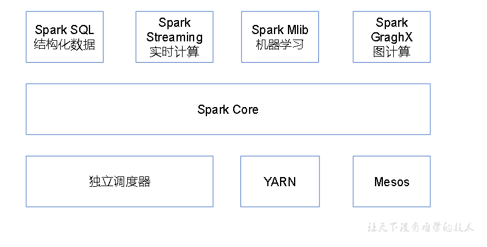
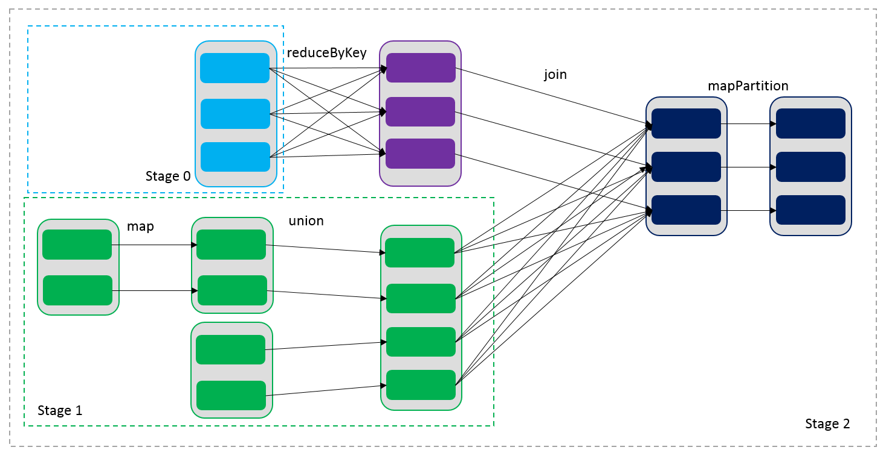
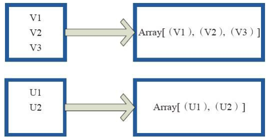
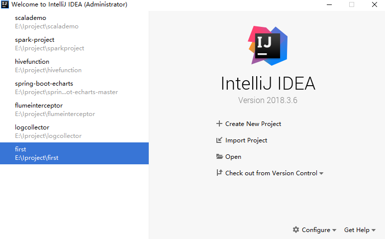

# Scala安装

## 1.解压

```
[root@Master software-package]# tar -zxvf  scala-2.11.8.tgz   -C /root/
```

## 2.配置环境变量

```
export SCALA_HOME=/root/scala-2.11.8
export PATH=$PATH:$SCALA_HOME/bin

[root@Master scala-2.11.8]# source  /etc/profile
[root@Master scala-2.11.8]# 
```

## 3.拷贝

```
[root@Master scala-2.11.8]# scp -r scala-2.11.8/ SlaveNode01:/root/

[root@Master scala-2.11.8]# scp -r /etc/profile  SlaveNode01:/etc/
```

## 4.验证

```
[root@Master scala-2.11.8]# scala
Welcome to Scala 2.11.8 (Java HotSpot(TM) 64-Bit Server VM, Java 1.8.0_11).
Type in expressions for evaluation. Or try :help.

scala> 
```

# Spark集群安装

## 1.解压

```
[root@Master software-package]# tar -zxvf spark-1.5.1-bin-hadoop2.4.tgz  -C /root/
[root@Master ~]# mv spark-1.5.1-bin-hadoop2.4/  spark-1.5.1
```

## 2.配置文件

```
[root@Master spark-1.5.1]# vim /etc/profile

export SPARK_HOME=/root/spark-2.1.1
export PATH=$PATH:$SPARK_HOME/bin

[root@Master conf]# pwd
/root/spark-1.5.1/conf
[root@Master conf]# mv spark-env.sh.template spark-env.sh
[root@Master conf]# vim spark-env.sh 

export JAVA_HOME=/root/jdk1.8.0_11/
export SCALA_HOME=/root/scala-2.11.8 
export HADOOP_HOME=/root/hadoop-2.5.0/
export HADOOP_CONF_DIR=/root/hadoop-2.5.0/etc/hadoop
export SPARK_DAEMON_JAVA_OPTS="-Dspark.deploy.recoveryMode=ZOOKEEPER -Dspark.deploy.zookeeper.url=Master:2181,SlaveNode01:2181,SlaveNode01:2181 -Dspark.deploy.zookeeper.dir=/root/spark-1.5.1/data/spark"
export SPARK_MASTER_PORT=7077

################################################################################################
[root@Master conf]# cp slaves.template  slaves    ##在该文件中添加子节点所在的位置（Worker节点）

# A Spark Worker will be started on each of the machines listed below.


SlaveNode01
SlaveNode02        
```

## 3.拷贝到其他机器

```
[root@Master ~]# scp -r spark-1.5.1/  SlaveNode01:/root/

[root@Master ~]# scp -r spark-1.5.1/  SlaveNode02:/root/

[root@Master ~]# scp -r /etc/profile  SlaveNode01:/etc/
  
[root@Master ~]# scp -r /etc/profile  SlaveNode02:/etc/

[root@Master ~]# source /etc/profile
```

## 4.编写zk脚本

    #!/bin/bash
    
    case $1 in
      "start")
        
        for i in Master SlaveNode01 SlaveNode02
    
           do
    
          echo "-----------启动zk集群-------------------"
          ssh $i "/root/zookeeper-3.4.5/sbin/zkServer.sh  start"
    
          done
       ;;
    
       "stop")
    
         for i in Master SlaveNode01 SlaveNode02
          do
          echo "-----------关闭zk集群-------------------"
          ssh $i "/root/zookeeper-3.4.5/sbin/zkServer.sh  stop"
          done
        ;;
    
       "status")
    
         for i in Master SlaveNode01 SlaveNode02
          do
          echo "-----------查看zk状态-------------------"
          ssh $i "/root/zookeeper-3.4.5/sbin/zkServer.sh  status"
          done
        ;;
    esac

## 5.编写Spark脚本

```
#!/bin/bash

case $1 in
  "start")
   /root/spark-2.1.1/sbin/start-all.sh

  ;;

  "stop")
  /root/spark-2.1.1/sbin/stop-all.sh
  ;;
esac
```

## 6.编写jps脚本

```
#!/bin/bash

for i in Master SlaveNode01 SlaveNode02
   do
   echo "---------$i--------------"
   ssh $i "$*"
   done
~           
```

## 7.启动

```
[root@Master bin]# ./zk.sh  start
 
[root@Master bin]# ./Master_spark.sh  start
 
[root@Master bin]# ./xcall.sh  jps
---------Master--------------
18470 Master
18281 QuorumPeerMain
18618 Jps
---------SlaveNode01--------------
3236 Worker
3086 QuorumPeerMain
3310 Jps
---------SlaveNode02--------------
3265 Worker
3130 QuorumPeerMain
3339 Jps
```

## 8.求PI

```
/root/spark-2.1.1/bin/spark-submit \
--class org.apache.spark.examples.SparkPi \
--master spark://Master:7077 \
--executor-memory 500m \
--total-executor-cores 2 \
/root/spark-2.1.1/examples/jars/spark-examples_2.11-2.1.1.jar \
10


################################################################################################
java.net.UnknownHostException: ns1  HDFS高可用 需要配置文件hdfs-site.xml、core-site.xml
Exception in thread "main" java.lang.NumberFormatException: For input string: "null"


/root/spark-1.5.1/bin/spark-submit  \
--class com.lx.sparkproject.spark.product.AreaTop3ProductSpark \
--master spark://Master:7077 \
--executor-memory 500m \
--files /root/hive-0.13.1/conf/hive-site.xml \
--driver-class-path /root/hive-0.13.1/lib/mysql-connector-java-5.1.17.jar \
/root/code/spark-project-1.0-SNAPSHOT-jar-with-dependencies.jar  \
4


//找不到hive元数据
com.lx.sparkproject.spark.session.UserVisitSessionAnalyzeSpark
com.lx.sparkproject.spark.product.AreaTop3ProductSpark
com.lx.sparkproject.spark.page.PageOneStepConvertRateSpark
com.lx.sparkproject.spark.ad.AdClickRealTimeStatSpark
 

############################################################################################

基本语法
bin/spark-submit \
--class <main-class>
--master <master-url> \
--deploy-mode <deploy-mode> \
--conf <key>=<value> \
... # other options
<application-jar> \
[application-arguments]
（2）参数说明：
--master 指定Master的地址，默认为Local
--class: 你的应用的启动类 (如 org.apache.spark.examples.SparkPi)
--deploy-mode: 是否发布你的驱动到worker节点(cluster) 或者作为一个本地客户端 (client) (default: client)*
--conf: 任意的Spark配置属性， 格式key=value. 如果值包含空格，可以加引号“key=value” 
application-jar: 打包好的应用jar,包含依赖. 这个URL在集群中全局可见。 比如hdfs:// 共享存储系统， 如果是 file:// path， 那么所有的节点的path都包含同样的jar
application-arguments: 传给main()方法的参数
--executor-memory 1G 指定每个executor可用内存为1G
--total-executor-cores 2 指定每个executor使用的cup核数为2个

###############################################################################################

错误：
Initial job has not accepted any resources; check your cluster UI to ensure
原因是--executor-memory设置过大。

```

## 9.spark shell

spark-shell是Spark自带的交互式Shell程序，方便用户进行交互式编程，用户可以在该命令行下用scala编写spark程序。

### 9.1启动shell

```
启动shell之前要启动spark集群

[root@Master bin]# pwd
/root/spark-1.5.1/bin
[root@Master bin]# /root/spark-2.1.1/bin/spark-shell   \
--master spark://Master:7077  \
--executor-memory 500m  \
--total-executor-cores 1

参数说明：
--master spark://Master:7077  指定Master的地址
--executor-memory 500m  指定每个worker可用内存为2G
--total-executor-cores 1 指定整个集群使用的cup核数为2个

出现问题：
akka.actor.ActorNotFound: Actor not found for: ActorSelection[Anchor(akka.tcp://sparkMaster@Master:7077/), Path(/user/Master)]
```

### 9.2验证

```
1. 作用：返回一个新的RDD，该RDD由每一个输入元素经过func函数转换后组成
2. 需求：创建一个1-10数组的RDD，将所有元素*2形成新的RDD
（1）创建
scala> var source  = sc.parallelize(1 to 10)
source: org.apache.spark.rdd.RDD[Int] = ParallelCollectionRDD[8] at parallelize at <console>:24
（2）打印
scala> source.collect()
res7: Array[Int] = Array(1, 2, 3, 4, 5, 6, 7, 8, 9, 10)
（3）将所有元素*2
scala> val mapadd = source.map(_ * 2)
mapadd: org.apache.spark.rdd.RDD[Int] = MapPartitionsRDD[9] at map at <console>:26
（4）打印最终结果
scala> mapadd.collect()
res8: Array[Int] = Array(2, 4, 6, 8, 10, 12, 14, 16, 18, 20)
```

### 9.3帮助

```
scala> :help
All commands can be abbreviated, e.g. :he instead of :help.
Those marked with a * have more detailed help, e.g. :help imports.

:cp <path>                 add a jar or directory to the classpath
:help [command]            print this summary or command-specific help
:history [num]             show the history (optional num is commands to show)
:h? <string>               search the history
:imports [name name ...]   show import history, identifying sources of names
:implicits [-v]            show the implicits in scope
:javap <path|class>        disassemble a file or class name
:load <path>               load and interpret a Scala file
:paste                     enter paste mode: all input up to ctrl-D compiled together
:quit                      exit the repl
:replay                    reset execution and replay all previous commands
:reset                     reset the repl to its initial state, forgetting all session entries
:sh <command line>         run a shell command (result is implicitly => List[String])
:silent                    disable/enable automatic printing of results
:fallback                  
disable/enable advanced repl changes, these fix some issues but may introduce others. 
This mode will be removed once these fixes stablize
:type [-v] <expr>          display the type of an expression without evaluating it
:warnings                  show the suppressed warnings from the most recent line which had any

scala> :
```

# Spark概述

spark是基于内存的快速、通用的、可扩展的大数据分析引擎。

生态如下：



核心特点：


# 运行模式

## Standalone模式

即独立模式，自带完整的服务，可单独部署到一个集群中，无需依赖任何其他资源管理系统。 

**Standalone集群有四个重要组成部分，分别是：**

```
1.Driver：是一个进程，我们编写的Spark应用程序就运行在Driver上，由Driver进程执行。
2.Master(RM)：是一个进程，主要负责资源的调度和分配，并进行集群的监控等职责。
3.Worker(NM)：是一个进程，一个Worker运行在集群中的一台服务器上，主要负责两个职责，一个是用自己的内存存储RDD的某个或某些partition；另一个是启动其他进程和线程（Executor），对RDD上的partition进行并行的处理和计算。
4.Executor：是一个进程，一个Worker上可以运行多个Executor，Executor通过启动多个线程（task）来执行对RDD的partition进行并行计算，也就是执行我们对RDD定义的例如map、flatMap、reduce等算子操作。
```

 

**运行过程**

```
1.SparkContext连接到Master，向Master注册并申请资源(CPU Core and Memory);

2.Master根据SparkContext的资源申请要求和Worker心跳周期内报告的信息决定在哪个Worker上分配资源，然后在该Worker上获取资源，然后启动Executor; 

3.Executor向driver注册;

4.SparkContext解析Applicaiton代码，构建DAG图，并提交给DAGScheduler分解成Stage，然后以Stage(或者称为TaskSet)提交给TaskScheduler，TaskScheduler负责将Task分配到相应的Worker，最后提交给Executor执行;

5.Executor会建立Executor线程池，开始执行Task，并向SparkContext报告，直至Task完成;

3.所有Task完成后，SparkContext向Master注销，释放资源。
```

## YARN模式运行机制

### YARN Client模式

 

```
1.Yarn-Client 第一步：Spark Yarn Client向Yarn的ResourceManager申请启动Application Master。同时在SparkContent初始化中将创建DAGScheduler和TASKScheduler;

2.Yarn-Client 第二步：ResourceManager收到请求后，在集群中选择一个NodeManager，为该应用程序分配第一个Container，要求它在这个Container中启动应用程序的Application Master;

3.Yarn-Client 第三步：Client中的SparkContext初始化完毕后，与ApplicationMaster建立通讯，向ResourceManager注册，根据任务信息向ResourceManager申请资源;

4.Yarn-Client 第四步：一旦ApplicationMaster申请到资源后，便与对应的NodeManager通信，要求它在获得的Container中启动Executor，启动后会向Client中的SparkContext注册并申请Task;

5.Yarn-Client 第五步：Client中的SparkContext分配Task给Executor执行，Executor运行Task并向Driver汇报运行的状态和进度，以让Client随时掌握各个任务的运行状态，从而可以在任务失败时重新启动任务;

6.Yarn-Client 第六步：应用程序运行完成后，Client的SparkContext向ResourceManager申请注销并关闭自己。如图所示。
```

### YARN Cluster模式

  

```
1.Yarn-Cluster 第一步：Spark Yarn Client向Yarn中提交应用程序，包括ApplicationMaster程序、启动ApplicationMaster的命令、需要在Executor中运行的程序等;

2.Yarn-Cluster 第二步：ResourceManager收到请求后，在集群中选择一个NodeManager，为该应用程序分配第一个Container，要求它在这个Container中启动应用程序的ApplicationMaster，其中ApplicationMaster进行SparkContext等的初始化;

3.Yarn-Cluster 第三步：ApplicationMaster向ResourceManager注册，这样用户可以直接通过ResourceManage查看应用程序的运行状态，然后它将采用轮询的方式通过RPC协议为各个任务申请资源，并监控它们的运行状态直到运行结束;

4.Yarn-Cluster 第四步：一旦ApplicationMaster申请到资源后，便与对应的NodeManager通信，要求它在获得的Container中启动启动Executor，启动后会向ApplicationMaster中的SparkContext注册并申请Task;

5.Yarn-Cluster 第五步：ApplicationMaster中的SparkContext分配Task给Executor执行，Executor运行Task并向ApplicationMaster汇报运行的状态和进度，以让ApplicationMaster随时掌握各个任务的运行状态，从而可以在任务失败时重新启动任务;

6.Yarn-Cluster 第六步：应用程序运行完成后，ApplicationMaster向ResourceManager申请注销并关闭自己。
```

# 架构设计

Spark运行架构包括集群资源管理器（Cluster Manager，比如yarn模式下的RM）、运行作业任务的工作节点Worker Node、每个应用的任务控制节点Driver和每个工作节点上负责具体任务的执行进程Executor。其中，集群资源管理器可以是Spark自带的资源管理器，也可以是YARN或Mesos等资源管理框架。

与Hadoop MapReduce计算框架相比，Spark所采用的Executor有两个优点：

一是利用多线程来执行具体的任务（Hadoop MapReduce采用的是进程模型），减少任务的启动开销；

二是Executor中有一个BlockManager存储模块，会将内存和磁盘共同作为存储设备（默认使用内存，当内存不够时，会写到磁盘），当需要多轮迭代计算时，可以将中间结果存储到这个存储模块里，下次需要时，就可以直接读该存储模块里的数据，而不需要读取HDFS等文件系统里的数据，因而有效减少了IO开销；或者在交互式查询场景下，预先将表缓存到该存储系统上，从而可以提高读写IO性能。

  

在Spark中，一个应用（Application）由一个任务控制节点（Driver）和若干个作业（Job）构成，一个作业由多个阶段（Stage）构成，一个阶段由多个任务（Task）组成。当执行一个应用时，任务控制节点会向集群管理器（Cluster Manager）申请资源，启动Executor，并向Executor发送应用程序代码和文件，然后在Executor上执行任务，运行结束后，执行结果会返回给任务控制节点，或者写到HDFS或者其他数据库中。

  

# 宽依赖、窄依赖

Spark中RDD的高效与DAG图有着莫大的关系，在DAG调度中需要对计算过程划分stage，而划分依据就是RDD之间的依赖关系。针对不同的转换函数，RDD之间的依赖关系分类窄依赖（narrow dependency）和宽依赖（wide dependency，也称 shuffle dependency）。

窄依赖是指父RDD的每个分区只被子RDD的一个分区所使用，子RDD分区通常对应常数个父RDD分区(O(1)，与数据规模无关)。相应的，宽依赖是指父RDD的每个分区都可能被多个子RDD分区所使用，子RDD分区通常对应所有的父RDD分区(O(n)，与数据规模有关)。

宽依赖和窄依赖如下图所示：

  

```
1.宽依赖往往对应着shuffle操作，需要在运行过程中将同一个父RDD的分区传入到不同的子RDD分区中，中间可能涉及多个节点之间的数据传输；而窄依赖的每个父RDD的分区只会传入到一个子RDD分区中，通常可以在一个节点内完成转换。

2.当RDD分区丢失时（某个节点故障），spark会对数据进行重算。

对于窄依赖，由于父RDD的一个分区只对应一个子RDD分区，这样只需要重算和子RDD分区对应的父RDD分区即可，所以这个重算对数据的利用率是100%的；

对于宽依赖，重算的父RDD分区对应多个子RDD分区，这样实际上父RDD中只有一部分的数据是被用于恢复这个丢失的子RDD分区的，另一部分对应子RDD的其它未丢失分区，这就造成了多余的计算；更一般的，宽依赖中子RDD分区通常来自多个父RDD分区，极端情况下，所有的父RDD分区都要进行重新计算。
```

如下图所示，b1分区丢失，则需要重新计算a1、a2和a3，这就产生了冗余计算(a1,a2,a3中对应b2的数据)。

 

区分这两种依赖很有用。首先，窄依赖允许在一个集群节点上以流水线的方式（pipeline）计算所有父分区。例如，逐个元素地执行map、然后filter操作，而宽依赖则需要首先计算好所有父分区数据，然后在节点之间进行Shuffle，这与MapReduce类似。第二，窄依赖能够更有效地进行失效节点的恢复，即只需重新计算丢失RDD分区的父分区，而且不同节点之间可以并行计算，而对于一个宽依赖关系的Lineage图，单个节点失效可能导致这个RDD的所有祖先丢失部分分区，因而需要整体重新计算。

```
窄依赖的函数有：map, filter, union, join(父RDD是hash-partitioned ), mapPartitions, mapValues 
宽依赖的函数有：groupByKey, join(父RDD不是hash-partitioned ), partitionBy
```

# DAG(有向无环图)

（有向无环图）Directed Acycle graph，它是由RDD和它们之间的边构成，反应RDD之间的依赖关系。

 

**DAG生成：**

DAG是由stage构成的，每个stage内部尽可能多的包含一组具有窄依赖关系的转换，可以最大限度的流水线并行化(pipeline)，不同stage在shuffle依赖处划分，可以保证结果的正确性，此外由于已缓存分区可以缩短父RDD的计算过程也可以作为stage的划分点。Spark以此作为DAG生成的依据。具体而言，Spark中DAG生成的算法如下：从后往前推算，遇到ShuffleDependency就断开，遇到NarrowDependency就将其加入该stage。每个stage里面task的数目由该stage最后一个RDD中的partition个数决定。Stage中的task分为两类：ResultTask和ShuffleMapTask，对于要产生结果的task称为ResultTask，否则都称为ShuffleMapTask。

 

该例子共生成了三个stage，其 中两个ShuffleMapStage一个resultStage，stage 0 为resultStage，向前推演过程中遇到partitionBy操作和join操作为ShuffleDependency因此断开得到stage 1 和stage 2，在stage内部均为NarrowDependency，因此共得到三个stage。

# Spark的基本运行流程

```
1.构建Spark Application的运行环境（启动SparkContext），SparkContext向资源管理器（可以是Standalone、Mesos或YARN）注册并申请运行Executor资源；

2.资源管理器分配Executor资源并启动StandaloneExecutorBackend，Executor运行情况将随着心跳发送到资源管理器上；

3.SparkContext构建成DAG图，将DAG图分解成Stage，并把Taskset发送给Task Scheduler。Executor向SparkContext申请Task

4.Task Scheduler将Task发放给Executor运行同时SparkContext将应用程序代码发放给Executor。

5.Task在Executor上运行，运行完毕释放所有资源。
```

 

总体而言，Spark运行架构具有以下特点：

```
1.每个Application获取专属的executor进程，该进程在Application期间一直驻留，并以多线程方式运行tasks。这种Application隔离机制有其优势的，无论是从调度角度看（每个Driver调度它自己的任务），还是从运行角度看（来自不同Application的Task运行在不同的JVM中）。当然，这也意味着Spark Application不能跨应用程序共享数据，除非将数据写入到外部存储系统。

2.Spark与资源管理器无关，只要能够获取executor进程，并能保持相互通信即可。

3.提交SparkContext的Client应该靠近Worker节点（运行Executor的节点)，最好是在同一个Rack里，因为Spark Application运行过程中SparkContext和Executor之间有大量的信息交换；如果想在远程集群中运行，最好使用RPC将SparkContext提交给集群，不要远离Worker运行SparkContext。

4.Task采用了数据本地性和推测执行的优化机制。数据本地性是尽量将计算移到数据所在的节点上进行，即“计算向数据靠拢”，因为移动计算比移动数据所占的网络资源要少得多。而且，Spark采用了延时调度机制，可以在更大的程度上实现执行过程优化。比如，拥有数据的节点当前正被其他的任务占用，那么，在这种情况下是否需要将数据移动到其他的空闲节点呢？答案是不一定。因为，如果经过预测发现当前节点结束当前任务的时间要比移动数据的时间还要少，那么，调度就会等待，直到当前节点可用。
```


 

上图为Spark通用运行流程，不论Spark以何种模式进行部署，任务提交后，都会先启动Driver进程，随后Driver进程向集群管理器注册应用程序，之后集群管理器根据此任务的配置文件分配Executor并启动，当Driver所需的资源全部满足后，Driver开始执行main函数，Spark查询为懒执行，当执行到action算子时开始反向推算，根据宽依赖进行stage的划分，随后每一个stage对应一个taskset，taskset中有多个task，根据本地化原则，task会被分发到指定的Executor去执行，在任务执行的过程中，Executor也会不断与Driver进行通信，报告任务运行情况。

# stage划分过程

Stage的划分思路：从后往前推，遇到宽依赖就断开，划分为一个stage；遇到窄依赖就将这个RDD加入该stage中。

 

# Spark Shuffle解析

## 未经优化的HashShuffleManager

shuffle write阶段，主要就是在一个stage结束计算之后，为了下一个stage可以执行shuffle类的算子，而将每个task处理的数据按key进行“划分”。所谓“划分”，就是对相同的key执行hash算法，从而将相同key都写入同一个磁盘文件中，而每一个磁盘文件都只属于下游stage的一个task。在将数据写入磁盘之前，会先将数据写入内存缓冲中，当内存缓冲填满之后，才会溢写到磁盘文件中去。

下一个stage的task有多少个，当前stage的每个task就要创建多少份磁盘文件。比如下一个stage总共有100个task，那么当前stage的每个task都要创建100份磁盘文件。如果当前stage有50个task，总共有10个Executor，每个Executor执行5个task，那么每个Executor上总共就要创建500个磁盘文件，所有Executor上会创建5000个磁盘文件。由此可见，未经优化的shuffle write操作所产生的磁盘文件的数量是极其惊人的。

shuffle read阶段，通常就是一个stage刚开始时要做的事情。此时该stage的每一个task就需要将上一个stage的计算结果中的所有相同key，从各个节点上通过网络都拉取到自己所在的节点上，然后进行key的聚合或连接等操作。由于shuffle write的过程中，map task给下游stage的每个reduce task都创建了一个磁盘文件，因此shuffle read的过程中，每个reduce task只要从上游stage的所有map task所在节点上，拉取属于自己的那一个磁盘文件即可。

shuffle read的拉取过程是一边拉取一边进行聚合的。每个shuffle read task都会有一个自己的buffer缓冲，每次都只能拉取与buffer缓冲相同大小的数据，然后通过内存中的一个Map进行聚合等操作。聚合完一批数据后，再拉取下一批数据，并放到buffer缓冲中进行聚合操作。以此类推，直到最后将所有数据到拉取完，并得到最终的结果。

  

上图有 4 个 ShuffleMapTask 要在同一个 worker node 上运行，CPU core 数为 2，可以同时运行两个 task。每个 task 的执行结果被逐一写到本地磁盘上。每个 task 包含 R 个缓冲区，R = reducer 个数（也就是下一个 stage 中 task 的个数）。缓冲区被称为 bucket，其大小为spark.shuffle.file.buffer.kb ，默认是 32KB（Spark 1.1 版本以前是 100KB）。其实 bucket 是一个广义的概念，代表 ShuffleMapTask 输出结果经过 partition 后要存放的地方，这里为了细化数据存放位置和数据名称，仅仅用 bucket 表示缓冲区。

ShuffleMapTask 的执行过程很简单：

```
1.先利用 pipeline 计算得到 finalRDD 中对应 partition 的 records。每得到一个 record 就将其送到对应的 bucket 里，具体是哪个 bucket 由partitioner.partition(record.getKey()))决定。
2.每个 bucket 里面的数据会不断被写到本地磁盘上，形成一个 ShuffleBlockFile，或者简称 FileSegment。
3.之后的 reducer 会去 fetch 属于自己的 FileSegment，进入 shuffle read 阶段。
```

## 优化后的HashShuffleManager

针对 HashShuffleManager 我们可以设置一个参数：spark.shuffle.consolidateFiles。这个参数的值默认是 false，如果设置成 true 之后就会开启优化机制。

当开启这个参数之后，在 Shuffle Write 阶段写文件的时候会复用文件，每个 task 不会为 Shuffle Read 阶段的 task 都创建一份文件。此时会出现一个 shuffleFileGroup 的概念，每个 shuffleFileGroup 会对应一批磁盘文件， shuffleFileGroup 里的磁盘文件的数量和 Shuffle Read 阶段的 task 数量一致。每个 Executor 上有多少个 cpu core 就会并行执行几个 task，每个 task 会创建一个 shuffleFileGroup，然后后续并行执行的 task 会复用前面生成的这个 shuffleFileGroup。

比如，当前 stage 有 5 个 Executor，每个 Executor 分配 3 个 cpu core，一共有 50 个 task，每个 Executor 执行 10 个 task，Shuffle Read 阶段有 100 个 task。那么此时，每个 Executor 进程会创建 3X100 个文件，一共会创建 5X3X100 个文件。每个Executor创建的磁盘文件的数量的计算公式为：CPU core的数量X下一个stage的task数量

 

## SortShuffleManager 普通机制

SortShuffleManager 运行机制有两种，一种是普通运行机制，另一种是 bypass 运行机制。当 shuffle read task 的数量小于等于 spark.shuffle.sort.bypassMergeThreshold 参数值时 (默认是 200 ) ，就会启用 bypass 机制。

**普通机制**

数据会先写入一个内存数据结构中，此时根据不同的 shuffle 算子，可能选用不同的数据结构(Map or Array )。
如果是 reduceByKey 这种聚合类的 shuffle 算子，那么会选用 Map 数据结构，一边通过 Map进行聚合，一边写入内存；如果是普通的 shuffle算子如join，count等，那么会选用Array数据结构，直接写入内存。然后，每写一条数据进入内存数据结构之后如果达到了某个临界阈值，那么就会尝试将内存数据结构中的数据溢写到磁盘，然后清空内存数据结构。在溢写到磁盘文件之前，会先根据 key对内存数据结构中已有的数据进行排序。排序过后，会分批将数据写入磁盘文件。默认的 batch数量是10000条，也就是说，排序好的数据，会以每批 1万条数据的形式通过 Java 的 BufferedOutputStream写入磁盘文件。
一个 task 将所有数据写入内存数据结构的过程中，会发生多次磁盘溢写操作，产生多个临时文件。最后会将之前所有的临时磁盘文件都进行合并，这就是 merge 过程，此时会将之前所有临时磁盘文件中的数据读取出来，生成 1个磁盘文件和一个索引文件，这个索引文件标识了下游各个 task 的数据在文件中的 start offset 与 end offset。

比如，当前 stage 有 5 个 Executor，每个 Executor 分配 1 个 cpu core，共有 50 个 task，每个 Executor 执行 10 个 task；下一个 stage 有 100 个 task。那么每个 Executor 创建 10 个磁盘文件，一共有 50 个磁盘文件。

 

## SortShuffleManager的bypass运行机制

bypass运行机制的触发条件如下：

```
1.shuffle map task数量小于spark.shuffle.sort.bypassMergeThreshold参数的值(默认是 200 )。

2.不是聚合类的shuffle算子。
```

上游task 会为每个下游 task 都创建一个内存缓冲，并根据 key 的 hash 值写入对应的缓冲区。缓冲区满之后溢写到磁盘文件的。最后，将所有临时磁盘文件都合并成一个磁盘文件，并创建一个单独的索引文件。

该过程的磁盘写机制其实跟未经优化的HashShuffleManager是一模一样的，因为都要创建数量惊人的磁盘文件，只是在最后会做一个磁盘文件的合并而已。因此少量的最终磁盘文件，也让该机制相对未经优化的HashShuffleManager来说，shuffle read的性能会更好。

而该机制与普通SortShuffleManager运行机制的不同在于：第一，磁盘写机制不同；第二，不会进行排序。也就是说，启用该机制的最大好处在于，shuffle write过程中，不需要进行数据的排序操作，也就节省掉了这部分的性能开销。

  

# RDD缓存

RDD通过persist方法或cache方法可以将前面的计算结果缓存，默认情况下 persist() 会把数据以序列化的形式缓存在 JVM 的堆空间中。 但是并不是这两个方法被调用时立即缓存，而是触发后面的action时，该RDD将会被缓存在计算节点的内存中，并供后面重用。

 

通过查看源码发现cache最终也是调用了persist方法，默认的存储级别都是仅在内存存储一份，Spark的存储级别还有好多种，存储级别在object StorageLevel中定义的。

 

在存储级别的末尾加上“_2”来把持久化数据存为两份。

 

缓存有可能丢失，或者存储存储于内存的数据由于内存不足而被删除，RDD的缓存容错机制保证了即使缓存丢失也能保证计算的正确执行。通过基于RDD的一系列转换，丢失的数据会被重算，由于RDD的各个Partition是相对独立的，因此只需要计算丢失的部分即可，并不需要重算全部Partition。

```
创建一个RDD
scala> val rdd = sc.makeRDD(Array("atguigu"))
rdd: org.apache.spark.rdd.RDD[String] = ParallelCollectionRDD[19] at makeRDD at <console>:25

将RDD转换为携带当前时间戳不做缓存
scala> val nocache = rdd.map(_.toString+System.currentTimeMillis)
nocache: org.apache.spark.rdd.RDD[String] = MapPartitionsRDD[20] at map at <console>:27

多次打印结果
scala> nocache.collect
res0: Array[String] = Array(atguigu1538978275359)

scala> nocache.collect
res1: Array[String] = Array(atguigu1538978282416)

scala> nocache.collect
res2: Array[String] = Array(atguigu1538978283199)

将RDD转换为携带当前时间戳并做缓存
scala> val cache =  rdd.map(_.toString+System.currentTimeMillis).cache
cache: org.apache.spark.rdd.RDD[String] = MapPartitionsRDD[21] at map at <console>:27

多次打印做了缓存的结果
scala> cache.collect
res3: Array[String] = Array(atguigu1538978435705)                                   

scala> cache.collect
res4: Array[String] = Array(atguigu1538978435705)

scala> cache.collect
res5: Array[String] = Array(atguigu1538978435705)
```

# checkpoint机制

checkpoint的意思是建立检查点，类似于快照，传统的Spark任务计算过程中，DAG特别长，集群需要将整个DAG计算完成得到结果，但是如果在这个漫长的计算过程中出现数据丢失，Spark又会根据依赖关系重新从头开始计算一遍结果，这样很浪费性能，当然我们可以考虑将中间计算结果cache或者persist到内存或者磁盘中，但是这样不能保证数据完全不丢失，存储的内存出现了问题或者磁盘坏掉，也会导致Spark再次根据RDD重新再次计算一遍，所以就出现了checkpoint机制，其中checkpoint的作用就是将DAG中比较重要的中间计算结果存储到一个高可用的地方，通常这个地方是HDFS里面。

在checkpoint的过程中，该RDD的所有依赖于父RDD中的信息将全部被移出。对RDD进行checkpoint操作并不会马上被执行，必须执行Action操作才能触发。

```
//checkpointDirectory为checkpoint文件保存目录
streamingContext.checkpoint(checkpointDirectory)
SparkContext.setCheckpointDir(checkpointDirectory)
```

# Spark中的Join操作

join操作是在特征提取过程中非常常见的一种需求，从多个不同文件完成了特征提取之后，通过join合并为一个完整的特征，可以方便进行接下来的模型训练、预测等其它操作。

本文将介绍几种Spark中的几种不同的join操作，如果是数据库的朋友可以很容易地把他们与数据库中的几种join联系起来。


以上几种都是Spark对键值对PairRDD的操作，见org.apache.spark.rdd.PairRDDFunctions

**数据说明**
首先我们准备两份简单的数据，gender和age，其中两张表中的前3条有相同的姓名，后两条不同。


将他们解析为RDD：
gender: RDD[(String, String)]
age: RDD[(String, String)]

## join

```
定义：join[W](other: RDD[(K, W)]): RDD[(K, (V, W))]
Return an RDD containing all pairs of elements with matching keys in this and other.
```

join函数会输出两个RDD中key相同的所有项，并将它们的value联结起来，它联结的key要求在两个表中都存在，类似于SQL中的INNER JOIN。但它不满足交换律，a.join(b)与b.join(a)的结果不完全相同，值插入的顺序与调用关系有关。

我们来看上面两个表的例子：


## leftOuterJoin

```
定义：leftOuterJoin[W](other: RDD[(K, W)]): RDD[(K, (V, Option[W]))]
Perform a left outer join of this and other.
```

leftOuterJoin会调用保留对象的所有key，而用None填充在参数RDD other中缺失的值，因此调用顺序会使结果完全不同。如下面展示的结果，
gender.leftOuterJoin(age)会保留gender中的所有key，而age.leftOuterJoin(gender)会保留age中所有的key。


可以注意到，在结果中左边RDD中的key和value依然是字符串或者整形，而原来在参数表中的值却变成了Some对象或者None对象。

## 为什么使用Some？

Some和None都是Option的子类，它们都是泛型的。
在联结过程中，参数表中可能并不存在对象中的所有key，对于不存在的key，如果是直接处理，我们会返回一个null，当处理数据时，我们就需要先判断返回值是否是null，在进行下一步处理。而且稍不注意就会在运行时报出NullPointerException。
使用Some，首先告诉开发者，这个值有可能无法返回，然后在处理时，我们可以用一个简单的模式匹配完成处理。假设是对上表中的年龄做处理：

```
ageValue match {
	case Some(age) => age.toInt
	case None => {处理年龄值缺失的情况}
}
```

## rightOuterJoin

```
定义：rightOuterJoin[W](other: RDD[(K, W)]): RDD[(K, (Option[V], W))]
Perform a right outer join of this and other.
```

rightOuterJoin与leftOuterJoin基本一致，区别在于它的结果保留的是参数other这个RDD中所有的key。


## fullOuterJoin

```
定义：fullOuterJoin[W](other: RDD[(K, W)]): RDD[(K, (Option[V], Option[W]))]
Perform a full outer join of this and other.
```

fullOuterJoin会保留两个RDD中所有的key，因此所有的值列都有可能出现缺失的情况，所有的值列都会转为Some对象。


## Spark DataFrame中的join类型

Spark DataFrame中join有inner join，left join，right join，full join。 

```
def join(right : DataFrame, usingColumns : Seq[String], joinType : String) : DataFrame 
def join(right : DataFrame, joinExprs : Column, joinType : String) : DataFrame 
```

可见，可以通过传入String类型的joinType来实现。 
joinType可以是”inner”、“left”、“right”、“full”分别对应inner join，left join，right join，full join。默认值是”inner”，代表内连接。


# Spark中的Join三种实现

当前SparkSQL支持三种Join算法shuffle hash join、broadcast hash join以及sort merge join。其中前两者归根到底都属于hash join，只不过在hash join之前需要先shuffle还是先broadcast。

## Hash Join

先来看看这样一条SQL语句：select * from order,item where item.id = order.i_id，很简单一个Join节点，参与join的两张表是item和order，join key分别是item.id以及order.i_id。现在假设这个Join采用的是hash join算法，整个过程会经历三步：

```
1.确定Build Table以及Probe Table：这个概念比较重要，Build Table使用join key构建Hash Table，而Probe Table使用join key进行探测，探测成功就可以join在一起。通常情况下，小表会作为Build Table，大表作为Probe Table。此事例中item为Build Table，order为Probe Table。

2.构建Hash Table：依次读取Build Table（item）的数据，对于每一行数据根据join key（item.id）进行hash，hash到对应的Bucket，生成hash table中的一条记录。数据缓存在内存中，如果内存放不下需要dump到外存。

3.探测：再依次扫描Probe Table（order）的数据，使用相同的hash函数映射Hash Table中的记录，映射成功之后再检查join条件（item.id = order.i_id），如果匹配成功就可以将两者join在一起。
```

 

基本流程可以参考上图，这里有两个小问题需要关注：

```
1.hash join性能如何？很显然，hash join基本都只扫描两表一次，可以认为o(a+b)，较之最极端的笛卡尔集运算a*b，不知甩了多少条街

2.为什么Build Table选择小表？道理很简单，因为构建的Hash Table最好能全部加载在内存，效率最高；这也决定了hash join算法只适合至少一个小表的join场景，对于两个大表的join场景并不适用；

上文说过，hash join是传统数据库中的单机join算法，在分布式环境下需要经过一定的分布式改造，说到底就是尽可能利用分布式计算资源进行并行化计算，提高总体效率。hash join分布式改造一般有两种经典方案：

1.broadcast hash join：将其中一张小表广播分发到另一张大表所在的分区节点上，分别并发地与其上的分区记录进行hash join。broadcast适用于小表很小，可以直接广播的场景。

2.shuffler hash join：一旦小表数据量较大，此时就不再适合进行广播分发。这种情况下，可以根据join key相同必然分区相同的原理，将两张表分别按照join key进行重新组织分区，这样就可以将join分而治之，划分为很多小join，充分利用集群资源并行化。
```

## Broadcast Join

大家知道，在数据库的常见模型中（比如星型模型或者雪花模型），表一般分为两种：事实表和维度表。维度表一般指固定的、变动较少的表，例如联系人、物品种类等，一般数据有限。而事实表一般记录流水，比如销售清单等，通常随着时间的增长不断膨胀。

因为Join操作是对两个表中key值相同的记录进行连接，在SparkSQL中，对两个表做Join最直接的方式是先根据key分区，再在每个分区中把key值相同的记录拿出来做连接操作。但这样就不可避免地涉及到shuffle，而shuffle在Spark中是比较耗时的操作，我们应该尽可能的设计Spark应用使其避免大量的shuffle。

当维度表和事实表进行Join操作时，为了避免shuffle，我们可以将大小有限的维度表的全部数据分发到每个节点上，供事实表使用。executor存储维度表的全部数据，一定程度上牺牲了空间，换取shuffle操作大量的耗时，这在SparkSQL中称作Broadcast Join，如下图所示：

  

broadcast hash join可以分为两步：

```
1.broadcast阶段：将小表广播分发到大表所在的所有主机。广播算法可以有很多，最简单的是先发给driver，driver再统一分发给所有executor；要不就是基于bittorrete的p2p思路；

2.hash join阶段：在每个executor上执行单机版hash join，小表映射(哈希表)，大表试探；
```

Broadcast Join的条件有以下几个：


## Shuffle Hash Join

当一侧的表比较小时，我们选择将其广播出去以避免shuffle，提高性能。但因为被广播的表首先被collect到driver端，然后被冗余分发到每个executor上。所以当表比较大时，广播所需内存、带宽等资源必然就会太大，broadcast hash join就不再是最优方案。

但由于Spark是一个分布式的计算引擎，可以通过分区的形式将大批量的数据划分成n份较小的数据集进行并行计算。这种思想应用到Join上便是Shuffle Hash Join了。利用key相同必然分区相同的这个原理，SparkSQL将较大表的join分而治之，先将表划分成n个分区，再对两个表中相对应分区的数据分别进行Hash Join，这样即在一定程度上减少了driver广播一侧表的压力，也减少了executor端取整张被广播表的内存消耗。其原理如下图：

  

Shuffle Hash Join分为两步：

```
1.对两张表分别按照join keys进行重分区，即shuffle，目的是为了让有相同join keys值的记录分到对应的分区中
2.对对应分区中的数据进行join，此处先将小表分区构造为一张hash表，然后根据大表分区中记录的join keys值拿出来进行匹配
```

看到这里，可以初步总结出来如果两张小表join可以直接使用单机版hash join；如果一张大表join一张极小表，可以选择broadcast hash join算法；而如果是一张大表join一张小表，则可以选择shuffle hash join算法；那如果是两张大表进行join呢？

## Sort Merge Join

上面介绍的两种实现对于一定大小的表比较适用，但当两个表都非常大时，显然无论适用哪种都会对计算内存造成很大压力。这是因为join时两者采取的都是hash join，是将一侧的

数据完全加载到内存中，使用hash code取join keys值相等的记录进行连接。

当两个表都非常大时，SparkSQL采用了一种全新的方案来对表进行Join，即Sort Merge Join。这种实现方式不用将一侧数据全部加载后再进星hash join，但需要在join前将数据排序，如下图所示：

  

shuffle阶段：将两张大表根据join key进行重新分区，两张表数据会分布到整个集群，以便分布式并行处理

sort阶段：对单个分区节点的两表数据，分别进行排序。

merge阶段：对排好序的两张分区表数据执行join操作。join操作很简单，因为两个序列都是有序的，从头遍历，碰到key相同的就merge输出；如果不同，左边小就继续取左边，反之取右边。见下图示意：

  

可以看出，无论分区有多大，Sort Merge Join都不用把某一侧的数据全部加载到内存中，而是即用即取即丢，从而大大提升了大数据量下sql join的稳定性。

# RDD编程

RDD（Resilient Distributed Dataset）叫做弹性分布式数据集，是Spark中最基本的数据抽象。它代表一个不可变（只读）、可分区、里面的元素可并行计算的集合。

## RDD属性

RDD全称叫做弹性分布式数据集(Resilient Distributed Datasets)，它是一种分布式的内存抽象，表示一个只读的记录分区的集合，它只能通过其他RDD转换而创建，为此，RDD支持丰富的转换操作(如map, join, filter, groupBy等)，通过这种转换操作，新的RDD则包含了如何从其他RDDs衍生所必需的信息，所以说RDDs之间是有依赖关系的。基于RDDs之间的依赖，RDDs会形成一个有向无环图DAG，该DAG描述了整个流式计算的流程，实际执行的时候，RDD是通过血缘关系(Lineage)一气呵成的，即使出现数据分区丢失，也可以通过血缘关系重建分区，总结起来，基于RDD的流式计算任务可描述为：从稳定的物理存储(如分布式文件系统)中加载记录，记录被传入由一组确定性操作构成的DAG，然后写回稳定存储。另外RDD还可以将数据集缓存到内存中，使得在多个操作之间可以重用数据集，基于这个特点可以很方便地构建迭代型应用(图计算、机器学习等)或者交互式数据分析应用。可以说Spark最初也就是实现RDD的一个分布式系统，后面通过不断发展壮大成为现在较为完善的大数据生态系统，简单来讲，Spark-RDD的关系类似于Hadoop-MapReduce关系。

 

```
1.一组分片（Partition），即数据集的基本组成单位。对于RDD来说，每个分片都会被一个计算任务处理，并决定并行计算的粒度。用户可以在创建RDD时指定RDD的分片个数，如果没有指定，那么就会采用默认值。默认值就是程序所分配到的CPU Core的数目。 
2.一个计算每个分区的函数。Spark中RDD的计算是以分片为单位的，每个RDD都会实现compute函数以达到这个目的。compute函数会对迭代器进行复合，不需要保存每次计算的结果。 
3.RDD之间的依赖关系。RDD的每次转换都会生成一个新的RDD，所以RDD之间就会形成类似于流水线一样的前后依赖关系。在部分分区数据丢失时，Spark可以通过这个依赖关系重新计算丢失的分区数据，而不是对RDD的所有分区进行重新计算。 
4.一个Partitioner，即RDD的分片函数。当前Spark中实现了两种类型的分片函数，一个是基于哈希的HashPartitioner，另外一个是基于范围的RangePartitioner。只有对于于key-value的RDD，才会有Partitioner，非key-value的RDD的Parititioner的值是None。Partitioner函数不但决定了RDD本身的分片数量，也决定了parent RDD Shuffle输出时的分片数量。 
5.一个列表，存储存取每个Partition的优先位置（preferred location）。对于一个HDFS文件来说，这个列表保存的就是每个Partition所在的块的位置。按照“移动数据不如移动计算”的理念，Spark在进行任务调度的时候，会尽可能地将计算任务分配到其所要处理数据块的存储位置。
```

## RDD特点

RDD表示只读的分区的数据集，对RDD进行改动，只能通过RDD的转换操作，由一个RDD得到一个新的RDD，新的RDD包含了从其他RDD衍生所必需的信息。RDDs之间存在依赖，RDD的执行是按照血缘关系延时计算的。如果血缘关系较长，可以通过持久化RDD来切断血缘关系。

### 分区

如下图所示，RDD逻辑上是分区的，每个分区的数据是抽象存在的，计算的时候会通过一个compute函数得到每个分区的数据。如果RDD是通过已有的文件系统构建，则compute函数是读取指定文件系统中的数据，如果RDD是通过其他RDD转换而来，则compute函数是执行转换逻辑将其他RDD的数据进行转换。

 


### 只读

如下图所示，RDD是只读的，要想改变RDD中的数据，只能在现有的RDD基础上创建新的RDD。

 

### 依赖

RDDs通过操作算子进行转换，转换得到的新RDD包含了从其他RDDs衍生所必需的信息，RDDs之间维护着这种血缘关系，也称之为依赖。如下图所示，依赖包括两种，一种是窄依赖，RDDs之间分区是一一对应的，另一种是宽依赖，下游RDD的每个分区与上游RDD(也称之为父RDD)的每个分区都有关，是多对多的关系。

 

通过RDDs之间的这种依赖关系，一个任务流可以描述为DAG(有向无环图)，如下图所示，在实际执行过程中宽依赖对应于Shuffle(图中的reduceByKey和join)，窄依赖中的所有转换操作可以通过类似于管道的方式一气呵成执行(图中map和union可以一起执行)。

 

### 缓存

如果在应用程序中多次使用同一个RDD，可以将该RDD缓存起来，该RDD只有在第一次计算的时候会根据血缘关系得到分区的数据，在后续其他地方用到该RDD的时候，会直接从缓存处取而不用再根据血缘关系计算，这样就加速后期的重用。如下图所示，RDD-1经过一系列的转换后得到RDD-n并保存到hdfs，RDD-1在这一过程中会有个中间结果，如果将其缓存到内存，那么在随后的RDD-1转换到RDD-m这一过程中，就不会计算其之前的RDD-0了。

 

### checkpoint

虽然RDD的血缘关系天然地可以实现容错，当RDD的某个分区数据失败或丢失，可以通过血缘关系重建。但是对于长时间迭代型应用来说，随着迭代的进行，RDDs之间的血缘关系会越来越长，一旦在后续迭代过程中出错，则需要通过非常长的血缘关系去重建，势必影响性能。为此，RDD支持checkpoint将数据保存到持久化的存储中，这样就可以切断之前的血缘关系，因为checkpoint后的RDD不需要知道它的父RDDs了，它可以从checkpoint处拿到数据。

## 转换操作

### value类型

#### map(func)

map是对RDD中的每个元素都执行一个指定的函数来产生一个新的RDD。任何原RDD中的元素在新RDD中都有且只有一个元素与之对应。

 


```
scala> var source  = sc.parallelize(1 to 10)
source: org.apache.spark.rdd.RDD[Int] = ParallelCollectionRDD[8] at parallelize at <console>:24

scala> source.collect()
res7: Array[Int] = Array(1, 2, 3, 4, 5, 6, 7, 8, 9, 10)

scala> val mapadd = source.map(_ * 2)
mapadd: org.apache.spark.rdd.RDD[Int] = MapPartitionsRDD[9] at map at <console>:26

scala> mapadd.collect()
res8: Array[Int] = Array(2, 4, 6, 8, 10, 12, 14, 16, 18, 20)
```

#### flatMap(func)

flatmap()是将函数应用于RDD中的每个元素，将返回的迭代器的所有内容构成新的RDD。这样就得到了一个由各列表中的元素组成的RDD，而不是一个列表组成的RDD。

  

```
scala> var source  = sc.parallelize(List("a b c", "w x y", "d"))
source: org.apache.spark.rdd.RDD[String] = ParallelCollectionRDD[3] at parallelize at <console>:21

scala> val rdd1=source.flatMap(_.split(" ")) 
rdd1: org.apache.spark.rdd.RDD[String] = MapPartitionsRDD[4] at flatMap at <console>:23

scala> rdd1.collect()
res2: Array[String] = Array(a, b, c, w, x, y, d)

["a b c", "w x y", "d"] => [["a","b","c"],["w","x","y"],["d"]] => ["a","b","w","x","y","c","d"]

################################################################################################

scala> val rdd2=source.map(_.split(" "))
rdd2: org.apache.spark.rdd.RDD[Array[String]] = MapPartitionsRDD[5] at map at <console>:23

scala> rdd2.collect()
res3: Array[Array[String]] = Array(Array(a, b, c), Array(w, x, y), Array(d))
```

map(func)函数会对每一条输入进行指定的func操作，然后为每一条输入返回一个对象，而flatMap(func)也会对每一条输入进行执行的func操作，然后每一条输入返回一个对象，但是最后会将所有的对象再合成为一个对象；从返回的结果的数量上来讲，map返回的数据对象的个数和原来的输入数据是相同的，而flatMap返回的个数则是不同的。请参考下图进行理解：

 

#### mapPartitions(func)

与map类似，map每次对RDD中每一个元素进行运算，而mapPartitions则是把一分区的数据作为一个整体来处理，处理效率更高。假设一个partition有一万条数据，那么map中算子func需要执行一万次；而用mapPartitions算子，一个task处理一个分区执行一次func，func一次接收分区内的所有数据，效率比较高。

但这个分区的数据处理完后，原RDD中分区的数据才能释放，可能导致OOM（内存溢出），一般在内存空间较大时用mapPartitions

在Executor中，map每次处理一条数据，每一条数据用完引用就释放，然后GC。而mapPartitions只有把一个分区的数据全部处理完才会释放引用，然后GC，当内存空间不够大时可能导致内存溢出。

 

```
scala> val rdd = sc.parallelize(Array(1,2,3,4))
rdd: org.apache.spark.rdd.RDD[Int] = ParallelCollectionRDD[0] at parallelize at <console>:21

scala> rdd.mapPartitions(x=>x.map(_*2))
res0: org.apache.spark.rdd.RDD[Int] = MapPartitionsRDD[1] at mapPartitions at <console>:24

scala> res0.collect()
res2: Array[Int] = Array(2, 4, 6, 8)                                            
```

#### mapPartitionsWithIndex(func)

类似于mapPartitions，但func带有一个整数参数表示分片的索引值，因此在类型为T的RDD上运行时，func的函数类型必须是(Int, Interator[T]) => Iterator[U]。

```
scala> val rdd = sc.parallelize(Array(1,2,3,4))
rdd: org.apache.spark.rdd.RDD[Int] = ParallelCollectionRDD[0] at parallelize at <console>:21

scala> val indexRdd = rdd.mapPartitionsWithIndex((index,items)=>(items.map((index,_))))
indexRdd: org.apache.spark.rdd.RDD[(Int, Int)] = MapPartitionsRDD[1] at mapPartitionsWithIndex at <console>:23

scala> indexRdd.collect()
res0: Array[(Int, Int)] = Array((0,1), (0,2), (1,3), (1,4))                     
```

#### glom

将每一个分区形成一个数组，形成新的RDD类型是RDD[Array[T]]。

 

```

scala> val rdd = sc.parallelize(1 to 16,4)   ##4个分区
rdd: org.apache.spark.rdd.RDD[Int] = ParallelCollectionRDD[0] at parallelize at <console>:21

scala> rdd.collect()
res0: Array[Int] = Array(1, 2, 3, 4, 5, 6, 7, 8, 9, 10, 11, 12, 13, 14, 15, 16) 

scala> rdd.glom().collect()
res1: Array[Array[Int]] = Array(Array(1, 2, 3, 4), Array(5, 6, 7, 8), Array(9, 10, 11, 12), Array(13, 14, 15, 16))
```

#### groupBy(func)

groupBy算子接收一个函数，这个函数返回的值作为key，然后通过这个key来对里面的元素进行分组。 

 

```
根据传进来的函数，生成对应的key,在有这个key多数据进行聚合，生成(K, Iterable[T])格式的数据。
scala> val rdd = sc.parallelize(1 to 9, 3)
rdd: org.apache.spark.rdd.RDD[Int] = ParallelCollectionRDD[0] at parallelize at <console>:21

scala> val group = rdd.groupBy(_%2)
group: org.apache.spark.rdd.RDD[(Int, Iterable[Int])] = ShuffledRDD[2] at groupBy at <console>:23

scala> group.collect()
res0: Array[(Int, Iterable[Int])] = Array((0,CompactBuffer(2, 4, 6, 8)), (1,CompactBuffer(1, 3, 5, 7, 9)))

scala> val group1=rdd.groupBy(x => { if (x % 2 == 0) "even" else "odd" })
group1: org.apache.spark.rdd.RDD[(String, Iterable[Int])] = ShuffledRDD[4] at groupBy at <console>:23

scala> group1.collect()
res1: Array[(String, Iterable[Int])] = Array((even,CompactBuffer(2, 4, 6, 8)), (odd,CompactBuffer(1, 3, 5, 7, 9)))
```

#### filter(func)

filter 函数功能是对元素进行过滤，对每个 元 素 应 用 f 函 数， 返 回 值 为 true 的 元 素 在RDD 中保留，返回值为 false 的元素将被过滤掉。 内 部 实 现 相 当 于 生 成 FilteredRDD(this，sc.clean(f))。

 

```
scala> var sourceFilter = sc.parallelize(Array("xiaoming","xiaojiang","xiaohe","dazhi"))
sourceFilter: org.apache.spark.rdd.RDD[String] = ParallelCollectionRDD[0] at parallelize at <console>:21

scala> sourceFilter.collect()
res0: Array[String] = Array(xiaoming, xiaojiang, xiaohe, dazhi)                 

scala> val filter = sourceFilter.filter(_.contains("xiao"))
filter: org.apache.spark.rdd.RDD[String] = MapPartitionsRDD[1] at filter at <console>:23

scala> filter.collect()
res1: Array[String] = Array(xiaoming, xiaojiang, xiaohe)                        

scala> val filter = sourceFilter.filter(_.contains("jiang"))
filter: org.apache.spark.rdd.RDD[String] = MapPartitionsRDD[2] at filter at <console>:23

scala> filter.collect()
res2: Array[String] = Array(xiaojiang)
```

#### sample(withReplacement, fraction, seed)

以指定的随机种子随机抽样出数量为fraction的数据，withReplacement表示是抽出的数据是否放回，true为有放回的抽样，false为无放回的抽样，seed用于指定随机数生成器种子。

如图每个方框一个RDD 分 区。 通 过sample函数，采样50%的数据。V1、 V2、 U1、 U2、U3、U4 采样出数据 V1 和 U1、 U2 形成新的 RDD。

 

```
scala> val rdd = sc.parallelize(1 to 16,4)
rdd: org.apache.spark.rdd.RDD[Int] = ParallelCollectionRDD[0] at parallelize at <console>:21

scala> rdd.collect()
res0: Array[Int] = Array(1, 2, 3, 4, 5, 6, 7, 8, 9, 10, 11, 12, 13, 14, 15, 16)

放回抽样
scala> var sample1 = rdd.sample(true,0.4,2)
sample1: org.apache.spark.rdd.RDD[Int] = PartitionwiseSampledRDD[1] at sample at <console>:23

scala> sample1.collect()
res1: Array[Int] = Array(7, 10, 11, 11, 11, 14)                                 

不放回抽样
scala> var sample2 = rdd.sample(false,0.2,3)
sample2: org.apache.spark.rdd.RDD[Int] = PartitionwiseSampledRDD[2] at sample at <console>:23

scala> sample2.collect()
res2: Array[Int] = Array(2)

scala> rdd.collect()
res3: Array[Int] = Array(1, 2, 3, 4, 5, 6, 7, 8, 9, 10, 11, 12, 13, 14, 15, 16)
```

#### distinct([numTasks]))

对源RDD进行去重后返回一个新的RDD。默认情况下，只有8个并行任务来操作，但是可以传入一个可选的numTasks参数改变它。

```
scala> val distinctRdd = sc.parallelize(List(5,9,4,7,2,5,5,3,6,4,6,1,1,4,2,85,9,5,2,3,5,6,7,6))
distinctRdd: org.apache.spark.rdd.RDD[Int] = ParallelCollectionRDD[0] at parallelize at <console>:21
对RDD进行去重（不指定并行度）
scala> val unionRDD = distinctRdd.distinct()
unionRDD: org.apache.spark.rdd.RDD[Int] = MapPartitionsRDD[3] at distinct at <console>:23

scala> unionRDD.collect()
res0: Array[Int] = Array(4, 6, 2, 1, 3, 7, 9, 85, 5)                            
对RDD（指定并行度为4）
scala> val unionRDD1 = distinctRdd.distinct(4)
unionRDD1: org.apache.spark.rdd.RDD[Int] = MapPartitionsRDD[6] at distinct at <console>:23

scala> unionRDD1.collect()
res1: Array[Int] = Array(4, 1, 9, 85, 5, 6, 2, 3, 7)

scala> val unionRDD2 = distinctRdd.distinct(5)
unionRDD2: org.apache.spark.rdd.RDD[Int] = MapPartitionsRDD[9] at distinct at <console>:23

scala> unionRDD2.collect()
res2: Array[Int] = Array(85, 5, 1, 6, 7, 2, 3, 4, 9)
```

#### coalesce(numPartitions)

缩减分区数，用于大数据集过滤后，提高小数据集的执行效率。

```
scala> val rdd = sc.parallelize(1 to 16,4)
rdd: org.apache.spark.rdd.RDD[Int] = ParallelCollectionRDD[0] at parallelize at <console>:21

scala> rdd.partitions.size
res0: Int = 4

scala> val coalesceRDD = rdd.coalesce(3)
coalesceRDD: org.apache.spark.rdd.RDD[Int] = CoalescedRDD[1] at coalesce at <console>:23

scala> coalesceRDD.partitions.size
res1: Int = 3
```

#### repartition(numPartitions,shuffle)

根据分区数，重新通过网络随机洗牌所有数据。

```
scala> val rdd = sc.parallelize(1 to 16,4)
rdd: org.apache.spark.rdd.RDD[Int] = ParallelCollectionRDD[0] at parallelize at <console>:21

scala> rdd.partitions.size
res0: Int = 4

scala> val rerdd = rdd.repartition(2)
rerdd: org.apache.spark.rdd.RDD[Int] = MapPartitionsRDD[4] at repartition at <console>:23

scala> rerdd.partitions.size
res1: Int = 2
```

 总结：

```
区别：
1. coalesce重新分区，可以选择是否进行shuffle过程。由参数shuffle: Boolean = false/true决定。
2. repartition实际上是调用的coalesce，默认是进行shuffle的。
源码如下：
def repartition(numPartitions: Int)(implicit ord: Ordering[T] = null): RDD[T] = withScope {
  coalesce(numPartitions, shuffle = true)
}

################################################################################################

我们常认为coalesce不产生shuffle会比repartition 产生shuffle效率高，而实际情况往往要根据具体问题具体分析，coalesce效率不一定高，有时还有大坑，大家要慎用。

coalesce 与 repartition 他们两个都是RDD的分区进行重新划分，repartition只是coalesce接口中shuffle为true的实现（假设源RDD有N个分区，需要重新划分成M个分区）

1）如果N<M。一般情况下N个分区有数据分布不均匀的状况，利用HashPartitioner函数将数据重新分区为M个，这时需要将shuffle设置为true(repartition实现,coalesce也实现不了)。

2）如果N>M并且N和M相差不多，(假如N是1000，M是100)那么就可以将N个分区中的若干个分区合并成一个新的分区，最终合并为M个分区，这时可以将shuff设置为false（coalesce实现），如果M>N时，coalesce是无效的，不进行shuffle过程，父RDD和子RDD之间是窄依赖关系，无法使文件数(partiton)变多。

总之如果shuffle为false时，如果传入的参数大于现有的分区数目，RDD的分区数不变，也就是说不经过shuffle，是无法将RDD的分区数变多的

3）如果N>M并且两者相差悬殊，这时你要看executor数与要生成的partition关系，如果executor数 <= 要生成partition数，coalesce效率高，反之如果用coalesce会导致(executor数-要生成partiton数)个excutor空跑从而降低效率。如果在M为1的时候，为了使coalesce之前的操作有更好的并行度，可以将shuffle设置为true。
```

#### sortBy(func,[ascending], [numTasks])

使用func先对数据进行处理，按照处理后的数据比较结果排序，默认为正序。

与sortByKey类似，但是更灵活第一个参数是根据什么排序。第二个是怎么排序升序还是降序，false倒序。第三个排序后分区数，默认与原RDD一样。

```
scala> val rdd = sc.parallelize(List(2,1,3,4))
rdd: org.apache.spark.rdd.RDD[Int] = ParallelCollectionRDD[0] at parallelize at <console>:21

按照自身大小排序
scala>  rdd.sortBy(x => x).collect()
res0: Array[Int] = Array(1, 2, 3, 4)                                            

按照对3余数排序
scala> rdd.sortBy(x => x%3).collect()
res1: Array[Int] = Array(3, 1, 4, 2)                                                          

降序
scala> rdd.sortBy(x => x%3,false).collect()
res3: Array[Int] = Array(2, 1, 4, 3)

升序
scala> rdd.sortBy(x => x%3,true).collect()
res4: Array[Int] = Array(3, 1, 4, 2)

设置分区数
scala> rdd.sortBy(x => x%3,false,3).collect()
res6: Array[Int] = Array(2, 1, 4, 3)
```

#### pipe(command, [envVars])

管道，用来调用外部程序。针对每个分区，都执行一个shell脚本，返回输出的RDD。

Shell脚本

```
#!/bin/sh
echo "AA"
while read LINE; 
do
   echo ">>>"${LINE}
done
```

```
创建一个只有一个分区的RDD
scala> val rdd1 = sc.parallelize(List("hi","Hello","how","are","you"),1)
rdd: org.apache.spark.rdd.RDD[String] = ParallelCollectionRDD[50] at parallelize at <console>:24
将脚本作用该RDD并打印
scala> rdd1.pipe("/opt/pipe.sh").collect()
res18: Array[String] = Array(AA, >>>hi, >>>Hello, >>>how, >>>are, >>>you)
创建一个有两个分区的RDD
scala> val rdd2 = sc.parallelize(List("hi","Hello","how","are","you"),2)
rdd: org.apache.spark.rdd.RDD[String] = ParallelCollectionRDD[52] at parallelize at <console>:24
将脚本作用该RDD并打印
scala> rdd2.pipe("/opt/pipe.sh").collect()
res19: Array[String] = Array(AA, >>>hi, >>>Hello, AA, >>>how, >>>are, >>>you)
```

### 双Value类型

#### union(otherDataset)

对源RDD和参数RDD求并集后返回一个新的RDD。

```
scala>  val rdd1 = sc.parallelize(1 to 5)
rdd1: org.apache.spark.rdd.RDD[Int] = ParallelCollectionRDD[3] at parallelize at <console>:21

scala> val rdd2 = sc.parallelize(5 to 10)
rdd2: org.apache.spark.rdd.RDD[Int] = ParallelCollectionRDD[4] at parallelize at <console>:21

scala> val rdd3 = rdd1.union(rdd2)
rdd3: org.apache.spark.rdd.RDD[Int] = UnionRDD[5] at union at <console>:25

scala> rdd3.collect()
res2: Array[Int] = Array(1, 2, 3, 4, 5, 5, 6, 7, 8, 9, 10)

scala> val rdd4 = sc.parallelize(List(("a",1),("b",2)))
rdd4: org.apache.spark.rdd.RDD[(String, Int)] = ParallelCollectionRDD[6] at parallelize at <console>:21

scala> rdd4.collect()
res3: Array[(String, Int)] = Array((a,1), (b,2))

scala> val rdd5 = sc.parallelize(List(("c",3),("d",4),("a",1)))
rdd5: org.apache.spark.rdd.RDD[(String, Int)] = ParallelCollectionRDD[7] at parallelize at <console>:21

scala> rdd5.collect()
res4: Array[(String, Int)] = Array((c,3), (d,4), (a,1))

scala> rdd4.union(rdd5).collect()
res6: Array[(String, Int)] = Array((a,1), (b,2), (c,3), (d,4), (a,1))
```

#### subtract (otherDataset)

计算差的一种函数，去除两个RDD中相同的元素，不同的RDD将保留下来。返回的是前rdd元素不在后rdd里面的rdd。

```
scala> val rdd1 = sc.parallelize(3 to 8)
rdd1: org.apache.spark.rdd.RDD[Int] = ParallelCollectionRDD[0] at parallelize at <console>:21

scala> rdd1.collect()
res0: Array[Int] = Array(3, 4, 5, 6, 7, 8)                                      

scala> val rdd2 = sc.parallelize(1 to 5)
rdd2: org.apache.spark.rdd.RDD[Int] = ParallelCollectionRDD[1] at parallelize at <console>:21

scala> rdd2.collect()
res1: Array[Int] = Array(1, 2, 3, 4, 5)

scala> rdd1.subtract(rdd2).collect()
res2: Array[Int] = Array(6, 8, 7)                                               

scala> val rdd3 = sc.parallelize(List(("c",3),("c",2),("h",3),("a",1),("b",2)))
rdd3: org.apache.spark.rdd.RDD[(String, Int)] = ParallelCollectionRDD[6] at parallelize at <console>:21

scala> rdd3.collect()
res3: Array[(String, Int)] = Array((c,3), (c,2), (h,3), (a,1), (b,2))

scala> val rdd4 = sc.parallelize(List(("c",3),("d",4),("a",1)))
rdd4: org.apache.spark.rdd.RDD[(String, Int)] = ParallelCollectionRDD[7] at parallelize at <console>:21

scala> rdd4.collect()
res4: Array[(String, Int)] = Array((c,3), (d,4), (a,1))

scala> rdd3.subtract(rdd4).collect()
res5: Array[(String, Int)] = Array((b,2), (c,2), (h,3))                         
```

#### intersection(otherDataset)

对源RDD和参数RDD求交集后返回一个新的RDD

```
scala> val rdd1 = sc.parallelize(3 to 8)
rdd1: org.apache.spark.rdd.RDD[Int] = ParallelCollectionRDD[0] at parallelize at <console>:21

scala>  rdd1.collect()
res0: Array[Int] = Array(3, 4, 5, 6, 7, 8)                                      

scala> val rdd2 = sc.parallelize(1 to 5)
rdd2: org.apache.spark.rdd.RDD[Int] = ParallelCollectionRDD[1] at parallelize at <console>:21

scala> rdd2.collect()
res1: Array[Int] = Array(1, 2, 3, 4, 5)

scala> rdd1.intersection(rdd2).collect()
res2: Array[Int] = Array(4, 3, 5)

scala> val rdd3 = sc.parallelize(List(("c",3),("c",2),("h",3),("a",1),("b",2)))
rdd3: org.apache.spark.rdd.RDD[(String, Int)] = ParallelCollectionRDD[8] at parallelize at <console>:21

scala> rdd3.collect()
res3: Array[(String, Int)] = Array((c,3), (c,2), (h,3), (a,1), (b,2))

scala> val rdd4 = sc.parallelize(List(("c",3),("d",4),("a",1)))
rdd4: org.apache.spark.rdd.RDD[(String, Int)] = ParallelCollectionRDD[9] at parallelize at <console>:21

scala> rdd4.collect()
res4: Array[(String, Int)] = Array((c,3), (d,4), (a,1))

scala> rdd3.intersection(rdd4).collect()
res5: Array[(String, Int)] = Array((c,3), (a,1))
```

#### cartesian(otherDataset)   

笛卡尔积（尽量避免使用）

```
scala> val rdd1 = sc.parallelize(3 to 8)
rdd1: org.apache.spark.rdd.RDD[Int] = ParallelCollectionRDD[0] at parallelize at <console>:21

scala> rdd1.collect()
res0: Array[Int] = Array(3, 4, 5, 6, 7, 8)                                      

scala> val rdd2 = sc.parallelize(1 to 5)
rdd2: org.apache.spark.rdd.RDD[Int] = ParallelCollectionRDD[1] at parallelize at <console>:21

scala> rdd2.collect()
res1: Array[Int] = Array(1, 2, 3, 4, 5)

scala> rdd1.cartesian(rdd2).collect()
res2: Array[(Int, Int)] = Array((3,1), (3,2), (4,1), (4,2), (5,1), (5,2), (3,3), (3,4), (3,5), (4,3), (4,4), (4,5), (5,3), (5,4), (5,5), (6,1), (6,2), (7,1), (7,2), (8,1), (8,2), (6,3), (6,4), (6,5), (7,3), (7,4), (7,5), (8,3), (8,4), (8,5))

scala> val rdd3 = sc.parallelize(List(("c",3),("c",2),("h",3),("a",1),("b",2)))
rdd3: org.apache.spark.rdd.RDD[(String, Int)] = ParallelCollectionRDD[3] at parallelize at <console>:21

scala> rdd3.collect()
res3: Array[(String, Int)] = Array((c,3), (c,2), (h,3), (a,1), (b,2))

scala> val rdd4 = sc.parallelize(List(("c",3),("d",4),("a",1)))
rdd4: org.apache.spark.rdd.RDD[(String, Int)] = ParallelCollectionRDD[4] at parallelize at <console>:21

scala> rdd4.collect()
res4: Array[(String, Int)] = Array((c,3), (d,4), (a,1))

scala> rdd3.cartesian(rdd4).collect()
res5: Array[((String, Int), (String, Int))] = Array(((c,3),(c,3)), ((c,2),(c,3)), ((c,3),(d,4)), ((c,3),(a,1)), ((c,2),(d,4)), ((c,2),(a,1)), ((h,3),(c,3)), ((a,1),(c,3)), ((b,2),(c,3)), ((h,3),(d,4)), ((h,3),(a,1)), ((a,1),(d,4)), ((a,1),(a,1)), ((b,2),(d,4)), ((b,2),(a,1)))

scala> :quit
Stopping spark context.
[root@Master bin]# 
```

#### zip(otherDataset)

将两个RDD组合成Key/Value形式的RDD，这里默认两个RDD的partition数量以及元素数量都相同，否则会抛出异常。

```
scala> val rdd1 = sc.parallelize(Array(1,2,3),3)
rdd1: org.apache.spark.rdd.RDD[Int] = ParallelCollectionRDD[0] at parallelize at <console>:21

scala> rdd1.collect()
res0: Array[Int] = Array(1, 2, 3)

scala> val rdd2 = sc.parallelize(Array("a","b","c"),3)
rdd2: org.apache.spark.rdd.RDD[String] = ParallelCollectionRDD[1] at parallelize at <console>:21

scala> rdd2.collect()
res1: Array[String] = Array(a, b, c)                                            

scala> rdd1.zip(rdd2).collect()
res2: Array[(Int, String)] = Array((1,a), (2,b), (3,c))

scala> rdd2.zip(rdd1).collect()
res3: Array[(String, Int)] = Array((a,1), (b,2), (c,3))

scala> val rdd3 = sc.parallelize(Array("a","b","c"),2)
rdd3: org.apache.spark.rdd.RDD[String] = ParallelCollectionRDD[4] at parallelize at <console>:21

因为分区数量不一样，所以不能zip
scala> rdd1.zip(rdd3).collect
java.lang.IllegalArgumentException: Can't zip RDDs with unequal numbers of partitions
        at org.apache.spark.rdd.ZippedPartitionsBaseRDD.getPartitions(ZippedPartitionsRDD.scala:57)
```

### Key-Value类型

#### partitionBy（partitioner）

如果原有RDD的分区器和现有分区器（partitioner）一致，则不重新分区，如果不一致，则相当于根据分区器生成一个新的ShuffledRDD，即会产生shuffle过程。 partitioner是分区器，例如new HashPartition(2)，同时我们也可以根据需要自定义分区。

 

```
scala>  val rdd = sc.parallelize(Array((1,"aaa"),(2,"bbb"),(3,"ccc"),(4,"ddd")),4)
rdd: org.apache.spark.rdd.RDD[(Int, String)] = ParallelCollectionRDD[0] at parallelize at <console>:21

scala> rdd.partitions.size
res0: Int = 4

scala> rdd.glom.collect()
res1: Array[Array[(Int, String)]] = Array(Array((1,aaa)), Array((2,bbb)), Array((3,ccc)), Array((4,ddd)))

scala> var rdd1 = rdd.partitionBy(new org.apache.spark.HashPartitioner(2))
rdd1: org.apache.spark.rdd.RDD[(Int, String)] = ShuffledRDD[2] at partitionBy at <console>:23

scala> rdd1.glom.collect()
res2: Array[Array[(Int, String)]] = Array(Array((2,bbb), (4,ddd)), Array((1,aaa), (3,ccc)))

scala> rdd1.partitions.size
res4: Int = 2

scala> :quit
Stopping spark context.
[root@Master ~]# 
```

#### groupByKey([numTasks])

当键值对(K,V)数据集调用此方法，会返回一个键值对(K, Iterable)数据集，其中键值是原来键值组成的、可遍历的集合。我们也可以通过num Tasks参数指定任务执行的次数。


```

scala> val words = Array("one", "two", "two", "three", "three", "three")
words: Array[String] = Array(one, two, two, three, three, three)

scala>  val wordPairsRDD = sc.parallelize(words,3).map(word => (word, 1))
wordPairsRDD: org.apache.spark.rdd.RDD[(String, Int)] = MapPartitionsRDD[1] at map at <console>:23

scala> wordPairsRDD.glom.collect()
res0: Array[Array[(String, Int)]] = Array(Array((one,1), (two,1)), Array((two,1), (three,1)), Array((three,1), (three,1)))

scala> val group = wordPairsRDD.groupByKey()
group: org.apache.spark.rdd.RDD[(String, Iterable[Int])] = ShuffledRDD[3] at groupByKey at <console>:25

scala> group.glom.collect()
res1: Array[Array[(String, Iterable[Int])]] = Array(Array(), Array((two,CompactBuffer(1, 1)), (one,CompactBuffer(1))), Array((three,CompactBuffer(1, 1, 1))))

scala> group.map(t => (t._1, t._2.sum))
res2: org.apache.spark.rdd.RDD[(String, Int)] = MapPartitionsRDD[5] at map at <console>:28

scala> res2.glom.collect()
res3: Array[Array[(String, Int)]] = Array(Array(), Array((two,2), (one,1)), Array((three,3)))

scala> :quit
Stopping spark context.
```

#### reduceByKey(func, [numTasks])

在一个(K,V)的RDD上调用，返回一个(K,V)的RDD，使用指定的reduce函数，将相同key的值聚合到一起。reduce任务的个数可以通过第二个可选的参数来设置。

 

```
scala> val rdd = sc.parallelize(List(("female",1),("male",3),("male",3),("female",3),("female",6),("female",7),("male",5),("female",5),("male",2)),3)
rdd: org.apache.spark.rdd.RDD[(String, Int)] = ParallelCollectionRDD[0] at parallelize at <console>:21

scala> rdd.glom.collect()
res0: Array[Array[(String, Int)]] = Array(Array((female,1), (male,3), (male,3)), Array((female,3), (female,6), (female,7)), Array((male,5), (female,5), (male,2)))

scala> val reduce = rdd.reduceByKey((x,y) => x-y)
reduce: org.apache.spark.rdd.RDD[(String, Int)] = ShuffledRDD[2] at reduceByKey at <console>:23

scala> reduce.glom.collect()
res1: Array[Array[(String, Int)]] = Array(Array(), Array((male,-3)), Array((female,6)))

scala> val reduce1 = rdd.reduceByKey((x,y) => x-y)
reduce1: org.apache.spark.rdd.RDD[(String, Int)] = ShuffledRDD[4] at reduceByKey at <console>:23

scala> reduce1.glom.collect()
res2: Array[Array[(String, Int)]] = Array(Array(), Array((male,-3)), Array((female,6)))

scala> val reduce1 = rdd.reduceByKey((x,y) => x+y)
reduce1: org.apache.spark.rdd.RDD[(String, Int)] = ShuffledRDD[6] at reduceByKey at <console>:23

scala> reduce1.glom.collect()
res3: Array[Array[(String, Int)]] = Array(Array(), Array((male,13)), Array((female,22)))

scala> val reduce2 = rdd.reduceByKey((x,y) => x*y)
reduce2: org.apache.spark.rdd.RDD[(String, Int)] = ShuffledRDD[8] at reduceByKey at <console>:23

scala> reduce2.glom.collect()
res4: Array[Array[(String, Int)]] = Array(Array(), Array((male,90)), Array((female,630)))

scala> :quit
Stopping spark con
```

总结：

```
1.reduceByKey：按照key进行聚合，在shuffle之前有combine（预聚合）操作，返回结果是RDD[k,v].

2.groupByKey：按照key进行分组，直接进行shuffle。

开发指导：reduceByKey比groupByKey，建议使用。但是需要注意是否会影响业务逻辑。
```

#### **aggregateByKey**(zeroValue)(seqOp, combOp, [numTasks]) 

将每个分区里面的元素进行聚合，然后用combine函数将每个分区的结果和初始值(zeroValue)进行combine操作。这个函数最终返回的类型不需要和RDD中元素类型一致。

seqOp操作会聚合各分区中的元素，然后combOp操作把所有分区的聚合结果再次聚合，两个操作的初始值都是zeroValue。 seqOp的操作是遍历分区中的所有元素(T)，第一个T跟zeroValue做操作，结果再作为与第二个T做操作的zeroValue，直到遍历完整个分区。combOp操作是把各分区聚合的结果，再聚合。

参数描述

zeroValue：给每一个分区中的每一个key一个初始值；
seqOp：函数用于在每一个分区中用初始值逐步迭代value；
combOp：函数用于合并每个分区中的结果。

 

```
scala> val rdd = sc.parallelize(List(("a",3),("a",2),("c",4),("b",3),("c",6),("c",8)),2)
rdd: org.apache.spark.rdd.RDD[(String, Int)] = ParallelCollectionRDD[0] at parallelize at <console>:21

scala> rdd.glom.collect()
res0: Array[Array[(String, Int)]] = Array(Array((a,3), (a,2), (c,4)), Array((b,3), (c,6), (c,8)))

scala> val agg = rdd.aggregateByKey(0)(math.max(_,_),_+_)
agg: org.apache.spark.rdd.RDD[(String, Int)] = ShuffledRDD[2] at aggregateByKey at <console>:23

scala>  agg.glom.collect()
res1: Array[Array[(String, Int)]] = Array(Array((b,3)), Array((a,3), (c,12)))

scala> val agg1 = rdd.aggregateByKey(10)(math.max(_,_),_+_)
agg1: org.apache.spark.rdd.RDD[(String, Int)] = ShuffledRDD[4] at aggregateByKey at <console>:23

scala> agg1.glom.collect()
res2: Array[Array[(String, Int)]] = Array(Array((b,10)), Array((a,10), (c,20)))
```

#### foldByKey(zeroValue)(seqOp)

foldByKey是aggregateByKey的简化操作，只是foldByKey的seqop和combop是相同的。也就是说aggregateByKey在分区内和分区间所做的操作可以是一样的，也可以不一样。而foldByKey分区间和分区内的操作完全相同。

```
scala> val rdd = sc.parallelize(List(("a",3),("d",2),("b",4),("d",3),("b",6),("a",8)),3)
rdd: org.apache.spark.rdd.RDD[(String, Int)] = ParallelCollectionRDD[0] at parallelize at <console>:21

scala> rdd.glom.collect()
res0: Array[Array[(String, Int)]] = Array(Array((a,3), (d,2)), Array((b,4), (d,3)), Array((b,6), (a,8)))

scala> val agg = rdd.foldByKey(0)(_+_)
agg: org.apache.spark.rdd.RDD[(String, Int)] = ShuffledRDD[2] at foldByKey at <console>:23

scala> agg.glom.collect()
res1: Array[Array[(String, Int)]] = Array(Array(), Array((d,5), (a,11)), Array((b,10)))

scala> :quit
Stopping spark context.
[root@Master ~]#
```

#### combineByKey[C] 

对相同K，把V合并成一个集合。

    combineByKey[C] (createCombiner: V => C,               ###转换输入结构，比如v=>(v,1)
     
                      mergeValue: (C, V) => C,             ###分区内操作 
    
                      mergeCombiners: (C, C) => C)         ###分区间操作 
                                          
      1.createCombiner: combineByKey() 会遍历分区中的所有元素，因此每个元素的键要么还没有遇到过，要么就和之前的某个元素的键相同。如果这是一个新的元素，combineByKey()会使用一个叫作createCombiner()的函数来创建这个键对应的累加器的初始值。
    
    2.mergeValue: 如果这是一个在处理当前分区之前已经遇到的键，它会使用mergeValue()方法将该键的累加器对应的当前值与这个新的值进行合并。
    
    3.mergeCombiners: 由于每个分区都是独立处理的， 因此对于同一个键可以有多个累加器。如果有两个或者更多的分区都有对应同一个键的累加器， 就需要使用用户提供的 mergeCombiners() 方法将各个分区的结果进行合并。


​    


```
scala> val input = sc.parallelize(Array(("a", 88), ("b", 95), ("a", 91), ("b", 93), ("a", 95), ("b", 98)),2)
input: org.apache.spark.rdd.RDD[(String, Int)] = ParallelCollectionRDD[0] at parallelize at <console>:21

scala> input.glom.collect()
res0: Array[Array[(String, Int)]] = Array(Array((a,88), (b,95), (a,91)), Array((b,93), (a,95), (b,98)))

scala> val combine = input.combineByKey((_,1),(acc:(Int,Int),v)=>(acc._1+v,acc._2+1),(acc1:(Int,Int),acc2:(Int,Int))=>(acc1._1+acc2._1,acc1._2+acc2._2))
combine: org.apache.spark.rdd.RDD[(String, (Int, Int))] = ShuffledRDD[2] at combineByKey at <console>:23

scala> combine.glom.collect()
res1: Array[Array[(String, (Int, Int))]] = Array(Array((b,(286,3))), Array((a,(274,3))))

scala> val result = combine.map{case (key,value) => (key,value._1/value._2.toDouble)}
result: org.apache.spark.rdd.RDD[(String, Double)] = MapPartitionsRDD[4] at map at <console>:25

scala> result.collect()
res2: Array[(String, Double)] = Array((b,95.33333333333333), (a,91.33333333333333))

scala> :quit
Stopping spark context.
[root@Master ~]# 
```

#### sortByKey([ascending], [numTasks])

在一个(K,V)的RDD上调用，K必须实现Ordered接口，返回一个按照key进行排序的(K,V)的RDD。

```
scala> val rdd = sc.parallelize(Array((3,"aa"),(6,"cc"),(2,"bb"),(1,"dd")))
rdd: org.apache.spark.rdd.RDD[(Int, String)] = ParallelCollectionRDD[0] at parallelize at <console>:21

scala> rdd.sortByKey(true).collect()
res0: Array[(Int, String)] = Array((1,dd), (2,bb), (3,aa), (6,cc))              

scala> rdd.sortByKey(false).collect()
res1: Array[(Int, String)] = Array((6,cc), (3,aa), (2,bb), (1,dd))

scala> val rdd1 = sc.parallelize(Array((3,"aa"),(6,"cc"),(2,"bb"),(1,"dd")),2)
rdd1: org.apache.spark.rdd.RDD[(Int, String)] = ParallelCollectionRDD[7] at parallelize at <console>:21

scala> rdd1.glom.collect()
res2: Array[Array[(Int, String)]] = Array(Array((3,aa), (6,cc)), Array((2,bb), (1,dd)))

scala> rdd1.sortByKey(true).glom.collect()
res8: Array[Array[(Int, String)]] = Array(Array((1,dd), (2,bb), (3,aa)), Array((6,cc)))

scala> rdd1.sortByKey(false).glom.collect()
res9: Array[Array[(Int, String)]] = Array(Array((6,cc)), Array((3,aa), (2,bb), (1,dd)))

scala> :quit
Stopping spark context.
[root@Master ~]# 
```

#### mapValues(func)

mapValues顾名思义就是输入函数应用于RDD中Kev-Value的Value，应用之后原RDD中的Key保持不变，与新的Value一起组成新的RDD中的元素。因此，该函数只适用于元素为KV对的RDD。

```
scala>  val rdd1 = sc.parallelize(Array((1,"a"),(1,"d"),(2,"b"),(3,"c")))
rdd1: org.apache.spark.rdd.RDD[(Int, String)] = ParallelCollectionRDD[0] at parallelize at <console>:21

scala> rdd1.glom.collect()
res0: Array[Array[(Int, String)]] = Array(Array((1,a), (1,d)), Array((2,b), (3,c)))

scala> rdd1.mapValues(_+"|||").glom.collect()
res1: Array[Array[(Int, String)]] = Array(Array((1,a|||), (1,d|||)), Array((2,b|||), (3,c|||)))

scala> val rdd2 = sc.parallelize(Array((1,"a"),(1,"d"),(2,"b"),(3,"c")),3)
rdd2: org.apache.spark.rdd.RDD[(Int, String)] = ParallelCollectionRDD[4] at parallelize at <console>:21

scala> rdd2.glom.collect()
res2: Array[Array[(Int, String)]] = Array(Array((1,a)), Array((1,d)), Array((2,b), (3,c)))

scala> rdd2.mapValues(_+"|||").collect()
res3: Array[(Int, String)] = Array((1,a|||), (1,d|||), (2,b|||), (3,c|||))

scala> rdd2.mapValues(_+"|||").glom.collect()
res4: Array[Array[(Int, String)]] = Array(Array((1,a|||)), Array((1,d|||)), Array((2,b|||), (3,c|||)))

scala> val rdd3 = sc.parallelize(List("dog", "tiger", "lion", "cat", "panther", " eagle"), 2)
rdd3: org.apache.spark.rdd.RDD[String] = ParallelCollectionRDD[9] at parallelize at <console>:21

scala> rdd3.glom.collect()
res5: Array[Array[String]] = Array(Array(dog, tiger, lion), Array(cat, panther, " eagle"))

scala> val rdd4 = rdd3.map(x => (x.length, x))
rdd4: org.apache.spark.rdd.RDD[(Int, String)] = MapPartitionsRDD[11] at map at <console>:23

scala> rdd4.glom.collect()
res6: Array[Array[(Int, String)]] = Array(Array((3,dog), (5,tiger), (4,lion)), Array((3,cat), (7,panther), (6," eagle")))

scala> rdd4.mapValues("x" + _ + "x").glom.collect()
res7: Array[Array[(Int, String)]] = Array(Array((3,xdogx), (5,xtigerx), (4,xlionx)), Array((3,xcatx), (7,xpantherx), (6,x eaglex)))

scala> :quit
```

#### join(otherDataset, [numTasks])

在类型为(K,V)和(K,W)的RDD上调用，返回一个相同key对应的所有元素对在一起的(K,(V,W))的RDD。该操作是对于相同K的V和W集合进行笛卡尔积 操作，也即V和W的所有组合。

```
scala> val rdd1 = sc.parallelize(Array((1,"a"),(2,"b"),(3,"c")))
rdd1: org.apache.spark.rdd.RDD[(Int, String)] = ParallelCollectionRDD[0] at parallelize at <console>:21

scala> val rdd2 = sc.parallelize(Array((1,4),(2,5),(3,6)))
rdd2: org.apache.spark.rdd.RDD[(Int, Int)] = ParallelCollectionRDD[1] at parallelize at <console>:21

scala> rdd1.glom.collect()
res1: Array[Array[(Int, String)]] = Array(Array((1,a)), Array((2,b), (3,c)))

scala> rdd2.glom.collect()
res2: Array[Array[(Int, Int)]] = Array(Array((1,4)), Array((2,5), (3,6)))

scala> rdd1.join(rdd2).glom.collect()
res3: Array[Array[(Int, (String, Int))]] = Array(Array((2,(b,5))), Array((1,(a,4)), (3,(c,6))))

scala> val rdd3 = sc.parallelize(Array((1,"a"),(1,"AAA"),(2,"b"),(3,"c")))
rdd3: org.apache.spark.rdd.RDD[(Int, String)] = ParallelCollectionRDD[12] at parallelize at <console>:21

scala>  val rdd4= sc.parallelize(Array((1,5),(1,4),(1,3),(1,2),(1,1),(1,4),(2,5),(3,6)))
rdd4: org.apache.spark.rdd.RDD[(Int, Int)] = ParallelCollectionRDD[13] at parallelize at <console>:21

scala> rdd3.join(rdd4).glom.collect()
res5: Array[Array[(Int, (String, Int))]] = Array(Array((2,(b,5))), Array((1,(a,5)), (1,(a,4)), (1,(a,3)), (1,(a,2)), (1,(a,1)), (1,(a,4)), (1,(AAA,5)), (1,(AAA,4)), (1,(AAA,3)), (1,(AAA,2)), (1,(AAA,1)), (1,(AAA,4)), (3,(c,6))))

scala> rdd3.join(rdd4).collect()
res6: Array[(Int, (String, Int))] = Array((2,(b,5)), (1,(a,5)), (1,(a,4)), (1,(a,3)), (1,(a,2)), (1,(a,1)), (1,(a,4)), (1,(AAA,5)), (1,(AAA,4)), (1,(AAA,3)), (1,(AAA,2)), (1,(AAA,1)), (1,(AAA,4)), (3,(c,6)))                            

scala>  val rdd5 = sc.parallelize(Array((8,"a"),(8,"AAA"),(10,"b"),(10,"c")))
rdd5: org.apache.spark.rdd.RDD[(Int, String)] = ParallelCollectionRDD[24] at parallelize at <console>:21

scala> val rdd6= sc.parallelize(Array((1,5),(1,4),(1,3),(2,5),(3,6)))
rdd6: org.apache.spark.rdd.RDD[(Int, Int)] = ParallelCollectionRDD[25] at parallelize at <console>:21

scala> rdd5.join(rdd6).glom.collect()
res7: Array[Array[(Int, (String, Int))]] = Array(Array(), Array())

scala> :quit
Stopping spark context.
```

#### cogroup(otherDataset, [numTasks])

在类型为(K,V)和(K,W)的RDD上调用，返回一个(K,(Iterable<V>,Iterable<W>))类型的RDD。也就是将key相同的数据聚合到一个迭代器里面。

```
scala> val rdd = sc.parallelize(Array((1,"a"),(2,"b"),(3,"c")))
rdd: org.apache.spark.rdd.RDD[(Int, String)] = ParallelCollectionRDD[0] at parallelize at <console>:21

scala> val rdd1 = sc.parallelize(Array((1,4),(2,5),(3,6)))
rdd1: org.apache.spark.rdd.RDD[(Int, Int)] = ParallelCollectionRDD[1] at parallelize at <console>:21

scala> rdd.cogroup(rdd1).collect()
res0: Array[(Int, (Iterable[String], Iterable[Int]))] = Array((2,(CompactBuffer(b),CompactBuffer(5))), (1,(CompactBuffer(a),CompactBuffer(4))), (3,(CompactBuffer(c),CompactBuffer(6))))

scala> rdd.cogroup(rdd1).glom.collect()
res1: Array[Array[(Int, (Iterable[String], Iterable[Int]))]] = Array(Array((2,(CompactBuffer(b),CompactBuffer(5)))), Array((1,(CompactBuffer(a),CompactBuffer(4))), (3,(CompactBuffer(c),CompactBuffer(6)))))
```

## 行动操作

#### reduce(func)

通过func函数聚集RDD中的所有元素，先聚合分区内数据，再聚合分区间数据。

```
scala> val rdd1 = sc.makeRDD(1 to 10,2)
rdd1: org.apache.spark.rdd.RDD[Int] = ParallelCollectionRDD[0] at makeRDD at <console>:21

scala> rdd1.collect()
res0: Array[Int] = Array(1, 2, 3, 4, 5, 6, 7, 8, 9, 10)                         

scala> rdd1.glom.collect()
res1: Array[Array[Int]] = Array(Array(1, 2, 3, 4, 5), Array(6, 7, 8, 9, 10))

scala> rdd1.reduce(_+_)
res2: Int = 55

scala> val rdd2 = sc.makeRDD(Array(("a",1),("a",3),("c",3),("d",5)),3)
rdd2: org.apache.spark.rdd.RDD[(String, Int)] = ParallelCollectionRDD[2] at makeRDD at <console>:21

scala> rdd2.glom.collect()
res4: Array[Array[(String, Int)]] = Array(Array((a,1)), Array((a,3)), Array((c,3), (d,5)))

scala> rdd2.reduce((x,y)=>(x._1+y._1,x._2+y._2))
res5: (String, Int) = (aacd,12)                                                        ^

scala> :quit
Stopping spark context.
[root@Master ~]# 
```

#### collect()

在驱动程序中，以数组的形式返回数据集的所有元素。

```
scala> val rdd = sc.parallelize(1 to 10)

rdd: org.apache.spark.rdd.RDD[Int] = ParallelCollectionRDD[0] at parallelize at <console>:24

scala> rdd.collect()

res0: Array[Int] = Array(1, 2, 3, 4, 5, 6, 7, 8, 9, 10)
```

#### count()

返回RDD中元素的个数 

```
Array里面的元组不能放字母，只能放数字。

scala> val rdd2 = sc.parallelize(Array((b,"a")))
<console>:21: error: not found: value b
Error occurred in an application involving default arguments.
       val rdd2 = sc.parallelize(Array((b,"a")))
                                        ^

scala> val rdd2 = sc.parallelize(Array((1,"a")))
rdd2: org.apache.spark.rdd.RDD[(Int, String)] = ParallelCollectionRDD[0] at parallelize at <console>:21

################################################################################################

scala> val rdd1 = sc.parallelize(1 to 10)
rdd1: org.apache.spark.rdd.RDD[Int] = ParallelCollectionRDD[1] at parallelize at <console>:21

scala> rdd1.count()
res0: Long = 10                                                                 

scala> val rdd2 = sc.parallelize(Array((1,"a"),(3,"f"),(45,"ad"),(3,"ad"),(1,"acc")),3)
rdd2: org.apache.spark.rdd.RDD[(Int, String)] = ParallelCollectionRDD[2] at parallelize at <console>:21

scala> rdd2.glom.collect()
res1: Array[Array[(Int, String)]] = Array(Array((1,a)), Array((3,f), (45,ad)), Array((3,ad), (1,acc)))

scala> rdd2.count()
res2: Long = 5

scala> :quit
Stopping spark context.
[root@Master ~]# 
```

#### first()

返回RDD中的第一个元素

```
scala> val rdd1 = sc.parallelize(1 to 10)
rdd1: org.apache.spark.rdd.RDD[Int] = ParallelCollectionRDD[0] at parallelize at <console>:21

scala> rdd1.glom.collect()
res0: Array[Array[Int]] = Array(Array(1, 2, 3, 4, 5), Array(6, 7, 8, 9, 10))    

scala> rdd1.first()
res1: Int = 1

scala>  val rdd2 = sc.parallelize(Array((1,"a"),(3,"f"),(45,"ad"),(3,"ad"),(1,"acc")),3)
rdd2: org.apache.spark.rdd.RDD[(Int, String)] = ParallelCollectionRDD[2] at parallelize at <console>:21

scala> rdd2.glom.collect()
res2: Array[Array[(Int, String)]] = Array(Array((1,a)), Array((3,f), (45,ad)), Array((3,ad), (1,acc)))

scala> rdd2.glom.first()
res3: Array[(Int, String)] = Array((1,a))

scala> rdd2.first()
res4: (Int, String) = (1,a)

scala> :quit
Stopping spark context.
[root@Master ~]# 
```

#### take(n)

返回一个由RDD的前n个元素组成的数组

```
scala> val rdd1 = sc.parallelize(1 to 10)
rdd1: org.apache.spark.rdd.RDD[Int] = ParallelCollectionRDD[0] at parallelize at <console>:21

scala> rdd1.collect()
res6: Array[Int] = Array(1, 2, 3, 4, 5, 6, 7, 8, 9, 10)

scala> rdd1.glom.collect()
res0: Array[Array[Int]] = Array(Array(1, 2, 3, 4, 5), Array(6, 7, 8, 9, 10))    

scala> rdd1.take(1)
res1: Array[Int] = Array(1)

scala> rdd1.glom.take(1)
res2: Array[Array[Int]] = Array(Array(1, 2, 3, 4, 5))

scala> val rdd2 = sc.parallelize(Array((1,"a"),(3,"f"),(45,"ad"),(3,"ad"),(1,"acc")),3)
rdd2: org.apache.spark.rdd.RDD[(Int, String)] = ParallelCollectionRDD[3] at parallelize at <console>:21

scala> rdd2.collect()
res7: Array[(Int, String)] = Array((1,a), (3,f), (45,ad), (3,ad), (1,acc))

scala> rdd2.glom.collect()
res3: Array[Array[(Int, String)]] = Array(Array((1,a)), Array((3,f), (45,ad)), Array((3,ad), (1,acc)))

scala> rdd2.take(2)
res4: Array[(Int, String)] = Array((1,a), (3,f))

scala> rdd2.glom.take(2)
res5: Array[Array[(Int, String)]] = Array(Array((1,a)), Array((3,f), (45,ad)))
```

#### takeOrdered(n)

返回该RDD排序后的前n个元素组成的数组

```
scala> val rdd1 = sc.parallelize(1 to 10)
rdd1: org.apache.spark.rdd.RDD[Int] = ParallelCollectionRDD[0] at parallelize at <console>:21

scala>  rdd1.collect()
res0: Array[Int] = Array(1, 2, 3, 4, 5, 6, 7, 8, 9, 10)

scala> rdd1.glom.collect()
res1: Array[Array[Int]] = Array(Array(1, 2, 3, 4, 5), Array(6, 7, 8, 9, 10))

scala> rdd1.takeOrdered(1)
res2: Array[Int] = Array(1)                                                     

##不能对数组排序，取前n个
scala> rdd1.glom.takeOrdered(1)
<console>:24: error: No implicit Ordering defined for Array[Int].
              rdd1.glom.takeOrdered(1)
                                   ^

scala> val rdd2 = sc.parallelize(Array((1,"a"),(3,"f"),(45,"ad"),(3,"ad"),(1,"acc")),3)
rdd2: org.apache.spark.rdd.RDD[(Int, String)] = ParallelCollectionRDD[3] at parallelize at <console>:21

scala> rdd2.collect()
res4: Array[(Int, String)] = Array((1,a), (3,f), (45,ad), (3,ad), (1,acc))

scala> rdd2.glom.collect()
res5: Array[Array[(Int, String)]] = Array(Array((1,a)), Array((3,f), (45,ad)), Array((3,ad), (1,acc)))

##以元组的key进行排序，取前n个
scala> rdd2.takeOrdered(2)
res6: Array[(Int, String)] = Array((1,a), (1,acc))

scala> rdd2.takeOrdered(4)
res7: Array[(Int, String)] = Array((1,a), (1,acc), (3,ad), (3,f))

scala> rdd2.glom.takeOrdered(2)
<console>:24: error: No implicit Ordering defined for Array[(Int, String)].
              rdd2.glom.takeOrdered(2)
                                   ^
```

#### aggregate

aggregate函数将每个分区里面的元素通过seqOp和初始值进行聚合，然后用combine函数将每个分区的结果和初始值(zeroValue)进行combine操作。这个函数最终返回的类型不需要和RDD中元素类型一致。

```
aggregate(zeroValue: U)(seqOp: (U, T) ⇒ U, combOp: (U, U) ⇒ U)
seqOp: (U, T) ⇒ U：作用于分区内
combOp: (U, U) ⇒ U：作用于分区间


scala> var rdd1 = sc.makeRDD(1 to 10,2)
rdd1: org.apache.spark.rdd.RDD[Int] = ParallelCollectionRDD[0] at makeRDD at <console>:21

scala> rdd1.glom.collect()
res0: Array[Array[Int]] = Array(Array(1, 2, 3, 4, 5), Array(6, 7, 8, 9, 10))

分区内：15 40
分区间：55
scala> rdd1.aggregate(0)(_+_,_+_)
res5: Int = 55

分区内：15 40
分区间：zeroValue-15-40=0-15-40=-55
scala> rdd1.aggregate(0)(_+_,_-_)
res2: Int = -55                                                                 


scala> rdd1.aggregate(5)(_+_,_+_)
res6: Int = 70

分区内：20 45  
分区间：zeroValue-15-40=5-20-45=-60
scala> rdd1.aggregate(5)(_+_,_-_)
res8: Int = -60

scala> rdd1.aggregate(10)(_+_,_+_)
res7: Int = 85

scala> rdd1.aggregate(10)(_+_,_-_)
res9: Int = -65
```

#### fold(num)(func)

折叠操作，aggregate的简化操作，seqop和combop一样。

```
scala> var rdd1 = sc.makeRDD(1 to 10,2)
rdd1: org.apache.spark.rdd.RDD[Int] = ParallelCollectionRDD[0] at makeRDD at <console>:21

scala> rdd1.glom.collect()
res0: Array[Array[Int]] = Array(Array(1, 2, 3, 4, 5), Array(6, 7, 8, 9, 10))

scala>  rdd1.fold(0)(_+_)
res1: Int = 55                                                                  

scala>  rdd1.fold(5)(_+_)
res2: Int = 70

scala>  rdd1.fold(10)(_+_)
res3: Int = 85
```

#### saveAsTextFile(path)

将数据集的元素以textfile的形式保存到HDFS文件系统或者其他支持的文件系统，对于每个元素，Spark将会调用toString方法，将它装换为文件中的文本。

#### saveAsSequenceFile(path) 

将数据集中的元素以Hadoop sequencefile的格式保存到指定的目录下，可以使HDFS或者其他Hadoop支持的文件系统。

#### saveAsObjectFile(path)

用于将RDD中的元素序列化成对象，存储到文件中。

#### countByKey()

针对(K,V)类型的RDD，返回一个(K,Int)的map，表示每一个key对应的元素个数。

```
scala> val rdd = sc.parallelize(List((1,3),(1,2),(1,4),(2,3),(3,6),(3,8)),3)
rdd: org.apache.spark.rdd.RDD[(Int, Int)] = ParallelCollectionRDD[95] at parallelize at <console>:24

scala> rdd.countByKey()
res63: scala.collection.Map[Int,Long] = Map(3 -> 2, 1 -> 3, 2 -> 1)
```

#### foreach(func)

在数据集的每一个元素上，运行函数func进行更新。

```
scala> var rdd = sc.makeRDD(1 to 5,2)
rdd: org.apache.spark.rdd.RDD[Int] = ParallelCollectionRDD[107] at makeRDD at <console>:24

对该RDD每个元素进行打印
scala> rdd.foreach(println(_))
3
4
5
1
2
```

# 自定义排序

1.使用一个自定义一个普通的类继承Ordered[User] with Serializable

```
package com.lx

import org.apache.spark.rdd.RDD
import org.apache.spark.{SparkConf, SparkContext}
object CustomSort1 {

  //排序规则：首先按照颜值的降序，如果颜值相等，再按照年龄的升序
  def main(args: Array[String]): Unit = {
    val conf = new SparkConf().setAppName("CustomerSort1").setMaster("local[2]")
    val sc = new SparkContext(conf)
    //定义一个数组类型的值
    val user = Array("laoduan 30 99", "laozhao 29 9999", "laozhang 28 98", "laoyang 28 99")
    //转换成RDD的类型
    val lines = sc.parallelize(user)
    //将整个字符串切分为元组的形式
    val sorted: RDD[User] = lines.map(x => {
      val line = x.split(" ")
      val name = line(0)
      val age = line(1).toInt
      val face = line(2).toInt
      new User(name, age, face)
    })
    //实现自定义排序需要调用sortBy才可以自动调用自定义排序
    val r = sorted.sortBy(u=>u)
    println(r.collect().toBuffer)  //重写了toString方法，可以直接打印。

  }
  class User(val name:String,val age:Int,val face:Int)extends Ordered[User] with Serializable{
    override def compare(that: User): Int = {
      if (this.face == that.face){
        this.age-that.age
      }else{
        - (this.face-that.face)
      }
    }
    override def toString: String = s"name :$name,age: $age,face:$face"
  }
}

################################################################################################

ArrayBuffer(name :laozhao,age: 29,face:9999, name :laoyang,age: 28,face:99, name :laoduan,age: 30,face:99, name :laozhang,age: 28,face:98)
```

2.和上面的差不多只是new 的位置是不太一样的

```
package com.lx

import org.apache.spark.{SparkConf, SparkContext}

object CustomSort2 {
  //排序规则：首先按照颜值的降序，如果颜值相等，再按照年龄的升序
  def main(args: Array[String]): Unit = {
    val conf = new SparkConf().setAppName("CustomSort2").setMaster("local[2]")
    val sc = new SparkContext(conf)
    val user = Array("laoduan 30 99", "laozhao 29 9999", "laozhang 28 98", "laoyang 28 99")
    val lines = sc.parallelize(user)
    val tpRdd=lines.map(x=>{
      val line = x.split(" ")
      val name = line(0)
      val age = line(1).toInt
      val face = line(2).toInt
      (name, age, face)
    })
    val sorted = tpRdd.sortBy(x=>new User1(x._2,x._3))
    sorted.foreach(println)
  }
  //这里定义的参数必须添加类型,传的参数只是自己需要比较的参数，没有重写toString()方法
  class User1(val age:Int,val face:Int)extends Ordered[User1] with Serializable {
    override def compare(that: User1): Int = {
      if (this.face == that.face){
        this.age-that.age
      }else{
        - (this.face-that.face)
      }
    }
  }
}

################################################################################################
(laozhao,29,9999)
(laoduan,30,99)
(laoyang,28,99)
(laozhang,28,98)

```

3.使用了样例类的方式此时可以不用实现序列化

    package com.lx
    
    import org.apache.spark.{SparkConf, SparkContext}
    
    object CustomSort3 {
      //排序规则：首先按照颜值的降序，如果颜值相等，再按照年龄的升序
      def main(args: Array[String]): Unit = {
    
        val conf = new SparkConf().setAppName("CustomSort3").setMaster("local[2]")
        val sc = new SparkContext(conf)
        val user = Array("laoduan 30 99", "laozhao 29 9999", "laozhang 28 98", "laoyang 28 99")
        val lines = sc.parallelize(user)
        val tpRdd=lines.map(x=>{
          val line = x.split(" ")
          val name = line(0)
          val age = line(1).toInt
          val face = line(2).toInt
          (name, age, face)
        })
        val sorted = tpRdd.sortBy(x=> Man(x._2,x._3))
         sorted.foreach(println)
        // sc.stop()
        //不能使用foreach
        println(sorted.collect().toBuffer)
      }
      //这里定义的参数必须添加类型,传的参数只是自己需要比较的参数，没有重写toString()方法
      case class Man(age:Int,face:Int) extends Ordered[Man]  {
        override def compare(that: Man): Int = {
          if (this.face == that.face){
            this.age-that.age
          }else{
            - (this.face-that.face)
          }
        }
      }
    
    }
    
    ################################################################################################
    
    (laoduan,30,99)
    (laozhang,28,98)
    (laozhao,29,9999)
    (laoyang,28,99)
    
    ArrayBuffer((laozhao,29,9999), (laoyang,28,99), (laoduan,30,99), (laozhang,28,98))
4.利用隐式转换的方式

```
package com.lx

import org.apache.spark.rdd.RDD
import org.apache.spark.{SparkConf, SparkContext}
/**
  * 利用隐式转换时，类可以不实现Ordered的特质，普通的类或者普通的样例类即可。
    隐式转换支持，隐式方法，  隐式函数，  隐式的object  和隐式的变量，
    如果都同时存在，优先使用隐式的object，隐式方法和隐式函数中，会优先使用隐式函数。
    隐式转换可以写在任意地方（当前对象中，外部的类中，外部的对象中），如果写在外部，需要导入到当前的对象中即可。
  */
object CustomSort4 {
  def main(args: Array[String]): Unit = {
    val conf = new SparkConf().setAppName("CustomSort4").setMaster("local[*]")
    val sc = new SparkContext(conf)
    //排序规则:首先按照颜值的降序,如果颜值相等,再按照年龄的升序
    val users= Array("laoduan 30 99", "laozhao 29 9999", "laozhang 28 98", "laoyang 28 99")
    //将Driver端的数据并行化变成RDD
    val lines: RDD[String] = sc.parallelize(users)
    //切分整理数据
    val tpRDD: RDD[(String, Int, Int)] = lines.map(line => {
      val fields = line.split(" ")
      val name = fields(0)
      val age = fields(1).toInt
      val fv = fields(2).toInt
      (name, age, fv)
    })
    
    //隐式的object方式
    implicit object OrderingXiaoRou extends Ordering[XianRou]{
      override def compare(x: XianRou, y: XianRou): Int = {
        if(x.fv == y.fv) {
          x.age - y.age
        } else {
          y.fv - x.fv
        }
      }
    }

    // 如果类没有继承 Ordered 特质
    // 可以利用隐式转换  隐式方法  隐式函数  隐式值  隐式object都可以  implicit ord: Ordering[K]
    implicit def ordMethod(p: XianRou): Ordered[XianRou] = new Ordered[XianRou] {
      override def compare(that: XianRou): Int = {
        if (p.fv == that.fv) {
          -(p.age - that.age)
        } else {
          that.fv - p.fv
        }
      }
    }

    //利用隐式的函数方式
    implicit val ordFunc = (p: XianRou) => new Ordered[XianRou] {
      override def compare(that: XianRou): Int = {
        if (p.fv == that.fv) {
          -(p.age - that.age)
        } else {
          that.fv - p.fv
        }
      }
    }

    //排序(传入了一个排序规则,不会改变数据的格式,只会改变顺序)
    val sorted: RDD[(String, Int, Int)] = tpRDD.sortBy(tp => XianRou(tp._2, tp._3))
    println(sorted.collect().toBuffer)
    sc.stop()
  }
}
case class XianRou(age: Int, fv: Int)

```

5.利用Ordering的on方法

无需借助任何的类或者对象，只需要利用Ordering特质的on方法即可。

    package com.lx
    
    import org.apache.spark.rdd.RDD
    import org.apache.spark.{SparkConf, SparkContext}
    object CustomSort5 {
      def main(args: Array[String]): Unit = {
        val conf = new SparkConf()
          .setMaster("local")
          .setAppName(this.getClass.getSimpleName)
        val sc = new SparkContext(conf)
    
        val users= Array("laoduan 30 99", "laozhao 29 9999", "laozhang 28 98", "laoyang 28 99")
        //将Driver端的数据并行化变成RDD
        val lines: RDD[String] = sc.parallelize(users)
        // 获得的数据类型是 元组
        val prdd = lines.map(t => {
          val strings = t.split(" ")
          val name = strings(0)
          val age = strings(1).toInt
          val fv = strings(2).toInt
          (name, age, fv)
        })
        implicit  val obj = Ordering[(Int,Int)].on[(String,Int,Int)](t=>(-t._3,t._2))
    
        val sortedrd: RDD[(String, Int, Int)] = prdd.sortBy(t => t)
        sortedrd.foreach(println)
      }
    }


​    
6.利用元组封装排序条件 

```
package com.lx

import org.apache.spark.rdd.RDD
import org.apache.spark.{SparkConf, SparkContext}
object CustomSort6 {
  def main(args: Array[String]): Unit = {
    val conf = new SparkConf().setAppName("CustomSort5").setMaster("local[*]")
    val sc = new SparkContext(conf)
    //排序规则:首先按照颜值的降序,如果颜值相等,再按照年龄的升序
    val users= Array("laoduan 30 99", "laozhao 29 9999", "laozhang 28 98", "laoyang 28 99")
    //将Driver端的数据并行化变成RDD
    val lines: RDD[String] = sc.parallelize(users)
    //切分整理数据
    val tpRDD: RDD[(String, Int, Int)] = lines.map(line => {
      val fields = line.split(" ")
      val name = fields(0)
      val age = fields(1).toInt
      val fv = fields(2).toInt
      (name, age, fv)})
    //充分利用元组的比较规则,元组的比较规则:先比第一,相等再比第二个
    val sorted: RDD[(String, Int, Int)] = tpRDD.sortBy(tp => (-tp._3, tp._2))
    println(sorted.collect().toBuffer)
    sc.stop()
  }
}


```

# 二次排序(Java)

二次排序就是首先按照第一字段排序，然后再对第一字段相同的行按照第二字段排序，注意不能破坏第一次排序的结果。

测试数据


输出结果


实现思路：

```
1.实现自定义的key，要实现Ordered接口和Serializable接口，在key中实现自己对多个列的排序算法 
2.将包含文本的RDD，映射成key为自定义key，value为文本的JavaPariRDD 
3.使用sortByKey算子按照自定义的key进行排序 
4.再次映射，剔除自定义的key，而只保留文本行
```

自定义key

    package com.lx;
    
    import java.io.Serializable;
    
    import scala.math.Ordered;
    
    /**
     * 自定义的二次排序key
     * @author Administrator
     *
     */
    public class SecondarySortKey_12 implements Ordered<SecondarySortKey_12>,Serializable{
    
        private static final long serialVersionUID = 1L;
    
        //首先在自定义的key里面，定义需要进行排序的列
        private int first;
        private int second;
    
        public SecondarySortKey_12(int first, int second) {
            this.first = first;
            this.second = second;
        }
    
        @Override
        public boolean $greater(SecondarySortKey_12 other) {
            if(this.first > other.getFirst()){
                return true;
            }
            else if (this.first == other.getFirst() && this.second>other.getSecond()){
                return true;
            }
            return false;
        }
    
        @Override
        public boolean $greater$eq(SecondarySortKey_12 other) {
            if(this.$greater(other)){
                return true;
            }
            else if (this.first == other.getFirst() && this.second == other.getSecond()){
                return true;
            }
            return false;
        }
    
        @Override
        public boolean $less(SecondarySortKey_12 other) {
            if(this.first<other.getFirst()){
                return true;
            }
            else if (this.first == other.getFirst() && this.second<other.getSecond()){
                return true;
            }
            return false;
        }
    
        @Override
        public boolean $less$eq(SecondarySortKey_12 other) {
            if(this.$less(other)){
                return true;
            }
            else if(this.first == other.getFirst() && this.second == other.getSecond()) {
                return true;
            }
            return false;
        }
    
        @Override
        public int compare(SecondarySortKey_12 other) {
            if (this.first - other.getFirst() != 0){
                return this.first - other.getFirst();
            }
            else {
                return this.second - other.getSecond();
            }
        }
    
        @Override
        public int compareTo(SecondarySortKey_12 other) {
            if (this.first - other.getFirst() != 0){
                return this.first - other.getFirst();
            }
            else {
                return this.second - other.getSecond();
            }
        }
    
        //为要进行排序的多个列，提供getter和setter方法，以及hascode 和equals方法
        public int getFirst() {
            return first;
        }
    
        public void setFirst(int first) {
            this.first = first;
        }
    
        public int getSecond() {
            return second;
        }
    
        public void setSecond(int second) {
            this.second = second;
        }
    
        @Override
        public int hashCode() {
            final int prime = 31;
            int result = 1;
            result = prime * result + first;
            result = prime * result + second;
            return result;
        }
    
        @Override
        public boolean equals(Object obj) {
            if (this == obj)
                return true;
            if (obj == null)
                return false;
            if (getClass() != obj.getClass())
                return false;
            SecondarySortKey_12 other = (SecondarySortKey_12) obj;
            if (first != other.first)
                return false;
            if (second != other.second)
                return false;
            return true;
        }
    }

SecondarySort_12类

    package com.lx;
    import org.apache.spark.SparkConf;
    import org.apache.spark.api.java.JavaPairRDD;
    import org.apache.spark.api.java.JavaRDD;
    import org.apache.spark.api.java.JavaSparkContext;
    import org.apache.spark.api.java.function.Function;
    import org.apache.spark.api.java.function.PairFunction;
    import org.apache.spark.api.java.function.VoidFunction;
    
    import scala.Tuple2;
    
    public class SecondarySort_12 {
        public static void main(String[] args) {
            SparkConf conf = new SparkConf().setAppName("SecondarySort").setMaster("local");
    
            JavaSparkContext sc = new JavaSparkContext(conf);
    
            JavaRDD<String> lines = sc.textFile("E:\\Iproject\\scalademo\\src\\test\\java\\data.txt");
    
            JavaPairRDD<SecondarySortKey_12, String> pairs = lines.mapToPair(
                    new PairFunction<String, SecondarySortKey_12, String>() {
    
                        private static final long serialVersionUID = 1L;
    
                        @Override
                        public Tuple2<SecondarySortKey_12, String> call(String line) throws Exception {
                            String[] lineSplited = line.split(" ");
                            SecondarySortKey_12 key = new SecondarySortKey_12(
                                    Integer.valueOf(lineSplited[0]),
                                    Integer.valueOf(lineSplited[1]));
    
                            return new Tuple2<SecondarySortKey_12, String>(key, line);
                        }
                    });
    
            JavaPairRDD<SecondarySortKey_12, String> sortedPairs = pairs.sortByKey();
    
            JavaRDD<String> sortedLines = sortedPairs.map(
                    new Function<Tuple2<SecondarySortKey_12,String>, String>() {
    
                        private static final long serialVersionUID = 1L;
    
                        @Override
                        public String call(Tuple2<SecondarySortKey_12, String> v) throws Exception {
                            return v._2;
                        }
                    });
    
            sortedLines.foreach(new VoidFunction<String>() {
    
                private static final long serialVersionUID = 1L;
    
                @Override
                public void call(String t) throws Exception {
                    System.out.println(t);
                }
            });
    
            sc.close();
    
        }
    }

# 自定义分区

我们都知道Spark内部提供了HashPartitioner和RangePartitioner两种分区策略，这两种分区策略在很多情况下都适合我们的场景。但是有些情况下，Spark内部不能符合咱们的需求，这时候我们就可以自定义分区策略。为此，Spark提供了相应的接口，我们只需要扩展Partitioner抽象类，然后实现里面的三个方法：


```
def numPartitions: Int：这个方法需要返回你想要创建分区的个数；

def getPartition(key: Any): Int：这个函数需要对输入的key做计算，然后返回该key的分区ID，范围一定是0到numPartitions-1；

equals()：这个是Java标准的判断相等的函数，之所以要求用户实现这个函数是因为Spark内部会比较两个RDD的分区是否一样。
```

测试数据：

```
20170721101954	http://sport.sina.cn/sport/race/nba.shtml
20170721101954	http://sport.sina.cn/sport/watch.shtml
20170721101954	http://car.sina.cn/car/fps.shtml
20170721101954	http://sport.sina.cn/sport/watch.shtml
```

代码如下：

    package com.lx
    import java.net.URL
    import org.apache.spark.{Partitioner, SparkConf, SparkContext}
    import scala.collection.mutable
    /**
      * 功能: 演示 程序代码中的自定义分区
      *
      */
    class NewPartiton(fornum:Array[String]) extends Partitioner{
      val partmap=new mutable.HashMap[String,Int]()
      var count= 0  // 表示分区号
    
      // 对for循环的目的是使 每个host 作为一个分区
      for( i <- fornum){
        partmap += (i->count)
        count += 1
      }
    
      // 为了保证每一个域名有一个分区,就用fornum.length的形式  源码用到
      override def numPartitions: Int = fornum.length
    
      //获得每个key的分区号  源码用到
      override def getPartition(key: Any): Int = {
        partmap.getOrElse(key.toString,0)
      }
      
      //equals()：这个是Java标准的判断相等的函数，之所以要求用户实现这个函数是因为Spark内
      //部会比较两个RDD的分区是否一样。
      override def equals(other: Any): Boolean = other match {
        case mypartition: MySparkPartition =>
          mypartition.numPartitions == numPartitions
        case _ =>
          false
      }
    }
    
    object Partition{
      def main(args: Array[String]): Unit = {
        val conf=new SparkConf().setAppName("UrlCount").setMaster("local[2]")
        val sc=new SparkContext(conf)
        val lines=sc.textFile("E:\\Iproject\\scalademo\\src\\test\\java\\URL.txt")
        // 20170721101954	http://sport.sina.cn/sport/race/nba.shtml
        val text=lines.map(line=>{
          val f=line.split("\t")
          (f(1),1)  //最后一行作为返回值的  先给每个域名  后面增加1
        })
        val text1=text.reduceByKey(_+_) //统计每个域名的个数
        //    println(text1.collect.toBuffer)
        // http://sport.sina.cn/sport/race/nba.shtml   1
        val text2=text1.map(t=>{
          val url=t._1  //每个url
          val host=new URL(url).getHost()
          (host,(url,t._2))  //返回每个host
        })
    
        val fornum=text2.map(_._1).distinct().collect()
        //    println(fornum)
        val np=new NewPartiton(fornum)
        //后面的partitionBy也是一个固定写法
        text2.partitionBy(np).saveAsTextFile("E:\\Iproject\\scalademo\\src\\test\\java\\output2")
    
        sc.stop()  //关闭
      }
    
    }

# Spark SQL

Spark SQL是Spark用来处理结构化数据的一个模块，它提供了2个编程抽象：DataFrame和DataSet，并且作为分布式SQL查询引擎的作用。
我们已经学习了Hive，它是将Hive SQL转换成MapReduce然后提交到集群上执行，大大简化了编写MapReduc的程序的复杂性，由于MapReduce这种计算模型执行效率比较慢。所有Spark SQL的应运而生，它是将Spark SQL转换成RDD，然后提交到集群执行，执行效率非常快！

## DataFrame

与RDD类似，DataFrame也是一个分布式数据容器。然而DataFrame更像传统数据库的二维表格，除了数据以外，还记录数据的结构信息，即schema。同时，与Hive类似，DataFrame也支持嵌套数据类型（struct、array和map）。从API易用性的角度上看，DataFrame API提供的是一套高层的关系操作，比函数式的RDD API要更加友好，门槛更低。


上图直观地体现了DataFrame和RDD的区别。左侧的RDD[Person]虽然以Person为类型参数，但Spark框架本身不了解Person类的内部结构。而右侧的DataFrame却提供了详细的结构信息，使得Spark SQL可以清楚地知道该数据集中包含哪些列，每列的名称和类型各是什么。DataFrame是为数据提供了Schema的视图。可以把它当做数据库中的一张表来对待，DataFrame也是懒执行的。性能上比RDD要高，主要原因：

优化的执行计划：查询计划通过Spark catalyst optimiser进行优化。

## DataSet

```
1.是Dataframe API的一个扩展，是Spark最新的数据抽象。
2.用户友好的API风格，既具有类型安全检查也具有Dataframe的查询优化特性。
3.Dataset支持编解码器，当需要访问非堆上的数据时可以避免反序列化整个对象，提高了效率。
4.样例类被用来在Dataset中定义数据的结构信息，样例类中每个属性的名称直接映射到DataSet中的字段名称。
5.Dataframe是Dataset的特列，DataFrame=Dataset[Row] ，所以可以通过as方法将Dataframe转换为Dataset。Row是一个类型，跟Car、Person这些的类型一样，所有的表结构信息我都用Row来表示。
6.DataSet是强类型的。比如可以有Dataset[Car]，Dataset[Person].
7.DataFrame只是知道字段，但是不知道字段的类型，所以在执行这些操作的时候是没办法在编译的时候检查是否类型失败的，比如你可以对一个String进行减法操作，在执行的时候才报错，而DataSet不仅仅知道字段，而且知道字段类型，所以有更严格的错误检查。就跟JSON对象和类对象之间的类比。
```

## SparkSQL编程

### SparkSession新的起始点

在老的版本中，SparkSQL提供两种SQL查询起始点：一个叫SQLContext，用于Spark自己提供的SQL查询；一个叫HiveContext，用于连接Hive的查询。
SparkSession是Spark最新的SQL查询起始点，实质上是SQLContext和HiveContext的组合，所以在SQLContext和HiveContext上可用的API在SparkSession上同样是可以使用的。SparkSession内部封装了sparkContext，所以计算实际上是由sparkContext完成的。

### DataFrame

#### 查看Spark数据源进行创建的文件格式

```
scala> spark.read.
     | 
csv   format   jdbc   json   load   option   options   orc   parquet   schema   table   text   textFile
```

#### 读取json文件创建DataFrame

```
scala> val df = spark.read.json("/root/data/people.json")
df: org.apache.spark.sql.DataFrame = [age: bigint, name: string]                

scala> df.show()
+----+-------+
| age|   name|
+----+-------+
|null|Michael|
|  30|   Andy|
|  19| Justin|
+----+-------+


scala> :quit

################################################################################################
错误：Caused by: java.io.FileNotFoundException: File file:/root/data/people.json does not exist
原因：只有Master有这个文件，而Executor在计算的时候寻找自身节点的文件，自然not exist。

```

### SQL风格语法

```
创建一个DataFrame
scala> val df = spark.read.json("/root/data/people.json")
df: org.apache.spark.sql.DataFrame = [age: bigint, name: string]  

对DataFrame创建一个临时表
scala> df.createOrReplaceTempView("people")

通过SQL语句实现查询全表
scala> val sqlDF = spark.sql("SELECT * FROM people")
sqlDF: org.apache.spark.sql.DataFrame = [age: bigint, name: string]

结果展示
scala> sqlDF.show
+----+-------+
| age|   name|
+----+-------+
|null|Michael|
|  30|   Andy|
|  19| Justin|
+----+-------+
注意：临时表是Session范围内的，Session退出后，表就失效了。如果想应用范围内有效，可以使用全局表。注意使用全局表时需要全路径访问，如：global_temp.people

对于DataFrame创建一个全局表
scala> df.createGlobalTempView("people")

通过SQL语句实现查询全表
scala> spark.sql("SELECT * FROM global_temp.people").show()
+----+-------+
| age|   name|
+----+-------+
|null|Michael|
|  30|   Andy|
|  19| Justin|

scala> spark.newSession().sql("SELECT * FROM global_temp.people").show()
+----+-------+
| age|   name|
+----+-------+
|null|Michael|
|  30|   Andy|
|  19| Justin|
+----+-------+
```

### DSL风格语法

```
创建一个DateFrame
scala> spark.read.
csv   format   jdbc   json   load   option   options   orc   parquet   schema   table   text   textFile

val df = spark.read.json("/root/data/people.json")

查看DataFrame的Schema信息
scala> df.printSchema
root
 |-- age: long (nullable = true)
 |-- name: string (nullable = true)

只查看”name”列数据
scala> df.select("name").show()
+-------+
|   name|
+-------+
|Michael|
|   Andy|
| Justin|
+-------+

只查看”name”列和“age”列的数据
scala> df.select($"name", $"age" ).show()
+-------+----+
|   name| age|
+-------+----+
|Michael|null|
|   Andy|  30|
| Justin|  19|
+-------+----+

查看”name”列数据以及”age+1”数据
scala> df.select($"name", $"age" + 1).show()
+-------+---------+
|   name|(age + 1)|
+-------+---------+
|Michael|     null|
|   Andy|       31|
| Justin|       20|
+-------+---------+

查看”age”大于”21”的数据
scala> df.filter($"age" > 21).show()
+---+----+
|age|name|
+---+----+
| 30|Andy|
+---+----+

按照”age”分组，查看数据条数
scala> df.groupBy("age").count().show()
+----+-----+
| age|count|
+----+-----+
|  19|     1|
|null|     1|
|  30|     1|
+----+-----+
```

### RDD转换为DateFrame

注意：如果需要RDD与DF或者DS之间操作，那么都需要引入 import spark.implicits._  【spark不是包名，而是sparkSession对象的名称】

```
前置条件：导入隐式转换并创建一个RDD
scala> import spark.implicits._
import spark.implicits._

scala> val peopleRDD = sc.textFile("/root/data/people.txt")
peopleRDD: org.apache.spark.rdd.RDD[String] = /root/data/people.txt MapPartitionsRDD[8] at textFile at <console>:24

scala> peopleRDD.collect()
res1: Array[String] = Array(age,name, 5,ddd, 62,df, 55,dv, sdf,dsf)

1）通过手动确定转换
scala> val df=peopleRDD.map{x=>val para = x.split(",");(para(0),para(1).trim.toInt)}.toDF("name","age")
df: org.apache.spark.sql.DataFrame = [name: string, age: int]

scala> df.show
+----+---+
|name|age|
+----+---+
| ddd| 12|
|  df| 23|
|  dv|234|
| dsf| 45|
+----+---+

2）通过反射确定（需要用到样例类）
（1）创建一个样例类
scala>  case class People(name:String, age:Int)
defined class People
（2）根据样例类将RDD转换为DataFrame
scala> val df2=peopleRDD.map{ x => val para = x.split(",");People(para(0),para(1).trim.toInt)}.toDF
df2: org.apache.spark.sql.DataFrame = [name: string, age: int]

scala> df2.show()
+----+---+
|name|age|
+----+---+
| ddd| 12|
|  df| 23|
|  dv|234|
| dsf| 45|
+----+---+

3）通过编程的方式（了解）
（1）导入所需的类型
scala> import org.apache.spark.sql.types._
import org.apache.spark.sql.types._
（2）创建Schema
scala> val structType: StructType = StructType(StructField("name", StringType) :: StructField("age", IntegerType) :: Nil)
structType: org.apache.spark.sql.types.StructType = StructType(StructField(name,StringType,true), StructField(age,IntegerType,true))
（3）导入所需的类型
scala> import org.apache.spark.sql.Row
import org.apache.spark.sql.Row
（4）根据给定的类型创建二元组RDD
scala> val data = peopleRDD.map{ x => val para = x.split(",");Row(para(0),para(1).trim.toInt)}
data: org.apache.spark.rdd.RDD[org.apache.spark.sql.Row] = MapPartitionsRDD[6] at map at <console>:33
（5）根据数据及给定的schema创建DataFrame
scala>  val df3 = spark.createDataFrame(data, structType)
df3: org.apache.spark.sql.DataFrame = [name: string, age: int]

scala> df3.show()
+----+---+
|name|age|
+----+---+
| ddd| 12|
|  df| 23|
|  dv|234|
| dsf| 45|
+----+---+
```

### DateFrame转换为RDD

```
创建一个DataFrame
scala> val df = spark.read.json("/root/data/people.json")
df: org.apache.spark.sql.DataFrame = [age: bigint, name: string]

将DataFrame转换为RDD
scala> val dfToRDD = df.rdd
dfToRDD: org.apache.spark.rdd.RDD[org.apache.spark.sql.Row] = MapPartitionsRDD[19] at rdd at <console>:29

打印RDD
scala> dfToRDD.collect
res13: Array[org.apache.spark.sql.Row] = Array([Michael, 29], [Andy, 30], [Justin, 19])
```

### DataSet

Dataset是具有强类型的数据集合，需要提供对应的类型信息。

```
创建一个样例类
scala> case class Person(name: String, age: Long)
defined class Person

创建DataSet
scala> val caseClassDS = Seq(Person("Andy", 32)).toDS()
caseClassDS: org.apache.spark.sql.Dataset[Person] = [name: string, age: bigint]
```

### RDD转换为DataSet

SparkSQL能够自动将包含有case类的RDD转换成DataFrame，case类定义了table的结构，case类属性通过反射变成了表的列名。

```
创建一个RDD
scala> val peopleRDD = sc.textFile("/root/data/people.txt")
peopleRDD: org.apache.spark.rdd.RDD[String] = /root/data/people.txt MapPartitionsRDD[3] at textFile at <console>:27

创建一个样例类
scala> case class Person(name: String, age: Long)
defined class Person

将RDD转化为DataSet
scala> val df= peopleRDD.map(line => {val para = line.split(",");Person(para(0),para(1).trim.toInt)})
df: org.apache.spark.rdd.RDD[Person] = MapPartitionsRDD[2] at map at <console>:28

scala> val ds=df.toDS()
ds: org.apache.spark.sql.Dataset[Person] = [name: string, age: bigint]
```

### DataSet转换为RDD

```
创建一个DataSet
scala> val DS = Seq(Person("Andy", 32)).toDS()
DS: org.apache.spark.sql.Dataset[Person] = [name: string, age: bigint]

将DataSet转换为RDD
scala> DS.rdd
res11: org.apache.spark.rdd.RDD[Person] = MapPartitionsRDD[15] at rdd at <console>:28
```

### DataFrame与DataSet的互操作

```
DataFrame转换为DataSet：

创建一个DateFrame
scala> val df = spark.read.json("/root/data/people.json")
df: org.apache.spark.sql.DataFrame = [age: bigint, name: string]

创建一个样例类
scala> case class Person(name: String, age: Long)
defined class Person

将DateFrame转化为DataSet
scala> df.as[Person]
res14: org.apache.spark.sql.Dataset[Person] = [age: bigint, name: string]

DataFrame转DataSet：
导入隐式转换
scala> import spark.implicits._
创建样例类
scala> case class Coltest(col1:String,col2:Int) extends Serializable //定义字段名和类型
转换
scala> val testDS = testDF.as[Coltest]

################################################################################################

DataSet转换为DataFrame：

创建一个样例类
scala> case class Person(name: String, age: Long)
defined class Person

创建DataSet
scala> val ds = Seq(Person("Andy", 32)).toDS()
ds: org.apache.spark.sql.Dataset[Person] = [name: string, age: bigint]

将DataSet转化为DataFrame
scala> val df = ds.toDF
df: org.apache.spark.sql.DataFrame = [name: string, age: bigint]

展示
scala> df.show
+----+---+
|name|age|
+----+---+
|Andy| 32|
+----+---+

DataFrame转DataSet：

这个很简单，因为只是把case class封装成Row

导入隐式转换
scala> import spark.implicits._

转换
scala> val testDF = testDS.toDF
```

### IDEA创建SparkSQL程序

Maven依赖中需要添加依赖项

```
<dependency>
    <groupId>org.apache.spark</groupId>
    <artifactId>spark-sql_2.11</artifactId>
    <version>2.1.1</version>
</dependency>

```

代码如下：

    package com.lx
    
    import org.apache.spark.sql.SparkSession
    
    object SparkSQLDemo {
      def main(args: Array[String]) {
        //创建SparkConf()并设置App名称
        val spark = SparkSession
          .builder()
          .appName("Spark SQL basic example")
          .config("spark.some.config.option", "some-value")
          .master("local[2]")   //在本地运行需要设置
          .getOrCreate()
    
        // For implicit conversions like converting RDDs to DataFrames
        import spark.implicits._
    
        val df = spark.read.json("E:\\Iproject\\scalademo\\src\\test\\java\\people.json")
    
        // Displays the content of the DataFrame to stdout
        df.show()
    
        df.filter($"age" > 21).show()
    
        df.createOrReplaceTempView("persons")
    
        spark.sql("SELECT * FROM persons where age > 21").show()
    
        spark.stop()
      }
    }

## 用户自定义函数

### 用户自定义UDF函数

```
scala> val df = spark.read.json("/root/data/people.json")
df: org.apache.spark.sql.DataFrame = [age: bigint, name: string]

scala> df.show()
+----+-------+
| age|   name|
+----+-------+
|null|Michael|
|  30|   Andy|
|  19| Justin|
+----+-------+

scala> spark.udf.register("addName", (x:String)=> "Name:"+x)
res5: org.apache.spark.sql.expressions.UserDefinedFunction = UserDefinedFunction(<function1>,StringType,Some(List(StringType)))

scala> df.show()
+----+-------+
| age|   name|
+----+-------+
|null|Michael|
|  30|   Andy|
|  19| Justin|

scala> df.createOrReplaceTempView("people")

scala> spark.sql("Select addName(name), age from people").show()
+-----------------+----+
|UDF:addName(name)| age|
+-----------------+----+
|     Name:Michael|null|
|        Name:Andy|  30|
|      Name:Justin|  19|
+-----------------+----+
```

### 用户自定义聚合函数

强类型的Dataset和弱类型的DataFrame都提供了相关的聚合函数， 如 count()，countDistinct()，avg()，max()，min()。除此之外，用户可以设定自己的自定义聚合函数。弱类型用户自定义聚合函数：通过继承UserDefinedAggregateFunction来实现用户自定义聚合函数。下面展示一个求平均工资的自定义聚合函数。

```
import org.apache.spark.sql.expressions.MutableAggregationBuffer
import org.apache.spark.sql.expressions.UserDefinedAggregateFunction
import org.apache.spark.sql.types._
import org.apache.spark.sql.Row
import org.apache.spark.sql.SparkSession

object MyAverage extends UserDefinedAggregateFunction {
// 聚合函数输入参数的数据类型 
def inputSchema: StructType = StructType(StructField("inputColumn", LongType) :: Nil)
// 聚合缓冲区中值得数据类型
def bufferSchema: StructType = {
StructType(StructField("sum", LongType) :: StructField("count", LongType) :: Nil)
}
// 返回值的数据类型 
def dataType: DataType = DoubleType
// 对于相同的输入是否一直返回相同的输出。
def deterministic: Boolean = true
// 初始化
def initialize(buffer: MutableAggregationBuffer): Unit = {
// 存工资的总额
buffer(0) = 0L
// 存工资的个数
buffer(1) = 0L
}
// 相同Execute间的数据合并。 
def update(buffer: MutableAggregationBuffer, input: Row): Unit = {
if (!input.isNullAt(0)) {
buffer(0) = buffer.getLong(0) + input.getLong(0)
buffer(1) = buffer.getLong(1) + 1
}
}
// 不同Execute间的数据合并 
def merge(buffer1: MutableAggregationBuffer, buffer2: Row): Unit = {
buffer1(0) = buffer1.getLong(0) + buffer2.getLong(0)
buffer1(1) = buffer1.getLong(1) + buffer2.getLong(1)
}
// 计算最终结果
def evaluate(buffer: Row): Double = buffer.getLong(0).toDouble / buffer.getLong(1)
}

// 注册函数
spark.udf.register("myAverage", MyAverage)

val df = spark.read.json("examples/src/main/resources/employees.json")
df.createOrReplaceTempView("employees")
df.show()
// +-------+------+
// |   name|salary|
// +-------+------+
// |Michael|  3000|
// |   Andy|  4500|
// | Justin|  3500|
// |  Berta|  4000|
// +-------+------+

val result = spark.sql("SELECT myAverage(salary) as average_salary FROM employees")
result.show()
// +--------------+
// |average_salary|
// +--------------+
// |        3750.0|
// +--------------+
```

# 共享变量

## 累加器

累加器用来对信息进行聚合，通常在向 Spark传递函数时，比如使用 map() 函数或者用 filter() 传条件时，可以使用驱动器程序中定义的变量，但是集群中运行的每个任务都会得到这些变量的一份新的副本，更新这些副本的值也不会影响驱动器中的对应变量。如果我们想实现所有分片处理时更新共享变量的功能，那么累加器可以实现我们想要的效果。

### 系统累加器

针对一个输入的日志文件，如果我们想计算文件中所有空行的数量，我们可以编写以下程序：

```
scala> val notice = sc.textFile("./NOTICE")
notice: org.apache.spark.rdd.RDD[String] = ./NOTICE MapPartitionsRDD[40] at textFile at <console>:32

scala> val blanklines = sc.accumulator(0)
warning: there were two deprecation warnings; re-run with -deprecation for details
blanklines: org.apache.spark.Accumulator[Int] = 0

scala> val tmp = notice.flatMap(line => {
     |    if (line == "") {
     |       blanklines += 1
     |    }
     |    line.split(" ")
     | })
tmp: org.apache.spark.rdd.RDD[String] = MapPartitionsRDD[41] at flatMap at <console>:36

scala> tmp.count()
res31: Long = 3213

scala> blanklines.value
res32: Int = 171
```

累加器的用法如下：
通过在驱动器中调用SparkContext.accumulator(initialValue)方法，创建出存有初始值的累加器。返回值为 org.apache.spark.Accumulator[T] 对象，其中 T 是初始值 initialValue 的类型。

Spark闭包里的执行器代码可以使用累加器的 += 方法(在Java中是 add)增加累加器的值。 驱动器程序可以调用累加器的value属性(在Java中使用value()或setValue())来访问累加器的值。 但是工作节点上的任务不能访问累加器的值。

从这些任务的角度来看，累加器是一个只写变量。对于要在行动操作中使用的累加器，Spark只会把每个任务对各累加器的修改应用一次。因此，如果想要一个无论在失败还是重复计算时都绝对可靠的累加器，我们必须把它放在 foreach() 这样的行动操作中。转化操作中累加器可能会发生不止一次更新。

### 自定义累加器

自定义累加器类型的功能在1.X版本中就已经提供了，但是使用起来比较麻烦，在2.0版本后，累加器的易用性有了较大的改进，而且官方还提供了一个新的抽象类：AccumulatorV2来提供更加友好的自定义类型累加器的实现方式。实现自定义类型累加器需要继承AccumulatorV2并至少覆写下例中出现的方法，下面这个累加器可以用于在程序运行过程中收集一些文本类信息，最终以Set[String]的形式返回。

```
Spark2.0 自定义累加器

在2.0中使用自定义累加器需要继承AccumulatorV2这个抽象类,同时必须对以下6个方法进行实现:

1.reset 方法: 将累加器进行重置;

abstract defreset(): Unit

Resets this accumulator, which is zero value.

2.add 方法: 向累加器中添加另一个值;

abstract defadd(v: IN): Unit

3.merge方法: 合并另一个类型相同的累加器;

abstract defmerge(other: AccumulatorV2[IN, OUT]): Unit

Merges another same-type accumulator into this one and update its state, i.e.

4.value 取值

abstract defvalue: OUT

Defines the current value of this accumulator

5.复制:Creates a new copy of this accumulator.

abstract defcopy(): AccumulatorV2[IN, OUT]

6.

abstract defisZero: Boolean

Returns if this accumulator is zero value or not.
```

    package com.lx
    
    import org.apache.spark.util.AccumulatorV2
    import org.apache.spark.{SparkConf, SparkContext}
    import scala.collection.JavaConversions._
    
    class LogAccumulator extends org.apache.spark.util.AccumulatorV2[String, java.util.Set[String]] {
      private val _logArray: java.util.Set[String] = new java.util.HashSet[String]()
    
      override def isZero: Boolean = {
        _logArray.isEmpty
      }
    
      override def reset(): Unit = {
        _logArray.clear()
      }
    
      override def add(v: String): Unit = {
        _logArray.add(v)
      }
    
      override def merge(other: org.apache.spark.util.AccumulatorV2[String, java.util.Set[String]]): Unit = {
        other match {
          case o: LogAccumulator => _logArray.addAll(o.value)
        }
    
      }
    
      override def value: java.util.Set[String] = {
        java.util.Collections.unmodifiableSet(_logArray)
      }
    
      override def copy():org.apache.spark.util.AccumulatorV2[String, java.util.Set[String]] = {
        val newAcc = new LogAccumulator()
        _logArray.synchronized{
          newAcc._logArray.addAll(_logArray)
        }
        newAcc
      }
    }
    
    // 过滤掉带字母的
    object LogAccumulator {
      def main(args: Array[String]) {
        val conf=new SparkConf().setAppName("LogAccumulator").setMaster("local[2]")
        val sc=new SparkContext(conf)
    
        val accum = new LogAccumulator
        sc.register(accum, "logAccum")
        val sum = sc.parallelize(Array("1", "2a", "3", "4b", "5", "6", "7cd", "8", "9"), 2).filter(line => {
          val pattern = """^-?(\d+)"""
          val flag = line.matches(pattern)
          if (!flag) {
            accum.add(line)
          }
          flag
        }).map(_.toInt).reduce(_ + _)
    
        println("sum: " + sum)
        for (v <- accum.value) print(v + "")
        println()
        sc.stop()
      }
    }
## 广播变量

广播变量用来高效分发较大的对象。向所有工作节点发送一个较大的只读值，以供一个或多个Spark操作使用。比如，如果你的应用需要向所有节点发送一个较大的只读查询表，甚至是机器学习算法中的一个很大的特征向量，广播变量用起来都很顺手。 在多个并行操作中使用同一个变量，但是 Spark会为每个任务分别发送。

使用广播变量的过程如下：

```
1.通过对一个类型 T 的对象调用 SparkContext.broadcast 创建出一个 Broadcast[T] 对象。 任何可序列化的类型都可以这么实现。 
2.通过 value 属性访问该对象的值(在 Java 中为 value() 方法)。 
3.变量只会被发到各个节点一次，应作为只读值处理(修改这个值不会影响到别的节点)。
```

```
scala> val broadcastVar = sc.broadcast(Array(1, 2, 3))
broadcastVar: org.apache.spark.broadcast.Broadcast[Array[Int]] = Broadcast(35)

scala> broadcastVar.value
res33: Array[Int] = Array(1, 2, 3)
```

## 数据源

Spark SQL的DataFrame接口支持多种数据源的操作。一个DataFrame可以进行RDDs方式的操作，也可以被注册为临时表。把DataFrame注册为临时表之后，就可以对该DataFrame执行SQL查询。
Spark SQL的默认数据源为Parquet格式。数据源为Parquet文件时，Spark SQL可以方便的执行所有的操作。修改配置项spark.sql.sources.default，可修改默认数据源格式。

### 文本文件

```
val input=sc.textFile("path")
```

### JSON文件

Spark SQL 能够自动推测 JSON数据集的结构，并将它加载为一个Dataset[Row]。可以通过SparkSession.read.json()去加载一个 一个JSON 文件。

### Parquet文件

Parquet是一种流行的列式存储格式，可以高效地存储具有嵌套字段的记录。Parquet格式经常在Hadoop生态圈中被使用，它也支持Spark SQL的全部数据类型。Spark SQL 提供了直接读取和存储 Parquet 格式文件的方法。 

```
importing spark.implicits._
import spark.implicits._

val peopleDF = spark.read.json("/root/data/people.json")

peopleDF.write.parquet("hdfs://Slave1:9000/people.parquet")

val parquetFileDF = spark.read.parquet("hdfs://Slave1:9000/people.parquet")

parquetFileDF.createOrReplaceTempView("parquetFile")

val namesDF = spark.sql("SELECT name FROM parquetFile WHERE age BETWEEN 13 AND 19")
namesDF.map(attributes => "Name: " + attributes(0)).show()
 +------------+
 |       value|
 +------------+
 |Name: Justin|
 +------------+
```

### JDBC

Spark SQL可以通过JDBC从关系型数据库中读取数据的方式创建DataFrame，通过对DataFrame一系列的计算后，还可以将数据再写回关系型数据库中。

```
注意:需要将相关的数据库驱动放到spark的类路径下。

1.启动spark-shell
$ bin/spark-shell

2.从Mysql数据库加载数据方式一
val jdbcDF = spark.read
.format("jdbc")
.option("url", "jdbc:mysql://Master:3306/rdd")
.option("dbtable", "rddtable")
.option("user", "root")
.option("password", "lx@6688")
.load()

3.从Mysql数据库加载数据方式二
val connectionProperties = new Properties()
connectionProperties.put("user", "root")
connectionProperties.put("password", "lx@6688")
val jdbcDF2 = spark.read
.jdbc("jdbc:mysql://Master:3306/rdd", "rddtable", connectionProperties)

4.将数据写入Mysql方式一
jdbcDF.write
.format("jdbc")
.option("url", "jdbc:mysql://Master:3306/rdd")
.option("dbtable", "dftable")
.option("user", "root")
.option("password", "000000")
.save()

5.将数据写入Mysql方式二
jdbcDF2.write
.jdbc("jdbc:mysql://Master:3306/rdd", "db", connectionProperties)
```

# Spark Streaming

Spark Streaming用于流式数据的处理。Spark Streaming支持的数据输入源很多，例如：Kafka、Flume、Twitter、ZeroMQ和简单的TCP套接字等等。数据输入后可以用Spark的高度抽象原语如：map、reduce、join、window等进行运算。而结果也能保存在很多地方，如HDFS，数据库等。


和Spark基于RDD的概念很相似，Spark Streaming使用离散化流(discretized stream)作为抽象表示，叫作DStream。DStream 是随时间推移而收到的数据的序列。在内部，每个时间区间收到的数据都作为 RDD 存在，而DStream是由这些RDD所组成的序列(因此得名“离散化”)。

## SparkStreaming架构


## IDEA编写SparkStreaming

添加依赖

```
<dependency>
    <groupId>org.apache.spark</groupId>
    <artifactId>spark-streaming_2.11</artifactId>
    <version>2.1.1</version>
</dependency>
```

WordCount代码

    package com.lx
    
    import org.apache.spark.streaming.dstream.{DStream, ReceiverInputDStream}
    import org.apache.spark.streaming.{Seconds, StreamingContext}
    import org.apache.spark.SparkConf
    
    object StreamWordCount {
    
      def main(args: Array[String]): Unit = {
    
        //1.初始化Spark配置信息
        val sparkConf = new SparkConf().setMaster("local[*]").setAppName("StreamWordCount")
    
        //2.初始化SparkStreamingContext
        val ssc = new StreamingContext(sparkConf, Seconds(5))
    
        //3.通过监控端口创建DStream，读进来的数据为一行行
        val lineStreams = ssc.socketTextStream("192.168.8.88", 9999)
    
        //将每一行数据做切分，形成一个个单词
        val wordStreams = lineStreams.flatMap(_.split(" "))
    
        //将单词映射成元组（word,1）
        val wordAndOneStreams = wordStreams.map((_, 1))
    
        //将相同的单词次数做统计
        val wordAndCountStreams = wordAndOneStreams.reduceByKey(_+_)
    
        //打印
        wordAndCountStreams.print()
    
        //启动SparkStreamingContext
        ssc.start()
        ssc.awaitTermination()
      }
    }
启动程序并通过NetCat发送数据

```
[root@Master ~]# nc -lk 9999
hell tom
hello jerry
```

WordCount解析

Discretized Stream是Spark Streaming的基础抽象，代表持续性的数据流和经过各种Spark原语操作后的结果数据流。在内部实现上，DStream是一系列连续的RDD来表示。每个RDD含有一段时间间隔内的数据，如下图：


对数据的操作也是按照RDD为单位来进行的


计算过程由Spark engine来完成


## Dstream创建

Spark Streaming原生支持一些不同的数据源。一些“核心”数据源已经被打包到Spark Streaming 的 Maven 工件中，而其他的一些则可以通过 spark-streaming-kafka 等附加工件获取。每个接收器都以 Spark 执行器程序中一个长期运行的任务的形式运行，因此会占据分配给应用的 CPU 核心。此外，我们还需要有可用的 CPU 核心来处理数据。这意味着如果要运行多个接收器，就必须至少有和接收器数目相同的核心数，还要加上用来完成计算所需要的核心数。例如，如果我们想要在流计算应用中运行 10 个接收器，那么至少需要为应用分配 11 个 CPU 核心。所以如果在本地模式运行，不要使用local[1]。

### 文件数据源

文件数据流：能够读取所有HDFS API兼容的文件系统文件，通过fileStream方法进行读取，Spark Streaming 将会监控 dataDirectory 目录并不断处理移动进来的文件，记住目前不支持嵌套目录。

```
1.文件需要有相同的数据格式
2.文件进入 dataDirectory的方式需要通过移动或者重命名来实现
3.一旦文件移动进目录，则不能再修改，即便修改了也不会读取新数据
```

在HDFS上建好目录

```
[root@Master bin]# hadoop fs -mkdir /fileStream
```

创建三个要上传的文件

```
[root@Master bin]# vim a.tsv
[root@Master bin]# ls
a.tsv  Master_spark.sh  test  xcall.sh  zk.sh
[root@Master bin]# cp a.tsv ./b.tsv 
[root@Master bin]# cp a.tsv ./c.tsv
[root@Master bin]# ls
a.tsv  b.tsv  c.tsv  Master_spark.sh  test  xcall.sh  zk.sh
```

编写代码

    package com.lx
    import org.apache.spark.SparkConf
    import org.apache.spark.streaming.{Seconds, StreamingContext}
    import org.apache.spark.streaming.dstream.DStream
    
    object FileStream {
    
      def main(args: Array[String]): Unit = {
    
        //1.初始化Spark配置信息
        val sparkConf = new SparkConf().setMaster("local[*]")
          .setAppName("StreamWordCount")
    
        //2.初始化SparkStreamingContext
        val ssc = new StreamingContext(sparkConf, Seconds(5))
    
        //3.监控文件夹创建DStream
        val dirStream = ssc.textFileStream("hdfs://192.168.8.66:9000/fileStream")
    
        //4.将每一行数据做切分，形成一个个单词
        val wordStreams = dirStream.flatMap(_.split("\t"))
    
        //5.将单词映射成元组（word,1）
        val wordAndOneStreams = wordStreams.map((_, 1))
    
        //6.将相同的单词次数做统计
        val wordAndCountStreams = wordAndOneStreams.reduceByKey(_ + _)
    
        //7.打印
        wordAndCountStreams.print()
    
        //8.启动SparkStreamingContext
        ssc.start()
        ssc.awaitTermination()
      }
    }


启动程序并向fileStream目录上传文件

```
[root@Master bin]# hadoop fs -put a.tsv /fileStream/
[root@Master bin]# hadoop fs -put b.tsv /fileStream/ 
[root@Master bin]# hadoop fs -put c.tsv /fileStream/ 
```

获取计算结果

 

### Kafka数据源

在工程中需要引入 Maven 工件 spark- streaming-kafka_2.10 来使用它。包内提供的 KafkaUtils 对象可以在 StreamingContext 和 JavaStreamingContext 中以你的 Kafka 消息创建出 DStream。由于 KafkaUtils 可以订阅多个主题，因此它创建出的 DStream 由成对的主题和消息组成。要创建出一个流数据，需要使用StreamingContext 实例、一个由逗号隔开的 ZooKeeper 主机列表字符串、消费者组的名字(唯一名字)，以及一个从主题到针对这个主题的接收器线程数的映射表来调用 createStream() 方法。

需求：通过SparkStreaming从Kafka读取数据，并将读取过来的数据做简单计算(WordCount)，最终打印到控制台。

导入依赖

```
<dependency>
    <groupId>org.apache.spark</groupId>
    <artifactId>spark-streaming-kafka-0-8_2.11</artifactId>
    <version>2.1.1</version>
</dependency>
<dependency>
    <groupId>org.apache.kafka</groupId>
    <artifactId>kafka-clients</artifactId>
    <version>0.11.0.2</version>
</dependency>
```

编写代码

    package com.lx
    
    import kafka.serializer.StringDecoder
    import org.apache.kafka.clients.consumer.ConsumerConfig
    import org.apache.spark.SparkConf
    import org.apache.spark.rdd.RDD
    import org.apache.spark.storage.StorageLevel
    import org.apache.spark.streaming.dstream.ReceiverInputDStream
    import org.apache.spark.streaming.kafka.KafkaUtils
    import org.apache.spark.streaming.{Seconds, StreamingContext}
    
    object KafkaSparkStreaming {
    
      def main(args: Array[String]): Unit = {
        //1.创建SparkConf并初始化SSC
        val sparkConf: SparkConf = new SparkConf().setMaster("local[*]").setAppName("KafkaSparkStreaming")
        val ssc = new StreamingContext(sparkConf, Seconds(5))
    
        //2.定义kafka参数
        val zookeeper = "192.168.8.88:2181"
        val topic = "source"
        val consumerGroup = "test-consumer-group"
    
        //3.将kafka参数映射为map
        val kafkaParam: Map[String, String] = Map[String, String](
          ConsumerConfig.KEY_DESERIALIZER_CLASS_CONFIG -> "org.apache.kafka.common.serialization.StringDeserializer",
          ConsumerConfig.VALUE_DESERIALIZER_CLASS_CONFIG -> "org.apache.kafka.common.serialization.StringDeserializer",
          ConsumerConfig.GROUP_ID_CONFIG -> consumerGroup,
          "zookeeper.connect" -> zookeeper
        )
    
        //4.通过KafkaUtil创建kafkaDSteam
        val kafkaDSteam: ReceiverInputDStream[(String, String)] = KafkaUtils.createStream[String, String, StringDecoder, StringDecoder](
          ssc,
          kafkaParam,
          Map[String, Int](topic -> 3),
          StorageLevel.MEMORY_ONLY
        )
    
        //5.对kafkaDSteam做计算（WordCount）
        kafkaDSteam.foreachRDD {
          rdd => {
            val word: RDD[String] = rdd.flatMap(_._2.split(" "))
            val wordAndOne: RDD[(String, Int)] = word.map((_, 1))
            val wordAndCount: RDD[(String, Int)] = wordAndOne.reduceByKey(_ + _)
            wordAndCount.collect().foreach(println)
          }
        }
    
        //6.启动SparkStreaming
        ssc.start()
        ssc.awaitTermination()
      }
    
    }

远程连接kafka需要修改配置文件

```
[root@Master config]# vim server.properties 
listeners=PLAINTEXT://192.168.8.88:9092
[root@Master config]# vim consumer.properties 
group.id=test-consumer-group
```

启动kafka

```
[root@Master kafka_2.11]#  bin/kafka-server-start.sh config/server.properties &
```

创建topic

```
[root@Master kafka_2.11]# bin/kafka-topics.sh --zookeeper Master:2181  --create --replication-factor 1 --partitions 1 --topic source
```

查看有哪些topic

```
[root@Master kafka_2.11]# bin/kafka-topics.sh --zookeeper Master:2181 --list    
```

启动生产者

```
[root@Master kafka_2.11]# bin/kafka-console-producer.sh --broker-list Master:9092 --topic source
```

启动消费者

```
[root@Master kafka_2.11]# bin/kafka-console-consumer.sh --zookeeper Master:2181 --from-beginning --topic source
```

在生产者里面输入消息

```
[root@Master kafka_2.11]# bin/kafka-console-producer.sh --broker-list Master:9092 --topic source
>hello tom
>hello jerry
>hello kitty
```

输出结果


# DStream转换

DStream上的原语与RDD的类似，分为Transformations（转换）和Output Operations（输出）两种，此外转换操作中还有一些比较特殊的原语，如：updateStateByKey()、transform()以及各种Window相关的原语。

## 无状态转化操作

无状态转化操作就是把简单的RDD转化操作应用到每个批次上，也就是转化DStream中的每一个RDD。部分无状态转化操作列在了下表中。注意，针对键值对的DStream转化操作(比如 reduceByKey())要添加import StreamingContext._才能在Scala中使用。

 

需要记住的是，尽管这些函数看起来像作用在整个流上一样，但事实上每个DStream在内部是由许多RDD(批次)组成，且无状态转化操作是分别应用到每个RDD上的。例如，reduceByKey()会归约每个时间区间中的数据，但不会归约不同区间之间的数据。 

举个例子，在之前的wordcount程序中，我们只会统计5秒内接收到的数据的单词个数，而不会累加。 

无状态转化操作也能在多个DStream间整合数据，不过也是在各个时间区间内。例如，键 值对DStream拥有和RDD一样的与连接相关的转化操作，也就是cogroup()、join()、leftOuterJoin() 等。我们可以在DStream上使用这些操作，这样就对每个批次分别执行了对应的RDD操作。

我们还可以像在常规的Spark 中一样使用 DStream的union() 操作将它和另一个DStream 的内容合并起来，也可以使用StreamingContext.union()来合并多个流。 

## 有状态转化操作（重点）

### UpdateStateByKey

UpdateStateByKey原语用于记录历史记录，有时，我们需要在 DStream 中跨批次维护状态(例如流计算中累加wordcount)。针对这种情况，updateStateByKey() 为我们提供了对一个状态变量的访问，用于键值对形式的 DStream。给定一个由(键，事件)对构成的 DStream，并传递一个指定如何根据新的事件更新每个键对应状态的函数，它可以构建出一个新的 DStream，其内部数据为(键，状态) 对。 
updateStateByKey() 的结果会是一个新的 DStream，其内部的 RDD 序列是由每个时间区间对应的(键，状态)对组成的。updateStateByKey操作使得我们可以在用新信息进行更新时保持任意的状态。

为使用这个功能，你需要做下面两步： 

```
1.定义状态，状态可以是一个任意的数据类型。 

2.定义状态更新函数，用此函数阐明如何使用之前的状态和来自输入流的新值对状态进行更新。
```

使用updateStateByKey需要对检查点目录进行配置，会使用检查点来保存状态。

    package com.lx
    
    import org.apache.spark.SparkConf
    import org.apache.spark.streaming.{Seconds, StreamingContext}
    
    object WorldCount {
    
      def main(args: Array[String]) {
    
        // 定义更新状态方法，参数values为当前批次单词频度，state为以往批次单词频度
        val updateFunc = (values: Seq[Int], state: Option[Int]) => {
          val currentCount = values.foldLeft(0)(_ + _)
          val previousCount = state.getOrElse(0)
          Some(currentCount + previousCount)
        }
    
        val conf = new SparkConf().setMaster("local[2]").setAppName("NetworkWordCount")
        val ssc = new StreamingContext(conf, Seconds(3))
        ssc.checkpoint("/streamCheck")
    
        // Create a DStream that will connect to hostname:port, like hadoop102:9999
        val lines = ssc.socketTextStream("192.168.8.88", 9999)
    
        // Split each line into words
        val words = lines.flatMap(_.split(" "))
    
        //import org.apache.spark.streaming.StreamingContext._ // not necessary since Spark 1.3
        // Count each word in each batch
        val pairs = words.map(word => (word, 1))


​    
        // 使用updateStateByKey来更新状态，统计从运行开始以来单词总的次数
        val stateDstream = pairs.updateStateByKey[Int](updateFunc)
        stateDstream.print()
    
        //val wordCounts = pairs.reduceByKey(_ + _)
    
        // Print the first ten elements of each RDD generated in this DStream to the console
        //wordCounts.print()
    
        ssc.start()             // Start the computation
        ssc.awaitTermination()  // Wait for the computation to terminate
        //ssc.stop()
      }
    
    }

### Window Operations

Window Operations可以设置窗口的大小和滑动窗口的间隔来动态的获取当前Steaming的允许状态。基于窗口的操作会在一个比 StreamingContext 的批次间隔更长的时间范围内，通过整合多个批次的结果，计算出整个窗口的结果。 

 

所有基于窗口的操作都需要两个参数，分别为窗口时长以及滑动步长，两者都必须是 StreamContext 的批次间隔的整数倍。

窗口时长控制每次计算最近的多少个批次的数据，其实就是最近的 windowDuration/batchInterval 个批次。如果有一个以 10 秒为批次间隔的源 DStream，要创建一个最近 30 秒的时间窗口(即最近 3 个批次)，就应当把 windowDuration 设为 30 秒。而滑动步长的默认值与批次间隔相等，用来控制对新的 DStream 进行计算的间隔。如果源 DStream 批次间隔为 10 秒，并且我们只希望每两个批次计算一次窗口结果， 就应该把滑动步长设置为 20 秒。 
假设，你想拓展前例从而每隔十秒对持续30秒的数据生成word count。为做到这个，我们需要在持续30秒数据的(word,1)对DStream上应用reduceByKey。使用操作reduceByKeyAndWindow。

 


关于Window的操作有如下原语：

```
1.window(windowLength, slideInterval): 基于对源DStream窗化的批次进行计算返回一个新的Dstream。

2.countByWindow(windowLength, slideInterval)：返回一个滑动窗口计数流中的元素。

3.reduceByWindow(func, windowLength, slideInterval)：通过使用自定义函数整合滑动区间流元素来创建一个新的单元素流。

4.reduceByKeyAndWindow(func, windowLength, slideInterval, [numTasks])：当在一个(K,V)对的DStream上调用此函数，会返回一个新(K,V)对的DStream，此处通过对滑动窗口中批次数据使用reduce函数来整合每个key的value值。Note:默认情况下，这个操作使用Spark的默认数量并行任务(本地是2)，在集群模式中依据配置属性(spark.default.parallelism)来做grouping。你可以通过设置可选参数numTasks来设置不同数量的tasks。

5.reduceByKeyAndWindow(func, invFunc, windowLength, slideInterval, [numTasks])：这个函数是上述函数的更高效版本，每个窗口的reduce值都是通过用前一个窗的reduce值来递增计算。通过reduce进入到滑动窗口数据并”反向reduce”离开窗口的旧数据来实现这个操作。一个例子是随着窗口滑动对keys的“加”“减”计数。通过前边介绍可以想到，这个函数只适用于”可逆的reduce函数”，也就是这些reduce函数有相应的”反reduce”函数(以参数invFunc形式传入)。如前述函数，reduce任务的数量通过可选参数来配置。注意：为了使用这个操作，检查点必须可用。

6.countByValueAndWindow(windowLength,slideInterval, [numTasks])：对(K,V)对的DStream调用，返回(K,Long)对的新DStream，其中每个key的值是其在滑动窗口中频率。如上，可配置reduce任务数量。

reduceByWindow() 和 reduceByKeyAndWindow() 让我们可以对每个窗口更高效地进行归约操作。它们接收一个归约函数，在整个窗口上执行，比如 +。除此以外，它们还有一种特殊形式，通过只考虑新进入窗口的数据和离开窗口的数据，让 Spark 增量计算归约结果。这种特殊形式需要提供归约函数的一个逆函数，比 如 + 对应的逆函数为 -。对于较大的窗口，提供逆函数可以大大提高执行效率 
```

 

```
val ipDStream = accessLogsDStream.map(logEntry => (logEntry.getIpAddress(), 1))
val ipCountDStream = ipDStream.reduceByKeyAndWindow(
  {(x, y) => x + y},
  {(x, y) => x - y},
  Seconds(30),
  Seconds(10))
  // 加上新进入窗口的批次中的元素 // 移除离开窗口的老批次中的元素 // 窗口时长// 滑动步长
```

# Scala编程

## 配置scala

1.打开IDEA工具，如图：点击Configure->pulgins 

 

 

2.点击Install plugin from disk

 

 

3.重启idea

 

## idea开发scala项目

1.创建maven项目

 

 

  

2.项目添加scala的framework

创建的maven项目默认是不支持scala的，需要为项目添加scala的framework，如图：

 

在这里选择Scala后，在右边的Use library中配置你的安装目录即可，最后点击OK。

 

说明： 第一次引入scala framework时，需要去配置一下，就是选择一下scala的安装目录，这时，会导入 scala 的sdk，以后再创建时，就不用再配置了。

3.在项目的目录结构中，创建scala文件夹，并标记为source。

 

输入：文件夹的名字 scala

 

4.以上配置都完成后，就可以在scala上点击右键创建scala class了。

 

在弹出的窗口输入内容: [注意: 如果直接输入Hello, 则不会创建包]

 

对的项目目录：

 

5.编写代码如下

 

6.右键 run Hello 运行结果

 

说明：scala 编译时间比java要长(因为步骤较多)，并且运行时间也略大于java。

7.配置pom.xml

           <properties>
    
                <maven.compiler.source>1.8</maven.compiler.source>
    
                <maven.compiler.target>1.8</maven.compiler.target>
    
                <scala.version>2.11.8</scala.version>
    
                <spark.version>2.2.0</spark.version>
    
                <hadoop.version>2.7.3</hadoop.version>
    
                <encoding>UTF-8</encoding>
    
            </properties>
    
        <dependencies>
            <!-- 导入scala的依赖 -->
            <dependency>
                <groupId>org.scala-lang</groupId>
                <artifactId>scala-library</artifactId>
                <version>${scala.version}</version>
            </dependency>
    
            <!-- 导入spark的依赖 -->
            <dependency>
                <groupId>org.apache.spark</groupId>
                <artifactId>spark-core_2.11</artifactId>
                <version>${spark.version}</version>
            </dependency>
    
            <!--spark sql依赖-->
            <dependency>
                <groupId>org.apache.spark</groupId>
                <artifactId>spark-sql_2.11</artifactId>
                <version>${spark.version}</version>
            </dependency>
            <dependency>
                <groupId>org.apache.spark</groupId>
                <artifactId>spark-streaming_2.11</artifactId>
                <version>${spark.version}</version>
            </dependency>
    
            <!-- 指定hadoop-client API的版本 -->
            <dependency>
                <groupId>org.apache.hadoop</groupId>
                <artifactId>hadoop-client</artifactId>
                <version>${hadoop.version}</version>
            </dependency>
    
            <!-- https://mvnrepository.com/artifact/mysql/mysql-connector-java -->
            <dependency>
                <groupId>mysql</groupId>
                <artifactId>mysql-connector-java</artifactId>
                <version>6.0.6</version>
            </dependency>
    
            <!-- https://mvnrepository.com/artifact/org.apache.kafka/kafka -->
            <dependency>
                <groupId>org.apache.kafka</groupId>
                <artifactId>kafka_2.11</artifactId>
                <version>0.8.2.1</version>
            </dependency>
            <!--spark streaming 和 -->
            <dependency>
                <groupId>org.apache.spark</groupId>
                <artifactId>spark-streaming-kafka-0-8_2.11</artifactId>
                <version>${spark.version}</version>
            </dependency>
    
            <dependency>
                <groupId>redis.clients</groupId>
                <artifactId>jedis</artifactId>
                <version>2.9.0</version>
            </dependency>
        </dependencies>
    
        <build>
            <pluginManagement>
                <plugins>
                    <!-- 编译scala的插件 -->
                    <plugin>
                        <groupId>net.alchim31.maven</groupId>
                        <artifactId>scala-maven-plugin</artifactId>
                        <version>3.2.2</version>
                    </plugin>
                    <!-- 编译java的插件 -->
                    <plugin>
                        <groupId>org.apache.maven.plugins</groupId>
                        <artifactId>maven-compiler-plugin</artifactId>
                        <version>3.5.1</version>
                    </plugin>
                </plugins>
            </pluginManagement>
            <plugins>
                <plugin>
                    <groupId>net.alchim31.maven</groupId>
                    <artifactId>scala-maven-plugin</artifactId>
                    <executions>
                        <execution>
                            <id>scala-compile-first</id>
                            <phase>process-resources</phase>
                            <goals>
                                <goal>add-source</goal>
                                <goal>compile</goal>
                            </goals>
                        </execution>
                        <execution>
                            <id>scala-test-compile</id>
                            <phase>process-test-resources</phase>
                            <goals>
                                <goal>testCompile</goal>
                            </goals>
                        </execution>
                    </executions>
                </plugin>
    
                <plugin>
                    <groupId>org.apache.maven.plugins</groupId>
                    <artifactId>maven-compiler-plugin</artifactId>
                    <executions>
                        <execution>
                            <phase>compile</phase>
                            <goals>
                                <goal>compile</goal>
                            </goals>
                        </execution>
                    </executions>
                </plugin>
                <!-- 打jar插件 -->
                <plugin>
                    <groupId>org.apache.maven.plugins</groupId>
                    <artifactId>maven-shade-plugin</artifactId>
                    <version>2.4.3</version>
                    <executions>
                        <execution>
                            <phase>package</phase>
                            <goals>
                                <goal>shade</goal>
                            </goals>
                            <configuration>
                                <filters>
                                    <filter>
                                        <artifact>*:*</artifact>
                                        <excludes>
                                            <exclude>META-INF/*.SF</exclude>
                                            <exclude>META-INF/*.DSA</exclude>
                                            <exclude>META-INF/*.RSA</exclude>
                                        </excludes>
                                    </filter>
                                </filters>
                            </configuration>
                        </execution>
                    </executions>
                </plugin>
            </plugins>
        </build>
8.报错

```
java.io.IOException: Could not locate executable null\bin\winutils.exe in the Hadoop binaries.

解决：
windows下运行hadoop的程序报错java.io.IOException: Could not locate executable null\bin\winutils.exe in the Hadoop binaries.

这是因为windows环境变量不兼容的原因.

解决办法：

下载winutils地址https://github.com/srccodes/hadoop-common-2.2.0-bin下载解压

配置环境变量
增加用户变量HADOOP_HOME，值是下载的zip包解压的目录，然后在系统变量path里增加%HADOOP_HOME%\bin 即可。　

然后重启IDEA。
```

## 数据类型


scala继承关系图：

  

## 变量

Scala有两种变量，val和var。val类似于Java里的final变量，一旦初始化了，val就不能再被赋值。相反，var如同Java里面的非final变量，可以在它的生命周期中被多次赋值。

变量声明基本语法

```
var | val 变量名 [: 变量类型] = 变量值
```

```
  def main(args: Array[String]): Unit = {
    //使用val定义的变量值是不可变的，相当于java里用final修饰的变量
    val i = 1
    //使用var定义的变量是可变得，在Scala中鼓励使用val
    var s = "hello"
    //Scala编译器会自动推断变量的类型，必要的时候可以指定类型
    //变量名在前，类型在后
    val str: String = "hello scala"
  }
```

## 条件表达式

    def main(args: Array[String]) {
        val x = 1
        //判断x的值，将结果赋给y
        val y = if (x > 0) 1 else -1
        //打印y的值
        println(y)
    
        //支持混合类型表达式
        val z = if (x > 1) 1 else "error"
        //打印z的值
        println(z)
    
        //如果缺失else，相当于if (x > 2) 1 else ()
        val m = if (x > 2) 1
        println(m)
    
        //在scala中，每个表达式都应该有某种值，因此scala引入一个Unit类，写做()，相当于Java中的void。
        val n = if (x > 2) 1 else ()
        println(n)
    
        //if和else if
        val k = if (x < 0)  0
        else if (x >= 1) 1 else -1
        println(k) 
      }


​    
## 块表达式

      def main(args: Array[String]): Unit = {
        val x = 0
        //在scala中，{}中块包含一系列表达式，其结果也是一个表达式。块中最后一个表达式的值就是块的值
        val result = {
          if (x < 0){
            -1
          } else if(x >= 1) {
            1
          } else {
            "error"
          }
        }
        //result的值就是块表达式的结果
        println(result)
    
        val sum={
          var a:Int=4
          var b:Int=5
          a+b  //将最后一个表达式的值，返回回去
        }
    
        println(sum)
    
      }

##  循环

      def main(args: Array[String]): Unit = {
    
        var  n:Int=5
        while (n>0){
          print(n+" ")
          n-=1
        }
        println()
    
        //for(i <- 表达式),表达式1 to 10返回一个Range（区间）
        //每次循环将区间中的一个值赋给i
        for (i <- 1 to 10)
          println(i)
    
        //for(i <- 数组)
        val arr = Array("a", "b", "c")
        for (i <- arr)
          println(i)
    
        //我们可以以变量<-表达式的形式提供多个生成器，用分号将它们隔开。
        for(i <- 1 to 3; j <- 1 to 3)
          print((10 * i + j) + " ")
        println()
    
        //每个生成器都可以带一个条件(守卫)，注意：if前面没有分号
        for(i <- 1 to 3; j <- 1 to 3 if i != j)
          print((10 * i + j) + " ")
        println()
    
        //for推导式：如果for循环的循环体以yield开始，则该循环会构建出一个集合。
        //每次迭代生成集合中的一个值，最后结果为Vector(10, 20, 30, 40, 50, 60, 70, 80, 90, 100)
        val v = for (i <- 1 to 10) yield i * 10
        println(v)
    
      }

## 方法和函数

Scala中的+ - * / %等操作符的作用与Java一样，位操作符 & | ^ >> <<也一样。只是有一点特别的：这些操作符实际上是方法。a 方法 b 可以写成 a.方法(b)

例如：

```
a + b
```

是如下方法调用的简写：

```
a.+(b)
```

### 定义方法

 

方法的返回值类型可以不写，编译器可以自动推断出来，但是对于递归函数，必须指定返回类型。

### 定义函数

  

### 方法和函数的区别

在函数式编程语言中，函数是“头等公民”，它可以像任何其他数据类型一样被传递和操作。案例：首先定义一个方法，再定义一个函数，然后将函数传递到方法里面。

 

    object demo {
    
      //定义一个方法
      //方法m2参数要求是一个函数，函数的参数必须是两个Int类型
      //返回值类型也是Int类型
      def m1(f: (Int, Int) => Int) : Int = {
        f(2, 6)
      }
      
      //定义一个函数f1，参数是两个Int类型，返回值是一个Int类型
      val f1 = (x: Int, y: Int) => x + y
      
      //再定义一个函数f2
      val f2 = (m: Int, n: Int) => m * n
    
      //main方法
      def main(args: Array[String]) {
      
        //调用m1方法，并传入f1函数
        val r1 = m1(f1)
        println(r1)
    
        //调用m1方法，并传入f2函数
        val r2 = m1(f2)
        println(r2)
      }
    
    }
### 神奇的下划线

通过下划线可以将方法转换成函数

 

## 数组

### 定长数组和数组缓冲

      def main(args: Array[String]) {
    
        //初始化一个长度为8的定长数组，其所有元素均为0
        val arr1 = new Array[Int](8)
        //直接打印定长数组，内容为数组的hashcode值
        println(arr1)
        //将数组转换成数组缓冲，就可以看到原数组中的内容了
        //toBuffer会将数组转换长数组缓冲
        println(arr1.toBuffer)
    
        //注意：如果new，相当于调用了数组的apply方法，直接为数组赋值
        //初始化一个长度为1的定长数组
        val arr2 = Array[Int](10)
        println(arr2.toBuffer)
    
        //定义一个长度为3的定长数组
        val arr3 = Array("hadoop", "storm", "spark")
        //使用()来访问元素
        println(arr3(2))
    
        //////////////////////////////////////////////////
        //变长数组（数组缓冲）
        //如果想使用数组缓冲，需要导入import scala.collection.mutable.ArrayBuffer包
        val ab = ArrayBuffer[Int]()
        //向数组缓冲的尾部追加一个元素
        //+=尾部追加元素
        ab += 1
        //追加多个元素
        ab += (2, 3, 4, 5)
        //追加一个数组++=
        ab ++= Array(6, 7)
        //追加一个数组缓冲
        ab ++= ArrayBuffer(8,9)
        //打印数组缓冲ab
    
        //在数组某个位置插入元素用insert
        ab.insert(0, -1, 0)
        //删除数组某个位置的元素用remove
        ab.remove(8, 2)
        
        println(ab)
      }
### 遍历数组

```
1.增强for循环
2.好用的until会生成脚标，0 until 10 包含0不包含10
```

 

      def main(args: Array[String]) {
        //初始化一个数组
        val arr = Array(1,2,3,4,5,6,7,8)
        //增强for循环
        for(i <- arr)
          println(i)
    
        //好用的until会生成一个Range
        //reverse是将前面生成的Range反转
        for(i <- (0 until arr.length).reverse)
          println(arr(i))
      }
### 数组转换

yield关键字将原始的数组进行转换会产生一个新的数组，原始的数组不变。

      def main(args: Array[String]) {
        //定义一个数组
        val arr = Array(1, 2, 3, 4, 5, 6, 7, 8, 9)
        //将偶数取出乘以10后再生成一个新的数组
        val res = for (e <- arr if e % 2 == 0) yield e * 10
        println(res.toBuffer)
        
        //filter是过滤，接收一个返回值为boolean的函数
        //map相当于将数组中的每一个元素取出来，应用传进去的函数
        val r = arr.filter(_ % 2 == 0).map(_ * 10)
        println(r.toBuffer)
      }
### 常用的算法

 

## 映射

在Scala中，把哈希表这种数据结构叫做映射。

### 构建映射

 

### 获取和修改映射中的值

 

 

在Scala中，有两种Map：

```
1.一个是immutable包下的Map，该Map中的内容不可变。

2.一个是mutable包下的Map，该Map中的内容可变。
```

 

## 元组

映射是K/V对偶的集合，对偶是元组的最简单形式，元组可以装着多个不同类型的值。

### 创建元组

 

### 获取元组中的值

 

### 将对偶的集合转换成映射

 

### 拉链操作

 

如果两个数组的元素个数不一致，拉链操作后生成的数组的长度为较小的那个数组的元素个数。

## 集合

Scala的集合有三大类：序列Seq、集Set、映射Map，所有的集合都扩展自Iterable特质。在Scala中集合有可变（mutable）和不可变（immutable）两种类型，immutable类型的集合初始化后就不能改变了（注意与val修饰的变量进行区别）

### 序列

#### 不可变的序列

      def main(args: Array[String]) {
        //创建一个不可变的集合
        val lst1 = List(1,2,3)
        
        //将0插入到lst1的前面生成一个新的List
        //注意：:: 操作符是右结合的，如9 :: 5 :: 2 :: Nil相当于 9 :: (5 :: (2 :: Nil))
        val lst2 = 0 :: lst1
        val lst3 = lst1.::(0)
        println("lst3: "+lst3)
    
        val lst4 = 0 +: lst1
        val lst5 = lst1.+:(0)
    
        println("lst5: "+lst5)
    
        //将一个元素添加到lst1的后面产生一个新的集合
        val lst6 = lst1 :+ 3
    
        println("lst6: "+lst6)
    
        val lst0 = List(4,5,6)
        
        //将2个list合并成一个新的List
        val lst7 = lst1 ++ lst0
    
        println("lst7: "+lst7)
    
        //将lst1插入到lst0前面生成一个新的集合
        val lst8 = lst1 ++: lst0
    
        //将lst0插入到lst1前面生成一个新的集合
        val lst9 = lst1.:::(lst0)
    
        println("lst9: "+lst9)
    
      }
    
    ################################################################################################
    lst3: List(0, 1, 2, 3)
    lst1: List(1, 2, 3)
    lst5: List(0, 1, 2, 3)
    lst6: List(1, 2, 3, 3)
    lst7: List(1, 2, 3, 4, 5, 6)
    lst9: List(4, 5, 6, 1, 2, 3)


#### 可变序列

      def main(args: Array[String]) {
    
        //构建一个可变列表，初始有3个元素1,2,3
        val lst0 = ListBuffer[Int](1,2,3)
        //创建一个空的可变列表
        val lst1 = new ListBuffer[Int]
        //向lst1中追加元素，注意：没有生成新的集合
        lst1 += 4
        println("lst1: "+lst1)
        lst1.append(5)
        println("lst1: "+lst1)
    
        //将lst1中的元素最近到lst0中， 注意：没有生成新的集合
        lst0 ++= lst1
        println("lst0: "+lst0)
    
        //将lst0和lst1合并成一个新的ListBuffer 注意：生成了一个集合
        val lst2= lst0 ++ lst1
        println("lst2: "+lst2)
    
        //将元素追加到lst0的后面生成一个新的集合
        val lst3 = lst0 :+ 5
    
        println("lst0: "+lst0)
        println("lst3: "+lst3)
    
      }

### Set

#### 不可变的Set

```
object demo extends  App {
  val set1 = new HashSet[Int]()
  //将元素和set1合并生成一个新的set，原有set不变
  val set2 = set1 + 4
  //set中元素不能重复
  val set3 = set1 ++ Set(5, 6, 7)
  val set0 = Set(1,3,4) ++ set1
  println(set0.getClass)
  println("set0: "+set0)
  println("set1: "+set1)
  println("set2: "+set2)
  println("set3: "+set3)
}

################################################################################################

class scala.collection.immutable.Set$Set3
set0: Set(1, 3, 4)
set1: Set()
set2: Set(4)
set3: Set(5, 6, 7)
```

#### 可变的Set

```
object demo extends  App {
  //创建一个可变的HashSet
  val set1 = new mutable.HashSet[Int]()
  //向HashSet中添加元素
  set1 += 2
  println("set1: "+set1)
  //add等价于+=
  set1.add(4)
  println("set1: "+set1)
  set1 ++= Set(1,3,5)
  println("set1: "+set1)
  //删除一个元素
  set1 -= 5
  println("set1: "+set1)
  set1.remove(2)
  println("set1: "+set1)
}

################################################################################################

set1: Set(2)
set1: Set(2, 4)
set1: Set(1, 5, 2, 3, 4)
set1: Set(1, 2, 3, 4)
set1: Set(1, 3, 4)
```

### Map

```
object demo extends  App {
  val map1 = new mutable.HashMap[String, Int]()
  //向map中添加数据
  map1("spark") = 1
  println("map1"+map1)
  map1 += (("hadoop", 2))
  println("map1"+map1)
  map1.put("storm", 3)
  println("map1"+map1)

  //从map中移除元素
  map1 -= "spark"
  println("map1"+map1)
  map1.remove("hadoop")
  println("map1"+map1)
}

################################################################################################

map1Map(spark -> 1)
map1Map(hadoop -> 2, spark -> 1)
map1Map(hadoop -> 2, spark -> 1, storm -> 3)
map1Map(hadoop -> 2, storm -> 3)
map1Map(storm -> 3)
```

## 类、对象、继承、特质

### 类的定义

```
//在Scala中，类并不用声明为public。
//Scala源文件中可以包含多个类，所有这些类都具有公有可见性。
class Person {
  //用val修饰的变量是只读属性，有getter但没有setter
  //（相当与Java中用final修饰的变量）
  val id = "9527"

  //用var修饰的变量既有getter又有setter
  var age: Int = 18

  //类私有字段,只能在类的内部使用
  private var name: String = "唐伯虎"

  //对象私有字段,访问权限更加严格的，Person类的方法只能访问到当前对象的字段，而不能访问同样是Person类的   //其他对象的该字段
  private[this] var pet = "小强"
}
```

### 构造器

```
package com.lx
import java.io.IOException

/**
  *每个类都有主构造器，主构造器的参数直接放置类名后面，与类交织在一起
  */
class Student(val name: String, val age: Int){
  //主构造器会执行类定义中的所有语句
  println("执行主构造器")

  try {
    println("读取文件")
    throw new IOException("io exception")
  } catch {
    case e: NullPointerException => println("打印异常Exception : " + e)
    case e: IOException => println("打印异常Exception : " + e)
  } finally {
    println("执行finally部分")
  }

  private var gender = "male"
  
  //用this关键字定义辅助构造器
  def this(name: String, age: Int, gender: String){
    //每个辅助构造器必须以主构造器或先前已定义的其他的辅助构造器的调用开始
    this(name, age)  //调用的是主构造器
    println("执行辅助构造器")
    this.gender = gender
  }
}

################################################################################################

/**
  *构造器参数可以不带val或var，如果不带val或var的参数至少被一个方法所使用，
  *那么它将会被提升为字段
  */
//在类名后面加private就变成了私有的
class Queen private(val name: String, prop: Array[String], private var age: Int = 18){
  
  println(prop.size)

  //prop被下面的方法使用后，prop就变成了不可变的对象私有字段，等同于private[this] val prop
  //如果没有被方法使用该参数将不被保存为字段，仅仅是一个可以被主构造器中的代码访问的普通参数
  def description = name + " is " + age + " years old with " + prop.toBuffer
}

object Queen{
  def main(args: Array[String]) {
    //私有的构造器，只有在其伴生对象中使用
    val q = new Queen("hatano", Array("蜡烛", "皮鞭"), 20)
    println(q.description())
  }
}
```

### 对象

#### 单例对象

在Scala中没有静态方法和静态字段，但是可以使用object这个语法结构来达到同样的目的。

```
package com.lx
import scala.collection.mutable.ArrayBuffer

object SingletonDemo {
  def main(args: Array[String]) {
    //单例对象，不需要new，用【类名.方法】调用对象中的方法
    val session = SessionFactory.getSession()
    println(session)
    println(SessionFactory.counts)
  }
}

object SessionFactory{
  //该部分相当于java中的静态块
  var counts = 5
  val sessions = new ArrayBuffer[Session]()
  while(counts > 0){
    sessions += new Session
    counts -= 1
  }

  //在object中的方法相当于java中的静态方法
  def getSession(): Session ={
    counts+=1
    sessions.remove(0)
  }
}

class Session{

}
```

#### 伴生对象

在Scala的类中，与类名相同的对象叫做伴生对象，类和伴生对象之间可以相互访问私有的方法和属性，它们必须存在于同一个源文件中。

```
package com.lx

class Dog {
  val id = 1
  
  //访问私有的字段name
  private var name = "皮卡丘~~~~"

  def printName(): Unit ={
    //在Dog类中可以访问伴生对象Dog的私有属性
    println(Dog.CONSTANT + name )
  }
}

/**

- 伴生对象
  */
  object Dog {

  //伴生对象中的私有属性
  private val CONSTANT = "汪汪汪 : "

  def main(args: Array[String]) {
    val p = new Dog
    //访问类中的私有字段name
    p.name = "123"
    p.printName()
  }
}
```

#### apply方法

将对象以函数的方式进行调用时，scala会隐式地将调用改为在该对象上调用apply方法。例如XXX(“hello”)实际调用的是XXX.apply(“hello”)，因此apply方法又被称为注入方法。apply方法常用于创建类实例的工厂方法。

```
package com.lx

object Person {
  
  def apply(name: String): Unit = {
    println("name: "+name)
  }

  def apply(age:Int): Unit = {
    println("age: "+age)
  }

  def apply(name: String, age: Int): Unit = {
       println("name: "+name+"age: "+age)
  }
  
}

object  hi {
  def main(args: Array[String]): Unit = {
    Person("张三")
    Person(12)
    Person("张三",12)
  }
}

#####################################输出#######################################################
name: 张三
age: 12
name: 张三age: 12

Process finished with exit code 0


```

#### unapply 方法

unapply方法是伴生对象中apply方法的反向操作。apply方法接收构造参数，然后把它们变成对象。而unapply方法接受一个对象，然后从中提取值。


    package com.lx
    
    class  Person(var name:String,var age:Int){
    
    }
    
    object Person {
    
      def apply(name: String, age: Int): Unit = {
           println("name: "+name+"age: "+age)
      }
      def unapply(arg: Person): Option[(String,Int)] = {
        Some(arg.name,arg.age)
      }
    }
    
    object  hi {
      def main(args: Array[String]): Unit = {
    
        val p =new Person("张三",12)
        p match  {
          case  Person(name,age)=>{
            println("name: "+name+"age: "+age)
          }
          case _ =>{
            println("什么鬼哦")
          }
        }
      }
    }
    
    ################################################################################################
    举例来说：
    val author="Cay Horstmann"
    val Name(first,last)=author   //调用 Name.unapply(author)
    
    提供一个对象Name，其unapply方法返回一个Option[(String,String)]。如果匹配成功，返回名字和姓氏的对偶。该对偶的两个组成部分将会分别绑定到模式中的两个变量。
    
    package com.lx
    
    class Name(fisrt:String,last:String){
    
    }
    
    object  Name{
      def unapply(input:String): Option[(String,String)] ={
        val pos=input.indexOf(" ")
        if(pos == -1) None
        else  Some((input.substring(0,pos)),(input.substring(pos+1)))
      }
    }
    
    object  Test{
      def main(args: Array[String]): Unit = {
        val author="cry hostmann"
    
        val Name(first,last)=author
    
        author match {
          case Name(first,last) =>{      //如果匹配成功，返回名字和姓氏的对偶。该对偶的两个组成部分
                                         //将会分别绑定到模式中的两个变量first和last中。
            println("firstname: "+ first)
            println("lastname: "+ last)
          }
        }   
      }
    }

#### 应用程序对象

每个Scala程序都必须从一个对象的main方法开始，除了每次都提供自己的main方法外，还可以通过扩展App特质。

```
package com.lx

object AppDemo extends  App {
  
  println("hello scala!!!")

}
```

### 继承

Scala扩展类的方式和Java一样都是使用extends关键字。

```
class Employee extends  Person{

  var salary=1.0
    ...
}
```

和Java一样，你在定义中给出子类需要而超类没有的字段和方法，或者重写超类的方法。

### 重写方法

在Scala中重写一个非抽象的方法必须使用override修饰符。

### 类型检查和转换

| **Scala**           | **Java**         |
| ------------------- | ---------------- |
| obj.isInstanceOf[C] | obj instanceof C |
| obj.asInstanceOf[C] | (C)obj           |
| classOf[C]          | C.class          |

```
package com.lx

class Employee{

}

object Employee extends  App {
  
  val p=new  Employee
  
  //p.isInstanceOf[Employee] 判断p这个对象是否属于Employee这个类的实例，如果p指向
  //的是Employee类及其子类的对象，则p.isInstanceOf[Employee]将会成功。
  if(p.isInstanceOf[Employee]){
    val  s=p.asInstanceOf[Employee]  //asInstanceOf方法将引用转换为子类的引用。
  }

}

################################################################################################

if(p.getClass==classOf[Employee])  //测试p指向的是一个Employee对象但又不是其子类的话
```

## 模式匹配

Scala有一个十分强大的模式匹配机制，可以应用到很多场合：如switch语句、类型检查等。
并且Scala还提供了样例类，对模式匹配进行了优化，可以快速进行匹配。

### 匹配字符串

```
package com.lx

import scala.util.Random

object Match extends App {

  val arr = Array("YoshizawaAkiho", "YuiHatano", "AoiSola")
  val name = arr(Random.nextInt(arr.length))
  name match {
    case "YoshizawaAkiho" => println("吉泽老师...")
    case "YuiHatano" => println("波多老师...")
    case _ => println("真不知道你们在说什么...")
  }

}
```

### 匹配类型

```
package com.lx

import scala.util.Random

object Match extends App {

  //val v = if(x >= 5) 1 else if(x < 2) 2.0 else "hello"
  val arr = Array("hello", 1, 2.0, Name)
  val v = arr(Random.nextInt(4))

  println(v)
  
  v match {
    case x: Int => println("Int " + x)
    
    case y: Double if(y >= 0) => println("Double "+ y) //模式匹配还可以添加守卫条件：if(y >= 0)                                       
    case z: String => println("String " + z)
    case _ => throw new Exception("not match exception")
  }
}
```

### 匹配数组、列表和元组

```
package com.lx

import scala.util.Random

object Match extends App {
  //数组
  val arr = Array(0, 3, 5)
  arr match {
    case Array(1, x, y) => println(x + " " + y)  //匹配任何带有三个元素且第一个为1的数组
    case Array(0) => println("only 0")           //匹配只有0一个元素的数组
    case Array(0, _*) => println("0 ...")        //_* 可变长度，表示匹配任何以0作为第一个元素的数组
    case _ => println("something else")          //其它情况
  }

  //列表
  val lst = List(3, -1,6)
  lst match {
    case 0 :: Nil => println("only 0")
    case x :: y :: Nil => println(s"x: $x y: $y")
    case 0 :: tail => println("0 ...")
    case _ => println("something else")
  }

  //元组
  val tup = (1, 3, 7)
  tup match {
    case (1, x, y) => println(s"1, $x , $y")
    case (_, z, 5) => println(z)
    case  _ => println("else")
  }

}
```

### 样例类

样例类是一种特殊的类，它们经过优化后以被用于模式匹配。case class是多例的，后面要跟构造参数，case object是单例的。

```
package com.lx

import scala.util.Random

case class SubmitTask(id: String, name: String)//样例类
case class HeartBeat(time: Long)
case object CheckTimeOutTask  //单例的样例对象

object Match extends App {

  val arr = Array(CheckTimeOutTask, HeartBeat(12333), SubmitTask("0001", "task-0001"))

  arr(Random.nextInt(arr.length)) match {
    case SubmitTask(id, name) => {
      println(s"$id, $name")//前面需要加上s, $id直接取id的值
    }
    case HeartBeat(time) => {
      println(time)
    }
    case CheckTimeOutTask => {
      println("check")
    }
  }
}
```

### Option类型

标准类库中的Option类型用样例类来表示那种可能存在也有可能不存在的值。样例子类Some包装了某个值，例如：Some("Fred")。而样例对象None表示没有值。Option支持泛型，举例来说就是Some("Fred")的类型为Option[String]。

Map类的get方法返回一个Option。如果对于给定的键没有对应值，则get返回None。如果有值，就会将该值包在Some中返回。

```
package com.lx

import scala.util.Random


object Match  {

  def main(args: Array[String]) {
    val map = Map("a" -> 1,"c" -> 2, "b" -> 2,"f" -> 5,"f" -> 8,"f" -> 10,"k" -> 33)
    val v = map.get("f") match {
      case Some(i) => i
      case None => 0
    }
    println(v)
    //更好的方式
    val v1 = map.getOrElse("c", 0)
    println(v1)
  }

}

################################################################################################
10
2
```

### 偏函数

被包在花括号内没有match的一组case语句是一个偏函数，它是PartialFunction[A, B]的一个实例，A代表参数类型，B代表返回类型，常用作输入模式匹配。

```
package com.lx
import scala.util.Random

object Match  {

  //偏函数
  def func1: PartialFunction[String, Int] = {
    case "one" => 1
    case "two" => 2
    case _ => -1
  }

  //一般的模式匹配
  def func2(num: String) : Int = num match {
    case "one" => 1
    case "two" => 2
    case _ => -1
  }

  def main(args: Array[String]) {
    println(func1("one"))
    println(func2("one"))
  }

}

################################################################################################
1
1
```

## 高阶函数

Scala混合了面向对象和函数式的特性。在函数式编程语言中，函数是“头等公民”，可以像任何其他数据类型一样被传递和操作。高阶函数包含：作为值的函数、匿名函数、带函数参数的函数、闭包、柯里化等等。

### 作为值的函数

可以像任何其他数据类型一样被传递和操作的函数，每当你想要给算法传入具体动作时，这个特性就会变得非常有用。

 

```
scala> Array(3.14, 1.42).map((x: Double) => 3 * x)
res4: Array[Double] = Array(9.42, 4.26)

scala> def triple = (x: Double) => 3 * x   //无参数的方法
triple: Double => Double

scala> Array(3.14, 1.42).map(triple)   //如果期望出现函数的地方我们提供了一个方法的话，
                                       //该方法就会自动被转换成函数。
res5: Array[Double] = Array(9.42, 4.26)

scala>  val triple1 = (x: Double) => 3 * x
triple1: Double => Double = <function1>

scala> Array(3.14, 1.42).map(triple1)
res6: Array[Double] = Array(9.42, 4.26)

scala> var triple2 = (x: Double) => 3 * x
triple2: Double => Double = <function1>

scala> Array(3.14, 1.42).map(triple2)
res7: Array[Double] = Array(9.42, 4.26)

scala> def triple3(x:Double)=3 * x
triple3: (x: Double)Double

scala> Array(3.14, 1.42).map(triple3)
res8: Array[Double] = Array(9.42, 4.26)

scala> def triple4(x:Double):Double = 3 * x
triple4: (x: Double)Double

scala> Array(3.14, 1.42).map(triple4)
res9: Array[Double] = Array(9.42, 4.26)

scala>
```

### 匿名函数

在Scala中，你不需要给每一个函数命名，没有将函数赋给变量的函数叫做匿名函数。

 

由于Scala可以自动推断出参数的类型，所有可以写的跟精简一些。

 

还记得神奇的下划线吗？这才是终极方式

 

### 带函数参数的函数

```
scala> def fun(f: (Double) => Double) = f(0.25)   //这里的参数可以事任何Double并返回Double的函数。
fun: (f: Double => Double)Double

scala> fun((x: Double) => 3 * x)
res0: Double = 0.75

// 由于fun方法知道会传入一个类型为(Double) => Double的函数，可以简单地写成这样。
scala> fun((x) => 3 * x)
res1: Double = 0.75

// 对于只有一个参数的函数，可以省略参数外围的()
scala> fun(x => 3 * x)
res2: Double = 0.75

// 如果参数在=>右侧只出现一次，可以用_替换掉它
scala> fun(3 * _)
res3: Double = 0.75

scala>
```

### 将方法转换成函数

在Scala中，方法和函数是不一样的，最本质的区别是函数可以做为参数传递到方法中，但是方法可以被转换成函数，神奇的下划线又出场了。

 

但为什么方法看起来可以作为参数一样传递呢？那是因为如果期望出现函数的地方我们提供了一个方法的话，该方法就会自动被转换成函数。该行为被称为ETA expansion。

### 柯里化

柯里化指的是将原来接收两个参数的函数变成新的接收一个参数的函数的过程。新的函数返回一个以原有第二个参数作为参数的函数。

 

```
scala> def mul(x: Int, y: Int) = x * y
mul: (x: Int, y: Int)Int

scala> def mulOne(x: Int) = (y: Int) => x * y
mulOne: (x: Int)Int => Int

scala> mul(6,7)
res4: Int = 42

scala> mulOne(6)
res5: Int => Int = <function1>

scala> val func=mulOne(6)
func: Int => Int = <function1>

scala> func(7)
res6: Int = 42

// mulOne(6)的结果是函数(y: Int) => 6 * y，把这个函数又被应用到7，因此得到42。
```

### 闭包

闭包是一个函数，返回值依赖于声明在函数外部的一个或多个变量。闭包通常来讲可以简单的认为是可以访问一个函数里面局部变量的另外一个函数。

```
scala> def mulBy(factor: Double) = (x: Double) => factor * x
mulBy: (factor: Double)Double => Double

scala> val triple = mulBy(3)
triple: Double => Double = <function1>

scala> val half = mulBy(0.5)
half: Double => Double = <function1>

scala> println(triple(14) + " " + half(14))
42.0 7.0


################################################################################################
1.mulBy的首次调用将参数变量factor设置为3，该变量在(x: Double) => factor * x函数的函数体内被引用，该函数被存入triple。

2.接下来，mulBy再次被调用，这次factor设置为0.5，该变量在(x: Double) => factor * x函数的函数体被引用，该函数被存入half。

3.每一个返回的函数都有自己的factor设置，这样一个函数被称做闭包，闭包由代码和代码用到的任何非局变量定义构成。
```

## 隐式转换

在scala语言当中，隐式转换和隐式参数是Scala中两个非常强大的功能，利用隐式转换和隐式参数，你可以提供优雅的类库，对类库的使用者隐匿掉那些枯燥乏味的细节。

### 隐式转换函数

下列赋值如果没有隐式转换的话会报错：

```
scala> val x:Int=3.5
<console>:7: error: type mismatch;
 found   : Double(3.5)
 required: Int
       val x:Int=3.5
                 ^
```

添加隐式转换函数后可以实现Double类型到Int类型的赋值。

```
//定义了一个隐式函数double2Int，将输入的参数
//从Double类型转换到Int类型
scala> implicit def double2Int(x:Double)=x.toInt
warning: there were 1 feature warning(s); re-run with -feature for details
double2Int: (x: Double)Int
//定义完隐式转换后，便可以直接将Double类型赋值给Int类型
scala> val x:Int=3.5
x: Int = 3
```

隐式函数的名称对结构没有影响，即implicit def double2Int(x:Double)=x.toInt函数可以是任何名字，只是采用source2Target这种方式函数的意思比较明确，阅读代码的人可以见名知义，增加代码的可读性。

隐式转换功能十分强大，可以快速地扩展现有类库的功能，例如下面的代码：

```
package com.lx

import java.io.File
import scala.io.Source
//RichFile类中定义了Read方法
class RichFile(val file:File){
  def read=Source.fromFile(file).getLines().mkString
}

object ImplicitFunction extends App{
  implicit def double2Int(x:Double)=x.toInt
  var x:Int=3.5
  //隐式函数将java.io.File隐式转换为RichFile类
  implicit def file2RichFile(file:File)=new RichFile(file)
  val f=new File("file.log").read
  println(f)
}
```

### 隐式转换规则

隐式转换可以定义在目标文件当中，例如：

```
implicit def double2Int(x:Double)=x.toInt
var x:Int=3.5
```

隐式转换函数与目标代码在同一个文件当中，也可以将隐式转换集中放置在某个包中，在使用进直接将该包引入即可，例如：

```
package com.lx
import java.io.File
import scala.io.Source

//在com.lx包中定义了子包implicitConversion
//然后在object ImplicitConversion中定义所有的引式转换方法
package implicitConversion{
  object ImplicitConversion{
    implicit def double2Int(x:Double)=x.toInt
    implicit def file2RichFile(file:File)=new RichFile(file)
  }
}

class RichFile(val file:File){
  def read=Source.fromFile(file).getLines().mkString
}

object ImplicitFunction extends App{
  //在使用时引入所有的隐式方法
  import  com.lx.implicitConversion.ImplicitConversion._    
//  import  com.lx.implicitConversion.ImplicitConversion.double2Int
//  import  com.lx.implicitConversion.ImplicitConversion.file2RichFile
  
  var x:Int=3.5

  val f=new File("file.log").read
  println(f)
}
```

**那什么时候会发生隐式转换呢？主要有以下两种情况：**

当方法中参数的类型与实际类型不一致时，例如：

```
def f(x:Int)=x
//方法中输入的参数类型与实际类型不一致，此时会发生隐式转换
//double类型会转换为Int类型，再进行方法的执行
f(3.14)
```

当调用类中不存在的方法或成员时，会自动将对象进行隐式转换，例如：

```
package com.lx

import java.io.File
import scala.io.Source
//RichFile类中定义了Read方法
class RichFile(val file:File){
  def read=Source.fromFile(file).getLines().mkString
}

object ImplicitFunction extends App{
  implicit def double2Int(x:Double)=x.toInt
  var x:Int=3.5
  //隐式函数将java.io.File隐式转换为RichFile类
  implicit def file2RichFile(file:File)=new RichFile(file)
  //File类的对象并不存在read方法，此时便会发生隐式转换
  //将File类转换成RichFile
  val f=new File("file.log").read
  println(f)
}
```

**前面我们讲了什么情况下会发生隐式转换，下面我们讲一下什么时候不会发生隐式转换：**

编译器可以不在隐式转换的编译通过，则不进行隐式转换，例如 :

```
//这里定义了隐式转换函数
scala> implicit def double2Int(x:Double)=x.toInt
warning: there were 1 feature warning(s); re-run with -feature for details
double2Int: (x: Double)Int

//下面几条语句，不需要自己定义隐式转换编译就可以通过
//因此它不会发生前面定义的隐式转换
scala> 3.0*2
res0: Double = 6.0

scala> 2*3.0
res1: Double = 6.0

scala> 2*3.7
res2: Double = 7.4
```

如果转换存在二义性，则不会发生隐式转换，例如:

```
package implicitConversion{
  object ImplicitConversion{
    implicit def double2Int(x:Double)=x.toInt
    //这里定义了一个隐式转换
    implicit def file2RichFile(file:File)=new RichFile(file)
    //这里又定义了一个隐式转换，目的与前面那个相同
    implicit def file2RichFile2(file:File)=new RichFile(file)
  }

}

class RichFile(val file:File){
  def read=Source.fromFile(file).getLines().mkString
}

object ImplicitFunction extends App{
  import com.lx.implicitConversion.ImplicitConversion._
  var x:Int=3.5

  //下面这条语句在编译时会出错，提示信息如下：
  //type mismatch; found : java.io.File required:
  // ?{def read: ?} Note that implicit conversions 
  //are not applicable because they are ambiguous: 
  //both method file2RichFile in object 
  //ImplicitConversion of type (file: 
  //java.io.File)cn.scala.xtwy.RichFile and method 
  //file2RichFile2 in object ImplicitConversion of 
  //type (file: java.io.File)cn.scala.xtwy.RichFile 
  //are possible conversion functions from java.io.File to ?{def read: ?}
value read is not a member of java.io.File

  val f=new File("file.log").read
  println(f)
}
```

隐式转换不会嵌套进行，例如:

```
package com.lx
import java.io.File
import scala.io.Source

package implicitConversion{
  object ImplicitConversion{
    implicit def double2Int(x:Double)=x.toInt
    implicit def file2RichFile(file:File)=new RichFile(file)
    //implicit def file2RichFile2(file:File)=new RichFile(file)
    implicit def richFile2RichFileAnother(file:RichFile)=new RichFileAnother(file)
  }

}

class RichFile(val file:File){
  def read=Source.fromFile(file).getLines().mkString
}

//RichFileAnother类，里面定义了read2方法
class RichFileAnother(val file:RichFile){
  def read2=file.read
}

object ImplicitFunction extends App{
  import com.lx.implicitConversion.ImplicitConversion._
  var x:Int=3.5

  //隐式转换不会多次进行，下面的语句会报错
  //不能期望会发生File到RichFile，然后RifchFile到RichFileAnthoer的转换
  val f=new File("file.log").read2
  println(f)
}
```

### 隐式参数

在一般的函数据定义过程中，需要明确传入函数的参数，代码如下：

```
package com.lx

class Student(var name:String){
  //将Student类的信息格式化打印
  def formatStudent(outputFormat:OutputFormat)={
    outputFormat.first+" "+this.name+" "+outputFormat.second
  }
}

class OutputFormat(var first:String,val second:String)

object ImplicitParameter {
  def main(args: Array[String]): Unit = {
    val outputFormat=new OutputFormat("<<",">>")
    println(new Student("john").formatStudent(outputFormat))
  }
}

################################################################################################
//执行结果
//<< john >>
```

如果给函数定义隐式参数的话，则在使用时可以不带参数，代码如下：

```
package com.lx
class Student(var name:String){
  //利用柯里化函数的定义方式，将函数的参数利用
  //implicit关键字标识
  //这样的话，在使用的时候可以不给出implicit对应的参数
  def formatStudent()(implicit outputFormat:OutputFormat)={
    outputFormat.first+" "+this.name+" "+outputFormat.second
  }
}

class OutputFormat(var first:String,val second:String)

object ImplicitParameter {
  def main(args: Array[String]): Unit = {
    //程序中定义的变量outputFormat被称隐式值
    implicit val outputFormat=new OutputFormat("<<",">>")
    //在.formatStudent()方法时，编译器会查找类型
    //为OutputFormat的隐式值,本程序中定义的隐式值
    //为outputFormat
    println(new Student("john").formatStudent())
  }
}
```

