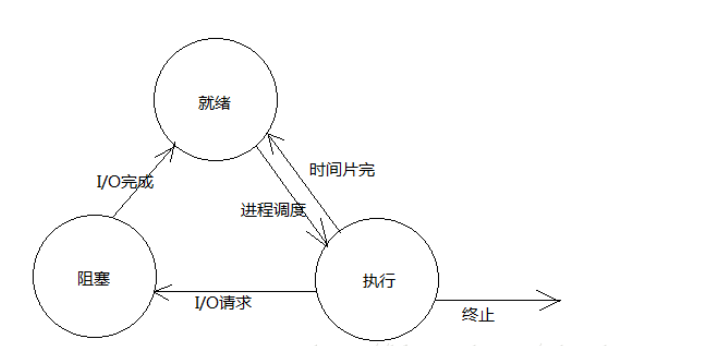
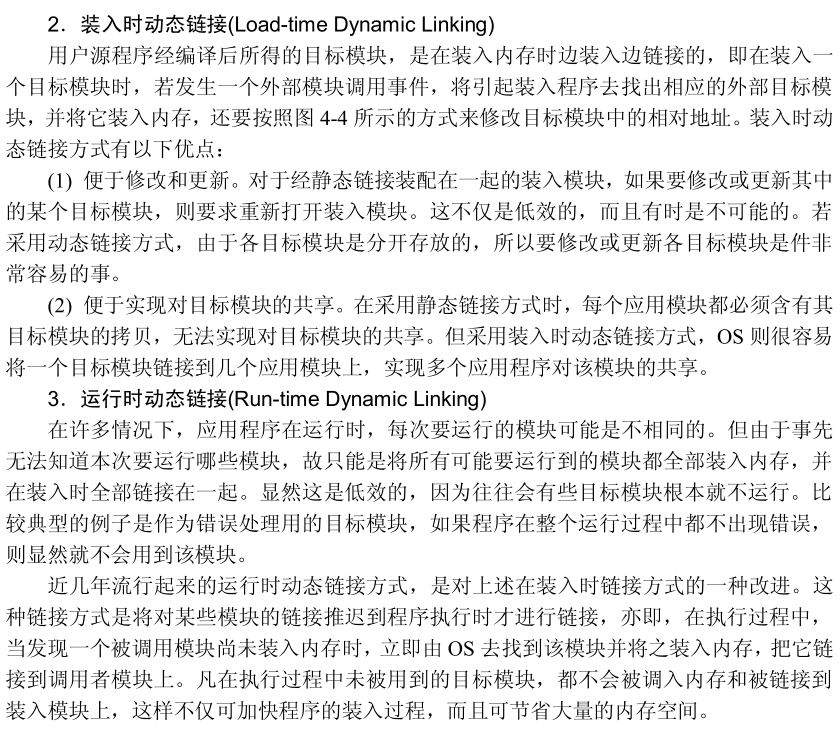
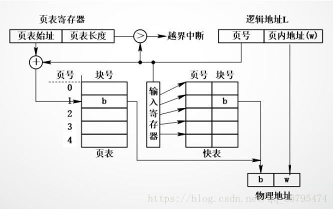

[TOC]


# 操作系统引论

## 操作系统基本特性

**1.并发**

- **并行与并发**

```
并行性：是指两个或多个事件在同一时刻发生

并发性：是指两个或多个事件在同一时间间隔内发生
```

- **引入进程和线程**

```
进程是指在系统中能独立运行并作为资源分配的基本单位，它是由一组机器指令、数据和堆栈等组成的，是一个能独立运行的活动实体。

在引入线程的 OS 中，通常都是把进程作为分配资源的基本单位，而把线程作为独立运行和独立调度的基本单位。
```

**2.共享**

```
互斥共享：系统中的某些资源虽然可以提供给多个线程（进程）使用，但在规定的时间内，只允许一个进程访问该资源。

同时访问：系统中还有另一种资源，允许在一段时间内由多个进程“同时”对他们进行访问。

并发和共享时多用户OS的两个最基本的特性 
```

**3.虚拟**

```
该虚拟技术的功能是通过“空分复用”和“时分复用”技术，将一个物理实体变为若干个逻辑上的对应物。 
```

**4.异步**

```
进程是以不可预知的速度向前推进，即进程的异步性。内存中的每个进程在何时能获得处理机运行，何时又因提出某种资源请求而暂停，以及进程以怎样的速度向前推进，每道程序总共需多少时间才能完成等等，这些都是不可预知的。
```

## 操作系统主要功能

1.处理机管理功能：进程控制，进程同步，进程通信，调度。

2.存储器管理功能：内存分配，内存保护，内存扩充等。

3.设备管理功能：缓冲管理，设备分配，设备处理。

4.文件管理功能：文件存储空间的管理，目录管理，文件的读/写管理和保护。

## 用户态和内核态

**1.概念**

通常也将处理机的执行状态分成用户态和系统态：

```
系统态又称为管态，也称为内核态。它具有较高的特权，能执行一切指令，访问所有寄存器和存储区，传统的0S都在系统态运行。

用户态又称为目态。它是具有较低特权的执行状态，仅能执行规定的指令，访问指定的寄存器和存储区。一般情况下，应用程序只能在用户态运行，不能去执行OS指令及访问OS区域，这样可以防止应用程序对0S的破坏。
```

**2.用户态和内核态的转换**

```
系统调用：
这是用户态进程主动要求切换到内核态的一种方式，用户态进程通过系统调用申请使用操作系统提供的服务程序完成工作，比如前例中fork()实际上就是执行了一个创建新进程的系统调用。而系统调用的机制其核心还是使用了操作系统为用户特别开放的一个中断来实现，例如Linux的int 80h中断。

异常：
当CPU在执行运行在用户态下的程序时，发生了某些事先不可知的异常，这时会触发由当前运行进程切换到处理此异常的内核相关程序中，也就转到了内核态，比如缺页异常。

外围设备的中断：
当外围设备完成用户请求的操作后，会向CPU发出相应的中断信号，这时CPU会暂停执行下一条即将要执行的指令转而去执行与中断信号对应的处理程序，如果先前执行的指令是用户态下的程序，那么这个转换的过程自然也就发生了由用户态到内核态的切换。比如硬盘读写操作完成，系统会切换到硬盘读写的中断处理程序中执行后续操作等。

这3种方式是系统在运行时由用户态转到内核态的最主要方式，其中系统调用可以认为是用户进程主动发起的，异常和外围设备中断则是被动的。
```

# 进程的描述与控制

## 进程基础

**1.概念**

进程是具有一定独立功能的程序关于某个数据集合上的一次运行活动,进程是系统进行资源分配和调度的一个独立单位。

**2.进程的特征**

动态性：进程的基本特性。进程是进程实体的执行过程；
并发性：进程的主要特征。多个进程实体同存于内存中，能在一段时间内同时运行。
独立性：进程实体是一个能独立运行的基本单位，同时也是系统中独立获得资源和独立调度的基本单位。
异步性：进程按各自独立的、不可预知的速度向前推进，或者说，进程按异步方式运行。
结构特征：从结构上看，进程实体是由程序段、数据段及进程控制快三部分组成，有人把这三部分统称为“进程映像”。

**3.进程的状态及转换**

- **三态模型**

就绪状态：当一个进程获得了除处理机以外的一切所需资源，一旦得到处理机即可运行，则称此进程处于就绪状态。就绪进程可以按多个优先级来划分队列。例如，当一个进程由于时间片用完而进入就绪状态时，排入低优先级队列；当进程由I／O操作完成而进入就绪状态时，排入高优先级队列。

运行状态：当一个进程在处理机上运行时，则称该进程处于运行状态。处于此状态的进程的数目小于等于处理器的数目，在单处理机系统，处于运行状态的进程只有一个，而在多处理机系统中，则可能有多个进程处于执行状态。在没有其他进程可以执行时（如所有进程都在阻塞状态），通常会自动执行系统的空闲进程。

阻塞状态：也称为等待或睡眠状态，一个进程正在等待某一事件发生（例如请求I/O而等待I/O完成等）而暂时停止运行，这时即使把处理机分配给进程也无法运行，故称该进程处于阻塞状态。



- **五态模型**

创建状态：创建一个进程要经过以下几步：

```
1.首先进程申请一个空白PCB，并向PCB中填写用于控制和管理进程的信息

2.然后为该进程分配运行时所必须的资源

3.最后把该进程转入就绪状态并插入就绪队列
```

但如果进程所需的资源尚不能得到满足，比如系统尚无足够的内存使进程无法装入其中，此时创建工作尚未完成，进程尚不能被调度运行，于是把此时进程所处的状态称为创建状态。引入创建状态是为了保证进程的调度必须是在创建工作完成之后

终止状态：进程的终止状态有以下两步：

```
1.首先，等待操作系统做善后处理

2.最后将其PCB清零，并将PCB空间返还给系统
```

当一个进程达到了自然结束点或是出现了无法克服的错误，或是被操作系统终结，或是被其它有终止权的进程所终结，则进入终止状态。进入终止状态的进程以后不能再执行，但在操作系统中保存状态码和一些计时统计数据供其它进程收集，一旦对其完成信息的提取之后，操作系统将删除该进程，即将其PCB清零，并将该空白PCB返回系统。


- **引入挂起操作和进程状态的转换**

1）引入挂起状态的原因

```
1.终端用户的请求。当终端用户在自己的程序运行期间发现有可疑问题时，希望暂时使自己的程序静止下来。也就是使正在执行的进程暂停执行。若此时用户进程正处于就绪状态而未执行，则该进程暂不接受调度，以便用户研究其执行情况或对程序进行修改。我们把这种静止状态称为挂起状态。 　

2.父进程请求。有时父进程希望挂起自己的某个子进程，以便考查和修改该子进程，或者协调各子进程间的活动。

3.负荷调节的需要。当实时系统中的工作负荷较重，已可能影响到对实时任务的控制时，可由系统把一些不重要的进程挂起，以保证系统能正常运行。

4.操作系统的需要。操作系统有时希望挂起某些进程，以便检查运行中的资源使用情况或进行记账。
```

1）三种状态引入挂起状态


2）五种基本状态引入挂起状态

 

**4.进程控制块（PCB）**

- **概念**

PCB是一种记录了操作系统所需的，用于描述进程的当前情况以及管理进程运行的全部信息的记录型数据结构。

- **作用**

```
1.作为独立运行基本单位的标志，也是进程存在于系统的唯一标志。当一个程序（含数据）配置了PCB后，就表示它已经是一个能在多道程序环境下独立运行的，合法的基本单位，也就是具有取得OS服务的权利。

2.能实现间断性运行方式。系统就可将CPU现场信息保存在被中断进程的PCB中，供该进程再次被调度执行时恢复CPU现场时使用。

3.提供进程管理所需要的信息。比如当调度程序调度某进程运行时，只能根据该进程PCB中记录的程序和数据在内存或外存中的始址地址，找到相应的程序或数据。

4.提供进程调度所需要的信息。比如只有处于就绪状态的进程才能被调度执行，而在PCB中就提供了进程处于何种状态的信息。

5.实现与其他进程的同步与通信。进程同步进制是用于实现诸进程的协调运行的，在采用信号量机制时，它要求在每个进程中都设置有相应的用于同步的信号量。在PCB中还具有实现进程通信的区域或通信队列指针等。
```

- **进程控制块中的信息**

1）进程标识符

```
进程标识符用于唯一标识一个进程，一个进程通常又两种标识符：

外部标识符。它是由创建者提供的，通常由字母，数字组成的。为了描述进程的家族关系，还应设置父进程标识及子进程标识。此外，还可以设置用户标识，以指示拥有该进程的用户。

内部标识符。OS赋予每一个进程一个唯一的数字标识符，通常是一个进程的序号。
```

2）处理机状态

```
处理机状态信息也称为处理机的上下文，主要是由处理机的各种寄存器中的内容组成的。这些寄存器包括：

1.通用寄存器，又称为用户可视寄存器，它们是用户程序可以访问的，用于暂存信息，在大多数处理机中，有8到32个通用寄存器。

2.指令计数器，存放了要访问的下一条指令的地址。

3.程序状态字PSW，其中含有状态信息，如条件码，执行方式，中断屏蔽标志等。

4.用户栈指针，指每个用户进程都有一个或若干个与之相关的系统栈，用于存放过程和系统调用参数及调用地址。
```

3）进程调度信息 

    1.进程状态，指明进程当前状态，作为进程调度和对换的依据。
    
    2.进程优先级，用于描述进程使用处理机的优先级别的一个整数，优先级别高的进程优先获得处理机。
    
    3.进程调度所需的其他信息，它们与采用的进程调度算法有关。
    
    4.事件，是指进程由执行状态转变为阻塞状态所等待发生的事件，即阻塞原因。
4）进程控制信息 

    1.程序和数据的地址
    
    2.进程同步和通信机制
    
    3.资源清单，在该清单中列出进程在运行期间所需的全部资源（除CPU外），另外还有一张已分配到该进程资源的清单。
    
    4.链接指针，给出本进程（PCB）所在队列中的下一个进程的PCB首地址。
**5.进程的创建**

```
1.申请空白PCB，为新进程申请获得唯一的数字标识符，并从PCB集合中索取一个PCB。

2.为新进程分配其运行所需的资源，包括各种物理和逻辑资源，如内存、文件、I/O设备和CPU时间等。

3.初始化进程控制块（PCB）。

4.如果进程就绪队列能够接纳新进程，便将新进程插入就绪队列中。
```

## 进程同步

**1.临界资源和临界区**

```
临界资源：

1.临界资源是一次仅允许一个进程使用的共享资源。

2.各进程采取互斥的方式，实现共享的资源称作临界资源。

3.属于临界资源的硬件有，打印机，磁带机等；软件有消息队列，变量，数组，缓冲区等。

4.诸进程间采取互斥方式，实现对这种资源的共享。

临界区：

1.每个进程中访问临界资源的那段代码称为临界区，每次只允许一个进程进入临界区，进入后，不允许其他进程进入。

2.不论是硬件临界资源还是软件临界资源，多个进程必须互斥的对它进行访问。

3.多个进程涉及到同一个临界资源的的临界区称为相关临界区。

4.使用临界区时，一般不允许其运行时间过长，只要运行在临界区的线程还没有离开，其他所有进入此临界区的线程都会被挂起而进入等待状态，并在一定程度上影响程序的运行性能。
```

**2.经典进程同步问题**

- **互斥与同步**

```
同步：指为完成某种任务而建立的两个和多个进程，这些进程在合作的过程中需要协调工作次序进行有序的访问而出现等待所产生的制约关系。

互斥：指两个或多个进程访问临界资源时只能一个进程访问，其他进程等待的一种相互制约的关系。
```

- **信号量和互斥量**

```
信号量：本身是一个计数器，使用P，V两个操作来实现计数的减与加，当计数不大于0时，则进程进入睡眠状态，它用于为多个进程提供共享数据对象的访问。

互斥量：如果信号量只存在两个状态，那就不需要计数了，可以简化为加锁与解锁两个功能，这就是互斥量。
```

- **生产者消费者问题**

1）问题描述：一组生产者进程和一组消费者进程共享一块初始为空，大小确定的缓冲区，只有当缓冲区为满时，生产者进程才可以把信息放入缓冲区，否则就要等待；只有缓存区不为空时，消费者进程才能从中取出消息，否则就要等待。缓冲区一次只能一个进程访问（临界资源）。

2）问题分析：生产者与消费者进程对缓冲区的访问是互斥关系，而生产者与消费者本身又存在同步关系，即必须生成之后才能消费。因而对于缓冲区的访问设置一个互斥量，再设置两个信号量一个记录空闲缓冲区单元，一个记录满缓冲区单元来实现生产者与消费者的同步。

3）伪代码实现

```
semaphore pmutex = 1, cmutex = 1;
semaphore empty = n, full = 0;
void producer()
{
    while (true)
    {
        wait(empty);
        wait(pmutex);
        buff[in] = produce_item();
        in = (in + 1) % n;
        signal(pmutex);
        signal(full);
    }
}

void consumer()
{
    while (true)
    {
        wait(full);
        wait(cmutex);
        item = buff[out];
        print(item);
        out = (out + 1) % n;
        signal(cmutex);
        signal(empty);
    }
}
```

- **读者与写者问题**

1）问题描述：有读者与写者两个并发进程共享一个数据，两个或以上的读进程可以访问数据，但是一个写者进程访问数据与其他进程都互斥。

2）问题分析：读者与写者是互斥关系，写者与写者是互斥关系，读者与读者是同步关系。因而需要一个互斥量实现读与写和写与写互斥，一个读者的访问计数和实现对计数的互斥。

3）问题解决：两种伪代码实现

```
读者优先：

semaphore wmutex = 1, rmutex = 1;
int reader_count = 0;
void writer()
{
    while (true)
    {
        wait(wmutex); //保证了W与W互斥
        write_operation();
        signal(wmutex);
    }
} 

void reader()
{
    while (true)
    {
        wait(rmutex); //保证只能有一个reader访问reader_count
        if (reader_count == 0)
            wait(wmutex);
        reader_count++;
        signal(rmutex);

        read_operation();

        wait(rmutex); //保证只能有一个reader访问reader_count
        reader_count--;
        if (reader_count == 0)
            signal(wmutex);
        signal(rmutex);
    }
} 

问题：
>>当读者进程≥1时，随后读者进程直接进入临界区，这是读者优先的表征。

>>写者饿死问题。

>>假设有进程{R1, W1, R2, R3, ..., Rn}

>>>>执行R1，那么wmutex变为0，执行read_operation

>>>>执行W1，wmutex变为-1，阻塞W1

>>>>执行R2，wmutex不变，执行read_operation

>>>>对于若干Ri，均是如此，如果CUP资源不足，Ri会进入就绪队列

>>>>那么W1则很长时间无法调度，就算被siganl操作移入就绪队列也是在队列尾部，产生写者饿死问题。
```

```
int reader_count = 0, writer_count = 0;
semaphore x = 1, y = 1, z = 1;
semaphore wmutex = 1, rmutex = 1;
void writer()
{
   while (true)  
  {
    wait(y);
    if (writer_count == 0)
        wait(rmutex);
    writer_count++;
    signal(y);

    wait(wmutex);
    write_operation();
    signal(wmutex);

    wait(y);
    writer_count--;
    if (writer_count == 0)
        wait(rmutex);
    signal(y);
  }
} 

void reader()
{
    while (true)
    {
        wait(z);
        wait(rmutex);
        wait(x);
        if (reader_count == 0)
            wait(wmutex);
        reader_count++;
        signal(x);
        signal(rmutex);
        signal(z);

        read_operation();

        wait(x);
        reader_count--;
        if (reader_count == 0)
            wait(wmutex);
        signal(x);
    }
} 

解析：
x:控制reader_count的访问竞争。
y:控制writer_count的访问竞争。
wmutex:控制有写进程在写的时候，读进程不能进入临界区。
rmutex:写进程先把rmutex拿到，保证在写进程运行时，其他所有读进程均无法进入临界区（只能阻塞在rmutex队列上，见红色代码。
z:保证了在rmutex的阻塞队列上，只有一个读进程在排队，其余所有读进程在等待rmutex之前，在z的队列上排队。（尝试把wait(z)和signal(z)去掉理解一下）如果没有z，则都在rmutex上排队。
    
为什么需要z？在rmutex上不允许长的排队，否则写进程不能跳过这个长队列。
举例说明：{R1, W1, R2, R3, ..., Rn}

如果有z，reader1先wait1，rmutex=0；然后writer再wait(rmutex)，rmutex=-1；后面尽管有再多的reader都在堵塞在z。此时，只需要等待reader1执行signal(rmutex)，writer即能够进入就绪状态，优先于z中阻塞的reader。

如果无z，writer和所有的reader都进入rmutex排队，实质上无法保证writer优先于reader。
```

- **哲学家就餐问题**

1）问题描述：一张圆桌上坐着五名哲学家，每两名哲学家之间的桌子摆一根筷子，哲学家只有同时拿起左右两根筷子时才可以用餐，用餐完了筷子放回原处。

2）问题分析：这里五名哲学家就是五个进程，五根筷子是需要获取的资源。可以定义互斥数组用于表示五根筷子的互斥访问，为了防止哲学家个取一根筷子出现死锁，需要添加一定的限制条件。一种方法是限制仅当哲学家左右筷子均可以用时，才拿起筷子，这里需要一个互斥量来限制获取筷子不会出现竞争。

3）问题解决：一次仅能一个哲学家拿起筷子，效率比较低。

```
semaphore chopstick[5]={1,1,1,1,1};
semaphore mutex=1;
pi()
{
    while(1)
    {
        P(mutex);
        P(chopstick[i]);
        P(chopstick[(i+1)%5]);
        V(mutex);
        
        eating;
        
        V(chopstick[i]);
        V(chopstick[(i+1)%5]);
    }
}
```

## 进程通信

    1.管道(PIPE)：管道是一种半双工的通信方式，数据只能单向流动，而且只能在具有亲缘关系(父子进程)的进程间使用。另外管道传送的是无格式的字节流，并且管道缓冲区的大小是有限的（管道缓冲区存在于内存中，在管道创建时，为缓冲区分配一个页面大小）。
    
    2.命名管道 (FIFO)： 命名管道也是半双工的通信方式，但是它允许无亲缘关系进程间的通信。
    
    3.信号(Signal)： 信号是一种比较复杂的通信方式，用于通知接收进程某个事件已经发生。
    
    4.信号量(Semaphore)：信号量是一个计数器，可以用来控制多个进程对共享资源的访问。它常作为一种锁机制，防止某进程正在访问共享资源时，其他进程也访问该资源。因此，主要作为进程间以及同一进程内不同线程之间的同步手段。
    
    5.消息队列(Message Queue)：消息队列是由消息的链表，存放在内核中并由消息队列标识符标识。消息队列克服了信号传递信息少、管道只能承载无格式字节流以及缓冲区大小受限等缺点。
    
    6.共享内存(Shared Memory )：共享内存就是映射一段能被其他进程所访问的内存，这段共享内存由一个进程创建，但多个进程都可以访问。共享内存是最快的 IPC 方式，它是针对其他进程间通信方式运行效率低而专门设计的。它往往与其他通信机制，如信号量，配合使用，来实现进程间的同步和通信。
    
    7.套接字(Socket)： 套解口也是一种进程间通信机制，与其他通信机制不同的是，它可用于不同主机间的进程通信。
## 线程

**1.概念**

 线程是CPU调度和分派的基本单位，它可与同属一个进程的其他的线程共享进程所拥有的全部资源。

**2.线程与进程的区别**

```
进程：进程是程序的一次执行过程，是一个动态概念，是程序在执行过程中分配和管理资源的基本单位。每一个进程都有一个自己的地址空间。它至少有 5 种基本状态，分别是：创建状态，执行状态，阻塞状态，就绪状态，终止状态。

线程：线程是进程内部的一个执行序列，是CPU调度和分派的基本单位，它可与同属一个进程的其他的线程共享进程所拥有的全部资源。

联系： 线程是进程的一部分，一个线程只能属于一个进程，而一个进程可以有多个线程，但至少有一个线程。

区别：理解它们的差别，我从资源使用的角度出发。（所谓的资源就是计算机里的中央处理器，内存，文件，网络等等）

1.根本区别：进程是操作系统资源分配的基本单位，而线程是任务调度和执行的基本单位。

2.在开销方面：每个进程都有独立的代码和数据空间（程序上下文），进程之间的切换会有较大的开销；线程可以看做轻量级的进程，同一类线程共享代码和数据空间，每个线程都有自己独立的运行栈和程序计数器（PC），线程之间切换的开销小。

3.所处环境：在操作系统中能同时运行多个进程，而在同一个进程中有多个线程同时执行（通过CPU调度，在每个时间片中只有一个线程执行）。

4.内存分配方面：系统在运行的时候会为每个进程分配不同的内存空间；而对线程而言，除了CPU外，系统不会为线程分配内存。线程所使用的资源来自其所属进程的资源，线程组之间只能共享资源。

5.包含关系：没有线程的进程可以看做是单线程的，如果一个进程内有多个线程，则执行过程不是一条线的，而是多条线（线程）共同完成的；线程是进程的一部分，所以线程也被称为轻权进程或者轻量级进程。

总结：
1.进程是运行中的程序，线程是进程内部的一个执行序列；

2.进程是资源分配的基本单元，线程是任务调度和执行的基本单位；

3.进程间切换代价大，线程间切换代价小；

4.进程拥有资源多，线程拥有资源少，多个线程共享进程中的资源；
```

**3.线程的状态**


```
1.初始状态

实现Runnable接口和继承Thread可以得到一个线程类，new一个实例出来，线程就进入了初始状态。

2.可运行状态

*可运行状态只是说你有资格运行，但调度程序没有挑选到你，你就永远是可运行状态。

*调用线程的start()方法，此线程进入可运行状态。

*当前线程sleep()方法结束，其他线程join()结束，等待用户输入完毕，某个线程拿到对象锁，这些线程也将进入可运行状态。

*当前线程时间片用完了，调用当前线程的yield()方法，当前线程进入可运行状态。

*锁池里的线程拿到对象锁后，进入可运行状态。

3.运行状态

线程调度程序从可运行池中选择一个线程作为当前线程时线程所处的状态。这也是线程进入运行状态的唯一一种方式。

4.死亡状态

*当线程的run()方法完成时，或者主线程的main()方法完成时，我们就认为它死去。这个线程对象也许是活的，但是，它已经不是一个单独执行的线程。线程一旦死亡，就不能复生。

*在一个死去的线程上调用start()方法，会抛出java.lang.IllegalThreadStateException异常。

5.阻塞状态

*当前线程T调用Thread.sleep()方法，当前线程进入阻塞状态。

*运行在当前线程里的其它线程t2调用join()方法，当前线程进入阻塞状态。

*等待用户输入的时候，当前线程进入阻塞状态。
```

**4.线程的四种创建方式**

```
1.继承Thread类创建线程

2.实现Runnable接口创建线程

3.使用Callable和Future创建线程

4.使用线程池例如用Executor框架
```

**5.线程同步的四种方式**

```
windows下的线程同步：
1.临界区：保证在某一时刻只有一个线程能访问数据的简便办法。在任意时刻只允许一个线程对共享资源进行访问。如果有多个线程试图同时访问临界区，那么 在有一个线程进入后其他所有试图访问此临界区的线程将被挂起，并一直持续到进入临界区的线程离开。临界区在被释放后，其他线程可以继续抢占，并以此达到用原子方式操 作共享资源的目的。 仅能在同一进程内使用

2.互斥量 Mutex：互斥量跟临界区很相似，只有拥有互斥对象的线程才具有访问资源的权限，由于互斥对象只有一个，因此就决定了任何情况下此共享资源都不会同时被多个线程所访问。当前占据资源的线程在任务处理完后应将拥有的互斥对象交出，以便其他线程在获得后得以访问资源。互斥量比临界区复杂。因为使用互斥不仅仅能够在同一应用程序不同线程中实现资源的安全共享，而且可以在不同应用程序的线程之间实现对资源的安全共享。 
信号量 

3.信号量：对象对线程的同步方式与前面几种方法不同，信号允许多个线程同时使用共享资源 ，这与操作系统中的PV操作相同。

4.事件（Event）：事件机制，则允许一个线程在处理完一个任务后，主动唤醒另外一个线程执行任务。

Linux下的线程同步：
1.Mutex（互斥锁）
2.条件变量
3.自旋锁
4.读写锁
5.信号量

条件变量(condition variable)：顾名思义是一个或多个线程等待某个布尔表达式为真，即等待别的线程“唤醒”它。条件变量的学名叫管程(monitor)。Java Object 内置的wait()，notify()，notifyAll() 即是条件变量。
```

**6.线程间通信**

```
1.锁机制：包括互斥锁、条件变量、读写锁和自旋锁。

*互斥锁确保同一时间只能有一个线程访问共享资源。当锁被占用时试图对其加锁的线程都进入阻塞状态(释放CPU资源使其由运行状态进入等待状态)。当锁释放时哪个等待线程能获得该锁取决于内核的调度。

*读写锁当以写模式加锁而处于写状态时任何试图加锁的线程(不论是读或写)都阻塞，当以读状态模式加锁而处于读状态时“读”线程不阻塞，“写”线程阻塞。读模式共享，写模式互斥。

*条件变量可以以原子的方式阻塞进程，直到某个特定条件为真为止。对条件的测试是在互斥锁的保护下进行的。条件变量始终与互斥锁一起使用。

*自旋锁上锁受阻时线程不阻塞而是在循环中轮询查看能否获得该锁，没有线程的切换因而没有切换开销，不过对CPU的霸占会导致CPU资源的浪费。 所以自旋锁适用于并行结构(多个处理器)或者适用于锁被持有时间短而不希望在线程切换产生开销的情况。

2.信号量机制(Semaphore)：包括无名线程信号量和命名线程信号量。

3.信号机制(Signal)：类似进程间的信号处理。
```

#  处理机调度和死锁

## 作业调度算法

1.先来先服务（FCFS）调度算法

2.短作业优先（SJF）调度算法

3.优先级调度算法

4.高响应比优先调度算法

## 死锁

**1.什么是死锁？**

在两个或者多个并发进程中，如果每个进程持有某种资源而又等待其它进程释放它们现在保持着的资源，在未改变这种状态之前都不能向前推进，称这一组进程产生了死锁。通俗的讲就是两个或多个进程无限期的阻塞、相互等待的一种状态。

**2.死锁产生的条件**

```
1.互斥条件：一个资源一次只能被一个进程使用。

2.请求与保持条件：一个进程因请求资源而阻塞时，对已获得资源保持不放。

3.不可抢占条件：进程获得的资源，在未完全使用完之前，不能强行剥夺。

4.循环等待条件：若干进程之间形成一种头尾相接的环形等待资源关系。
```

**3.处理死锁的方法**

- **预防死锁**

产生死锁需要四个条件，那么，只要这四个条件中至少有一个条件得不到满足，就不可能发生死锁了。由于互斥条件是非共享资源所必须的，不仅不能改变，还应加以保证。所以，主要是破坏产生死锁的其他三个条件。

1）破坏“请求和保持”条件

```
方法1：所有的进程在开始运行之前，必须一次性地申请其在整个运行过程中所需要的全部资源。

方法2：该方法是对第一种方法的改进，允许进程只获得运行初期需要的资源便开始运行。在运行过程中，逐步释放掉已分配到且已经使用完毕的资源，然后再去请求新的资源。
```

2）破坏“不可抢占”条件

```
当一个已经持有了一些资源的进程在提出新的资源请求没有得到满足时，它必须释放已经保持的所有资源，待以后需要使用的时候再重新申请。
```


3）破坏“循环等待”条件

```
可以通过定义资源类型的线性顺序来预防，可将每个资源编号，当一个进程占有编号为i的资源时，那么它下一次申请资源只能申请编号大于i的资源，如果需要多个同类资源单元，则必须一起申请。例如，当某个进程需要同时使用打印机和磁带机时，由于磁带机序号低，而答应机序号高，故应先申请磁带机再申请打印机。假如某进程已申请到一些序号较高的资源后，后来它又想申请一个序号较低的资源时，它必须先释放所具有相同和更高序号的资源后，才能申请序号低的资源。
```

如图所示：


- **避免死锁**

在资源的动态分配过程中，用某种方法去防止系统进入不安全状态，从而避免发生死锁。这是目前最常用的方法。

1）银行家算法

- **检测死锁**

这种方法并不须事先采取任何限制性措施，也不必检查系统是否已经进入不安全区，而是允许系统在运行过程中发生死锁。但可通过系统所设置的检测机构，及时地检测出死锁的发生，并精确地确定与死锁有关的进程和资源； 然后，采取适当措施，从系统中将已发生的死锁清除掉。

- **解除死锁**

这是与检测死锁相配套的一种措施。当检测到系统中已发生死锁时，须将进程从死锁状态中解脱出来。常用的实施方法是撤消或挂起一些进程，以便回收一些资源，再将这些资源分配给已处于阻塞状态的进程，使之转为就绪状态，以继续运行。死锁的检测和解除措施有可能使系统获得较好的资源利用率和吞吐量，但在实现上难度也最大。

# 存储器管理

## 存储器的层次结构

**1.寄存器和Cache（高速缓冲存储器）的区别？**

```
1.寄存器是中央处理器内的组成部份。寄存器是有限存贮容量的高速存贮部件，它们可用来暂存指令、数据和位址。在中央处理器的控制部件中，包含的寄存器有指令寄存器(IR)和程序计数器(PC)。在中央处理器的算术及逻辑部件中，包含的寄存器有累加器(ACC)。

2.内存包含的范围非常广，一般分为只读存储器（ROM）、随机存储器（RAM）和高速缓存存储器（cache）。

3.寄存器是CPU内部的元件，寄存器拥有非常高的读写速度，所以在寄存器之间的数据传送非常快。

4.Cache ：即高速缓冲存储器，是位于CPU与主内存间的一种容量较小但速度很高的存储器。由于CPU的速度远高于主内存，CPU直接从内存中存取数据要等待一定时间周期，Cache中保存着CPU刚用过或循环使用的一部分数据，当CPU再次使用该部分数据时可从Cache中直接调用,这样就减少了CPU的等待时间,提高了系统的效率。
```

 **2.多核CPU和多个CPU的区别？**

```
多个CPU：主板上有多个CPU。

多核CPU：一个CPU有多个中央处理单元。
```

## 程序的装入和链接

**1.程序的处理过程**

首先是要编译，由编译程序(Compiler)将用户源代码编译成若干个目标模块(Object Module)；其次是链接，由链接程序(Linker)将编译后形成的一组目标模块，以及它们所需要的库函数链接在一起，形成一个完整的装入模块(Load Module)；最后是装入，由装入程序(Loader)将装入模块装入内存。


**2.程序的装入**

**绝对装入方式(Absolute Loading Mode)**


**可重定位装入方式(Relocation Loading Mode)**


**动态运行时装入方式(Dynamic Run-time Loading)**


**3.动态链接和静态链接的区别**

```
静态链接。在程序运行之前，先将各目标模块及它们所需的库函数，链接成一个完整的装配模块，以后不再拆开。我们把这种事先进行链接的方式称为静态链接方式。

装入时动态链接。这是指将用户源程序编译后所得到的一组目标模块，在装入内存时，采用边装入边链接的链接方式。

运行时动态链接。这是指对某些目标模块的链接，是在程序执行中需要该(目标)模块时，才对它进行的链接。
```




## 离散分配存储管理方式

**1.连续分配存储管理方式**

```
1.单一连续分配

2.固定分区分配
 *首次适应算法
 *循环首次适应算法
 *最佳适应算法
 *最坏适应算法

3.动态分区分配

4.动态重定位分区分配
```

**2.连续分配存储管理方式产生的问题**

在分区存储管理中，要求把进程放在一个连续的存储区中，因而会产生许多碎片。

**3.离散分配存储方式**

分页式存储管理：离散分配的基本单位是页

分段式存储管理：离散分配的基本单位是段

段页式存储管理：离散分配的基本单位是段、页

**4.分页管理的基本方法**

- **什么是页**

**将一个用户进程的地址空间（逻辑）划分成若干个大小相等的区域，称为页或页面。**页面大小由地址结构（逻辑）决定 ，并为各页从0开始编号。页面的大小应选择适中，且页面大小应是 2 的幂，通常为 512 B～8 KB。


- **什么是块**

**把内存空间也分成若干个与页大小相等的区域，称为（存储、物理）块或页框（frame），同样从0开始编号。**


- **内存分配**

在为进程分配内存时，以块为单位将进程中若干页装入到多个不相邻的块中，最后一页常装不满一块而出现页内碎片。

- **页表的出现**

**在分页系统中，允许将进程的各个页离散地存储在内存的任一物理块中，为保证进程仍然能够正确地运行，即能在内存中找到每个页面所对应的物理块，系统又为每个进程建立了一张页面映像表，简称页表。**一个页表中包含若干个表目，1.表目的自然序号对应于用户程序中的页号。2.表目中的块号是该页对应的物理块号。


- **内存地址的获取**

**以页号查页表，得到对应页装入内存的块号。即可求出：内存地址＝物理块号×页大小＋页内地址。**


例:在采用页式存储管理的系统中,某作业J的逻辑地址空间为4页(每页2048字节),且已知该作业的页面映像表如下:


试借助地址变换图求出有效逻辑地址4865所对应的物理地址。

解:页号  4865/2048=2   页内位移   4865%2048=769，过程如下：


从上面我们可以看出：CPU要想获取一个数据时，必须两次访问内存：

1、从内存中的页表中，寻找对应的物理块号，将物理块号与页内地址组合成物理地址。

2、根据组合成的物理地址，来获取数据。

为了提高效率呢，就引进了块表，什么是快表呢？

在地址变换机构中，增设一个具有并行查寻能力的特殊高速缓冲寄存器，称为“联想存储器”或“快表”。



**5.分段存储管理方式**

- **什么是分段**

**把用户程序的地址空间划分为若干个大小不同的段，每段可定义一组相对完整的信息，每个段都是从 0 开始编址，并有自己的名字和长度。**因此，希望要访问的逻辑地址是由段名(段号)和段内偏移量(段内地址)决定的。


- **分段系统的空间划分**

由用户根据逻辑信息的相对完整将用户作业的逻辑地址空间划分成若干个大小不等的段 。各段有段名（常用段号代替） ，首地址为 0。


- **利用段表实现地址映射**

为了能从物理内存中找出每个逻辑段所对应的位置，在系统中为每个进程建立一张段映射表，简称“段表”。每个段在表中占有一个表项，其中记录了该段在内存中的起始地址(又称为“基址”)和段的长度


- **地址变换机构**

系统将逻辑地址中的段号 S 与段表长度 TL 进行比较。

```
若 S>TL，表示段号太大，是访问越界，于是产生越界中断信号。

若未越界，则根据段表的始址和该段的段号，计算出该段对应段表项的位置，从中读出该段在内存的始址。
```

再检查段内地址 d，是否超过该段的段长 SL。

```
若超过，即 d >SL，同样发出越界中断信号。

若未越界，则将该段的基址与段内地址 d 相加，即可得到要访问的内存物理地址。
```


**6.分页与分段的主要区别**

```
1.页是信息的物理单位，分页仅仅是由于系统管理的需要，对用户透明的。段是信息的逻辑单位，分段的目的是为了能更好的满足用户的需要。

2.页的大小固定且由系统确定，把逻辑地址划分为页号和页内地址两部分。段的长度却不固定，决定于用户所编写的程序。

3.分页的作业地址空间是一维的，分段的作业地址空间是二维的。

4.页和段都有存储保护机制。但存取权限不同：段有读、写和执行三种权限；而页只有读和写两种权限。 
```


**7.段页式存储管理的基本原理**

**原理**

    1.段页式存储管理是分段和分页原理的结合，即先将用户程序分成若干个段（段式），并为每一个段赋予一个段名，再把每个段分成若干个页（页式）。
    
    2.其地址结构由段号、段内页号、及页内位移三部分所组成。
    
    3.系统中设段表和页表，均存放于内存中。读一字节的指令或数据须访问内存三次。为提高执行速度可增设高速缓冲寄存器。
        
    4.每个进程一张段表，每个段一张页表。
       
    5.段表含段号、页表始址和页表长度。页表含页号和块号。


**利用段表和页表实现地址映射**


**段页式存储管理的地址变换**

```
1.从 PCB 中取出段表始址和段表长度，装入段表寄存器。

2.将段号与段表长度进行比较，若段号大于或等于段表长度，产生越界中断。

3.利用段表始址与段号得到该段表项在段表中的位置。取出该段的页表始址和页表长度。

4.将页号与页表长度进行比较，若页号大于或等于页表长度，产生越界中断。

5.利用页表始址与页号得到该页表项在页表中的位置。

6.取出该页的物理块号，与页内地址拼接得到实际的物理地址。
```

 

# 虚拟存储器 

## 虚拟存储器概述

**1.概念**

**虚拟存储器是指具有请求调入功能和置换功能，能从逻辑上对内存容量加以扩充的一种存储器系统，让用户感觉到的内存容量比实际内存容量大得多。其逻辑容量由内存容量和外存容量之和来决定，其运行速度接近于内存速度，而每位的成本却又接近于外存。**可见，虚拟存储技术是一种性能非常优越的存储器管理技术，故被广泛地应用于大、中、小型和微型机器中。

**2.虚拟存储器的特征**

虚拟存储器具有虚拟性、离散性、多次性及强对换性等特征，其中最重要的特征是虚拟性。

```
1.虚拟性。虚拟性是指能够从逻辑上扩充内存容量，使用户所看到的内存容量远大于实际的内存容量，这是虚拟存储器所表现出的最重要的特征，也是虚拟存储器最重要的目标。

2.离散性。离散性是指内存分配时采用离散分配的方式，没有离散性就不可能实现虚拟存储器。采用连续分配方式，需要将作业装入到连续的内存区域，这样需要连续地一次性申请一部分内存空间，以便将整个作业先后多次装入内存。如果仍然采用连续装入的方式，则无法实现虚拟存储功能，只有采用离散分配方式，才能为它申请内存空间，以避免浪费内存空间。

3.多次性。多次性是指一个作业被分成多次调入内存运行。作业在运行时，只将当前运行的那部分程序和数据装入内存，以后再陆续从外存将需要的部分调入内存。

4.对换性。对换性是指允许在作业运行过程中换进换出。允许将暂时不用的程序和数据从内存调至外存的对换区，以后需要时再从外存调入到内存。
```

**3.虚拟内存的优点**

```
1.进程与进程，进程与内核相互隔离。

2.适当情况下，两个或更多的进程能共享内存。

3.便于实现内存保护机制。

4.驻留在内存中的仅是程序的一部分，所以程序的加载和运行都很快，而且一个进程所占用的内存能够超过RAM容量

5.由于每个进程使用的RAM减少了，RAM同时可以容纳的进程的数量就增多了，提高CPU的利用率。
```

 **4.虚拟内存和物理内存的区别？**

物理内存就是系统硬件提供的内存大小，是真正的内存，相对于物理内存，在linux下还有一个虚拟内存的概念，虚拟内存就是为了满足物理内存的不足而提出的策略，它是利用磁盘空间虚拟出的一块逻辑内存，用作虚拟内存的磁盘空间被称为交换空间（Swap Space）。

## 页面置换算法

**1.什么是页面置换算法？**

进程运行过程中，若其所要访问的页面不在内存，而需把它们调入内存，但内存已无空闲空间时，为了保证该进程能正常运行，系统必须从内存中调出一页程序或数据送磁盘的对换区中。但应将哪个页面调出，须根据一定的算法来确定。通常，把选择换出页面的算法称为页面置换算法(Page-Replacement Algorithms)

**2.最佳置换算法（Optimal， OPT)**

被置换的那个页面是以后不再被访问，或者在将来最长时间内才会被访问的页面，缺页中断率最低。

- **算例**

假定系统为某进程分配了三个物理块，并考虑有以下的页面号引用串：

​                   7，0，1，2，0，3，0，4，2，3，0，3，2，1，2，0，1，7，0，1

进程运行时，先将 7，0，1 三个页面装入内存。以后，当进程要访问页面 2 时，将会产生缺页中断。此时 OS 根据最佳置换算法，将选择页面 7 予以淘汰。这是因为页面 0 将作为第 5 个被访问的页面，页面 1 是第 14 个被访问的页面，而页面 7 则要在第 18 次页面访问时才需调入。下次访问页面 0 时，因它已在内存而不必产生缺页中断。当进程访问页面 3时，又将引起页面 1 被淘汰；因为，它在现有的 1，2，0 三个页面中，将是以后最晚才被
访问的。图 4-26 示出了采用最佳置换算法时的置换图。由图可看出，采用最佳置换算法发生了 6 次页面置换。

缺页为6，缺页中断率为6/12*100% = 50%。

  


**3.先进先出置换算法（First In First Out, FIFO)**

置换最先调入内存的页面，即置换在内存中驻留时间最久的页面。按照进入内存的先后次序排列成队列，从队尾进入，从队首删除。但是该算法会淘汰经常访问的页面，不适应进程实际运行的规律，目前已经很少使用。

- **算例**

当进程第一次访问页面 2 时，将把第 7 页换出，因为它是最先被调入内存的；在第一次访问页面 3 时，又将把第 0 页换出，因为它在现有的 2，0，1 三个页面中是最老的页。由图 4-27 可以看出，利用 FIFO 算法时进行了 12 次页面置换，比最佳置换算法正好多一倍。

 


**4.最近最久未使用置换算法（Least Recently Used， LRU）**

由于无法预测各个页面将来的使用情况，只能利用“最近的过去”作为"最近的将来”的近似，来置换最近一段时间以来最长时间未访问过的页面。 

- **算例**

当进程第一次对页面 2 进行访问时，由于页面 7 是最近最久未被访问的，故将它置换出去。当进程第一次对页面 3进行访问时，第 1 页成为最近最久未使用的页，将它换出。由图可以看出，前 5 个时间的图像与最佳置换算法时的相同，但这并非是必然的结果。因为，最佳置换算法是从“向后看”的观点出发的，即它是依据以后各页的使用情况；而 LRU 算法则是“向前看”的，即根据各页以前的使用情况来判断，而页面过去和未来的走向之间并无必然的联系。


## 内存抖动

**产生抖动的根本原因是，同时在系统中运行的的进程太多，由此分配给每一个进程的物理块太少，不能满足进程正常运行的基本要求，致使每个进程在运行时，频繁地出现缺页，必须请求系统将所缺失的页调入内存，这会使得在系统排队等待页面调进和调出的进程数目增加。显然，对磁盘的有效访问时间也会随之急剧增加，造成每个进程的大部分时间都用于页面的换进换出，而几乎不能去做有效的工作，从而导致发生处理机的利用率急剧下降并趋于0的情况。**我们称之为此时的进程是处于 “抖动”的状态。