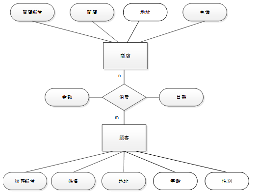
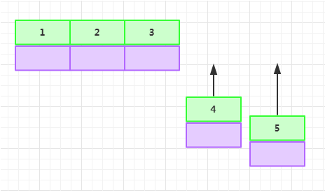
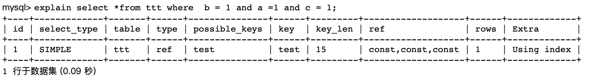
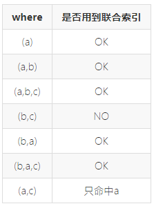

[TOC]

# 关系数据库标准语言SQL

## 数据类型

- **数字类型** 

  ```
  整数: tinyint、smallint、mediumint、int、bigint
  
  浮点数: float、double、real、decimal
  ```

- **日期和时间:**

  ```
  date、time、datetime、timestamp、year
  ```

- **字符串类型**

  ```
  字符串: char、varchar
  文本: tinytext、text、mediumtext、longtext
  ```

- **二进制(可用来存储图片、音乐等)** 

  ```
  tinyblob、blob、mediumblob、longblob
  ```

**数字类型**

1）整型

 

2）浮点型

 

FLOAT容易造成精度丢失

3）定点数DECIMAL

```
高精度的数据类型，常用来存储交易相关的数据

DECIMAL(M,N)，M代表总精度，N代表小数点右侧的位数（标度）

1 < M < 254, 0 < N < 60;

存储空间变长
```

**时间类型**

 

```
MySQL在5.6.4版本之后，TIMESTAMP和DATETIME支持到微秒。
TIMESTAMP会根据系统时区进行转换，DATETIME则不会。
存储范围的区别：
TIMESTAMP存储范围：1970-01-01 00::00:01 to 2038-01-19 03:14:07
DATETIME的存储范围：1000-01-01 00:00:00 to 9999-12-31 23:59:59
一般使用TIMESTAMP国际化
如存时间戳使用数字类型BIGINT
```

**字符串类型**

 

| 值         | CHAR(4) | 存储需求 | VARCHAR(4) | 存储需求 |
| ---------- | ------- | -------- | ---------- | -------- |
| ''         | ''      | 4个字节  | ''         | 1个字节  |
| 'ab'       | 'ab '   | 4个字节  | 'ab'       | 3个字节  |
| 'abcd'     | 'abcd'  | 4个字节  | 'abcd'     | 5个字节  |
| 'abcdefgh' | 'abcd'  | 4个字节  | 'abcd'     | 5个字节  |

**从上面可以看得出来CHAR的长度是固定的，不管你存储的数据是多少他都会固定的长度。而VARCHAR则处可变长度但他要在总长度上加1字符，这个用于保存实际使用了多大的长度。**

请注意，上表中最后一行的值只适用不使用严格模式时；如果MySQL运行在严格模式，超过列长度的值不被保存，并且会出现错误。

从CHAR(4)和VARCHAR(4)列检索的值并不总是相同，因为检索时从CHAR列删除了尾部的空格。通过下面的例子说明差别：

```
mysql> CREATE TABLE test(a VARCHAR(4), b CHAR(4));

mysql> INSERT INTO test VALUES ('ab  ', 'ab  ');

mysql> SELECT CONCAT(a, '+'), CONCAT(b, '+') FROM test;
```

结果如下：

| CONCAT(a, '+') | CONCAT(b, '+') |
| :------------: | :------------: |
|      ab +      |      ab+       |

```
1.char：存储定长数据很方便，CHAR字段上的索引效率极高，必须在括号里定义长度，char列可以有默认值。比如定义char(10)，那么不论你存储的数据是否达到了10个字符，都要占去10个字符的空间（自动用空格填充），且在检索的时候后面的空格会隐藏掉，所以检索出来的数据需要记得用trim之类的函数去过滤空格。

2.varchar：存储变长数据，但存储效率比CHAR高，必须在括号里定义长度，varchar列可以有默认值。保存数据的时候，不进行空格自动填充，而且如果数据存在空格时，当值保存和检索时尾部的空格仍会保留。另外，varchar类型的实际长度是它的值的实际长度+1，这一个字节用于保存实际使用了多大的长度。

3.text：存储可变长度的非Unicode数据，最大长度为2^31-1个字符。text列不能有默认值，存储或检索过程中，不存在大小写转换，后面如果指定长度，不会报错误，但是这个长度是不起作用的，意思就是你插入数据的时候，超过你指定的长度还是可以正常插入。
```

## MySQL中int(1)与int(10)的区别

INT(M)，这里的M代表的并不是存储在数据库中的具体的长度，以前总是会误以为int(3)只能存储长度为3的数字，int(11)就会存储长度为的数字，这是大错特错的。

**其实当我们在选择使用int的类型的时候，不论是int(3)还是int(11)，它在数据库里面存储的都是4个字节的长度，在使用int(3)的时候如果你输入的是10，会默认给你存储位010，也就是说这个3代表的是默认的一个长度，当你不足3位时会帮你补全，当你超过3位时，就没有任何的影响。**

```
mysql> create table test(id int(3));
Query OK, 0 rows affected (0.47 sec)

mysql> insert into test values(12);
Query OK, 1 row affected (0.12 sec)

mysql> insert into test values(1234);
Query OK, 1 row affected (0.10 sec)

mysql> select * from test;

+------+| id   |+------+|   12 || 1234 |+------+
```

**加上zerofill，再试一下：**

```
mysql> create table test1(id int(3) zerofill);
Query OK, 0 rows affected (0.32 sec)

mysql> insert into test1 value(12);
Query OK, 1 row affected (0.07 sec)

mysql> insert into test1 value(1234);
Query OK, 1 row affected (0.05 sec)

mysql> select * from test1;

+------+| id   |+------+|  012 || 1234 |+------+
```

**这下注意12前面输出多了个0，因为系统判定12显示宽度不足，会补0来补全显示宽度。而1234显示宽度为4比3大，没有影响。**

## count(1)，count(0)，count(*)，count(列)的区别

COUNT()函数用来统计表的行数，也就是统计记录行数，很好理解。

在SELECT检索语句中，**COUNT(expr)统计并返回参数expr为非NULL值的总行数，COUNT(DISTINCT expr)返回的是参数expr为非NULL值且不相同的总行数**，结果是一个BIGINT数据类型的值，占8个字节。如果没有匹配到满足条件的行，结果返回0。但是**当expr不是具体的列，是COUNT(*)时会统计表中所有的行数，即使某些行是NULL也会被统计在内**。

```
CREATE TABLE `users` (
  `Id` int(11) NOT NULL AUTO_INCREMENT,
  `LoginName` varchar(50) DEFAULT NULL,
  `LoginPwd` varchar(16) DEFAULT NULL,
  `Name` varchar(16) DEFAULT NULL,
  `Address` varchar(16) DEFAULT NULL,
  `Phone` varchar(16) DEFAULT NULL,
  `Mail` varchar(16) DEFAULT NULL,
  PRIMARY KEY (`Id`)
) ENGINE=InnoDB AUTO_INCREMENT=1 DEFAULT CHARSET=utf8; 

#插入数据
mysql> select * from users;
+----+------------+----------+------+----------+-------------+---------------+
| Id | LoginName  | LoginPwd | Name | Address  | Phone       | Mail          |
+----+------------+----------+------+----------+-------------+---------------+
|  1 | bb1        | 123      | 张三 | 湖北武汉 | 13317190688 | 123@gmail.com |
|  2 | bb3        | 123      | 李四 | 湖北武汉 | 13317190688 | 123@gmail.com |
|  3 | jj4        | 123      | 张三 | 湖北武汉 | 13317190688 | 123@gmail.com |
|  4 | kobeBryant | 123456   | NULL | LA       | NULL        | NULL          |
|  5 | kobe       | 456      | NULL | NULL     | NULL        | NULL          |
|  6 | Jay        | NULL     | NULL | GXI      | NULL        | NULL          |
|  7 | jj4        | NULL     | NULL | NULL     | NULL        | NULL          |
+----+------------+----------+------+----------+-------------+---------------+
7 rows in set
```

执行查询：


根据上述结果可以有以下结论：

```
1.COUNT(*)、COUNT(1)、COUNT(0)统计的是所有行数，结果都是7行。

2.COUNT(LoginPwd)、COUNT(Phone)分别统计列LoginPwd、列Phone的非NULL的行数，结果分别是5行、3行。

3.COUNT(DISTINCT Phone)只统计列Phone的非NULL且不相同的行数，结果是1行。
```

对 COUNT(LoginPwd)、COUNT(Phone)和COUNT(DISTINCT Phone)的结果我们不难理解，关键是要弄清楚COUNT(*)、COUNT(1)、COUNT(0)这三个式子，它们的使用区别是什么，或者是没区别。

```
1.对于使用MyISAM存储引擎的每张表都会为了优化查询，会定义一个变量row count来记录目前表的总行数，我们可以快速获得一张表的总行数，但是想要快速拿到这个变量，查询的时候就要遵循一定的要求，即不能同时查询其他的列且不能有WHERE语句（只能像这样的，如“SELECT COUNT(*) FROM student;”）。如果是使用COUNT(1)，这个表的第一列要定义为非NULL才会拿到这个row count变量，否则就是全表扫描统计。

2.对于事务型存储引擎，如InnoDB，使用COUNT(*)是全表扫描统计（如果有索引会根据索引优化查询）。如果有row count这样的一个变量，因为同一时间可能会有多个事务同时操作，可能会带来并发操作的问题，row count的结果会不一致，所以事务型引擎并没有优化COUNT(*)查询（也就是在innodb中没有row count变量）。
```

**执行综合查询**


执行整条语句的时候，可以看到type字段是ALL，使用了全表扫描，表的行数是rows=7。

**执行COUNT(*)**

 

执行COUNT(*)可以看到type字段是index，没有使用全表扫描，而是使用了索引优化查询，使用了主键PRIMARY索引，表的行数是rows=7。

**执行COUNT(1)**

 

执行COUNT(1)可以看到type字段是index，没有使用全表扫描，而是使用了索引优化查询，使用了主键PRIMARY索引。

**执行COUNT(0)**

 

执行COUNT(0)可以看到type字段是index，没有使用全表扫描，而是使用了索引优化查询，使用了主键PRIMARY索引。

对于InnoDB，查询COUNT(*)和COUNT(1)二者并没有区别，性能效率等效，都是全表扫描（有索引则会优化自动使用索引）。

**总结：**


使用选择：

```
1.COUNT(*)和COUNT(n)本质上一样，具体响应时间跟存储引擎和WHERE条件有关。个人习惯使用COUNT(1)。

2.索引对COUNT()函数很重要，如果要用到索引，MySQL会自动优化使用合适的索引。

3.COUNT(列名)需要注意统计的是非NULL的列。
```

使用SUM(1)也可以达到统计表总行数的目的，而且也包含NULL值，但是效率没有COUNT(*)高。

## 数据查询

**1. limit用法**

limit 一般用于经常要返回前几条或者中间某几行数据的查询语句中，具体格式如下：

```
  SELECT * FROM table LIMIT [offset,] rows | rows OFFSET offset
```

limit接受一个或两个数字参数，参数必须是一个整数常量。如果给定两个参数，**第一个参数指定返回第一个记录行的偏移量，第二个参数指定返回记录行的最大数目。**初始记录行的偏移量是 0(而不是 1)。

```
mysql> SELECT *FROM table LIMIT 5,10;  // 检索记录行 6-15

//为了检索从某一个偏移量到记录集的结束所有的记录行，可以指定第二个参数为 -1：

mysql> SELECT *FROM table LIMIT 95,-1; // 检索记录行 96-last.

//如果只给定一个参数，它表示返回最大的记录行数目：

mysql> SELECT *FROM table LIMIT 5;     //检索前 5 个记录行，换句话说，LIMIT n 等价于 LIMIT 0,n。
```

**2. GROUP BY**

group by语法可以根据给定数据列的每个成员对查询结果进行分组统计，最终得到一个分组汇总表。SELECT子句中的列名必须为分组列或列函数，列函数对于GROUP BY子句定义的每个组各返回一个结果。

```
id  name  dept  salary  edlevel  hiredate 
1   张三  开发部 2000       3     2009-10-11
2   李四  开发部 2500       3     2009-10-01
3   王五  设计部 2600       5     2010-10-02
4   王六  设计部 2300       4     2010-10-03
5   马七  设计部 2100       4     2010-10-06
6   赵八  销售部 3000       5     2010-10-05
7   钱九  销售部 3100       7     2010-10-07
8   孙十  销售部 3500       7     2010-10-06
```

例如，我想列出每个部门最高薪水的结果，sql语句如下：

```
SELECT DEPT, MAX(SALARY) AS MAXIMUM FROM STAFF GROUP BY DEPT;
```

查询结果：

```
DEPT   MAXIMUM 
开发部  2500
设计部  2600
销售部  3500
```

解释一下这个结果：
1、满足“SELECT语句中的列名必须为分组列或列函数”，因为SELECT有GROUP BY DEPT中包含的列DEPT。
2、“列函数对于GROUP BY子句定义的每个组各返回一个结果”，根据部门分组，对每个部门返回一个结果，就是每个部门的最高薪水。

注意：计算的是每个部门（由 GROUP BY 子句定义的组）而不是整个公司的 MAX(SALARY)。

例如，查询每个部门的总的薪水数

```
SELECT DEPT, sum( SALARY ) AS total
FROM STAFF GROUP BY DEPT;
```

查询结果：

```
DEPT   total 
开发部  4500
设计部  7000
销售部  9600
```

**将 WHERE 子句与 GROUP BY 子句一起使用**
分组查询可以在形成组和计算列函数之前对数据记录进行过滤。必须在GROUP BY 子句之前指定 WHERE 子句。

例如，查询公司2010年入职的各个部门每个级别里的最高薪水

```
SELECT DEPT, EDLEVEL, MAX( SALARY ) AS MAXIMUM
FROM staff
WHERE HIREDATE > '2010-01-01'
ORDER BY DEPT, EDLEVEL;
```

查询结果：

```
 DEPT  EDLEVEL  MAXIMUM 
 设计部   4       2300
 设计部   5       2600
 销售部   5       3000
 销售部   7       3500
```

注意：在SELECT语句中指定的每个列名也要在GROUP BY子句中提到。未在这个地方提到的列名将产生错误。
GROUP BY子句对DEPT和EDLEVEL的每个唯一组合各返回一行。

**在GROUP BY子句之后使用HAVING子句**

可应用限定条件进行分组，以便系统仅对满足条件的组返回结果。为此，在GROUP BY子句后面包含一个HAVING子句。HAVING子句可包含一个或多个用AND和OR连接的谓词。（GROUP BY分组->HAVING条件过滤->汇总函数计算）。

例如：寻找雇员数超过2个的部门的最高和最低薪水

```
SELECT DEPT, MAX( SALARY ) AS MAXIMUM, MIN( SALARY ) AS MINIMUM
FROM staff
GROUP BY DEPT
HAVING COUNT( * ) >2
ORDER BY DEPT;
```

查询结果：

```
DEPT  MAXIMUM  MINIMUM 
设计部   2600    2100
销售部   3500    3000
```

例如：寻找雇员平均工资大于3000的部门的最高和最低薪水

```
SELECT DEPT, MAX( SALARY ) AS MAXIMUM, MIN( SALARY ) AS MINIMUM
FROM staff
GROUP BY DEPT
HAVING AVG( SALARY ) >3000;
```

查询结果：

```
DEPT  MAXIMUM  MINIMUM 
销售部  3500    3000
```

**3. SQL 里的各种 JOIN**


下文将使用两个数据库表 Table_A 和 Table_B 来进行示例讲解，其结构与数据分别如下：

```
mysql> SELECT * FROM Table_A ORDER BY PK ASC;
+----+---------+
| PK | Value   |
+----+---------+
|  1 | both ab |
|  2 | only a  |
+----+---------+
2 rows in set (0.00 sec)

mysql> SELECT * from Table_B ORDER BY PK ASC;
+----+---------+
| PK | Value   |
+----+---------+
|  1 | both ab |
|  3 | only b  |
+----+---------+
2 rows in set (0.00 sec)
```

其中 PK 为 1 的记录在 Table_A 和 Table_B 中都有，2 为 Table_A 特有，3 为 Table_B 特有。

**常用的 JOIN**

- **INNER JOIN**

INNER JOIN 一般被译作内连接。内连接查询能将左表（表 A）和右表（表 B）中能关联起来的数据连接后返回。

**文氏图：**


**示例查询：**

```
SELECT A.PK AS A_PK, B.PK AS B_PK,
       A.Value AS A_Value, B.Value AS B_Value
FROM Table_A A
INNER JOIN Table_B B
ON A.PK = B.PK;
```

**查询结果：**

```
+------+------+---------+---------+
| A_PK | B_PK | A_Value | B_Value |
+------+------+---------+---------+
|    1 |    1 | both ab | both ab |
+------+------+---------+---------+
1 row in set (0.00 sec)
```

注：其中 A 为 Table_A 的别名，B 为 Table_B 的别名，下同。

- **LEFT JOIN**

LEFT JOIN 一般被译作左连接，也写作 LEFT OUTER JOIN。左连接查询会返回左表（表 A）中所有记录，不管右表（表 B）中有没有关联的数据。同时在右表中找到的关联数据列也会被一起返回。

**文氏图：** 


**示例查询：**

```
SELECT A.PK AS A_PK, B.PK AS B_PK,
       A.Value AS A_Value, B.Value AS B_Value
FROM Table_A A
LEFT JOIN Table_B B
ON A.PK = B.PK;
```

**查询结果：**

```
+------+------+---------+---------+
| A_PK | B_PK | A_Value | B_Value |
+------+------+---------+---------+
|    1 |    1 | both ab | both ba |
|    2 | NULL | only a  | NULL    |
+------+------+---------+---------+
2 rows in set (0.00 sec
```

- **RIGHT JOIN**

RIGHT JOIN 一般被译作右连接，也写作 RIGHT OUTER JOIN。右连接查询会返回右表（表 B）中所有记录，不管左表（表 A）中有没有关联的数据。同时在左表中找到的关联数据列也会被一起返回。

**文氏图：**


**示例查询：**

```
SELECT A.PK AS A_PK, B.PK AS B_PK,
       A.Value AS A_Value, B.Value AS B_Value
FROM Table_A A
RIGHT JOIN Table_B B
ON A.PK = B.PK;
```

**查询结果：**

```
+------+------+---------+---------+
| A_PK | B_PK | A_Value | B_Value |
+------+------+---------+---------+
|    1 |    1 | both ab | both ba |
| NULL |    3 | NULL    | only b  |
+------+------+---------+---------+
2 rows in set (0.00 sec)
```

- **FULL OUTER JOIN**

FULL OUTER JOIN 一般被译作外连接、全连接，实际查询语句中可以写作 FULL OUTER JOIN 或 FULL JOIN。外连接查询能返回左右表里的所有记录，其中左右表里能关联起来的记录被连接后返回。

**文氏图：**


示例查询：

```
SELECT A.PK AS A_PK, B.PK AS B_PK,
       A.Value AS A_Value, B.Value AS B_Value
FROM Table_A A
FULL OUTER JOIN Table_B B
ON A.PK = B.PK;
```

查询结果：

```
ERROR 1064 (42000): You have an error in your SQL syntax; check the manual that corresponds to your MySQL server version for the right syntax to use near 'FULL OUTER JOIN Table_B B
ON A.PK = B.PK' at line 4
注：我当前示例使用的 MySQL 不支持 FULL OUTER JOIN。
```

应当返回的结果（使用 UNION 模拟）：

```
mysql> SELECT * 
    -> FROM Table_A
    -> LEFT JOIN Table_B 
    -> ON Table_A.PK = Table_B.PK
    -> UNION ALL
    -> SELECT *
    -> FROM Table_A
    -> RIGHT JOIN Table_B 
    -> ON Table_A.PK = Table_B.PK
    -> WHERE Table_A.PK IS NULL;
+------+---------+------+---------+
| PK   | Value   | PK   | Value   |
+------+---------+------+---------+
|    1 | both ab |    1 | both ba |
|    2 | only a  | NULL | NULL    |
| NULL | NULL    |    3 | only b  |
+------+---------+------+---------+
3 rows in set (0.00 sec)
```

- **LEFT JOIN EXCLUDING INNER JOIN**

返回左表有但右表没有关联数据的记录集。

**文氏图：**


**示例查询：**

```
SELECT A.PK AS A_PK, B.PK AS B_PK,
       A.Value AS A_Value, B.Value AS B_Value
FROM Table_A A
LEFT JOIN Table_B B
ON A.PK = B.PK
WHERE B.PK IS NULL;
```


**查询结果：**

```
+------+------+---------+---------+
| A_PK | B_PK | A_Value | B_Value |
+------+------+---------+---------+
|    2 | NULL | only a  | NULL    |
+------+------+---------+---------+
1 row in set (0.01 sec)
```

- **RIGHT JOIN EXCLUDING INNER JOIN**

返回右表有但左表没有关联数据的记录集。

**文氏图：**


**示例查询：**

```
SELECT A.PK AS A_PK, B.PK AS B_PK,
       A.Value AS A_Value, B.Value AS B_Value
FROM Table_A A
RIGHT JOIN Table_B B
ON A.PK = B.PK
WHERE A.PK IS NULL;

```

**查询结果：**

```
+------+------+---------+---------+
| A_PK | B_PK | A_Value | B_Value |
+------+------+---------+---------+
| NULL |    3 | NULL    | only b  |
+------+------+---------+---------+
1 row in set (0.00 sec)
```

- **FULL OUTER JOIN EXCLUDING INNER JOIN**

返回左表和右表里没有相互关联的记录集。

**文氏图：**


**示例查询：**

```
SELECT A.PK AS A_PK, B.PK AS B_PK,
       A.Value AS A_Value, B.Value AS B_Value
FROM Table_A A
FULL OUTER JOIN Table_B B
ON A.PK = B.PK
WHERE A.PK IS NULL
OR B.PK IS NULL;
```

因为使用到了 FULL OUTER JOIN，MySQL 在执行该查询时再次报错。

```
ERROR 1064 (42000): You have an error in your SQL syntax; check the manual that corresponds to your MySQL server version for the right syntax to use near 'FULL OUTER JOIN Table_B B
ON A.PK = B.PK
WHERE A.PK IS NULL
OR B.PK IS NULL' at line 4
```

应当返回的结果（用 UNION 模拟）：

```
mysql> SELECT * 
    -> FROM Table_A
    -> LEFT JOIN Table_B
    -> ON Table_A.PK = Table_B.PK
    -> WHERE Table_B.PK IS NULL
    -> UNION ALL
    -> SELECT *
    -> FROM Table_A
    -> RIGHT JOIN Table_B
    -> ON Table_A.PK = Table_B.PK
    -> WHERE Table_A.PK IS NULL;
+------+--------+------+--------+
| PK   | Value  | PK   | Value  |
+------+--------+------+--------+
|    2 | only a | NULL | NULL   |
| NULL | NULL   |    3 | only b |
+------+--------+------+--------+
2 rows in set (0.00 sec)
```

**注意：由于mysql默认是内连接，所以join 等同于 inner join。**

补充：**笛卡尔积**

 

**4. 分页查询**

使用SELECT查询时，如果结果集数据量很大，比如几万行数据，放在一个页面显示的话数据量太大，不如分页显示，每次显示100条。

要实现分页功能，实际上就是从结果集中显示第1~100条记录作为第1页，显示第101~200条记录作为第2页，以此类推。

因此，分页实际上就是从结果集中“截取”出第M~N条记录。这个查询可以通过**LIMIT <M> OFFSET <N>**子句实现。我们先把所有学生按照成绩从高到低进行排序：

```
SELECT id, name, gender, score FROM students ORDER BY score DESC;
```

查询结果：

```
id	name	gender	score
2	小红	F	95
8	小新	F	91
1	小明	M	90
9	小王	M	89
3	小军	M	88
10	小丽	F	88
7	小林	M	85
5	小白	F	81
4	小米	F	73
6	小兵	M	55
```

现在，我们把结果集分页，每页3条记录。要获取第1页的记录，可以使用LIMIT 3 OFFSET 0：

查询第一页：

```
SELECT id, name, gender, score
FROM students
ORDER BY score DESC
LIMIT 3 OFFSET 0;
```

查询结果：

```
id	name	gender	score
2	小红	F	95
8	小新	F	91
1	小明	M	90
```

上述查询LIMIT 3 OFFSET 0表示，对结果集从0号记录开始，最多取3条。注意SQL记录集的索引从0开始。

如果要查询第2页，那么我们只需要“跳过”头3条记录，也就是对结果集从3号记录开始查询，把OFFSET设定为3：

查询第二页：

```
SELECT id, name, gender, score
FROM students
ORDER BY score DESC
LIMIT 3 OFFSET 3;
```

查询结果：

```
id	name	gender	score
9	小王	M	89
3	小军	M	88
10	小丽	F	88
```

以此类推。

查询第4页的时候，OFFSET应该设定为9:

```
SELECT id, name, gender, score
FROM students
ORDER BY score DESC
LIMIT 3 OFFSET 9;
```

查询结果：

```
id	name	gender	score
6	小兵	M	55
```

由于第4页只有1条记录，因此最终结果集按实际数量1显示。LIMIT 3表示的意思是“最多3条记录”。

**可见，分页查询的关键在于，首先要确定每页需要显示的结果数量pageSize（这里是3），然后根据当前页的索引pageIndex（从1开始），确定LIMIT和OFFSET应该设定的值：**

LIMIT总是设定为pageSize；
OFFSET计算公式为pageSize * (pageIndex - 1)。
这样就能正确查询出第N页的记录集。

如果原本记录集一共就10条记录，但我们把OFFSET设置为20，会得到什么结果呢？

```
SELECT id, name, gender, score
FROM students
ORDER BY score DESC
LIMIT 3 OFFSET 20;
```

OFFSET超过了查询的最大数量并不会报错，而是得到一个空的结果集。

**注意：**
OFFSET是可选的，如果只写LIMIT 15，那么相当于LIMIT 15 OFFSET 0。

**在MySQL中，LIMIT 15 OFFSET 30还可以简写成LIMIT 30, 15。**

使用**LIMIT <M> OFFSET <N>**分页时，随着N越来越大，查询效率也会越来越低。

**5. 嵌套查询和子查询**

嵌套查询指的是一个查询语块可以嵌套在另外一个查询语句块的where子句或者having子句中，前者为子查询或内查询，后者为父查询或外查询。

**IN子查询**

结合关键字 IN 所使用的子查询主要用于判断一个给定值是否存在于子查询的结果集中。其语法格式为：

```
<表达式> [NOT] IN <子查询>
```

语法说明如下：

```
<表达式>：用于指定表达式。当表达式与子查询返回的结果集中的某个值相等时，返回 TRUE，否则返回 FALSE；若使用关键字 NOT，则返回的值正好相反。

<子查询>：用于指定子查询。这里的子查询只能返回一列数据。对于比较复杂的查询要求，可以使用 SELECT 语句实现子查询的多层嵌套。
```

**比较运算符子查询**
比较运算符所使用的子查询主要用于对表达式的值和子查询返回的值进行比较运算。其语法格式为：

```
<表达式> {= | < | > | >= | <= | <=> | < > | != }
{ ALL | SOME | ANY} <子查询>
```

语法说明如下：

```
<子查询>：用于指定子查询

<表达式>：用于指定要进行比较的表达式

ALL、SOME 和 ANY：可选项。用于指定对比较运算的限制。其中，关键字 ALL 用于指定表达式需要与子查询结果集中的每个值都进行比较，当表达式与每个值都满足比较关系时，会返回 TRUE，否则返回 FALSE；关键字 SOME 和 ANY 是同义词，表示表达式只要与子查询结果集中的某个值满足比较关系，就返回 TRUE，否则返回 FALSE。
```

**EXIST子查询**
关键字 EXIST 所使用的子查询主要用于判断子查询的结果集是否为空。其语法格式为：

```
EXIST <子查询>
```

```
若子查询的结果集不为空，则返回 TRUE；否则返回 FALSE。
```

## 模糊查询

LIKE语句的语法格式是：

```
select * from 表名 where 字段名 like 对应值（子串）
```

**A:% 包含零个或多个字符的任意字符串：**

```
（1）LIKE'Mc%' 将搜索以字母 Mc 开头的所有字符串（如 McBadden）。
（2）LIKE'%inger' 将搜索以字母 inger 结尾的所有字符串（如 Ringer、Stringer）。
（3）LIKE'%en%' 将搜索在任何位置包含字母 en 的所有字符串（如 Bennet、Green、McBadden）。
```

**B:_（下划线） 任何单个字符：**

```
LIKE'_heryl' 将搜索以字母 heryl 结尾的所有六个字母的名称（如 Cheryl、Sheryl）。
```

**C：[ ] 指定范围 ([a-f]) 或集合 ([abcdef]) 中的任何单个字符：**

```
（1）LIKE'[CK]ars[eo]n' 将搜索下列字符串：Carsen、Karsen、Carson 和 Karson（如 Carson）。
（2）LIKE'[M-Z]inger' 将搜索以字符串 inger 结尾、以从 M 到 Z 的任何单个字母开头的所有名称（如 Ringer）。
```

**D：[^] 不属于指定范围 ([a-f]) 或集合 ([abcdef]) 的任何单个字符：**

```
LIKE'M[^c]%' 将搜索以字母 M 开头，并且第二个字母不是 c 的所有名称（如MacFeather）。
```

**E：* 它同于DOS命令中的通配符，代表多个字符：**

```
c*c代表cc,cBc,cbc,cabdfec等多个字符。
```

**F：？同于DOS命令中的？通配符，代表单个字符 :**

```
b?b代表brb,bFb等
```

**G：# 大致同上，不同的是代只能代表单个数字。**

```
k#k代表k1k,k8k,k0k 。
```

**F：[!] 排除 它只代表单个字符**

## UNION 和 UNION ALL 操作符

多数SQL查询都只包含从一个或多个表中返回数据的单条SELECT语句。MySQL也允许执行多条SELECT语句，并将结果作为单个查询结果集返回。这些组合查询通常称为并（union）或复合查询（compound query）。

有两种基本情况需要使用组合查询：

```
1.在单个查询中从不同的表返回类似结构的数据

2.对单个表执行多个查询，按单个查询返回数据
```

可用UNION操作符来组合数条SQL查询。利用UNION，可给出多条SELECT语句，将它们的结果组合成单个结果集。

**使用UNION**

UNION的使用很简单。所需做的只是给出每条SELECT语句，在各条语句之间放上关键字UNION。

举一个例子，假如需要价格小于等于5的所有物品一个列表，而且还想包括供应商1001和1002生产的所有物品。当然，可以利用WHERE子句来完成此工作，不过这次我们将使用UNION。

正如所述，创建UNION涉及编写多条SELECT语句。首先来看单条语句：


第一条 SELECT 检索价格不高于5的所有物品。第二条 SELECT 使用 IN 找出供应商1001和1002生产的所有物品。

为了组合这两条语句，按如下进行：


这条语句由前面的两条SELECT语句组成，语句中用UNION关键字分隔。UNION指示MySQL执行两条SELECT语句，并把输出组合成单个查询结果集。

作为参考，这里给出使用多条 WHERE 子句而不是使用 UNION 的相同查询：


**UNION规则**

```
1.UNION必须由两条或两条以上的SELECT语句组成，语句之间用关键字UNION分隔。因此，如果组合4条SELECT语句，将要使用3个UNION 关键字。

2.UNION 内部的 SELECT 语句必须拥有相同数量的列。列也必须拥有相似的数据类型。同时，每条SELECT语句中的列的顺序必须相同。
```

如果遵守了这些基本规则或限制，则可以将并用于任何数据检索任务。

**使用UNION ALL**

我们注意到上面的例子，两条SELECT 语句分别单独执行时，第一条 SELECT 语句返回4行，第二条 SELECT 语句返回5行。但在用 UNION 组合两条 SELECT 语句后，只返回了8行而不是9行。

因为**UNION 从查询结果集中自动去除了重复的行**。因为供应商 1002 生产的一种物品的价格也低于 5 ，所以两条 SELECT 语句都返回该行。在使用UNION 时，重复的行被自动取消。

这是 UNION 的默认行为，但是如果需要，可以改变它。事实上，如果想返回所有匹配行，可使用 **UNION ALL** 而不是 UNION 。


使用 UNION ALL ，MySQL不取消重复的行。因此这里的例子返回9行，其中有一行出现两次。

**对组合查询结果排序**

**SELECT 语句的输出用 ORDER BY 子句排序。在用 UNION 组合查询时，只能使用一条 ORDER BY 子句，它必须出现在最后一条 SELECT 语句之后。**对于结果集，不存在用一种方式排序一部分，而又用另一种方式排序另一部分的情况，因此不允许使用多条 ORDER BY 子句。


这条 UNION 在最后一条 SELECT 语句后使用了 ORDER BY 子句。虽然 ORDER BY 子句似乎只是最后一条 SELECT 语句的组成部分，但实际上MySQL将用它来排序所有 SELECT 语句返回的所有结果。

## 数据更新

**1. SQL语句中insert，replace，update的区别**

用于操作数据库的SQL一般分为两种，一种是查询语句，也就是我们所说的SELECT语句，另外一种就是更新语句，也叫做数据操作语句。言外之意，就是对数据进行修改。在标准的SQL中有3个语句，它们是INSERT、UPDATE以及DELETE。在MySQL中又多了一个REPLACE语句，因此，本文以MySQL为背景来讨论如何使有SQL中的更新语句。

- **INSERT和REPLACE**


INSERT和REPLACE语句的功能都是向表中插入新的数据。这两条语句的语法类似。它们的主要区别是如何处理重复的数据。

1）INSERT的一般用法

MySQL中的INSERT语句和标准的INSERT不太一样，在标准的SQL语句中，一次插入一条记录的INSERT语句只有一种形式。

```
INSERT INTO tablename(列名…) VALUES(列值);
```

而在MySQL中还有另外一种形式。

```
INSERT INTO tablename SET column_name1 = value1, column_name2 = value2，…;
```

第一种方法将列名和列值分开了，在使用时，列名必须和列值的数一致。如下面的语句向users表中插入了一条记录：

```
INSERT INTO users(id, name, age) VALUES(123, ‘姚明’, 25);
```

第二种方法允许列名和列值成对出现和使用，如下面的语句将产生中样的效果。

```
INSERT INTO users SET id = 123, name = ‘姚明’, age = 25;
```

如果使用了SET方式，必须至少为一列赋值。如果某一个字段使用了省缺值（如默认或自增值），这两种方法都可以省略这些字段。如id字段上使用了自增值，上面两条语句可以写成如下形式：

```
INSERT INTO users (name, age) VALUES(‘姚明’,25);

INSERT INTO uses SET name = ‘姚明’, age = 25;
```

MySQL在VALUES上也做了些变化。如果VALUES中什么都不写，那MySQL将使用表中每一列的默认值来插入新记录。

```
INSERT INTO users () VALUES();
```

如果表名后什么都不写，就表示向表中所有的字段赋值。使用这种方式，不仅在VALUES中的值要和列数一致，而且顺序不能颠倒。

```
INSERT INTO users VALUES(123, ‘姚明’, 25);
```

如果将INSERT语句写成如下形式MySQL将会报错。

```
INSERT INTO users VALUES(‘姚明’,25);
```

2）使用INSERT插入多条记录

看到这个标题也许大家会问，这有什么好说的，调用多次INSERT语句不就可以插入多条记录了吗？但使用这种方法要增加服务器的负荷，因为执行每一次 SQL服务器都要同样对SQL进行分析、优化等操作。幸好MySQL提供了另一种解决方案，就是使用一条INSERT语句来插入多条记录。这并不是标准的 SQL语法，因此只能在MySQL中使用。

```
INSERT INTO users(name, age)
VALUES(‘姚明’, 25), (‘比尔.盖茨’, 50), (‘火星人’, 600);
```

上面的INSERT 语句向users表中连续插入了3条记录。值得注意的是，上面的INSERT语句中的VALUES后必须每一条记录的值放到一对(…)中，中间使用”,”分割。假设有一个表table1

```
CREATE TABLE table1(n INT)；
```

如果要向table1中插入5条记录，下面写法是错误的：

```
INSERT INTO table1 (i) VALUES(1,2,3,4,5);
```

MySQL将会抛出下面的错误

```
ERROR 1136: Column count doesn’t match value count at row 1
```

而正确的写法应该是这样：

```
INSERT INTO t able1(i) VALUES(1),(2),(3),(4),(5);
```

当然，这种写法也可以省略列名，这样每一对括号里的值的数目必须一致，而且这个数目必须和列数一致。如：

```
INSERT INTO t able1 VALUES(1),(2),(3),(4),(5);
```

3）REPLACE语句

我们在使用数据库时可能会经常遇到这种情况。**如果一个表在一个字段上建立了唯一索引，当我们再向这个表中使用已经存在的键值插入一条记录，那将会抛出一 个主键冲突的错误。**当然，我们可能想用新记录的值来覆盖原来的记录值。如果使用传统的做法，必须先使用DELETE语句删除原先的记录，然后再使用 INSERT插入新的记录。**而在MySQL中为我们提供了一种新的解决方案，这就是REPLACE语句。使用REPLACE插入一条记录时，如果不重 复，REPLACE就和INSERT的功能一样，如果有重复记录，REPLACE就使用新记录的值来替换原来的记录值。**

**使用REPLACE的最大好处就是可以将DELETE和INSERT合二为一，形成一个原子操作。这样就可以不必考虑在同时使用DELETE和INSERT时添加事务等复杂操作了。**

**在使用REPLACE时，表中必须有唯一索引，而且这个索引所在的字段不能允许空值，否则REPLACE就和INSERT完全一样的。**

在执行REPLACE后，系统返回了所影响的行数，如果返回1，说明在表中并没有重复的记录，如果返回2，说明有一条重复记录，系统自动先调用了 DELETE删除这条记录，然后再记录用INSERT来插入这条记录。如果返回的值大于2，那说明有多个唯一索引，有多条记录被删除和插入。

REPLACE的语法和INSERT非常的相似，如下面的REPLACE语句是插入或更新一条记录。

```
REPLACE INTO users (id,name,age) VALUES(123, ‘赵本山’, 50);
```

插入多条记录：

```
REPLACE INTO users(id, name, age)
VALUES(123, ‘赵本山’, 50), (134,’Mary’,15);
```

REPLACE也可以使用SET语句

```
REPLACE INTO users SET id = 123, name = ‘赵本山’, age = 50;
```

上面曾提到REPLACE可能影响3条以上的记录，这是因为在表中有超过一个的唯一索引。在这种情况下，REPLACE将考虑每一个唯一索引，并对每一 个索引对应的重复记录都删除，然后插入这条新记录。假设有一个table1表，有3个字段a, b, c。它们都有一个唯一索引。

```
CREATE TABLE table1(a INT NOT NULL UNIQUE,b INT NOT NULL UNIQUE,c INT NOT NULL UNIQUE);
```

假设table1中已经有了3条记录

```
a b c
1 1 1
2 2 2
3 3 3
```

下面我们使用REPLACE语句向table1中插入一条记录。

```
REPLACE INTO table1(a, b, c) VALUES(1,2,3);
```

返回的结果如下

```
Query OK, 4 rows affected (0.00 sec)
```

在table1中的记录如下

```
a b c
1 2 3
```

我们可以看到，REPLACE将原先的3条记录都删除了，然后将（1, 2, 3）插入。

4）UPDATE

UPDATE的功能是更新表中的数据。这的语法和INSERT的第二种用法相似，必须提供表名以及SET表达式，在后面可以加WHERE以限制更新的记录范围。

```
UPDATE table_anem SET column_name1 = value1, column_name2 = value2, …,

WHERE … ;
```

如下面的语句将users表中id等于123的记录的age改为24

```
UPDATE users SET age = 24 WHERE id = 123;
```

同样，可以使用UPDATE更新多个字段的值。

```
UPDATE users SET age = 24, name = ‘Mike’ WHERE id = 123;
```

上面的UPDATE语句通过WHERE指定一个条件，否则，UPDATE将更新表中的所有记录的值。

在使用UPDATE更新记录时，如果被更新的字段的类型和所赋的值不匹配时，MySQL将这个值转换为相应类型的值。如果这个字段是数值类型，而且所赋值超过了这个数据类型的最大范围，那么MySQL就将这个值转换为这个范围最大或最小值。如果字符串太长，MySQL就将多余的字符串截去。如果设置非空字段为空，那么将这个字段设置为它们的默认值，数字的默认值是0，字符串的默认值是空串（不是null，是”"）。    

有两种情况UPDATE不会更新表中的数据。

```
*当WHERE中的条件在表中没有记录和它匹配时。

*当我们将同样的值赋给某个字段时，如将字段abc赋为’123′，而abc的原值就是’123′。
```

和INSERT、REPLACE一样，UPDATE也返回所更新的记录数。但这些记录数并不包括满足WHERE条件的，但却未被更新的记录。如下同的UPDATE语句就未更新任何记录。

```
UPDATE users SET age = 30 WHERE id = 12;
Query OK, 0 rows affected (0.00 sec)
```

需要注意的时，如果一个字段的类型是TIMESTAMP，那么这个字段在其它字段更新时自动更新。

在有些时候我们需要得到UPDATE所选择的行数，而不是被更新的行数。我们可以通过一些API来达到这个目的。如MySQL提供的C API提供了一个选项可以得到你想要的记录数。而MySQL的JDBC驱动得到的默认记录数也是匹配的记录数。

**总结：**

UPDATE和REPLACE基本类似，但是它们之间有两点不同。

```
*UPDATE在没有匹配记录时什么都不做，而REPLACE在有重复记录时更新（先删除后插入），在没有重复记录时插入。

*UPDATE可以选择性地更新记录的一部分字段。而REPLACE在发现有重复记录时就将这条记录彻底删除，再插入新的记录。也就是说，将所有的字段都更新了。
```

**2. MySQL删除表方法**

drop table table_name : 删除表全部数据和表结构，立刻释放磁盘空间，不管是 Innodb 和 MyISAM。

```
删除学生表：
drop table student;
```

truncate table table_name : 删除表全部数据，保留表结构，立刻释放磁盘空间 ，不管是 Innodb 和 MyISAM。

```
删除学生表：
truncate table student;
```

delete from table_name : 删除表全部数据，表结构不变，对于 MyISAM 会立刻释放磁盘空间，InnoDB 不会释放磁盘空间。

```
删除学生表：
delete from student;
```

delete from table_name where xxx : 带条件的删除，表结构不变，不管是 innodb 还是 MyISAM 都不会释放磁盘空间。

```
删除学生表中姓名为 "张三" 的数据：
delete from student where T_name = "张三";
```

delete 操作以后，使用 optimize table table_name 会立刻释放磁盘空间，不管是 innodb 还是 myisam。

```
删除学生表中姓名为 "张三" 的数据：
delete from student where T_name = "张三";

释放学生表的表空间：
optimize table student;
```

**drop，delete与truncate的区别**

```
1.DELETE语句执行删除操作的过程是每次从表中删除一行，并且同时将该行的删除操作作为事务记录在日志中保存以便进行进行回滚操作。TRUNCATE TABLE 则一次性地从表中删除所有的数据并不把单独的删除操作记录记入日志保存，删除行是不能恢复的。并且在删除的过程中不会激活与表有关的删除触发器，执行速度快。

2.表和索引所占空间。当表被TRUNCATE后，会立即释放磁盘空间，表和索引所占用的空间会恢复到初始大小。DELETE操作不会减少表或索引所占用的空间（对于 MyISAM 会立刻释放磁盘空间，InnoDB 不会释放磁盘空间）。drop语句将表所占用的空间全释放掉。

3.一般而言，drop > truncate > delete

4.应用范围。TRUNCATE 只能对TABLE；DELETE可以是table和view。

5.TRUNCATE 和DELETE只删除数据，而DROP则删除整个表（结构和数据）。

6.truncate与不带where的delete语句只删除数据，而不删除表的结构。drop语句将删除表的结构被依赖的约束、触发器、索引，而依赖于该表的存储过程和函数将被保留，但其状态会变为invalid（无效）。

7.delete语句为DML，这个操作会被放到 rollback segment中,事务提交后才生效。如果有相应的触发器,执行的时候将被触发。

8.truncate、drop是DLL,操作立即生效。原数据不放到 rollback segment中，不能回滚。

9.在没有备份情况下，谨慎使用 drop 与 truncate。要删除部分数据行采用delete且注意结合where来约束影响范围，回滚段要足够大。要删除表用drop。若想保留表而将表中数据删除，如果与事务无关，用truncate即可实现。如果和事务有关，或老是想触发trigger，还是用delete。

10.Truncate table table_name速度快，而且效率高，因为：truncate table 在功能上与不带 WHERE 子句的 DELETE 语句相同：二者均删除表中的全部行，保留表结构。但 TRUNCATE TABLE 比 DELETE 速度快，且使用的系统和事务日志资源少。DELETE 语句每次删除一行，并在事务日志中为所删除的每行记录一项。TRUNCATE TABLE 通过释放存储表数据所用的数据页来删除数据，并且只在事务日志中记录页的释放。

11.TRUNCATE TABLE 删除表中的所有行，但表结构及其列、约束、索引等保持不变。新行标识所用的计数值重置为该列的种子。如果想保留标识计数值，请改用 DELETE。如果要删除表定义及其数据，请使用 DROP TABLE 语句。

12.对于由 FOREIGN KEY 约束引用的表，不能使用 TRUNCATE TABLE，而应使用不带 WHERE 子句的 DELETE 语句。由于 TRUNCATE TABLE 不记录在日志中，所以它不能激活触发器。
```

# 数据库设计

## 三大范式

```
第一范式：列不可分（数据库表中的字段都是不可以拆分的，单一属性的列都是由基本数据类型构成）。
eg:【联系人】（姓名，性别，电话），一个联系人有家庭电话和公司电话，那么这种表结构设计就没有达到1NF。

第二范式：有主键，保证完全依赖（不存在数据库表中的非主键列对主键列的部分函数依赖）。
eg:订单明细表【OrderDetail】（OrderID，ProductID，UnitPrice，Discount，Quantity，ProductName），Discount（折扣），Quantity（数量）完全依赖（取决）于主键（OderID，ProductID），而 UnitPrice，ProductName 只依赖于 ProductID，不符合2NF。

第三范式：无传递依赖(非主键列 A 依赖于非主键列 B，非主键列 B 依赖于主键的情况)。
eg:订单表【Order】（OrderID，OrderDate，CustomerID，CustomerName，CustomerAddr，CustomerCity），主键是（OrderID），CustomerName，CustomerAddr，CustomerCity 直接依赖的是 CustomerID（非主键列），而不是直接依赖于主键，它是通过传递才依赖于主键，所以不符合3NF。
```

## 主键，外键，索引

|        | 主键                                         | 外键                                                   | 索引                                 |
| ------ | -------------------------------------------- | ------------------------------------------------------ | ------------------------------------ |
| 定义： | 唯一标识一条记录，不能有重复的，不允许为空。 | 表的外键是另一表的主键，外键可以有重复的，可以是空值。 | 该字段没有重复值，但可以有一个空值。 |
| 作用： | 用来保证数据完整性                           | 用来和其他表建立联系用的                               | 是提高查询排序的速度                 |
| 个数： | 主键只能有一个                               | 一个表可以有多个外键                                   | 一个表可以有多个惟一索引             |

## mysql删除外键约束

**1. 查看数据库表创建的sql语句**

```
show create table vip
```

**2. 查看外键的约束名**

```
CREATE TABLE `vip` (
  `id` int(11) NOT NULL AUTO_INCREMENT,
  `address` varchar(255) DEFAULT NULL,
  `code` varchar(255) DEFAULT NULL,
  `mobile` varchar(255) DEFAULT NULL,
  `name` varchar(255) DEFAULT NULL,
  `score` int(11) DEFAULT NULL,
  `id_code` varchar(255) DEFAULT NULL,
  `user_id` int(11) DEFAULT NULL,
  PRIMARY KEY (`id`),
  KEY `FK1C81D1738DA76` (`user_id`),
  CONSTRAINT `FK1C81D1738DA76` FOREIGN KEY (`user_id`) REFERENCES `user` (`id`)
) ENGINE=InnoDB AUTO_INCREMENT=7 DEFAULT CHARSET=utf8;
```

**3. 解除外键约束**

```
alter table vip drop foreign key FK1C81D1738DA76;
```


**4. 删除外键**

```
alter table vip drop user_id;
```

## DDL，DML，DQL，DCL四种MySQL基本操作

**1. DDL数据定义语言**
数据定义语言主要用来定义数据库中的各类对象，包括用户、库、表、视图、索引、触发器、事件、存储过程和函数等。
常见的DDL操作的基本用法如下：

```
   CREATE USER           #创建用户
   CREATE DATABASE       #创建数据库
   CREATE TABLE          #创建表
   CREATE VIEW           #创建视图
   CREATE INDEX          #创建索引
   CREATE TRIGGER        #创建触发器
   CREATE EVENT          #创建事件
   CREATE PROCEDURE      #创建存储过程
   CREATE FUNCTION       #创建自定义函数
```

- **创建用户**

详细用法：CREATE USER 'username'@'[ip/domain/netmask]'

创建一个名称为bingwang，登陆ip为192.168.0.10的用户：

```
mysql> CREATE USER 'bingwang'@'192.168.0.10';
```

- **创建数据库**


详细用法：CREATE DATABASE db_name;

创建一个名称为test_db，字符集为utf8的数据库:

```
mysql> CREATE DATABASE test_db DEFAULT CHARSET UTF8;
```

- **创建表**


详细用法：CREATE TABLE table_name;
创建一个名称为t_test，字符集为utf8，存储引擎为InnoDB，字符校验集为utf8_general_ci的表：

```
mysql> CREATE TABLE t_test (
           id INT NOT NULL AUTO_INCREMENT,
           name VARCHAR(50),
           PRIMARY KEY(id)
       ) ENGINE = InnoDB DEFAUL CHARSET = UTF8 COLLATE = utf8_general_ci;
```

- **创建视图**


详细用法：CREATE VIEW view_name as <SELECT phrase>;

创建一个视图t_view，用来查询t_test中的ID为1或者2的数据：

```
mysql> CREATE VIEW test_view AS SELECT * FROM t_test WHERE id IN (1,2);
```

查看创建视图的过程:

```
mysql> SHOW CREATE VIEW test_view;
```

- **创建索引**

有两种方法，CREATE和ALTER，下面先介绍一下CREATE：

详细用法：CREATE [UNIQUE] INDEX index_name ON table_name(field[num]) <OPTIONS>;

```
UNIQUE:表示创建的索引类型为唯一索引，如果创建的为一般索引可以忽略该选项。

table_name:表名称

field:表中的某个字段。num为可选参数，如果field为字符串类型，表示给该字段的前num个字符创建索引。

OPTIONS:表示可选选项，可以指定索引使用的算法，比如：USING BTREE。不指定默认为BTREE;
```

给t_test表中的name字段添加一个唯一索引，使用BTREE作为其索引算法：

```
mysql> CREATE UNIQUE INDEX name_ind ON t_test(name) USING BTREE;
mysql> SHOW [INDEX/INDEXES] FROM t_test;  #查看t_test表中的索引，[INDEX/INDEXES]两个关键字都可以
```

给t_test表中的name字段的前5个字符创建一般索引，使用BTREE作为其索引算法：

```
mysql> CREATE INDEX name_index ON t_test(name(5));
```

- **创建触发器**

详细用法：

```
CREATE TRIGGER trigger_name trigger_time trigger_event FOR EACH ROW 
BEGIN 
  trigger_stmt 
END;
```

- **创建存储过程**


详细用法：

```
CREATE PROCEDURE procedure_name([proc_parameter[,...]])
BEGIN
  ...存储过程体
END
```

- **创建自定义函数**


详细用法：

```
CREATE FUNCTION function_name([func_parameter[,...]])
RETURNS type
BEGIN
...函数体
END
```

**2. DML数据操纵语言**
作用：用来操作数据库中的表对象，主要包括的操作有：INSERT，UPDATE，DELETE。
常见的DML的基本操作方法如下：

```
1.给表中添加数据
INSERT INTO ...

2.修改表中的数据

UPDATE table_name SET ...

3.删除表中的数据

DELETE FROM table_name WHERE <condition>;
注：<condition>:表示DML操作时的条件

```

**3. DQL数据查询语言**
作用：主要用来查看表中的数据，也是平时使用最多的操作，主要操作为：SELECT
基本用法如下：

```
mysql> SELECT fields FROM table_name WHERE <condition>;
```

注意事项：
fields:表示要查询的字段列表，可以使用星号代替，但是在程序中最好别写，因为使用星号一方面会降低SQL的查询效率，查询到一些用不到的字段；另一方面，使用一些ORM框架时，如果数据库中字段有变动，可能会立刻导致程序报错。

**4. DCL数据控制语言**
作用：用来授予或回收访问数据库的某种特权，并控制数据库操纵事务发生的时间及效果。

- **GRANT授予用户权限**


基本用法：


```
示例：给用户jerry授予对test_db数据库的增删改查权限，允许该用户从IP为'192.168.0.10'的网络登录。

方法一：
mysql> GRANT INSERT,SELECT,UPDATE,DELETE ON test_db.* TO 'jerry'@'192.168.0.10' IDENTIFIED BY 'password' WITH GRANT OPTION;

方法二：
mysql> CREATE USER 'jerry'@'192.168.0.10' IDENTIFIED BY 'password';
mysql> GRANT INSERT,SELECT,UPDATE,DELETE ON test_db.* TO 'jerry'@'192.168.0.10';
```

- **REVOKE收回用户权限**

基本用法：

```
mysql> REVOKE priv_type ON <object_type> FROM 'jerry'@'192.168.0.10';
```

示例：收回用户对test_db库的删除权限：

```
mysql> REVOKE DELETE ON test_db.* FROM 'jerry'@'192.168.0.10';
```

- **查看给某个用户所授予的权限**


基本用法：

```
mysql> SHOW GRANTS FOR user;
```

示例：查询给'jerry'@'192.168.0.10'所授予的所有权限：

```
mysql> SHOW GRANTS FOR 'jerry'@'192.168.0.10';
```

查询可授予的所有权限，使用技巧：

```
1.首先将某个数据库(如：test_db)的所有权限授予给用户'jerry'@'localhost'

mysql> GRANT ALL ON test_db.* TO 'jerry'@'localhost' IDENTIFIED BY 'jerry';

2.收回某个权限，如：查询权限

mysql> REVOKE SELECT ON test_db.* FROM 'jerry'@'localhost';

3.查看剩余权限，就可以查到除了查询权限之外的权限，再加上查询权限即可授予的所有权限。

mysql> SHOW GRANTS FOR 'jerry'@'localhost';
```

## 存储过程

存储过程（Stored Procedure）是在大型数据库系统中，一组为了完成特定功能的SQL 语句集，存储在数据库中，经过第一次编译后调用不需要再次编译，用户通过指定存储过程的名字并给出参数（如果该存储过程带有参数）来执行它。存储过程是数据库中的一个重要对象。

**优点：**

```
1.存储过程的能力大大增强了SQL语言的功能和灵活性。

2.可保证数据的安全性和完整性。

3.通过存储过程可以使没有权限的用户在控制之下间接地存取数据库，从而保证数据的安全。

4.存储过程可以使相关的动作在一起发生，从而可以维护数据库的完整性。

5.在运行存储过程前，数据库已对其进行了语法和句法分析，并给出了优化执行方案。这种已经编译好的过程可极大地改善SQL语句的性能。

6.可以降低网络的通信量。

7.使体现企业规则的运算程序放入数据库服务器中，以便 集中控制。
```

MySQL存储过程创建的格式：CREATE PROCEDURE 过程名 ([过程参数[,...]]) [特性 ...] 过程体

```
mysql> DELIMITER //  -- 结束符修改
mysql> CREATE PROCEDURE proc1(OUT s int)  
    -> BEGIN 
    -> SELECT COUNT(*) INTO s FROM user;  
    -> END 
    -> //  
mysql> DELIMITER ;  -- 改回默认结束符

1.这里需要注意的是DELIMITER // 和 DELIMITER ; 两句，DELIMITER是分割符的意思，因为MySQL默认以";"为分隔符，如果我们没有声明分割符，那么编译器会把存储过程当成SQL语句进行处理，则存储过程的编译过程会报错，所以要事先用DELIMITER关键字申明当前段分隔符，这样MySQL才会将";"当做存储过程中的代码，不会执行这些代码，用完了之后要把分隔符还原。

2.存储过程根据需要可能会有输入、输出、输入输出参数，这里有一个输出参数s，类型是int型，如果有多个参数用","分割开。

3.过程体的开始与结束使用BEGIN与END进行标识。
```

**参数**

MySQL存储过程的参数用在存储过程的定义，共有三种参数类型,IN,OUT,INOUT,形式如：

CREATE PROCEDURE 过程名 ([[IN |OUT |INOUT ] 参数名 数据类形...])

```
1.IN 输入参数:表示该参数的值必须在调用存储过程时指定，在存储过程中修改该参数的值不能被返回，为默认值。

2.OUT 输出参数:该值可在存储过程内部被改变，并可返回。

3.INOUT 输入输出参数:调用时指定，并且可被改变和返回。
```

1）in参数实例

```
#创建存储过程

mysql > DELIMITER //   -- 修改结束符
mysql > CREATE PROCEDURE demo_in_parameter(IN p_in int)  -- 定义带参数的存储过程
-> BEGIN   
-> SELECT p_in;   //打印一次
-> SET p_in=2;   
-> SELECT p_in;   //再打印一次
-> END;   
-> //  
mysql > DELIMITER ;

#执行
mysql > SET @p_in=1;  
mysql > CALL demo_in_parameter(@p_in);  
+------+  
| p_in |  
+------+  
|   1  |   
+------+  

+------+  
| p_in |  
+------+  
|   2  |   
+------+  

mysql> SELECT @p_in;  //修改后的值不能被返回，返回的是默认值1
+-------+  
| @p_in |  
+-------+  
|  1    |  
+-------+
```

2）out参数实例

```
#创建存储过程
mysql > DELIMITER //  
mysql > CREATE PROCEDURE demo_out_parameter(OUT p_out int)  
-> BEGIN 
-> SELECT p_out;  //不能传值
-> SET p_out=2;  
-> SELECT p_out;  
-> END;  
-> //  
mysql > DELIMITER ;

#执行
mysql > SET @p_out=1;  
mysql > CALL sp_demo_out_parameter(@p_out);  
+-------+  
| p_out |   
+-------+  
| NULL  |   
+-------+  

+-------+  
| p_out |  
+-------+  
|   2   |   
+-------+  

mysql> SELECT @p_out;  
+-------+  
| p_out |  
+-------+  
|   2   |  
+-------+
```

3）inout参数例子

```
#创建
mysql > DELIMITER //   
mysql > CREATE PROCEDURE demo_inout_parameter(INOUT p_inout int)   
-> BEGIN 
-> SELECT p_inout;  
-> SET p_inout=2;  
-> SELECT p_inout;   
-> END;  
-> //   
mysql > DELIMITER ;

#执行
mysql > SET @p_inout=1;  
mysql > CALL demo_inout_parameter(@p_inout) ;  
+---------+  
| p_inout |  
+---------+  
|    1    |  
+---------+  

+---------+  
| p_inout |   
+---------+  
|    2    |  
+---------+  

mysql > SELECT @p_inout;  
+----------+  
| @p_inout |   
+----------+  
|    2     |  
+----------+
```

**局部变量**

```
DECLARE variable_name [,variable_name...] datatype [DEFAULT value];其中，datatype为MySQL的数据类型，如:int, float, date, varchar(length)

例如:
    DECLARE l_int int unsigned default 4000000; //default 默认值为4000000
```

**变量赋值**

```
SET 变量名 = 表达式值 [,variable_name = expression ...]
例如：
declare abc int; -- 定义变量
set abc =123;  -- 赋值变量
```

**删除存储过程**

```
-- 删除一个存储过程比较简单，和删除表一样：

DROP PROCEDURE 过程名;

-- 从MySQL的表格中删除一个或多个存储过程。
```

## 游标

游标实际上是一种能从包括多条数据记录的结果集中每次提取一条记录的机制。游标是在先从数据表中检索出数据之后才能继续灵活操作的技术。 类似于指针：游标类似于指向数据结构堆栈中的指针，用来pop出所指向的数据，并且只能每次取一个。

**定义游标**

```
DECLARE <游标名> CURSOR FOR select语句;
```

**使用游标**

新建一张表：

```
CREATE TABLE IF NOT EXISTS `store` (
  `id` int(11) NOT NULL AUTO_INCREMENT,
  `name` varchar(20) NOT NULL,
  `count` int(11) NOT NULL DEFAULT '1',
  PRIMARY KEY (`id`)
) ENGINE=InnoDB  DEFAULT CHARSET=latin1 AUTO_INCREMENT=7;

INSERT INTO `store` (`id`, `name`, `count`) VALUES
(1, 'android', 15),
(2, 'iphone', 14),
(3, 'iphone', 20),
(4, 'android', 5),
(5, 'android', 13),
(6, 'iphone', 13);
```

1）第一种方式使用loop循环

我们现在要用存储过程做一个功能，统计iphone的总库存是多少，并把总数输出到控制台。

```
--在windows系统中写存储过程时，如果需要使用declare声明变量，需要添加这个关键字，否则会报错。
delimiter //
drop procedure if exists StatisticStore;
CREATE PROCEDURE StatisticStore()
BEGIN
	--创建接收游标数据的变量
	declare c int;
	declare n varchar(20);
	--创建总数变量
	declare total int default 0;
	--创建结束标志变量
	declare done int default false;
	--创建游标
	declare cur cursor for select name,count from store where name = 'iphone';
	--指定游标循环结束时的返回值
	declare continue HANDLER for not found set done = true;
	--设置初始值
	set total = 0;
	--打开游标
	open cur;
	--开始循环游标里的数据
	read_loop:loop
	--根据游标当前指向的一条数据
	fetch cur into n,c;
	--判断游标的循环是否结束
	if done then
		leave read_loop;	--跳出游标循环
	end if;
	--获取一条数据时，将count值进行累加操作，这里可以做任意你想做的操作，
	set total = total + c;
	--结束游标循环
	end loop;
	
	--关闭游标
	close cur;

     --输出结果
     select total;

END;
--调用存储过程
call StatisticStore();
```

fetch是获取游标当前指向的数据行，并将指针指向下一行，当游标已经指向最后一行时继续执行会造成游标溢出。
使用loop循环游标时，他本身是不会监控是否到最后一条数据了，像下面代码这种写法，就会造成死循环。

```
read_loop:loop
fetch cur into n,c;
set total = total+c;
end loop;
```

在MySql中，造成游标溢出时会引发mysql预定义的NOT FOUND错误，所以在上面使用下面的代码指定了当引发not found错误时定义一个continue 的事件，指定这个事件发生时修改done变量的值。

```
declare continue HANDLER for not found set done = true;
```

所以在循环时加上了下面这句代码：

```
--判断游标的循环是否结束
if done then
	leave read_loop;	--跳出游标循环
end if;
```

如果done的值是true，就结束循环。继续执行下面的代码。

2）第二种方式使用while循环

```
drop procedure if exists StatisticStore1;
CREATE PROCEDURE StatisticStore1()
BEGIN
	declare c int;
	declare n varchar(20);
	declare total int default 0;
	declare done int default false;
	declare cur cursor for select name,count from store where name = 'iphone';
	declare continue HANDLER for not found set done = true;
	set total = 0;
	open cur;
	fetch cur into n,c;
	while(not done) do
		set total = total + c;
		fetch cur into n,c;
	end while;
	
     close cur;
     
     select total;

END;

call StatisticStore1();
```

3）第三种方式是使用repeat执行

```
drop procedure if exists StatisticStore2;
CREATE PROCEDURE StatisticStore2()
BEGIN
	declare c int;
	declare n varchar(20);
	declare total int default 0;
	declare done int default false;
	declare cur cursor for select name,count from store where name = 'iphone';
	declare continue HANDLER for not found set done = true;
	set total = 0;
	
	open cur;
	repeat
	fetch cur into n,c;
	if not done then
		set total = total + c;
	end if;
	until done end repeat;
	
	close cur;
	select total;
END;

call StatisticStore2();
```

## MySQL自定义函数

函数就是将一段代码封装到一个结构中，在需要执行该段代码的时候，直接调用该结构（函数）执行即可。此操作，实现了代码的复用。

定义格式：

```
-- 如果有这个函数，就删除
drop function if exists 函数名;
-- 创建一个无参的函数
create function 函数名 (变量名 变量类型)  --可以是无参的函数
 -- 设置函数的返回类型
returns 返回类型
begin-- 函数头
    -- 中间的是函数体
    return 返回值数据; -- 函数的返回值
end; -- 函数结尾
```

**1. 求两点之间的距离**

```
DELIMITER //
CREATE FUNCTION distance_fn(x1 DOUBLE, y1 DOUBLE, x2 DOUBLE, y2 DOUBLE)
   RETURNS DOUBLE
   BEGIN
   SET @distance = sqrt(pow(x2-x1, 2) + pow(y2-y1, 2));
   RETURN @distance;
   END;
   // 
DELIMITER ;
```

**2.求圆的面积和周长**

```
DELIMITER //
CREATE FUNCTION circle_cal_fn(r DOUBLE) 
	RETURNS VARCHAR(50)
	BEGIN
		DECLARE result VARCHAR(50) DEFAULT '';
		DECLARE len DOUBLE;
		DECLARE area DOUBLE;
		SET len = 2 * pi() *r;
		SET area = pi() * pow(r, 2);
		SET len = round(len, 2);
		SET area = round(area, 2);
		SET result = concat('radius:', r, ' long:', len, ' area:', area);
		RETURN result;
	END;
//
DELIMITER ;
```

**3. 按分数等级划分**

```
DELIMITER //
DROP FUNCTION IF EXISTS grade_switch;
CREATE FUNCTION grade_switch(score INT) 
RETURNS VARCHAR(30)
BEGIN
    DECLARE consult INT;
    DECLARE grade VARCHAR(30);
    IF(score >= 0) THEN
    SET consult = score div 10;
    CASE consult 
    WHEN 10 THEN
    SET grade = 'A';
	WHEN 9 THEN
	SET grade = 'A';
	WHEN 8 THEN
	SET grade = 'B';
	WHEN 7 THEN 
	SET grade = 'C';
	WHEN 6 THEN
	SET grade = 'D';
	WHEN 5 THEN
	SET grade = 'E';
	WHEN 4 THEN
	SET grade = 'E';
	WHEN 3 THEN
	SET grade = 'E';
	WHEN 2 THEN
	SET grade = 'E';
	WHEN 1 THEN
	SET grade = 'E';
	WHEN 0 THEN
	SET grade = 'E';
    ELSE 
    SET grade = 'score is error!';
    END CASE;
    ELSE
    SET grade = 'score is error!';
    END IF;
    RETURN grade;
END;
//
DELIMITER ;
```

**调用函数：**

```
SELECT function_name(［参数］);
```

删除函数：

```
DROP FUNCTION function_name;  --function_name是函数名
```

## 触发器

触发器是一种特殊类型的存储过程，不由用户直接调用。在满足定义条件时触发，并执行触发器中定义的语句集合。

举个例子，比如你现在有两个表【用户表】和【日志表】，当一个用户被创建的时候，就需要在日志表中插入创建的log日志，如果在不使用触发器的情况下，你需要编写程序语言逻辑才能实现，但是如果你定义了一个触发器，触发器的作用就是当你在用户表中插入一条数据的之后帮你在日志表中插入一条日志信息。当然触发器并不是只能进行插入操作，还能执行修改，删除。

定义格式：

```
CREATE TRIGGER trigger_name trigger_time trigger_event ON tb_name FOR EACH ROW trigger_stmt

1.trigger_name：触发器的名称

2.tirgger_time：触发时机，为BEFORE或者AFTER

3.trigger_event：触发事件，为INSERT、DELETE或者UPDATE

4.tb_name：表示建立触发器的表名字，就是在哪张表上建立触发器。

5.trigger_stmt：触发器的程序体，可以是一条SQL语句或者是用BEGIN和END包含的多条语句。

所以可以说MySQL创建以下六种触发器：
BEFORE INSERT,BEFORE DELETE,BEFORE UPDATE
AFTER INSERT,AFTER DELETE,AFTER UPDATE
```

其中，触发器名参数指要创建的触发器的名字

BEFORE和AFTER参数指定了触发执行的时间，在事件之前或是之后

FOR EACH ROW表示任何一条记录上的操作满足触发事件都会触发该触发器

**创建有多个执行语句的触发器**

```
CREATE TRIGGER 触发器名 BEFORE|AFTER 触发事件
ON 表名 FOR EACH ROW
BEGIN
    执行语句列表
END
```

其中，BEGIN与END之间的执行语句列表参数表示需要执行的多个语句，不同语句用分号隔开。

tips：

```
一般情况下，mysql默认是以;作为结束执行语句，但与触发器中需要的分行起冲突

为解决此问题可用DELIMITER，如：DELIMITER ||，可以将结束符号变成||

当触发器创建完成后，可以用DELIMITER ;来将结束符号变成;
```

```
mysql> DELIMITER ||
mysql> CREATE TRIGGER demo BEFORE DELETE
    -> ON users FOR EACH ROW
    -> BEGIN
    -> INSERT INTO logs VALUES(NOW());
    -> INSERT INTO logs VALUES(NOW());
    -> END
    -> ||
Query OK, 0 rows affected (0.06 sec)

mysql> DELIMITER ;

```

上面的语句中，开头将结束符号定义为||，中间定义一个触发器，一旦有满足条件的删除操作就会执行BEGIN和END中的语句，接着使用||结束。最后使用DELIMITER ; 将结束符号还原。

**总结：**

```
1.SQL语句(DML 或SELECT)中不可调用存储过程，SQL语句(DML 或SELECT)中可以调用函数。

2.存储过程可作为一个独立的PL/SQL语句来执行，而函数不能独立执行，必须作为表达式的一部分调用。

3.存储过程参数类型可以使用inout，in，out 三种，而函数只能使用in一种参数。
 
4.存储过程可以通过inout，out返回零个或多个值，而函数只能有一个，可以是单个值也可以是表对象。　 
```

| 比较项目                       | 存储过程                                   | 函数                                                   |
| ------------------------------ | ------------------------------------------ | ------------------------------------------------------ |
| 是否有返回值                   | 可以有，也可以没有                         | 必须有且只有一个                                       |
| 返回值类型                     | 可以通过OUT、INOUT参数返回零个或多个参数值 | 单一值或一个表对象                                     |
| 是否可以单独执行               | 可以                                       | 不能独立执行，必须作为表达式的一部分调用               |
| SQL语句（DML或SELECT）可否调用 | 不可以                                     | 可以，且可以位于FROM关键字的后面（由于可以返回表对象） |
| 参数类型                       | 可以使用IN、OUT、INOUT三种模式的参数       | 只有IN（Oracle可以使用IN、OUT、IN OUT三种参数 ）       |

## ER图

采用E-R方法进行数据库概念设计，可以分成3步进行：首先设计局部E-R模式，然后把各局部E-R模式综合成一个全局的E-R模式，最后对全局E-R模式进行优化，得到最终的E-R模式，即概念模式。

```
1.设有商店和顾客两个实体，商店有属性:商店编号、商店名、地址、电话，顾客有属性:顾客编号、姓名、地址、年龄、性别。假设一个商店有多个顾客购物，一个顾客可以到多个商店购物，顾客每次去商店购物有一个消费金额和日期，而且规定每个顾客在每个商店里每天最多消费一次。
（1）试画出ER图，并注明属性和联系类型。
（2）将E-R图转换成关系模型，并注明主码和外码。
```

**ER图：**

 

**关系模型：**

商店(<u>商店编号</u>，商店名，地址，电话)

主码：商店编号

顾客<u>(顾客编号</u>，姓名，  地址，年龄，性别)

主码：顾客编号

消费(<u>商店编号</u>，<u>顾客编号</u>，消费金额，日期)

主码：商店编号

```
2.设某商业公司数据库中有三个实体集，一是公司实体集，属性有公司编号、公司名、地址等，二是仓库实体集，属性有仓库编号、仓库名、地址等，三是职工实体集，属性有职工编号、姓名、性别等。每个公司有若干个仓库，每个仓库只能属于1个公司，每个仓库可聘用若干职工，每个职工只能在一个仓库工作，仓库聘用职工有聘期和工资。
（1）试画出E-R图
（2）将E-R图转换成关系模型，并注明主码和外码。
```

**ER图：** 


**关系模型：**

仓库(<u>仓库编号</u>，仓库名，地址，**公司编号**)

主码：仓库编号    外码：公司编号

公司(<u>公司编号</u>，公司名，地址)

主码：公司编号

职工(<u>职工编号</u>，姓名，性别，**仓库编号**，聘期，工资)

主码：职工编号    外码：仓库编号

```
3.假设每个学生选修若干门课程，且每个学生每选一门课只有一个成绩，每个教师只担任一门课的教学，一门课由若干教师任教。
学生有属性:学号、姓名、地址、年龄、性别；
教师有属性:职工号、教师姓名、职称；
课程有属性:课程号、课程名；
（1）试画出ER图，并注明属性和联系类型。
（2）将E-R图转换成关系模型，并注明主码和外码。
```

**ER图：**

 

**关系模型：**

学生(<u>学号</u>，姓名，地址，年龄，性别)

主码：学号

课程(<u>课程号</u>，课程名)

主码：课程号

教师(<u>职工号</u>，教师姓名，职称，**课程号**)

主码：职工号   外码：课程号

选课(<u>学号，课程号，</u>成绩)

主码：学号，课程号

# MySQL架构

## MySQL与Oracle的区别

1.Oracle是大型数据库而Mysql是中小型数据库，Oracle市场占有率达40%，Mysql只有20%左右，同时Mysql是开源的而Oracle价格非常高。

2.Oracle支持大并发，大访问量，是OLTP最好的工具。

3.安装所用的空间差别也是很大的，Mysql安装完后才152M而Oracle有3G左右，且使用的时候Oracle占用特别大的内存空间和其他机器性能。

4.Oracle也Mysql操作上的一些区别

```
①主键
Mysql 一般使用自动增长类型，在创建表时只要指定表的主键为auto increment，插入记录时，不需要再指定该记录的主键值，Mysql将自动增长；Oracle没有自动增长类型，主键一般使用的序列，插入记录时将序列号的下一个值付给该字段即可；只是ORM框架是只要是native主键生成策略即可。

②单引号的处理
MYSQL里可以用双引号包起字符串，ORACLE里只可以用单引号包起字符串。在插入和修改字符串前必须做单引号的替换：把所有出现的一个单引号替换成两个单引号。

③翻页的SQL语句的处理
MYSQL处理翻页的SQL语句比较简单，用LIMIT 开始位置, 记录个数；ORACLE处理翻页的SQL语句就比较繁琐了。每个结果集只有一个ROWNUM字段标明它的位置, 并且只能用ROWNUM<100, 不能用ROWNUM>80

④ 长字符串的处理
长字符串的处理ORACLE也有它特殊的地方。INSERT和UPDATE时最大可操作的字符串长度小于等于4000个单字节, 如果要插入更长的字符串, 请考虑字段用CLOB类型，方法借用ORACLE里自带的DBMS_LOB程序包。插入修改记录前一定要做进行非空和长度判断，不能为空的字段值和超出长 度字段值都应该提出警告,返回上次操作。

⑤空字符的处理
MYSQL的非空字段也有空的内容，ORACLE里定义了非空字段就不容许有空的内容。按MYSQL的NOT NULL来定义ORACLE表结构, 导数据的时候会产生错误。因此导数据时要对空字符进行判断，如果为NULL或空字符，需要把它改成一个空格的字符串。

⑥字符串的模糊比较
MYSQL里用 字段名 like '%字符串%',ORACLE里也可以用 字段名 like '%字符串%' 但这种方法不能使用索引, 速度不快。

⑦Oracle实现了ANSII SQL中大部分功能，如事务的隔离级别、传播特性等。而Mysql在这方面还是比较的弱。
```

## 逻辑架构图


```
第一层负责连接管理、授权认证、安全等等。每个客户端的连接都对应着服务器上的一个线程。服务器上维护了一个线程池，避免为每个连接都创建销毁一个线程。当客户端连接到MySQL服务器时，服务器对其进行认证。可以通过用户名和密码的方式进行认证，也可以通过SSL证书进行认证。登录认证通过后，服务器还会验证该客户端是否有执行某个查询的权限。

第二层负责解析查询(编译SQL)，并对其进行优化(如调整表的读取顺序，选择合适的索引等)。对于SELECT语句，在解析查询前，服务器会先检查查询缓存，如果能在其中找到对应的查询结果，则无需再进行查询解析、优化等过程，直接返回查询结果。存储过程、触发器、视图等都在这一层实现。

第三层是存储引擎，存储引擎负责在MySQL中存储数据、提取数据、开启一个事务等等。存储引擎通过API与上层进行通信，这些API屏蔽了不同存储引擎之间的差异，使得这些差异对上层查询过程透明。存储引擎不会去解析SQL。
```

## MySQL的存储引擎

在MySQL 5.5之前，MyISAM是mysql的默认数据库引擎，其由早期的ISAM（Indexed Sequential Access Method：有索引的顺序访问方法）所改良。虽然MyISAM性能极佳，但却有一个显著的缺点： 不支持事务处理。不过，MySQL也导入了另一种数据库引擎InnoDB，以强化参考完整性与并发违规处理机制，后来就逐渐取代MyISAM。

InnoDB是MySQL的数据库引擎之一，其由Innobase oy公司所开发，2006年五月由甲骨文公司并购。与传统的ISAM、MyISAM相比，InnoDB的最大特色就是支持ACID兼容的事务功能，类似于PostgreSQL。目前InnoDB采用双轨制授权，一是GPL授权，另一是专有软件授权。具体地，MyISAM与InnoDB作为MySQL的两大存储引擎的差异主要包括：

**存储结构：**每个MyISAM在磁盘上存储成三个文件：第一个文件的名字以表的名字开始，扩展名指出文件类型。.frm文件存储表定义，数据文件的扩展名为.MYD (MYData)，索引文件的扩展名是.MYI (MYIndex)。InnoDB所有的表都保存在同一个数据文件中（也可能是多个文件，或者是独立的表空间文件），InnoDB表的大小只受限于操作系统文件的大小，一般为2GB。

**存储空间：**MyISAM可被压缩，占据的存储空间较小，支持静态表、动态表、压缩表三种不同的存储格式。InnoDB需要更多的内存和存储，它会在主内存中建立其专用的缓冲池用于高速缓冲数据和索引。

**可移植性、备份及恢复：**MyISAM的数据是以文件的形式存储，所以在跨平台的数据转移中会很方便，同时在备份和恢复时也可单独针对某个表进行操作。InnoDB免费的方案可以是拷贝数据文件、备份 binlog，或者用 mysqldump，在数据量达到几十G的时候就相对痛苦了。

**事务支持：**MyISAM强调的是性能，每次查询具有原子性，其执行数度比InnoDB类型更快，但是不提供事务支持。InnoDB提供事务、外键等高级数据库功能，具有事务提交、回滚和崩溃修复能力。

**AUTO_INCREMENT：**在MyISAM中，可以和其他字段一起建立联合索引。引擎的自动增长列必须是索引，如果是组合索引，自动增长可以不是第一列，它可以根据前面几列进行排序后递增。InnoDB中必须包含只有该字段的索引，并且引擎的自动增长列必须是索引，如果是组合索引也必须是组合索引的第一列。

**表锁差异：**MyISAM只支持表级锁，用户在操作MyISAM表时，select、update、delete和insert语句都会给表自动加锁，如果加锁以后的表满足insert并发的情况下，可以在表的尾部插入新的数据。InnoDB支持事务和行级锁。行锁大幅度提高了多用户并发操作的新能，但是InnoDB的行锁，只是在WHERE的主键是有效的，非主键的WHERE都会锁全表的。

**全文索引：**MyISAM支持 FULLTEXT类型的全文索引；InnoDB不支持FULLTEXT类型的全文索引，但是innodb可以使用sphinx插件支持全文索引，并且效果更好。

**表主键：**MyISAM允许没有任何索引和主键的表存在，索引都是保存行的地址。对于InnoDB，如果没有设定主键或者非空唯一索引，就会自动生成一个6字节的主键(用户不可见)，数据是主索引的一部分，附加索引保存的是主索引的值。

**表的具体行数：**MyISAM保存表的总行数，select count() from table;会直接取出出该值；而InnoDB没有保存表的总行数，如果使用select count() from table；就会遍历整个表，消耗相当大，但是在加了wehre条件后，myisam和innodb处理的方式都一样。

**CURD操作**：在MyISAM中，如果执行大量的SELECT，MyISAM是更好的选择。对于InnoDB，如果你的数据执行大量的INSERT或UPDATE，出于性能方面的考虑，应该使用InnoDB表。DELETE从性能上InnoDB更优，但DELETE FROM table时，InnoDB不会重新建立表，而是一行一行的删除，在innodb上如果要清空保存有大量数据的表，最好使用truncate table这个命令。

**外键**：MyISAM不支持外键，而InnoDB支持外键。

通过上述的分析，基本上可以考虑使用InnoDB来替代MyISAM引擎了，原因是InnoDB自身很多良好的特点，比如事务支持、存储过程、视图、行级锁、外键等等。尤其在并发很多的情况下，相信InnoDB的表现肯定要比MyISAM强很多。另外，必须需要注意的是，任何一种表都不是万能的，合适的才是最好的，才能最大的发挥MySQL的性能优势。如果是不复杂的、非关键的Web应用，还是可以继续考虑MyISAM的，这个具体情况具体考虑。


**MyISAM比InnoDB快的原因：**

```
1.INNODB要缓存数据块（数据量大），MYISAM只缓存索引块（数据量小），这中间还有换进换出的减少；

2.innodb寻址要映射到块，再到行，MYISAM记录的直接是文件的OFFSET，定位比INNODB要快；

3.INNODB还需要维护MVCC一致；虽然你的场景没有，但他还是需要去检查和维护
```

## MySQL主从同步

关于mysql主从同步，相信大家都不陌生，随着系统应用访问量逐渐增大，单台数据库读写访问压力也随之增大，当读写访问达到一定瓶颈时，将数据库的读写效率骤然下降，甚至不可用；为了解决此类问题，通常会采用mysql集群，当主库宕机后，集群会自动将一个从库升级为主库，继续对外提供服务；那么主库和从库之间的数据是如何同步的呢？本文针对MySQL 5.7版本进行下面的分析，下面随笔者一起探究一下mysql主从是如何同步的。

**1. MySQL主从复制原理**

**为了减轻主库的压力，应该在系统应用层面做读写分离，写操作走主库，读操作走从库**，下图为MySQL官网给出的主从复制的原理图，从图中可以简单的了解读写分离及主从同步的过程，分散了数据库的访问压力，提升整个系统的性能和可用性，降低了大访问量引发数据库宕机的故障率。


**2.binlog简介**

MySQL主从同步是基于binlog文件主从复制实现，为了更好的理解主从同步过程，这里简单介绍一下binlog日志文件。

binlog日志用于记录所有更新了数据或者已经潜在更新了数据（例如，没有匹配任何行的一个DELETE）的所有语句。语句以“事件”的形式保存，它描述数据更改，它是以二进制的形式保存在磁盘中。我们可以通过mysql提供的查看工具mysqlbinlog查看文件中的内容，例如 mysqlbinlog mysql-bin.00001 | more，这里注意一下binlog文件的后缀名00001，binlog文件大小和个数会不断的增加，当MySQL停止或重启时，会产生一个新的binlog文件，后缀名会按序号递增，例如mysql-bin.00002、mysql-bin.00003，并且当binlog文件大小超过 max_binlog_size系统变量配置时也会产生新的binlog文件。

1）binlog日志格式

（1）statement ： 记录每一条更改数据的sql;

优点：binlog文件较小，节约I/O，性能较高。

缺点：不是所有的数据更改都会写入binlog文件中，尤其是使用MySQL中的一些特殊函数（如LOAD_FILE()、UUID()等）和一些不确定的语句操作，从而导致主从数据无法复制的问题。

（2）row ： 不记录sql，只记录每行数据的更改细节

优点：详细的记录了每一行数据的更改细节，这也意味着不会由于使用一些特殊函数或其他情况导致不能复制的问题。

缺点：由于row格式记录了每一行数据的更改细节，会产生大量的binlog日志内容，性能不佳，并且会增大主从同步延迟出现的几率。

（3）mixed：一般的语句修改使用statment格式保存binlog，如一些函数，statement无法完成主从复制的操作，则采用row格式保存binlog，MySQL会根据执行的每一条具体的sql语句来区分对待记录的日志形式，也就是在Statement和Row之间选择一种。

2）binlog日志内容

mysqlbinlog命令查看的内容如下：

 

根据事件类型查看的binlog内容：

 

3）binlog事件类型

MySQL binlog记录的所有操作实际上都有对应的事件类型的，譬如STATEMENT格式中的DML操作对应的是QUERY_EVENT类型，ROW格式下的DML操作对应的是ROWS_EVENT类型。

**3. 主从复制原理**

mysql主从复制需要三个线程，master（binlog dump thread）、slave（I/O thread 、SQL thread）。

**master**

1）binlog dump线程：当主库中有数据更新时，那么主库就会根据按照设置的binlog格式，将此次更新的事件类型写入到主库的binlog文件中，此时主库会创建log dump线程通知slave有数据更新，当I/O线程请求日志内容时，会将此时的binlog名称和当前更新的位置同时传给slave的I/O线程。

**slave**

2）I/O线程：该线程会连接到master，向log dump线程请求一份指定binlog文件位置的副本，并将请求回来的binlog存到本地的relay log中，relay log和binlog日志一样也是记录了数据更新的事件，它也是按照递增后缀名的方式，产生多个relay log（ host_name-relay-bin.000001）文件，slave会使用一个index文件（ host_name-relay-bin.index）来追踪当前正在使用的relay log文件。

3）SQL线程：该线程检测到relay log有更新后，会读取并在本地做redo操作，将发生在主库的事件在本地重新执行一遍，来保证主从数据同步。此外，如果一个relay log文件中的全部事件都执行完毕，那么SQL线程会自动将该relay log 文件删除掉。

下面是整个复制过程的原理图：


**4. 主从同步延迟**

mysql的主从复制都是单线程的操作，主库对所有DDL和DML产生binlog，binlog是顺序写，所以效率很高。slave的I/O线程到主库取日志，效率也比较高，但是，slave的SQL线程将主库的DDL和DML操作在slave实施。由于DML和DDL的IO操作是随即的，不是顺序的，成本高很多。6还可能存在slave上的其他查询产生lock争用的情况，由于SQL也是单线程的，所以一个DDL卡住了，需要执行很长一段事件，后续的DDL线程会等待这个DDL执行完毕之后才执行，这就导致了延时。当主库的TPS并发较高时，产生的DDL数量超过slave一个sql线程所能承受的范围，延时就产生了，除此之外，还有可能与slave的大型query语句产生了锁等待导致。

由于主从同步延迟是客观存在的，我们只能从我们自己的架构上进行设计， 尽量让主库的DDL快速执行。下面列出几种常见的解决方案：

```
业务的持久化层的实现采用分库架构，mysql服务可平行扩展，分散压力。

服务的基础架构在业务和mysql之间加入memcache或者Redis的cache层。降低mysql的读压力。

使用比主库更好的硬件设备作为slave。

sync_binlog在slave端设置为0。

–logs-slave-updates 从服务器从主服务器接收到的更新不记入它的二进制日志。

禁用slave的binlog
```

# 事务

## 事务详解

**1.什么是事务**

事务是用户定义的一个数据库操作序列，这些操作要么全做，要么全不做，是一个不可分割的工作单位。

**2.事务的ACID特性**

```
原子性（Atomicity）：事务作为一个整体被执行，包含在其中的对数据库的操作要么全部被执行，要么都不执行。

一致性（Consistency）：事务应确保数据库的状态从一个一致状态转变为另一个一致状态。一致状态的含义是数据库中的数据应满足完整性约束。比如，某个公司在银行中有A，B两个账号，现在公司想从账号A中取出一万元，存入B账户。那么就可以定义一个事务，该事务包含两个操作。第一个操作是从A账户中取出一万元，第二个操作是向账户B中加入一万元。这两个操作要么全做，要么全不做。全做或者全不做，数据库都处于一致性状态。如果只做一个操作，则逻辑上就会发生错误，减少或者增加一万元，数据库就处于不一致的状态了。

隔离性（Isolation）：多个事务并发执行时，一个事务的执行不能被其它事务干扰。

持久性（Durability）：已被提交的事务对数据库的修改应该永久保存在数据库中。
```

 **3.事务的隔离级别**


- **未提交读：Read uncommitted**

**在该隔离级别，所有事务都可以看到其他未提交事务的执行结果。**本隔离级别很少用于实际应用，因为它的性能也不比其他级别好多少。**读取未提交的数据，也被称之为脏读（Dirty Read）。**

- **已提交读：Read committed**

**这是大多数数据库系统的默认隔离级别（但不是MySQL默认的）。**它满足了隔离的简单定义：一个事务只能看见已经提交事务所做的改变。这种隔离级别有时候也叫做不可重复读（Nonrepeatable Read），因为同一事务的其他实例在该实例处理期间可能会有新的commit，所以同一select可能返回不同结果。

- **可重复读：Repeatable read**

**这是MySQL的默认事务隔离级别**，它确保同一事务的多个实例在并发读取数据时，会看到同样的数据行。不过理论上，**这会导致另一个棘手的问题：幻读 （Phantom Read）。简单的说，幻读指当用户读取某一范围的数据行时，另一个事务又在该范围内插入了新行，当用户再读取该范围的数据行时，会发现有新的“幻影” 行。**InnoDB和Falcon存储引擎通过多版本并发控制（MVCC，Multiversion Concurrency Control）机制解决了该问题。

- **可串行化：Serializable**

这是最高的隔离级别，它通过强制事务排序，使之不可能相互冲突，从而解决幻读问题。简言之，它是在每个读的数据行上加上共享锁。在这个级别，可能导致大量的超时现象和锁竞争。

补充：

- **脏读(Drity Read)**

某个事务已更新一份数据（但还未提交），另一个事务在此时读取了同一份数据，由于某些原因，前一个RollBack了操作，则后一个事务所读取的数据就会是不正确的，脏的。


- **不可重复读(Non-repeatable read)**


**在一个事务的两次查询之中数据不一致，即同一事务中，同样的条件，读取过的数据，再次读取出来发现值不一样了。**这可能是两次查询过程中间插入了一个事务更新了原有的数据。


- **幻读(Phantom Read)**


在一个事务的两次查询中数据不一致。重点在于新增或者删除：同样的条件，第 1 次和第 2 次读出来的记录数不一样。**例如有一个事务查询了几列(Row)数据，而另一个事务却在此时插入了新的几列数据，先前的事务在接下来的查询中，就会发现有几列数据是它先前所没有的。不可重复读与幻读的区别可以通俗的理解为：前者是数据变了，后者是数据的行数变了。**


 **4.事务的实现原理**

事务想要做到什么效果无非就是**可靠性以及并发处理**。

```
可靠性：数据库要保证当insert或update操作时抛异常或者数据库宕机的时候需要保障数据的操作前后的一致，想要做到这个，我需要知道我修改之前和修改之后的状态，所以就有了undo log和redo log。

并发处理：也就是说当多个并发请求过来，并且其中有一个请求是对数据修改操作的时候会有影响，为了避免读到脏数据，所以需要对事务之间的读写进行隔离，至于隔离到啥程度得看业务系统的场景了，实现这个就得用MySQL的隔离级别。
```

-  **redo log 与 undo log介绍**

1）什么是redo log ?

**redo log叫做重做日志，是用来实现事务的持久性。**该日志文件由两部分组成：重做日志缓冲（redo log buffer）以及重做日志文件（redo log），前者是在内存中，后者在磁盘中。InnoDB 为了保障数据的安全稳定，不丢失数据，并不是一个事务提交后就将 Buffer Pool 中被修改的数据同步到磁盘上，而是**在事务执行过程中，就要先记录到redo log日志中，以防崩溃之后可以恢复。**最后再从Buffer Pool 中把脏页连续写入磁盘。而是记录到redo log日志中也不是直接写磁盘，而是先写到redo log 缓冲区。


控制 InnoDB 事务日志刷新方式参数：innodb_flush_log_at_trx_commit :

```
innodb_flush_log_at_trx_commit  = 0， InnoDB 中的 Log Thread 每隔 1秒将 log buffer 中的数据写入文件，同时还会通知文件系统进行与文件同步的 flush操作，保证数据确实已经写入磁盘。

innodb_flush_log_at_trx_commit = 1， InnoDB 默认设置。每次事务的结束都会出发 Log Thread 将 Log Buffer 中的数据写入文件、并通知文件系统同步文件。这个设置最安全，能够保证不论是 MySQL 崩溃、OS崩溃还是主机断电都不会丢失任何已经提交的数据。

innodb_flush_log_at_trx_commit = 2， 每次事务结束的时候将数据写入事务日志，仅仅是调用了文件系统的文件写入操作。而文件系统都是有缓存机制的，所以 Log Thread 的写入并不能保证内容已经写入到物理磁盘完成持久化的动作。文件系统什么时候会将缓存中的数据同步到物理磁盘、文件， Log Thread 就完全不知道，所以，当设置 2 的时候， MySQL 崩溃并不会造成数据的丢失，但是 OS 崩溃或主机断电后可能丢失的数据量就完全控制在文件上了。

分析:
设置1，最安全，由于 IO 同步操作多，所以性能最低。
设置0，则每秒一次同步，性能相对高一下。
设置2，性能可能是三种最好的。但是也可能出现故障后丢失数据最多的一种。如果 OS 足够稳定，主键硬件设备足够好，且主机供电系统足够安全，可将设置为2，让系统整体性能尽可能高。【建议设置为 2】
```

2）redo log 有什么作用？

mysql 为了提升性能不会把每次的修改都实时同步到磁盘，而是会先存到Boffer Pool(缓冲池)里头，把这个当作缓存来用。然后使用后台线程去做缓冲池和磁盘之间的同步。那么问题来了，如果还没来的同步的时候宕机或断电了怎么办？

于是，redo log被引入来解决这个问题：**当数据修改时，除了修改Buffer Pool中的数据，还会在redo log记录这次操作；redo log的落盘并不是随着事务的提交才写入的，而是在事务的执行过程中，便开始写入redo log文件中。如果MySQL宕机，重启时可以读取redo log中的数据，对数据库进行恢复。**redo log采用的是WAL（Write-ahead logging，预写式日志），所有修改先写入日志，再更新到Buffer Pool，保证了数据不会因MySQL宕机而丢失，从而满足了持久性要求。

既然**redo log也需要在事务提交时将日志写入磁盘，为什么它比直接将Buffer Pool中修改的数据写入磁盘(即刷脏)**要快呢？主要有以下两方面的原因：

（1）刷脏是随机IO，因为每次修改的数据位置随机，但写redo log是追加操作，属于顺序IO。

（2）刷脏是以数据页（Page）为单位的，MySQL默认页大小是16KB，一个Page上一个小修改都要整页写入；而redo log中只包含真正需要写入的部分，无效IO大大减少。

**总结：redo log是用来恢复数据的用于保障，已提交事务的持久化特性** 

3）什么是 undo log ？

**undo log 叫做回滚日志，用于记录数据被修改前的信息。**他正好跟前面所说的重做日志所记录的相反，重做日志记录数据被修改后的信息。undo log主要记录的是数据的逻辑变化，为了在发生错误时回滚之前的操作，需要将之前的操作都记录下来，然后在发生错误时才可以回滚。


每次写入数据或者修改数据之前都会把修改前的信息记录到 undo log。

4）undo log 有什么作用？

u**ndo log 记录事务修改之前的数据信息，因此假如由于系统错误或者rollback操作而回滚的话可以根据undo log的信息来进行回滚到没被修改前的状态。**

**总结：undo log是用来回滚数据的用于保障 未提交事务的原子性**

- **mysql锁技术以及MVCC基础**

1）mysql锁技术

当有多个请求来读取表中的数据时可以不采取任何操作，但是多个请求里有读请求，又有修改请求时必须有一种措施来进行并发控制。不然很有可能会造成不一致。

读写锁

解决上述问题很简单，只需用两种锁的组合来对读写请求进行控制即可，这两种锁被称为：

```
共享锁(shared lock)，又叫做"读锁"：读锁是可以共享的，或者说多个读请求可以共享一把锁读数据，不会造成阻塞。

排他锁(exclusive lock)，又叫做"写锁"：写锁会排斥其他所有获取锁的请求，一直阻塞，直到写入完成释放锁。

```

 

事务的隔离性就是根据读写锁来实现的

**总结：通过读写锁，可以做到读读可以并行，但是不能做到写读，写写并行。**

 2）MVCC基础

MVCC (MultiVersion Concurrency Control) 叫做多版本并发控制。InnoDB的 MVCC ，是通过在每行记录的后面保存两个隐藏的列来实现的。这两个列， 一个保存了行的创建时间，一个保存了行的过期时间， 当然存储的并不是实际的时间值，而是系统版本号。他的主要实现思想是通过数据多版本来做到读写分离，从而实现不加锁读进而做到读写并行。

MVCC在mysql中的实现依赖的是undo log与read view。

```
undo log :undo log 中记录某行数据的多个版本的数据。

read view :用来判断当前版本数据的可见性
```


- **事务实现**

前面讲的重做日志，回滚日志以及锁技术就是实现事务的基础。

```
事务的原子性是通过 undo log 来实现的

事务的持久性性是通过 redo log 来实现的

事务的隔离性是通过 (读写锁+MVCC)来实现的

而事务的终极大 boss 一致性是通过原子性，持久性，隔离性来实现的！！！
```

原子性，持久性，隔离性折腾半天的目的也是为了保障数据的一致性！
总之，ACID只是个概念，事务最终目的是要保障数据的可靠性，一致性。

1）原子性实现

原子性是通过回滚操作来实现的。所谓回滚操作就是当发生错误异常或者显式的执行rollback语句时需要把数据还原到原先的模样，所以这时候就需要用到undo log来进行回滚。

**a. undo log 的生成**

假设有两个表 bank和finance，表中原始数据如图所示，当进行插入，删除以及更新操作时生成的undo log如下面图所示：


从上图可以了解到数据的变更都伴随着回滚日志的产生：
(1) 产生了被修改前数据(zhangsan,1000) 的回滚日志
(2) 产生了被修改前数据(zhangsan,0) 的回滚日志
根据上面流程可以得出如下结论：

```
每条数据变更(insert/update/delete)操作都伴随一条undo log的生成，并且回滚日志必须先于数据持久化到磁盘上。

所谓的回滚就是根据回滚日志做逆向操作，比如delete的逆向操作为insert，insert的逆向操作为delete，update的逆向为update等
```

**思考：为什么先写日志后写数据库？** 

**b. 根据undo log 进行回滚**

为了做到同时成功或者失败，当系统发生错误或者执行rollback操作时需要根据undo log 进行回滚。


回滚操作就是要还原到原来的状态，undo log记录了数据被修改前的信息以及新增和被删除的数据信息，根据undo log生成回滚语句，比如：

```
*如果在回滚日志里有新增数据记录，则生成删除该条的语句。

*如果在回滚日志里有删除数据记录，则生成生成该条的语句。

*如果在回滚日志里有修改数据记录，则生成修改到原先数据的语句。
```

 2) 持久性的实现

**事务一旦提交，其所作做的修改会永久保存到数据库中，此时即使系统崩溃修改的数据也不会丢失。**

先了解一下MySQL的数据存储机制，MySQL的表数据是存放在磁盘上的，因此想要存取的时候都要经历磁盘IO，然而即使是使用SSD磁盘IO也是非常消耗性能的。为此，为了提升性能InnoDB提供了缓冲池(Buffer Pool)，Buffer Pool中包含了磁盘数据页的映射，可以当做缓存来使用：

```
读数据：会首先从缓冲池中读取，如果缓冲池中没有，则从磁盘读取再放入缓冲池。

写数据：会首先写入缓冲池，缓冲池中的数据会定期同步到磁盘中。
```

上面这种缓冲池的措施虽然在性能方面带来了质的飞跃，但是它也带来了新的问题，当MySQL系统宕机，断电的时候可能会丢数据。因为我们的数据已经提交了，但此时是在缓冲池里头，还没来得及在磁盘持久化，所以我们急需一种机制需要存一下已提交事务的数据，为恢复数据使用。于是 redo log就派上用场了。 

3）隔离性实现

隔离性是事务ACID特性里最复杂的一个。在SQL标准里定义了四种隔离级别，每一种级别都规定一个事务中的修改，哪些是事务之间可见的，哪些是不可见的。

Mysql 隔离级别有以下四种（级别由低到高）：

```
READ UNCOMMITED (未提交读)

READ COMMITED (提交读)

REPEATABLE READ (可重复读)

SERIALIZABLE (可串行化)
```

隔离性是要管理多个并发读写请求的访问顺序。 这种顺序包括串行或者是并行。

**a. READ UNCOMMITTED**

在READ UNCOMMITTED隔离级别下，事务中的修改即使还没提交，对其他事务是可见的。事务可以读取未提交的数据，造成脏读。

因为读不会加任何锁，所以写操作可以在读的过程中修改数据，所以会造成脏读。好处是可以提升并发处理性能，能做到读写并行。换句话说，读的操作不能排斥写请求。


**b. READ COMMITTED**

一个事务的修改在他提交之前的所有修改，对其他事务都是不可见的。其他事务能读到已提交的修改变化。在很多场景下这种逻辑是可以接受的。**READ COMMITTED在写数据时使用排它锁，读取数据不加锁而是使用了MVCC机制。**或者换句话说他采用了读写分离机制，但是该级别会产生不可重读问题。


这跟 READ COMMITTED 级别下的MVCC机制有关系，在该隔离级别下每次 select的时候新生成一个版本号，所以每次select的时候读的不是一个副本而是不同的副本。在每次select之间有其他事务更新了我们读取的数据并提交了，那就出现了不可重复读。

**c. REPEATABLE READ(Mysql默认隔离级别)**

在一个事务内的多次读取的结果是一样的。这种级别下可以解决了脏读等查询问题，但还是无法解决另一个幻读问题。mysql 有两种机制可以达到这种隔离级别的效果，分别是采用读写锁以及MVCC。

采用读写锁：


采用MVCC：

**d. SERIALIZABLE（可串行化）**

该隔离级别理解起来最简单，实现也最简单。但在隔离级别下除了不会造成数据不一致问题，没其他优点。


4）一致性实现

下面举个例子:zhangsan 从银行卡转400到理财账户 。

```
//开启一个事务
start transaction;
select balance from bank where name="zhangsan";
// 生成 重做日志 balance=600
update bank set balance = balance - 400; 
// 生成 重做日志 amount=400
update finance set amount = amount + 400;
commit;
```

a.假如执行完 update bank set balance = balance - 400;之后发生异常了，银行卡的钱也不能平白无辜的减少，而是回滚到最初状态。

b.又或者事务提交之后，缓冲池还没同步到磁盘的时候宕机了，这也是不能接受的，应该在重启的时候恢复并持久化。

c.假如有并发事务请求的时候也应该做好事务之间的可见性问题，避免造成脏读，不可重复读，幻读等。 

## 分布式事务

InnoDB存储引擎支持XA事务，通过XA事务可以来支持分布式事务的实现。分布式事务指的是允许多个独立的事务资源（transactional resources）参与一个全局的事务中。事务资源通常是关系型数据库系统，但也可以是其他类型的资源。全局事务要求在其中所有参与的事务要么都提交、要么都回滚，这对于事务原有的ACID要求又有了提高。另外，在使用分布式事务时，InnoDB存储引擎的事务隔离级别必须设置为SERIALIABLE。

XA事务允许不同数据库之间的分布式事务，如：一台服务器是MySQL数据库的，另一台是Oracle数据库的，又可能还有一台服务器是SQL Server数据库的，只要参与全局事务中的每个节点都支持XA事务。

**分布式事务可能在银行系统的转账中比较常见，如一个用户需要从上海转10 000元到北京的一个用户上：**

```
Bank@Shanghai：
update account set money=money-10000 where user='David'；
Bank@Beijing
Update account set money=money+10000 where user='Mariah'；
```

这种情况一定需要分布式的事务，如果不能都提交或都回滚，在任何一个节点出现问题都会导致严重的结果：要么是David的账户被扣款，但是Mariah没收到；又或者是David的账户没有扣款，但是Mariah还是收到钱了。

分布式事务由一个或者多个资源管理器（Resource Managers）、一个事务管理器（Transaction Manager）以及一个应用程序（Application Program）组成。


```
资源管理器：提供访问事务资源的方法。通常一个数据库就是一个资源管理器。

事务管理器：协调参与全局事务中的各个事务。需要和参与全局事务中的所有资源管理器进行通信。

应用程序：定义事务的边界，指定全局事务中的操作。
```

**1. 分布式事务的原理：分段式提交**

分布式事务通常采用2PC协议，全称Two Phase Commitment Protocol。该协议主要为了解决在分布式数据库场景下，所有节点间数据一致性的问题。分布式事务通过2PC协议将提交分成两个阶段：

阶段一为准备（prepare）阶段。即所有的参与者准备执行事务并锁住需要的资源。参与者ready时，向事务管理其报告已准备就绪。 
阶段二为提交阶段（commit）。当事务管理器确认所有参与者都准备就绪后，向所有参与者发送commit命令。 

如下图所示：


## 分库分表

随着业务的增长，表数据的增加，查询一次所消耗的时间会变得越来越长，甚至会造成数据库的单点压力。当数据库已经成为系统性能的瓶颈，这时，通过分库分表，可以减小数据库的单库单表负担，提高查询性能，缩短查询时间，从而提升系统的响应速度。

**垂直分库**

垂直分库，是指按照业务拆分，将原先单个库里的表进行分类，再将它们分布到不同服务器的数据库上面，这样可以降低单个库的复杂度，减轻单个库的压力和数据量。

比如以一个订单系统为例：一个数据库里面既存在用户数据，又存在订单数据，那么垂直拆分可以把用户数据放到用户库、把订单数据放到订单库。如下图：

  

数据库的 CPU、内存、磁盘 IO 、连接资源、网络带宽都是有限的，所以单个物理机上容易出现资源竞争和性能瓶颈。通过垂直分库，一方面，可以解决数据库单点压力过大的问题，在高并发场景下，垂直分库一定程度上能够突破IO、连接数及单机硬件资源的瓶颈。另一方面，数据库层面的拆分们也有利于我们针对不同业务类型的数据进行“分级”管理、维护、监控、扩展等。因此，垂直分库是大型分布式系统中优化数据库架构的重要手段。

**垂直分表**

垂直分表，其实就是“大表拆小表”，把表的列字段进行拆分，即一张字段比较多的表拆分为多张表，这样使得每行数据变小。一方面，可以减少客户端程序和数据库之间的网络传输的字节数，因为生产环境共享同一个网络带宽，随着并发查询的增多，有可能造成带宽瓶颈从而造成阻塞。另一方面，一个数据块能存放更多的数据，在查询时就会减少 I/O 次数。

通常就是建立“扩展表”，将不经常使用或者长度较大的字段拆分出去放到“扩展表”中，如下图所示：

 

垂直分表拆分策略：

```
1.将不常用的字段单独拆分到另外一张扩展表，例如前面讲解到的用户家庭地址，这个字段是可选字段，在数据库操作的时候除了个人信息外，并不需要经常读取或是更改这个字段的值。

2.将大文本的字段单独拆分到另外一张扩展表，例如 BLOB 和 TEXT 字符串类型的字段，以及 TINYBLOB、 MEDIUMBLOB、 LONGBLOB、 TINYTEXT、 MEDIUMTEXT、 LONGTEXT字符串类型。这样可以减少客户端程序和数据库之间的网络传输的字节数。

3.将不经常修改的字段放在同一张表中，将经常改变的字段放在另一张表中。举个例子，假设用户表的设计中，还存在“最后登录时间”字段，每次用户登录时会被更新。这张用户表会存在频繁的更新操作，此外，每次更新时会导致该表的查询缓存被清空。所以，可以把这个字段放到另一个表中，这样查询缓存会增加很多性能。对于需要经常关联查询的字段，建议放在同一张表中。不然在联合查询的情况下，会带来数据库额外压力。
```

拆分字段的操作应该在数据库表设计阶段就做好。尽量避免在发展过程中做垂直分表，因为做字段拆分后，需要改以前的映射实体以及查询语句，会额外带来一定的成本和风险。

**水平分库分表**

水平分表也称为横向分表，是一种把单表按某个规则把数据分散到多个表的拆分方式，以此来降低单表数据量，优化查询性能。最常见的方式就是通过主键或者时间等字段进行Hash和取模后拆分。

比如：把单表1亿数据按某个规则拆分，分别存储到10个相同结果的表，每个表的数据是1千万。如下图所示：

 

**水平分表策略：**

常见的水平分表策略归纳起来，可以总结为随机分表和连续分表两种情况。例如取模切分、Hash切分就属于随机分表，而按时间维度切分、ID 范围切分则属于连续分表。

1）根据数值范围

按照时间区间或ID区间来切分。例如：按日期将不同月甚至是日的数据分散到不同的库中；将userId为1~9999的记录分到第一个库，10000~20000的分到第二个库，以此类推。

比如按照ID区间来切分：

 


2）根据数值取模
一般采用hash取模的切分方式。例如：将 Customer 表根据 cusno 字段切分到4个库中，余数为0的放到第一个库，余数为1的放到第二个库，以此类推。这样同一个用户的数据会分散到同一个库中，如果查询条件带有cusno字段，则可明确定位到相应库去查询。

 


拆分出来的表，可以综合实际情况考虑是放在同一个库中，还是分别放至到不同数据库中，即同时进行水平分库操作。

水平分表可以降低单表数据量，让每个单表的数据量保持在一定范围内，从而提升单表读写性能。但水平拆分后，同一业务数据分布在不同的表或库中，可能需要把单表事务改成跨表事务，需要转变数据统计方式等。

**分库分表带来的问题以及对应的解决办法**

**1）表关联问题（跨库 Join）**

在单库单表的情况下，联合查询是非常容易的。但是，随着分库与分表的演变，联合查询就遇到跨库关联问题。数据库可能是分布在不同的主机上，join将变得非常麻烦。

基于架构规范，性能，安全性等方面考虑，一般是禁止跨库join的。所以，在设计及拆分阶段应尽量避免出现跨库Join，也就是将那些存在关联关系的表存放在同一个分片上。若开发过程中还是出现了需要跨库查询的场景，则可以通过在程序中进行拼装解决（二次查询或者通过RPC调用来得到关联的数据,然后再进行拼装）。

**解决跨库Join方案：**

- **ER分片**

关系型数据库中，如果可以先确定表之间的关联关系，并将那些存在关联关系的表记录存放在同一个分片上，那么就能较好的避免跨分片join问题。

- **数据组装**

在系统层面，分两次查询，第一次查询的结果集中找出关联数据id，然后根据id发起第二次请求得到关联数据。最后将获得到的数据进行字段拼装。

- **全局表**

全局表，也可看做是"数据字典表"，就是系统中所有模块都可能依赖的一些表，为了避免跨库join查询，可以将这类表在每个数据库中都保存一份。这些数据通常很少会进行修改，所以也不担心一致性的问题。

- **字段冗余**


一种典型的反范式设计，利用空间换时间，为了性能而避免join查询。例如：订单表保存userId时候，也将userName冗余保存一份，这样查询订单详情时就不需要再去查询"买家user表"了。

但这种方法适用场景也有限，比较适用于依赖字段比较少的情况。而冗余字段的数据一致性也较难保证，就像上面订单表的例子，买家修改了userName后，是否需要在历史订单中同步更新呢？这也要结合实际业务场景进行考虑。

**2）分页排序问题**

一般情况下，列表分页时需要按照指定字段进行排序。在单库单表的情况下，分页和排序也是非常容易的。但是，随着分库与分表的演变，也会遇到跨库排序和跨表排序问题。为了最终结果的准确性，需要在不同的分表中将数据进行排序并返回，并将不同分表返回的结果集进行汇总和再次排序，最后再返回给用户。

如下图所示取第一页数：

 

 

  

**3） 跨分片的函数处理(Count、Max、Min、Sum)**

在使用Max、Min、Sum、Count之类的函数进行统计和计算的时候，需要先在每个分片数据源上执行相应的函数处理，然后再将各个结果集进行二次处理，最终再将处理结果返回。如下图所示：

 

**4）事务一致性问题**
分布式事务，当更新内容同时分布在不同库中，不可避免会带来跨库事务问题。跨分片事务也是分布式事务，没有简单的方案，一般可使用"XA协议"和"两阶段提交"处理。

分布式事务能最大限度保证了数据库操作的原子性。但在提交事务时需要协调多个节点，推后了提交事务的时间点，延长了事务的执行时间。导致事务在访问共享资源时发生冲突或死锁的概率增高。随着数据库节点的增多，这种趋势会越来越严重，从而成为系统在数据库层面上水平扩展的枷锁。

最终一致性，对于那些性能要求很高，但对一致性要求不高的系统，往往不苛求系统的实时一致性，只要在允许的时间段内达到最终一致性即可，可采用事务补偿的方式。与事务在执行中发生错误后立即回滚的方式不同，事务补偿是一种事后检查补救的措施，一些常见的实现方法有：对数据进行对账检查，基于日志进行对比，定期同标准数据来源进行同步等等。事务补偿还要结合业务系统来考虑。

**5）全局主键避重问题**
在分库分表环境中，由于表中数据同时存在不同数据库中，主键值平时使用的自增长将无用武之地，某个分区数据库自生成的ID无法保证全局唯一。因此需要单独设计全局主键，以避免跨库主键重复问题。有一些常见的主键生成策略：

- **UUID**


```
UUID标准形式包含32个16进制数字，分为5段，形式为8-4-4-4-12的36个字符，例如：550e8400-e29b-41d4-a716-446655440000
UUID是主键是最简单的方案，本地生成，性能高，没有网络耗时。但缺点也很明显，由于UUID非常长，会占用大量的存储空间；另外，作为主键建立索引和基于索引进行查询时都会存在性能问题，在InnoDB下，UUID的无序性会引起数据位置频繁变动，导致分页。
```

##  一致性哈希算法

先简单介绍下为什么会有一致性哈希算法。

**1. Redis集群的使用**

我们在使用Redis的时候，为了保证Redis的高可用，提高Redis的读写性能，最简单的方式我们会做主从复制，组成Master-Master或者Master-Slave的形式，或者搭建Redis集群，进行数据的读写分离，类似于数据库的主从复制和读写分离。如下所示：  

 

同样类似于数据库，当单表数据大于500W的时候需要对其进行分库分表，当数据量很大的时候（标准可能不一样，要看Redis服务器容量）我们同样可以对Redis进行类似的操作，就是分库分表。

假设，我们有一个社交网站，需要使用Redis存储图片资源，存储的格式为键值对，key值为图片名称，value为该图片所在文件服务器的路径，我们需要根据文件名查找该文件所在文件服务器上的路径，数据量大概有2000W左右，按照我们约定的规则进行分库，规则就是随机分配，我们可以部署8台缓存服务器，每台服务器大概含有500W条数据，并且进行主从复制，示意图如下：


由于规则是随机的，所有我们的一条数据都有可能存储在任何一组Redis中。例如上图我们用户查找一张名称为”a.png”的图片，由于规则是随机的，我们不确定具体是在哪一个Redis服务器上的，因此我们需要进行1、2、3、4，4次查询才能够查询到（也就是遍历了所有的Redis服务器），这显然不是我们想要的结果，有了解过的小伙伴可能会想到，随机的规则不行，可以使用类似于数据库中的分库分表规则：按照Hash值、取模、按照类别、按照某一个字段值等等常见的规则就可以出来了！好，按照我们的主题，我们就使用Hash的方式。

**2. 为Redis集群使用Hash**

可想而知，如果我们使用Hash的方式，每一张图片在进行分库的时候都可以定位到特定的服务器，示意图如下：


 

上图中，假设我们查找的是”a.png”，由于有4台服务器（排除从库），因此公式为hash(a.png) % 4 = 2 ，可知定位到了第2号服务器，这样的话就不会遍历所有的服务器，大大提升了性能！

**3. 使用Hash的问题**

上述的方式虽然提升了性能，我们不再需要对整个Redis服务器进行遍历！但是，使用上述Hash算法进行缓存时，会出现一些缺陷，主要体现在服务器数量变动的时候，所有缓存的位置都要发生改变！

试想一下，如果4台缓存服务器已经不能满足我们的缓存需求，那么我们应该怎么做呢？很简单，多增加几台缓存服务器不就行了！假设：我们增加了一台缓存服务器，那么缓存服务器的数量就由4台变成了5台。那么原本hash(a.png) % 4 = 2 的公式就变成了hash(a.png) % 5 = ？，可想而知这个结果肯定不是2的，这种情况带来的结果就是当服务器数量变动时，所有缓存的位置都要发生改变。换句话说，当服务器数量发生改变时，所有缓存在一定时间内是失效的，当应用无法从缓存中获取数据时，则会向后端数据库请求数据。

同样的，假设4台缓存中突然有一台缓存服务器出现了故障，无法进行缓存，那么我们则需要将故障机器移除，但是如果移除了一台缓存服务器，那么缓存服务器数量从4台变为3台，也是会出现上述的问题！

所以，我们应该想办法不让这种情况发生，但是由于上述Hash算法本身的缘故，使用取模法进行缓存时，这种情况是无法避免的，为了解决这些问题，Hash一致性算法诞生了。

**4. 一致性Hash算法**

一致性Hash算法也是使用取模的方法。只是，刚才描述的取模法是对服务器的数量进行取模，而一致性Hash算法是对2^32取模，什么意思呢？简单来说，一致性Hash算法将整个哈希值空间组织成一个虚拟的圆环，如假设某哈希函数H的值空间为0-2^32-1（即哈希值是一个32位无符号整形），整个哈希环如下：

  

 

整个空间按顺时针方向组织，圆环的正上方的点代表0，0点右侧的第一个点代表1，以此类推，2、3、4、5、6……直到2^32-1，也就是说0点左侧的第一个点代表2^32-1， 0和2^32-1在零点中方向重合，我们把这个由2^32个点组成的圆环称为Hash环。

下一步将各个服务器使用Hash进行一个哈希，具体可以选择服务器的IP或主机名作为关键字进行哈希，这样每台机器就能确定其在哈希环上的位置，这里假设将上文中四台服务器使用IP地址哈希后在环空间的位置如下：

 

接下来使用如下算法定位数据访问到相应服务器：将数据key使用相同的函数Hash计算出哈希值，并确定此数据在环上的位置，从此位置沿环顺时针“行走”，第一台遇到的服务器就是其应该定位到的服务器！

例如我们有Object A、Object B、Object C、Object D四个数据对象，经过哈希计算后，在环空间上的位置如下： 

 

根据一致性Hash算法，数据A会被定为到Node A上，B被定为到Node B上，C被定为到Node C上，D被定为到Node D上。

**5. 一致性Hash算法的容错性和可扩展性**

现假设Node C不幸宕机，可以看到此时对象A、B、D不会受到影响，只有C对象被重定位到Node D。一般的，在一致性Hash算法中，如果一台服务器不可用，则受影响的数据仅仅是此服务器到其环空间中前一台服务器（即沿着逆时针方向行走遇到的第一台服务器）之间数据，其它不会受到影响，如下所示：

 

下面考虑另外一种情况，如果在系统中增加一台服务器Node X，如下图所示：

 

此时对象Object A、B、D不受影响，只有对象C需要重定位到新的Node X ！一般的，在一致性Hash算法中，如果增加一台服务器，则受影响的数据仅仅是新服务器到其环空间中前一台服务器（即沿着逆时针方向行走遇到的第一台服务器）之间数据，其它数据也不会受到影响。

**综上所述，一致性Hash算法对于节点的增减都只需重定位环空间中的一小部分数据，具有较好的容错性和可扩展性。**

**6. Hash环的数据倾斜问题**

一致性Hash算法在服务节点太少时，容易因为节点分部不均匀而造成数据倾斜（被缓存的对象大部分集中缓存在某一台服务器上）问题，例如系统中只有两台服务器，其环分布如下： 

 

此时必然造成大量数据集中到Node A上，而只有极少量会定位到Node B上。为了解决这种数据倾斜问题，一致性Hash算法引入了虚拟节点机制，即对每一个服务节点计算多个哈希，每个计算结果位置都放置一个此服务节点，称为虚拟节点。具体做法可以在服务器IP或主机名的后面增加编号来实现。

例如上面的情况，可以为每台服务器计算三个虚拟节点，于是可以分别计算 “Node A#1”、“Node A#2”、“Node A#3”、“Node B#1”、“Node B#2”、“Node B#3”的哈希值，于是形成六个虚拟节点：


同时数据定位算法不变，只是多了一步虚拟节点到实际节点的映射，例如定位到“Node A#1”、“Node A#2”、“Node A#3”三个虚拟节点的数据均定位到Node A上。这样就解决了服务节点少时数据倾斜的问题。在实际应用中，通常将虚拟节点数设置为32甚至更大，因此即使很少的服务节点也能做到相对均匀的数据分布。

## 锁机制

**1. 乐观锁**

乐观锁（ Optimistic Locking ） 相对悲观锁而言，乐观锁假设认为数据一般情况下不会造成冲突，所以**在数据进行提交更新的时候，才会正式对数据的冲突与否进行检测，如果发现冲突了，则让返回用户错误的信息，让用户决定如何去做。**那么我们如何实现乐观锁呢？乐观锁一般会使用版本号机制或CAS算法实现。用数据版本 Version 记录机制实现，这是乐观锁最常用的一种实现方式。何谓数据版本？即为数据增加一个版本标识，一般是通过为数据库表增加一个数字类型的 “version” 字段来实现。**当读取数据时，将version字段的值一同读出，数据每更新一次，对此version值加1。当我们提交更新的时候，判断数据库表对应记录的当前版本信息与第一次取出来的version值进行比对，如果数据库表当前版本号与第一次取出来的version值相等，则予以更新，否则认为是过期数据。**

- **举例**


数据库表设计

三个字段，分别是id，value，version

```
select id,value,version from TABLE where id=#{id}
```

每次更新表中的value字段时，为了防止发生冲突，需要这样操作

```
update TABLE
set value=2,version=version+1
where id=#{id} and version=#{version};
```

**2. 悲观锁**

与乐观锁相对应的就是悲观锁了。**悲观锁就是在操作数据时，认为此操作会出现数据冲突，所以在进行每次操作时都要先通过获取锁才能进行对相同数据的操作，**这点跟java中的synchronized很相似，所以悲观锁需要耗费较多的时间。与乐观锁不同的是悲观锁由数据库自己实现了的，要用的时候，我们直接调用数据库的相关语句就可以了。

要使用悲观锁，我们必须关闭mysql数据库的自动提交属性，因为MySQL默认使用autocommit模式，也就是说，当你执行一个更新操作后，MySQL会立刻将结果进行提交。

我们可以使用命令设置MySQL为非autocommit模式：

```
set autocommit=0;

设置完autocommit后，我们就可以执行我们的正常业务了。具体如下：

开始事务

begin;/begin work;/start transaction; (三者选一就可以)

查询表信息，for update加锁

select status from TABLE where id=1 for update;

插入一条数据

insert into TABLE (id,value) values (2,2);

修改数据为

update TABLE set value=2 where id=1;

提交事务

commit;/commit work;
```

**3. 共享锁**

共享锁（又称读锁，S锁），若事务T对数据对象A加上S锁，则事务T可以读A但不能修改A，其他事务只能再对A加S锁，而不能加X锁，直到T释放A上的S锁。这保证了其他事务可以读A，但在T释放A上的S锁之前不能对A做任何修改。 

打开第一个查询窗口

```
begin;/begin work;/start transaction;  (三者选一就可以)

SELECT * from TABLE where id = 1  lock in share mode;
```

然后在另一个查询窗口中，对id为1的数据进行更新。

```
update TABLE set name="www.souyunku.com" where id =1;
```


此时，操作界面进入了卡顿状态，过了超时间，提示错误信息。

如果在超时前，执行 commit，此更新语句就会成功。

```
[SQL]update  test_one set name="www.souyunku.com" where id =1;
[Err] 1205 - Lock wait timeout exceeded; try restarting transaction
```

加上共享锁后，也提示错误信息

```
update test_one set name="www.souyunku.com" where id =1 lock in share mode;
```

```
[SQL]update  test_one set name="www.souyunku.com" where id =1 lock in share mode;
[Err] 1064 - You have an error in your SQL syntax; check the manual that corresponds to your MySQL server version for the right syntax to use near 'lock in share mode' at line 1
```

在查询语句后面增加 LOCK IN SHARE MODE，Mysql会对查询结果中的每行都加共享锁，当没有其他线程对查询结果集中的任何一行使用排他锁时，可以成功申请共享锁，否则会被阻塞。其他线程也可以读取使用了共享锁的表，而且这些线程读取的是同一个版本的数据。

加上共享锁后，对于update,insert,delete语句会自动加排它锁。 

**4. 排它锁**

排他锁（又称写锁，X锁），若事务T对数据对象A加上X锁，事务T可以读A也可以修改A，其他事务不能再对A加任何锁，直到T释放A上的锁。这保证了其他事务在T释放A上的锁之前不能再读取和修改A。 

使用方式：在需要执行的语句后面加上for update就可以。

**5. 行锁**

行锁又分共享锁和排他锁，由字面意思理解，就是给某一行加上锁，也就是一条记录加上锁。

注意：行级锁都是基于索引的，如果一条SQL语句用不到索引是不会使用行级锁的，会使用表级锁。

共享锁：

名词解释：共享锁又叫做读锁，所有的事务只能对其进行读操作不能写操作，加上共享锁后在事务结束之前其他事务只能再加共享锁，除此之外其他任何类型的锁都不能再加了。

```
SELECT * from TABLE where id = "1"  lock in share mode;  结果集的数据都会加共享锁
```

排他锁：

名词解释：若某个事物对某一行加上了排他锁，只能这个事务对其进行读写，在此事务结束之前，其他事务不能对其进行加任何锁，其他进程可以读取，不能进行写操作，需等待其释放。

```
select status from TABLE where id=1 for update;   可以参考之前演示的共享锁，排它锁语句
```

由于对于表中，id字段为主键，就也相当于索引，执行加锁时，会将id这个索引为1的记录加上锁，那么这个锁就是行锁。

**6. 表锁**

Innodb 的行锁是在有索引的情况下，而没有索引的表是锁定全表的。

在Innodb引擎中既支持行锁也支持表锁，那么什么时候会锁住整张表，什么时候或只锁住一行呢？

只有通过索引条件检索数据，InnoDB才使用行级锁，否则，InnoDB将使用表锁。

在实际应用中，要特别注意InnoDB行锁的这一特性，不然的话，可能导致大量的锁冲突，从而影响并发性能。

行级锁都是基于索引的，如果一条SQL语句用不到索引是不会使用行级锁的，会使用表级锁。行级锁的缺点是：由于需要请求大量的锁资源，所以速度慢，内存消耗大。

**7. 记录锁（Record Locks）**

顾名思义，记录锁就是为某行记录加锁，它封锁该行的索引记录：

```
-- id 列为主键列或唯一索引列
SELECT * FROM table WHERE id = 1 FOR UPDATE;
```

id 为 1 的记录行会被锁住。

需要注意的是：id 列必须为唯一索引列或主键列，否则上述语句加的锁就会变成临键锁。

同时查询语句必须为精准匹配（=），不能为 >、<、like等，否则也会退化成临键锁。

**其他实现**
在通过主键索引 与 唯一索引 对数据行进行 UPDATE 操作时，也会对该行数据加记录锁：

```
-- id 列为主键列或唯一索引列
UPDATE SET age = 50 WHERE id = 1;
```

**8. 间隙锁（Gap Locks）**

间隙锁基于非唯一索引，它锁定一段范围内的索引记录，但不包括记录的本身。间隙锁基于下面将会提到的Next-Key Locking 算法，请务必牢记：使用间隙锁锁住的是一个区间，而不仅仅是这个区间中的每一条数据。

例如以下索引数据：


间隙锁(Gap Lock)可以锁的将是以下范围：


```
SELECT * FROM table WHERE id BETWEN 1 AND 10 FOR UPDATE;
```

即所有在（1，10）区间内的记录行都会被锁住，所有id 为 2、3、4、5、6、7、8、9 的数据行的插入会被阻塞，但是 1 和 10 两条记录行并不会被锁住。
除了手动加锁外，在执行完某些 SQL 后，InnoDB 也会自动加间隙锁，这个我们在下面会提到。

**9. 临键锁（Next-Key Locks）**

Next-Key 可以理解为一种特殊的间隙锁，也可以理解为一种特殊的算法。通过临建锁可以解决幻读的问题。 每个数据行上的非唯一索引列上都会存在一把临键锁，当某个事务持有该数据行的临键锁时，会锁住一段左开右闭区间的数据。需要强调的一点是，InnoDB 中行级锁是基于索引实现的，临键锁只与非唯一索引列有关，在唯一索引列（包括主键列）上不存在临键锁。

假设有如下表：
**MySql，InnoDB，Repeatable-Read：table(id PK, age KEY, name)：**

 


**该表中 age 列潜在的临键锁有：**
(-∞, 10],
(10, 24],
(24, 32],
(32, 45],
(45, +∞]。

在事务 A 中执行如下命令：

```
-- 根据非唯一索引列 UPDATE 某条记录
UPDATE table SET name = Vladimir WHERE age = 24;
-- 或根据非唯一索引列 锁住某条记录
SELECT * FROM table WHERE age = 24 FOR UPDATE;
```

不管执行了上述 SQL 中的哪一句，之后如果在事务 B 中执行以下命令，则该命令会被阻塞：

```
INSERT INTO table VALUES(100, 26, 'Ezreal');
```

很明显，事务 A 在对 age 为 24 的列进行 UPDATE 操作的同时，也获取了 (24, 32] 这个区间内的临键锁。

不仅如此，在执行以下 SQL 时，也会陷入阻塞等待：

```
INSERT INTO table VALUES(100, 30, 'Ezreal');
```

那最终我们就可以得知，在根据非唯一索引对记录行进行 UPDATE \ FOR UPDATE \ LOCK IN SHARE MODE 操作时，InnoDB 会获取该记录行的 临键锁 ，并同时获取该记录行下一个区间的间隙锁。
即事务 A在执行了上述的 SQL 后，最终被锁住的记录区间为 (10, 32)。

**总结：**

 **记录锁，间隙锁，临键锁的关系如图：**

 

```
InnoDB 中的行锁的实现依赖于索引，一旦某个加锁操作没有使用到索引，那么该锁就会退化为表锁。

记录锁存在于包括主键索引在内的唯一索引中，锁定单条索引记录。

间隙锁存在于非唯一索引中，锁定开区间范围内的一段间隔，它是基于临键锁实现的。

临键锁存在于非唯一索引中，该类型的每条记录的索引上都存在这种锁，它是一种特殊的间隙锁，锁定一段左开右闭的索引区间。

Next-key Lock在索引具有唯一性的时候，例如主键索引的数据，将会降级为记录锁(Read Lock)，以增加并发性。
```

**10. 意向锁**

InnoDB 支持多粒度锁（multiple granularity locking），它允许行级锁与表级锁共存，而意向锁就是其中的一种表锁。

**意向锁（Intention Locks）**

需要强调一下，意向锁是一种不与行级锁冲突表级锁，这一点非常重要。意向锁分为两种：

**意向共享锁（intention shared lock, IS**）：事务有意向对表中的某些行加共享锁（S锁）。

```
-- 事务要获取某些行的 S 锁，必须先获得表的 IS 锁。
SELECT column FROM table ... LOCK IN SHARE MODE;
```

**意向排他锁（intention exclusive lock, IX**）：事务有意向对表中的某些行加排他锁（X锁）。

```
-- 事务要获取某些行的 X 锁，必须先获得表的 IX 锁。
SELECT column FROM table ... FOR UPDATE;
```

即：意向锁是有数据引擎自己维护的，用户无法手动操作意向锁，在为数据行加共享 / 排他锁之前，InooDB 会先获取该数据行所在在数据表的对应意向锁。

**意向锁要解决的问题**

我们先来看一下百度百科上对意向锁存在意义的描述：

```
如果另一个任务试图在该表级别上应用共享或排它锁，则受到由第一个任务控制的表级别意向锁的阻塞。第二个任务在锁定该表前不必检查各个页或行锁，而只需检查表上的意向锁。
```

设想这样一张 users 表： **MySql，InnoDB，Repeatable-Read：users（id PK，name）：**

 

事务 A 获取了某一行的排他锁，并未提交：

```
SELECT * FROM users WHERE id = 6 FOR UPDATE;
```

事务 B 想要获取 users 表的表锁：

```
LOCK TABLES users READ;
```

因为共享锁与排他锁互斥，所以事务 B 在视图对 users 表加共享锁的时候，必须保证：

```
当前没有其他事务持有 users 表的排他锁。

当前没有其他事务持有 users 表中任意一行的排他锁。
```

为了检测是否满足第二个条件，事务 B 必须在确保 users表不存在任何排他锁的前提下，去检测表中的每一行是否存在排他锁。很明显这是一个效率很差的做法，但是有了意向锁之后，情况就不一样了。

**意向锁的兼容互斥性**

意向锁是怎么解决这个问题的呢？首先，我们需要知道意向锁之间的兼容互斥性：

 

即意向锁之间是互相兼容的，emmm......那你存在的意义是啥？

**虽然意向锁和自家兄弟互相兼容，但是它会与普通的排他 / 共享锁互斥：**

 

注意：这里的排他 / 共享锁指的都是表锁！！！意向锁不会与行级的共享 / 排他锁互斥！！！

现在我们回到刚才 users 表的例子：

事务 A 获取了某一行的排他锁，并未提交：

```
SELECT * FROM users WHERE id = 6 FOR UPDATE;
```

此时 users 表存在两把锁：users 表上的意向排他锁与 id 为 6 的数据行上的排他锁。

事务 B 想要获取 users 表的共享锁：

```
LOCK TABLES users READ;
```

**此时事务 B 检测事务 A 持有 users 表的意向排他锁，就可以得知事务 A 必然持有该表中某些数据行的排他锁，那么事务 B 对 users 表的加锁请求就会被排斥（阻塞），而无需去检测表中的每一行数据是否存在排他锁。**

**意向锁的并发性**

这就牵扯到我前面多次强调的一件事情：

**意向锁不会与行级的共享 / 排他锁互斥！！！**
**意向锁不会与行级的共享 / 排他锁互斥！！！**
**意向锁不会与行级的共享 / 排他锁互斥！！！**

重要的话要加粗说三遍，正因为如此，意向锁并不会影响到多个事务对不同数据行加排他锁时的并发性（不然我们直接用普通的表锁就行了）。

最后我们扩展一下上面 users 表的例子来概括一下意向锁的作用（一条数据从被锁定到被释放的过程中，可能存在多种不同锁，但是这里我们只着重表现意向锁）：

 

事务 A 先获取了某一行的排他锁，并未提交：

```
SELECT * FROM users WHERE id = 6 FOR UPDATE;
```

```
事务 A 获取了 users 表上的意向排他锁。

事务 A 获取了 id 为 6 的数据行上的排他锁。
```

之后事务 B 想要获取 **users 表的共享锁**：

```
LOCK TABLES users READ;
```

```
事务 B 检测到事务 A 持有 users 表的意向排他锁。

事务 B 对 users 表的加锁请求被阻塞（排斥）。
```

最后事务 C 也想获取 **users 表中某一行的排他锁**：

```
SELECT * FROM users WHERE id = 5 FOR UPDATE;
```

```
事务 C 申请 users 表的意向排他锁。

事务 C 检测到事务 A 持有 users 表的意向排他锁。

因为意向锁之间并不互斥，所以事务 C 获取到了 users 表的意向排他锁。

因为id 为 5 的数据行上不存在任何排他锁，最终事务 C 成功获取到了该数据行上的排他锁。
```

 **总结：**

```
InnoDB 支持多粒度锁，特定场景下，行级锁可以与表级锁共存。

意向锁之间互不排斥，但除了 IS 与 S 兼容外，意向锁会与 共享锁 / 排他锁 互斥。

IX，IS是表级锁，不会和行级的X，S锁发生冲突。只会和表级的X，S发生冲突。

意向锁在保证并发性的前提下，实现了行锁和表锁共存且满足事务隔离性的要求。
```

**9. 死锁**

所谓死锁：是指两个或两个以上的进程在执行过程中，因争夺资源而造成的一种互相等待的现象，若无外力作用，它们都将无法推进下去。此时称系统处于死锁状态或系统产生了死锁，这些永远在互相等待的进程称为死锁进程。由于资源占用是互斥的，当某个进程提出申请资源后，使得有关进程在无外力协助下，永远分配不到必需的资源而无法继续运行，这就产生了一种特殊现象死锁。

解除正在死锁的状态有两种方法：

第一种：

```
查询是否锁表

show OPEN TABLES where In_use > 0;

查询进程（如果您有SUPER权限，您可以看到所有线程。否则，您只能看到您自己的线程）

show processlist

杀死进程id（就是上面命令的id列）

kill id
```

第二种：

```
查看当前的事务

SELECT * FROM INFORMATION_SCHEMA.INNODB_TRX;

查看当前锁定的事务

SELECT * FROM INFORMATION_SCHEMA.INNODB_LOCKS;

查看当前等锁的事务

SELECT * FROM INFORMATION_SCHEMA.INNODB_LOCK_WAITS;

杀死进程

kill 进程ID
```

## InnoDB中SQL语句的加锁类型

```
1.SELECT ... FROM 是一个快照读，通过读取数据库的一个快照，不会加任何锁。除非将隔离级别设置成了 SERIALIZABLE ，在 SERIALIZABLE 隔离级别下，如果索引是非唯一索引，那么将在相应的记录上加上一个共享的next key锁。如果是唯一索引，只需要在相应记录上加index record lock。

2. SELECT ... FROM ... LOCK IN SHARE MODE 语句在所有索引扫描范围的索引记录上加上共享的next key锁。如果是唯一索引，只需要在相应记录上加index record lock。

3. SELECT ... FROM ... FOR UPDATE 语句在所有索引扫描范围的索引记录上加上排他的next key锁。如果是唯一索引，只需要在相应记录上加index record lock。这将堵塞其他会话利用SELECT ... FROM ... LOCK IN SHARE MODE 读取相同的记录，但是快照读将忽略记录上的锁。

4. UPDATE ... WHERE ...语句在所有索引扫描范围的索引记录上加上排他的next key锁。如果是唯一索引，只需要在相应记录上加index record lock。

当UPDATE 操作修改主键记录的时候，将在相应的二级索引上加上隐式的锁。当进行重复键检测的时候，将会在插入新的二级索引记录之前，在其二级索引上加上一把共享锁。

5. DELETE FROM ... WHERE ... 语句在所有索引扫描范围的索引记录上加上排他的next key锁。如果是唯一索引，只需要在相应记录上加index record lock。

6. INSERT 语句将在插入的记录上加一把排他锁，这个锁是一个index-record lock，并不是next-key 锁，因此就没有gap 锁，他将不会阻止其他会话在该条记录之前的gap插入记录。

在插入记录之前，将会加上一种叫做 insert intention gap 的 gap 锁。这个 insert intention gap表示他有意向在这个index gap插入记录，如果其他会话在这个index gap中插入的位置不相同，那么将不需要等待。假设存在索引记录4和7，会话A要插入记录5，会话B要插入记录6，每个会话在插入记录之前都需要锁定4和7之间gap，但是他们彼此不会互相堵塞，因为插入的位置不相同。
```

## MVCC

MVCC(Multiversion Concurrency Control)，即多版本并发控制技术。它使得大部分支持行锁的事务引擎，不再单纯的使用行锁进行数据库的并发控制，取而代之的是把数据库的行锁与行的多个版本结合起来，只需要很小的开销，就可以实现非锁定读(实现了读写并发)，大大提高了数据库的并发性能。

- **实现**

MVCC 是通过保存数据在某个时间点的快照来实现的。不同存储引擎的的 MVCC 实现是不同的，典型的有乐观并发控制和悲观并发控制。

InnoDB 的 MVCC 是通过在每行记录的后面保存隐藏的列来实现的，其中最主要的两列。这两个列一个保存了行的创建时间，一个保存行的过期时间（或删除时间）。当然存储的并不是实际的时间值，而是系统版本号（可以理解为事务的ID)。每开始一个新的事务，系统版本号都会自动递增。事务开始时刻的系统版本号会作为事务的版本号，用来和查询到的每行记录的版本号进行比较。

InnoDB 存储的最基本的 row 中包含了一些额外的存储信息。

```
DATA_TRX_ID: 6字节，记录了更新这行的 transaction id。

DATE_ROLL_PTR：7字节，指向当前记录项的 rollback segment 和 undo log，找之前版本的的数据就是通过这个指针。

DB_ROW_ID：6字节，当由 InnoDB 自动产生聚集索引时，聚集索引包括这个 DB_ROW_ID 的值，否则不包含。

DELETE_BIT：1位，用于标记该记录是否被删除。这里不是真正的删除数据，而是标记出来的删除。
```


**具体的执行过程：**
开始 -> 用排他锁锁定该行 -> 记录 redo log -> 记录 undo log -> 修改当前行的值，写事务编号，回滚指针指向 undo log 中的的修改前的行。->结束。

undo log 分 insert 和 update 两种，insert 因为没有原始数据，回滚时把 insert undo log 丢掉即可，而 update undo log 则必须遵守上述过程

下面看一下在REPEATABLE READ隔离级别下，MVCC具体是如何操作的。

**SELECT**

```
InnoDB会根据以下两个条件检查每行记录：

创建时间早于当前事务版本的数据行(也就是数据行的版本必须小于等于事务的版本)，这确保当前事务读取的行都是事务之前已经存在的，或者由当前事务创建和修改的行。

删除时间是未定义的或者大于当前事务的版本号，确定了当前事务开始之前，行没有被删除。

只有符合上述两个条件的记录，才能返回作为查询结果

select: 
  创建时间 < 当前事务版本号
  过期时间 > 当前事务版本号
```


**INSERT**

```
InnoDB为新插入的每一行保存当前系统版本号作为行版本号。
即 “创建时间” = DB_ROW_ID

insert:
  创建时间=当前事务版本号
```


**DELETE**

```
InnoDB为删除的每一行保存当前系统版本号作为行删除标识
 即 “创建时间”不变，删除时间=DB_ROW_ID
 
 delete:
   过期时间=当前事务版本号
```


**UPDATE**

```
InnoDB执行UPDATE，实际上是新插入了一行记录，并保存其创建时间为当前系统版本号，同时保存当前系统版本号到要UPDATE的行的删除时间。
复制新增行的“创建时间” = DB_ROW_ID，删除时间未定义。
旧数据行“创建时间”不变，“删除时间“=DB_ROW_ID

保存这两个额外系统版本号，使大多数读操作都可以不用加锁。这样设计使得读数据操作很简单，性能很好，并且也能保证只会读取到符合标准的行，不足之处是每行记录都需要额外的存储空间，需要做更多的行检查工作，以及一些额外的维护工作

update:
  在insert，先delete
```

举例说明：

 

  **transaction 1:**

 

  假设系统初始事务ID为1

 

  **transaction 2:**

 

  **SELECT**

  假设当执行事务2的过程中，准备执行语句(2)时，开始执行事务3：

  **transaction 3:**

 

 

  事务3执行完毕，开始执行事务2 语句（2），由于事务2只能查询创建时间小于等于2的，所以

  事务3新增的记录在事务2中是查不出来的，这就通过乐观锁的方式避免了幻读的产生。

  **UPDATE**

  假设当执行事务2的过程中，准备执行语句(2)时，开始执行事务4：

  **transaction session 4:**

 

  InnoDB执行UPDATE，实际上是新插入了一行记录，并保存其创建时间为当前事务的ID，

  同时保存当前事务ID到要UPDATE的行的删除时间。

 

  事务4执行完毕，开始执行事务2 语句（2），由于事务2只能查询创建时间小于等于2的，

  所以 事务修改的记录在事务2中是查不出来的，这样就保证了事务在两次读取时读取到的

  数据的状态是一致的。

  **DELETE**

  假设当执行事务2的过程中，准备执行语句(2)时，开始执行事务5：

  **transaction session 5:**

 

 

  事务5执行完毕，开始执行事务2 语句（2），由于事务2只能查询创建时间小于等于2、并

  且过 期时间大于等于2，所以id=2的记录在事务2 语句（2）中，也是可以查出来的。这样

  就保证了事务在两次读取时读取到的数据的状态是一致的。

## 当前读和快照读

**1. 当前读**

当前读，读取的是最新版本，并且对读取的记录加锁，保证其他事务不会再并发修改这条记录，避免出现安全问题。

**属于当前读的操作方式：**

```
select * from table where ? lock in share mode;

select * from table where ? for update;

insert into table values (…);

update table set ? where ?;

delete from table where ?;
```

所有以上的语句，都属于当前读，读取记录的最新版本。并且读取之后，还需要保证其他并发事务不能修改当前记录，对读取记录加锁。其中除了第一条语句，对读取记录加S锁 (共享锁)外，其他的操作，都加的是X锁 (排它锁)。

 **2. 快照读**

快照读，读取的是记录的可见版本 (有可能是历史版本)，不用加锁。

**属于快照读的操作方式：**

```
select * from table where ?;
```

- **何时创建快照读**

有同学说，快照在begin的时候就创建了。

是吗？

我们建一张极简的表：

```
CREATE TABLE `t` (
  `id` int(11) NOT NULL,
  `c` int(11) DEFAULT NULL,
  PRIMARY KEY (`id`)
) ENGINE=InnoDB;
```

插入两条数据：

```
insert into t values(1,1),(2,2);
```

然后按照下面表格的顺序，在两个会话窗口执行如下sql语句：

 

你可以像我这样，打开两个命令行窗口，分别执行：


如果Mysql真的是在begin的时候就创建了快照，那么session A执行select语句时，查询到的c应该是1，但是，实际查询到的却是3，说明begin后，快照并没有立刻生成。

于是我们试着把select语句放到session B的update语句之前：

 

这次你会发现session A在执行第二天select语句时，查询到的c还是1，说明快照已经在执行第一条select语句时生成了，session B的update对session A不产生影响。

那么是不是就可以说，快照会在执行那些操作mysql数据库的sql语句时生成呢？

并不是，而是只有“快照读“的sql语句，才会生成快照，比如不加锁的select语句。

而“当前读”的sql语句是不会生成快照的，比如update，select ... for update，select .. lock in share mode等。

所以下面这个例子，session A在select时看到的还会是被session B修改的数据，因为在update时并没有生成快照：

 

那你说，我就是想在begin时就生成快照呢？

送你一条sql：

```
start transaction with consistent snapshot; 
```

- **快照是什么**

 

Session A在第二次select时，查询到的结果和第一次select时一样，也就是说，Session B的update，对Session A来说没有影响，那Mysql是如何做到的呢？

**很简单，也很绝妙 —— 数据版本，也就是我们常说的MVCC，多版本并发控制。**

下面讲具体实现。

Innodb里面，每行数据都可以有多个版本，每个版本都有一个字段trx_id，记录生成这个版本的事务的ID。

假设一开始，id=1这行数据只有一个版本，trx_id是90意味着生成这个版本的事务ID是90：

 

这时候Session A开始了，从上一讲我们已经知道，begin时并不会生成快照，快照在第一次select时才会生成，那么第一次select时，session A都做了什么呢？

session A只需要做一件事：用一个数组，来记录当前活跃的事务ID。假设session A的事务ID是97，当前还有另外两个事务，事务ID为94、96，所以session A会生成一个[94,96,97]的数组。

这个数组有什么用？后面你就知道了。

接着，session B执行了update语句，来更新id=1这一行数据，给这一行数据生成一个新的版本，假设session B的事务ID是98，因此这行数据就有了两个版本：

 

这时候session A又来select了，当前版本是session B生成的，那session A是如何找到之前的版本的呢？
这时候，session A一开始生成的事务数组就派上用场了，session A的事务数组是[94,96,97]，最小事务ID是94，最大事务ID是97，所以当它遇到一行数据时，会先判断这行数据的版本号X：

```
*如果X大于97，那么意味着这行数据，是在session A开始之后，才提交的，应该对session A不可见。

*如果X小于97，那么分两种情况：

1.如果X在数组里面，比如X是96，那么意味着，当session A开始时，生成这个版本的数据的事务，还没提交。因此这行数据对Session A不可见。

2.如果X不在数组里面，比如X是95，那么意味着，当session A开始时，生成这个版本的数据的事务，已经提交。因此这行数据对Session A可见。
```

好，现在session A开始遍历id=1这行数据的所有版本：

 

当前版本是98，大于97，所以不可见，继续看上一个版本，

再往上，版本是90，小于94，而且没有在事务数据里面，已经提交了。对session A可见，所以session A select出来的id=1的数据，c的值是1。

**总结：**

```
*版本未提交，不可见。

*版本已提交，但是是在快照创建后提交的，不可见。

*版本已提交，而且是在快照创建前提交的，可见。
```

## 数据库死锁

下面我们介绍几种常见的死锁场景，还是以前面提到的 students 表为例：

 

其中，id 为主键，no（学号）为二级唯一索引，name（姓名）和 age（年龄）为二级非唯一索引，score（学分）无索引。数据库隔离级别为 RR。

**死锁案例一**


死锁的根本原因是有两个或多个事务之间加锁顺序的不一致导致的，这个死锁案例其实是最经典的死锁场景。

首先，事务 A 获取 id = 20 的锁（lock_mode X locks rec but not gap），事务 B 获取 id = 30 的锁；然后，事务 A 试图获取 id = 30 的锁，而该锁已经被事务 B 持有，所以事务 A 等待事务 B 释放该锁，然后事务 B 又试图获取 id = 20 的锁，这个锁被事务 A 占有，于是两个事务之间相互等待，导致死锁。

**死锁案例二**


首先事务 A 和事务 B 执行了两条 UPDATE 语句，但是由于 id = 25 和 id = 26 记录都不存在，事务 A 和 事务 B 并没有更新任何记录，但是由于数据库隔离级别为 RR，所以会在 (20, 30) 之间加上间隙锁（lock_mode X locks gap before rec），间隙锁和间隙锁并不冲突。之后事务 A 和事务 B 分别执行 INSERT 语句要插入记录 id = 25 和 id = 26，需要在 (20, 30) 之间加插入意向锁（lock_mode X locks gap before rec insert intention），插入意向锁和间隙锁冲突，所以两个事务互相等待，最后形成死锁。

要解决这个死锁很简单，显然，前面两条 UPDATE 语句是无效的，将其删除即可。另外也可以将数据库隔离级别改成 RC，这样在 UPDATE 的时候就不会有间隙锁了。这个案例正是文章开头提到的死锁日志中的死锁场景，别看这个 UPDATE 语句是无效的，看起来很傻，但是确实是真实的场景，因为在真实的项目中代码会非常复杂，比如采用了 ORM 框架，应用层和数据层代码分离，一般开发人员写代码时都不知道会生成什么样的 SQL 语句，我也是从 DBA 那里拿到了 binlog，然后从里面找到了事务执行的所有 SQL 语句，发现其中竟然有一行无效的 UPDATE 语句，最后追本溯源，找到对应的应用代码，将其删除，从而修复了这个死锁。

**死锁案例三**


别看这个案例里每个事务都只有一条 SQL 语句，但是却实实在在可能会导致死锁问题，其实说起来，这个死锁和案例一并没有什么区别，只不过理解起来要更深入一点。要知道在范围查询时，加锁是一条记录一条记录挨个加锁的，所以虽然只有一条 SQL 语句，如果两条 SQL 语句的加锁顺序不一样，也会导致死锁。

在案例一中，事务 A 的加锁顺序为： id = 20 -> 30，事务 B 的加锁顺序为：id = 30 -> 20，正好相反，所以会导致死锁。这里的情景也是一样，事务 A 的范围条件为 id < 30，加锁顺序为：id = 15 -> 18 -> 20，事务 B 走的是二级索引 age，加锁顺序为：(age, id) = (24, 18) -> (24, 20) -> (25, 15) -> (25, 49)，其中，对 id 的加锁顺序为 id = 18 -> 20 -> 15 -> 49。可以看到事务 A 先锁 15，再锁 18，而事务 B 先锁 18，再锁 15，从而形成死锁。

# 查询性能优化

## SQL语句的执行过程

mysql的基本架构示意图：

 

mysql分为server层和存储引擎层两部分。

**server层**

server层包括连接器、查询缓存、分析器、优化器等，涵盖mysql的大多数核心服务功能，以及所有的内置函数（如日期、时间、数学和加密函数等），所有跨存储引擎的功能都在server层实现，如存储过程、触发器、视图等。不同的存储引擎共用一个Server层，也就是从连接器到执行器的部分。

**连接器**

第一步，你会先连接到这个数据库上，这时候接待你的就是连接器。连接器负责跟客户端建立连接、获取权限、维持和管理连接。连接命令一般是这么写的：

```
mysql -h localhost -u root -p
```

输完命令之后，你就需要在交互对话里面输入密码。虽然密码也可以直接跟在-p后面写在命令行中，但这样可能会导致你的密码泄露。如果你连的是生产服务器，强烈建议你不要这么做。

连接命令中的mysql是客户端工具，用来跟服务端建立连接。在完成经典的TCP握手后，连接器就要开始认证你的身份，这个时候用的就是你输入的用户名和密码。

如果用户名或密码不对，你就会收到一个”Access denied for user”的错误，然后客户端程序结束执行。如果用户名密码认证通过，连接器会到权限表里面查出你拥有的权限。之后这个连接里面的权限判断逻辑，都将依赖于此时读到的权限。

这就意味着，一个用户成功建立连接后，即使你用管理员账号对这个用户的权限做了修改，也不会影响已经存在连接的权限。修改完成后，只有再新建的连接才会使用新的权限设置。

连接完成后，如果你没有后续的动作，这个连接就处于空闲状态，你可以在show processlist命令中看到它。文本中这个图是show processlist的结果，其中的Command列显示为“Sleep”的这一行，就表示现在系统里面有一个空闲连接。

 

客户端如果太长时间没动静，连接器就会自动将它断开。这个时间是由参数wait_timeout控制的，默认值是8小时。

如果在连接被断开之后，客户端再次发送请求的话，就会收到一个错误提醒： Lost connection to MySQL server during query。这时候如果你要继续，就需要重连，然后再执行请求了。

数据库里面，长连接是指连接成功后，如果客户端持续有请求，则一直使用同一个连接。短连接则是指每次执行完很少的几次查询就断开连接，下次查询再重新建立一个。

建立连接的过程通常是比较复杂的，所以我建议你在使用中要尽量减少建立连接的动作，也就是尽量使用长连接。

但是全部使用长连接后，你可能会发现，有些时候MySQL占用内存涨得特别快，这是因为MySQL在执行过程中临时使用的内存是管理在连接对象里面的。这些资源会在连接断开的时候才释放。所以如果长连接累积下来，可能导致内存占用太大，被系统强行杀掉（OOM），从现象看就是MySQL异常重启了。

怎么解决这个问题呢？你可以考虑以下两种方案。

```
*定期断开长连接。使用一段时间，或者程序里面判断执行过一个占用内存的大查询后，断开连接，之后要查询再重连。

*如果你用的是MySQL 5.7或更新版本，可以在每次执行一个比较大的操作后，通过执行 mysql_reset_connection来重新初始化连接资源。这个过程不需要重连和重新做权限验证，但是会将连接恢复到刚刚创建完时的状态。

```

**查询缓存**

连接建立完成后，你就可以执行select语句了。执行逻辑就会来到第二步：查询缓存。

MySQL拿到一个查询请求后，会先到查询缓存看看，之前是不是执行过这条语句。之前执行过的语句及其结果可能会以key-value对的形式，被直接缓存在内存中。key是查询的语句，value是查询的结果。如果你的查询能够直接在这个缓存中找到key，那么这个value就会被直接返回给客户端。

如果语句不在查询缓存中，就会继续后面的执行阶段。执行完成后，执行结果会被存入查询缓存中。你可以看到，如果查询命中缓存，MySQL不需要执行后面的复杂操作，就可以直接返回结果，这个效率会很高。

但是大多数情况下我会建议你不要使用查询缓存，为什么呢？因为查询缓存往往弊大于利。

查询缓存的失效非常频繁，只要有对一个表的更新，这个表上所有的查询缓存都会被清空。因此很可能你费劲地把结果存起来，还没使用呢，就被一个更新全清空了。对于更新压力大的数据库来说，查询缓存的命中率会非常低。除非你的业务就是有一张静态表，很长时间才会更新一次。比如，一个系统配置表，那这张表上的查询才适合使用查询缓存。

好在MySQL也提供了这种“按需使用”的方式。你可以将参数query_cache_type设置成DEMAND，这样对于默认的SQL语句都不使用查询缓存。而对于你确定要使用查询缓存的语句，可以用SQL_CACHE显式指定，像下面这个语句一样：

```
mysql> select SQL_CACHE * from T where ID=10；

```

需要注意的是，MySQL 8.0版本直接将查询缓存的整块功能删掉了，也就是说8.0开始彻底没有这个功能了。

**分析器**

如果没有命中查询缓存，就要开始真正执行语句了。首先，MySQL需要知道你要做什么，因此需要对SQL语句做解析。

分析器先会做“词法分析”。你输入的是由多个字符串和空格组成的一条SQL语句，MySQL需要识别出里面的字符串分别是什么，代表什么。

MySQL从你输入的”select”这个关键字识别出来，这是一个查询语句。它也要把字符串“T”识别成“表名T”，把字符串“ID”识别成“列ID”。

做完了这些识别以后，就要做“语法分析”。根据词法分析的结果，语法分析器会根据语法规则，判断你输入的这个SQL语句是否满足MySQL语法。

如果你的语句不对，就会收到“You have an error in your SQL syntax”的错误提醒，比如下面这个语句select少打了开头的字母“s”。

```
mysql> elect * from t where ID=1;

ERROR 1064 (42000): You have an error in your SQL syntax; check the manual that corresponds to your MySQL server version for the right syntax to use near 'elect * from t where ID=1' at line 1

```

一般语法错误会提示第一个出现错误的位置，所以你要关注的是紧接“use near”的内容。

**优化器**

经过了分析器，MySQL就知道你要做什么了。在开始执行之前，还要先经过优化器的处理。

优化器是在表里面有多个索引的时候，决定使用哪个索引；或者在一个语句有多表关联（join）的时候，决定各个表的连接顺序。比如你执行下面这样的语句，这个语句是执行两个表的join：

```
mysql> select * from t1 join t2 using(ID)  where t1.c=10 and t2.d=20;

```

既可以先从表t1里面取出c=10的记录的ID值，再根据ID值关联到表t2，再判断t2里面d的值是否等于20。
也可以先从表t2里面取出d=20的记录的ID值，再根据ID值关联到t1，再判断t1里面c的值是否等于10。
这两种执行方法的逻辑结果是一样的，但是执行的效率会有不同，而优化器的作用就是决定选择使用哪一个方案。

优化器阶段完成后，这个语句的执行方案就确定下来了，然后进入执行器阶段。如果你还有一些疑问，比如优化器是怎么选择索引的，有没有可能选择错等等，没关系，我会在后面的文章中单独展开说明优化器的内容。

**执行器**

MySQL通过分析器知道了你要做什么，通过优化器知道了该怎么做，于是就进入了执行器阶段，开始执行语句。

开始执行的时候，要先判断一下你对这个表T有没有执行查询的权限，如果没有，就会返回没有权限的错误，如下所示。

```
mysql> select * from T where ID=10;

ERROR 1142 (42000): SELECT command denied to user 'b'@'localhost' for table 'T'

```

如果有权限，就打开表继续执行。打开表的时候，执行器就会根据表的引擎定义，去使用这个引擎提供的接口。

比如我们这个例子中的表T中，ID字段没有索引，那么执行器的执行流程是这样的：

```
*调用InnoDB引擎接口取这个表的第一行，判断ID值是不是10，如果不是则跳过，如果是则将这行存在结果集中。

*调用引擎接口取“下一行”，重复相同的判断逻辑，直到取到这个表的最后一行。

*执行器将上述遍历过程中所有满足条件的行组成的记录集作为结果集返回给客户端。

```

至此，这个语句就执行完成了。

对于有索引的表，执行的逻辑也差不多。第一次调用的是“取满足条件的第一行”这个接口，之后循环取“满足条件的下一行”这个接口，这些接口都是引擎中已经定义好的。

你会在数据库的慢查询日志中看到一个rows_examined的字段，表示这个语句执行过程中扫描了多少行。这个值就是在执行器每次调用引擎获取数据行的时候累加的。

在有些场景下，执行器调用一次，在引擎内部则扫描了多行，因此引擎扫描行数跟rows_examined并不是完全相同的。

## explain执行计划

**使用explain关键字可以模拟优化器执行SQL查询语句**，从而知道MySQL是如何处理你的SQL语句的，分析你的查询语句或是表结构的性能瓶颈。

```
EXPLAIN  SELECT ……

变体：
EXPLAIN EXTENDED SELECT ……
将执行计划“反编译”成SELECT语句，运行SHOW WARNINGS 可得到被MySQL优化器优化后的查询语句 

EXPLAIN PARTITIONS SELECT ……
用于分区表的EXPLAIN
```

**2. 各字段详解**

1）id

id列数字越大越先执行，如果说数字一样大，那么就从上往下依次执行，id列为null的就表是这是一个结果集，不需要使用它来进行查询。

**id相同：执行顺序由上至下** 

 

**id不同：如果是子查询，id的序号会递增，id值越大优先级越高，越先被执行。** 

  

**id相同又不同（两种情况同时存在）：id如果相同，可以认为是一组，从上往下顺序执行；在所有组中，id值越大，优先级越高，越先执行。** 

  

2）select_type

表示查询中每个select子句的类型

 

```
1.SIMPLE：查询中不包含子查询或者UNION

2.查询中若包含任何复杂的子部分，最外层查询则被标记为：PRIMARY

3.在SELECT或WHERE列表中包含了子查询，该子查询被标记为：SUBQUERY

4.在FROM列表中包含的子查询被标记为：DERIVED（衍生）

5.若第二个SELECT出现在UNION之后，则被标记为：UNION；若UNION包含在FROM子句的子查询中，外层SELECT将被标记为：DERIVED

6.从UNION表获取结果的SELECT被标记为：UNION RESULT
```

3）type

表示MySQL在表中找到所需行的方式，又称“访问类型”，常见类型如下：

 

由左至右，由最差到最好。

**ALL：Full Table Scan， MySQL将遍历全表以找到匹配的行。**

 

**index：Full Index Scan，index与ALL区别为index类型只遍历索引树。**

 

**range：索引范围扫描，对索引的扫描开始于某一点，返回匹配值域的行，常见于between、<、>等的查询。**

 

 

range访问类型的不同形式的索引访问性能差异

 

**ref：非唯一性索引扫描**，返回匹配某个单独值的所有行。

 

 

eq_ref：唯一性索引扫描，对于每个索引键，表中只有一条记录与之匹配。常见于主键或唯一索引扫描。

 

const、system：当MySQL对查询某部分进行优化，并转换为一个常量时，使用这些类型访问。如将主键置于where列表中，MySQL就能将该查询转换为一个常量。

 

system是const类型的特例，当查询的表只有一行的情况下， 使用system 。

NULL：MySQL在优化过程中分解语句，执行时甚至不用访问表或索引。

 

4）possible_keys

**指出MySQL能使用哪个索引在表中找到行，查询涉及到的字段上若存在索引**，则该索引将被列出，但不一定被查询使用。

5）key

显示MySQL在查询中实际使用的索引，若没有使用索引，显示为NULL。
TIPS：查询中若使用了覆盖索引，则该索引仅出现在key列表中。

 

6）key_len

表示索引中使用的字节数，可得到该列计算查询中使用的索引的长度。

 

 

key_len显示的值为索引字段的最大可能长度，并非实际使用长度，即key_len是根据表定义计算而得，不是通过表内检索出的。

7）ref

**表示上述表的连接匹配条件，即哪些列或常量被用于查找索引列上的值。**

 

本例中，由key_len可知t1表的idx_col1_col2被充分使用，col1匹配t2表的col1，col2匹配了一个常量，即 ’ac’。

8）rows
表示MySQL根据表统计信息及索引选用情况，估算的找到所需的记录所需要读取的行数。


9）Extra
执行情况的说明和描述，包含不适合在其他列中显示但是对执行计划非常重要的额外信息

- **Using index**


查询时不需要回表查询，直接通过索引就可以获取查询的数据。

 

- **Using where**


表示存储引擎返回的记录并不是所有的都满足查询条件，需要在server层进行过滤。查询条件中分为限制条件和检查条件，5.6之前，存储引擎只能根据限制条件扫描数据并返回，然后server层根据检查条件进行过滤再返回真正符合查询的数据。5.6.x之后支持ICP特性，可以把检查条件也下推到存储引擎层，不符合检查条件和限制条件的数据，直接不读取，这样就大大减少了存储引擎扫描的记录数量。

 

- **Using temporary**


表示使用了临时表存储中间结果。临时表可以是内存临时表和磁盘临时表，执行计划中看不出来，需要查看status变量，used_tmp_table，used_tmp_disk_table才能看出来。

 

  

- **Using filesort**


MySQL中无法利用索引完成的排序操作称为“文件排序”。

 

 

 

 

通过对上面explain中的每个字段的详细讲解。我们不难看出，对查询性能影响最大的几个列是：

```
1.select_type：查询类型

2.type：连接使用了何种类型

3.rows：查询数据需要查询的行

4.key：查询真正使用到的索引

5.extra：额外的信息
```

## 优化SQL语句

**通过 show status 命令了解各种 sql 的执行频率**

MySQL 客户端连接成功后，通过 show[session|global] status 命令可以提供服务器状态信息，也可以在操作系统上使用 mysqladmin extended-status 命令获得这些消息。show[session|global] status 可以根据需要加上参数“session”或者“global”来显示 session 级（当前连接）的统计结果和 global 级（自数据库上次启动至今）的统计结果。如果不写，默认使用参数是“session”。

下面的命令显示了当前 session 中所有统计参数的值：

```
mysql> show status like 'Com_%';
+------------------------------+---------+
|  Variable_name               |  Value  |
+------------------------------+---------+
|  Com_admin_commands          |  0      |
|  Com_alter_db                |  0      |
|  Com_alter_event             |  0      |
|  Com_alter_table             |  0      |
|  Com_analyze                 |  0      |
|  Com_backup_table            |  0      |
|  Com_begin                   |  0      |
|  Com_change_db               |  1      |
|  Com_change_master           |  0      |
|  Com_check                   |  0      |
|  Com_checksum                |  0      |
|  Com_commit                  |  0      |
......
```

Com_xxx 表示每个 xxx 语句执行的次数，我们通常比较关心的是以下几个统计参数。

```
Com_select：执行 SELECT 操作的次数，一次查询只累加 1。
Com_insert：执行 INSERT 操作的次数，对于批量插入的 INSERT 操作，只累加一次。
Com_update：执行 UPDATE 操作的次数。
Com_delete：执行 DELETE 操作的次数。
```

上面这些参数对于所有存储引擎的表操作都会进行累计。下面这几个参数只是针对 InnoDB 存储引擎的，累加的算法也略有不同。

```
Innodb_rows_read：执行 SELECT 操作查询返回的行数。
Innodb_rows_inserted：执行 INSERT 操作插入的行数。
Innodb_rows_updated：执行 UPDATE 操作更新的行数。
Innodb_rows_deleted：执行 DELETE 操作删除的行数。
```

通过以上几个参数，可以很容易地了解当前数据库的应用是以插入更新为主还是以查询操作为主，以及各种类型的 SQL 大致的执行比例是多少。对于更新操作的计数，是对执行次数的计数，不论提交还是回滚都会进行累加。

对于事务型的应用，通过 Com_commit 和 Com_rollback 可以了解事务提交和回滚的情况，对于回滚操作非常频繁的数据库，可能意味着应用编写存在问题。

此外，以下几个参数便于用户了解数据库的基本情况。

```
Connections：试图连接 MySQL 服务器的次数。
Uptime：服务器工作时间。
Slow_queries：慢查询的次数。
```

**定位 SQL 语句**

可以通过以下两种方式定位执行效率较低的 SQL 语句。

```
1.通过慢查询日志定位那些执行效率较低的 SQL 语句，用 --log-slow-queries[=file_name] 选项启动时，mysqld 写一个包含所有执行时间超过 long_query_time 秒的 SQL 语句的日志文件。

2.慢查询日志在查询结束以后才记录，所以在应用反映执行效率出现问题的时候查询慢查询日志并不能定位问题，可以使用 show processlist 命令查看当前 MySQL 在进行的线程，包括线程的状态、是否锁表等，可以实时地查看 SQL 的执行情况，同时对一些锁表操作进行优化。
```

**通过 EXPLAIN 分析低效 SQL 的执行计划**

通过以上步骤查询到效率低的 SQL 语句后，可以通过 EXPLAIN 或者 DESC 命令获取 MySQL 如何执行 SELECT 语句的信息，包括在 SELECT 语句执行过程中表如何连接和连接的顺序，比如想计算 2006 年所有公司的销售额，需要关联 sales 表和 company 表，并且对 moneys 字段做求和（sum）操作，相应 SQL 的执行计划如下：

```
mysql> explain select sum(moneys) from sales a,company b where a.company_id = b.id and a.year = 2006\G;
    **************************** 1. row *************************************
                 id: 1
        select_type: SIMPLE
              table: a
               type: ALL
      possible_keys: NULL
                key: NULL
            key_len: NULL
                ref: NULL
               rows: 1000
              Extra: Using where
    **************************** 2. row *************************************
                 id: 1
        select_type: SIMPLE
              table: b
               type: ref
      possible_keys: ind_company_id
                key: ind_company_id
            key_len: 5
                ref: sakila.a.company_id
               rows: 1
              Extra: Using where; Using index
    2 rows in set (0.00 sec)
```

每个列的简单解释如下：

```
1.select_type：表示 SELECT 的类型，常见的取值有 SIMPLE（简单表，即不使用表连接或者子查询）、PRIMARY（主查询，即外层的查询）、UNION（UNION 中的第二个或者后面的查询语句）、SUBQUERY（子查询中的第一个 SELECT）等。

2.table：输出结果集的表。

3.type：表示表的连接类型，性能由好到差的连接类型为：null(mysql 不用访问表或者索引，直接就能够得到结果)、system/const（单表中最多有一个匹配行，查起来非常迅速，所以这个匹配行中的其他列的值可以被优化器在当前查询中当作常量来处理。例如，根据主键 primary key 或者唯一索引 unique index 进行查询。）、eq_ref（区别就在使用的索引时唯一索引，对于每个索引的键值，表中只要一条记录匹配。简单的说，就是多表连接中使用 primary key 或者 unique index 作为关联条件。）、ref（使用非唯一索引扫描或唯一索引的前缀扫描，返回匹配某个单独值的记录行）、range（索引范围扫描，常见于<、<=、>、>=、between等操作）、index（索引全扫描，mysql 遍历整个索引来查询匹配的行）、all（全表扫描，mysql 遍历全表来找到匹配的行）。

类型type还有其它值，比如ref_or_null（与 ref 类似，区别在于条件中包含对 NULL 的查询）、index_merge（索引合并优化）、unique_subquery（in 的后面是一个查询主键字段的子查询）、index_subquery（与 unique_subquery 类似，区别在于 in 的后面是查询非唯一索引字段的子查询）

4.possible_keys：表示查询时，可能使用的索引。

5.key：表示实际使用的索引。

6.key_len：索引字段的长度。

7.rows：扫描行的数量。

8.Extra：执行情况的说明和描述。
```

**确定问题并采取相应的优化措施**

经过以上步骤，基本就可以确认问题出现的原因。此时可以根据情况采取相应的措施，进行优化提高执行的效率。

在上面的例子中，已经可以确认是对 a 表的全表扫描导致效率的不理想，那么对 a 表的 year 字段创建索引，具体如下：

```
mysql> create index ind_sales2_year on sales2(year);
Query OK,1000 rows affected(0.03 sec)
Records:1000 Duplicates: 0  Warnings: 0
```

创建索引后，再看一下这条语句的执行计划，具体如下

```
mysql> explain select sum(moneys) from sales2 a,company2 b where a.company_id = b.id and a.year = 2006\G;
    **************************** 1. row *************************************
                 id: 1
        select_type: SIMPLE
              table: a
               type: ref
      possible_keys: ind_sales2_year
                key: ind_sales2_year
            key_len: 2
                ref: const
               rows: 1
              Extra: Using where
    **************************** 2. row *************************************
                 id: 1
        select_type: SIMPLE
              table: b
               type: ref
      possible_keys: ind_company_id
                key: ind_company_id
            key_len: 5
                ref: sakila.a.company_id
               rows: 1
              Extra: Using where; Using index
    2 rows in set (0.00 sec)
```

## 慢查询

数据库查询快慢是影响项目性能的一大因素，对于数据库，我们除了要优化 SQL，更重要的是得先找到需要优化的 SQL。如何找到低效的 SQL 是写这篇文章的主要目的。
MySQL 数据库有一个“慢查询日志”功能，用来记录查询时间超过某个设定值的SQL，这将极大程度帮助我们快速定位到症结所在，以便对症下药。至于查询时间的多少才算慢，每个项目、业务都有不同的要求，传统企业的软件允许查询时间高于某个值，但是把这个标准放在互联网项目或者访问量大的网站上，估计就是一个bug，甚至可能升级为一个功能性缺陷。

**参数说明**

```
slow_query_log：慢查询开启状态
slow_query_log_file：慢查询日志存放的位置（这个目录需要MySQL的运行帐号的可写权限，一般设置为MySQL的数据存放目录）
long_query_time：查询超过多少秒才记录
```

**设置步骤**

1.查看慢查询相关参数

```
mysql> show variables like 'slow_query%';
+---------------------------+----------------------------------+
| Variable_name             | Value                            |
+---------------------------+----------------------------------+
| slow_query_log            | OFF                              |
| slow_query_log_file       | /mysql/data/localhost-slow.log   |
+---------------------------+----------------------------------+

mysql> show variables like 'long_query_time';
+-----------------+-----------+
| Variable_name   | Value     |
+-----------------+-----------+
| long_query_time | 10.000000 |
+-----------------+-----------+
```

2.设置方法

方法一：全局变量设置
将 slow_query_log 全局变量设置为“ON”状态

```
mysql> set global slow_query_log='ON'; 
```

设置慢查询日志存放的位置

```
mysql> set global slow_query_log_file='/usr/local/mysql/data/slow.log';
```

查询超过1秒就记录

```
mysql> set global long_query_time=1;
```

方法二：配置文件设置
修改配置文件my.cnf，在[mysqld]下的下方加入

```
[mysqld]
slow_query_log = ON
slow_query_log_file = /usr/local/mysql/data/slow.log
long_query_time = 1
```

3.重启服务

```
service mysqld restart
```

4.查看设置后的参数

```
mysql> show variables like 'slow_query%';
+---------------------+--------------------------------+
| Variable_name       | Value                          |
+---------------------+--------------------------------+
| slow_query_log      | ON                             |
| slow_query_log_file | /usr/local/mysql/data/slow.log |
+---------------------+--------------------------------+

mysql> show variables like 'long_query_time';
+-----------------+----------+
| Variable_name   | Value    |
+-----------------+----------+
| long_query_time | 1.000000 |
+-----------------+----------+
```

3.查看日志

```
SELECT t.* FROM subscribe t limit 0,1;

SELECT t.product, t.vendor, COUNT(DISTINCT t.id) AS vulcnt FROM  temp t WHERE 1 = 1 GROUP BY t.vendor, t.product ORDER BY vulcnt DESC;
```

第一条 SQL 执行时间 0.001s，第二条 SQL 执行时间大于 2s。

只有第二条 SQL 被“慢查询日志”记录：

```
Time: 170407 14:44:23

User@Host: root[root] @ localhost [127.0.0.1]  Id:     2

Query_time: 2.133122  Lock_time: 0.106006 Rows_sent: 23878  Rows_examined: 160312

use testDB;
SET timestamp=1491547463;
SELECT
    t.product,
    t.vendor,
    COUNT(DISTINCT t.id) AS vulcnt
FROM
    temp t
WHERE
    1 = 1
GROUP BY
    t.vendor,
    t.product
ORDER BY
    vulcnt DESC;
```

# 索引

**索引（Index）是帮助数据库系统高效获取数据的数据结构。索引类似一本书的目录，我们根据目录可以快速的查找到我们感兴趣的内容。**索引就是存储引擎的目录，如果没有索引存储引擎必须遍历整个数据库表来查询符合条件的记录，所以索引的建立和优化应该是提升查询性能最有效的手段。

## 索引分类

**从数据结构角度**

```
1.B-Tree索引
2.哈希索引
3.全文索引
4.空间数据索引（R-Tree） 
```

**从物理存储角度**

```
1.聚簇索引（clustered index）
2.非聚簇索引（non-clustered index）
```

**从逻辑角度**

```
主键：是一种特殊的唯一索引，不允许有空值。

唯一索引：索引列中的值必须是唯一的，但是允许为空值。

普通索引：MySQL中基本索引类型，没有什么限制，允许在定义索引的列中插入重复值和空值，纯粹为了查询数据更快一点。

复合索引：在表中的多个字段组合上创建的索引，只有在查询条件中使用了这些字段的左边字段时，索引才会被使用，使用组合索引时遵循最左前缀集合。

全文索引：全文索引，只有在MyISAM引擎上才能使用，只能在CHAR,VARCHAR,TEXT类型字段上使用全文索引
```

## 索引实现

**1. B-Tree索引**

- **MyISAM索引实现**

MyISAM引擎使用B+Tree作为索引结构。

MyISAM会按照数据插入的顺序分配行号，从0开始，然后按照数据插入的顺序存储在磁盘上。因为行是定长的，所以可以从表的开头跳过相应的字节找到需要的行。

 

**MyISAM的一级索引（主键索引），一个节点包含多个内部节点，索引中的每个叶子节点包含“行号”。**假设我们以col1为主键，则下图是一个MyISAM表的主索引（Primary key）示意。

 

**可以看出MyISAM的索引文件仅仅保存数据记录的行号，然后通过此行号回表查询需要的数据。**

那col2列上的索引（辅助索引）又会怎么样呢？有什么特别之处吗？答案是否定的，和一级索引（主键索引）没有什么区别。在MyISAM中，主索引和辅助索引（Secondary key）在结构上没有任何区别，只是主索引要求key是唯一的，而辅助索引的key可以重复。如果我们在col2上建立一个辅助索引，则此索引的结构如下图所示：

 

因此，MyISAM中索引检索的算法为首先按照B+Tree搜索算法搜索索引，如果指定的Key存在，则取出其data域的值，然后以data域的值为地址，读取相应数据记录。**MyISAM的索引方式索引和数据存放是分开的，非聚集的，所以也叫做非聚集索引。**

- **InnoDB索引实现**

虽然InnoDB也使用B+Tree作为索引结构，但具体实现方式却与MyISAM截然不同。**因为InnoDB支持聚簇索引，聚簇索引就是表，所以InnoDB不用像MyISAM那样需要独立的行存储。也就是说，InnoDB的数据文件本身就是索引文件。**

聚簇索引的每一个叶子节点都包含了主键值、事务ID、用于事务和MVCC的回滚指针以及所有的剩余列。假设我们以col1为主键，则下图是一个InnoDB表的聚簇索引（主键索引）（Primary key）示意。

 

与MyISAM不同的是，InnoDB的二级索引和聚簇索引很不相同。InnoDB的二级索引的叶子节点存储的不是行号（行指针），而是主键列。**这种策略的缺点是二级索引需要两次索引查找，第一次在二级索引中查找主键，第二次在聚簇索引中通过主键查找需要的数据行。**

好处是InnoDB在移动行时无需更新二级索引中的这个”指针“，因为主键是不会改变的，但是行指针却会改变。InnoDB的二级索引示意如图：

 

使用InnoDB主键应该知道的事项

因为InnoDB的索引的方式通过主键聚集数据，严重依赖主键。索引如果没有定义主键，那么InnoDB会选择一个唯一的非空索引代替。如果没有这样的索引，InnoDB会隐式定义一个主键来作为聚簇索引。

聚簇索引的优点有：

```
1.可以把相关数据存储在一起，减少数据查询时的磁盘I/O。

2.数据访问更快，因为聚簇索引就是表，索引和数据保存在一个B+Tree中。

3.使用索引覆盖的查询时可以直接使用页节点中的主键值
```

聚簇索引的缺点有：

```
1.插入速度严重依赖插入顺序

2.更新聚簇索引列的代价很高，因为会强制InnoDB把更新的列移动到新的位置。

3.基于聚簇索引的表在插入新行，或者主键被更新导致需要移动行的时候，可能会导致“页分裂”。当行的主键值要求必须将这一行插入到已满的页中时，存储引擎会将该页分裂为两个页面来容纳该行，这就是一次页分裂操作，页分裂会导致表占用更多的存储空间。
```

基于聚簇索引以上的这些特点，在InnoDB中，我们应该尽量使用和应用无关的主键，例如自增主键，这样可以保证数据行是按照顺序写入的。而不是使用GUID、UUID生成随机的主键。

**向聚簇索引中插入顺序的索引值：**

每条新纪录总是在前一条记录的后面插入：

 

当页被插满后，继续插入到新的页：

 

向聚簇索引中插入随机的索引值：

新的记录可能被插入到之前记录的中间，导致需要强制移动之前的记录：

 


**被写满且已经刷到磁盘上的页可能会被重新读取用于再次插入，此时还需要进行页分裂。**

 

MyISAM和InnoDB两个存储引擎的索引虽然都是使用的B+Tree数据结构，但是在具体实现上还是存在不小差别的。InnoDB支持聚簇索引，聚簇索引就是表，所以InnoDB不用像MyISAM那样需要独立的行存储。也就是说，**InnoDB的数据文件本身就是索引文件。而MyISAM的数据文件和索引文件是分开存储的。**可以通过MyISAM和InnoDB如何存放表的抽象图帮助快速理解。

**InnoDB（聚簇）表分布：** 

 

**MyISAM（非聚簇）表分布：** 

 

**2. 哈希索引**

哈希索引基于哈希表实现，只有精确匹配索引所有列的查询才有效。对于每一行数据，存储引擎都会对所有的索引列计算一个哈希码，哈希码是一个较小的值，并且不同键值的行计算出来的哈希码也不一样。哈希索引将所有的哈希码存储在索引中，同时在哈希表中保存指向每个数据行的指针。

在MySQL中，**只有Memory存储引擎显示支持哈希索引**，这也是Memory引擎表的默认索引类型。Memory引擎表同时也支持B-Tree索引。值得一提的是，Memory存储引擎是支持非唯一哈希索引的，这在数据库世界里面是与众不同的。如果多个值有相同的哈希码，索引会以链表的方式存放多个记录指针到同一个哈希条目中。
假设创建如下一个表：

```
CREATE TABLE testhash (
   fname VARCHAR(50) NOT NULL,
   lname VARCHAR(50) NOT NULL,
   KEY USING HASH(fname)
) ENGINE=MEMORY;
```

包含的数据如下：

 

假设索引使用哈希函数f( )，如下：

```
f('Arjen') = 2323
f('Baron') = 7437
f('Peter') = 8784
f('Vadim') = 2458
```

此时，索引的结构大概如下：

 

**哈希索引中存储的是：哈希码和数据行指针。** 

Slot是有序的，但是Value不是有序的。当你执行:

```
mysql> SELECT lname FROM testhash WHERE fname='Peter';
```

MySQL会计算’Peter’的哈希值，然后通过它来找到对应的数据行指针。因为f('Peter') = 8784，MySQL会在索引中查找8784，得到指向第3行的指针。最后一步是比较第三行的值是否为‘Peter’，以确保就是要查找的行。

因为索引自身只需存储对应的哈希值，所以索引的结构十分紧凑，这让哈希索引查找的速度非常快。 

哈希索引有以下一些限制：

```

1.哈希索引只包含哈希值和行指针，而不存储字段值，所以不能使用索引中的值来避免读取行。不过，访问内存中的行的速度很快，所以大部分情况下这一点对性能的影响并不明显。

2.哈希索引数据并不是按照索引值顺序存储的，所以也就无法用于排序。

3.哈希索引也不支持部分索引列匹配查找，因为哈希索引始终是使用索引列的全部内容来计算哈希值的。例如，在数据列(A,B)上建立哈希索引，如果查询只有数据列A，则无法使用该索引。
 
4.哈希索引只支持等值比较查询，包括=、IN()、<=> (注意<>和<=>是不同的操作)。也不支持任何范围查询，例如WHERE price > 100。

5.访问哈希索引的数据非常快，除非有很多哈希冲突(不同的索引列值却有相同的哈希值)。当出现哈希冲突的时候，存储引擎必须遍历链表中所有的行指针，逐行进行比较，直到找到所有符合条件的行。

6.如果哈希冲突很多的话，一些索引维护操作的代价也会很高。例如，如果在某个选择性很低(哈希冲突很多)的列上建立哈希索引，那么当从表中删除一行时，存储引擎需要遍历对应哈希值的链表中的每-行，找到并删除对应行的引用，冲突越多，代价越大。
```

因为这些限制，哈希索引只适用于某些特定的场合。而一旦适合哈希索引，则它带来的性能提升将非常显著。

举个例子，在数据仓库应用中有一种经典的“星型” schema，需要关联很多查找表，哈希索引就非常适合查找表的需求。 

InnoDB引擎有一个特殊的功能叫做“**自适应哈希索引**(adaptive hash index)”。当InnoDB注意到某些索引值被使用得非常频繁时，它会在内存中基于B-Tree索引之上再创建一个哈希索引，这样就让B-Tree索引也具有哈希索引的一些优点，比如快速的哈希查找。这是一个完全自动的、内部的行为，用户无法控制或者配置，不过如果有必要，完全可以关闭该功能。

创建自定义哈希索引。如果存储引擎不支持哈希索引，则可以模拟像InnoDB一样创建哈希索引，这可以享受一些哈希索引的便利，例如只需要很小的索引就可以为超长的键创建索引。

```
思路很简单:在B-Tree基础上创建一个伪哈希索引。这和真正的哈希索引不是一回事，因为还是使用B-Tree进行查找，但是它使用哈希值而不是键本身进行索引查找。你需要做的就是在查询的WHERE子句中手动指定使用哈希函数。
```

## hash（散列）和b+树 对比

1.范围查询 hash不支持

2.不支持排序

3.Hash索引不能模糊查询

## 浅谈AVL树，红黑树，B树，B+树原理及应用

**1. 二叉查找树**

二叉查找树具有如下性质:

```
1.左子树上所有结点的值均小于或等于它的根结点的值

2.右子树上所有结点的值均大于或等于它的根结点的值

2.左、右子树也分别为二叉查找树
```

如下图所示：

 

对该二叉树的节点进行查找发现深度为1的节点的查找次数为1，深度为2的查找次数为2，深度为n的节点的查找次数为n，因此其平均查找次数为 (1+2+2+3+3+3) / 6 = 2.3次

二叉查找树可以任意地构造，这样会出现一种极端情况，如果依次插入如下六个节点：7、6、5、4，那么就会变成下图所示：

 


 

这样退化成线性表，导致树高度过高，从而降低了查询效率。

**2. AVL树（平衡二叉树）**

AVL树是带有平衡条件的二叉查找树，一般是用平衡因子差值判断是否平衡并通过旋转来实现平衡，使得左右子树树高不超过1。和红黑树相比，它是严格的平衡二叉树，平衡条件必须满足(所有节点的左右子树高度差不超过1)。不管我们是执行插入还是删除操作，只要不满足上面的条件，就要通过旋转来保持平衡，而旋转是非常耗时的。由此我们可以知道AVL树适合用于插入删除次数比较少，但查找多的情况。

 

从上面这张图我们可以看出,任意节点的左右子树的平衡因子差值都不会大于1。

**3. 红黑树**

红黑树是一种自平衡的二叉查找树，它在每个节点增加一个存储位表示节点的颜色，可以是red或black。通过对任何一条从根到叶子的路径上各个节点着色的方式的限制，使得红黑树确保没有一条路径会比其它路径长出两倍。它是一种弱平衡二叉树，相对于要求严格的AVL树来说，它的旋转次数变少，所以对于搜索，插入，删除操作多的情况下，我们就用红黑树。性质如下：

```
1.节点是红色或者黑色

2.根节点是黑色

3.每个叶子的节点都是黑色的空节点（NULL）

4.每个红色节点的两个子节点都是黑色的

5.从任意节点到其每个叶子的所有路径都包含相同的黑色节点
```


**4. B/B+树（平衡多路查找树）**

1）B树

注意：B-树就是B树,"-"只是一个连接符号。

**B/B+树是为了磁盘或其它存储设备而设计的一种平衡多路查找树**(相对于二叉，B树每个内节点有多个分支)。与红黑树相比，在相同的的节点的情况下，一颗B/B+树的高度远远小于红黑树的高度(在下面B/B+树的性能分析中会提到)。B/B+树上操作的时间通常由存取磁盘的时间和CPU计算时间这两部分构成，而CPU的速度非常快，所以B树的操作效率取决于访问磁盘的次数，关键字总数相同的情况下B树的高度越小，磁盘I/O所花的时间越少。

B树的性质：

```
1.每个节点最多含有m个孩子，且m>2。

2.根节点含有[2,m]个孩子

3.非叶子节点含有[[m/2],m]个孩子节点（向上取整）

4.一个节点如果含有K个关键字，那么它就有k+1个孩子（每个节点的K个关键字把节点拆成了K+1段）。

5.所有叶子节点都在同一层

6.每个结点存放至少M/2-1（取上整）和至多M-1个关键字（至少2个关键字）
```

 

每个节点占用一个盘块的磁盘空间，一个节点上有两个升序排序的关键字和三个指向子树根节点的指针，指针存储的是子节点所在磁盘块的地址。两个关键词划分成的三个范围域对应三个指针指向的子树的数据的范围域。以根节点为例，关键字为17和35，P1指针指向的子树的数据范围为小于17，P2指针指向的子树的数据范围为17~35，P3指针指向的子树的数据范围为大于35。

模拟查找关键字29的过程：

```
1.根据根节点找到磁盘块1，读入内存。【磁盘I/O操作第1次】

2.比较关键字29在区间（17,35），找到磁盘块1的指针P2。

3.根据P2指针找到磁盘块3，读入内存。【磁盘I/O操作第2次】

3.比较关键字29在区间（26,30），找到磁盘块3的指针P2。

4.根据P2指针找到磁盘块8，读入内存。【磁盘I/O操作第3次】

5.在磁盘块8中的关键字列表中找到关键字29。
```

分析上面过程，发现需要3次磁盘I/O操作，和3次内存查找操作。由于内存中的关键字是一个有序表结构，可以利用二分法查找提高效率。而**3次磁盘I/O操作是影响整个B-Tree查找效率的决定因素**。

1）B+树 

B+Tree是在B-Tree（不要读成B减树，而是B树）基础上的一种优化，使其更适合实现外存储索引结构，**InnoDB存储引擎就是用B+Tree实现其索引结构。**

从上面的B-Tree结构图中可以看到每个节点中不仅包含数据的key值，还有data值。而每一个页的存储空间是有限的，如果data数据较大时将会导致每个节点（即一个页）能存储的key的数量很小，当存储的数据量很大时同样会导致B-Tree的深度较大，增大查询时的磁盘I/O次数，进而影响查询效率。**在B+Tree中，所有数据记录节点都是按照键值大小顺序存放在同一层的叶子节点上，而非叶子节点上只存储key值信息，这样可以大大加大每个节点存储的key值数量，降低B+Tree的高度。**

B+树的性质（下面提到的都是和B树不相同的性质）：

```
1.非叶子节点只存储key值信息

2.所有叶子节点之间都有一个链指针，数据记录都存放在叶子节点中 
```

 

**数据都在叶子节点上，并且增加了顺序访问指针，每个叶子节点都指向相邻的叶子节点的地址。**相比B-Tree来说，进行范围查找时只需要查找两个节点，进行遍历即可，提高了区间访问性能（无需返回上层父节点重复遍历查找减少IO操作）。而B-Tree需要获取所有节点，相比之下B+Tree效率更高。

**5. 为什么B+树适合作为索引的结构**

1）哈希表

首先来看看哈希表。当我们采用哈希表来存储一些数据的时候，数据的存储位置是通过哈希算法随机算出来的，所以有可能出现哈希冲突。最终存储的数据将会**没有顺序**，那么对于这样一个索引结构，现在来执行下面的sql语句： 

```
select * from student where name='小白';
```

可以直接对'小白'按哈希算法算出来一个数组下标，然后可以直接从数据中取出数据并拿到锁对应那一行数据的地址，进而查询那一行数据。 那么如果现在执行下面的sql语句：

```
select * from student where name>'小白';
```

则无能为力，因为哈希表的特点就是可以快速的精确查询，但是不支持范围查询，所以哈希表不适合作为索引结构。

2）二叉树

我们知道二叉树的查找时间复杂度是O((log2N)，**查找效率与深度相关，**而**普通的二叉树**可能由于内部节点排列问题退化成线性表，这样查找效率就会很低。因此平衡二叉树是更好的选择，因为它保持平衡，即通过旋转调整结构保持最小的深度，其查找的时间复杂度也是O(log2N)。但实际上，数据库中索引的结构也并非AVL树或更优秀的红黑树，尽管它的查询的时间复杂度很低。

为什么平衡二叉树也不适合作为索引呢？**索引是存在于索引文件中，是存在于磁盘中的。因为索引通常是很大的，因此无法一次将全部索引加载到内存当中，因此每次只能从磁盘中读取一个磁盘页的数据到内存中。而这个磁盘的读取的速度较内存中的读取速度而言是差了好几个级别。**注意，我们说的平衡二叉树结构，指的是逻辑结构上的平衡二叉树，其物理实现是数组。然后由于在逻辑结构上相近的节点在物理结构上可能会差很远，每次读取的磁盘页的数据中有许多是用不上的。因此，查找过程中要进行许多次的磁盘读取操作。而适合作为索引的结构应该是尽可能少的执行磁盘IO操作，因为执行磁盘IO操作非常的耗时。平衡二叉树没能利用好磁盘预读的提供的数据，而且较B树而言树的深度大，所以进行的磁盘IO操作更多。因此，平衡二叉树并不适合作为索引结构。

3）B树

B- tree 就是B树，简称平衡树。**平衡二叉树没能充分利用磁盘预读功能，而B树是为了充分利用磁盘预读功能来而创建的一种数据结构，可以说B树就是为了作为索引才被发明出来的。**

**B树的每个节点可以存储多个关键字，它将节点大小设置为磁盘页的大小，充分利用了磁盘预读的功能。每次读取磁盘页时就会读取一整个节点。也正因每个节点存储着非常多个关键字，树的深度就会非常的小。进而要执行的磁盘读取操作次数就会非常少，更多的是在内存中对读取进来的数据进行查找。**B树的查询，主要发生在内存中，而平衡二叉树的查询，则是发生在磁盘读取中。因此，虽然B树查询查询的次数不比平衡二叉树的次数少，但是相比起磁盘IO速度，内存中比较的耗时就可以忽略不计了。因此，B树更适合作为索引。

最后来看看更适合作为索引的B+Tree，MySQL中也是使用B+树作为索引。它是B树的变种，因此是基于B树来改进的。为什么B+树会比B树更加优秀呢？

**B+树的关键字全部存放在叶子节点中，非叶子节点用来做索引，而叶子节点中有一个指针指向一下个叶子节点。做这个优化的目的是为了提高区间访问的性能，而正是这个特性决定了B+树更适合用来存储外部数据。**

引用走进搜索引擎的作者梁斌老师针对B树、B+树给出的意见： “B+树还有一个最大的好处，方便扫库，B树必须用中序遍历的方法按序扫库，而B+树直接从叶子结点挨个扫一遍就完了，B+树支持范围查找非常方便，而B树不支持。由于在数据库中基于范围的查询是非常频繁的，因此MySQL最终选择的索引结构是B+树而不是B树。

**6. B+树索引和哈希索引的区别**

1）哈希索引

简单地说，哈希索引就是采用一定的哈希算法，把键值换算成新的哈希值，检索时不需要类似B+树那样从根节点到叶子节点逐级查找，只需一次哈希算法即可立刻定位到相应的位置，速度非常快。

 


```
1.如果是等值查询，哈希索引明显有绝对优势。因为只需要经过一次算法即可找到对应的键值，如果键值不是唯一的，就需要先找到该建所在位置，然后再根据链表往后扫描，直到找到相应的数据。

2.如果是范围查询检索，这时候哈希索引就毫无用武之地。因为哈希索引比较的是进行Hash运算之后的Hash值，所以它只能用于等值的过滤，不能用于基于范围的过滤。因为经过相应的Hash算法处理之后的Hash值的大小关系，并不能保证和Hash运算前完全一样。

3.哈希索引也没办法利用索引完成排序，以及like ‘xxx%’ 这样的部分模糊查询（如何将‘xxx%’转换为哈希值进行比较呢？）。

4.哈希索引也不支持多列联合索引的最左匹配规则

5.B+树索引的关键字检索效率比较平均，不像B树那样波动幅度大。在有大量重复键值情况下，哈希索引的效率也是极低的，因为存在所谓的哈希碰撞问题。
```

 

2）B索引

B+树是B树的变形，它的完整数据全部存储在叶子结点，非叶子节点只存储key值，这样B+树避免了不必要的磁盘I/O。由于所有的查找最终都会到叶子结点，所以也就保证了查询性能的稳定。


```
1.B+树的非叶子节点只是存储key，占用空间非常小，因此每一层的节点能索引到的数据范围更加的广。换句话说，每次IO操作可以搜索更多的数据。

2.叶子节点两两相连，符合磁盘的预读特性。比如叶子节点存储50和55，它有个指针指向了60和62这个叶子节点，那么当我们从磁盘读取50和55对应的数据的时候，由于磁盘的预读特性，会顺便把60和62对应的数据读取出来。这个时候属于顺序读取，而不是磁盘寻道了，加快了速度。

3.支持范围查询，而且部分范围查询非常高效，每个节点能索引的范围更大更精确，也意味着B+树单次磁盘IO的信息量大于B-树，I/O效率更高。
```

 

## 索引的最左匹配原则

B-Tree 索引适用于全键值、键值范围或键前缀查找。其中键前缀查找只适用于根据最左前缀的查找。以下表为例

| family_name | first_name | birthday |
| ----------- | ---------- | -------- |
| 张          | 三         | 1960-1-1 |
| 李          | 四         | 1962-3-2 |
| 王          | 五         | 1966-4-5 |

依次在 family_name、first_name 和 birthday 上建立 B-Tree 索引（暂不考虑主键的影响），则上述的索引对如下的索引有效：

```
1.全值匹配：全值匹配指的是和索引中的所有列进行匹配。如查找 family_name = 张，first_name = 三，birthday = 1960-1-1 的人。

2.匹配最左前缀：查找所有 family_name= 张 的人，即索引的第一列。

3.匹配列前缀：指匹配某列值的开头部分。比如查找所有 family_name = 张，first_name = 三，birthday = 196X 的人。列前缀的语法有很多，比如 where birthday(3) = 196 或者 where birthday like “196%” 都是合法的匹配列前缀的语法，但 birthday like “%96%” 不是合法的列前缀匹配，不会使用索引查找。

4.匹配范围值：查找所有 family_name = 张，first_name = 三，birthday > 1960-1-1 and birthday < 1969-12-31 的人。

5.只访问索引的查询：若查询的内容在索引中便可全部找到，则无需回表查询，可以节省大量磁盘 IO，这种索引有个专有名词叫“覆盖索引”。
```

B-Tree 索引的局限性：

```
1.如果不是按照索引的最左列开始查找，则无法使用索引。例如我们无法用索引查找 first_name = 四 的人。

2.不能跳过索引中的列。例如我们无法用索引查找 family_name = 张，birthday = 1960-1-1 的人。

3.查询中可以使用范围查询，但只能使用一次，且它右边所有的列都无法使用索引优化查找。比如查找 family_name = 张，first_name > 三 and first_name < 五（字典序），birthday = 1960-1-1 的人，只会用到姓和名两个索引列，无法使用第三个索引列。
```

联合索引底层的数据结构：

 

B-Tree 在建立**联合索引**的时候只会对第一个字段建立 B-Tree 索引，其它字段会在对应的叶子节点的 data 域上按给定字段的顺序作为优先级排序后储存。如上图，**对 id、family_name、first_name 三个列建立索引，则底层存储时会先按 id 构造 B-Tree索引，再在 B-Tree 的叶子节点上按 family_name、first_name 的优先级排序后存储对应的地址。**对于叶子节点上数据的查找，会采用二分查找的方式。而**一旦确定了前一个字段使用范围查找后，得到的一组数据对于后一个字段而言是无序的，无法继续使用二分查找，只能遍历，此时索引失效**。除了范围查询，整个 B-Tree 的最左匹配原则的原因也是和这个数据存储的方式息息相关的，理解了这个数据结构也就理解了 B-Tree 的最左匹配原则。

**最左前缀原则**

1）联合索引

- **优点**

```
1.覆盖索引，这一点是最重要的，重所周知非主键索引会先查到主键索引的值再从主键索引上拿到想要的值，这样多一次查询索引下推。但是覆盖索引可以直接在非主键索引上拿到相应的值，减少一次查询。

2.在一张大表中如果有 (a,b,c)联合索引就等于同时加上了 (a) (ab) (abc) 三个索引减少了存储上的一部分的开销和操作开销。

3.梯度漏斗，比如 select *from t where a = 1 and b = 2 and c = 3; 就等于在满足 a = 1 的一部分数据中过滤掉b = 2 的 再从 a = 1 and b = 2 过滤掉 c = 3 的，越多查询越高效。
```

2）最左前缀原则

 

从上图可以看到联合索引其实是利用的B+树这种数据结构，比如单独查询 “王五” 和 “王%” 其实都可以用到最左边的值。但是直接查询年龄就会用不到这个联合索引。相当于给(a，b，c)加上联合索引就等于同时加上了 (a)、(ab) 、(abc)，但是不能丢下a单独来使用。

- **实验**

表结构如下：

```
CREATE TABLE `ttt` (
  `id` int(11) NOT NULL,
  `a` int(11) DEFAULT NULL,
  `b` int(11) DEFAULT NULL,
  `c` int(11) DEFAULT NULL,
  PRIMARY KEY (`id`),
  KEY `test` (`a`,`b`,`c`) USING BTREE
) ENGINE=InnoDB DEFAULT CHARSET=utf8； 
```

```
mysql> explain select *from ttt where a = 1 ;
```

 

```
mysql> explain select *from ttt where a = 1 and b = 1;
```

 

```
mysql> explain select *from ttt where a = 1 and b = 1 and c =1;
```

 

```
mysql> explain select *from ttt where  b = 1 and c =1;
```

 

```
mysql> explain select *from ttt where  b = 1 and a =1;
```

 

```
mysql> explain select *from ttt where  b = 1 and a =1 and c = 1;
```

 

```
mysql> explain select SQL_NO_CACHE *from ttt where  b = 1 and a =1 and c = 1;
```

 

```
mysql> explain select SQL_NO_CACHE c from ttt where  a = 1 and c =1;
```

 

总结：



## 索引失效

索引并不是时时都会生效的，比如以下几种情况，将导致索引失效：

```
1.条件中用or，即使其中有条件带索引，也不会使用索引查询。
```

 

要想使用or，又想让索引生效，只能将or条件中的每个列都加上索引。

```
2.对于联合索引，没有使用索引的第一列，就不会使用索引。（索引最左匹配）
```

```
3.like查询是以%开头
```

 

```
4.如果列类型是字符串，那一定要在条件中将数据使用引号引起来，否则不使用索引。
```

 

```
5.不要在索引列上做任何操作，否则会导致索引失效而转向全表扫描。即等号左边不要有计算、函数、(自动or手动)类型转换。
```


## 浅谈索引的优缺点和建立索引的原则

**1. 索引的优点**

```
1.通过创建唯一性索引，可以保证数据库表中每一行数据的唯一性。

2.可以大大加快数据的检索速度，这也是创建索引的最主要的原因。

3.可以加速表和表之间的连接，特别是在实现数据的参考完整性方面特别有意义。

4.在使用分组和排序子句进行数据检索时，同样可以显著减少查询中分组和排序的时间。

5.通过使用索引，可以在查询的过程中，使用优化隐藏器，提高系统的性能。
```

**2. 索引缺点**

```
1.创建索引和维护索引要耗费时间，这种时间随着数据量的增加而增加。

2.索引需要占物理空间，除了数据表占数据空间之外，每一个索引还要占一定的物理空间，如果要建立聚簇索引，那么需要的空间就会更大。

3.当对表中的数据进行增加、删除和修改的时候，索引也要动态的维护，这样就降低了数据的更新速度。
```

**3. 索引建立的几大原则**

```
1.最左匹配前缀原则，这是组合索引非常重要的原则，mysql会一直向右匹配直到遇到范围查询(>、<、between、like)就停止匹配，比如a = 1 and b = 2 and c > 3 and d = 4 如果建立(a,b,c,d)顺序的索引，d是用不到索引的，如果建立(a,b,d,c)的索引则都可以用到，a,b,d的顺序可以任意调整。 

2.较频繁作为查询条件的字段才去创建索引

3.修改频繁字段不适合创建索引，索引主要适合查询。

4.若是不能有效区分数据的列不适合做索引列(如性别，男女未知，最多也就三种，区分度实在太低)

5.尽量的在原来的索引基础上扩展索引，不要新建索引。比如表中已经有a的索引，现在要加(a,b)的索引，那么只需要修改原来的索引即可。

6.定义有外键的数据列一定要在此外键建立索引。

7.对于那些查询中很少涉及的列，重复值比较多的列不要建立索引。

8.对于定义为text、image和bit的数据类型的列不要建立索引。
```

**4. 应建立索引的情况**

```
1.较频繁作为查询条件的字段才去创建索引，可以加快搜索的速度。

2.在作为主键的列上，强制该列的唯一性和组织表中数据的排列结构。

3.在经常用在连接的列上，这些列主要是一些外键，可以加快连接的速度。

4.在经常需要根据范围进行搜索的列上创建索引，因为索引已经排序，其指定的范围是连续的。

5.在经常需要排序的列上创建索引，因为索引已经排序，这样查询可以利用索引的排序，加快排序查询时间。

6.在经常使用在WHERE子句中的列上面创建索引，加快条件的判断速度。
```

**5.不应该建立索引的情况**

```
1.对于那些在查询中很少使用或者参考的列不应该创建索引。这是因为既然这些列很少使用到，因此有索引或者无索引，并不能提高查询速度。相反由于增加了索引，反而降低了系统的维护速度和增大了空间需求。

2.对于那些只有很少数据值的列也不应该增加索引。例如人事表的性别列，因为在查询的结果中，通过这些很少的数据值过滤后，结果集的数据行任然非常大，所以增加索引，并不能明显加快检索速度。 

3.对于那些定义为text，image和bit数据类型的列不应该增加索引。这是因为这些列的数据量要么相当大，要么取值很少。

4.当修改性能远远大于检索性能时，不应该创建索引。这是因为，修改性能和检索性能是互相矛盾的。当增加索引时，会提高检索性能，但是会降低修改性能。当减少索引时，会提高修改性能，降低检索性能。因此，当修改性能远远大于检索性能时，不应该创建索引。
```

## 聚簇索引和非聚簇索引

**聚簇索引并不是一种单独的索引类型，而是一种数据存储方式。当表有聚簇索引的时候，它的数据行实际存放在索引的叶子页（leaf page）中。**术语“聚簇”表示数据行和相邻的健值紧凑地存储在一起。因为无法同时把数据行存放在两个不同的地方，所以一个表只能有一个聚簇索引。

聚簇索引的数据分布：

 

由上图注意到，叶子页包含了行的全部数据，但是节点页只包含了索引列。在这张图中，索引列包含的是整数值。

**聚簇索引默认是主键，如果表中没有定义主键，InnoDB 会选择一个唯一的非空索引代替。如果没有这样的索引，InnoDB 会隐式定义一个主键来作为聚簇索引。**InnoDB 只聚集在同一个页面中的记录。包含相邻健值的页面可能相距甚远。

**聚簇索引优点：**

```
1.可以把相关数据保存在一起。例如实现电子邮箱时，可以根据用户 ID 来聚集数据，这样只需要从磁盘读取少数的数据页就能获取某个用户的全部邮件。如果没有使用聚簇索引，则每封邮件都可能导致一次磁盘 I/O。

2.数据访问更快。聚簇索引将索引和数据保存在同一个 B-Tree 中，因此从聚簇索引中获取数据通常比在非聚簇索引中查找要快。

3.使用覆盖索引扫描的查询可以直接使用页节点中的主键值
```

**聚簇索引缺点：**

```
1.聚簇数据最大限度地提高了 I/O 密集型应用的性能，但如果数据全部都放在内存中，则访问的顺序就没那么重要了。聚簇索引也就没扫描优势了。

2.插入速度严重依赖于插入顺序。按照主键的顺序插入是加载数据到 InnoDB 表中速度最快的方式。但如果不是按照主键顺序加载数据，那么加载完成后最好使用 OPTIMIZE TABLE 命令重新组织一下表。

3.更新聚簇索引列的代价很高，因为会强制 InnoDB 将每个被更新的行移动到新的位置。

4.基于聚簇索引的表在插入新行，或者主键被更新导致需要移动行的时候，可能面临“页分裂（page split）”的问题。当行的主键值要求必须将这一行插入到某个已满的页时，存储引擎会将该页分裂成两个页面来容纳该行，这就是一次页分裂的操作。页分裂会导致表占用更多的磁盘空间。

5.聚簇索引可能导致全表扫描变慢，尤其是行比较稀疏，或者由于页分裂导致数据存储不连续的时候。

6.二级索引可能比想象的要更大，因为在二级索引的叶子节点包含了引用行的主键列。

7.二级索引访问需要两次索引查找，而不是一次。
```

为什么二级索引需要两次索引查找？因为二级索引的叶子节点保存的不是指向行的物理位置的指针，而是行的主键值。这就意味着通过二级索引查找行，存储引擎需要找到二级索引的叶子节点获得对应的主键值，然后根据这个值去聚簇索引中查找到对应的行。这里做了重复的操作：两次 B-Tree 查找而不是一次。

**InnoDB 和 MyISAM 的数据分布对比**

聚簇索引和非聚簇索引的数据分布有区别，以及对应的主键索引和二级索引的数据分布也有区别。使用以下的表来做测试：

```
CREATE TABLE layout_test(
    col1 int NOT NULL,
    col2 int NOT NULL,
    PRIMARY KEY(col1),
    KEY(col2)
);
```

假设该表的主键取值为1 ~ 10 000，按照随机顺序插入并使用 OPTIMIZE TABLE 命令做了优化。换句话说，数据在磁盘上的存储方式已经是最优，但行的顺序是随机的。列 col2 的值是从 1 ~ 100 之间随机赋值，所以有很多重复值。

MyISAM 的数据分布。MyISAM 的数据分布非常简单，它按照数据插入的顺序存储在磁盘上，如图所示：

 

由上图 5-4 可以看出，行的旁边显示了行号，从 0 开始递增。因为行是定长的，所以 MyISAM 可以从表的开头跳过所需的字节找到需要的行（MyISAM 并不总是使用图 5-4 中的“行号”，而是根据定长还是变长的行使用不同策略）。

这种分布方式很容易创建索引。下面显示的一系列图，隐藏了页的物理细节，只显示索引中的“节点”，索引中的每个叶子节点包含“行号”。图 5-5 显示了表的主键。

col2 的索引如下图所示：

 

如上图 5-6 可以看出 col2 列的索引和其它索引没有什么区别。事实上，MyISAM 中主键索引和其他索引在结构上没有什么不同。主键索引就是一个名为 PRIMARY 的唯一非空索引。

InnoDB 的数据分布。因为 InnoDB 支持聚簇索引，所以使用非常不同的方式存储同样的数据。InnoDB 以如图 5-7 所示的方式存储数据。

 

由上图可以看出，InnoDB 的聚簇索引的每一个叶子节点都包含了主键值、事务ID、用于事务和 MVCC 的回滚指针以及所有的剩余列（在这个例子中是 col2）。如果主键是一个列前缀索引，InnoDB 也会包含完整的主键列和剩下的其他列。

还有一点和 MyISAM 的不同是，InnoDB 的二级索引和聚簇索引很不相同。InnoDB 二级索引的叶子节点中存储的不是“行指针”，而是主键值，并以此作为指向行的“指针”。

这样的策略减少了当出现行移动或者数据页分裂时二级索引的维护工作。使用主键值当作指针会让二级索引占用更多的空间，换来的好处是，InnoDB 在移动行时无须更新二级索引中的这个“指针”。

图 5-8 可以看出表的 col2 索引，每一个叶子节点都包含了索引列（这里是 col2），紧接着是主键值（col1）。

 

图 5-9 是描述 InnoDB 和 MyISAM 如何存放表的抽象图，可以很容易的看出 InnoDB 和 MyISAM 保存数据和索引的区别。

 

**在 InnoDB 表中按主键顺序插入行**

最好避免使用随机的（不连续且值的分布范围非常大）的列做聚簇索引（可以使用 int 型的自增 ID），特别是 I/O 密集型的应用。例如：使用 UUID 来作为聚簇索引则会很糟糕：它使得聚簇索引的插入变得完全随机，这是最坏的情况，使得数据没有任何聚集特性。

下面我们用两张表来做基准测试。第一个表使用整数 ID 插入 userinfo 表：

```
CREATE TABLE `userinfo`(
    `id` int unsigend NOT NULL AUTO_INCREMENT,
    `name` varchar(64) NOT NULL DEFAULT '',
    `email` varchar(64) NOT NULL DEFAULT '',
    `password` varchar(64) NOT NULL DEFAULT '',
    `dob` date DEFAULT NULL,
    `address` varchar(255) NOT NULL DEFAULT '',
    `city` varchar(64) NOT NULL DEFAULT '',
    `state_id` tinyint unsigend NOT NULL DEFAULT '0',
    `country_id` smallint unsigend NOT NULL DEFAULT '0',
    PRIMARY KEY (id),
    UNIQUE  KEY email (email),
    KEY        country_id (country_id),
    KEY        state_id (state_id),
    KEY        state_id_2 (state_id,city,address)
) ENGINE = InnoDB;
```

第二个例子是 userinfo_uuid 表，除了主键改为 UUID，其余和前面的 userinfo 表完全相同。

```
CREATE TABLE `userinfo`(
    `uuid` varchar(36) NOT NULL,
    ...
 );
```

现在已经创建好了两个测试表了，接下来我们依次插入100万条记录。然后继续依次插入300万条记录，使索引的大小超过服务器的内存容量。结果如下图：

 

注意到向 UUID 插入行不仅花费的时间更长，而且索引占用的空间也更大。这一方面是由于主键字段更长，另一方面是由于页分裂和碎片导致的。

图 5-10 是往第一个表插入数据时，索引发生的变化。

 

如图 5-10 可以看出，因为主键的值是顺序的，所以 InnoDB 把每一条记录都存储在上一条记录的后面。当达到页的最大填充因子时（InnoDB 默认的最大填充因子是页大小的 15/16，留出部分空间用于以后修改），下一条记录就会写入新的页中。一旦数据按照这种顺序的方式加载，主键页就会近似于被顺序的记录填满（二级索引页可能是不一样的）。

图 5-11 是往 UUID 表插入数据时，索引发生的变化。

 

由图 5-11 可知，**因为新行的主键值不一定比之前插入的大，所以 InnoDB 无法简单地总是把新行插入到索引的最后，而是需要给新行寻找合适的位置** ：通常是已有数据的中间位置，并且分配空间。这会增加很多的额外工作，并导致数据分布不够优化。下面是总结的一些缺点：

```
1.写入的目标页可能已经刷到磁盘上并从缓存中移除，或者是还没有被加载到缓存中，InnoDB 在插入之前不得不先找到并从磁盘读取目标页到内存中。这将导致大量的随机 I/O。

2.因为写入是乱序的，InnoDB不得不频繁的做页分裂操作，以便为新的行分配空间。页分裂会导致移动大量数据，一次插入最少需要修改三个页而不是一个页。

3.由于频繁的页分裂，页会变得稀疏并被不规则地填充，所以最终数据会有碎片。
```

把这些随机值载入到聚簇索引之后，也许需要做一次 OPTIMIZE TABLE 来重建表并优化页的填充。

从这个案例可以看出，**使用 InnoDB 时应该尽可能地按主键顺序插入数据，并且尽可能地使用单调增加的聚簇健的值来插入新行。** 