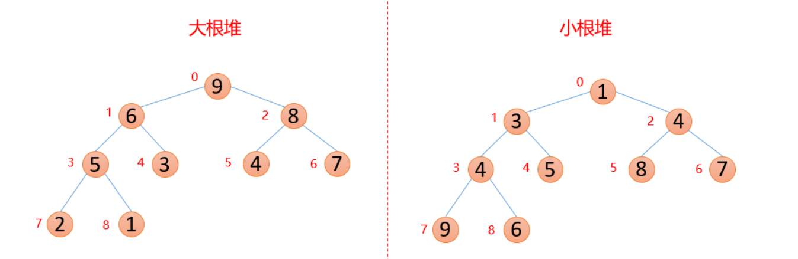
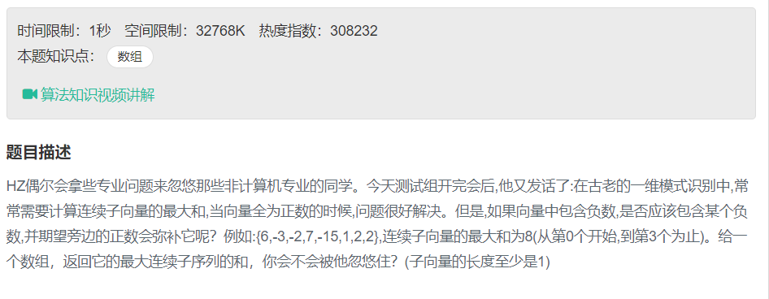

# 排序

## 冒泡

依然假设我们待排序的关键字序列是{9,1,5,8,3,7,4,6,2}，当i=1时，变量j由8反向循环到1，逐个比较，将较小值交换前面，直到最后找到最小值放置在了第1的位置。

如图9-5-3，当i=1，j=8时，我们发现6>2，因此交换了它们的位置，j=7时，4>2，所以交换……直到j=2时，因为1<2，所在不交换。j=1时，9>1，交换，最终得到最小值1放置第一的位置。

事实上，在不断循环的过程中，除了将关键字1放到第一的位置，我们还将关键字2从第九位置提到到了第三的位置，显然这一算法比前面的要有进步，在上十万条数据的排序过程中，这种差异会体现出来。

图中较小的数字如同气泡般慢慢浮到上面，因此就将此算法命名为冒泡算法。

 

当i=2时，变量j由8反向循环到2，逐个比较，在将关键字2交换到第二位置的同时，也将关键字4和3有所提升。

 

```
package com.lx.datastruct;

public class BubbleSort {

    public  static  int[] bubbleSort(int[] arr){

        //第一个循环是趟数，每次都是把一个最小的放在最前面，因此有n个数，就有n-1趟数
       //第二个循环是从余下的数据找一个最小的，从后往前循环。因为i能取0，所以j只能大于i。
        for(int i=0;i<arr.length-1;i++){
            for(int j=arr.length-1;j>i;j--){
                if(arr[j]< arr[j-1]){
                    int  tmp=arr[j];
                    arr[j]=arr[j-1];
                    arr[j-1]=tmp;
                }
            }
        }
        return arr;

    }

    public static void main(String[] args) {

        int[] arr = {9, 2, 5, 8, 3, 7, 4, 6, 1};

        int[] arrSort=bubbleSort(arr);

        for (int i=0;i<arrSort.length;i++){
            System.out.println(arrSort[i]+" ");
        }

    }
}

```

## 冒泡排序优化

这样的冒泡程序是否还可以优化呢？答案是肯定的。试想一下，如果我们待排序的序列是{2,1,3,4,5,6,7,8,9}，也就是说，除了第一和第二的关键字需要交换外，别的都已经是正常的顺序。当i=1时，交换了2和1，此时序列已经有序，但是算法仍然不依不饶的将i=2到9，以及每个循环中的j循环都执行了一遍，尽管并没有交换数据，但是之后的大量比较还是大大的多余了。

 

```
package com.lx.datastruct;

public class OpBubbleSort {

    public  static  int[] opBubbleSort(int[] arr){

        //第一个循环是趟数，每次都是把一个最小的放在最前面，因此有n个数，就有n-1趟数
        //第二个循环是从余下的数据找一个最小的，从后往前循环。因为i能取0，所以j只能大于i。

        boolean flag=true;

        for(int i=0;(i<arr.length-1)&&flag;i++){

            flag=false;
            for(int j=arr.length-1;j>i;j--){

                if(arr[j]< arr[j-1]){
                    int  tmp=arr[j];
                    arr[j]=arr[j-1];
                    arr[j-1]=tmp;
                    flag=true;

                }
            }
        }
        return arr;

    }

    public static void main(String[] args) {

        int[] arr = {2,1,3,4,5,6,7,8,9};

        int[] arrSort=opBubbleSort(arr);

        for (int i=0;i<arrSort.length;i++){
            System.out.print(arrSort[i]+" ");
        }

    }
}
```
# 栈

## 栈的压入和弹出序列


解题思路：

```
借用一个辅助的栈，遍历压栈顺序，先讲第一个放入栈中，这里是1，然后判断栈顶元素是不是出栈顺序的第一个元素，这里是4，很显然1≠4，所以我们继续压栈，直到相等以后开始出栈，出栈一个元素，则将出栈顺序向后移动一位，直到不相等，这样循环等压栈顺序遍历完成，如果辅助栈还不为空，说明弹出序列不是该栈的弹出顺序。

举例：

入栈1,2,3,4,5

出栈4,5,3,2,1

首先1入辅助栈，此时栈顶1≠4，继续入栈2

此时栈顶2≠4，继续入栈3

此时栈顶3≠4，继续入栈4

此时栈顶4＝4，出栈4，弹出序列向后一位，此时为5，,辅助栈里面是1,2,3

此时栈顶3≠5，继续入栈5

此时栈顶5=5，出栈5,弹出序列向后一位，此时为3，,辅助栈里面是1,2,3

….

依次执行，最后辅助栈为空。如果不为空说明弹出序列不是该栈的弹出顺序。
```

代码：

```
package com.lx.code;


import java.util.Stack;

public class PushAndPopSeq {

    public static  boolean IsPopOrder(int [] pushA,int [] popA) {

        System.out.println(pushA.length);

        Stack<Integer> pStack = new Stack<Integer>();

        pStack.push(pushA[0]);

        int i=1,j=0;

        while (j!=popA.length){

           if(pStack.peek()==popA[j]){
               j++;
               int x=pStack.pop();

               System.out.println("x: "+x);
           }else {
               if(i==pushA.length) break;
               pStack.push(pushA[i]);
               i++;
           }

        }

        if(pStack.isEmpty()){
            return  true;
        }else {
            return false;
        }

    }

    public static void main(String[] args) {

        int[] pushA = new int[]{1,2,3,4,5};
        int[] popA = new int[]{4,3,5,1,2};

//        int[] popA = new int[]{4,5,3,2,1};

        boolean r = IsPopOrder(pushA, popA);

        System.out.println("结果为："+r);


    }
}

```

# 树

## 二叉树的定义

二叉树是每个节点最多有两个子树（不存在度大于2的结点）的树结构。二叉树的子树有左右之分，次序不能颠倒。它有5种基本形态：二叉树可以是空集；根可以有空的左子树或右子树；或者左右子树皆为空。


## 二叉树的性质

### 性质一


### 性质二


### 性质三


### 性质四


### 性质五

 

## 满二叉树与完全二叉树

**满二叉树：**在一个二叉树中，如果所有分支节点都有左孩子节点和右孩子节点，并且叶子节点都集中在二叉树的最下面一层，这样的二叉树称为满二叉树。

**完全二叉树：**若二叉树中最多只有最下面两层的节点度数小于2，并且最下面一层的叶子节点都依次排列在该层最左边的位置上，则这样的二叉树称为完全二叉树。


## 二叉树的遍历

### 前序遍历

若二叉树为空，则返回空，否则：先访问根结点，先序遍历左子树，先序遍历右子树。


```
package com.lx.datastruct;


import java.util.Stack;

public class PreOrder {

    public static class TreeNode {
        int val = 0;
        TreeNode left = null;
        TreeNode right = null;

        public TreeNode(int val) {
            this.val = val;

        }

    }

    public static void  preOrder(TreeNode root){

        if(root==null) return;

        System.out.println("递归遍历："+ root.val);

        preOrder(root.left);
        preOrder(root.right);
    }

    public  static  void  preOrder1(TreeNode root){

        if(root==null) return;

        Stack<TreeNode> stackNodes = new Stack<TreeNode>();
        stackNodes.push(root);
        TreeNode topNode=null;

        while (!stackNodes.isEmpty()){

            topNode=stackNodes.pop();
            System.out.println("非递归："+ topNode.val);

            if(topNode.right!=null)   stackNodes.push(topNode.right);
            
            if(topNode.left!=null)   stackNodes.push(topNode.left);

        }
        
    }

    public static void main(String[] args) {

        TreeNode root = new TreeNode(10);
        TreeNode node1 = new TreeNode(6);
        TreeNode node2 = new TreeNode(14);

        root.left=node1;
        root.right=node2;

        TreeNode node3 = new TreeNode(4);
        TreeNode node4 = new TreeNode(8);

        node1.left=node3;
        node1.right=node4;

        TreeNode node5= new TreeNode(12);
        TreeNode node6 = new TreeNode(16);

        node2.left=node5;
        node2.right=node6;
        //递归遍历
        preOrder(root);
        //非递归遍历
        preOrder1(root);


    }

}
```

### 中序遍历

若树为空，则返回空，否则：中序遍历左子树，访问根结点，中序遍历右子树。


```
package com.lx.datastruct;

import java.util.Stack;

public class InOrder {

    public static class TreeNode {
        int val = 0;
        TreeNode left = null;
        TreeNode right = null;

        public TreeNode(int val) {
            this.val = val;
        }
    }

    public  static  void  inOrder(TreeNode root){

        if(root==null) return;

        inOrder(root.left);
        System.out.println("递归中序遍历： "+ root.val);
        inOrder(root.right);

    }

    public static void inOrder1(TreeNode root){

        if(root ==null) return;

        Stack<TreeNode> stackNodes = new Stack<TreeNode>();
        TreeNode topNode=root;

        while (!stackNodes.isEmpty()||topNode!=null){

            while (topNode!=null){
                stackNodes.push(topNode);
                topNode=topNode.left;
            }

            topNode=stackNodes.pop();
            System.out.println("非递归中序遍历："+ topNode.val);

            topNode=topNode.right;

        }

    }

    public static void main(String[] args) {

        TreeNode root = new  TreeNode(10);
        TreeNode node1 = new TreeNode(6);
        TreeNode node2 = new TreeNode(14);

        root.left=node1;
        root.right=node2;

        TreeNode node3 = new  TreeNode(4);
        TreeNode node4 = new  TreeNode(8);

        node1.left=node3;
        node1.right=node4;

        TreeNode node5= new  TreeNode(12);
        TreeNode node6 = new TreeNode(16);

        node2.left=node5;
        node2.right=node6;


       inOrder(root);
       inOrder1(root);

    }

}
```

### 后序遍历

若树为空，则返回空，否则：后序遍历左子树，后序遍历右子树，访问根结点。


```
package com.lx.datastruct;

import java.util.Stack;

public class PostOrder {

    public static class TreeNode {
        int val = 0;
        TreeNode left = null;
        TreeNode right = null;

        public TreeNode(int val) {
            this.val = val;
        }
    }

    public  static void  postOrder(TreeNode root){

        if(root==null) return;

        postOrder(root.left);
        postOrder(root.right);

        System.out.println("递归后序遍历："+ root.val);
    }

    public  static  void  postOrder1(TreeNode root){
        if(root==null) return;

        TreeNode topNode=root;

        Stack<TreeNode> stackNodes = new Stack<TreeNode>();

        do{

            while (topNode!=null){

                stackNodes.push(topNode);
                topNode=topNode.left;
            }

            int flag=1;
            TreeNode p=null;
            while (!stackNodes.isEmpty()&&(flag==1)){

                topNode=stackNodes.pop();
                if(topNode.right==p){

                    System.out.println("非递归后序遍历："+ topNode.val);
                    p=topNode;

                }else {

                    stackNodes.push(topNode);
                    topNode=topNode.right;
                    flag=0;
                }
            }

        }while (!stackNodes.isEmpty());

    }

    public static void main(String[] args) {

        TreeNode root = new  TreeNode(10);
        TreeNode node1 = new TreeNode(6);
        TreeNode node2 = new TreeNode(14);

        root.left=node1;
        root.right=node2;

        TreeNode node3 = new  TreeNode(4);
        TreeNode node4 = new  TreeNode(8);

        node1.left=node3;
        node1.right=node4;

        TreeNode node5= new TreeNode(12);
        TreeNode node6 = new TreeNode(16);

        node2.left=node5;
        node2.right=node6;

        postOrder(root);

        System.out.println("-------------------------");
        postOrder1(root);
    }

}
```

## 二叉排序树

### 性质

二叉排序树，或者是一棵空树，或者是具有下列性质的二叉树：

```
1.若它的左子树不空，则左子树上所有结点的值均小于它的根结点的值；

2.若它的右子树不空，则右子树上所有结点的值均大于它的根结点的值；

3.它的左、右子树也分别为二叉排序树。 
```

二叉排序树通常采用二叉链表作为存储结构。中序遍历二叉排序树可得到一个依据关键字的有序序列，一个无序序列可以通过构造一棵二叉排序树变成一个有序序列，构造树的过程即是对无序序列进行排序的过程。每次插入的新的结点都是二叉排序树上新的叶子结点，在进行插入操作时，不必移动其它结点，只需改动某个结点的指针，由空变为非空即可。

### 二叉排序树的插入操作

```
1.如果二叉排序树T为空，则创建一个关键字为k的结点，将其作为根结点。

2.否则将k和根结点的关键字进行比较，如果相等则返回，如果k小于根结点的关键字则插入根结点的左子树中，否则插入根结点的右子树中。
```

### 二叉排序树的删除操作

**二叉排序树的删除分为三种情况：**

当前删除的节点为叶子节点，也就是没有孩子节点，此时可以直接删除，将当前删除节点的父节点对应的孩子指向空即可。


当前删除的节点仅含左子树或者右子树，这种情况下也是直接删除该节点即可，只不过是将当前删除的父节点对应的孩子指向删除节点对应的孩子节点即可。

 

当前删除的节点的左右子树都存在，找到需要删除的结点p的直接前驱（或直接后继）s，用s来替换结点p，然后再删除此结点s。


### 二叉排序树的查找操作

```
首先将需要查找的值与根结点比较，如果相等则查找成功，算法终止；如果比根结点小则左子树中查找，如果比根结点大则到右子树查找。
```

## 从上往下打印二叉树


解题思路：

代码：

```
package com.lx.code;
import java.util.ArrayList;
import java.util.LinkedList;
import java.util.Queue;

public class PrintBinTreeTopDown {

    public static class TreeNode {
        int val = 0;
        TreeNode left = null;
        TreeNode right = null;

        public  TreeNode(int val) {
            this.val = val;
        }
    }

    public  static  ArrayList<Integer>  PrintFromTopToBottom(TreeNode root) {

        ArrayList<Integer> re = new ArrayList<Integer>();

        if(root==null) return re;

        Queue<TreeNode> nodes = new LinkedList<TreeNode>();

        nodes.add(root);

        while (!nodes.isEmpty()){

            if (nodes.peek().left!=null)  nodes.add(nodes.peek().left);
            if (nodes.peek().right!=null)  nodes.add(nodes.peek().right);
            System.out.print(nodes.peek().val);
            re.add(nodes.peek().val);
            nodes.poll();
        }

        return re;

    }

    public static void main(String[] args) {
        TreeNode root = new TreeNode(8);
        TreeNode node1 = new TreeNode(6);
        TreeNode node2 = new TreeNode(10);
        root.left=node1;
        root.right=node2;

        TreeNode node3 = new TreeNode(5);
        TreeNode node4 = new TreeNode(7);
        node1.left=node3;
        node1.right=node4;
        node3.left=null;
        node3.right=null;
        node4.left=null;
        node4.right=null;

        TreeNode node5 = new TreeNode(9);
        TreeNode node6 = new TreeNode(11);
        node2.left=node5;
        node2.right=node6;
        node5.left=null;
        node5.right=null;
        node6.left=null;
        node6.right=null;

        PrintFromTopToBottom(root);
        
    }
}
```

## 二叉搜索树的后序遍历序列


解题思路：

```
二叉搜索树的后序序列的合法序列是，对于一个序列S，最后一个元素是x （也就是根），如果去掉最后一个元素的序列为T，那么T满足：T可以分成两段，前一段（左子树）小于x，后一段（右子树）大于x，且这两段（子树）都是合法的后序序列。完美的递归定义。
```

代码：

```
package com.lx.code;

import java.util.*;

public class SquenceOfBST {
    public static boolean VerifySquenceOfBST(int [] sequence) {

        if (sequence.length==0) return false;
        if(sequence.length==1) return true;

        ArrayList<Integer> arrList = new ArrayList<Integer>();

        for(int i=0;i<sequence.length;i++){
            arrList.add(sequence[i]);
        }

        int root=arrList.get(arrList.size()-1);

        System.out.print("root: "+root+" ");

        int j=0;

        for(int i=0;i<arrList.size()-1;i++){

            if(arrList.get(i)>root){
                break;
            }
            j=i;
        }

        System.out.println("j: "+ j);


        //左闭，右开
        List<Integer> aList = arrList.subList(0, j + 1);
        List<Integer> bList = arrList.subList(j + 1, arrList.size() - 1);

        for(int i=0;i<bList.size();i++){
            if(bList.get(i)<root){
                return  false;
            }
        }

        int[] aInt = aList.stream().mapToInt(Integer::valueOf).toArray();
        int[] bInt = bList.stream().mapToInt(Integer::valueOf).toArray();

        System.out.println("aList: "+aList.toString());
        System.out.println("bList: "+bList.toString());

        System.out.println("aInt.length: "+aInt.length);
        System.out.println("bInt.length: "+bInt.length);

        boolean aFlag=true,bFlag=true;

        if(aInt.length>0) aFlag=VerifySquenceOfBST(aInt);

        if(bInt.length>0) bFlag=VerifySquenceOfBST(bInt);

        return  aFlag&&bFlag;

    }

    public static void main(String[] args) {
//        int[] sequence = {5, 7, 6, 9, 11, 10, 8};
//        int[] sequence = {7, 4, 5, 8};

        int[] sequence={4,6,7,5};

        boolean re=VerifySquenceOfBST(sequence);

        System.out.println("re: "+re);

    }
}
```

## 二叉树中和为某一值的路径


解题思路：

    递归先序遍历树， 把结点加入路径。
    若该结点是叶子结点则比较当前路径和是否等于期待和。
    弹出结点，每一轮递归返回到父结点时，当前路径也应该回退一个结点
代码：

```
package com.lx.code;

import java.util.*;

public class AllPath {

    public static class TreeNode {
        int val = 0;
        TreeNode left = null;
        TreeNode right = null;

        public TreeNode(int val) {
            this.val = val;

        }
    }

    public static ArrayList<ArrayList<Integer>> res = new ArrayList<>();
    public static ArrayList<Integer> path = new ArrayList<>();

    public static ArrayList<ArrayList<Integer>> FindPath(TreeNode root,int target) {
        if(root==null){
            return res;
        }

        findPath(root,target);

     return res;
    }

    public static void findPath(TreeNode root, int target) {

        path.add(root.val);

        if(((target-root.val)==0)&&(root.right==null)&&(root.left==null)){
           res.add(new ArrayList(path));
        }

        //遍历左子树
        if(root.left!=null){
            findPath(root.left,target-root.val);
        }

        //遍历右子树
        if(root.right!=null){
            findPath(root.right,target-root.val);
        }

        path.remove(path.size()-1);

        return;

    }

    public static void main(String[] args) {
        TreeNode root = new TreeNode(10);
        TreeNode node1 = new TreeNode(5);
        TreeNode node2 = new TreeNode(12);
        
        root.left=node1;
        root.right=node2;

        TreeNode node3 = new TreeNode(4);
        TreeNode node4 = new TreeNode(7);
        
        node1.left=node3;
        node1.right=node4;
        node2.left=null;
        node2.right=null;
        node3.left=null;
        node3.right=null;
        node4.left=null;
        node4.right=null;

        ArrayList<ArrayList<Integer>> re = FindPath(root, 15);

        System.out.println(re.toString());
    }
}
```

## 二叉搜索树与双向链表


解题思路：

```
1.核心是中序遍历的非递归算法。

2.修改当前遍历节点与前一遍历节点的指针指向。
```

代码：

```
package com.lx.code;

import com.sun.jmx.remote.internal.ArrayQueue;

import java.util.*;

public class BinAndList {
    public static class TreeNode {
        int val = 0;
        TreeNode left = null;
        TreeNode right = null;

        public TreeNode(int val) {
            this.val = val;

        }

    }

    public static TreeNode Convert(TreeNode pRootOfTree) {

        if(pRootOfTree==null) return null;

        Stack<TreeNode> stackNodes = new Stack<>();
        Queue<TreeNode> queueNodes = new LinkedList<TreeNode>();

        TreeNode pHead=null;
        TreeNode pTail=null;
        TreeNode preNode=null;
        boolean isFirst=true;

        TreeNode topNode = pRootOfTree;

        while (!stackNodes.isEmpty()||topNode!=null){

            while (topNode!=null){

                stackNodes.push(topNode);
                topNode=topNode.left;

            }

            topNode=stackNodes.pop();
            pTail=topNode;

//            System.out.println("w:  "+ topNode.val);

            if(isFirst){
                pHead=topNode;
                preNode=pHead;
                isFirst=false;
            }else {

                preNode.right=topNode;
                topNode.left=preNode;
                preNode=topNode;

            }

            topNode=topNode.right;
        }

        TreeNode p=pTail;
        while (p!=null){

            System.out.println("打印："+ p.val);
            p=p.left;
        }
        
        return  pHead;
    }

    public static void main(String[] args) {

        TreeNode root = new TreeNode(10);
        TreeNode node1 = new TreeNode(6);
        TreeNode node2 = new TreeNode(14);
        root.left=node1;
        root.right=node2;

        TreeNode node3 = new TreeNode(4);
        TreeNode node4 = new TreeNode(8);

        node1.left=node3;
        node1.right=node4;

        TreeNode node5= new TreeNode(12);
        TreeNode node6 = new TreeNode(16);

        node2.left=node5;
        node2.right=node6;

        TreeNode head=Convert(root);
    }
}
```

# 链表

## 复杂链表的复制


解题思路：

把复制的结点链接在原始链表的每一对应结点后面 


把复制的结点的random指针指向被复制结点的random指针的下一个结点


拆分成两个链表，奇数位置为原链表，偶数位置为复制链表，注意复制链表的最后一个结点的next指针不能跟原链表指向同一个空结点None，next指针要重新赋值None(判定程序会认定你没有完成复制）


```
/*
public class RandomListNode {
    int label;
    RandomListNode next = null;
    RandomListNode random = null;
 
    RandomListNode(int label) {
        this.label = label;
    }
}
*/
public class Solution {
     
 
    public static RandomListNode Clone(RandomListNode pHead)
    {
        if(pHead==null) return null;
 
        RandomListNode p = pHead;
 
//        1.复制链表
        while (p!=null){
 
            RandomListNode tempNode=new RandomListNode(p.label);
            tempNode.random=null;
            tempNode.next=p.next;
            p.next=tempNode;
            p=tempNode.next;
 
        }
 
//        2.改变random的指向
        p=pHead;
        while (p!=null){
 
            if(p.random!=null){
                p.next.random=p.random.next;
            }
 
//            System.out.println(q.label);
            p=p.next.next;
        }
 
//      3.拆分链表
        p=pHead;
        RandomListNode pConeHead = pHead.next;
        while (p!=null){
 
            RandomListNode coneNode = p.next;
 
            p.next=coneNode.next;
 
            if(coneNode.next!=null){
                coneNode.next=coneNode.next.next;
            }
 
            p=p.next;
 
        }
        
        return pConeHead;
 
 
    }
}
```

# 堆

堆是一颗完全二叉树，根据堆的结构可以分为大根堆和小根堆。每个结点的值都大于或等于其左孩子和右孩子结点的值，称之为大根堆；每个结点的值都小于或等于其左孩子和右孩子结点的值，称之为小根堆。



我们对上面图中每个数都进行了标记，所以可以将上面的树形结构映射成数组。


查找数组中某个数的父结点和左右孩子结点，比如已知索引为i的数，那么：

```
父结点索引：(i-1)/2

左孩子索引：2*i+1

右孩子索引：2*i+2
```

所以上面两个数组可以脑补成堆结构，因为他们满足堆的定义性质：

```
大根堆：arr(i)>=arr(2*i+1) && arr(i)>=arr(2*i+2)

小根堆：arr(i)=<arr(2*i+1) && arr(i)=<arr(2*i+2)
```

## 堆排序基本步骤

第一步：首先将待排序的数组构造成一个大根堆，此时，整个数组的最大值就是堆结构的顶端；

第二步：将顶端的数与末尾的数交换，此时，末尾的数为最大值，剩余待排序数组个数为n-1；

第三步：将剩余的n-1个数再构造成大根堆，再将顶端数与n-1位置的数交换，如此反复执行，便能得到有序数组。

## 构造堆

将无序数组构造成一个大根堆（升序用大根堆，降序就用小根堆）。假设存在以下数组：


主要思路是第一次保证0~0位置大根堆结构，第二次保证0~1位置大根堆结构，第三次保证0~2位置大根堆结构...直到保证0~n-1位置大根堆结构。

插入6的时候，6大于它的父结点3，即arr(1)>arr(0)，就交换；此时，保证了0~1位置是大根堆结构，如下图：


插入8的时候，8大于其父结点6，即arr(2)>arr(0)，则交换；此时，保证了0~2位置是大根堆结构，如下图：


插入5的时候，5大于其父结点3，则交换；交换之后，5又发现比8小，所以不交换；此时，保证了0~3位置大根堆结构，如下图：


插入7的时候，7大于其父结点5，则交换；交换之后，7又发现比8小，所以不交换；此时整个数组已经是大根堆结构，如下图：


## 固定最大值再构造堆

此时，我们已经得到一个大根堆，下面将顶端的数与最后一位数交换，然后将剩余的数再构造成一个大根堆。


此时最大数8已经来到末尾，则固定不动，后面只需要对顶端的数据进行操作即可，拿顶端的数与其左右孩子较大的数进行比较，如果顶端的数大于其左右孩子较大的数，则停止，如果顶端的数小于其左右孩子较大的数，则交换，然后继续与下面的孩子进行比较。

下图中，5的左右孩子中，左孩子7比右孩子6大，则5与7进行比较，发现5<7，则交换；交换后，发现5已经大于他的左孩子，说明剩余的数已经构成大根堆，后面就是重复固定最大值，然后构造大根堆。


如下图：顶端数7与末尾数3进行交换，固定好7。


剩余的数开始构造大根堆 ，然后顶端数与末尾数交换，固定最大值再构造大根堆，重复执行上面的操作，最终会得到有序数组。


## 堆排序代码

```
package com.lx.datastruct;

import java.util.Arrays;

public class HeapSort {

    //堆排序
    public static void heapSort(int[] arr) {
        //构造大根堆
        heapInsert(arr);
        int size = arr.length;
        while (size > 1) {
            //固定最大值
            swap(arr, 0, size - 1);
            size--;
            //构造大根堆
            heapify(arr, 0, size);

        }

    }

    //构造大根堆（通过新插入的数上升）
    public static void heapInsert(int[] arr) {
        for (int i = 0; i < arr.length; i++) {
            //当前插入的索引
            int currentIndex = i;
            //父结点索引
            int fatherIndex = (currentIndex - 1) / 2;
            //如果当前插入的值大于其父结点的值,则交换值，并且将索引指向父结点
            //然后继续和上面的父结点值比较，直到不大于父结点，则退出循环
            while (arr[currentIndex] > arr[fatherIndex]) {
                //交换当前结点与父结点的值
                swap(arr, currentIndex, fatherIndex);
                //将当前索引指向父索引
                currentIndex = fatherIndex;
                //重新计算当前索引的父索引
                fatherIndex = (currentIndex - 1) / 2;
            }
        }
    }
    //将剩余的数构造成大根堆（通过顶端的数下降）
    public static void heapify(int[] arr, int index, int size) {
        int left = 2 * index + 1;
        int right = 2 * index + 2;
        while (left < size) {
            int largestIndex;
            //判断孩子中较大的值的索引（要确保右孩子在size范围之内）
            if (arr[left] < arr[right] && right < size) {
                largestIndex = right;
            } else {
                largestIndex = left;
            }
            //比较父结点的值与孩子中较大的值，并确定最大值的索引
            if (arr[index] > arr[largestIndex]) {
                largestIndex = index;
            }
            //如果父结点索引是最大值的索引，那已经是大根堆了，则退出循环
            if (index == largestIndex) {
                break;
            }
            //父结点不是最大值，与孩子中较大的值交换
            swap(arr, largestIndex, index);
            //将索引指向孩子中较大的值的索引
            index = largestIndex;
            //重新计算交换之后的孩子的索引
            left = 2 * index + 1;
            right = 2 * index + 2;
        }

    }
    //交换数组中两个元素的值
    public static void swap(int[] arr, int i, int j) {
        int temp = arr[i];
        arr[i] = arr[j];
        arr[j] = temp;
    }

    public static void main(String[] args) {

        int[] arr = {8,100, 9, 7, 4, 5, 6};

        heapSort(arr);

        System.out.println(Arrays.toString(arr));

    }

}
```
## 最小堆的元素插入

向最小堆插入数字0， 数字0的节点首先加入到该二叉树最后的一个节点，依据最小堆的定义，自底向上，递归调整。以下是插入操作的图解：


## 最小堆的节点删除

对于最小堆和最大堆而言，删除是针对于根节点而言。对于删除操作，将二叉树的最后一个节点替换到根节点，然后自顶向下，递归调整。以下是图解：


# 字符串全排序

## 字符串排序


解题思路：


代码如下 ：

```
package com.lx.code;

import java.util.*;

public class StrAllSort {

    public static  ArrayList<String> Permutation(String str) {

        ArrayList<String> res = new ArrayList<String>();

        if(str.length()==1) {
            res.add(str);
            return res;
        }

        TreeSet<String> set = new TreeSet<>();

        char[] chars = new char[str.length()];

        for(int i=0;i<str.length();i++){

            char c = str.charAt(i);
            chars[i]=c;
        }


       permutationHelper(chars,0,chars.length,set);

        Iterator<String> it = set.iterator();

        while (it.hasNext()){

//            System.out.println("set: "+ it.next());

            res.add(it.next());
        }

        return res;

    }


   public static void permutationHelper(char[] chars,int begin,int end,TreeSet<String> set){

        if(begin==end-1) {

            System.out.println(Arrays.toString(chars));
            StringBuilder sb = new StringBuilder();

            for(int i=0;i<chars.length;i++){
                sb.append(chars[i]);
            }

            set.add(new String(sb));

            return;
        }

        for(int i=begin;i<end;i++){
            swap(chars,begin,i);

            permutationHelper(chars,begin+1,end,set);

            swap(chars,begin,i);

        }

   }

    public static void swap(char[] chars,int i,int j){

        char temp=chars[i];
        chars[i]=chars[j];
        chars[j]=temp;
    }

    public static void main(String[] args) {

        Scanner sc = new Scanner(System.in);

        String str = sc.next();

        Permutation(str);

        System.out.println();
    }
}
```
# 动态规划

## 连续子数组的最大和



解题思路：

```
F（i）：以array[i]为末尾元素的子数组的和的最大值，子数组的元素的相对位置不变
F（i）=max（F（i-1）+array[i] ， array[i]）
res：所有子数组的和的最大值
res=max（res，F（i））

如数组[6, -3, -2, 7, -15, 1, 2, 2]

初始状态：
    F（0）=6
    res=6
i=1：
    F（1）=max（F（0）-3，-3）=max（6-3，3）=3
    res=max（F（1），res）=max（3，6）=6
i=2：
    F（2）=max（F（1）-2，-2）=max（3-2，-2）=1
    res=max（F（2），res）=max（1，6）=6
i=3：
    F（3）=max（F（2）+7，7）=max（1+7，7）=8
    res=max（F（2），res）=max（8，6）=8
i=4：
    F（4）=max（F（3）-15，-15）=max（8-15，-15）=-7
    res=max（F（4），res）=max（-7，8）=8
    .
    .
    .
以此类推，最终res的值为8
```

代码：

```
package com.lx.code;

import java.util.Arrays;

public class FindGreatestSum {

    public static int FindGreatestSumOfSubArray(int[] array) {

        int[] seq = new int[array.length];

        for(int i=0;i<array.length;i++){

            if(i==0){
                seq[i]=array[i];
            }else {
                seq[i]=Math.max(array[i],array[i]+seq[i-1]);
            }
        }

        int max=array[0];

        for(int i=0;i<seq.length;i++){

            if(max<seq[i]){
                max=seq[i];

            }
        }

        System.out.println("max:"+ max);

        return max;
    }

    public static void main(String[] args) {

//      int[] array = {6, -3, -2, 7, -15, 1, 2, 2};

        int[] array = {-2,-8,-1,-5,-9};

        int result = FindGreatestSumOfSubArray(array);
    }
}
```
