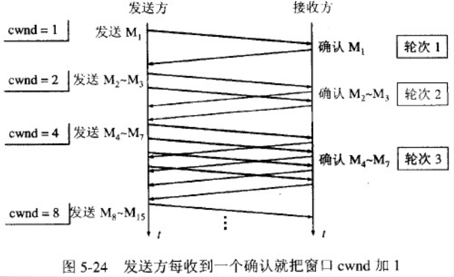
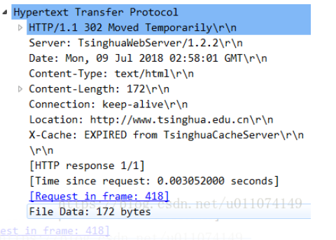

[TOC]

# 概述

## 计算机体系结构


## OSI七层模型


## OSI模型与TCP模型的对应关系


# 数据链路层

## 以太网帧格式


# 网络层

## ARP地址解析协议

**1.IP地址与MAC地址**

要理解ARP协议的工作原理必须先理解IP地址和MAC地址的区别，MAC地址是数据链路层和物理层使用的地址，而IP地址是网络层及以上各层使用的地址，是一种逻辑地址（IP地址使用软件实现的）如下图：


在发送数据时，数据从高层到低层，然后才到通信链路上传输。使用IP地址的IP数据报一旦交给了数据链路层，就被封装成了MAC帧。MAC帧在传送时使用的源地址和目的地址都是硬件地址。连接在通信链路上的设备（主机或路由器）在接收MAC帧时，根据是MAC帧首部的硬件地址。在数据链路层看不到隐藏在MAC帧中的IP地址。只有在剥去MAC帧的首部和尾部后把MAC层的数据交给网络层后，网络层才能在IP数据报的首部中找到源IP地址和目的IP地址。


**2.ARP协议**

地址解析协议（Address Resolution Protocol），其基本功能为透过目标设备的IP地址，查询目标设备的MAC地址，以保证通信的顺利进行。 


**3.ARP工作过程**


每一台主机都设有一个ARP高速缓存(ARP cache)，里面有本局域网上的各主机和路由器的IP地址到硬件地址的映射表，这些都是该主机目前知道的一些地址。当主机A要向本局域网上的某台主机B发送IP数据报时，就先在其ARP高速缓存中查看有无主机B的IP地址。如有，就在ARP高速缓存中查出其对应的硬件地址，再把这个硬件地址写入MAC帧，然后通过局域网把该MAC帧发往此硬件地址。也有可能查不到主机B的IP地址，那么就按ARP协议的步骤进行查找：

```
1.主机A自动运行ARP进程，并在本局域网上广播发送一个ARP请求分组，ARP请求分组的主要内容是：“我的IP地址是209.0.0.5， 硬件地址是00-00-C0-15-AD-18。 我想知道IP地址为209.0.0.6的主机的硬件地址”。

2.在本局域网上的所有主机上运行的ARP进程都收到此ARP请求分组。

3.主机B的IP地址与ARP请求分组中要查询的IP地址一致，就收下这个ARP请求分组，并向主机A发送ARP响应分组，同时在这个ARP响应分组中写入自己的硬件地址。由于其余的所有主机的IP地址都与ARP请求分组中要查询的IP地址不一致，因此都不理睬这个ARP请求分组。ARP响应分组的主要内容是:“我的IP地址是209.0.0.6，我的硬件地址是08-00-2B-00-EE-0A。”，虽然ARP请求分组是广播发送的，但ARP响应分组是普通的单播，即从一个源地址发送到一个目的地址。

4.主机A收到主机B的ARP响应分组后，就在其ARP高速缓存中写入主机B的IP地址到硬件地址的映射。
```

## IP数据报

**1.IP数据报的格式**


## 网际控制报文协议ICMP

**1.ICMP报文格式**


```
类型：一个8位类型字段，表示ICMP数据包类型。

代码：一个8位代码域，表示指定类型中的一个功能。如果一个类型中只有一种功能，代码域置为0。

检验和：数据包中ICMP部分上的一个16位检验和。
```

**2.ICMP报文的分类**


- **差错报文**


```
1.终点不可达：当路由器或主机不能交付数据报时就向源点发送终点不可达报文。

2.时间超过：当路由器收到生存时间为零的数据报时，除丢弃该数据报外，还要向源点发送时间超过报文。当终点在预先规定的时间内不能收到一个数据报的全部数据报片时，就把已收到的数据报片都丢弃，并向源点发送时间超过报文。

3.参数问题 ：当路由器或目的主机收到的数据报的首部中有的字段的值不正确时，就丢弃该数据报，并向源点发送参数问题报文。

4.改变路由(重定向) ：路由器把改变路由报文发送给主机，让主机知道下次应将数据报发送给另外的路由器(可通过更好的路由)。下面对改变路由报文进行简短的解释。我们知道，在互联网的主机中也要有一个路由表。当主机要发送数据报时，首先是查找主机自己的路由表，看应当从哪-一个接口把数据报发送出去。在互联网中主机的数量远大于路由器的数量，出于效率的考虑，这些主机不和连接在网络上的路由器定期交换路由信息。在主机刚开始工作时，一般都在路由表中设置一个默认路由器的IP地址。不管数据报要发送到哪个目的地址，都一律先把数据报传送给这个默认路由器，而这个默认路由器知道到每一个目的网络的最佳路由(通过和其他路由器交换路由信息)。如果默认路由器发现主机发往某个目的地址的数据报的最佳路由应当经过网络上的另一个路由器R时，就用改变路由报文把这情况告诉主机。于是，该主机就在其路由表中增加一个项目:到某某目的地址应经过路由器R (而不是默认路由器)。
```

-  **询问报文**

    1.回送请求和回答：ICMP回送请求报文是由主机或路由器向一个特定的目的主机发出的询问。收到此报文的主机必须给源主机或路由器发送ICMP回送回答报文。这种询问报文用来测试目的站是否可达以及了解其有关状态。
    
    2.时间戳请求和回答：ICMP时间戳请求报文是请某台主机或路由器回答当前的日期和时间。在ICMP时间戳回答报文中有一个32位的字段，其中写入的整数代表从1900年1月1日起到当前时刻一共有多少秒。时间戳请求与回答可用于时钟同步和时间测量。
**3.Ping命令（分组网间探测）**

Ping命令用来测试主机之间网络的连通性，它相当于一个应用程序，属于应用层。执行ping指令会使用ICMP传输协议，发出要求回应的信息，若远端主机的网络功能没有问题，就会回应该信息，因而得知该主机运作正常。

## 路由算法

**1.RIP路由信息协议**

RIP是一种分布式的基于距离向量的路由选择协议

**2.工作原理**

    路由器收到相邻路由器（其地址为 X）的一个 RIP 报文：
    
    1.先修改此 RIP 报文中的所有项目：把“下一跳”字段中的地址都改为X，并把所有的“距离”字段的值加 1。每一个项目都有三个关键数据，即到目的网络N，距离是d,下一跳路由是X。
    
    对修改后的 RIP 报文中的每一个项目，重复以下步骤：
    2.若原来的路由表没有目的网络N，则把该项目加到路由表中。否则
    
    3.若下一跳路由器地址是X，则把收到的项目替换原路由表中的项目。否则
    
    4.若收到项目中的距离小于路由表中的距离，则进行更新。否则，什么也不做。
    
    5.若3分钟还没有收到相邻路由器的更新路由表，则把此相邻路由器记为不可达路由器，即将距离置为 16（表示不可达）。
    
    6.返回。


**3.RIP报文格式**


**4.OSPF开放最短路径优先协议**

OSPF是一种使用分布式的链路状态协议。

**5.OSPF的报文格式**


**6.五种数据包**


**7.OSPF的工作流程**

```
1.启动配置完成后，本地收发hello包，建立邻居关系，生成邻居表；

2.再进行条件的匹配，匹配失败将停留于邻居关系，仅hello包保活即可；

3.匹配成功者之间建立邻接关系，需要DBD共享数据库目录，LSR/LSU/LSack来获取未知的LSA信息，当收集完网络中所有的LSA后，生成数据表--LSDB

4.LSDB建立完成后，本地基于OSPF选路规则，计算本地到达所有未知网段的最短路径，然后将其加载到路由表中，完成收敛。

5.收敛完成后--hello包周期保活--30分钟周期的BDB比对，若不一致将会使用LSR/LSU/LSack重新获取
```


# 传输层

## TCP与UDP的区别

**1.什么是tcp?**

传输控制协议（TCP，Transmission Control Protocol）是一种面向连接的、可靠的、基于字节流的传输层通信协议 。

**2.tcp的特点**

- tcp是面向连接的运输层协议
- 支持端到端的通信。每个TCP连接只能有两个端点，而且只能一对一通信，不能一点对多点直接通信。
- 高可靠性。通过TCP连接传送的数据，能保证数据无差错、不丢失、不重复地准确到达接收方，并且保证各数据到达的顺序与其发出的顺序相同。
- 提供全双工通信，TCP允许通信双方的应用进程在任何时候都能发送数据。TCP连接的两端都设有发送缓存和接收缓存，用来临时存放双向通信的数据。在发送时，应用进程在把数据传送给TCP的发送缓存后，就可以做自己的事，而TCP在合适的时候把数据发送出去。在接收时，TCP把收到的数据放入缓存，上层的应用进程在合适的时候读取缓存中的数据。
- 面向字节流，数据以字节流的方式传输。

**3.什么是udp?**

用户数据报协议（User Datagram Protocol）是一种无连接的传输层协议。

**4.udp的特点**

- UDP是无连接的，即发送数据之前不需要建立连接，因此减少了开销和发送数据之前的时延。

- UDP使用尽最大努力交付，即不保证可靠交付，因此主机不需要维持复杂的连接状态表。

-  UDP是面向报文的，即UDP一次交付一个完整的报文。发送方的UDP对应用程序交下来的报文，在添加首部后就向下交付IP层。UDP对应用层交下来的报文，既不合并，也不拆分，而是保留这些报文的边界。因此，应用程序必须选择合适大小的报文。

   

- UDP没有拥塞控制，因此网络出现的拥塞不会使源主机的发送速率降低。很多的实时应用（如IP电话、实时视频会议等）要求源主机以恒定的速率发送数据，并且允许在网络发生拥塞时丢失一些数据，但却不允许数据有太多的时延。UDP正好符合这种要求。

- UDP支持一对一、一对多、多对一和多对多的交互通信。

- UDP的首部开销小，只有8个字节，比TCP的20个字节的首部要短。

**5.tcp与udp的区别**

- TCP面向连接（如打电话要先拨号建立连接）；UDP是无连接的，即发送数据之前不需要建立连接。
- TCP提供可靠的服务。也就是说，通过TCP连接传送的数据，无差错，不丢失，不重复，且按序到达；UDP尽最大努力交付，即不保证可靠交付。
- TCP面向字节流，实际上是TCP把数据看成一连串无结构的字节流；UDP是面向报文的。
-  UDP没有拥塞控制，因此网络出现拥塞不会使源主机的发送速率降低（对实时应用很有用，如IP电话，实时视频会议等）。
- 每一条TCP连接只能是点到点的；UDP支持一对一，一对多，多对一和多对多的交互通信。
- TCP首部开销20字节；UDP的首部开销小，只有8个字节。
- TCP的逻辑通信信道是全双工的可靠信道，UDP则是不可靠信道。

## TCP和UDP的首部

**1.tcp的首部**


- 源端口号和目的端口号：各占2个字节

- **序号：占4字节。序号范围是0~2^32-1。TCP是面向字节流的，TCP连接中传送的字节流中的每个字节都按顺序编号。整个要传送的字节流的起始序号必须要在连接建立时设置。首部中的序号字段值指的是本报文段所发送的数据的第一个字节的序号。**

- **确认号：4个字节，是期望收到对方下一个报文段的第一个数据字节的序号。 若确认号=N，则表明：到序号N-1为止的所有数据都已正确收到。**  

- 数据偏移：4位。指出TCP报文段的数据起始处距离报文段的起始处有多远。这个字段实际上是指出TCP报文段的首部长度。由于首部中还有长度不确定的选项字段，因此数据偏移字段是必要的。单位是32位字，也就是4字节，4位二进制最大表示15，所以数据偏移也就是TCP首部最大60字节。

- **保留：6位 。下面有6个控制位说明本报文段的性质 。**

- 紧急URG：1位 。当URG=1时，表明紧急指针字段有效。它告诉系统此报文段中有紧急数据，应尽快传送（相当于高优先级的数据），而不要按原来的排队顺序来传送。例如，已经发送了很长的一个程序在远地的主机上运行。但后来发现了一些问题，需要取消该程序的运行。因此用户从键盘发出中断命令（Control+c）。如果不使用紧急数据，那么这两个字符将存储在接收TCP的缓存末尾。只有在所有的数据被处理完毕后这两个字符才被交付接收方的应用进程。这样做就浪费了许多时间。 

  当URG置为1时，发送应用进程就告诉发送方的TCP有紧急数据要传送。于是发送方TCP就把紧急数据插入到本报文段数据的最前面，而在紧急数据后面的数据仍时普通数据。这时要与首部中紧急指针字段配合使用。

- **确认ACK ：仅当ACK=1时确认号字段才有效。当ACK=0时，确认号无效。TCP规定，在连接建立后所有的传送的报文段都必须把ACK置1。** 

- 推送PSH ：当两个应用进程进行交互式的通信时，有时在一端的应用进程希望在键入一个命令后立即就能收到对方的响应。在这种情况下，TCP就可以使用推送操作。这时，发送方TCP把PSH置1，并立即创建一个报文段发送出去。接收方TCP收到PSH=1的报文段，就尽快地交付接收应用进程，而不再等到整个缓存都填满了后向上交付。 

- 复位RST ： tcp连接出现严重差错时释放连接，然后重新建立连接。而可以用来拒绝一个非法的报文段或拒绝打开一个连接。 

  当RST=1时，表明TCP连接中出现严重差错（如由于主机崩溃或其他原因），必须释放连接，然后再重新建立运输连接。RST置1还用来拒绝一个非法的报文段或拒绝打开一个连接。 

- **同步SYN ：在连接建立时用来同步序号。**当SYN=1而ACK=0时，表明这是一个连接请求报文段。对方若同意建立连接，则应在相应的报文段中使用SYN=1和ACK=1。因此，**SYN置为1就表示这是一个连接请求或连接接受报文。** 

- **终止FIN ：用来释放一个连接。**当FIN=1时，表明此报文段的发送方的数据已发送完毕，并要求释放运输连接 

- 窗口：占2字节。窗口值是【0，2^16-1]之间的整数。窗口指的是发送本报文段的一方的接收窗口（而不是自己的发送窗口）。窗口值告诉对方：  从本报文段首部中的确认号算起，接收方目前允许对方发送的数据量。之所以要有这个限制，是因为接收方的数据缓存空间是有限的。总之，窗口值作为接收方让发送方设置其发送窗口的依据。并且窗口值是经常在动态变化着。 

- **检验和：2字节。检验范围包括首部和数据两部分。和UDP用户数据报一样，在计算校验和时，要在TCP报文段加上12字节的伪首部。** 

- 紧急指针：2字节。紧急指针仅在URG=1时才有意义，它指出本报文段中的紧急数据的字节数（紧急数据结束后就是普通数据）。因此，紧急指针指出了紧急数据的末尾在报文段中的位置。当所有紧急数据都处理完时，TCP就告诉应用程序恢复到正常操作。值得注意的是，即使窗口为零时也可发送紧急数据。 

- 选项：长度可变，最长可达40字节。当没有使用“选项”时，TCP的首部长度是20字节。  
   1）MSS 最大报文段长度  

   MSS最大报文段长度（数据字段的最大长度，默认是536字节）。MSS不宜设的太大也不宜设的太小。若选择太小，极端情况下，TCP报文段只含有1字节数据，在IP层传输的数据报的开销至少有40字节（包括TCP报文段的首部和IP数据报的首部）。这样，网络的利用率就不会超过1/41。若TCP报文段非常长，那么在IP层传输时就有可能要分解成多个短数据报片。在终点要把收到的各个短数据报片装配成原来的TCP报文段。当传输出错时还要进行重传，这些也都会使开销增大。

  因此MSS应尽可能大，只要在IP层传输时不需要再分片就行。在连接建立过程中，双方都把自己能够支持的MSS接入这一字段，以后就按照这个数值传送数据。  
   2）窗口扩大  

   窗口扩大选项是为了扩大窗口。TCP首部中窗口字段长度是16位，因此最大窗口大小就是64k字节。对于包含卫星信道的网络可能是不够用的。可以在双方初始建立TCP连接的时候就进行协商。  
   3）时间戳（计算RTT，防止序号绕回）  
   A. 用来计算往返时间RTT。发送方在发送报文段时把当前时钟的时间值放入时间戳字段，接收方在确认该报文段时把时间戳字段值复制到时间戳回送回答字段。因此，发送方在收到确认报文后，可以准确地计算RTT来。  
   4）选择确认选项 

  **2.udp**

  

## TCP可靠传输的实现

**1.校验和**


 **2.确认应答与序列号**

 

**3.超时重传**


**4.流量控制**


**5.拥塞控制**


**6.应用数据被分割成TCP认为最适合发送的数据块** 

**7.TCP的接收端会丢弃重复的数据**

## TCP滑动窗口

tcp滑动窗口的作用有两点：第一是提供TCP可靠性：对发送的数据进行确认，第二是流量控制：窗口大小随链路变化而变化。

**1.TCP窗口机制**

TCP中窗口大小是指tcp协议一次传输多少个数据。因为TCP是一个面向连接的可靠的传输协议，既然是可靠的就需要传输的数据进行确认。TCP窗口机制有两种，一种是固定窗口大小，另一种是滑动窗口。**数据在传输时，TCP会对所有数据进行编号，发送方在发送过程中始终保持着一个窗口，只有落在发送窗口内的数据帧才允许被发送；同时接收方也始终保持着一个接收窗口，只有落在窗口内的数据才会被接收。这样通过改变发送窗口和接收窗口的大小就可以实现流量控制。**

**2.TCP窗口大小**

TCP的窗口滑动技术通过动态改变窗口的大小来调节两台主机之间数据传输。每个TCP/IP主机支持全双工数据传输，因此TCP有两个滑动窗口，一个用于接收数据，一个用于发送数据。接收方设备要求窗口大小为0时，表明接收方已经接收了全部数据，或者接收方应用程序没有时间读取数据，要求暂停发送。

TCP在传送数据时，第一次接受方窗口大小是由链路带宽决定的，但是接收方在接收到的数据后，返回ack确认报文，同时也告诉了发送方自己的窗口大小，此时发送方第二次发送数据时，会改变自己的窗口大小和接收方一致。

​    当窗口过大时，会导致不必要的数据来拥塞我们的链路，但是窗口太小时，会造成很大的延时，比如为1时，发送方每发送一个数据，接收方就会返回一个ack报文，在发送方未接收到接收方的确认报文ack之前不会进行下一次发送。（当链路变好了或者变差了这个窗口还会发生变化，并不是第一次协商好了以后就永远不变了。）【这句话不太理解】

**3.窗口滑动协议**

 窗口滑动协议是TCP使用的一种流量控制方法。该协议允许发送方在停止并等待接收确认报文前可以连续发送多个分组。由于发送方不必每发一个分组就停下来等待确认，因此该协议可以加速数据的传输。只有在接收窗口向前滑动时（与此同时也发送了确认），发送窗口才有可能向前滑动。收发两端的窗口按照以上规律不断地向前滑动，因此这种协议又称为滑动窗口协议。

**1.以字节为单位的滑动窗口**


**2.退后N帧协议**

停等协议虽然实现简单，也能较好的适用恶劣的网络环境，但是显然效率太低。所以有了退后n帧协议，这也是滑动窗口协议真正的用处，这里发送的窗口大小为n，接受方的窗口仍然为1。这里假设n=9：首先发送方一口气发送10个数据帧，前面两个帧正确返回了，数据帧2出现了错误，这时发送方被迫重新发送2-8这7个帧，接受方也必须丢弃之前接受的3-8这几个帧。后退n协议的好处无疑是提高了效率，但是一旦网络情况糟糕，则会导致大量数据重发，反而不如上面的停等协议，实际上这是很常见的，具体可以参考TCP拥塞控制。


**3.选择重传协议**

**后退n协议的另外一个问题是，当有错误帧出现后，总是要重发该帧之后的所有帧，毫无疑问在网络不是很好的情况下会进一步恶化网络状况。**

选择重传协议便是用来解决这个问题。**原理也很简单，接收端总会缓存所有收到的帧，当某个帧出现错误时，只会要求重传这一个帧，只有当某个序号后的所有帧都正确收到后，才会一起提交给高层应用。**重传协议的缺点在于接受端需要更多的缓存。

## TCP超时与重传机制

TCP协议是一种面向连接的可靠的传输层协议，它保证了数据的可靠传输，对于一些出错，超时丢包等问题TCP设有的超时与重传机制。其基本原理：**在发送一个数据之后，就开启一个定时器，若是在这个时间内没有收到发送数据的ACK确认报文，则对该报文进行重传，在达到一定次数还没有成功时放弃并发送一个复位信号。** 

这里比较重要的是重传超时时间，怎样设置这个定时器的时间（RTO），从而保证对网络资源最小的浪费。因为若RTO太小，可能有些报文只是遇到拥堵或网络不好延迟较大而已，这样就会造成不必要的重传。太大的话，使发送端需要等待过长的时间才能发现数据丢失，影响网络传输效率。 

由于不同的网络情况不一样，不可能设置一样的RTO，实际中RTO是根据网络中的RTT（传输往返时间）来自适应调整的。

**1.四种定时器**

- **超时计时器**


​ 大家都知道TCP是保证数据可靠传输的。怎么保证呢？带确认的重传机制。在滑动窗口协议中，接受窗口会在连续收到的包序列中的最后一个包向接收端发送一个ACK，当网络拥堵的时候，发送端的数据包和接收端的ACK包都有可能丢失。TCP为了保证数据可靠传输，就规定在重传的“时间片”到了以后，如果还没有收到对方的ACK，就重发此包，以避免陷入无限等待中。

当TCP发送报文段时，就创建该特定报文的重传计时器。可能发生两种情况：

​     1.若在计时器截止时间到之前收到了对此特定报文段的确认，则撤销此计时器。

​     2.若在收到了对此特定报文段的确认之前计时器截止时间到，则重传此报文段，并将计时器复位。

- **持续计时器**


为了对付零窗口大小通知，TCP需要另一个计时器。假定接收TCP宣布了窗口大小为零，发送TCP就停止传送报文段，直到接收TCP发送确认并宣布一个非零的窗口大小。但这个确认可能会丢失。我们知道在TCP中，对确认是不需要发送确认的。若确认丢失了，接收TCP并不知道，而是会认为它已经完成任务了，并等待着发送TCP接着会发送更多的报文段。但发送TCP由于没有收到确认，就等待对方发送确认来通知窗口的大小。双方的TCP都在永远地等待着对方。 

要打开这种死锁，TCP为每一个连接使用一个坚持计时器。 当发送TCP收到一个窗口大小为零的确认时，就启动坚持计时器 。 当坚持计时器期限到时，发送TCP就发送一个特殊的报文段， 叫做探测报文段 。这个报文段只有一个字节的数据。它有一个序号，但它的序号永远不需要确认，甚至在计算对其他部分的数据的确认时该序号也被忽略。探测报文段提醒对端：确认已丢失，必须重传。 

坚持计时器的值设置为重传时间的数值。但是，若没有收到从接收端来的响应，则需发送另一个探测报文段，并将坚持计时器的值加倍和复位。发送端继续发送探测报文段，将坚持计时器设定的值加倍和复位，直到这个值增大到门限值（ 通常是60秒 ）为止。在这以后，发送端每隔60秒就发送一个探测报文段，直到窗口重新打开。

- **保活计时器**


保活计时器使用在某些实现中，用来防止在两个TCP之间的连接出现长时期的空闲。假定客户打开了到服务器的连接，传送了一些数据，然后就保持静默了。也许这个客户出故障了。在这种情况下，这个连接将永远地处于打开状态。 
要解决这种问题，在大多数的实现中都是使服务器设置保活计时器。每当服务器收到客户端的信息，就将计时器复位。保活计时器通常设置为2小时 。若服务器过了2小时还没有收到客户端的信息，它就发送探测报文段。若发送了10个探测报文段（每一个相隔75秒）还没有响应，就假定客户出了故障，因而就终止该连接。 

- **时间等待计时器** 


时间等待计时器是在连接终止期间使用的 。当TCP关闭一个连接时，它并不认为这个连接马上就真正地关闭了。在时间等待期间中，连接还处于一种中间过渡状态。这就可以使重复的FIN报文段（如果有的话）可以到达目的站因而可将其丢弃。这个计时器的值通常设置为一个报文段的寿命期待值的两倍 。

## 流量控制和拥塞控制

**所谓的流量控制就是让发送方的发送速率不要太快，要让接受方来得及接收。**TCP采用大小可变的滑动窗口进行流量控制，窗口大小的单位是字节。
发送窗口在连接建立时由双方商定。但在通信的过程中，接收方可根据自己的资源情况，随时动态地调整对方的发送窗口上限值(可增大或减小)。

    接收端窗口 rwnd（也称为通知窗口）：接收端缓冲区大小，表示接收方的接收能力。接收端将此窗口值放在 TCP 报文的首部中的窗口字段，传送给发送端。
    拥塞窗口cwnd (congestion window)：发送端缓冲区大小
    发送窗口swnd：发送窗口的上限值 = Min [rwnd, cwnd]
    当 rwnd < cwnd 时，是接收端的接收能力限制发送窗口的最大值。
当 cwnd < rwnd 时，则是网络的拥塞限制发送窗口的最大值。

```
流量控制：就是让发送方的发送速率不要太快，让接收方来得及接收。
拥塞是指：数据发送速度超出网络所能承受的极限，经常造成路由器丢包的现象。 
```

**1.流量控制**

**让发送方的发送速率不要太快，让接收方来得及接收。**利用滑动窗口机制可以很方便的在TCP连接上实现对发送方的流量控制。TCP的窗口单位是字节，不是报文段，发送方的发送窗口不能超过接收方给出的接收窗口的数值。

主要想法：让发送方知道接收方当前的接收能力，调整发送速率。

控制方法：


```
1.主机A向主机B发送数据。双方确定的窗口值是400.再设每一个报文段为100字节长，序号的初始值为seq=1,图中的箭头上面大写ACK，表示首部中的确认为ACK，小写ack表示确认字段的值。

2.接收方的主机B进行了三次流量控制。第一次把窗口设置为rwind=300，第二次减小到rwind=100最后减到rwind=0，即不允许发送方再发送过数据了。这种使发送方暂停发送的状态将持续到主机B重新发出一个新的窗口值为止。

3.假如，B向A发送了零窗口的报文段后不久，B的接收缓存又有了一些存储空间。于是B向A发送rwind=400的报文段，然而这个报文段在传送中丢失了。A一直等待收到B发送的非零窗口的通知，而B也一直等待A发送的数据。这样就死锁了。为了解决这种死锁状态，TCP为每个连接设有一个持续计时器。只要TCP连接的一方收到对方的零窗口通知，就启动持续计时器，若持续计时器设置的时间到期，就发送一个零窗口探测报文段（仅携带1字节的数据），而对方就在确认这个探测报文段时给出了现在的窗口值。
```

**2.TCP报文段发送时机的选择**

1）TCP维持一个变量，它等于最大报文段长度MSS，只要缓存中存放的数据达到MSS字节就组装成一个TCP报文段发送出去。

2）由发送方的应用程序指明要求发送报文段，即TCP支持的推送（PUSH）操作。

3）发送方的一个计时器期限到了，这时就把当前已有的缓存数据装入报文段发送出去。

**3.拥塞控制**

主要想法：**防止过多的数据注入到网络中，这样可以使网络中的路由器或链路不致过载。**拥塞控制所要做的都有一个前提：网络能够承受现有的网络负荷。拥塞控制是一个全局性的过程，涉及到所有的主机、路由器，以及与降低网络传输性能有关的所有因素。

四种拥塞控制的方法：慢开始( slow-start )、拥塞避免( congestion avoidance )、快重传( fast retransmit )和快恢复( fast recovery ) 

**慢开始和拥塞避免**

发送方维持一个拥塞窗口 cwnd ( congestion window )的状态变量。拥塞窗口的大小取决于网络的拥塞程度，并且动态地在变化。发送方让自己的发送窗口等于拥塞。

发送方控制拥塞窗口的原则是：只要网络没有出现拥塞，拥塞窗口就再增大一些，以便把更多的分组发送出去。但只要网络出现拥塞，拥塞窗口就减小一些，以减少注入到网络中的分组数。

慢开始算法**：当主机开始发送数据时，如果立即把大量数据字节注入到网络，那么就有可能引起网络拥塞，因为现在并不清楚网络的负荷情况。**因此，**较好的方法是先探测一下，即由小到大逐渐增大发送窗口，也就是说，由小到大逐渐增大拥塞窗口数值。**通常在刚刚开始发送报文段时，先把拥塞窗口 cwnd 设置为一个最大报文段SMSS的数值。**用这样的方法逐步增大发送方的拥塞窗口 cwnd ，可以使分组注入到网络的速率更加合理。**



**每经过一个传输轮次，拥塞窗口 cwnd 就加倍。**一个传输轮次所经历的时间其实就是往返时间RTT。不过“传输轮次”更加强调：把拥塞窗口cwnd所允许发送的报文段都连续发送出去，并收到了对已发送的最后一个字节的确认。另外，**慢开始的“慢”并不是指cwnd的增长速率慢，而是指在TCP开始发送报文段时先设置cwnd=1，使得发送方在开始时只发送一个报文段（目的是试探一下网络的拥塞情况），然后再逐渐增大cwnd。**

为了防止拥塞窗口cwnd增长过大引起网络拥塞，还需要设置一个**慢开始门限ssthresh状态变量**（如何设置ssthresh）。慢开始门限ssthresh的用法如下：

    当 cwnd < ssthresh 时，使用上述的慢开始算法。
    
    当 cwnd > ssthresh 时，停止使用慢开始算法而改用拥塞避免算法。
    
    当 cwnd = ssthresh 时，既可使用慢开始算法，也可使用拥塞控制避免算法。
**拥塞避免算法：让拥塞窗口cwnd缓慢地增大，即每经过一个往返时间RTT就把发送方的拥塞窗口cwnd加1，而不是加倍。**这样拥塞窗口cwnd按线性规律缓慢增长，比慢开始算法的拥塞窗口增长速率缓慢得多。

无论在慢开始阶段还是在拥塞避免阶段，只要发送方判断网络出现拥塞（其根据就是没有收到确认，就要把慢开始门限ssthresh设置为出现拥塞时的发送 方窗口值的一半（但不能小于2）。然后把拥塞窗口cwnd重新设置为1，执行慢开始算法。这样做的目的就是要迅速减少主机发送到网络中的分组数，使得发生拥塞的路由器有足够时间把队列中积压的分组处理完毕。

如下图，用具体数值说明了上述拥塞控制的过程。现在发送窗口的大小和拥塞窗口一样大。


```
1.当TCP连接进行初始化时，把拥塞窗口cwnd置为1。前面已说过，为了便于理解，图中的窗口单位不使用字节而使用报文段的个数。慢开始门限的初始值设置为16个报文段，即 cwnd = 16 。

2.在执行慢开始算法时，拥塞窗口 cwnd 的初始值为1。以后发送方每收到一个对新报文段的确认ACK，就把拥塞窗口值另1，然后开始下一轮的传输（图中横坐标为传输轮次）。因此拥塞窗口cwnd 随着传输轮次按指数规律增长。当拥塞窗口cwnd增长到慢开始门限值ssthresh时（即当cwnd=16时），就改为执行拥塞控制算法，拥塞窗口按线 性规律增长。

3.假定拥塞窗口的数值增长到24时，网络出现超时（这很可能就是网络发生拥塞了）。更新后的ssthresh值变为12（即变为出现超时时的拥塞窗口数值 24的一半），拥塞窗口再重新设置为1，并执行慢开始算法。当cwnd=ssthresh=12时改为执行拥塞避免算法，拥塞窗口按线性规律增长，每经过 一个往返时间增加一个MSS的大小。

强调：“拥塞避免”并非指完全能够避免了拥塞。利用以上的措施要完全避免网络拥塞还是不可能的。“拥塞避免”是说在拥塞避免阶段将拥塞窗口控制为按线性规律增长，使网络比较不容易出现拥塞。
```

**快重传和快恢复**

如果发送方设置的超时计时器时限已到但还没有收到确认，那么很可能是网络出现了拥塞，致使报文段在网络中的某处被丢弃。这时，TCP马上把拥塞窗口 cwnd 减小到1，并执行慢开始算法，同时把慢开始门限ssthresh减半。这是不使用快重传的情况。

快重传算法首先要求接收方每收到一个失序的报文段后就立即发出重复确认（为的是使发送方及早知道有报文段没有到达对方）而不要等到自己发送数据时才进行捎带确认。


接收方收到了M1和M2后都分别发出了确认。现在假定接收方没有收到M3但接着收到了M4。显然，接收方不能确认M4，因为M4是收到的失序报文段。根据可靠传输原理，接收方可以什么都不做，也可以在适当时机发送一次对M2的确认。但按照快重传算法的规定，接收方应及时发送对M2的重复确认，这样做可以让发送方及早知道报文段M3没有到达接收方。发送方接着发送了M5和M6。接收方收到这两个报文后，也还要再次发出对M2的重复确认。这样，发送方共收到了接收方的四个对M2的确认，其中后三个都是重复确认。**快重传算法还规定，发送方只要一连收到三个重复确认就应当立即重传对方尚未收到的报文段M3，而不必继续等待M3设置的重传计时器到期。**由于发送方尽早重传未被确认的报文段，因此采用快重传后可以使整个网络吞吐量提高约20%。

与快重传配合使用的还有快恢复算法，其过程有以下两个要点：

```
1.当发送方连续收到三个重复确认，就执行“乘法减小”算法，把慢开始门限ssthresh减半。这是为了预防网络发生拥塞。请注意：接下去不执行慢开始算法。

2.由于发送方现在认为网络很可能没有发生拥塞，因此与慢开始不同之处是现在不执行慢开始算法（即拥塞窗口cwnd现在不设置为1），而是把cwnd值设置为慢开始门限ssthresh减半后的数值，然后开始执行拥塞避免算法（“加法增大”），使拥塞窗口缓慢地线性增大。
```

下图给出了快重传和快恢复的示意图，并标明了“TCP Reno版本”。

 区别：新的 TCP Reno 版本在快重传之后采用快恢复算法而不是采用慢开始算法。


也有的快重传实现是把开始时的拥塞窗口cwnd值再增大一点，即等于 ssthresh + 3 X MSS 。这样做的理由是：既然发送方收到三个重复的确认，就表明有三个分组已经离开了网络。这三个分组不再消耗网络的资源而是停留在接收方的缓存中。可见现在网络中并不是堆积了分组而是减少了三个分组。因此可以适当把拥塞窗口扩大了些。

在采用快恢复算法时，慢开始算法只是在TCP连接建立时和网络出现超时时才使用。 采用这样的拥塞控制方法使得TCP的性能有明显的改进。 

接收方根据自己的接收能力设定了接收窗口rwnd，并把这个窗口值写入TCP首部中的窗口字段，传送给发送方。因此，接收窗口又称为通知窗口。因此，从接收方对发送方的流量控制的角度考虑，发送方的发送窗口一定不能超过对方给出的接收窗口rwnd 。 

```
发送方窗口的上限值 = Min [ rwnd, cwnd ]

当rwnd < cwnd 时，是接收方的接收能力限制发送方窗口的最大值。

当cwnd < rwnd 时，则是网络的拥塞限制发送方窗口的最大值。
```

## TCP运输连接管理

**1.TCP 的连接建立**


```
首先，最初两端的TCP进程都处于一种CLOSD的状态。A作为客户程序，B作为服务器，这时候A主动打开连接，B是被动打开连接的。

一开始，B的TCP服务器先创建传输控制块TCB（Transmission Control Block），准备接受连接的请求，进入到LISTEN状态，等待客户的连接请求。

A的TCP客户进程也创建TCB，然后向B发送连接请求，首部中的同步位SYN=1，同时选择一个初始序号seq = x（SYN报文段不能携带数据，但是要消耗一个序号），这时候，A就进入到SYN-SENT（同步已发送）状态。

B收到了A发送的请求之后，需要进行确认。在确认报文段中，SYN和ACK都为1，确认号是ack = x + 1（下一个希望收到的序号为x+1），同时也有一个自己的初始序号y。这时候B就进入到了SYN-RCVD（同步收到）状态。

接下来还有第三次的确认，这是很关键的。当A收到了B的确认报文之后，需要对B发送一个确认报文，ACK为1，序号seq = x+1，ack为y+1。这之后，A和B就进入到了ESTAB-LISHED（已建立连接）状态。

通过这样的三次握手（three - way handshake），连接就正式建立了，客户端与服务器开始传送数据。

可能有很多人会疑问为什么需要第三次确认，主要是防止已经失效的连接请求报文段突然传到了服务器，产生不应该的连接。例如A发出了一个连接请求，但是这个请求由于网络问题滞留在了网络中，由于超时计时器的时间到了，所以A进行重新发送请求，进行了一次连接，然后这次连接结束之后。之前滞留在网络中的那个请求又到达了B，如果没有第三次确认的话，那么这次连接就直接建立了，但是实际上A这时候是没有进行发送请求建立连接的。
```

**2.TCP的连接释放**


```
数据传输完成后，通信双方都可释放连接。现在，A和B都处于ESTABLISHED状态。A的应用进程先向TCP发出连接释放报文段，并停止发送数据，主动关闭TCP连接。

A把连接释放报文段的首部的FIN设置为1（FIN报文段即使不携带数据，它也要消耗一个序号），然后序号seq = u（u等于前面已经传送的数据的最后一个字节的序号加1），这时候A就进入到了FIN-WAIT-1状态，等待B的确认。

B收到了连接释放请求之后即发出确认，确认号是ack = u+1，而报文段自己也有一个序号seq = v（v等于B前面传送过的数据的最后一个字节的序号加上1），然后B就进入了CLOSE-WAIT状态。

TCP服务器进程这时通知高层应用进程，因而从A到B这个方向的连接就释放了，这时候的TCP是一种半关闭状态（half-close），A已经没有数据要发送给B了，但是如果B要发送数据给A，A还是要接受数据的。

A收到了B的确认，就进入了FIN-WAIT-2状态，等待B发出的连接释放报文段。

如果B不需要再向A发送数据了，B就要通知TCP释放连接了。这时候B需要向A发送报文段，FIN和ACK都为1，seq = w（在半关闭状态可能又发送了很多数据），ack = u+1。这时B就进入一个LAST-ACK的状态，等待A的确认。

A在收到了B发成的连接释放报文段后，必须对此发出确认。在确认报文段中把ACK置为1，确认号ack=w+1,序号是seq=u+1。然后就进去了TIME-WAIT状态。请注意，现在的TCP连接还没有释放掉，必须经过时间等待计时器（TIME-WAIT timer）设置时间为2MSL后，A才进入CLOSED状态。当A撤销相应的传输控制块TCB后，就结束了这次的TCP连接。
```

这里可能大家又有一个疑问了，为什么A还要等待2MSL（Maximum Segment Lifetime）的时候，而不是直接就关闭。这里有两个原因：

```
1.保证最后A对B的确认能到达B，如果这个确认丢失了，那么B会超时重传这个请求，这个等待时间就为这些操作提供了足够的时间。如果不等待就直接释放连接的话，发生丢失的话，就无法收到B通过超时重传的请求，也就不能重新给B发送确认。 

2.为了防止已经失效的连接请求报文段出现。
```

**3.TCP有限状态机**

 

```
CLOSED 状态时初始状态。关闭状态，没有连接活动或正在进行。

LISTEN:被动打开，服务器端的状态变为LISTEN(监听)。被动打开的概念：连接的一端的应用程序通知操作系统，希望建立一个传入的连接，这时候操作系统为连接的这一端建立一个连接。与之对应的是主动连接：应用程序通过主动打开请求来告诉操作系统建立一个连接。

SYNRECVD:服务器端收到SYN后，状态为SYN；发送SYN ACK。

SYN_SENT:应用程序发送SYN后，状态为SYN_SENT。

ESTABLISHED: SYNRECVD收到ACK后，状态为ESTABLISHED；SYN_SENT在收到SYN ACK，发送ACK，状态为ESTABLISHED。

FIN_WAIT_1：（主动关闭）应用程序端发送FIN，准备断开TCP连接；状态从ESTABLISHED——>FIN_WAIT_1。

FIN_WAIT_2：（主动关闭）应用程序端只收到服务器端的ACK信号，并没有收到FIN信号；说明服务器端还有数据传输，那么此时为半连接；

TIME_WAIT:有两种方式进入该状态：1)FIN_WAIT_1进入：此时应用程序端口收到FIN+ACK（而不是像FIN_WAIT_2那样只收到ACK，说明数据已经发送完毕）并 向服务器端口发送ACK；

FIN_WAIT_2进入：此时应用程序端口收到了FIN，然后向服务器端发送ACK；TIME_WAIT是为了实现TCP 全双工连接的可靠性关闭，用来重发可能丢失的ACK报文；需要持续2个MSL(最大报文生存时间)：假设应用程序端口在进入TIME_WAIT后，2个 MSL时间内并没有收到FIN,说明应用程序最后发出的ACK已经收到了；否则，会在2个MSL内在此收到ACK报文；

CLOSE_WAIT:（被动关闭）服务器端在收到FIN后，发送ACK，状态为CLOSE_WAIT；如果此时服务器端还有数据需要发送，那么就发送，直到数据发送完毕；此时，服务器端发送FIN，状态变为LAST_ACK;

LAST-ACK: （被动关闭）当被动关闭的一方在发送FIN报文后，等待对方的ACK报文的时候，就处于LAST_ACK 状态。当收到对方的ACK报文后，也就可以进入到CLOSED 可用状态了。

客户端TCP状态迁移：
CLOSED -> SYN_SENT -> ESTABLISHED -> FIN_WAIT_1 -> FIN_WAIT_2 -> TIME_WAIT -> CLOSED

服务器TCP状态迁移：
CLOSED -> LISTEN -> SYN_RECEIVED -> ESTABLISHED -> CLOSE_WAIT -> LAST_ACK -> CLOSED
```

**4.TCP粘包，拆包及解决方法**

我们都知道TCP属于传输层的协议，传输层除了有TCP协议外还有UDP协议。那么UDP是否会发生粘包或拆包的现象呢？答案是不会。UDP是基于报文发送的，从UDP的帧结构可以看出，在UDP首部采用了16bit来指示UDP数据报文的长度，因此在应用层能很好的将不同的数据报文区分开，从而避免粘包和拆包的问题。而TCP是基于字节流的，虽然应用层和TCP传输层之间的数据交互是大小不等的数据块，但是TCP把这些数据块仅仅看成一连串无结构的字节流，没有边界；另外从TCP的帧结构也可以看出，在TCP的首部没有表示数据长度的字段，基于上面两点，在使用TCP传输数据时，才有粘包或者拆包现象发生的可能。

1）粘包、拆包表现形式


2）粘包、拆包发生原因

```
1.要发送的数据大于TCP发送缓冲区剩余空间大小，将会发生拆包。

2.待发送数据大于MSS（最大报文长度），TCP在传输前将进行拆包。

3.要发送的数据小于TCP发送缓冲区的大小，TCP将多次写入缓冲区的数据一次发送出去，将会发生粘包。

4.接收数据端的应用层没有及时读取接收缓冲区中的数据，将发生粘包。
```

3）粘包、拆包解决办法

```
通过以上分析，我们清楚了粘包或拆包发生的原因，那么如何解决这个问题呢？解决问题的关键在于如何给每个数据包添加边界信息，常用的方法有如下几个：
1.发送端给每个数据包添加包首部，首部中应该至少包含数据包的长度，这样接收端在接收到数据后，通过读取包首部的长度字段，便知道每一个数据包的实际长度了。

2.发送端将每个数据包封装为固定长度（不够的可以通过补0填充），这样接收端每次从接收缓冲区中读取固定长度的数据就自然而然的把每个数据包拆分开来。

3.可以在数据包之间设置边界，如添加特殊符号，这样，接收端通过这个边界就可以将不同的数据包拆分开。
```


-  **为什么需要TIME_WAIT状态**
-  **为什么建立连接是三次握手，而关闭连接却是四次挥手呢？**
-  **在三次握手的过程中，为什么TCP客户端最后还要发送一次确认呢？**
-  **TCP包一次最多发送多少数据？**
-  **为什么TIME_WAIT状态还需要等2MSL后才能返回到CLOSED状态？**
-  **流量控制和拥塞控制的区别？**
-  **TCP怎样解决包重发和乱序问题？**

# 应用层

## 域名系统DNS

**1.DNS概述**

互联网中的主机通常不仅仅只有 IP 地址，还有对应的便于用户记忆的主机名字，比如 www.baidu.com/。应用层上的域名系统 DNS(Domain Name System)就可以用来把互联网上的主机名转换成 IP 地址。

互联网中的域名系统 DNS 被设计成一个层次树状结构的联机分布式数据库系统，并且采取的是客户服务器的方式。DNS 使大多数名字都在本地进行解析，只有少量的解析需要在互联网上通信，因此效率很高。采取分布式的一个好处是，即使单个计算机出了故障，也不会妨碍 DNS 系统的正常运行。域名到 IP 地址的解析是通过许多分布在互联网上的域名服务器完成的，解析的主要过程如下：

```
当一个主机中的进程需要把域名解析为 IP 地址时，该进程就会调用解析程序，并成为 DNS 的一个客户，把待解析的域名放在 DNS 的请求报中，以 UDP 用户数据报方式发送给本地域名服务器。本地域名服务器在查找域名后，把对应的 IP 地址放在回答报文中返回。获得 IP 地址的后主机即可进行通信。
```

**2.域名结构**

由于因特网的用户数量较多，所以因特网在命名时采用的是层次树状结构的命名方法。任何一个连接在因特网上的主机或路由器，都有一个唯一的层次结构的名字，即域名(domain name)。这里，“域”(domain)是名字空间中一个可被管理的划分。从语法上讲，每一个域名都是有标号(label)序列组成，而各标号之间用点(小数点)隔开。

如下例子所示：


这是中央电视台用于收发电子邮件的计算机的域名，它由三个标号组成，其中标号com是顶级域名，标号cctv是二级域名，标号mail是三级域名。

DNS规定，域名中的标号都有英文和数字组成，每一个标号不超过63个字符(为了记忆方便，一般不会超过12个字符)，也不区分大小写字母。级别最低的域名写在最左边，而级别最高的字符写在最右边。由多个标号组成的完整域名总共不超过255个字符。

DNS既不规定一个域名需要包含多少个下级域名，也不规定每一级域名代表什么意思。各级域名由其上一级的域名管理机构管理，而最高的顶级域名则由ICANN进行管理。用这种方法可使每一个域名在整个互联网范围内是唯一的，并且也容易设计出一种查找域名的机制。

国家顶级域名nTLD：采用ISO3166的规定。如：cn代表中国，us代表美国，uk代表英国等等。国家域名又常记为ccTLD(cc表示国家代码contry-code)。

通用顶级域名gTLD：最常见的通用顶级域名有7个，即：com(公司企业)，net(网络服务机构)，org(非营利组织)，int(国际组织)，gov(美国的政府部门)，mil(美国的军事部门)。

基础结构域名(infrastructure domain)：这种顶级域名只有一个，即arpa，用于反向域名解析，因此称为反向域名。 


**3.域名解析过程**

域名解析查询的方式有两种：迭代查询与递归查询。

1）迭代查询


本地域名服务器向根域名服务器的查询方式通常采取迭代查询(iterative query)。迭代查询有以下的特点：**当根域名服务器收到本地域名服务器发出的迭代查询请求报时，要么给出所要查询的 IP 地址，要么告诉本地域名服务器：“我这里没有你要的查询结果，你需要向哪一台域名服务器进行查询”。然后本地域名服务器进行后续的查询(不替代本地域名服务器)。** 

2）递归查询


主机向本地域名服务器的查询一般都采用递归查询(recursive query)。所谓的递归查询就是：**如果主机所询问的本地域名服务器不知道被查出来的域名的 IP 地址，那么本地域名服务器就以 DNS 客户的身份，向其他根域名服务器继续发出查询请求报文(替代该主机继续查询)，而不是主机自己进行下一步的查询。因此，递归查询返回的结果要么是所查询的 IP 地址，要么报错，表示无法查到所需要的 IP。**

**4.DNS缓存**

针对上面两种方式，我们可以知道不管是递归查询还是迭代查询，都会发送 8 个 UDP 用户数据报的报文。为了提高 DNS 的查询效率，减轻根域名服务器的负荷和 DNS 数据报的查询数量，在域名服务器中广泛地使用了高速缓存。高速缓存用来存放最近查询过的域名以及从何处获得域名映射信息的记录。

假设我们要查询www.baidu.com/域名对应的 IP 地址，如果本地域名服务器上有该域名对应的 IP 地址，那么可以直接从本地域名服务器上获得对应的 IP 地址，而不需要到根域名服务器上进行查询。当本地域名服务器查询不到 IP 地址时，本地域名服务器也可以不向根域名服务器发送请求报文，而是直接向顶级域名服务器发送查询请求报文。

不仅在本地域名服务器中有高速缓存，在主机中也有。很多主机在启动的时候从本地域名服务器下载名字和地址的全部数据库，维护存放自己使用的域名的高速缓存，只有在缓存中找不到名字时才使用域名服务器。

## 文件传输协议（FTP）

**1.FTP协议概述**

文件传输协议FTP(File Transfer Protocol)是因特网中使用最广泛的文件传输协议。FTP使用交互式的访问，允许客户指定文件的类型和格式(如指明是否使用ASCII码)，并允许文件具有存取权限(如访问文件的用户必须经过授权，并输入有效的口令)。

文件传输协议有基于TCP的FTP和基于UDP的简单文件传输协议TFTP，它们都是文件共享协议中的一大类，即复制整个文件，其特点是：若要存取一个文件，就必须先获得一个本地的文件副本。如果要修改文件，只能对文件的副本进行修改，然后再将修改后的文件传回到原节点。

**2.FTP协议的工作原理**

FTP屏蔽了各计算机系统的细节，因而适合在异构网络中任意计算机之间传送文件。FTP只提供文件传送的一些基本服务，它使用TCP可靠地运输服务，FTP主要功能是减小或消除在不同系统下处理文件的不兼容性。

FTP使用客户端-服务器模型，一个FTP服务器进程可以为多个客户进程提供服务。FTP服务器有两大部分组成：一个主进程，负责接受新的请求；还有若干从属进程，负责处理单个请求。主进程工作步骤：

    1.打开熟知端口(21)，使客户进程能够连接上
    
    2.等待客户进程发送连接请求
    
    3.启动从属进程处理客户进程发送的连接请求，从属进程处理完请求后结束，从属进程在运行期间可能根据需要可创建其他一些子进程
    
    4.回到等待状态，继续接受其他客户进程发起的请求，主进程与从属进程的处理是并发进行的


FTP控制连接在整个会话期间都保持打开，只用来发送连接/传送请求。当客户进程向服务器发送连接请求时，寻找连接服务器进程的熟知端口21，同时还要告诉服务器进程自己的另一个端口号码，用于建立数据传送连接。接着，服务器进程用自己传送数据的熟知端口20与客户进程所提供的端口号码建立数据传送连接，FTP使用了2个不同的端口号，所以数据连接和控制连接不会混乱。

**3.两种工作模式：PASV和PORT**

FTP协议有两种工作方式：PORT方式和PASV方式，中文意思为主动式和被动式。 PORT（主动）方式的连接过程是：客户端向服务器的FTP端口（默认是21）发送连接请求，服务器接受连接，建立一条命令链路。当需要传送数据时，客户端在命令链路上用PORT命令告诉服务器：“我打开了XXXX端口，你过来连接我”。于是服务器从20端口向客户端的XXXX端口发送连接请求，建立一条数据链路来传送数据。 PASV（被动）方式的连接过程是：客户端向服务器的FTP端口（默认是21）发送连接请求，服务器接受连接，建立一条命令链路。当需要传送数据时，服务器在命令链路上用PASV命令告诉客户端：“我打开了XXXX端口，你过来连接我”。于是客户端向服务器的XXXX端口发送连接请求，建立一条数据链路来传送数据。 从上面可以看出，两种方式的命令链路连接方法是一样的，而数据链路的建立方法就完全不同，而FTP的复杂性就在于此。

FTP客户端的注意事项 请注意：选择用PASV方式还是PORT方式登录FTP服务器，选择权在FTP客户端。 一、客户端只有内网IP，没有公网IP 从上面的FTP基础知识可知，如果用PORT方式，因为客户端没有公网IP，FTP将无法连接客户端建立数据链路。因此，在这种情况下，客户端必须要用PASV方式，才能连接FTP服务器。大部分人登录不上，典型的错误原因就是因为客户端没有公网IP，但用了IE作为FTP客户端来登录（IE默认使用PORT方式）。 二、客户端有公网IP，但安装了防火墙 如果用PASV方式登录FTP服务器，因为建立数据链路的时候，是由客户端向服务器发送连接请求，没有问题。反过来，如果用PORT方式登录FTP服务器，因为建立数据链路的时候，是由服务器向客户端发送连接请求，此时连接请求会被防火墙拦截。如果要用PORT方式登录FTP服务器，请在防火墙上打开1024以上的高端端口。 三、常见的FTP客户端软件PORT方式与PASV方式的切换方法。 大部分FTP客户端默认使用PASV方式。IE默认使用PORT方式。 在大部分FTP客户端的设置里，常见到的字眼都是“PASV”或“被动模式”，极少见到“PORT”或“主动模式”等字眼。因为FTP的登录方式只有两种：PORT和PASV，取消PASV方式，就意味着使用PORT方式。 IE： 工具 -> Internet选项 -> 高级 -> “使用被动FTP”（需要IE6.0以上才支持）。如果找不到这个选项，请看 图片。 CuteFTP： Edit -> Setting -> Connection -> Firewall -> “PASV Mode” 或 File -> Site Manager，在左边选中站点 -> Edit -> “Use PASV mode” FlashGet： 工具 -> 选项 -> 代理服务器 -> 直接连接 -> 编辑 -> “PASV模式” FlashFXP： 选项 -> 参数选择 -> 代理/防火墙/标识 -> “使用被动模式” 或 站点管理 -> 对应站点 -> 选项 -> “使用被动模式” 或 快速连接 -> 切换 -> “使用被动模式” LeechFTP： Option -> Firewall -> Do not Use 四、请尽量不要用IE作为FTP客户端 IE只是个很粗糙的FTP客户端工具。首先，IE6.0以下的版本不支持PASV方式；其次，IE在登录FTP的时候，看不到登录信息。在登录出错的时候，无法找到错误的原因。在测试的时候，强烈建议不要使用IE。

**4.断点续传**

简单说下断点续传功能，断点续传功能其实就是在发送的过程中，记录下发送的进度，当出现包括网络中断等发送出错的情况下，断开连接，等下次网络好的情况下，继续发送剩余文件的过程。对于ftp的断点续传上传的功能实现，FTP协议中提供了一条APPE的控制命令用来追加文件，我们所实现的断点续传的命令就是围绕着这个命令进行的。

```
1.在正常上传的过程中，记录下已经发送的文件的长度

2.当网络发送异常时，记录当前发送文件长度，并关闭当前ftp连接，结束ftp的发送过程

3.当网络正常后，重新开始建立ftp的连接，此时由上传文件改为APPE命令，并在数据连接上发送剩余的数据到ftp服务器。
```

## 超文本传送协议HTTP

**1.HTTP协议概念**

**HTTP协议定义了浏览器（万维网客户进程）怎样向万维网服务器请求万维网文档，以及服务器怎样把文档传送给浏览器。**从层次的角度看，HTTP是面向事务的（Transaction-oriented）应用层协议，它规定了在浏览器和服务器之间的请求和响应的格式和规则，它是万维网上能够可靠交换文件（包括文本、声音、图像等各种多媒体文件）的重要基础。

**2.HTTP操作过程**

从协议执行过程来说，浏览器要访问WWW服务器时，首先要完成对WWW服务器的域名解析，一旦获得了服务器的IP地址，浏览器将通过TCP向服务器发送连接建立请求。

万维网的大致工作过程如下图所示：


每个万维网站点都有一个服务器进程，它不断地监听TCP的端口80（默认），当监听到连接请求后便与浏览器建立连接。TCP连接建立后，浏览器就向服务器发送请求获取某一Web页面的HTTP请求，服务器收到HTTP请求后，将构建所请求的Web页必需的信息，并通过HTTP响应返回给浏览器。浏览器再将信息进行解释，然后将Web页显示给用户。最后，TCP连接释放。

在浏览器和服务器之间的请求和响应的交互，必须按照规定的格式和遵循一定的规则，这些格式和规则就是HTTP协议。因此HTTP有两类报文：

    请求报文：从Web客户端向Web服务器发送服务请求
    响应报文：从Web服务器对Web客户端请求的回答
 访问一个网站经历的过程(以访问清华大学为例 )：

```
1.浏览器分析链接指向页面的URL（http://www.tsinghua.edu.cn/publish/thu2018/index.html）

2.通过DNS请求解析出www.tsinghua.edu.cn的IP地址

3.浏览器与该服务器建立TCP连接（默认端口号80）

4.浏览器发出HTTP请求：GET /publish/thu2018/index.html

5.服务器通过HTTP响应把文件 index.html 发送给浏览器

6.TCP连接释放

7.浏览器将文件 index.html 进行解释，并将Web页显示给用户。
```

**3.HTTP协议的特点**

    1.HTTP协议是无状态的
    
    同一个客户第二次访问同一个服务器上的页面时，服务器的响应与第一次被访问时的相同。因为服务器并不记得曾经访问过的这个客户，也不记得为该客户曾经服务过多少次。     
    
    2.HTTP采用TCP作为运输层协议，保证了数据的可靠传输
    
    HTTP不必考虑数据在传输过程中被丢弃后又怎样被重传。
    
    3.HTTP协议是无连接的
    
    虽然HTTP使用了TCP连接，但通信的双方在交换HTTP报文之前不需要先建立HTTP连接。
    
    4.HTTP既可以使用非持久连接，也可以使用持久连接（HTTP/1.1支持）
**4.HTTP报文结构**

HTTP是面向文本的（Text-Oriented），因此在报文中的每个字段都是一些ASCII码串，并且每个字段的长度都是不确定的。有两类HTTP报文：

    请求报文：从客户向服务器发送的请求报文
    响应报文：从服务器到客户的回答


HTTP请求报文中常用的几个方法：

```
GET：请求获取Request-URI所标识的资源

POST：在Request-URI所标识的资源后附加新的数据

HEAD：请求获取由Request-URI所标识的资源的响应消息报头

PUT：请求服务器存储一个资源，并用Request-URI作为其标识

DELETE：请求服务器删除Request-URI所标识的资源

TRACE：请求服务器回送收到的请求信息，主要用于测试或诊断

CONNECT：保留将来使用

OPTIONS：请求查询服务器的性能，或者查询与资源相关的选项和需求
```

HTTP中的状态码：

```
状态代码有三位数字组成，第一个数字定义了响应的类别，且有五种可能取值：
1xx：指示信息--表示请求已接收，继续处理
2xx：成功--表示请求已被成功接收、理解、接受
3xx：重定向--要完成请求必须进行更进一步的操作
4xx：客户端错误--请求有语法错误或请求无法实现
5xx：服务器端错误--服务器未能实现合法的请求
常见状态代码、状态描述、说明：
200 OK      //客户端请求成功
400 Bad Request  //客户端请求有语法错误，不能被服务器所理解
401 Unauthorized //请求未经授权，这个状态代码必须和WWW-Authenticate报头域一起使用 
403 Forbidden  //服务器收到请求，但是拒绝提供服务
404 Not Found  //请求资源不存在，eg：输入了错误的URL
500 Internal Server Error //服务器发生不可预期的错误
503 Server Unavailable  //服务器当前不能处理客户端的请求，一段时间后可能恢复正常
eg：HTTP/1.1 200 OK （CRLF）
```

**5.示例**

- **请求报文**


```
Host：表示用户指定资源所在的主机和端口号，格式一般和资源的完整URL中的主机名和端口号一样，上图省略了默认端口号80

Connection：用于指定处理完本次请求/响应后，客户端与服务器是否还要继续保持连接。值为keep-alive时，客户端通知服务器返回本次请求结果后继续保持连接；当值为close时，客户端与服务器返回本次结果后关闭连接。HTTP1.1默认采用持久连接，在客户端发出请求消息中没有指定Connection头字段时，等效于Connection请求头的值为keep-alive的情况

Upgrade-Insecure-Requests：表示客户端告诉服务器，浏览器可以处理https协议

User-Agent：请求报头域允许客户端将它的操作系统、浏览器和其它属性告诉服务器，这个报头域不是必需的

Accept：请求报头域用于指定客户端接受那些类型的信息。例如：Accept：image/gif，表明客户端希望接收GIF图像格式的资源，Accept：text/html，表明客户端希望接收html文本

Accept-Encoding：类似于Accept，但是它用于指定可接受的内容编码，如果请求消息中没有设置这个域，服务器假定客户端对各种内容编码都可以接受

Accept-Language：类似于Accept，但是它是用于指定一种自然语言，如果请求消息中没有设置，服务器假定客户端对各种语言都可以接受
```

- **响应报文**



```
Server：响应报头域包含了服务器用来处理请求的软件信息。与User-Agent请求报头域相对应。

Data：用于表示HTTP消息产生的当前时间，服务器回送正常消息中，通常设置Date头字段。

Content-Type：实体报头域用于指明发送给接收者的实体正文的媒体类型。

Content-Length：实体报头域用于指明实体正文的长度，以字节方式存储的十进制数字来表示。

Connection：同请求报文。

Location：此字段用于通知客户端应该到哪个新的地址去获取文档，状态码为：300~399的响应消息都应该使用。

Location头字段将新的文档地址告诉客户机，以便客户机自动重新连接到新地址并检索文档，常用在更换域名的时候。
```

**6.HTTP缓存机制**

- **http报文**

在浏览器和服务器进行Http通信时发送的数据即为Http报文，其中分为两部分：

    header：报文的首部或头部，其中保存着各类请求的属性字段，关于Http的缓存相关规则信息均保存在header中。
    
    body：请求体部分，Http请求真正传输的主体部分。
- **首次请求基本规则**

Http缓存主要涉及三个角色：一是浏览器，二是浏览器的缓存数据库，三是服务器。当浏览器端向服务器发出第一次请求时：


首次请求后即如上流程图所示执行，而当浏览器再次执行同一的请求时，根据不同的缓存类型将会执行不同的行为。下面举个具体的请求例子：


这是首次请求某网站资源时的http报文情况，其中的Cache-Control即是用来控制缓存的规则字段，另外还有一些其他的规则字段也是同样用来控制缓存，下面从缓存的类型说起。

- **缓存类型**

1）强缓存

强缓存基本原理是：所请求的数据在缓存数据库中尚未过期时，不与服务器进行交互，直接使用缓存数据库中的数据。当缓存未过期时基本流程如下：


当缓存未命中时，则重新向服务器请求数据，其基本流程与首次请求时相似：


而控制强缓存过期时间的主要有两个规则字段：

```
1.Expire：其指定了一个日期/时间， 在这个日期/时间之后，HTTP响应被认为是过时的。但是它本身是一个HTTP1.0标准下的字段，所以如果请求中还有一个置了 “max-age” 或者 “s-max-age” 指令的Cache-Control响应头，那么 Expires 头就会被忽略。

2.Cache-Control通用消息头用于在http请求和响应中通过指定指令来实现缓存机制。其常用的几个取值有：
  private：客户端可以缓存
  public：客户端和代理服务器都可以缓存
  max-age=xxx：缓存的内容将在xxx 秒后失效
  s-max-age=xxx：同s-max-age，但仅适用于共享缓存(比如各个代理)，并且私有缓存中忽略。
  no-cache：需要使用协商缓存来验证缓存数据
  no-store：所有内容都不会缓存，强缓存和协商缓存都不会触发
  must-revalidate：缓存必须在使用之前验证旧资源的状态，并且不可使用过期资源。 
```

2）协商缓存

当强缓存过期未命中或者响应报文Cache-Control中有must-revalidate标识必须每次请求验证资源的状态时，便使用协商缓存的方式去处理缓存文件。

协商缓存主要原理是从缓存数据库中取出缓存的标识，然后向浏览器发送请求验证请求的数据是否已经更新，如果已更新则返回新的数据，若未更新则使用缓存数据库中的缓存数据，具体流程如下，当协商缓存命中：


协商缓存未命中的情况：


结合实际情况：


两个字段etag和last-modified是用于协商缓存的规则字段。其中etag是所请求的数据在服务器中的唯一标识，而last-modifind标识所请求资源最后一次修改的时间。在缓存时间3600秒过去之后，我们再次发起同样的请求：


可以看到，在我们的请求中有这样两个字段if-modifind-since和if-none-match，两个字段分别对应着响应中的last-Modified和etag，用来对协商缓存进行判断：

    首先，如果在第一次请求中有etag和last-modified时，缓存数据库会保存这两个字段，并且在再次发起同样的请求时以if-none-match和if-modified-since发送保存的last-modified和etag数据。
    
    服务器收到请求后会以优先级if-none-match > if-modifind-since的顺序进行判断，如果资源的etag和if-none-match相等，即所请求的资源没有变化，此时浏览器即可以使用缓存数据库中的数据，此时http的请求状态码为304，请求的资源未变化。
    
    如果请求字段中没有if-none-match，就使用if-modified-since来判断。如果if-modified-since的值和所请求的资源时间一致，即所请求的资源相同，浏览器即可以使用缓存数据库中的数据。http状态码304。


​    
- **缓存机制流程图**


**7.HTTP1.0、HTTP1.1 和 HTTP2.0 的区别**

1）HTTP1.0与HTTP1.1的区别

```
长连接：HTTP1.0需要使用keep-alive参数来告知服务器端要建立一个长连接，而HTTP1.1默认支持长连接（PersistentConnection）和请求的流水线（Pipelining）处理，在一个TCP连接上可以传送多个HTTP请求和响应，减少了建立和关闭连接的消耗和延迟，在HTTP1.1中默认开启Connection： keep-alive，一定程度上弥补了HTTP1.0每次请求都要创建连接的缺点。

节省宽带：HTTP1.0只发送Header部分部分，不携带任何body信息，如果服务器认为客户端有权限请求就返回100，否则返回401。如果客户端接收到100，才开始把body部分返回回去；在HTTP1.0中主要使用header里的If-Modified-Since,Expires来做为缓存判断的标准，HTTP1.1则引入了更多的缓存控制策略例如Entity tag，If-Unmodified-Since, If-Match, If-None-Match等更多可供选择的缓存头来控制缓存策略。

状态码：在HTTP1.1中新增了24个错误状态响应码，如409（Conflict）表示请求的资源与资源的当前状态发生冲突；410（Gone）表示服务器上的某个资源被永久性的删除

HOST：Host头处理，在HTTP1.0中认为每台服务器都绑定一个唯一的IP地址，因此，请求消息中的URL并没有传递主机名（hostname）。但随着虚拟主机技术的发展，在一台物理服务器上可以存在多个虚拟主机（Multi-homed Web Servers），并且它们共享一个IP地址。HTTP1.1的请求消息和响应消息都应支持Host头域，且请求消息中如果没有Host头域会报告一个错误（400 Bad Request）。
```

2）HTTP1.1与HTTP2.0的区别

```
多路复用：HTTP2.0使用了多路复用技术，同一个连接可以并发处理多个请求，并且处理的并发请求比HTTP1.1多。

首部压缩：HTTP1.1不支持header数据的压缩，HTTP2.0使用HPACK算法对header的数据进行压缩，这样数据体积小了，在网络上传输就会更快。

服务器推送：当我们对支持HTTP2.0的web server请求数据的时候，服务器会顺便把一些客户端需要的资源一起推送到客户端，免得客户端再次创建连接发送请求到服务器端获取。这种方式非常合适加载静态资源。
```

**8.GET方法与POST方法的区别**

```
1.get重点在从服务器上获取资源，post重点在向服务器发送数据。

2.get传输数据是通过URL请求，以field（字段）= value的形式，置于URL后，并用"?"连接，多个请求数据用"&"连接，如http://127.0.0.1/Test/login.action?name=admin&password=admin，这个过程用户是可见的；post传输数据通过Http的post机制，将字段与对应值封存在请求实体中发送给服务器，这个过程对用户是不可见的。

3.Get传输的数据量小，因为受URL长度限制，但效率较高。Post可以传输大量数据，所以上传文件时只能用Post方式。

4.get是不安全的，因为URL是可见的，可能会泄露私密信息，如密码等；post较get安全性较高。

5.get方式只能支持ASCII字符，向服务器传的中文字符可能会乱码。post支持标准字符集，可以正确传递中文字符。

6.GET回退浏览器无害，POST会再次提交请求（GET方法回退后浏览器再缓存中拿结果，POST每次都会创建新资源）

7.GET可以被保存为书签，POST不可以。

8.GET能被缓存，POST不能。

9.GET会保存在浏览器历史记录中，POST不会。
```

**9.Cookie和Session的区别**

Cookie：Cookie 是由 Web 服务器保存在用户浏览器（客户端）上的小文本文件，它可以包含有关用户的信息。无论何时用户链接到服务器，Web 站点都可以访问 Cookie 信息。Cookie存储在用户本地终端上的数据主要包括：名字、值、过期时间、路径和域。

Session：Session 对象存储特定用户会话所需的属性及配置信息。这样，当用户在应用程序的 Web 页之间跳转时，存储在 Session 对象中的变量将不会丢失，而是在整个用户会话中一直存在下去。当用户请求来自应用程序的 Web 页时，如果该用户还没有会话，则 Web 服务器将自动创建一个 Session 对象。当会话过期或被放弃后，服务器将终止该会话。

```
区别如下：

1.cookie数据存放在客户的浏览器上，session数据放在服务器上。

2.cookie不是很安全，session更安全。

3.session会在一定时间内保存在服务器上，当访问增多，会比较占用你服务器的性能，考虑到减轻服务器性能方面，应当使用cookie 。

4.单个cookie保存的数据不能超过4K，很多浏览器都限制一个站点最多保存20个cookie。

5.session保存在服务器，客户端不知道其中的信心；cookie保存在客户端，服务器能够知道其中的信息 。

6.session中保存的是对象，cookie中保存的是字符串。

7.session不能区分路径，同一个用户在访问一个网站期间，所有的session在任何一个地方都可以访问到，而cookie中如果设置了路径参数，那么同一个网站中不同路径下的cookie互相是访问不到的。
```

## 安全超文本传送协议HTTPS

**1.概念**

HTTPS（Hypertext Transfer Protocol Secure，超文本传输安全协议），是以安全为目标的HTTP通道，简单讲是HTTP的安全版。即HTTP下加入SSL层，HTTPS的安全基础是SSL，因此加密的详细内容就需要SSL。

**2.工作流程**


```
1.Client发起一个HTTPS（https:/demo.linianhui.dev）的请求，根据RFC2818的规定，Client知道需要连接Server的443（默认）端口。

2.Server把事先配置好的公钥证书（public key certificate）返回给客户端。

3.Client验证公钥证书：比如是否在有效期内，证书的用途是不是匹配Client请求的站点，是不是在CRL吊销列表里面，它的上一级证书是否有效，这是一个递归的过程，直到验证到根证书（操作系统内置的Root证书或者Client内置的Root证书）。如果验证通过则继续，不通过则显示警告信息。

4.Client使用伪随机数生成器生成加密所使用的会话密钥，然后用证书的公钥加密这个会话密钥，发给Server。
Server使用自己的私钥（private key）解密这个消息，得到会话密钥。至此，Client和Server双方都持有了相同的会话密钥。

5.Server使用会话密钥加密“明文内容A”，发送给Client。

6.Client使用会话密钥解密响应的密文，得到“明文内容A”。

7.Client再次发起HTTPS的请求，使用会话密钥加密请求的“明文内容B”，然后Server使用会话密钥解密密文，得到“明文内容B”。
```

**3.HTTP与HTTPS的区别**

HTTP协议传输的数据都是未加密的，也就是明文的，因此使用HTTP协议传输隐私信息非常不安全，为了保证这些隐私数据能加密传输，于是网景公司设计了SSL（Secure Sockets Layer）（安全套接字层）协议用于对HTTP协议传输的数据进行加密，从而就诞生了HTTPS。简单来说，HTTPS协议是由SSL+HTTP协议构建的可进行加密传输、身份认证的网络协议，要比http协议安全。

```
HTTPS和HTTP的区别主要如下：

1.安全性：http是超文本传输协议，信息是明文传输。HTTPS协议是由SSL+HTTP协议构建的可进行加密传输、身份认证的网络协议，比http协议安全。

2.https需要申请证书：https协议需要到ca申请证书，一般免费证书较少，因而需要一定费用。

3.端口不同：用的端口不一样，http使用的是80端口，https使用的是443。

4.所在层次不同：HTTP 协议运行在TCP 之上，而HTTPS 是运行在SSL/TLS 之上的HTTP协议，SSL/TLS（安全传输层协议）运行在TCP 之上。
```

# 网络安全

## 加密算法

**1.对称加密**

**发送和接收数据的双方必须使用相同的密钥对明文进行加密和解密运算。**对称密钥加密算法以一个具体例子来说明有助于真正理解对称加密这概念。

假设A需要把一份明文为M的资料发给B，但是因为怕资料在传输的中途被窃听或者篡改，A用了对称加密法将M经过一个加密函数Fk处理后生成M’加密文，而B接受到加密文后通过事先商定好的Fk再次处理M’便可以还原成明文M，从而达到安全传输信息的目的。

**2.非对称加密算法**

**公开密钥与私有密钥是一对，如果用公开密钥对数据进行加密，只有用对应的私有密钥才能解密；如果用私有密钥对数据进行加密，那么只有用对应的公开密钥才能解密。**因为加密和解密使用的是两个不同的密钥，所以这种算法叫作非对称加密算法。 

非对称加密算法实现机密信息交换的基本过程是：甲方生成一对密钥并将其中的一把作为公用密钥向其它方公开，得到该公开密钥的乙方使用该密钥对机密信息进行加密后再发送给甲方，甲方再用自己保存的另一把私有密钥对加密后的信息进行解密。甲方只能用其私有密钥解密由其公开密钥加密后的任何信息。

**3.Hash算法（摘要算法，数字摘要）**

Hash算法特别的地方在于它是一种单向算法，用户可以通过hash算法对目标信息生成一段特定长度的唯一hash值，却不能通过这个hash值重新获得目标信息。因此Hash算法常用在不可还原的密码存储、信息完整性校验等。

**4.数字签名**

假如发送方想把一份报文发送给接收方，**在发送报文前，发送方用一个哈希函数从报文文本中生成报文摘要，然后用自己的私有密钥对这个摘要进行加密，这个加密后的摘要将作为报文的”签名“和报文一起发送给接收方。接收方首先用与发送方一样的哈希函数从接收到的原始报文中计算出报文摘要，接着再用发送方的公开密钥来对报文附加的数字签名进行解密，如果这两个摘要相同，那么接收方就能确认报文是从发送方发送且没有被遗漏和修改过！**这就是结合“非对称密钥加解密”和“数字摘要“技术所能做的事情，这也就是人们所说的“数字签名”技术。数字签名解决了”准确认证发送方身份“和”确保数据完整性“两个安全方面问题。

**5.数字证书（Certificate Authority 简称CA ）**

只有密钥是真实可靠的前提下，使用数字签名才是安全有效的。考虑这种可能的情况：**在上述发送方向接收方传送报文的例子中，如果发送方所持有的公钥来路有问题或是被替换了！那么，持有对应私钥的冒充接受方就有可能接收到发送方发送的报文。**

这里的问题就是：对于请求方来说，它怎么能确定它所得到的公钥一定是从目标主机那里发布的，而且没有被篡改过呢？亦或者请求的目标主机本本身就从事窃取用户信息的不正当行为呢？**这时候，我们需要有一个权威的值得信赖的第三方机构(一般是由政府审核并授权的机构)来统一对外发放主机机构的公钥**，只要请求方这种机构获取公钥，就避免了上述问题的发生。这种机构被称为证书权威机构（Certificate Authority, CA），它们所发放的包含主机机构名称、公钥在内的文件就是人们所说的“数字证书”。

数字证书的颁发过程一般为：**用户首先产生自己的密钥对，并将公开密钥及部分个人身份信息传送给认证中心。认证中心在核实身份后，将执行一些必要的步骤，以确信请求确实由用户发送而来，然后，认证中心将发给用户一个数字证书，该证书内包含用户的个人信息和他的公钥信息，同时还附有认证中心的签名信息。用户就可以使用自己的数字证书进行相关的各种活动。数字证书由独立的证书发行机构发布。数字证书各不相同，每种证书可提供不同级别的可信度，可以从证书发行机构获得您自己的数字证书。**

**6.数字签名是什么？**

1>:


鲍勃有两把钥匙，一把是公钥，另一把是私钥。

2>:


鲍勃把公钥送给他的朋友们----帕蒂、道格、苏珊----每人一把。

3>:


苏珊要给鲍勃写一封保密的信。她写完后用鲍勃的公钥加密，就可以达到保密的效果。

4>:


鲍勃收信后，用私钥解密，就看到了信件内容。这里要强调的是，只要鲍勃的私钥不泄露，这封信就是安全的，即使落在别人手里，也无法解密。

5>:


鲍勃给苏珊回信，决定采用"数字签名"。他写完后先用Hash函数，生成信件的摘要（digest）。

6>:


然后，鲍勃使用私钥，对这个摘要加密，生成"数字签名"（signature）。 

7>:


鲍勃将这个签名，附在信件下面，一起发给苏珊。 

8>:


苏珊收信后，取下数字签名，用鲍勃的公钥解密，得到信件的摘要。由此证明，这封信确实是鲍勃发出的。 

9>:


苏珊再对信件本身使用Hash函数，将得到的结果，与上一步得到的摘要进行对比。如果两者一致，就证明这封信未被修改过。 

10>:


复杂的情况出现了。道格想欺骗苏珊，他偷偷使用了苏珊的电脑，用自己的公钥换走了鲍勃的公钥。此时，苏珊实际拥有的是道格的公钥，但是还以为这是鲍勃的公钥。因此，道格就可以冒充鲍勃，用自己的私钥做成"数字签名"，写信给苏珊，让苏珊用假的鲍勃公钥进行解密 。

11>:


后来，苏珊感觉不对劲，发现自己无法确定公钥是否真的属于鲍勃。她想到了一个办法，要求鲍勃去找"证书中心"（certificate authority，简称CA），为公钥做认证。证书中心用自己的私钥，对鲍勃的公钥和一些相关信息一起加密，生成"数字证书"（Digital Certificate）。

12>:


鲍勃拿到数字证书以后，就可以放心了。以后再给苏珊写信，只要在签名的同时，再附上数字证书就行了。 

13>:


苏珊收信后，用CA的公钥解开数字证书，就可以拿到鲍勃真实的公钥了，然后就能证明"数字签名"是否真的是鲍勃签的。